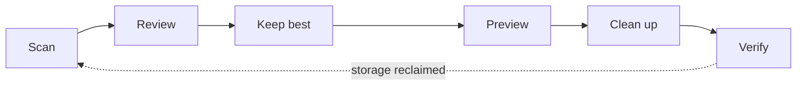
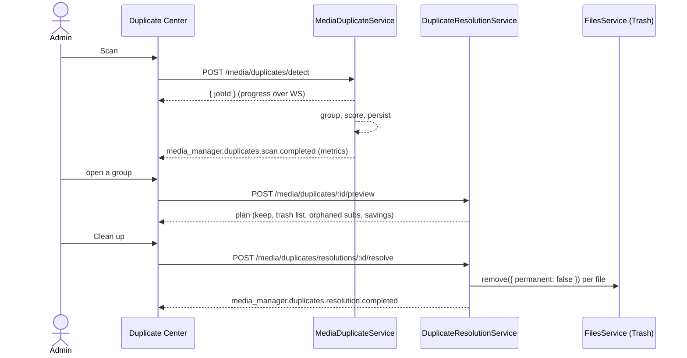

# Duplicate Center

The Duplicate Center is where an administrator finds redundant copies of media and
removes them **safely**. It is a surface of the core **Media Manager** module
(`media_manager`, route `/api/media`, menu **Media → Duplicates**), gated by the
`media_manager.*` permission block.

- Backend: `apps/backend/src/modules/media/` — `media-duplicate.service.ts`,
  `duplicate-recommendation.ts`, `duplicate-resolution.service.ts`,
  `media-show-duplicate.service.ts`
- Frontend: `apps/frontend/src/pages/media-manager/` — `MediaDuplicatesPage.tsx`
  and its panels (`DuplicateComparison`, `DuplicateCleanupDialog`, `QuickCleanPanel`,
  `DuplicateTrashPanel`, `DuplicateShowsPanel`)
- Detection design: [DUPLICATE_DETECTION.md](DUPLICATE_DETECTION.md)
- Safety model: [DUPLICATE_CLEANUP_SAFETY.md](DUPLICATE_CLEANUP_SAFETY.md)
- REST surface: [API.md → Media Manager](API.md#media-manager--apimedia)

> **Design goal:** make duplicate cleanup *easy* without making destructive mistakes
> easy. Every path in this feature is preview-then-confirm, deletion goes to Trash,
> and the engine withholds a recommendation exactly where a human should look.

---

## Contents

- [Overview](#overview)
- [The workflow](#the-workflow)
- [Duplicate types](#duplicate-types)
- [Confidence versus cleanup safety](#confidence-versus-cleanup-safety)
- [Scan modes](#scan-modes)
- [Quick Clean](#quick-clean)
- [Manual review](#manual-review)
- [Best-copy recommendation](#best-copy-recommendation)
- [Duplicate show folders](#duplicate-show-folders)
- [Bulk cleanup](#bulk-cleanup)
- [Trash and recovery](#trash-and-recovery)
- [False positives](#false-positives)
- [Settings](#settings)
- [RBAC](#rbac)
- [Automation and notifications](#automation-and-notifications)
- [Performance](#performance)
- [Security guarantees](#security-guarantees)
- [Troubleshooting](#troubleshooting)
- [Real-world examples](#real-world-examples)

---

## Overview

Two problems hide in a media library that grows by automated download:

1. **The same file, twice.** An episode grabbed by two RSS rules, a movie
   re-downloaded at a better quality without the old copy being removed, a folder
   re-imported after a move. These are *duplicate items* — different files on disk
   that are the same piece of media.
2. **The same show, in two folders.** A download filed into a folder named after the
   title (`Happys Place`) beside the folder the show already had (`Happy's Place
   (2024)`). These are *duplicate show folders* — different directories that are one
   show.

The Duplicate Center handles both, as **distinct resolution types** with distinct
safeguards, behind one page.

Nothing on this page deletes a file outright. The common workflow is
**Scan → Review → Keep best → Preview → Clean up → Verify**, and a normal cleanup is
a few obvious clicks.

## The workflow

## Duplicate types

| Type | What it is | Service | Resolution |
|---|---|---|---|
| **Duplicate item** | Two `MediaItem`s that are the same media | `MediaDuplicateService` | Keep one copy, trash the rest |
| **Duplicate show folder** | Two directories that are one show | `MediaShowDuplicateService` | Merge into a canonical folder |

The two never mix: an item group compares *files*; a folder family compares
*directories*, with its own year and canonical-key gates. See
[DUPLICATE_DETECTION.md](DUPLICATE_DETECTION.md) for how each is formed.

## Confidence versus cleanup safety

The single most important idea in this feature: **a strong detection signal is not
the same as a safe cleanup.**

- **Confidence** answers *"are these the same media?"* — a shared IMDb id, a
  matching title and year, the same season and episode.
- **Cleanup safety** answers *"can the machine pick which copy to keep without a
  human?"* — and the answer is *no* whenever the evidence is incomparable.

A group can be a high-confidence duplicate and still require review. Two copies of
the same episode where **neither file has been measured** (no probed height, bitrate,
audio) are certainly duplicates, but choosing between them is a coin toss — so the
engine refuses to nominate a keeper and marks the group `requiresReview`. See
[the recommendation engine](DUPLICATE_DETECTION.md#best-copy-recommendation).

## Scan modes

Detection runs as a **background job** (`duplicate_detect`), not inside the HTTP
request — measured at ~5 s on a 29,558-item library. Three ways it starts:

| Mode | Trigger |
|---|---|
| **Manual** | The **Scan** button, or `POST /api/media/duplicates/detect` |
| **Automation** | The `media_run_duplicate_scan` action on any automation rule |
| **Post-library-scan** | A library scan reports its duplicate-folder count as a side effect |

A run that finds nothing changed since the last scan **returns without loading the
item rows at all** — see [Performance](#performance). Progress streams over
`media_manager.duplicates.scan.progress`; a running scan can be **cancelled**, and a
cancelled scan is recorded as `cancelled`, not `failed`.

## Quick Clean

Quick Clean is the fast path for the groups that need no thought. Eligibility is
decided by the **server**, never the client: a group qualifies only if the engine
both declined to flag it for review **and** nominated a keeper. Those two go together
by design — `requiresReview` sets `recommendedItemId` to null precisely so a bulk
path cannot sweep up a case a human was meant to see.

Nothing is pre-selected. Selecting groups builds **real server-side plans**; the
operator sees the totals those plans produced and only then confirms. It is still
preview-then-confirm — just once, over many groups.

## Manual review

The **Needs Review** tab is the default landing view when anything needs a decision.
A group lands here when the engine could not safely choose:

- `different_years`, `different_episodes`, `different_editions`
- `conflicting_external_ids` — a provider id disagrees across the copies
- `runtime_mismatch` — the runtimes differ by more than 5% (a different cut)
- `incomparable_quality_evidence` — one copy is measured, another only filename-parsed
- low confidence generally

For a review group the operator picks the keeper themselves; the preview and the
cleanup then run exactly as for an auto-safe group.

## Best-copy recommendation

For a group it *can* judge, the engine ranks the copies and nominates one to keep.
The weights, in order: **resolution → bitrate → audio channels → size**, and only
**measured** metadata counts — a filename label (`1080p` in the name) never
outranks a probed height. Full rules in
[DUPLICATE_DETECTION.md → recommendation](DUPLICATE_DETECTION.md#best-copy-recommendation).

## Duplicate show folders

A duplicate show folder is resolved by **merging** the duplicates into a canonical
folder the operator chooses. The merge:

1. Shows what each folder uniquely contributes — episodes only it has, subtitle/NFO/
   artwork counts, watchlist links.
2. Lets the operator resolve each same-episode **collision** by hand (the default is
   the larger file, but that is a heuristic).
3. Persists the plan and executes **only that plan** — pinned to a fingerprint of
   every input file, so a folder that changed after the preview fails rather than
   running a stale plan.
4. Carries sidecars with their episode, and **rescues** a subtitle language the
   surviving copy lacks rather than deleting it with the folder.
5. Sends emptied folders to **Trash**, re-points watchlist links, and rescans the
   library so moved episodes land in `Season NN`.

Full detail in [DUPLICATE_CLEANUP_SAFETY.md → show merge](DUPLICATE_CLEANUP_SAFETY.md#show-folder-merge).

## Bulk cleanup

Both Quick Clean and an explicit multi-group selection go through **bulk preview →
bulk resolve**, capped at **100 groups per call** — a blast-radius limit, not a
performance one. Bulk resolve runs each plan independently and reports each outcome;
a `partial` result (some trashed, some failed) is reported as **partial**, never as a
success with a footnote.

## Trash and recovery

Every file this feature removes goes to **Trash** via
`FilesService.remove({ permanent: false })`, restorable until the retention window
expires. The **Trash & Recovery** tab lists the resolution *journal* joined to live
Trash entries — so a file purged by retention still appears, with an explicit
"no longer in Trash" state, rather than vanishing from the history. Restore reuses
the existing `/files/trash/restore` route.

## False positives

A group the operator marks **not a duplicate** is *ignored*, with a reason and an
author, and that decision **survives a rescan**: an ignored group is retained
precisely so the same false positive does not return every scan. A resolved group is
likewise kept as history. Only an **open** group that detection no longer produces is
dropped. An ignored group can be **reopened** to put it back in front of the operator.

## Settings

The Duplicate Center has no separate settings surface today; it inherits the Media
Manager's library configuration and the platform Trash retention window. Automation
rules (below) are where scheduled scans and thresholds are configured.

## RBAC

| Action | Permission |
|---|---|
| View groups, overview, comparison | `media_manager.view` |
| Run a scan, cancel a scan | `media_manager.scan` |
| Ignore / reopen a group | `media_manager.match` |
| Preview / resolve a cleanup | `media_manager.delete` |
| Merge duplicate show folders | `media_manager.rename` **and** `media_manager.delete` |

The `POST /media/duplicates/detect` route runs `deleteMany` over stale groups, so it
requires `scan`, not `view` — a read-only account cannot destroy grouping state.

## Automation and notifications

The Duplicate Center **emits domain events**; it never sends a notification directly.
See [Automation triggers and actions](#automation-and-notifications) below and the
[Notification Center](NOTIFICATION_CENTER.md).

**Automation triggers** (category *media*):

- Duplicate Scan Completed
- Duplicate Detected (high-confidence)
- Duplicate Requires Review
- Potential Savings Threshold Reached
- Duplicate Cleanup Completed
- Duplicate Cleanup Failed

**Automation actions** — all **non-destructive**:

- Run Duplicate Scan (`media_run_duplicate_scan`)
- Ignore Duplicate Group (`media_ignore_duplicate_group`)
- Generate Duplicate Report (`media_duplicate_report`)
- Refresh Media Server (`media_server_refresh`, shared)
- Send Notification (`send_notification`, shared)

> There is **no** automated destructive-cleanup action. The brief requires that one
> be opted into behind a dedicated elevated permission, a persisted preview,
> trash-only behaviour, a strict high-confidence policy and a configurable per-run
> file/byte cap. Until all of those exist, shipping the action would be shipping the
> risk. See [DUPLICATE_CLEANUP_SAFETY.md](DUPLICATE_CLEANUP_SAFETY.md#no-automated-cleanup).

**Notification events** (Notification Center): `media.duplicate`,
`media.duplicate_detected`, `media.duplicate_review_required`,
`media.duplicate_cleanup_completed`, `media.duplicate_cleanup_failed`. Payloads carry
the keys the card renderer and rule conditions read — `mediaTitle`, `wastedBytes`,
`requiresReview`, `confidence`, `reviewUrl` — so a rule can say *"only when more than
50 GB is reclaimable"* with no code change.

**WebSocket events** (scoped to `media_manager.view`):
`media_manager.duplicates.scan.{started,progress,completed,failed,cancelled}`,
`media_manager.duplicates.group.updated`,
`media_manager.duplicates.resolution.{started,progress,completed,partial,failed}`,
`media_manager.duplicates.restored`.

## Performance

- Detection is a **background job**, paged 5,000 items at a time with a narrow
  column selection, group writes batched into `$transaction` arrays of 50.
- An **unchanged rescan** short-circuits: a single Postgres query computes an md5
  over every item's identity, path, total file size and external ids, and an
  identical digest returns before a single item row is loaded (~1 s vs ~5 s).
- Show-folder detection is **bucketed** (not O(n²)) and its response is a bounded
  page — building each family walks member folders, so only the returned page
  touches disk.
- Indexes serve the real listing (`WHERE status='open' ORDER BY requiresReview DESC,
  potentialSavingsBytes DESC`) and the identity lookups detection performs.

See [ARCHITECTURE.md](ARCHITECTURE.md) → Duplicate detection for the measured
before/after figures.

## Security guarantees

Summarised here, detailed in [DUPLICATE_CLEANUP_SAFETY.md](DUPLICATE_CLEANUP_SAFETY.md):

- **Preview before change** — the client never builds a delete list; it approves a
  server-built plan and sends back only its id.
- **Plan pinning** — a cleanup is pinned to the group `version` (or, for a show
  merge, a file fingerprint); a group that changed since the preview refuses.
- **Revalidation at execution** — every path is re-checked (hard roots, library-root
  protection, existence, size) immediately before it is touched.
- **Trash-first** — deletion is always Trash, never `rm`.
- **Path confinement** — every path must resolve inside the ops hard roots.
- **Audit logging** — preview, resolve and merge all write audit records.
- **RBAC** — see the table above.

## Troubleshooting

| Symptom | Likely cause |
|---|---|
| A scan finds "0 groups" but you expected some | The library was never scanned into `MediaItem`s — run a **library** scan first. |
| The same group returns after every scan | It is *ignored*, which is why it returns intentionally — check the Ignored view; reopen if it should be actioned. |
| A group shows in **Needs Review** with no recommendation | The evidence is incomparable (unmeasured files, different editions, conflicting ids) — pick the keeper yourself. |
| "This group changed since the preview" on confirm | The library was re-detected between preview and confirm; re-open the group and preview again. |
| A cleanup reports **partial** | Some files were trashed and some failed (a path vanished or changed size) — the Trash & Recovery tab shows exactly which. |
| Show merge blocked with "Metadata Conflict" | The folders are tied only by a shared external id and their names disagree — confirm they are the same show to proceed. |

## Real-world examples

**101 groups where the wrong copy would have won.** On a live 29,558-item library, a
parsed label (`720p` in a filename) was being compared against a *measured* height
(402 px) — and the unmeasured file won at 90% confidence, auto-safe. The recommendation
engine now counts only measured evidence toward a resolution comparison, and mixed
evidence forces review. Auto-safe groups dropped 320 → 232; those 101 moved to
manual review where they belonged.

**A Portuguese subtitle that existed nowhere else.** A cleanup planned to keep a
1080p release and trash an organised copy that carried `…- Jane Foster.por.srt` — the
only Portuguese subtitle for that episode in the library. The engine now reports
orphaned subtitles rather than trashing them, and the show-folder merge rescues them
onto the surviving copy.

**139 phantom groups.** A host had 139 duplicate groups whose two members were the
**same file on disk**, created by a concurrent scan inserting a twin. The
`@@unique([libraryId, path])` constraint and an `upsert`-keyed scanner ended the
duplication; the migration cleared the phantoms.

---

See also: [DUPLICATE_DETECTION.md](DUPLICATE_DETECTION.md) ·
[DUPLICATE_CLEANUP_SAFETY.md](DUPLICATE_CLEANUP_SAFETY.md) ·
[MEDIA_MANAGER.md](MEDIA_MANAGER.md) · [API.md](API.md) ·
[NOTIFICATION_CENTER.md](NOTIFICATION_CENTER.md) · [SECURITY.md](SECURITY.md) ·
[ARCHITECTURE.md](ARCHITECTURE.md).
