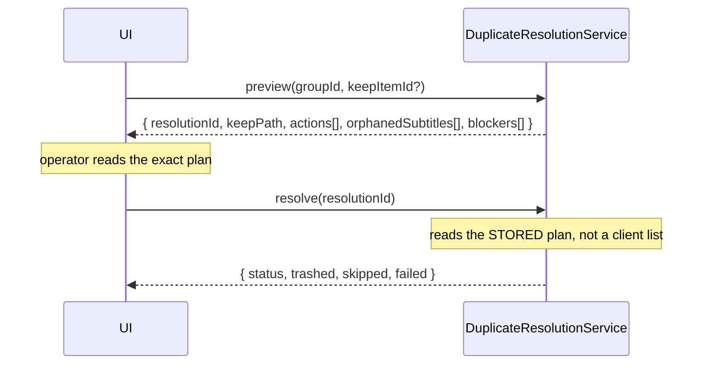
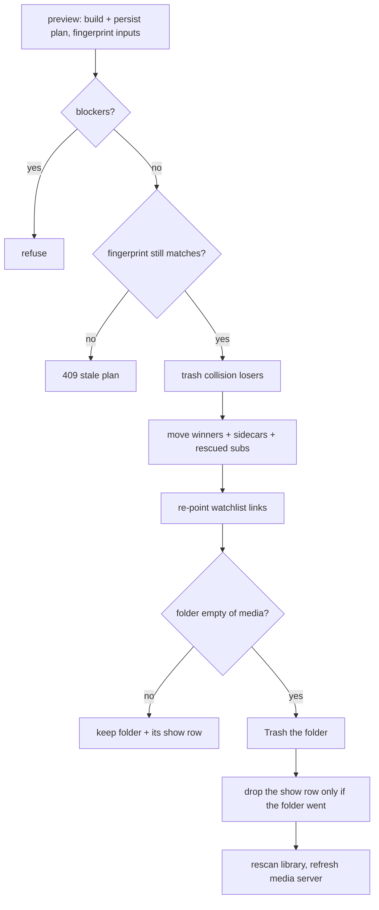

# Duplicate Cleanup Safety

Removing a duplicate deletes a file. This document is the complete list of what
stops that from becoming a mistake. It is the *safety* reference; detection is in
[DUPLICATE_DETECTION.md](DUPLICATE_DETECTION.md) and the operator surface is
[DUPLICATE_CENTER.md](DUPLICATE_CENTER.md).

- File cleanup: `apps/backend/src/modules/media/duplicate-resolution.service.ts`
- Show merge: `apps/backend/src/modules/media/media-show-duplicate.service.ts`

---

## Contents

- [The one-line promise](#the-one-line-promise)
- [Preview before change](#preview-before-change)
- [The plan that executes is the plan that was approved](#the-plan-that-executes-is-the-plan-that-was-approved)
- [Revalidation at execution](#revalidation-at-execution)
- [Trash-first deletion](#trash-first-deletion)
- [Sidecars and orphaned subtitles](#sidecars-and-orphaned-subtitles)
- [Show-folder merge](#show-folder-merge)
- [Bulk safety](#bulk-safety)
- [Honest reporting](#honest-reporting)
- [Path confinement and library-root protection](#path-confinement-and-library-root-protection)
- [Audit and RBAC](#audit-and-rbac)
- [No automated cleanup](#no-automated-cleanup)
- [The full safety checklist](#the-full-safety-checklist)

---

## The one-line promise

**The client never decides what gets deleted.** It asks the server for a plan,
displays exactly that plan, and sends back only the plan's id. What executes is what
the operator read — a client cannot hand-craft a list of files to delete.

## Preview before change

`preview` persists the plan to `media_duplicate_resolutions`. `resolve` takes only a
`resolutionId` and reads the stored plan back. A group that **requires review** has
no server-nominated keeper, so previewing one *requires* an explicit `keepItemId` —
the engine's withheld recommendation cannot be bypassed by the cleanup path.

## The plan that executes is the plan that was approved

A preview is a statement about the past. Two mechanisms make sure the operator
approved the present:

- **Version pinning (file cleanup).** The plan records the group `version`. Detection
  bumps `version` on every re-detection, so a plan built against an older version is
  refused with a 409 — a group whose membership changed since the operator looked is
  not acted on.
- **Fingerprint pinning (show merge).** A show family has no `version`, so the plan is
  pinned to a sha256 of every input file's **path and size**. Anything added,
  removed, or resized in those folders between preview and confirm fails the merge
  rather than running a stale plan.

## Revalidation at execution

Even with an approved plan, every path is re-checked **immediately before it is
touched**, never trusting the preview:

- hard-root confinement (`assertWithinHardRoots`)
- library-root protection (refuse to delete a library root)
- existence — a file that vanished is **skipped**, not an error
- size — a file whose size changed since preview is **skipped** (it was replaced or
  is still being written; the operator approved a *specific* file)
- the keeper must still exist — trashing the redundant copies when the keeper has
  vanished would leave no copy at all, so the whole cleanup refuses

Each action is **journalled to `media_duplicate_resolution_actions` before it is
attempted** — a database transaction cannot roll back a file that already moved, so
recovery needs a record of intent that survives a crash mid-operation.

## Per-file decisions: keep this, or delete this

The comparison view puts the decision on each copy. Every candidate carries two
buttons, and both route through the same preview-then-confirm plan:

- **Keep this** — keep this copy and send every *other* copy in the group to Trash.
  The group collapses to one file. Backed by `preview(groupId, keepItemId)`.
- **Delete** — send *only this copy* to Trash and keep the rest. For thinning a
  three-plus group without collapsing it. Backed by
  `previewItemDeletion(groupId, deleteItemId)` →
  `POST /api/media/duplicates/:groupId/preview-delete`.

The delete path carries one extra invariant beyond the shared safeguards: **it can
never remove the last copy.** The plan records every surviving copy's path, and
`resolve` refuses if none of them still exists on disk — so even a race that removed
the other copies between preview and confirm cannot leave zero copies of the media.
Subtitle safety generalises the same way: a language is safe to trash on the removed
copy only if *some surviving copy* still has it; a language that exists nowhere among
the survivors is reported as orphaned, not deleted.

A single-file deletion also **does not mark the group resolved** — two or more copies
may still be duplicated afterwards, and marking it resolved would hide a group that is
still a duplicate. The next detection run reconciles it against what is now on disk.

## Trash-first deletion

Deletion is **always Trash**, never `rm`:
`FilesService.remove({ permanent: false })` writes a `TrashItem` restorable until the
retention window expires. The **Trash & Recovery** tab lists the resolution journal
joined to live Trash entries, so even a file purged by retention keeps a visible
"no longer in Trash" history entry rather than vanishing.

## Sidecars and orphaned subtitles

When a copy is removed, files named after it are handled by what losing them costs:

- A `.nfo`, `-thumb.jpg`, `-mediainfo.xml` describes *that* video and is worthless
  once it is gone — trashed with it.
- A **subtitle** is content. A language the kept copy does **not** already have is
  **not** trashed and **not** silently orphaned — it is *reported* (file cleanup) or
  *rescued onto the surviving copy* (show merge). This exists because a live cleanup
  would otherwise have destroyed the only Portuguese subtitle for an episode in the
  whole library.

Sidecars are matched **structurally** (basename + an optional `-`/`.` marker), the
same rule the renamer uses — so show-level files (`poster.jpg`, `tvshow.nfo`,
`theme.mp3`, `season01-poster.jpg`) are named after the *folder*, never match an
episode, and are never touched.

## Show-folder merge

Merging duplicate show folders is the most destructive operation in the feature —
it moves files **and** deletes folders. Its safeguards, in execution order:

Additional rules:

- **Never merge on a suspicious external id alone.** A `metadata_conflict` family
  carries a blocker until the operator explicitly acknowledges the folders are the
  same show.
- **Collision winners can be chosen** per episode; the size default is only a
  heuristic. A chosen winner is validated server-side against that episode's actual
  files.
- **A folder is only deleted once it holds no video and no subtitle.** Its `MediaShow`
  row is dropped **only if the folder actually went** — deleting the row for a
  surviving folder would hide it from the next detection pass.
- **Watchlist links are re-pointed before the row is deleted**, so the FK's
  `ON DELETE SET NULL` cannot silently unbind the show.
- **A folder cannot be merged into itself**, and a **library root** is never deleted.

## Bulk safety

- Capped at **100 groups per call** — a blast-radius limit, so a mis-click loses a
  reviewable number of files, not a library.
- Eligibility for the auto-safe (Quick Clean) path is **server-decided**: a group
  qualifies only if the engine both declined review **and** nominated a keeper.
- A review-required group in a bulk selection is **refused**, not silently dropped —
  a caller cannot believe a selection was fully planned when part of it was ignored.
- Each plan runs **independently**; one failure does not abort the rest.

## Honest reporting

A cleanup reports what actually happened:

- `completed` — everything trashed
- `partial` — some trashed, some skipped/failed — reported **as partial**, with a
  distinct WS event and notification, never as a success with a count in the corner
- `failed` — nothing trashed

An HTTP 200 carrying failures rendered as "done" is how an operator learns to
distrust the tool, so the envelope makes the three outcomes distinguishable
everywhere — API, WebSocket, and notification.

## Path confinement and library-root protection

Every path a cleanup or merge touches must resolve **inside the ops hard roots**
(`FilePathService.assertWithinHardRoots`), checked at both preview and execution. A
path equal to a **library root** is refused outright — deleting one would take the
whole library. These checks are re-run at execution against the world as it is *now*,
not as the preview described it.

## Audit and RBAC

Every preview, resolve, and merge writes an **audit record** (actor, action, object,
outcome). Permissions:

| Action | Permission |
|---|---|
| Preview / resolve a file cleanup | `media_manager.delete` |
| Merge duplicate show folders | `media_manager.rename` **and** `media_manager.delete` |
| Run / cancel a scan | `media_manager.scan` |
| Ignore / reopen a group | `media_manager.match` |

## No automated cleanup

There is **no automation action that resolves duplicates destructively**, by design.
The automation catalog offers *Run Duplicate Scan*, *Ignore Duplicate Group*, and
*Generate Duplicate Report* — all non-destructive.

If a future destructive action is added, the brief requires **all** of:

- explicit opt-in
- a strict high-confidence policy
- preview persistence
- Trash-only behaviour
- a dedicated elevated permission
- a configurable maximum files/bytes per run

None of those guardrails exists yet, and shipping the action before them is shipping
the risk. It is deliberately absent.

## The full safety checklist

Every item the redesign brief asked to preserve, and where it lives:

| Guarantee | Where |
|---|---|
| Movie year separation | `title_year` key is year-aware |
| Season/episode identity | `show_season_episode` key |
| Series identity | title-scoped external-id key for TV |
| Compatible-year checks (folders) | `MediaShowDuplicateService.detect` |
| External-ID safeguards | series-level ids scoped by show+episode |
| Review for suspicious provider metadata | `conflicting_external_ids`, `metadata_conflict` |
| Preview before change | `preview` persists; `resolve` reads the stored plan |
| Plan pinning | group `version` / file fingerprint |
| Revalidation at execution | existence/size/root re-checks per path |
| Trash-first deletion | `FilesService.remove({ permanent: false })` |
| Library-root protection | refuse a path equal to a library root |
| Path confinement | `assertWithinHardRoots` at preview and execution |
| Watchlist relationship preservation | re-point before deleting the show row |
| Orphaned-subtitle protection | reported (cleanup) / rescued (merge) |
| Audit logging | preview, resolve, merge all audited |
| RBAC enforcement | permission table above |
| Blast-radius cap | 100 groups per bulk call |
| Honest partial reporting | distinct `partial` status + event |
| No automated destructive cleanup | action deliberately absent |

---

See also: [DUPLICATE_CENTER.md](DUPLICATE_CENTER.md) ·
[DUPLICATE_DETECTION.md](DUPLICATE_DETECTION.md) · [SECURITY.md](SECURITY.md) ·
[MEDIA_MANAGER.md](MEDIA_MANAGER.md) · [ARCHITECTURE.md](ARCHITECTURE.md).
