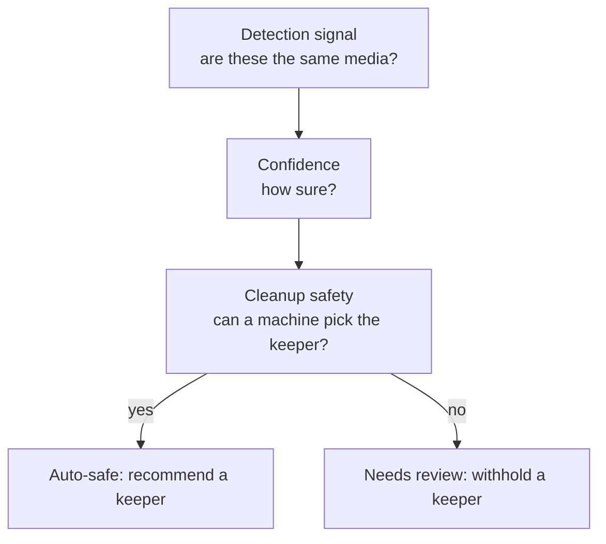
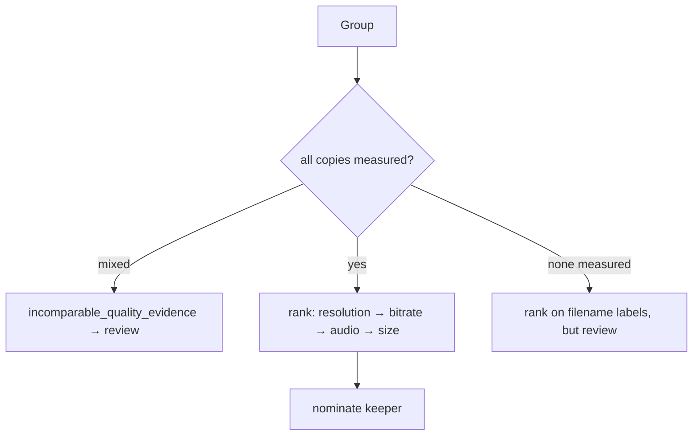

# Duplicate Detection

How the Duplicate Center decides two pieces of media are the same, and how it ranks
the copies. This is the *detection and recommendation* reference; the surface that
uses it is [DUPLICATE_CENTER.md](DUPLICATE_CENTER.md), and the guarantees around
*removing* a duplicate are in
[DUPLICATE_CLEANUP_SAFETY.md](DUPLICATE_CLEANUP_SAFETY.md).

- Grouping: `apps/backend/src/modules/media/media-duplicate.service.ts`
  (`duplicateKeys`, `detectDuplicateGroups`)
- Recommendation: `apps/backend/src/modules/media/duplicate-recommendation.ts`
- Show folders: `apps/backend/src/modules/media/media-show-duplicate.service.ts`

---

## Contents

- [Detection is not safety](#detection-is-not-safety)
- [How items are grouped](#how-items-are-grouped)
- [Detection reasons](#detection-reasons)
- [TV episode identity](#tv-episode-identity)
- [Movie identity](#movie-identity)
- [Show-folder detection](#show-folder-detection)
- [Best-copy recommendation](#best-copy-recommendation)
- [What forces review](#what-forces-review)
- [False-positive persistence](#false-positive-persistence)
- [What does not exist yet](#what-does-not-exist-yet)

---

## Detection is not safety

Three separate questions, kept separate on purpose:

A match can be a perfectly good *detection signal* without being *safe to resolve
automatically*. Two copies of one episode where nothing was measured are certainly
the same episode — and choosing between them is still a coin toss. The engine treats
those as different axes: a group can be high-confidence and still require review.

## How items are grouped

Grouping is a **bucketing** pass, not a pairwise comparison. Each item emits one or
more keys (`duplicateKeys`); items sharing a key are candidates; the final groups are
resolved in priority order so an item is claimed by its **strongest** signal:

Priority order is `external_id` → `show_season_episode` → `title_year` →
`similar_filename`. A `groupKey` is carried through so the same real-world group keeps
**one identity across scans** — which is what makes an "ignored" decision persist.

## Detection reasons

| Reason | Applies to | Key shape |
|---|---|---|
| `external_id` | movies (strong); TV (scoped) | `external_id:<provider>:<id>[:<title><ep>]` |
| `show_season_episode` | identified TV | `sse:<title>:s<season>:e<episode>` |
| `title_year` | movies / show-level | `title_year:<title>:<year>` |
| `similar_filename` | fallback | `fn:<title><discriminator>` |

## TV episode identity

TV is where naïve detection goes wrong, so the rules are strict:

- **Identity is show + season + episode.** Season/episode come from the structured
  columns first; an unidentified episode falls back to the `SxxEyy` parsed from its
  filename (`episodeMarker`).
- **A series-level provider id is never sufficient episode identity.** Providers
  store a *series* id on every episode row, and real data even repeats one id across
  *different shows*. So for non-movies the `external_id` key is **scoped by show title
  and episode** — a contaminated shared id cannot collapse distinct episodes, while
  two files of the same episode still match. (This was a real bug: a TVDB series id
  grouped an entire series as "duplicates".)
- **Null season/episode** items are separated by the `SxxEyy` in their title, so two
  different unidentified episodes are not merged.

## Movie identity

- **Title is year-aware.** `Aladdin (1992)` and `Aladdin (2019)` produce different
  `title_year` keys and never collapse.
- **External id is strong** for movies, because it is an entity-level id.
- **Edition/cut is considered** by the recommendation engine (below): a theatrical
  and a director's cut are the same title but not interchangeable copies.

## Show-folder detection

Duplicate *folders* are a separate pass (`MediaShowDuplicateService.detect`):

- Two folders are tied by a shared **canonical key with compatible years**, or by a
  shared **IMDb id**.
- The **year check is load-bearing**: `Dark Matter (2015)` and `Dark Matter (2024)`
  canonicalize identically but are different series, so a year disagreement keeps them
  apart.
- Canonical matching is **equality only** — never a substring test, so `Ghosts US`
  cannot collide with `Ghosts UK`.
- A family tied **only by a shared IMDb id**, whose folder names disagree, is a
  `metadata_conflict` — surfaced but flagged `Metadata Conflict — Manual Review
  Required`, because one mis-tagged episode is enough to link two unrelated shows.
- Detection is **bucketed** by key and by id (not O(n²)) and returns a **bounded
  page** — each family costs a recursive folder walk, so only the returned page
  touches disk.

## Best-copy recommendation

For a group it can judge, the engine (`recommend`) ranks the copies and nominates one
to keep. Two rules matter most:

**Weights, in strict order:** resolution (1000) → bitrate (100) → audio channels
(10) → size (1). A better resolution always wins; size only breaks a tie where
everything measurable is equal.

**Only measured evidence counts toward a comparison.** A filename label (`1080p` in
the name) is *not* a measured height. If some copies were probed and others were
only filename-parsed, the resolution comparison is **incomparable** — the engine
raises `incomparable_quality_evidence` and forces review rather than letting the
unmeasured file win. This is the fix for the 101-group bug where a parsed `720p`
label beat a measured `402 px` height and the unmeasured file won at 90% confidence.

## What forces review

The engine withholds a keeper (`recommendedItemId = null`, `requiresReview = true`)
on any of:

- `different_years` — the copies disagree about the year
- `different_episodes` — the copies are different episodes
- `different_editions` — theatrical vs director's cut, IMAX, remaster, etc.
- `conflicting_external_ids` — a provider id disagrees across copies
- `runtime_mismatch` — runtimes differ by more than 5% (a different cut)
- `incomparable_quality_evidence` — measured vs filename-only evidence
- low confidence generally

Because `recommendedItemId` is null exactly here, **no bulk or automation path can
touch a review group** — the withheld recommendation is the gate.

## False-positive persistence

An **ignored** decision is stored on the group with a reason and an author, and a
rescan **keeps** it: an ignored group is retained precisely so the same false
positive does not return every scan. The persistence rests on the stable `groupKey`,
so "this is not a duplicate" survives even as detection runs again. A **resolved**
group is kept as history. Only an **open** group detection no longer produces is
dropped. An ignored group can be **reopened**.

## What does not exist yet

Honesty about the gaps, because the brief lists them as if they exist:

- **No content hashing.** There is no `exact_hash` or `episode_hash` reason —
  detection is identity-based (title/year, show+season+episode, external id,
  filename), not byte-based. The redesign brief lists exact-hash detection as
  existing safety logic; it does not exist in this codebase.
- Because there is no hashing, the "cache fingerprints, recompute only on size/mtime
  change" performance requirement has nothing to recompute. The scan does cache an
  **input digest** (identity + path + size + external ids) to skip unchanged rescans,
  but that is change-detection for the whole library, not per-file content
  fingerprinting.

---

See also: [DUPLICATE_CENTER.md](DUPLICATE_CENTER.md) ·
[DUPLICATE_CLEANUP_SAFETY.md](DUPLICATE_CLEANUP_SAFETY.md) ·
[MEDIA_MANAGER.md](MEDIA_MANAGER.md) · [ARCHITECTURE.md](ARCHITECTURE.md).
