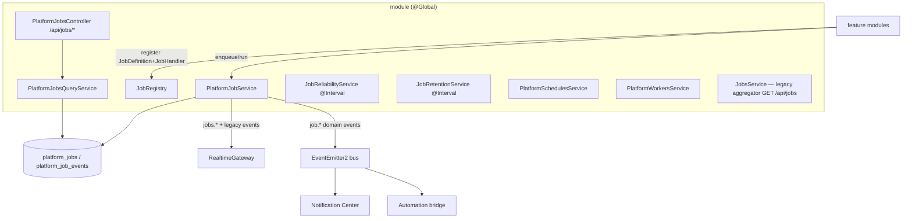

# Job Architecture

The internals of the Unified Jobs Center's platform engine. See
[UNIFIED_JOBS_CENTER.md](UNIFIED_JOBS_CENTER.md) for the product, and
[UNIFIED_JOBS_CENTER_ARCHITECTURE_REVIEW.md](UNIFIED_JOBS_CENTER_ARCHITECTURE_REVIEW.md) for
the current-state review that motivated the design.

## Components (`apps/backend/src/modules/jobs/`)

- **`JobRegistry`** — modules declare a `JobDefinition` (type, module, permission,
  capabilities, input validation/summary) + a `JobHandler`. Duplicate/invalid registrations
  are rejected. The Jobs Center reads only this metadata; it never imports module services.
- **`PlatformJobService`** — the **single writer** of `platform_jobs`/`platform_job_events`.
  Owns enqueue, execution (in-process, with an inline-executor path for adapters), the state
  machine, progress (throttled), structured events, retry/pause/resume/rerun, cancellation,
  redaction, WS emission, and domain-event publication.
- **`PlatformJobsQueryService`** — RBAC-scoped, paginated reads; maps rows to sanitized DTOs
  (`inputData`/`checkpoint` never exposed).
- **Reliability / Retention** — `@Interval` services for stall detection and (observable)
  retention cleanup.
- **Schedules / Workers** — honest read-only inventories.
- **`JobsService`** — the pre-existing read-only aggregator (`GET /api/jobs`) that still
  feeds the workspace Jobs widgets; media & subtitle now come from `platform_jobs`.

## Data model

- **`platform_jobs`** — the normalized superset: identity (type/module/workspace/source/
  correlation), relations (parent/root/schedule), resource (library/mediaItem/…), lifecycle
  (status/phase/progress/timestamps), execution controls (priority/attempt/maxAttempts/
  retryPolicy/timeout/capabilities/idempotencyKey/checkpoint), ownership (createdBy/runAs/
  requiredPermission/visibilityScope), and **sanitized** I/O (`inputSummary`/`resultSummary`/
  `errorCode`/`errorMessage`/`warnings`/`metrics`/`metadata`) plus a re-execution `inputData`.
  Composite indexes cover the Jobs Center's query patterns (status+createdAt, status+priority+
  queuedAt, workspace/module/type+status, parent, root, correlation, worker+status,
  scheduledFor+status, heartbeatAt+status, idempotencyKey).
- **`platform_job_events`** — a bounded structured log (`sequence`, `level`, `eventType`,
  `messageKey`/`messageParams`/`sanitizedMessage`, `progress`, `metadata`), monotonic per
  job, cascade-deleted with the job. Never an unbounded text field on the job row.

Legacy per-module job tables remain; the two live engines are adapters over the platform.

## Execution model

In-process (matching the pre-existing engines — no external broker). `run`/`runDetached`
create a row and execute the body inline; a `JobExecutionContext` is the handler's only
touchpoint for progress, events, heartbeat, checkpoints, cancellation, and metrics. Orphans
(rows left running by a dead process) are failed out at boot. The contract is designed so a
future durable multi-worker can run the same handlers unchanged.
