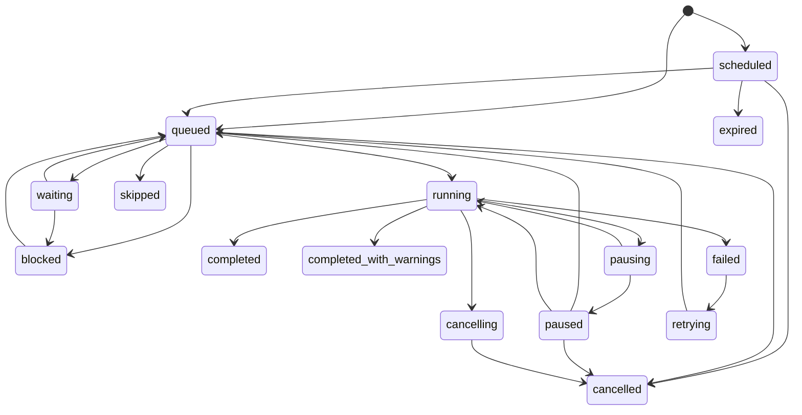

# Job Lifecycle & State Machine

The Unified Jobs Center enforces a job state machine server-side
(`modules/jobs/platform/job-status.ts`). Every lifecycle change — from a handler, an adapter,
or the API — goes through one gate; illegal transitions throw `InvalidJobTransitionError`.

## Statuses (15)

`scheduled · queued · waiting · blocked · running · pausing · paused · retrying · completed ·
completed_with_warnings · failed · cancelling · cancelled · skipped · expired`

- **Terminal:** `completed`, `completed_with_warnings`, `cancelled`, `skipped`, `expired`.
- **Semi-terminal:** `failed` (may go to `retrying`).
- **Active** (counted for queue depth / reconciliation): everything else.

## Transition matrix

(`waiting`/`blocked` may also `→ expired` on dependency timeout; `scheduled` may `→ expired`.)

## Lifecycle walk-through

1. **Create** → `queued` (or `scheduled`). Emits `created` + `queued` events; publishes the
   `jobs.created`/`jobs.queued` WS events (scoped to the job's permission).
2. **Run** → `running`; `started` event. The handler reports **progress** (persisted throttled
   to ~1/s, emitted more often over WS) and appends **structured events**.
3. **Finish** → `completed`, or `completed_with_warnings` if the handler recorded warnings
   (also publishes a `job.completed_with_warnings` domain event).
4. **Fail** → `failed` with a **sanitized** error (stack stripped, secrets redacted);
   publishes `job.failed`. If retryable and attempts remain, it walks
   `failed → retrying → queued → running` with exponential backoff (each attempt recorded).
5. **Cancel** → cooperative: `running → cancelling → cancelled` at a safe boundary a queued
   job cancels immediately. A cancellation is **never** reported as a failure.
6. **Pause/Resume** → only for checkpoint-capable handlers: `running → pausing → paused`
   after a checkpoint is saved; `resume` re-executes from it.
7. **Stall** → a running job with no heartbeat past the threshold is flagged `stalled` (an
   advisory event, not an auto-failure).
8. **Retention** → terminal jobs are pruned after their retention window by the observable
   `jobs.retention_cleanup` job.

The full matrix is covered by `job-status.spec.ts` (valid + invalid transitions).
