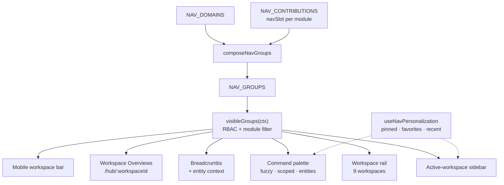

# Navigation & App Shell

UltraTorrent's UI navigation is a single **declarative, typed tree** consumed by every
navigation surface. There are no editions or license tiers — visibility is controlled
**only** by RBAC permissions and module enablement. The server remains authoritative;
UI hiding is a convenience layer.

> **Shell model:** the app runs the **Workspace model** — a fixed global rail lists only
> the nine Workspaces; selecting one *replaces* the sidebar with that Workspace's own nav.
> This document covers the underlying nav model (the registry, filtering, palette,
> breadcrumbs) that every surface shares. For the shell itself — the rail, Workspace
> Overviews, switching, jobs — see **[WORKSPACE_ARCHITECTURE.md](WORKSPACE_ARCHITECTURE.md)**.
> The eight-domain vocabulary below is the same mechanism; a "domain" *is* a Workspace.

## Source of truth

`apps/frontend/src/components/layout/navigation.ts`

- `NAV_GROUPS: NavGroup[]` — the information architecture (groups → items →
  optional nested children). Every `to` maps to a real route in `App.tsx`.
- `NavGroup` — `{ id, title, icon, items }`.
- `NavItem` — `{ id, label, icon, to?, action?, external?, href?, children?,
  permission?, module?, end?, adminOnly?, superAdminOnly?, descriptionKey? }`.
  `external` marks an off-app link (the Prowlarr entry); `href` is its
  runtime-resolved URL.
- `visibleGroups(ctx)` — filters the tree for the current user.
- `flattenForSearch(groups)` — flattens (filtered) groups into command-palette entries.
- `isItemActive` / `isBranchActive` — query-aware active + branch-active checks.
- `tNav(t, section, english)` — resolves a canonical-English key to a localized string.

All labels are **canonical-English keys**, never hardcoded display text. They are
translated at render time via the `nav` i18n namespace (`groups`, `items`,
`descriptions`, `details`). Adding a label without a matching `nav` key fails the
`i18n.test.ts` nav-coverage test.

## One source, many surfaces

Every navigation surface is a projection of the same RBAC/module-filtered tree —
filter once in `visibleGroups`, then render. Nothing re-derives the item list, so
nothing drifts.

## Navigation hierarchy

The navigation is organised into **domains** (Phase 1 of the redesign — see
[NAVIGATION_REDESIGN.md](NAVIGATION_REDESIGN.md)). A domain groups related modules so
the rail stays short as the platform grows; Media consolidates Media Manager +
Subtitles, Automation folds in the Notification Center, and Monitoring hosts Media
Server Analytics. Sub-modules with many pages (Subtitles, Notifications, Media Server
Analytics) nest under a parent whose own route is the module's dashboard.

| Domain | Entries (→ route) |
|--------|-------------------|
| **Dashboard** | Dashboard → `/dashboard` · Search → command palette |
| **Downloads** | Torrents → `/torrents` (sub-menu: Downloading/Seeding/Completed/Paused/Errors) · RSS Feeds → `/rss` · Indexers → `/indexers` · **Prowlarr** *(external link — shown only when the [Prowlarr integration](PROWLARR.md) is enabled and the user has `integrations.prowlarr.open`)* · Release Scoring → `/release-scoring` · Acquisition Intelligence → `/media-acquisition` (sub-menu: Smart Download, Missing Episodes, Decision Simulator) · Engines → `/engines` |
| **Media** | Media Dashboard → `/media` · Media Items → `/media/items` · Libraries → `/media/libraries` · Unmatched Media → `/media/unmatched` · Duplicates → `/media/duplicates` · Rename Engine → `/media/rename-preview` · **Subtitles** → `/subtitles` (sub-menu: Search, Sync, Validation, Languages, History, Providers, Settings) · IMDb Settings → `/media/settings/imdb` · Media Settings → `/media/settings` |
| **Automation** | Automation Rules → `/automation` · **Notifications** → `/notifications` (sub-menu: Channels, Rules, Templates, Recipients, Recipient Groups, Delivery History, Queue Monitor, Provider Health, Preferences, Settings) |
| **Files** | File Manager → `/files` |
| **Monitoring** | **Media Server Analytics** *(module-gated)* → `/media-server-analytics` (sub-menu: Live Activity, Recently Added, Watch History, Analytics Reports, Newsletters, Import Analytics, Server Connections) |
| **Administration** | Users → `/users` · Modules → `/modules` · Settings → `/settings` · Audit Log → `/audit` |
| **Account** | Profile → `/account` |

> **Redesign in progress.** This reflects Phase-1 (the IA re-group). Later phases add
> pinned/favorites/recent, an entity-aware command palette, badges, module landing
> hubs, contextual sub-nav, a redesigned mobile drawer, and a registry-driven rail —
> tracked in [NAVIGATION_REDESIGN.md](NAVIGATION_REDESIGN.md).

### Spec sub-features that are page sections (not separate routes)

Some finer sub-features live **inside** a page rather than as standalone routes,
so they appear under their page entry rather than as dead links:

- **Media Settings** hosts Metadata Providers, Artwork preferences, Subtitle
  preferences and Media Server Integrations. (**NFO generation** is *not* here —
  it lives on the media-item detail page, `/media/items/:id`.)
- **Automation Rules** hosts Triggers & Actions (the rule editor) and Job History
  (the per-rule logs dialog).
- **File Manager** hosts Trash and the Cleanup Wizard.
- **Settings** hosts the **Default Root Path** section (its own validated, audited
  `PUT /api/files/root` route), the Prowlarr integration card, the Media Server
  Analytics email + newsletter-image cards, and the generic key/value settings
  list.
- **Users** hosts Roles & Permissions (role assignment); **Profile** hosts Change
  Password and Two-Factor Authentication. **Language** and **Sign out** live in
  the top-bar user menu.

> **No UI, despite a backend:** **API Keys** have a working REST surface
> (`/api/api-keys`) but **no frontend page or section at all** — and the keys they
> mint cannot authenticate a request anyway (see
> [SECURITY.md](SECURITY.md#api-keys-are-not-a-credential-yet)). There is likewise
> no Webhooks page and no Sessions section on Profile. Do not link to them from
> the nav until they exist.

When any of these graduates to its own route, add a `NavItem` (ideally a nested
child under the page's entry) plus its `nav` keys.

## Behavior

- **Collapsible groups** — each top-level group header toggles its items;
  collapse state persists in `localStorage` (`ut.nav.groups.collapsed`). A group
  containing the active route **auto-expands** regardless.
- **Collapsible sub-menus** — items with `children` expand/collapse (chevron);
  state persists (`ut.nav.items.expanded`) and the active branch auto-expands.
- **Icon-only rail** — the sidebar collapses to icons (`ut.sidebar.collapsed`);
  every row shows a `title` tooltip. Nested children are reached by expanding the rail.
- **Mobile** — a hamburger opens a slide-in drawer; navigating closes it; Escape,
  backdrop-click, and a **left-swipe** (`useSwipeToDismiss`) dismiss it. A fixed
  **bottom domain switcher** (`MobileDomainBar`, `lg:hidden`) puts every domain one
  tap away via its landing hub, with a trailing *Menu* button for the full drawer.
- **Active highlighting** — exact for `end` items and query-param views
  (`/torrents?state=…`), prefix for detail pages (`/media/items/:id` keeps
  *Media Items* active). Parents highlight when a descendant is active.
- **Breadcrumbs** — derived from the tree: `Group › [Parent ›] Item [› Detail]`. A
  detail page can name its entity (`useBreadcrumbEntity`) so the trail ends with e.g.
  the media item's title instead of a generic *Details*. A domain hub
  (`/hub/:domainId`) resolves to its domain crumb.
- **Pinned / Favorites / Recent** — per-user, persisted personalization
  (`useNavPersonalization`, keyed by user id). Pinned items get a top-of-rail
  section; Recent tracks the last 8 visited pages; all three seed the palette's
  quick-access view.
- **Module landing hubs** — every domain has a landing page at `/hub/:domainId`
  (`ModuleHubPage` → `ModuleHub`), built from the same nav data: one tile per page,
  sub-pages as chips. Sidebar group headers and the collapsed-rail domain icons link
  to the hub.
- **Contextual sub-nav** — `ContextualSubNav` renders the active domain's sibling
  pages as a horizontal strip below the top bar (a second row for a nested branch's
  sub-pages), so a user moves laterally without the sidebar. Same filtered nav data —
  never a link the sidebar lacks.

## Command palette (Ctrl/Cmd + K)

`apps/frontend/src/components/layout/CommandPalette.tsx`

- Opens with **Ctrl+K / Cmd+K**, the top-bar Search button, or the Overview →
  Search entry.
- Searches the **already-filtered** navigation entries (RBAC + module aware), so
  it can never surface a route the user isn't allowed to see.
- Matches label, group and description; `↑/↓` move, `Enter` navigates, `Esc`
  closes; includes an empty state. Fully localized (`shell.command.*`).
- **Command palette v2** — with an empty query it surfaces the user's **Pinned,
  Recent and Favorites** (quick-access). With a query it adds **quick actions**
  (add torrent, scan library, find duplicates, create RSS rule, automation rules)
  and **live entities** (media items, libraries) fetched through lazy, debounced
  providers (`usePaletteProviders`). Inline pin/star toggles write straight to
  personalization.

## RBAC & module visibility rules

`visibleGroups(ctx)` where `ctx = { hasPermission, isEnabled, canManageModules, isSuperAdmin }`:

1. An item with `permission` is hidden unless the user holds it.
2. An item with `module` is hidden when the module is **disabled** — *unless* the
   user can manage modules (`modules.manage`), so admins can still reach the
   locked-module page.
3. `adminOnly` requires module-management; `superAdminOnly` requires the super-admin role.
4. A parent with no visible children **and** no own destination is dropped; a
   group with no visible items is dropped (no bare headers).
5. Module enablement is **never** authorization. Route guards (`ProtectedRoute`
   for permissions, `ModuleRoute` for enablement) remain the enforcement point;
   the palette and breadcrumbs only ever show already-filtered entries.

## Registry-driven rail

The sidebar is **composed**, not hand-ordered. `navigation.ts` defines:

- **`NAV_DOMAINS`** — the fixed top-level domains (id, title, icon, `order`).
- **`NAV_CONTRIBUTIONS`** — an array of `{ slot: { domain, order }, item }`. Each entry
  is a module's top-level nav item and *declares where it goes* (`navSlot`).
- **`composeNavGroups()`** — groups contributions by domain, sorts by `slot.order`,
  drops empty domains, and routes any contribution whose domain is unknown into an
  auto-appended **Extensions** area (so a plugin can register nav without touching the
  core rail). `NAV_GROUPS = composeNavGroups()`.

So a module is placed by **appending one contribution** — no re-ordering an array, no
renumbering neighbours (orders leave gaps of 10). Sub-pages travel inside the module's
`item.children`, not as slots.

## Adding navigation for a new module

1. Add the route(s) in `App.tsx`, wrapped in `ProtectedRoute` (permission) and,
   for module-gated features, `ModuleRoute`.
2. Append a **`NavContribution`** to `NAV_CONTRIBUTIONS` in `navigation.ts`: pick a
   `slot.domain` (from `NAV_DOMAINS`) and an `order`, and give the `item` a stable
   `id`, `icon`, `permission`/`module` gates, and a `descriptionKey`. (A new *domain*
   is a rare event — add it to `NAV_DOMAINS` only when a capability genuinely doesn't
   belong to any existing one.)
3. Add the label/description keys to **both** `en-US/nav.json` and
   `es-PR/nav.json` (`groups` / `items` / `descriptions`) — parity is enforced by tests.
4. If it introduces detail routes, extend `DETAIL_LABELS` in `Breadcrumbs.tsx`. For
   a rich detail page, call `useBreadcrumbEntity(pathname, entity?.name)` so the trail
   ends with the entity's name instead of *Details*.

A new module needs **no** extra wiring for the landing hub, contextual sub-nav, or
mobile domain bar — all three are composed from `NAV_GROUPS`, so appending the
contribution lights them up automatically.

## Accessibility

Semantic `<nav>` landmarks; `aria-expanded` on group/sub-menu toggles;
`aria-current="page"` on active rows; focus-visible rings throughout; icon-rail
tooltips; Escape closes the drawer and palette; Enter/Arrow keys drive the palette.

## Tests

- `navigation.test.ts` — tree filtering, module-manager visibility, child pruning,
  active/branch matching, search flattening, `resolveActiveContext`.
- `Breadcrumbs.test.ts` — nested + detail trails, `/hub/:domainId` → domain crumb.
- `BreadcrumbContext.test.tsx` — entity label replaces *Details*; path-scoping.
- `CommandPalette.test.tsx` — filtering, empty state, keyboard.
- `ModuleHub.test.tsx` — tiles per navigable page, sub-page chips, action skipping.
- `ContextualSubNav.test.tsx` — sibling tabs, branch children row, active state.
- `MobileDomainBar.test.tsx` — per-domain tabs, active domain, menu button.
- `useSwipe.test.tsx` — swipe threshold, vertical-scroll rejection, direction.
- `useNavBadges.test.tsx` / `useNavPersonalization.test.tsx` — badges; pin/fav/recent.
- `i18n.test.ts` — en-US/es-PR key parity + nav-label coverage.

See also [MENU_GUIDELINES.md](MENU_GUIDELINES.md) (where things go) and
[UX_GUIDELINES.md](UX_GUIDELINES.md) (how the shell behaves).
