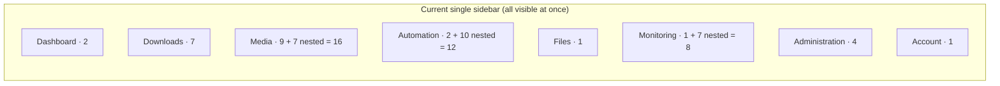
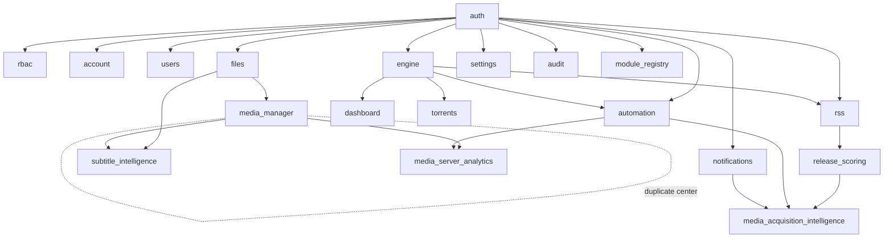
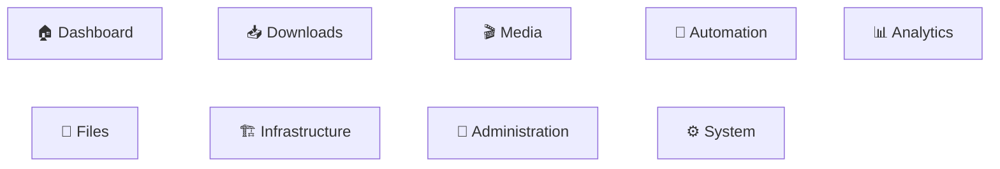

# Navigation Architecture Review — the Workspace Model

**Status:** Phase 1 review — *design only, no implementation.* Await sign-off before code.
**Author:** Navigation redesign, generation 2 (Workspace model).
**Supersedes framing of:** [NAVIGATION_REDESIGN.md](NAVIGATION_REDESIGN.md) (generation 1 — the 8-domain
consolidation, Phases 1–10, already shipped). This document proposes the *next* step:
promoting domains to **Workspaces**.
**Sources of truth:** [ARCHITECTURE.md](ARCHITECTURE.md) (authoritative), the live code
(`navigation.ts`, `packages/shared/src/{permissions,modules}.ts`,
`module-registry/manifests.ts`, `App.tsx`), and the two guideline docs
([MENU_GUIDELINES.md](MENU_GUIDELINES.md), [UX_GUIDELINES.md](UX_GUIDELINES.md)).

---

## Contents

1. [Executive summary](#1-executive-summary)
2. [Method & scope](#2-method--scope)
3. [Current navigation analysis](#3-current-navigation-analysis)
4. [Platform inventory](#4-platform-inventory-the-numbers)
5. [Navigation heatmap](#5-navigation-heatmap)
6. [Menu-density analysis](#6-menu-density-analysis)
7. [Click-depth analysis](#7-click-depth-analysis)
8. [Module relationships](#8-module-relationships)
9. [User-journey analysis](#9-user-journey-analysis)
10. [Navigation pain points](#10-navigation-pain-points)
11. [Future-growth analysis](#11-future-growth-analysis)
12. [Alternative navigation models](#12-alternative-navigation-models)
13. [Workspace-model justification](#13-workspace-model-justification)
14. [Proposed information architecture — 9 Workspaces](#14-proposed-information-architecture--9-workspaces)
15. [Application-shell design](#15-application-shell-design)
16. [Global command palette](#16-global-command-palette)
17. [Gap analysis — what the model needs that doesn't exist yet](#17-gap-analysis)
18. [Migration strategy](#18-migration-strategy)
19. [Implementation phases](#19-implementation-phases)
20. [Acceptance-criteria mapping](#20-acceptance-criteria-mapping)
21. [Risks & open decisions](#21-risks--open-decisions)
22. [Approval gate](#22-approval-gate)

---

## 1. Executive summary

UltraTorrent has outgrown the "one application, one sidebar" shape. It ships **24 registered
modules** and **~58 routes**, and the sidebar — even after the generation-1 redesign — shows
*every domain at once*. The Media domain alone expands to 16 rows; Automation's Notification
Center is 10; Analytics is 7. A fully-expanded sidebar is ~40+ rows. That is the ceiling of the
current model, and the platform is still growing.

**The proposal: reorganize UltraTorrent into Workspaces.** The global rail contains *only*
workspaces (9 icons, fixed forever). Selecting a workspace **replaces** the sidebar with that
workspace's own contextual navigation — so the user is never looking at more than one
application's worth of menu. Each workspace opens on an **Overview dashboard**, owns its own
**Settings**, **Jobs**, **Quick Actions**, and **scoped search**, and is fully **RBAC-aware**
(an empty workspace disappears from the rail entirely).

**Honest baseline — this is an evolution, not a rewrite.** The generation-1 work already built
~70% of the substrate this model needs:

| Workspace-model requirement | Already exists (gen-1) | Work remaining |
|---|---|---|
| Compact global switcher | Collapsed icon rail = domain switcher | Make it the *only* global nav; add `Ctrl+1–9` |
| Per-workspace overview | Module landing hubs (`/hub/:domainId`) | Upgrade hubs → live Overview dashboards |
| Contextual sidebar | `ContextualSubNav` (horizontal strip) | Promote to a *full vertical sidebar* that replaces the global one |
| Command palette | Palette v2 (pages/actions/entities) | Add media/jobs/docs providers + fuzzy match |
| Pinned / Favorites / Recent | `useNavPersonalization` (per-user) | Reuse as-is |
| Breadcrumbs | `BreadcrumbProvider` + entity labels | Extend to workspace hierarchy |
| RBAC + module filtering | `visibleGroups(ctx)` | Reuse as-is; add workspace-empty pruning |

The genuinely new pieces are: the **workspace switcher as the sole global nav**, the
**sidebar-replacement** interaction, **live Overview dashboards**, **per-workspace scoped
search**, **per-workspace Settings**, and one **backend gap** — there is no global *jobs-list*
endpoint today, which every "Jobs" page and the Downloads/Media overviews need.

---

## 2. Method & scope

Reviewed before proposing anything (per the brief's Phase-1 gate):

- **Nav source of truth** — `apps/frontend/src/components/layout/navigation.ts`
  (`NAV_DOMAINS`, `NAV_CONTRIBUTIONS`, `composeNavGroups`, `visibleGroups`, `flattenForSearch`,
  `resolveActiveContext`).
- **Route hierarchy** — `apps/frontend/src/App.tsx` (~58 `path=` routes, `ProtectedRoute` +
  `ModuleRoute` guards).
- **Module registry** — `packages/shared/src/modules.ts` (`MODULE_IDS`) +
  `apps/backend/src/modules/module-registry/manifests.ts` (`CORE_MANIFESTS`,
  `COMMUNITY_MANIFESTS`) + `module-registry.service.ts` (dependency fixpoint, cycle
  detection, core-locking) + `apps/frontend/src/modules/ModuleContext.tsx`.
- **RBAC** — `packages/shared/src/permissions.ts` (~130 permissions, 5 roles).
- **Shell** — `AppShell.tsx`, `Sidebar`, `CollapsedRail`, `CommandPalette`, `Breadcrumbs`,
  `ContextualSubNav`, `ModuleHub`, `MobileDomainBar`, `useNavPersonalization`,
  `useNavBadges`, `usePaletteProviders`.
- **Jobs & workflows** — `MediaProcessingQueueService`, `SubtitleQueueService`, the
  `MediaRenameJob`/`MediaAnalyticsImportJob`/`NotificationQueue` tables, and the
  `automation.module.ts` trigger/condition/action engine.
- **ARCHITECTURE.md** — feature inventory, security model, event-driven design.

**Out of scope for this document:** implementation. This is the review the brief requires
*before* touching code.

---

## 3. Current navigation analysis

### 3.1 The shipped model (generation 1)

Navigation is **registry-composed**: `NAV_DOMAINS` (8 ordered domains) + `NAV_CONTRIBUTIONS`
(each module appends one `{ slot: {domain, order}, item }`) → `composeNavGroups()` →
`NAV_GROUPS`. `visibleGroups(ctx)` filters by RBAC + module state; every surface (sidebar,
breadcrumbs, palette, hubs, contextual sub-nav, mobile bar) is a projection of that one tree.

The 8 domains and their entry counts:

### 3.2 What works

- **One source of truth.** Adding a page = appending one contribution. No drift across surfaces.
- **RBAC/module filtering is correct and centralized** (`visibleGroups`); route guards remain
  the authority.
- **Personalization** (Pinned/Favorites/Recent), **command palette**, **breadcrumbs**, and
  **module hubs** already exist and are tested (221 FE tests).

### 3.3 What doesn't scale

- The sidebar shows **all 8 domains simultaneously**. Consolidation reduced the *top level* to 8,
  but the *expanded* surface is still ~40 rows.
- **Media** is doing too much (16 rows): library management + subtitles (7) + duplicates + rename
  + IMDb + settings.
- **Monitoring** is a domain with a single module (Media Server Analytics) wearing it — an empty
  shell around one big module.
- **Files** and **Account** are one item each — a whole domain for one page.
- There is **no per-area home**; the hubs exist but aren't the default landing, and they're static
  tile grids, not dashboards.
- **No global Jobs view**, and no per-area Jobs view, despite 3 job subsystems running.

---

## 4. Platform inventory (the numbers)

**Modules — 24 registered manifests** (all `enabledByDefault: true`; core modules are
non-disableable):

- **18 core** (`tier: 'core'`, locked): `auth`, `rbac`, `account`, `users`, `engine`,
  `dashboard`, `torrents`, `search`, `taxonomy`, `rss`, `automation`, `files`, `notifications`
  (legacy), `api_keys`, `audit`, `system`, `settings`, `module_registry`.
- **6 "community"** (toggleable unless flagged core): `media_manager`, `release_scoring`,
  `media_acquisition_intelligence` — and **three that declare `tier: 'core'` despite living in
  the community array**: `media_server_analytics`, `notification_center`, `subtitle_intelligence`.
- One id (`media_renamer`) exists in `MODULE_IDS` with a controller but **no manifest**.

**Permissions — ~130**, dot-namespaced, across 5 roles (`SUPER_ADMIN`, `ADMINISTRATOR`,
`POWER_USER`, `USER`, `READ_ONLY`). The dense blocks: `media_manager.*` (13 + 5 IMDb),
`media_server_analytics.*` (14), `notifications.*` (12), `subtitle_intelligence.*` (8),
`media_acquisition.*` (10), `torrents.*` (14), `files.*` (11).

**Routes — ~58** in `App.tsx`, guarded by `ProtectedRoute` (permission) + `ModuleRoute`
(enablement).

**Jobs — 3 in-process subsystems** (no external broker; DB-persisted rows, WS-surfaced):
`MediaProcessingJob` (10 types: `library_scan`, `metadata_fetch`, `duplicate_detect`, …),
`SubtitleJob` (7 types), plus `MediaRenameJob`, `MediaAnalyticsImportJob`, `NotificationQueue`.
Schedulers use `@nestjs/schedule` `@Interval`. **There is no HTTP endpoint that lists jobs
across subsystems.**

**Workflows** — the `automation` module *is* the workflow engine: trigger/condition/action
rules (`AUTOMATION_TRIGGERS`, `AUTOMATION_ACTIONS`, `evaluateEvent`), with a `visual_rule_builder`
feature flag. There is no separate drag-and-drop builder.

---

## 5. Navigation heatmap

Estimated traffic (no analytics instrumentation exists yet — this is a heuristic from workflow
centrality, default-role permissions, and dashboard prominence; **§17** proposes instrumenting it):

| Tier | Areas | Why |
|---|---|---|
| 🔴 **Hot** (daily, all roles) | Dashboard, Torrents (+ states), Media Items/Libraries, RSS, global Search | Core acquisition & browse loop; in every role's permission set |
| 🟠 **Warm** (weekly) | Duplicate Center, Subtitle Search/Sync, Acquisition Intelligence, Analytics Live/History, File Manager | Power-user maintenance & insight |
| 🟡 **Cool** (occasional) | Automation Rules, Notification rules/templates, Release Scoring, Newsletters, Rename Engine | Set-up-and-forget configuration |
| ⚪ **Cold** (rare / admin) | Users, Roles, Modules, Audit, Settings, Engines, Provider config, IMDb dataset | Admin & one-time setup |

**Design consequence:** Hot areas belong on the global rail and in personalization (pins);
Cold areas belong deep inside their workspace's Settings/System, never competing for the top
level. The current flat sidebar gives Audit (cold) the same visual weight as Torrents (hot).

---

## 6. Menu-density analysis

**Current** — fully-expanded single sidebar:

| Domain | Top | Nested | Visible when expanded |
|---|---|---|---|
| Dashboard | 2 | 0 | 2 |
| Downloads | 7 | 8 (torrent states + acquisition) | 15 |
| Media | 9 | 7 (subtitles) | 16 |
| Automation | 2 | 10 (notifications) | 12 |
| Files | 1 | 0 | 1 |
| Monitoring | 1 | 7 (analytics) | 8 |
| Administration | 4 | 0 | 4 |
| Account | 1 | 0 | 1 |
| **Total** | **27** | **40** | **~59 rows** |

**Proposed** — workspace model: the **global rail is 9 fixed icons**; the **active workspace
sidebar shows 6–10 items**. Peak simultaneous density drops from ~59 rows to **≤ ~19** (9 rail +
≤10 sidebar). The *reachable* surface is unchanged — nothing is removed — but the *visible-at-once*
surface is a third of today's.

**Guardrail carried from [MENU_GUIDELINES.md](MENU_GUIDELINES.md):** a workspace sidebar caps at
~7–10 primary items; overflow nests under a sub-module parent (e.g. Subtitle Intelligence, the
Notification Center) or lives behind the workspace Overview.

---

## 7. Click-depth analysis

Depth = clicks from cold start to a target page.

| Target | Current | Workspace model |
|---|---|---|
| Torrents → Downloading | Dashboard → sidebar → Torrents → state (2–3) | Rail → Downloads → Torrents → state (3) or `Ctrl+2` (1) |
| A movie's detail | sidebar → Media → Items → item (3) | Rail → Media → Browser → item (3) or `Ctrl+K` "movie name" (1) |
| Subtitle Settings | Media → Subtitles(expand) → Settings (3) | Rail → Media → Subtitles → Settings (3) |
| Create a user | Administration → Users → New (3) | `Ctrl+8` → Users → New (2) or `Ctrl+K` "create user" (1) |

**Finding:** raw click-depth is already good (≤3) and the workspace model doesn't regret it —
because `Ctrl+1–9` collapses "reach a workspace" to one keystroke, and the command palette
collapses *any* target to one. The workspace model's win is **not** fewer clicks; it's **lower
cognitive load per click** (you choose among ≤10 relevant items, not ~59 mixed ones). This is the
core justification (§13).

---

## 8. Module relationships

Dependencies are declared per-manifest and enforced by a fixpoint (a module enables only if all
deps are enabled; core modules can't disable; a module with enabled dependents can't disable):

**Navigational reading of the graph — these clusters *are* the workspaces:**

- `engine → {torrents, rss, release_scoring, acquisition}` = **Downloads**.
- `files → media_manager → {subtitle_intelligence, duplicate center, rename}` = **Media**.
- `media_manager + automation → media_server_analytics` = **Analytics**.
- `automation + notification_center` = **Automation**.
- `auth → {users, rbac, audit, account}` = **Administration**.
- `module_registry, system, settings, engine-as-infra` = **System / Infrastructure**.

The dependency graph independently reproduces the proposed workspace boundaries — strong evidence
the boundaries are natural, not arbitrary.

---

## 9. User-journey analysis

**Persona A — Daily user (role `USER`).** Adds torrents, checks the queue, browses media, grabs
subtitles. Lives in Dashboard + Downloads + Media. *Today:* wades past Automation, Analytics,
Admin rows they can't fully use. *Workspace model:* their rail shows only the workspaces they can
enter; Downloads and Media each open on a purpose-built Overview.

**Persona B — Media curator (role `POWER_USER`).** Runs duplicate scans, fixes matches, tunes
rename templates, manages subtitle providers. Lives almost entirely in **Media**. *Today:* Media
is 16 rows mixed with everything else. *Workspace model:* enters the Media workspace and sees a
focused application — Libraries, Browser, Duplicate Center, Subtitles, Rename, Health, Jobs,
Settings — nothing else.

**Persona C — Administrator.** Manages users/roles, reviews audit, toggles modules, watches
system health. *Today:* these are split across Administration (4) with System-y things (Modules,
Engines) scattered into Downloads/Admin. *Workspace model:* **Administration** (people & policy)
and **System** (the platform itself) are two clean workspaces.

**Journey pain resolved:** every persona currently pays an "attention tax" for capabilities they
don't use in the moment. Workspaces scope attention to the task.

---

## 10. Navigation pain points

1. **Everything is visible at once.** ~59 expandable rows; no scoping to the current task.
2. **Media is overloaded** (16 rows) — three sub-domains (management, subtitles, duplicates) share
   one flat list.
3. **Single-module domains** (Files, Monitoring, Account) waste a top-level slot on one page.
4. **No area home.** Hubs exist but aren't the default landing and are static tiles, not live
   dashboards. Users land on a *page*, never an *overview*.
5. **No Jobs surface.** Three job subsystems run; the UI cancels a job by id but can't *list*
   them. There's no "what's running" anywhere.
6. **Settings are scattered.** A global Settings page plus per-module settings (Media, Subtitles,
   Notifications, Analytics) — no consistent "this area's settings" location.
7. **Infrastructure/System concerns are mixed into task domains** — Engines sit in Downloads;
   Modules in Administration; provider config is buried per-module.
8. **Search is global-only.** No way to search *within* Media or *within* Downloads.
9. **Weak visual hierarchy.** A destructive/admin row looks like a routine one.
10. **Cold admin items compete with hot daily items** for the same top level.

---

## 11. Future-growth analysis

The platform adds modules steadily (Subtitle Intelligence, Duplicate Center, Media Server
Analytics, Acquisition Intelligence all arrived recently). Project forward to **hundreds** of
modules:

- **Flat/consolidated sidebar (today):** every new module adds a row or nests one deeper. Linear
  growth in visible density. Fails at ~15–20 top-level entries.
- **Workspace model:** a new module attaches to an existing workspace's sidebar (bounded to ~10
  by nesting/overflow) **or**, rarely, becomes a new workspace. The **global rail stays 9 forever**.
  Growth is absorbed *inside* a workspace, invisible to every other workspace. The command palette
  is the flat escape hatch that scales with search, not with menu length.

**Plugin/extension future:** the existing `EXTENSIONS_DOMAIN` fallback (a contribution with an
unknown domain lands in "Extensions") maps cleanly onto an **Extensions workspace** — third-party
modules get their own workspace without touching core rails.

**Conclusion:** the workspace model is the last *structural* nav redesign the platform should
need — future growth is a data change (one contribution), not an architecture change. (Acceptance
criterion #17.)

---

## 12. Alternative navigation models

Evaluated against: scales to 100s of modules · low per-screen load · discoverable · RBAC-clean ·
minimal rebuild given gen-1.

| Model | Summary | Verdict |
|---|---|---|
| **A. Keep consolidated sidebar** (today) | 8 domains, all visible, collapsible | ✅ cheap ❌ doesn't scale; ~59 rows; no scoping. **Rejected** — the problem we're solving. |
| **B. Mega-menu / launcher grid** | A grid drawer of all modules (Windows Start / Azure "all services") | ✅ scales ❌ no persistent context; every navigation is a round-trip through the launcher. **Rejected** as the *primary* model; kept as the **command palette + Dashboard grid**. |
| **C. Top tab bar + sub-nav** (GitLab-ish) | Horizontal top tabs, contextual left nav | ✅ familiar ❌ horizontal space caps tabs ~7; mobile-hostile. Partially adopted as breadcrumbs + contextual strip. **Rejected** as primary. |
| **D. Workspace model** (Proxmox/DSM/VS Code activity bar) | Slim global rail of *workspaces*; each replaces the sidebar with its own app | ✅ scales forever ✅ lowest per-screen load ✅ reuses ~70% of gen-1 ✅ RBAC-empty workspaces vanish. **Selected.** |
| **E. Fully search-first** (no persistent nav) | Everything via `Ctrl+K` | ✅ ultimate scale ❌ undiscoverable for new users; power-user-only. **Rejected** as primary; **complementary** (palette stays). |

The winning design is **D as the spine, with B and E as complements** (Dashboard launcher grid +
global command palette). This mirrors how Proxmox (resource tree per node), Synology DSM
(app-per-window), and VS Code (activity bar → view container) actually compose: a small persistent
switcher, a rich contextual panel, and a search escape hatch.

---

## 13. Workspace-model justification

**Definition.** A **Workspace** is a self-contained application inside the UltraTorrent platform.
The **global rail** lists only workspaces. Selecting one **replaces** the sidebar with that
workspace's own navigation, opens its **Overview**, and scopes search, quick actions, jobs, and
settings to it.

**Why it's the right model for UltraTorrent specifically:**

1. **The module dependency graph already clusters into these workspaces** (§8) — the boundaries
   are intrinsic, not imposed.
2. **It bounds per-screen cognitive load** to one application's worth of nav (§6), which is the
   actual pain (§10), not click-depth (§7).
3. **It scales structurally** — the rail is fixed; growth is absorbed inside a workspace (§11).
4. **It reuses the gen-1 investment** — switcher, hubs, palette, personalization, breadcrumbs,
   RBAC filtering all carry forward (§1).
5. **It gives every area a home, a jobs view, and its own settings** — resolving pain points
   #4/#5/#6 by construction.
6. **It's RBAC-native** — a workspace whose every child is filtered out simply disappears from
   the rail (extends the existing empty-group pruning to the top level).

**What we explicitly are *not* doing:** removing or hiding functionality, adding editions/tiers
(the platform is single-tier, RBAC-only — ARCHITECTURE.md §Security), or introducing content
hashing / features the backend doesn't have.

---

## 14. Proposed information architecture — 9 Workspaces

Global rail (fixed, in order). Icons are the current domain icons where they exist:

**Account is not a workspace** — Profile / password / 2FA / preferences / language / theme /
sign-out move to a **top-bar user menu** (avatar), reachable from everywhere. This frees a
top-level slot and matches DSM/GitLab convention.

Each workspace below lists its **contextual sidebar** (every item maps to an existing route unless
marked ✳ *new surface* or ⛏ *needs backend*). RBAC/module gates are inherited from the current
`NAV_CONTRIBUTIONS` and shown where they move.

### 🏠 1. Dashboard — the platform home
*Module `dashboard`. Not a sub-app; the OS-home launcher.*
- **Overview** (`/dashboard`) — OS-style widget grid: Recent Activity, Favorite Workspaces,
  Pinned Pages, Recent Pages, Running Jobs ⛏, Notifications, Storage, Health, Downloads snapshot,
  Media snapshot, Automation snapshot, Statistics, Quick Actions, **Continue Working**.
- **Search** (command palette).

### 📥 2. Downloads
*Modules `torrents`, `rss`, `release_scoring`, `media_acquisition_intelligence`, `taxonomy`.*
- **Overview** ✳ — Queue, Torrent clients/engine status, RSS activity, recent & failed downloads,
  Quick Actions.
- **Torrents** (`/torrents`) — states: Downloading / Seeding / Completed / Paused / Errors.
- **RSS** (`/rss`) — feeds, rules, match candidates, Smart Match Builder.
- **Search** (`/indexers` search) — indexer/Torznab release search *(configuration of indexers
  lives in Infrastructure; see §21 decision D-1)*.
- **Release Scoring** (`/release-scoring`).
- **Acquisition Intelligence** (`/media-acquisition`) — Smart Download, Missing Episodes,
  Decision Simulator.
- **Categories & Tags** (`taxonomy`).
- **Jobs** ⛏ — download/torrent-sync jobs.
- **Settings** ✳ — download-scoped settings.

### 🎬 3. Media
*Modules `media_manager`, `subtitle_intelligence`. The most complex workspace — this is why it
needs to be its own application.*
- **Overview** ✳ (`/media`) — recent imports, libraries, metadata queue, subtitle status,
  duplicate status, media health, storage, Quick Actions, statistics.
- **Libraries** (`/media/libraries`).
- **Media Browser** (`/media/items`, detail `/media/items/:id`).
- **Unmatched** (`/media/unmatched`).
- **Duplicate Center** (`/media/duplicates`) — module landing page (Overview, stats, actions,
  history, jobs, settings, docs).
- **Subtitle Intelligence** (`/subtitles`) — Search, Sync, Validation, Languages, History,
  Providers, Settings (7 pages, nested under one parent).
- **Rename Engine** (`/media/rename-preview`).
- **Media Health** ✳ — library-health dashboard (data exists; surface it).
- **Metadata & IMDb** (`/media/settings/imdb`).
- **Jobs** ⛏ — `MediaProcessingJob` list (scan/metadata/artwork/duplicate/rename/NFO).
- **Settings** (`/media/settings`).

### 🤖 4. Automation
*Modules `automation`, `notification_center`.*
- **Overview** ✳ — rules, schedules, notifications summary, recent executions, recent failures,
  Quick Actions, statistics.
- **Rules** (`/automation`) — trigger/condition/action rules + visual builder.
- **Notification Center** (`/notifications`) — Channels, Rules, Templates, Recipients, Groups,
  Delivery History, Queue Monitor, Provider Health, Preferences, Settings (10 pages, nested).
- **Executions** ✳ — `AutomationLog` history (data exists; surface it).
- **Schedules** ✳ — scheduler-job view (`@Interval` jobs).
- **Jobs** ⛏.
- **Settings** ✳.

### 📊 5. Analytics
*Module `media_server_analytics`.*
- **Overview** ✳ (`/media-server-analytics`) — the premium analytics dashboard.
- **Live Activity** · **Watch History** · **Reports** · **Recently Added** · **Newsletters** ·
  **Import** (Tautulli) — all existing routes.
- **Server Connections** (`/media-server-analytics/connections`) *(primary home; see decision
  D-2)*.
- **Jobs** ⛏ — import jobs.
- **Settings** ✳.

### 📁 6. Files
*Module `files`.*
- **Overview** ✳ — storage summary, recent operations, trash status, Quick Actions.
- **File Browser** (`/files`).
- **Trash & Recovery** ✳ (surface existing delete-to-trash + cleanup).
- **Bulk Operations** ✳ · **Cleanup** (`files.cleanup`).
- **Jobs** ⛏.
- **Settings** ✳ — root paths (`settings.manage_root_path`).

### 🏗 7. Infrastructure — the external systems & engines UltraTorrent connects to
*Modules `engine`, integrations; perms `engines.manage`, `indexers.*`, `integrations.prowlarr.*`.*
- **Overview** ✳ — connection/engine health at a glance.
- **Torrent Engines** (`/engines`).
- **Indexers** (`/indexers`) — Torznab/Newznab source configuration *(decision D-1)*.
- **Prowlarr** (external companion link).
- **Providers** ✳ — read-only registry + health of metadata / subtitle / notification providers
  (aggregates existing per-module provider pages).
- **Storage & Paths** ✳.
- **Settings** ✳.

### 👤 8. Administration — people & policy
*Modules `users`, `rbac`, `audit`, `account`(policy); perms `users.*`, `roles.manage`,
`audit.view`.*
- **Overview** ✳ — users, roles, recent audit, auth/security status, Quick Actions.
- **Users** (`/users`).
- **Roles & Permissions** ✳ (surface the RBAC catalog editor).
- **Authentication** ✳ — 2FA policy, sessions.
- **Audit Log** (`/audit`).
- **Settings** ✳ — admin-scoped.

### ⚙ 9. System — UltraTorrent itself
*Modules `module_registry`, `system`, `settings`, `api_keys`.*
- **Overview** ✳ — version, health/liveness, resource status, running jobs, Quick Actions.
- **Modules** (`/modules`) — enable/disable, dependency view.
- **Jobs & Scheduler** ⛏ — the **global** cross-subsystem job & scheduler view.
- **Health & Status** ✳ (`system.view`).
- **API Keys** ✳ (`apikeys.manage`) *(decision D-3: Admin vs System)*.
- **Platform Settings** (`/settings`).
- **Logs / Maintenance** ✳.

> Every ✳ *new surface* reuses existing data/endpoints; every ⛏ *needs backend* depends on the
> one real gap — a jobs-list endpoint (§17). Nothing here removes or relocates a capability out of
> reach; the Migration Strategy (§18) guarantees old URLs redirect.

---

## 15. Application-shell design

### 15.1 Workspace switcher
- **Global rail** (left, slim, always visible on desktop): 9 workspace icons + badge dots +
  active indicator; bottom-anchored user-menu avatar. Reuses `CollapsedRail`'s flyout-on-hover.
- **Keyboard:** `Ctrl+1..9` jump to a workspace (criterion #6); `Ctrl+K` palette; arrow keys +
  `Enter` within the rail.
- **Touch/mobile:** the rail becomes the bottom bar (`MobileDomainBar` generalized to workspaces);
  the contextual sidebar becomes a swipe-in drawer (`useSwipeToDismiss`).
- **Remembers last workspace** (localStorage, per user) and restores it on load (criterion #6).

### 15.2 Contextual sidebar (replaces the global one)
Per-workspace vertical sidebar — this is `ContextualSubNav` **promoted from a horizontal strip to
the primary vertical nav**. Supports (all already built in gen-1's `Sidebar`): nested menus,
collapsible groups (persisted), icons, badges, keyboard nav, Pinned/Favorites/Recent sections,
workspace-specific quick links, collapsed/expanded modes, responsive drawer. **Lazy-loaded per
workspace** (criterion #12): only the active workspace's sub-tree is composed/rendered.

### 15.3 Workspace overview dashboards
Every workspace opens on **Overview** (criterion #4). Upgrade the static `ModuleHub` tile grid
into a **widget dashboard**: the hub's tiles remain (navigation), plus live widgets (jobs,
stats, recent activity, health, storage, quick actions) fed by existing endpoints + the new
jobs endpoint. The **Global Dashboard** is the same widget engine at platform scope
(Favorite Workspaces, Pinned, Recent, Continue Working).

### 15.4 Quick actions
Per-workspace action set (criterion #7's actions), surfaced on the Overview *and* in the palette:
- **Downloads:** Add Torrent · RSS Search · Search Indexers · Open Queue.
- **Media:** Scan Library · Search Metadata · Find Duplicates · Search Subtitles · Open Duplicate
  Center.
- **Automation:** Create Rule · Run Workflow · View Jobs.
- **Administration:** Create User · Open Audit · Manage Roles.
Reuses `usePaletteProviders` (which already defines add-torrent / scan-library / find-duplicates /
rss-rule / automation actions).

### 15.5 Scoped search
Each workspace gets a **scoped search** (criterion #11): the same palette engine filtered to the
active workspace's entities & pages (e.g. Media search → items/libraries; Downloads search →
torrents/RSS). The global `Ctrl+K` remains unscoped. Implementation: `usePaletteProviders`
already keys providers; add a `scope` filter.

### 15.6 Per-workspace settings
Remove the notion of one giant Settings page as the *entry point* (criterion #9). Each workspace
owns a **Settings** item. `/settings` becomes **Platform Settings** in the System workspace
(global key/values only). Media/Downloads/Automation/Analytics settings live in their workspace.
*(Backing stores are unchanged — this is a navigation/relocation, not a data migration.)*

### 15.7 Breadcrumbs
Extend to the workspace hierarchy (criterion, "Breadcrumbs"):
`Workspace › Section › Page › Entity` — e.g. `Media › Libraries › Movies › Marvel Collection ›
Iron Man`. Reuses `BreadcrumbProvider` + `useBreadcrumbEntity`; prepend the workspace crumb.

### 15.8 Visual hierarchy, badges, icons, animation
- **Hierarchy** communicated by placement + type styling: Primary (bold), Secondary (regular),
  Overview/Jobs (pinned top/bottom of the sidebar), Settings (bottom), Administrative & Dangerous
  (distinct color + confirm). Carries [UX_GUIDELINES.md](UX_GUIDELINES.md) conventions.
- **Badges** (criterion, reuses `useNavBadges`): Unread, Jobs running, Warnings, Errors,
  Duplicates to review, Notifications, Updates available, RSS matches, Storage alerts — on rail
  icons (aggregate dot) and sidebar rows (count).
- **Icons:** audit for a consistent `lucide-react` language; one distinct icon per workspace +
  per sidebar item; document the set in `MENU_STANDARDS.md`.
- **Animation:** subtle only — workspace cross-fade on switch, sidebar slide, respect
  `prefers-reduced-motion`.

### 15.9 RBAC, performance, responsiveness, accessibility
- **RBAC** (criterion #10): reuse `visibleGroups`; **new rule** — a workspace with zero visible
  sidebar items is dropped from the rail (never show an empty workspace). Palette, quick actions,
  search results, and badges all consume already-filtered data.
- **Performance** (#12): fixed 9-icon rail (O(1)); lazy per-workspace sidebar composition; badges
  fetched lazily & permission-gated (`useNavBadges` already does this); virtualize long lists
  (Media Browser, Audit).
- **Responsiveness** (#13): desktop rail + sidebar; tablet collapsible rail; phone bottom rail +
  drawer sidebar; compact/expanded modes; touch + keyboard.
- **Accessibility:** `<nav>` landmarks, `aria-current`, `aria-expanded`, roving-tabindex on the
  rail, focus management on workspace switch (move focus to the new Overview heading), high
  contrast, screen-reader labels for badge counts.

---

## 16. Global command palette

`Ctrl+K` (criterion #7) — upgrade gen-1's palette v2 to search **everything** with **fuzzy
matching**: Pages, Commands, Quick Actions, Movies, TV Shows, Libraries, RSS Rules, Duplicate
groups, Subtitle items, Providers, Users, Jobs ⛏, and Documentation. Results allow direct
navigation *or* execution. Providers are lazy/debounced (already the pattern in
`usePaletteProviders`); add: fuzzy scorer, media/tv/library/rule/user/job/doc providers, and a
docs index. On empty query it shows Pinned/Recent/Favorites (already built).

---

## 17. Gap analysis

Things the workspace model requires that **do not exist today**:

1. **⛏ A jobs-list endpoint (the one real backend gap).** Every "Jobs" page and several Overviews
   need to *list* jobs across `MediaProcessingJob`, `SubtitleJob`, `MediaRenameJob`,
   `MediaAnalyticsImportJob`, `NotificationQueue`. Today the API can *cancel* a media job by id and
   emits WS lifecycle events, but there is **no list/query endpoint**. Proposal: a read-only
   `GET /api/jobs?scope=&status=` aggregator (RBAC-scoped per subsystem) + a global variant for
   System. This is the critical path for the Jobs requirement.
2. **✳ Overview widget endpoints.** Most widget data exists (dashboard stats, library health,
   duplicate status, analytics); a few need light aggregation endpoints. No new data — just shaping.
3. **✳ Scoped-search parameter.** `usePaletteProviders` needs a `scope` filter and a couple of
   entity providers (users, jobs, docs).
4. **✳ Nav-usage instrumentation** (optional, recommended) — to replace the heuristic heatmap
   (§5) with real data; a lightweight client event on navigation.
5. **Data-model note:** the `media_renamer` id without a manifest, and the three community-array
   modules flagged `tier: 'core'`, are pre-existing inconsistencies (not caused here) worth
   tidying while we're in the registry — but **out of scope** for nav; flagged for a separate PR.

**No content hashing** exists (ARCHITECTURE.md); the Duplicate Center's identity model stays as-is.

---

## 18. Migration strategy

**Principle: nothing is removed, hidden, or made harder to reach at any step** (the same rule that
governed gen-1). Old URLs keep working.

**Phase-by-phase, behind the scenes → visible:**

1. **Model swap (data-only).** Rename `NAV_DOMAINS` → `WORKSPACES`, add the 9th
   (Infrastructure/System split from Administration+Downloads). Re-slot `NAV_CONTRIBUTIONS` to the
   9 workspaces. This is the *same* registry mechanism — `composeNavGroups` already does it.
   Update `navigation.test.ts` to the new IA. **No visual change yet if we keep rendering the
   consolidated sidebar.**
2. **Shell swap.** Make the global rail render *workspaces only*; make the sidebar render the
   *active* workspace (promote `ContextualSubNav`). Keep the old consolidated sidebar behind a
   feature flag for one release to de-risk.
3. **Overviews.** Point each workspace's default route at its Overview; upgrade hubs → dashboards.
4. **Redirects.** Every current route stays valid; add redirects only where a page *moves*
   workspace (e.g. `/engines` now lives in Infrastructure — the route is unchanged, only its nav
   home moves, so **no redirect needed**; genuinely-moved paths get a `<Navigate>`).
5. **Per-workspace Settings/Jobs/Search/Quick Actions.** Additive.
6. **Deprecate the flag.** Remove the old sidebar once the workspace shell is validated.

**Rollback:** each phase ships green tests + build; the feature flag in phase 2 allows instant
revert to the consolidated sidebar without a redeploy of the whole app.

**RBAC/module safety:** unchanged — `visibleGroups` + route guards remain the authority
throughout; the only addition is empty-workspace pruning.

---

## 19. Implementation phases

Mapped to the brief's six phases (each ships green tests + build; nothing removed along the way):

| Phase | Scope | Key deliverables |
|---|---|---|
| **1 (this doc)** | Architecture review, nav audit, workspace design | `NAVIGATION_ARCHITECTURE_REVIEW.md` (this) |
| **2** | Global navigation, workspace switcher, contextual sidebar | `WORKSPACES` registry, rail = workspaces, `Ctrl+1–9`, last-workspace memory, sidebar replacement, empty-workspace pruning |
| **3** | Workspace dashboards, quick actions, scoped search | Overview widget engine, per-workspace Quick Actions, scoped palette, **⛏ jobs-list endpoint** |
| **4** | Global command palette, pinned/favorites/recent | Fuzzy match, media/tv/library/rule/user/job/doc providers, docs index (personalization already built) |
| **5** | Settings redesign, breadcrumbs, icons, animations | Per-workspace Settings, workspace breadcrumbs, icon audit, subtle motion |
| **6** | Docs, testing, optimization | `WORKSPACE_ARCHITECTURE.md`, `NAVIGATION_GUIDELINES.md`, `UX_GUIDELINES.md` (update), `MENU_STANDARDS.md`; full test sweep; lazy-load/perf pass; update `ARCHITECTURE.md`, `NAVIGATION.md`, `README.md` |

**Testing (Phase 6, per brief):** workspace switching (incl. `Ctrl+1–9` + last-workspace),
sidebar persistence, favorites/pinned/recent, command palette (fuzzy + providers), scoped search,
RBAC (empty-workspace pruning, filtered results/actions), breadcrumbs (workspace hierarchy),
accessibility (roving tabindex, focus-on-switch), responsive (rail↔bottom-bar, drawer),
performance (lazy composition, no-dead-links guard extended to workspaces).

---

## 20. Acceptance-criteria mapping

| # | Criterion | Addressed by |
|---|---|---|
| 1 | No longer one oversized sidebar | §6, §14, §15.2 |
| 2 | Organized into logical workspaces | §8, §14 |
| 3 | Each workspace has its own contextual sidebar | §15.2 |
| 4 | Every workspace begins with an Overview | §15.3, §14 |
| 5 | Global nav stays compact regardless of growth | §11, §14 |
| 6 | Fast, intuitive workspace switching | §15.1 (`Ctrl+1–9`, last-workspace) |
| 7 | `Ctrl+K` global palette (pages/commands/media/jobs/docs) | §16 |
| 8 | Pin / favorite / recent | gen-1 `useNavPersonalization` (reused) |
| 9 | Each workspace has its own Settings | §15.6 |
| 10 | Completely RBAC-aware | §15.9 |
| 11 | Global *and* per-workspace search | §15.5, §16 |
| 12 | Performant with 100s of modules/routes | §11, §15.9 |
| 13 | Mobile + desktop redesigned | §15.1, §15.9 |
| 14 | Docs fully updated with diagrams | §19 Phase 6 |
| 15 | Comprehensive tests pass | §19 Testing |
| 16 | Builds successfully | Each phase gate |
| 17 | Enterprise-grade, scales a decade without another redesign | §11, §13 |

---

## 21. Risks & open decisions

**Decisions — APPROVED 2026-07-21 (all recommendations accepted):**

- **D-1 — Indexers → Infrastructure.** ✅ Configure the *source* in Infrastructure; a Downloads →
  Search surface consumes them (that search surface is a ✳ later-phase addition).
- **D-2 — Media-Server Connections → Analytics.** ✅ Kept with the feature they power.
- **D-3 — API Keys → System.** ✅ Platform-level credential; personal-keys shortcut in the user menu.
- **D-4 — Account → user menu (not a workspace).** ✅
- **Sidebar interaction — full replacement.** ✅ Selecting a workspace completely replaces the
  sidebar with that workspace's own nav.
- **Jobs-list endpoint — approved** to build as a Phase-3 prerequisite (§17).

**Risks & mitigations:**

- **Context-switch friction** (workspace replaces sidebar) → mitigated by `Ctrl+1–9`, command
  palette, Pinned/Recent, and Favorite Workspaces on the Dashboard.
- **The jobs-list endpoint is on the critical path** (§17) → build it first in Phase 3; Overviews
  degrade gracefully (hide the Jobs widget) until it lands.
- **Big-bang risk** → the feature flag in Migration Phase 2 keeps the old sidebar one release for
  instant rollback.
- **i18n load** → many ✳ new surfaces mean new `nav`/`shell` keys in **both** locales
  (parity is test-enforced) — budget for it each phase.

---

## 22. Approval gate — CLEARED 2026-07-21

All gate items approved:

1. ✅ **9-workspace IA** (§14) approved as proposed.
2. ✅ **D-1…D-4** (§21) — all recommendations accepted.
3. ✅ **Full sidebar-replacement** interaction confirmed.
4. ✅ **Jobs-list endpoint** approved as a Phase-3 prerequisite (§17).

Phase 2 proceeds incrementally (checkpoint per step, green tests + build), reusing the
generation-1 substrate and **removing nothing**. Account moves to the top-bar user menu.

---

See also: [ARCHITECTURE.md](ARCHITECTURE.md) · [NAVIGATION.md](NAVIGATION.md) ·
[NAVIGATION_REDESIGN.md](NAVIGATION_REDESIGN.md) · [MENU_GUIDELINES.md](MENU_GUIDELINES.md) ·
[UX_GUIDELINES.md](UX_GUIDELINES.md)
