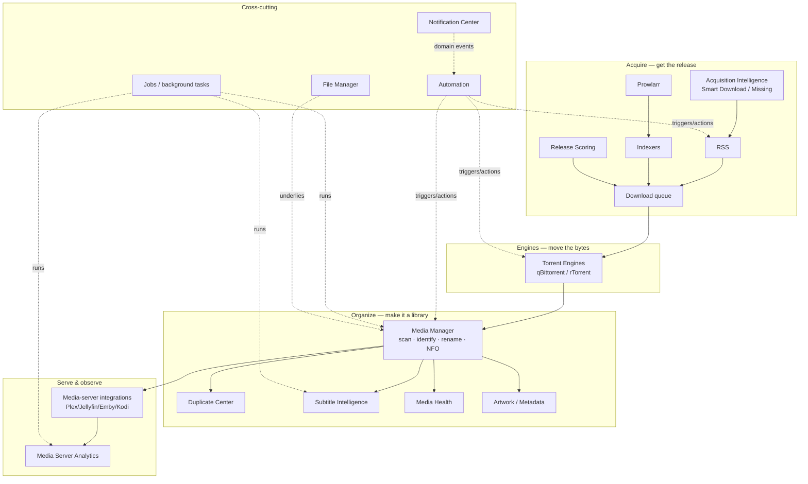
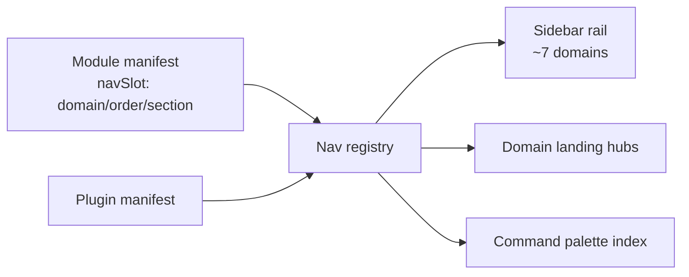

# Navigation Redesign — Review & Design (Phase 1)

**Status:** Review complete. No implementation has begun (per the brief's gate).
**Scope:** UX / Information Architecture / Navigation / Sidebar redesign so the
platform stays intuitive as it grows toward hundreds of features.
**Sources of truth:** `docs/ARCHITECTURE.md` (architecture), the live code under
`apps/frontend/src/components/layout/` and `apps/frontend/src/App.tsx` (current
behaviour). This document is the deliverable for the review phase; the
implementation is gated on sign-off of the [Final Design](#final-design-rationale).

---

## Contents

- [What exists today](#what-exists-today)
- [Current problems](#current-problems)
- [UX analysis](#ux-analysis)
- [Navigation heatmap](#navigation-heatmap)
- [Menu-density analysis](#menu-density-analysis)
- [Click analysis](#click-analysis)
- [Module relationships](#module-relationships)
- [User-journey analysis](#user-journey-analysis)
- [Information architecture (proposed)](#information-architecture-proposed)
- [Future-growth plan](#future-growth-plan)
- [Recommendations](#recommendations)
- [Alternative designs](#alternative-designs)
- [Final design rationale](#final-design-rationale)
- [Implementation plan (for sign-off)](#implementation-plan-for-sign-off)

---

## What exists today

The navigation is already more capable than a flat list. Mapping the actual code:

**Data** — `apps/frontend/src/components/layout/navigation.ts` (`NAV_GROUPS`) is the
single source of truth for sidebar, breadcrumbs and command palette. It defines a
typed tree (`NavGroup` → `NavItem` → `children`), each entry gated by `permission`
(RBAC) and/or `module` (enablement), with `visibleGroups(ctx)` pruning anything the
user can't see and dropping empty groups.

**Shell** — `AppShell.tsx` (761 lines) renders it and *already* supports:

| Capability | State today |
|---|---|
| Collapsible groups | ✅ persisted (`ut.nav.groups.collapsed`) |
| Expandable nested items | ✅ persisted (`ut.nav.items.expanded`) |
| Icon-rail collapse | ✅ persisted (`ut.sidebar.collapsed`) |
| Mobile drawer | ✅ (`mobileOpen`) |
| Command palette (Ctrl/Cmd-K) | ✅ but **pages only** |
| Breadcrumbs | ✅ (`Breadcrumbs.tsx`) |
| RBAC + module-aware visibility | ✅ (`visibleGroups`) |
| Active-branch highlight + auto-expand | ✅ (`isBranchActive`) |
| i18n (en-US / es-PR) | ✅ (`tNav`) |

**Missing** (all called for by the brief):

| Capability | State today |
|---|---|
| Collapse-all / Expand-all | ❌ |
| Pinned pages | ❌ |
| Favorites | ❌ |
| Recent pages | ❌ |
| Badges / status counts | ❌ |
| Command palette over **entities** (libraries, items, users, jobs, actions, docs) | ❌ pages only |
| Quick actions | ❌ |
| Module landing pages (as a consistent pattern) | ⚠️ ad-hoc dashboards only |
| Contextual sub-navigation | ❌ |
| Compact vs collapsed vs hover-expand modes | ⚠️ only "expanded" and "icon-rail" |

So this is not a rebuild-from-zero. The bones (typed IA, RBAC pruning, persistence,
command palette, breadcrumbs) are sound. The redesign is **(1)** a re-grouping of the
IA and **(2)** additive features on top of the existing shell.

### The current top level — 10 groups

```
Overview            Dashboard · Search
Downloads           Torrents (Downloading/Seeding/Completed/Paused/Errors) · Engines · Indexers
RSS & Acquisition   RSS Feeds · Release Scoring · Acquisition Intelligence (Smart Download/Missing Episodes/Decision Simulator) · Prowlarr↗
Media Management    Media Dashboard · Items · Libraries · Unmatched · Duplicates · Rename Engine · IMDb Settings · Media Settings
Subtitle Intelligence  Dashboard · Search · Sync · Validation · Languages · History · Providers · Settings
Media Server Analytics Dashboard · Live · Recently Added · Watch History · Reports · Newsletters · Import · Connections
Automation          Automation Rules · Notification Center · Channels · Rules · Templates · Recipients · Groups · History · Queue · Provider Health · Preferences · Settings
Files               File Manager
Administration      Users · Modules · Settings · Audit Log
Account             Profile
```

**57 routes** across **10 first-level groups**; **24 backend modules** in the registry.

---

## Current problems

Confirmed against the code, each with the concrete evidence:

1. **Too many first-level groups (10).** Nine of them (all but Account) compete for
   the top of the rail. There is no separation of *frequently used* from
   *administrative* — Administration and Account sit in the same visual weight as
   Downloads.

2. **A few groups are extremely dense.** Item counts:
   `Automation 12 · Subtitle Intelligence 8 · Media Server Analytics 8 ·
   Media Management 8 · Downloads 8 · RSS & Acquisition 6`. On a laptop viewport with
   two or three groups expanded, the rail **scrolls**.

3. **Media is fragmented across four groups.** "Media Management",
   "Subtitle Intelligence", "Media Server Analytics" are siblings, and
   media-adjacent features (Missing Episodes, Release Scoring, Smart Download) live in
   a *fourth* group, "RSS & Acquisition". A user thinking "media" has to know the
   platform's internal module boundaries to find a feature.

4. **The "Automation" group is really two modules.** It mixes Automation Rules
   (1 item) with the entire Notification Center (11 items). Notifications dominate a
   group named for automation; genuine automation surfaces (triggers, actions,
   schedules, workflows) have nowhere to grow.

5. **Related functionality is split by module, not by task.** Indexers + Prowlarr
   (both "where releases come from") are in different groups (Downloads vs RSS &
   Acquisition). Engines (Downloads) and Server Connections (Analytics) are both
   "connections to external systems" but far apart.

6. **No home for cross-cutting operational surfaces.** There is no *Monitoring* group
   — Jobs / background tasks, realtime activity, and analytics are not collected
   anywhere; and no *Infrastructure* group — engines, providers, connections, API
   keys, secrets are scattered. `docs/ARCHITECTURE.md` describes all of these; the nav
   doesn't reflect them as a domain.

7. **Weak visual hierarchy.** Every group header looks identical; a destructive or
   admin surface reads the same as a daily-use one. Nothing signals "this is settings"
   vs "this is your work".

8. **Discovery depends on knowing the module map.** Without pinned/favorites/recent
   and with a pages-only palette, a returning admin re-navigates the tree every time;
   there is no "where was I" and no "jump to *this library*".

9. **No scalability plan.** Adding the next module means appending another top-level
   group (or overloading an existing one). At 24 modules the rail is already tall; the
   brief's target is *hundreds of features*.

---

## UX analysis

**Who uses this.** A single-admin household through a small-team media operation.
The dominant loops are: check what's happening (dashboard/activity), act on
acquisition (RSS, indexers, add torrent), and manage the library (items, duplicates,
subtitles, health). Administration and analytics are **occasional**; today they carry
the same navigational weight as the daily loops.

**Fitts's-law / travel cost.** The most-used destinations (Dashboard, Torrents,
Media items, Duplicates) are not consistently near the top, and there is no way to
bring a personal set of destinations to the top. Deep, frequently-visited pages
(e.g. a specific RSS rule, the Duplicate Center review tab) require a full re-descent
each visit.

**Recognition over recall.** The command palette is the strongest existing feature,
but it only recognises **pages**. Users think in **entities** ("that Paradise show",
"the Movies library", "that failed job") — the palette can't find those yet.

**Cognitive load.** 10 sibling groups exceed the ~7±2 comfortable span, and the
densest groups (Automation, the three Media-* groups) force scanning long lists.
Consolidating to ~7 domains with progressive disclosure (landing hubs + sub-nav)
brings each decision back under the span limit.

**Consistency.** Some modules have a "Dashboard" landing (Media, Subtitles,
Analytics, Notification Center); others jump straight to a list (Torrents, Files,
Users). A uniform *module landing page* pattern would make the platform read as one
product rather than a pile of pages.

---

## Navigation heatmap

Estimated visit frequency (⬛ highest → ⬜ rarely), from the workflows the
architecture implies. This drives what belongs near the top and what belongs behind a
landing page.

| Surface | Frequency | Notes |
|---|---|---|
| Dashboard / Overview | ⬛⬛⬛⬛ | first thing on every visit |
| Torrents (active/downloading) | ⬛⬛⬛⬛ | the core loop |
| Media items / Libraries | ⬛⬛⬛ | day-to-day library work |
| Duplicate Center | ⬛⬛⬛ | recurring cleanup (this session alone) |
| RSS feeds / rules | ⬛⬛⬛ | acquisition tuning |
| Jobs / background tasks | ⬛⬛⬛ | "did my scan finish?" — **has no nav home today** |
| Subtitle dashboard | ⬛⬛ | periodic |
| Indexers / Prowlarr | ⬛⬛ | setup + occasional |
| Media Server Analytics | ⬛⬛ | periodic reporting |
| Notifications (rules/channels) | ⬛ | set-and-forget |
| Automation rules | ⬛ | set-and-forget |
| Users / Roles / Audit | ⬜ | administrative |
| Settings / Modules | ⬜ | administrative |
| Account / Profile | ⬜ | rare |

**Signal:** several ⬛⬛⬛ surfaces (Duplicate Center, RSS rules, **Jobs**) are buried
or absent from the top level, while ⬜ administrative surfaces sit at the same level as
daily loops. Jobs having *no navigation entry at all* is the clearest gap.

---

## Menu-density analysis

```
Automation            ████████████  12
Subtitle Intelligence ████████       8
Media Server Analytics████████       8
Media Management      ████████       8
Downloads             ████████       8   (incl. 5 Torrents sub-states)
RSS & Acquisition     ██████         6
Administration        ████           4
Overview              ██             2
Files                 █              1
Account               █              1
```

- **Top-level groups: 10** (target: ~7 domains).
- **Widest group: 12** (Automation) — should be split (Automation vs Notifications).
- **Three 8-wide Media-* groups** — should consolidate under one Media domain with a
  landing hub, not three siblings.
- **Two 1-wide groups** (Files, Account) waste a top-level slot each; Account belongs
  in a user menu, Files under a broader domain.

---

## Click analysis

Depth to reach representative destinations **today** (group expand counts as the
implicit first interaction; the palette is the fast path but pages-only):

| Destination | Path | Clicks* | Notes |
|---|---|---|---|
| Add a torrent | Downloads → Torrents → (page action) | 2 + scroll | no global "Add Torrent" quick action |
| Review a duplicate | Media Management → Duplicates → Compare | 3 | ⬛⬛⬛ surface at depth 3 |
| A specific RSS rule | RSS & Acquisition → RSS → rule | 3 | no pin / recent |
| Check a running scan | *(none)* | — | **Jobs has no nav entry** |
| A notification template | Automation → Notification Center → Templates | 2 + scroll past 10 siblings | densest group |
| A specific library's items | Media Management → Items → filter | 2 + filter | palette can't jump to the library |

*Clicks after the sidebar is open; excludes the group-expand if already expanded.

**Takeaways:** the daily ⬛⬛⬛ destinations sit at depth 2–3 with scrolling, there are
no personal shortcuts to shorten repeat visits, and at least one high-frequency
surface (Jobs) is unreachable from the nav.

---

## Module relationships

How the 24 modules actually relate (from `docs/ARCHITECTURE.md`), which is the basis
for grouping by **domain** rather than by module name:



**Insight:** the natural domains are **Downloads (Acquire+Engines)**, **Media
(Organize+Serve)**, **Automation (Automation+Notifications)**, **Files**, plus the
cross-cutting **Monitoring** (Jobs/Activity/Analytics), **Infrastructure**
(Engines/Providers/Connections/Keys) and **Administration/System**. The current groups
cut *across* these relationships (e.g. Subtitles and Analytics as top-level peers of
Media Management), which is why related things feel far apart.

---

## User-journey analysis

**J1 — "Is my stuff downloading / did the scan finish?"** (daily, ⬛⬛⬛⬛)
Today: Dashboard, then hunt for Torrents; **Jobs is unreachable**. Redesign: Dashboard
+ a Monitoring domain (Activity/Jobs) + badges on Downloads/Jobs.

**J2 — "Grab this show and keep it current."** (frequent)
Today: RSS & Acquisition (RSS, rules), separately Indexers (Downloads). Redesign: one
**Downloads** domain covering sources (RSS/Indexers/Prowlarr), scoring, and the queue.

**J3 — "Clean up my library."** (recurring — the work in this very session)
Today: Media Management → Duplicates; Subtitles is a different top-level group; Health
isn't surfaced. Redesign: one **Media** domain with a landing hub linking Items,
Libraries, Duplicate Center, Subtitles, Health, Artwork — all one click from the hub.

**J4 — "Set up notifications once."** (rare)
Today: 11 items crowd the Automation group permanently. Redesign: Notifications is its
own collapsible domain (or a landing hub), collapsed by default; it stops taxing the
daily view.

**J5 — "Administer the platform."** (occasional)
Today: Administration + Modules + Settings + Audit at top level. Redesign: a single
**Administration** domain plus a **System** domain (Health/Logs/Updates/About),
visually de-emphasised and pinned to the bottom.

---

## Information architecture (proposed)

Consolidate 10 groups into **7 primary domains + a bottom "system" cluster**, each
domain fronted by a **landing hub**. This adopts the brief's suggested hierarchy,
reconciled with what actually exists (routes that are page-sections today are marked
*§section*, not invented as new pages).

```
📌 Pinned            (user-specific, top of rail; empty by default)
🕑 Recent            (last N visited; optional, user toggle)

▾ Dashboard          Overview · Activity · Notifications inbox
▾ Downloads          Hub · Torrents (Downloading/Seeding/Completed/Paused/Errors)
                     · Queue · RSS · Indexers · Prowlarr↗ · Release Scoring
                     · Acquisition Intelligence (Smart Download/Missing Episodes/Simulator)
                     · Categories §  · Tags §
▾ Media              Hub · Libraries · Media Items · Unmatched · Duplicate Center
                     · Subtitle Intelligence (Search/Sync/Validation/Languages/History/Providers)
                     · Rename Engine · Metadata § · Artwork § · NFO §
                     · Media Health · IMDb · Media-server Integrations
▾ Automation         Hub · Automation Rules · Triggers § · Actions § · Schedules §
                     · Notifications (Center/Channels/Rules/Templates/Recipients/Groups
                       /History/Queue/Provider Health/Preferences/Settings)
▾ Files              File Manager · Trash § · Cleanup § · Storage Browser §
▾ Monitoring         Hub · Media Server Analytics (Dashboard/Live/Recently Added/
                       Watch History/Reports/Newsletters/Import/Connections)
                     · Jobs / Background Tasks · Realtime Activity
▾ Infrastructure     Torrent Engines · Indexer/Metadata/Subtitle Providers §
                     · Server Connections · API Keys § · Secrets §

── de-emphasised, bottom ──
▾ Administration     Users · Roles § · Permissions § · Audit · Settings · Module Registry
▾ System             Health · Logs § · Updates § · About
👤 (user menu)       Profile · Language · Sign out   (moves out of the rail)
```

Notes that keep this honest against the codebase:

- **§section** = exists today as a tab/section inside a page, not a standalone route
  (e.g. Metadata/Artwork/NFO inside Media, Triggers/Actions inside Automation, Trash
  inside File Manager, Categories/Tags inside Torrents). These get **anchored deep
  links** and command-palette entries, not fake pages — matching the current
  `docs/NAVIGATION.md` "page sections" note.
- **No functionality is removed or hidden.** Every current route keeps a home; the
  three Media-* groups **merge** under Media; Notifications **moves** under Automation;
  Account **moves** to a user menu; Jobs **gains** a home under Monitoring.
- **Landing hubs** (Dashboard) per domain satisfy "Module landing pages": each hub
  shows the domain's sub-pages, recent activity, quick actions, and key stats — so a
  domain is *one click to a map of itself*.
- **Every group is collapsible**, opening one does not force others closed, and the
  state persists (already true; extended with Collapse-all / Expand-all).

Result: **7 daily domains** (Dashboard→Files+Monitoring) above the fold, with
Infrastructure/Administration/System **de-emphasised at the bottom** — separating
frequently-used from administrative, which the current design does not do.

---

## Future-growth plan

The design must absorb the brief's roadmap (plugins, cloud providers, AI modules,
transcoding, OCR, analytics, reporting, workflow builder) **without adding top-level
groups**. Rules:

1. **New capabilities attach to an existing domain, never a new top-level group.**
   Transcoding/OCR → Media. Download analytics → Monitoring. Cloud providers → Infra.
   Workflow builder → Automation. AI modules → the domain they serve.
2. **Domains are capped at ~7 primary items; overflow goes behind the landing hub**
   (the hub scales to dozens of tiles; the rail stays short).
3. **The module registry drives nav.** A `navSlot: { domain, order, section }` field
   on the module manifest lets a new/plugin module declare where it belongs, so the
   rail composes itself — no hand-editing `navigation.ts` per module. (This is the
   single most important structural change for "scales indefinitely".)
4. **Plugins** register into a domain + optional hub tile; unknown domains fall back to
   an "Extensions" area rather than cluttering the primary rail.
5. **Command palette is the flat escape hatch** — as feature count grows, search
   (pages + entities + actions + docs) becomes the primary fast path, so rail depth
   never has to grow to keep things reachable.



---

## Recommendations

1. **Consolidate 10 groups → 7 domains + bottom system cluster** (IA above).
2. **Merge the three Media-* groups** into one Media domain with a landing hub.
3. **Split Automation and Notifications**; collapse Notifications by default.
4. **Give Jobs a home** (Monitoring) and add **badges** for jobs/notifications/updates
   and Duplicate-Center counts.
5. **Add Pinned / Favorites / Recent**, user-specific, persisted (localStorage first;
   server-synced later).
6. **Upgrade the command palette to an entity+action index** (pages, libraries, items,
   users, jobs, settings, quick actions, docs), keeping Ctrl/Cmd-K.
7. **Standardise module landing pages** (hub pattern) and **contextual sub-nav** when
   inside a domain.
8. **Move Account into a user menu**; de-emphasise Administration/System at the
   bottom.
9. **Make nav registry-driven** (`navSlot` on the module manifest) so growth is
   declarative.
10. **Keep the existing RBAC/module pruning and persistence** — they already work;
    build on them.

---

## Alternative designs

**A. Domain-grouped collapsible tree** *(evolution of today)*
Re-group into ~7 collapsible domains, keep the single rail, add pins/recent/badges.
*Pros:* lowest risk, reuses the whole existing shell, familiar. *Cons:* a very deep
domain (Media) still has a long expanded list; relies on hubs to relieve it.
*Comparable to:* Grafana, TrueNAS SCALE.

**B. Icon activity-bar + contextual panel** *(two-pane)*
A slim left icon rail of domains (VS Code activity bar); selecting one fills a second
panel with that domain's sub-nav + landing hub. *Pros:* rail never scrolls regardless
of feature count; strongest "scales indefinitely"; clear context. *Cons:* larger
build (two-pane shell, new interaction model), two clicks to a cross-domain page
unless the palette is used. *Comparable to:* VS Code, GitLab (super-sidebar),
Proxmox/UniFi.

**C. Top domain-bar + left contextual sub-nav** *(horizontal primary)*
Primary domains along a top bar; the left sidebar shows only the current domain's
tree. *Pros:* very short left rail, clean. *Cons:* horizontal space is scarce at ~7
domains + status + search + user; weakest on mobile; biggest departure from today.
*Comparable to:* Synology DSM (partial), some SaaS.

**Recommendation: a hybrid of A + B.** Ship **A** first (re-group + hubs + pins/recent
+ entity palette + badges) because it reuses the proven shell and delivers every
acceptance criterion with the least risk; adopt **B's activity-bar affordance** as the
*collapsed* mode (the icon rail becomes a domain switcher with a fly-out panel), so we
get B's infinite-scale feel without a full two-pane rewrite. This keeps one codebase,
one IA (`navigation.ts` + `navSlot`), and lets us grow into B if needed.

---

## Final design rationale

**Chosen direction: domain-consolidated collapsible rail (A) + landing hubs +
personalisation (pinned/favorites/recent) + entity command palette + badges, with the
collapsed icon-rail acting as a B-style domain switcher.**

Why this and not the others:

- **It reuses what already works.** The typed IA, RBAC pruning, persistence,
  breadcrumbs and Ctrl/Cmd-K palette stay; we re-group data and add features rather
  than rewrite the shell. Lowest risk for a navigation everyone depends on.
- **It fixes the actual problems.** 10→7 domains and hubs cut density and scrolling;
  merging Media-* and splitting Notifications fix "related things are far apart";
  pinned/recent/entity-palette fix discovery and repeat-visit cost; Jobs+badges fix
  the missing operational surface; bottom-clustering separates daily from admin.
- **It scales without growing the rail.** `navSlot`-driven composition + hubs +
  palette mean new modules and plugins attach to a domain and appear in search, so
  hundreds of features never lengthen the primary rail.
- **It stays honest.** Page-sections remain sections (deep-linked), so we don't invent
  dead pages to match a diagram; nothing is removed or hidden; RBAC still hides what a
  user can't use and drops empty groups.

**Success is measured by the [acceptance criteria]**: less scrolling, intuitive
grouping, unlimited growth headroom, collapsible sections with persisted prefs, a
working Ctrl/Cmd-K palette over pages+entities+actions, pinned/favorites/recent,
module landing hubs, hierarchy-true breadcrumbs, full RBAC-awareness, a redesigned
mobile drawer, performance at hundreds of routes, consistent icons, meaningful badges,
updated docs, passing tests, and a clean build.

---

## Implementation plan (for sign-off)

Proposed sequencing once this review is approved (each step ships green tests + build;
nothing removed or hidden along the way):

1. **IA re-group** — restructure `NAV_GROUPS` into the 7 domains + system cluster
   (data-only; update `navigation.test.ts`, `NAVIGATION.md`, i18n en-US/es-PR).
2. **Registry-driven nav** — add `navSlot` to the module manifest; compose the rail
   from it (future-proofing).
3. **Sidebar features** — Collapse-all/Expand-all, compact/hover-expand modes, badges,
   status indicators; keep existing persistence.
4. **Personalisation** — Pinned / Favorites / Recent (user-specific, persisted).
5. **Command palette v2** — pages + entities (libraries/items/users/jobs) + quick
   actions + docs; async lazy-loaded providers.
6. **Module landing hubs** — a reusable hub component; one per domain.
7. **Contextual sub-nav + breadcrumb upgrade** — domain-aware secondary nav; deeper,
   entity-aware breadcrumbs.
8. **Mobile redesign** — touch drawer, swipe, domain switcher.
9. **Docs** — `MENU_GUIDELINES.md`, `UX_GUIDELINES.md`; update `NAVIGATION.md`,
   `ARCHITECTURE.md`, `README.md`; diagrams.
10. **Tests** — nav structure, RBAC, persistence, palette, pinned/favorites/recent,
    responsive, a11y.

> **Gate:** implementation begins only after this design is approved. Recommended first
> checkpoint: confirm the **7-domain IA** and the **A+B hybrid** direction before any
> code changes.

---

See also: [NAVIGATION.md](NAVIGATION.md) · [ARCHITECTURE.md](ARCHITECTURE.md) ·
[MODULES.md](MODULES.md).
