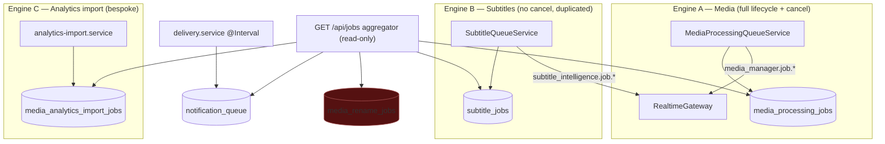

# Unified Jobs Center — Architecture Review

**Status:** Phase 1 review — *design only, no implementation.* Await sign-off before code.
**Sources of truth:** [ARCHITECTURE.md](ARCHITECTURE.md) (authoritative) + the live code (verified
file:line below). Single-tier, RBAC-only, no editions.
**Goal:** turn UltraTorrent's fragmented, three-engine background-work landscape into one
**operational control plane** for all asynchronous activity — by *generalizing* the existing job
model behind a common contract, not replacing it.

---

## Contents

1. [Executive summary](#1-executive-summary)
2. [Current job architecture](#2-current-job-architecture)
3. [Current database model](#3-current-database-model)
4. [Current state machine](#4-current-state-machine)
5. [Current queue & scheduler implementation](#5-current-queue--scheduler-implementation)
6. [Current cancellation & retry](#6-current-cancellation--retry)
7. [Current APIs](#7-current-apis)
8. [Current WebSocket events](#8-current-websocket-events)
9. [Job producers inventory](#9-job-producers-inventory)
10. [Job consumers / UI surfaces](#10-job-consumers--ui-surfaces)
11. [Permissions, audit, notifications, automation](#11-permissions-audit-notifications-automation)
12. [Performance characteristics](#12-performance-characteristics)
13. [Inconsistencies & duplicated logic](#13-inconsistencies--duplicated-logic)
14. [Missing capabilities (the gap)](#14-missing-capabilities-the-gap)
15. [Proposed target architecture](#15-proposed-target-architecture)
16. [Backward-compatibility & migration risks](#16-backward-compatibility--migration-risks)
17. [Incremental implementation plan](#17-incremental-implementation-plan)
18. [Regression-prevention checklist](#18-regression-prevention-checklist)
19. [Open decisions](#19-open-decisions)
20. [Approval gate](#20-approval-gate)

---

## 1. Executive summary

UltraTorrent runs background work through **three independent execution engines** plus several
one-off paths, and **most heavy operations create no job record at all**. There is no single place
to answer "what is running / waiting / scheduled / failed / why." The read-only `GET /api/jobs`
aggregator (added recently — it merges five tables into a `JobSummary`) is the *seed* of a Jobs
Center but is a lowest-common-denominator view: no pagination, no lifecycle, no events, no actions.

**What exists (verified):**

- **`MediaProcessingQueueService`** — full lifecycle + cooperative cancel; 10 `MediaJobType`s;
  in-process (no broker/worker pool); no retry; no progress throttling.
- **`SubtitleQueueService`** — the same pattern *duplicated*, but **no cancellation**, inline
  lifecycle written twice, error truncated to 500 chars; 7 `SubtitleJobType`s (only
  `missing_scan` actually produced from the controller).
- **A third runner inside `analytics-import.service.ts`** for `MediaAnalyticsImportJob`.
- **`NotificationQueue`** (a delivery queue leased by an `@Interval` worker) and **`MediaRenameJob`**
  (a table with **no active writer anywhere in `src`** — the aggregator reads a dead table).
- **21 `@Interval` schedulers** (no `@Cron`), only loosely named; some are debug no-ops.
- Permission-scoped WS events by **event-name prefix** (`media_manager.job.*`,
  `subtitle_intelligence.job.*`, `media_manager.duplicates.*`, `files.*`, `notification.*`, …).

**The core problem is not a missing queue — it's the absence of a *normalized job contract*.** The
Unified Jobs Center should introduce a **`PlatformJob` + `PlatformJobEvent`** model, a **`JobRegistry`**
(modules declare `JobDefinition`s + `JobHandler`s), and a **`PlatformJobService`** that centralizes
lifecycle/progress/events — then re-implement the existing queue services as **thin adapters** over
it so every current caller keeps working unchanged. Producers migrate incrementally; the aggregator
evolves to read `platform_jobs` first.

**This is a very large, multi-phase feature** (bigger than the recent Workspace redesign). The
honest scope: a new schema + state machine + registry + execution context + reliability controls
(retry/pause/heartbeat/stall) + a full UI (13 pages) + schedule & worker registries + migrating
~40 operations + docs + tests. The plan below sequences it into 9 gated phases that never break the
existing three engines.

---

## 2. Current job architecture

Three execution engines, no shared contract:



`media_rename_jobs` (dashed/red) has **no producer** — a dead table the aggregator still reads.

- **Engine A** (`media-processing-queue.service.ts`): `create → start → progress → complete|fail|markCancelled`; `run`/`runDetached`; cooperative cancel via in-process `Set`s; boot reconciliation fails orphans.
- **Engine B** (`subtitle-queue.service.ts`): "same pattern" per its own doc comment, but lifecycle inlined in `run` **and** `resume` (duplicated), no cancel, no signal, errors `.slice(0,500)`.
- **Engine C** (`analytics-import.service.ts`): its own create + status transitions on `MediaAnalyticsImportJob` (has record counters + `progress`).

## 3. Current database model

| Table | Status vocabulary | Progress | Notable gaps |
|---|---|---|---|
| `media_processing_jobs` | `queued/running/completed/failed` (code also writes `cancelled`) | `Int 0..100` | no priority, attempts, parent, worker, heartbeat, schedule, events |
| `subtitle_jobs` | same | `Int` | + `provider/language`; same gaps |
| `media_rename_jobs` | `pending/preview/running/completed/failed/rolled_back` | **none** | **no writer**; no `updatedAt` |
| `media_analytics_import_jobs` | `pending/running/completed/failed/cancelled` | `Int` + record counters | own runner |
| `notification_queue` | *(none — leased via `leasedAt`)* | none | not a job, a delivery queue |

Indexes today: each of the three "job" tables has only `@@index([status])`, `[type]`, `[libraryId]`
(or `[sourceId]`/`[scheduledFor]`). No composite indexes for the query patterns a Jobs Center needs
(status+createdAt, status+priority, workspace/module + status, parent, correlation, worker, heartbeat).

## 4. Current state machine

There is **no enforced state machine** — each engine writes status strings directly via Prisma
`update`. Effective transitions:

```
queued → running → completed | failed | cancelled       (media)
queued → running → completed | failed                    (subtitle; no cancelled)
pending → running → completed | failed | cancelled       (analytics import)
```

Illegal transitions are not rejected (nothing stops a completed row being set back to running).
`markCancelled` in Engine A currently **emits the `FAILED` WS event** for a cancel — a semantic bug
the Jobs Center must not inherit.

## 5. Current queue & scheduler implementation

- **"Queue" is a misnomer.** `run`/`runDetached` create the row and execute the function body
  **inline in-process**; there is no worker pool, no concurrency cap, no durable pickup, no priority.
  Cancellation only reaches jobs the *current* process is running (in-memory `Set`).
- **Schedulers:** 21 `@Interval` decorators (no `@Cron`), e.g. `media_library_periodic_scan`,
  `notification_delivery_worker` (10s), torrent-sync poll (2s, unnamed), RSS poll (60s, unnamed),
  `subtitle_missing_scan`, `media_acquisition_*_sweep` (two are debug no-ops), `system_health_monitor`,
  `imdb_dataset_auto_update`, `trakt_scrobble`. Module manifests declare logical `schedulerJobs`
  names, but there is **no registry** tying a schedule to next-run/last-run/last-result/enabled state,
  and no run-now/enable/disable surface.
- **Redis** is used for caching/coordination (per ARCHITECTURE.md), not as a job broker.

## 6. Current cancellation & retry

- **Cancellation:** cooperative, in-process, media-only. `JobSignal.throwIfCancelled()` at a
  handler-chosen safe boundary; `run`/`runDetached` route `JobCancelledError → markCancelled`, any
  other throw → `fail`. `requestCancel` returns `false` for a job this process isn't running.
  **Subtitles and analytics-import cannot be cancelled.**
- **Retry:** **none anywhere.** No attempts column, no backoff, no retryable/non-retryable
  classification, no rerun.
- **Pause/resume:** **none.** `SubtitleQueueService.resume()` is a misnamed one-shot runner (no
  checkpoint).

## 7. Current APIs

- `GET /api/jobs` — the aggregator (auth-only guard; per-subsystem RBAC filtering in the service;
  no pagination — returns `{ jobs }` capped at 200, 100/subsystem).
- `POST /api/media/jobs/:jobId/cancel` — the **only** cancel endpoint (`@RequirePermissions(MEDIA_MANAGER_SCAN)`).
- `GET /api/media-server-analytics/import-jobs` + `/:id` — analytics import jobs (paginated).
- `GET /api/notification-center/queue` — the delivery queue monitor.
- Job *launches* are scattered across module controllers (media library scan/organize/reidentify/
  artwork/duplicate detect; subtitle scan-missing) using inline `@Body()` types, **no dedicated DTOs**.
- Shared infra available to reuse: `common/pagination.ts` (`Page<T>`, `parsePage`, `paginate`),
  `common/all-exceptions.filter.ts` (Nest default envelope), `AuditService.record(entry)`.

## 8. Current WebSocket events

`packages/shared/src/events.ts` `WS_EVENTS`. Job-relevant groups: `media_manager.job.{started,progress,completed,failed}`; `subtitle_intelligence.job.{started,progress,completed,failed}`
(+ per-subtitle events); `media_manager.duplicates.{scan,resolution}.*`; `imdb.dataset.*`;
`files.operation.*`/`files.cleanup.*`/`files.trash.*`; `notification.*`. `RealtimeGateway` scopes by
**event-name prefix → `perm:<key>` room** (e.g. `media_manager.*`/`imdb.*` → `perm:media_manager.view`).
An **EventEmitter2 bus** (`NOTIFICATION_BUS_CHANNEL`) exists with the Notification Center as its sole
subscriber. **Frontend gap:** `lib/ws.ts` `WsEventMap` registers media-job/files/imdb events but
**omits subtitle-job and duplicate-scan events**.

## 9. Job producers inventory

Most heavy operations **do not create a job record**. Summary (full table verified in the review notes):

| Runs as a job row | Synchronous / no job record |
|---|---|
| library scan/organize, media identification (bulk + automation), artwork fetch, media_server_refresh (automation), NFO/metadata/rename (**automation path only**), duplicate detect, subtitle **missing_scan** | metadata fetch endpoint, NFO generate endpoint, subtitle **search/download/validate/synchronize**, duplicate **resolve/cleanup**, show-folder merge, media probe (+ backfill via scheduler), **all torrent ops**, indexer search, **all file bulk ops** (copy/move/trash/restore/cleanup), newsletter gen/deliver |
| analytics import (Engine C), notification delivery (leased queue) | RSS poll, media-acquisition sweeps, provider health (schedulers, not job rows) |

Consequence: "unifying jobs" is **not** just aggregating existing rows — it means giving many
currently-synchronous or ad-hoc paths a normalized job record. This is the bulk of Phase 7's work
and must be incremental and behavior-preserving.

## 10. Job consumers / UI surfaces

- **`WorkspaceOverview` jobs widget** (`useWorkspaceJobs` → `api.jobs.list`, polls 5s) — per-workspace active jobs.
- **Notification Queue Monitor** (`/notifications/queue`), **Analytics Import** page (paginated jobs), **Media Manager** live scan/duplicate progress (subscribes to `media_manager.job.*`), **IMDb dataset** progress.
- Reusable FE infra: `lib/ws.ts` typed client (durable across reconnect), `RealtimeContext`,
  `components/ui/{pagination,table}`, the **bulk-result pattern** (`components/files/bulk-result.ts`:
  `BulkResult`/`mergeBulkResults`/`bulkLevel`), TanStack Query polling patterns. **No `jobs` i18n
  namespace** yet (the widget borrows `shell`).

## 11. Permissions, audit, notifications, automation

- **Permissions:** there are **no `jobs.*` permissions** today; the aggregator reuses each
  subsystem's `*.view`. The brief's `jobs.view/cancel/retry/...` set must be *added*, and gated so
  Jobs Center visibility never bypasses the underlying module/resource permission.
- **Audit:** `AuditService.record({ userId, action, objectType, objectId, result, ipAddress, userAgent, metadata })`; each controller builds its own `auditCtx(req)` (no shared decorator).
- **Notifications:** `NOTIFICATION_EVENTS` already includes `media.processing_completed/failed`,
  `media.library_scan_completed`, duplicate/subtitle/newsletter events — a foundation for the
  Jobs Center's `job.failed/stalled/...` events.
- **Automation:** `AUTOMATION_TRIGGERS`/`ACTIONS` already spawn jobs (`media_scan_library`,
  `media_run_duplicate_scan`, `subtitle_scan_missing`, …) via `MediaAutomationActions`/`SubtitleAutomationActions` → `queue.run(...)`. New job.* triggers/actions extend this.

## 12. Performance characteristics

- **No progress throttling:** every `progress()` tick does a DB `update` **and** a WS emit — fine at
  today's volume, a DoS risk at Jobs-Center scale (design must throttle DB writes + batch WS).
- **No composite indexes** for job queries; the aggregator caps at 100/subsystem and sorts in memory.
- The aggregator does **N independent table reads** per request (no unified table).

## 13. Inconsistencies & duplicated logic

1. **Three engines, one pattern** — Engine B duplicates Engine A's lifecycle twice and diverges
   (no cancel, error truncation, row created `running` vs `queued→running`).
2. **A dead table** — `media_rename_jobs` has no writer; the aggregator surfaces it anyway.
3. **Cancel emits `FAILED`** — Engine A's `markCancelled` broadcasts the failed event.
4. **Declared-but-unused job types** — subtitle `search/download/validate/synchronize/bulk_scan`.
5. **Status vocabularies differ** across tables (`queued` vs `pending`; `cancelled` vs `canceled`
   vs synthesized). The aggregator already needs a `normalizeStatus` shim.
6. **Ad-hoc WS scoping by string prefix** rather than a declared per-job permission.
7. **No DTOs** on job launches; **no shared audit context** helper.

## 14. Missing capabilities (the gap)

Against the brief's objectives, absent today: a normalized job contract & registry; parent/child &
dependencies; structured events table; retry/backoff/rerun; pause/resume/checkpoints; heartbeats,
stall & worker-lost detection; a scheduled-task registry (next/last run, run-now, enable/disable);
real metrics (queue depth, throughput, failure/retry rates, durations, P50/P95); server-side
paginated/searchable/filterable job lists; a job-detail timeline/diagnostics/relationships view;
bulk job actions; a unified permission-scoped `jobs.*` WS channel; and a Jobs Center UI.

## 15. Proposed target architecture

**Principle: generalize behind a common contract; adapt, don't rewrite (non-negotiables #1–#5).**

### 15.1 Data model — new tables, legacy preserved
- **`platform_jobs`** — the normalized superset (identity, relations, lifecycle, execution controls,
  ownership, sanitized inputs/outputs, metrics). A new table, **not** a rename of
  `media_processing_jobs` (avoids migration risk per the brief). Column set follows the brief's model,
  pruned to what handlers actually populate (no fabricated fields).
- **`platform_job_events`** — the structured event log (`jobId, sequence, level, eventType,
  messageKey, messageParams, sanitizedMessage, progress, metadata, createdAt`), monotonic sequence,
  bounded payloads, retention. **Never** a single unbounded text column on the job row.
- **`platform_job_schedules`** and **`platform_job_workers`** — schedule & worker registries.
- Legacy tables stay; producers migrate incrementally.

### 15.2 Execution core (module `jobs`, no imports from feature modules — #6)
`PlatformJobService` (central lifecycle/progress/events; the *only* writer of job rows) · `JobRegistry`
(dup-registration + ownership validation; `JobDefinition{type,moduleKey,workspaceKey,labelKey,
requiredPermission,capabilities,validateInput,summarizeInput}` + `JobHandler.execute(input,ctx)`) ·
`JobExecutionContext` (id, attempt, correlation, identity, permission ctx, cancellation signal,
progress reporter, structured-event logger, heartbeat, checkpoint load/save, parent/root, child
creator, dependency helper, metrics, sanitized-result helper) · a **server-enforced state machine**
(the brief's 15 statuses + transition matrix, invalid transitions rejected) · sanitized-error &
secret-redaction utilities.

### 15.3 Adapters (backward compatibility — #3, #4)
`MediaProcessingQueueService` and `SubtitleQueueService` are **re-implemented as thin adapters**:
same public API (`run`/`runDetached`/`requestCancel`/`progress`/…) delegating to `PlatformJobService`
with a registered definition per existing `MediaJobType`/`SubtitleJobType`. Existing callers and the
`media_manager.job.*` / `subtitle_intelligence.job.*` WS events keep working via a **compatibility
bridge** that re-emits the legacy event names alongside the new `jobs.*` channel. `analytics-import`
and `notification` delivery adopt the contract in a later phase; until then the aggregator reads both.

### 15.4 Real-time
A unified permission-scoped `jobs.*` event family (`jobs.created/queued/started/progress/
phase_changed/…/completed/failed/cancelled/stalled/child_created/schedule.updated/worker.status`),
scoped by each job's `requiredPermission` (not just a name prefix), with a legacy bridge and
post-reconnect reconciliation. FE `WsEventMap` gains the `jobs.*` and the currently-missing
subtitle/duplicate events.

### 15.5 Nav placement (reconciled with the Workspace model)
The brief suggests a *Monitoring* workspace; the platform now has **Analytics** (formerly Monitoring)
and **System**. **Recommendation:** a new **`jobs_center`** core module, a **Jobs Center** presence in
the **System** workspace at **`/jobs`** (the platform's operational plane), with a "View all →" link
from every workspace Overview jobs widget and contextual filters (`/jobs?workspace=…&module=…&status=…`).
13 route-driven pages over shared list components (Overview, All/Running/Queued/Waiting&Blocked/
Scheduled/Failed/Completed/Cancelled, Detail, Scheduled Tasks, Workers, Settings).

## 16. Backward-compatibility & migration risks

| Risk | Mitigation |
|---|---|
| Adapter changes behavior of live media/subtitle jobs | Adapters preserve exact public API + event names; golden tests on existing flows before/after |
| Dead `media_rename_jobs` read by aggregator | Drop `rename` subsystem from the aggregator (no producer) as a first, isolated fix |
| Most ops have **no** job record → "unifying" adds records to synchronous paths | Do it per-operation, behind the adapter, one PR each; never change the operation's semantics |
| New 15-status machine vs legacy 5 | Legacy statuses map onto the new set; adapter never emits an out-of-range status |
| WS scoping change (prefix → per-job permission) | Bridge keeps legacy names/rooms; new channel added in parallel |
| Large new schema + migration | Additive migrations only; new tables; no destructive rename of existing tables |
| Progress-write DoS at scale | Throttled DB persistence + batched WS from day one of the core |
| Cross-user / secret leakage in events & diagnostics | Redaction + sanitized-error utilities are core primitives, tested |

**Hard backward-compat requirements:** existing `MediaProcessingQueueService`/`SubtitleQueueService`
callers unchanged; existing WS event names still delivered; existing endpoints
(`/media/jobs/:id/cancel`, analytics import, notification queue) still work; file-path confinement,
Trash-first, stale-plan validation, provider safety, and service-layer authZ all remain in effect.

## 17. Incremental implementation plan

Nine phases, each ending with the full gate (lint · tsc · BE tests · FE tests · i18n parity · Prisma
validate · BE build · FE build · **Nest boot verify** · docs · risks). Nothing breaks the three
engines at any step.

1. **Audit & design** — this document.
2. **Core job platform** — `platform_jobs` + `platform_job_events` schema; `PlatformJobService`,
   `JobRegistry`, `JobExecutionContext`, state machine (+ full transition-matrix tests); redaction &
   sanitized-error utilities. No producer changes yet.
3. **Reliability controls** — retry/backoff/rerun; pause/resume/checkpoint interface; heartbeats,
   stall & worker-lost detection + boot/periodic reconciliation.
4. **API & real-time** — the `/api/jobs/*` REST surface (overview/catalog/list/detail/events/children/
   dependencies/audit/actions/bulk/schedules/workers/settings/diagnostics) with DTOs, RBAC (`jobs.*`
   perms), pagination caps, throttling, audit; the unified `jobs.*` WS channel + legacy bridge.
5. **Unified Jobs Center UI** — the 13 pages over shared route-driven list components; live
   progress; job detail (timeline/diagnostics/relationships/audit); bulk actions via the existing
   bulk-result pattern; `jobs` i18n namespace (en-US + es-PR); command-palette entries; a11y + responsive.
6. **Schedules & capacity** — schedule registry over the 21 `@Interval`s (next/last run, run-now,
   enable/disable, history); Workers & Settings pages (honest single-in-process worker; contract
   ready for multi-worker); real Overview metrics.
7. **Module migration** — re-implement Media & Subtitle queue services as adapters; then register
   real handlers for currently-synchronous/ad-hoc ops incrementally (one PR each), preserving
   semantics; drop the dead `rename` subsystem; fix cancel-emits-FAILED.
8. **Platform integration** — Notification Center `job.*` events; Automation `job.*`
   triggers/actions; Command palette; workspace-contextual deep links; retention as a registered,
   observable scheduled cleanup job.
9. **Hardening, docs, regression** — security review + SECURITY.md threat model; performance
   (indexes, no-N+1, throttle, retention) at scale; the full docs set
   (`UNIFIED_JOBS_CENTER.md`, `JOB_ARCHITECTURE.md`, `JOB_HANDLER_DEVELOPMENT.md`, `JOB_LIFECYCLE.md`,
   `JOB_SCHEDULING.md`, `JOB_SECURITY.md`) + updates to ARCHITECTURE/API/MODULES/NAVIGATION/README;
   comprehensive test sweep; final regression pass.

## 18. Regression-prevention checklist

- [ ] Existing `MediaProcessingQueueService` / `SubtitleQueueService` public APIs unchanged (type + golden tests).
- [ ] `media_manager.job.*` and `subtitle_intelligence.job.*` WS events still emitted (bridge test).
- [ ] `POST /media/jobs/:id/cancel`, analytics import endpoints, notification queue endpoint unchanged.
- [ ] Live Media Manager scan/duplicate progress UI still updates (no FE regression).
- [ ] Boot reconciliation of orphaned jobs preserved.
- [ ] No new placeholder pages / fake workers / fabricated metrics (acceptance #37).
- [ ] Path confinement, Trash-first, stale-plan validation, provider safety, service-layer authZ intact.
- [ ] No secret/credential/provider-response leakage in events, results, or diagnostics.
- [ ] i18n en-US ↔ es-PR parity (test-enforced) for every new string.
- [ ] Additive Prisma migrations only; no destructive rename of existing job tables.
- [ ] Nest boots cleanly after every phase (DI graph resolves).
- [ ] All 15 state transitions covered; invalid transitions rejected by tests.

## 19. Open decisions

- **D-1 — Nav home.** *Recommend* Jobs Center in the **System** workspace at `/jobs` (the brief's
  "Monitoring" is now Analytics + System). Alternative: reintroduce a Monitoring workspace.
- **D-2 — New `platform_jobs` table vs extend `media_processing_jobs`.** *Recommend* a **new table +
  adapters** (lowest migration risk; the brief permits a neutral abstraction over an existing name,
  but extending the media table in place would entangle every media caller). 
- **D-3 — Migration breadth for currently-synchronous ops.** *Recommend* registering job records for
  the **genuinely long-running** ones first (duplicate resolve/cleanup, file bulk ops, subtitle
  search/download, indexer search, newsletter delivery); leave truly fast calls synchronous (a job
  record for a 50ms call is noise). Decide the cut line per operation in Phase 7.
- **D-4 — Worker model.** *Recommend* representing the **single in-process worker honestly** now,
  with a `platform_job_workers` contract that supports future multi-worker — no fake workers.
- **D-5 — Scope/sequencing.** This is a 9-phase effort. *Recommend* approving Phases 2–3 (core +
  reliability) first, reviewing, then continuing — rather than one unbroken run.

## 20. Approval gate — CLEARED 2026-07-21

All gate items approved:

1. ✅ **Target architecture** (§15) approved as proposed — new `platform_jobs`/`platform_job_events`
   + `JobRegistry` + `PlatformJobService`/state machine; existing engines become thin adapters.
2. ✅ **D-1** Jobs Center → **System** workspace at `/jobs` (`jobs_center` module).
   ✅ **D-2** new `platform_jobs` table + adapters (not extend-in-place).
   ✅ **D-3** migrate **long-running ops only** in Phase 7.
   ✅ **D-4** single in-process worker represented honestly; contract ready for multi-worker.
   ✅ **D-5** **continue autonomously Phases 2→9**, gate per phase.

Phases 2→9 proceed incrementally (green gate per phase), preserving every existing caller and
**removing nothing**.

---

See also: [ARCHITECTURE.md](ARCHITECTURE.md) · [NAVIGATION.md](NAVIGATION.md) ·
[WORKSPACE_ARCHITECTURE.md](WORKSPACE_ARCHITECTURE.md) · [SECURITY.md](SECURITY.md) ·
[DUPLICATE_CENTER.md](DUPLICATE_CENTER.md)
