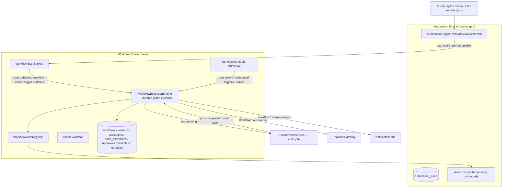

# Visual Workflow Builder — Architecture Review

**Status:** Phase 1 review — *design only, no implementation.* Await sign-off before code.
**Sources of truth:** [ARCHITECTURE.md](ARCHITECTURE.md) (authoritative) + the live code (verified
file:line below). Single-tier, RBAC-only, no editions.
**Goal:** evolve the existing **Automation Engine** from flat rules into a durable, versioned,
**visual workflow platform** — extending it, never replacing it, and never regressing the simple
rules that exist today.

---

## Contents
1. [Executive summary](#1-executive-summary)
2. [Current Automation Engine](#2-current-automation-engine)
3. [Current trigger & action catalogs](#3-current-trigger--action-catalogs)
4. [Current condition, rule & execution model](#4-current-condition-rule--execution-model)
5. [Current logs, scheduling, RBAC, audit, real-time](#5-current-logs-scheduling-rbac-audit-real-time)
6. [Current frontend & its limitations](#6-current-frontend--its-limitations)
7. [Scalability limits & circular-dependency workarounds](#7-scalability-limits--circular-dependency-workarounds)
8. [Reuse assets — what the platform already gives us](#8-reuse-assets)
9. [Proposed architecture](#9-proposed-architecture)
10. [Durable execution](#10-durable-execution)
11. [Versioning model](#11-versioning-model)
12. [Node registry & graph contract](#12-node-registry--graph-contract)
13. [Canvas library decision](#13-canvas-library-decision)
14. [Migration strategy](#14-migration-strategy)
15. [No-regression list (must not break)](#15-no-regression-list)
16. [Security & threat model](#16-security--threat-model)
17. [Implementation phases](#17-implementation-phases)
18. [Open decisions](#18-open-decisions)
19. [Approval gate](#19-approval-gate)

---

## 1. Executive summary

The current Automation Engine is a **single ~763-line file** (`automation.module.ts`): an
event/poll-driven condition/action engine over a **flat** `AutomationRule`
(`{trigger, conditions[], actions[], isEnabled, priority}`). Rules are linear — an AND of
conditions, then a sequence of actions — with **no branching, no multi-step graph, no delays,
no waits, no versioning, and no scheduler**. It is reliable and idempotent (rising-edge dedup +
an `AutomationLog` success ledger), and its action dispatch already delegates to the module
action services (`MediaAutomationActions`/`SubtitleAutomationActions`/`RssAutomationActions`).

The Workflow Builder adds a **parallel, additive** model — `Workflow` / `WorkflowVersion` /
`WorkflowExecution` / `WorkflowNodeExecution` / `WorkflowApproval` / `WorkflowVariable` /
`WorkflowTemplate` — with a **durable graph executor**, a **registry-driven node catalog**, and a
**visual editor**. Crucially it **reuses**, not duplicates:

- **Trigger nodes reference the existing 27-trigger catalog**; the workflow engine hooks the
  *same* dispatch surface (`evaluate`/`evaluateEvent`) via a ModuleRef-lazy bridge — **no second
  event bus** (non-negotiable #5).
- **Action nodes reference the existing 29-action catalog**; a shared **action dispatcher**
  (extracted from the engine's `runAction`/`runEventAction`) executes them — **no duplicated
  action logic** (#2), preserving every safety service.
- **Durability rides the just-shipped Unified Jobs Center**: a workflow execution *is* a
  platform job; long-running action nodes create **child jobs**; waits/delays/approvals persist
  relationally and resume via the domain-event bus + the existing `@nestjs/schedule` conventions —
  **no separate scheduler** (#6), restart-safe (#14/#15).

The Workflow Builder becomes the **orchestration layer** tying the event-driven modules together,
built on infrastructure that already exists.

**Honest scale:** this is the largest of the three recent mega-features — a durable execution
engine, ~9 new relational models, a registry + typed graph contract + strict validator, a
**visual canvas editor requiring a new frontend dependency**, 13 node types, versioning, dry-run
simulation, approvals, subworkflows, scheduled triggers, ~18 new permissions, 10 pages, and 9
docs. It is planned as 10 gated phases; it will take several to land safely.

## 2. Current Automation Engine

`apps/backend/src/modules/automation/automation.module.ts` — the whole engine in one file.
`AutomationEngine` (constructor injects Prisma, `EngineRegistryService`, `NotificationsService`,
`MediaService`, the three action services, `AuditService`, `ModuleRef`).

Public methods:
- **`evaluate(trigger, context, previous?)`** — one torrent → `applyRules(loadRules(trigger), …)`.
- **`evaluateMany(trigger, items[])`** — batch/poll (loads rules once).
- **`evaluateEvent(trigger, context)`** — non-torrent events over a plain `Record`; conditions via
  `applyOperator`, actions via `runEventAction`; best-effort, dispatches `automation.failed` on error.
- **`reconcileCompleted(torrents)`** — backfill for `torrent.completed` using the `AutomationLog`
  ledger for idempotency; a *failed* run is not marked done, so it retries next cycle.

Action dispatch — **two** executors, both reused unchanged by workflows:
- `runAction` (torrent context) — delegates to `subtitleActions.execute` / `mediaActions.execute`
  by set membership, then a switch (`move/pause/stop/delete/delete_with_data` via the engine
  registry, `notify/send_notification/webhook`, `rename_for_media` via `media.apply`).
- `runEventAction` (event context) — delegates to `rssActions`/`subtitleActions`/`mediaActions`
  `.execute`, then `notify/notify_admin/send_notification/webhook`.

`ModuleRef` lazy lookup is used only for `NotificationCenterService` (`sendViaCenter`); the three
action services are statically injected. Webhook actions are SSRF-guarded (`assertSafeOutboundUrl`,
`redirect: 'error'`, 10s timeout). Callers reach the engine via lazy `ModuleRef.get(AutomationEngine)`.

**Who fires triggers** (the dispatch surface workflows must hook):
`torrent-sync.service` (`torrent.completed`, `ratio.reached`, `reconcileCompleted`),
`media-processing.service` (`media.detected/matched/unmatched/rename_completed/missing_artwork/
missing_subtitles/server_refresh_failed`), `imdb.service` (`media.matched`),
`subtitle-trigger.service` (subtitle events), `rss.module` + `rss-show-status-refresh` (rss events),
and `JobAutomationBridge` (`job.*` events from the Jobs Center).

## 3. Current trigger & action catalogs

- **`AUTOMATION_TRIGGERS`** — 27 `{id, label, category}` (torrent ×2, media ×13, rss ×5, subtitle ×4,
  jobs ×4). **Six `media.duplicate_*` triggers and `job.retry_exhausted` are catalogued but have no
  producer** — they never fire today (surface honestly; don't offer them as if live).
- **`AUTOMATION_ACTIONS`** — 29 `{id, label, category}` (torrent/notification/media/rss/subtitle).
  Deliberately **no destructive "resolve duplicates" action** — that safety choice must carry into
  workflows.
- Exposed at `GET /api/automation/catalog` (`AUTOMATION_VIEW`).

The Workflow node palette is **derived from these catalogs** — a Trigger node = a catalog trigger,
an Action node = a catalog action. This is the single source of truth (non-negotiable #2/#3/#4).

## 4. Current condition, rule & execution model

- **`AutomationRule`** (Prisma): `{ id, name, description, trigger:String, conditions:Json
  ([{field,op,value}]), actions:Json ([{type,params}]), isEnabled, priority, timestamps }`. Flat,
  single-trigger, AND-of-conditions, sequential actions. **No indexes** beyond the PK (the workflow
  work should add the missing `trigger`/`isEnabled` index while here).
- **8 operators** (`applyOperator`): `eq, neq` (strict ===/!==), `gt/gte/lt/lte` (Number-coerced),
  `contains` (String includes), `matches` (case-insensitive regex, invalid → false). The workflow
  Condition node **extends** this set (the brief's ~20 operators) while keeping these semantics.
- **Execution is synchronous/inline** — `applyRules` runs conditions then awaits each action in
  order, in the caller's async context. There is no persisted per-step state, no resumability, no
  delays/waits. This is exactly the gap the durable workflow executor fills.
- **Idempotency**: rising-edge (`applyRules` skips if `previous` already matched) + the
  `AutomationLog` success ledger keyed on `{ruleId}::{hash}`.

## 5. Current logs, scheduling, RBAC, audit, real-time

- **Logs**: `AutomationLog { id, ruleId, status(success|failed|skipped), context:Json, message,
  createdAt }`, `@@index([ruleId])`, cascade-deletes with the rule. Paginated via the shared
  `paginate` helper.
- **Scheduling: none.** No `@Interval`/`@Cron` in the automation module — rules are purely
  event/poll-driven. **Scheduled workflow triggers are net-new** (must reuse `@nestjs/schedule` +
  the Jobs Center schedule conventions; published workflows only; explicit execution identity).
- **RBAC**: only `automation.view` / `automation.manage`. **No `workflows.*` permissions exist** —
  ~18 are net-new.
- **Audit**: only inside the engine (`recordAudit` → `automation.rule.executed`). The service layer
  does no auditing. Workflow endpoints will audit via `AuditService` per the platform standard.
- **Real-time**: an `AutomationTriggered` event exists in the catalog; there is no dedicated
  automation WS channel today. Workflow execution needs a new permission-scoped `workflow.*` /
  `workflow.execution.*` / `workflow.node.*` channel (mirroring the Jobs Center's `jobs.*`).

## 6. Current frontend & its limitations

`pages/AutomationPage.tsx` — a **form-based** rule editor (Cards + a Dialog with a trigger `Select`,
condition rows, action rows, a logs dialog). **No canvas / nodes / edges.** Two real limitations:

1. **Catalog drift (a real bug):** the UI **hard-codes only 2 triggers** (`torrent.completed`,
   `ratio.reached`) and **8 actions**, and **does not call `/automation/catalog`** — so 25 triggers
   and 21 actions the backend supports are unreachable from the UI. The workflow node palette needs
   the full catalog anyway, so **fixing this (drive the rule editor + palette from
   `/automation/catalog`) is in scope** (see D-5).
2. **No graph library** — `package.json` has no `@xyflow`/`reactflow`/`dagre`/`elkjs`/`cytoscape`/
   `d3`/`mermaid` (only `recharts` for charts). A canvas dependency is a real, new decision (§13).

The `automation` i18n namespace exists (`page/trigger/actionType/card/editor/params/logs/…`); a new
`workflows` namespace is needed with full en-US ↔ es-PR parity.

## 7. Scalability limits & circular-dependency workarounds

- **Single-file engine** — fine for rules; the workflow engine must be a proper multi-file module
  (registry, executor, node executors, validator, scheduler, bridges).
- **Circular-dep pattern already in place**: `AutomationModule imports RssModule` behind a
  `forwardRef`, and callers reach the engine via lazy `ModuleRef.get(AutomationEngine)`. Workflows
  will follow the same discipline — the workflow module can depend on the automation engine
  (for the action dispatcher) and on the `@Global` Jobs Center, while producers/bridges reach the
  workflow starter lazily. No new cycles.
- **No indexes** on `AutomationRule.trigger` and JSON-path ledger queries — acceptable at rule
  volumes; the workflow tables must be properly indexed from day one (the brief's index list).

## 8. Reuse assets

The platform already provides most of the hard parts — the design leans on them, per the
non-negotiables:

| Need | Reuse |
|---|---|
| Triggers / actions | `AUTOMATION_TRIGGERS`/`AUTOMATION_ACTIONS` + the engine's action dispatch |
| Event surface | `AutomationEngine.evaluate`/`evaluateEvent` (hook, don't duplicate) — **no 2nd bus** |
| Durable long-running work | **Unified Jobs Center** (`PlatformJobService`): workflow execution = parent job; action nodes = child jobs |
| Scheduling | `@nestjs/schedule` + Jobs Center schedule conventions — **no 2nd scheduler** |
| Notifications | Notification bus + `send_notification` action + `NOTIFICATION_EVENTS` |
| Secrets | the platform `SecretCipher` (for encrypted workflow variables / webhook secrets) |
| Path safety / Trash-first / stale-plan / preview | the **existing protected services** action nodes already call |
| Pagination / errors / audit / RBAC guards | `paginate`, `AllExceptionsFilter`, `AuditService`, `PermissionsGuard` |
| Real-time | `RealtimeGateway.emitToPermission` (per the Jobs Center pattern) |

## 9. Proposed architecture

**Additive, extend-not-replace.** New module `workflow_builder` (backend `WorkflowModule`), the
simple `AutomationRule` engine untouched.

- **Trigger dispatch (no 2nd bus):** the automation engine's `evaluate`/`evaluateEvent` gains one
  call — after rule evaluation — to a lazily-resolved `WorkflowStartService.onTrigger(trigger,
  context, correlationId)`. It finds **published** workflows whose trigger node matches (+ node
  conditions) and starts a durable execution. Torrent (non-bus) and event (bus) triggers both flow
  through this single surface. `WorkflowStartService` also checks executions **waiting for an
  event** and resumes matches.
- **Action nodes (no duplicated logic):** an Action node executor calls a shared
  `AutomationActionDispatcher` (extracted from the engine's `runAction`/`runEventAction`), so
  workflows run the *same* action code — with the *same* safety services and the underlying action
  permission enforced against the execution identity.
- **Control nodes** (condition/branch/delay/wait/parallel/join/transform/variable/approval/
  subworkflow/end) are built-in node definitions with their own executors — no side effects beyond
  the graph/state.

## 10. Durable execution

The executor is a **persistent step machine** over relational state (never inside HTTP; #7):

- `WorkflowExecution` (pinned `workflowVersionId`, status, correlationId, currentNodeIds) +
  `WorkflowNodeExecution` per node (status, attempt, input/output summaries, `jobId`). **Execution
  state is relational and queryable**, not buried in graph JSON (per the brief).
- **A workflow execution is a Jobs Center parent job.** Long-running Action nodes create/link
  **child platform jobs** and the node stays `waiting` until the job completes; a `jobs.completed`
  domain event resumes the node. **A queued job is not a successful node** (#25).
- **Durable waits/delays/approvals** (restart-safe, #14/#15):
  - *Delay* → persist `resumeAt`; `WorkflowScheduler` (`@Interval`, reusing conventions) resumes due
    delays. *Bounded* (max delay). Cancellable while waiting.
  - *Wait-for-event* → execution parked `waiting_for_event` with correlation criteria;
    `WorkflowStartService` resumes on a matching event; timeout branch via the scheduler.
  - *Approval* → a `WorkflowApproval` row; resolving resumes; expiry via the scheduler → timeout branch.
- **Restart safety**: on boot, reconcile executions left `running` by a dead process (like the Jobs
  Center) and re-arm timers from persisted `resumeAt`/`expiresAt` — nothing lives only in memory.
- **Guards**: max execution duration, max node count, max parallelism, max subworkflow depth,
  heartbeats + stalled-execution detection.
- **Server-enforced state machines** for execution and node statuses (the brief's status sets) with
  a full transition-matrix test (mirroring the Jobs Center `job-status.ts` approach).

## 11. Versioning model

`Workflow { currentDraftVersionId, publishedVersionId, enabled, status, … }` +
`WorkflowVersion { versionNumber, status, graph:Json (immutable once published), checksum,
requiredPermissions, changeNotes, … }`.

- Editing a published workflow creates/updates a **draft**; **published versions are immutable** (#12).
- **Executions pin `workflowVersionId`** and never change because the canvas was edited (#13, and
  criteria #7). Disabling blocks *new* executions but preserves active ones.
- Validate → Publish (server re-validates the whole graph; publish fails server-side on error).
  Clone, compare (node/edge diff via checksum + structural diff), rollback (republish a prior graph
  as a new current version — never mutating old history), archive.

## 12. Node registry & graph contract

- **`WorkflowNodeRegistry`** — `WorkflowNodeDefinition` per type (type, category, labelKey/descKey,
  icon, input/output/config **schemas**, requiredPermissions, requiredModules, capabilities:
  retry/timeout/simulation, side-effect level, **destructive flag**, docs). Trigger/Action node
  definitions are **generated from the automation catalog**; control nodes are built-in. A
  `WorkflowNodeExecutor` per type — **no giant switch**.
- **Typed graph contract** (`WorkflowGraph { schemaVersion, nodes[], edges[], metadata, viewport,
  groups, comments }`) — stable node/edge ids, **strict server-side validation**, migration support
  for future `schemaVersion`. **No executable code in the graph**; client-supplied action ids are
  **server-validated** against the registry + the caller's permissions.
- **Expressions/variables** — a constrained `{{ path }}` resolver over `trigger/workflow/execution/
  node.<id>/job/user/system/variables` scopes. **No eval/Function/shell** (#9/#10); regex nodes use
  a length/complexity-bounded, timeout-guarded matcher.

## 13. Canvas library decision

The editor needs a node/edge canvas (drag/drop, zoom/pan, minimap, connection validation,
read-only execution mode). Options evaluated:

| Option | License | Fit | Verdict |
|---|---|---|---|
| **@xyflow/react** (React Flow v12) | **MIT** | React-first, TS-native, actively maintained, extensible custom nodes, minimap/controls built in, ~large (tree-shakeable) | **Recommended** — the de-facto standard; building this from scratch is a multi-week canvas engine |
| Build custom (SVG/canvas) | — | Full control, zero dep | Rejected — enormous, error-prone, reinvents pan/zoom/edge routing |
| cytoscape / jointjs / d3 | mixed | graph viz, not a React node editor | Rejected — poor React/TS fit for an *editor* |

**Recommendation:** add **`@xyflow/react` (MIT)** as the sole new frontend dependency, lazy-loaded on
the editor route only (kept out of the main bundle), with **`elkjs` (EPL, MIT-compatible) or dagre**
for optional auto-layout. Accessibility gap (canvas is inherently visual) is covered by an
**accessible non-canvas list/tree representation** of the graph (per the brief) and full keyboard
operation of the palette/config panels. **This is a real dependency decision for sign-off (D-1).**

## 14. Migration strategy

Additive and non-destructive:
1. **New tables only** (additive migrations); `automation_rules`/`automation_logs` untouched.
2. **Simple rules keep working exactly** — the engine's `evaluate`/`evaluateEvent`/
   `reconcileCompleted`, rising-edge, idempotency ledger, CRUD, and logs are unchanged; the workflow
   hook is one *additional* call, guarded so a workflow error never affects rule execution.
3. **Fix the FE catalog drift** (D-5): drive the rule editor from `/automation/catalog` so all 27
   triggers/29 actions are reachable — the palette needs it anyway.
4. **Rule → workflow conversion** for compatible rules (single trigger → trigger node; conditions →
   condition node; actions → sequential action nodes). One-way, opt-in; the original rule is left
   intact.
5. **Duplicate/`job.retry_exhausted` triggers** stay honestly marked "no producer" until wired.

## 15. No-regression list

The following existing behaviors **must not change** (regression tests to lock them):

- [ ] `evaluate` / `evaluateMany` / `evaluateEvent` / `reconcileCompleted` behavior identical.
- [ ] Rising-edge dedup (`applyRules` skip when `previous` matched) preserved.
- [ ] `AutomationLog` success-ledger idempotency (`{ruleId}::{hash}`, once per torrent) preserved.
- [ ] The 8 operators keep their exact semantics (strict eq/neq, Number/String coercion, regex).
- [ ] Action dispatch (`runAction`/`runEventAction`) delegation + the safety services
      (SSRF-guarded webhooks, `media.apply`, engine registry) unchanged.
- [ ] Rule CRUD + `/automation/catalog` + logs pagination unchanged.
- [ ] The `automation.rule.executed` audit shape unchanged.
- [ ] `JobAutomationBridge` (`job.*` → `evaluateEvent`) still works.
- [ ] A workflow failure is isolated — it never throws into or blocks rule evaluation.
- [ ] The Automation workspace's existing Rules + Notification Center surfaces unaffected.

## 16. Security & threat model

Per platform standards (JWT + `PermissionsGuard` + DTOs + pagination caps + throttling +
permission-scoped WS + audit) plus workflow-specific controls:

- **Underlying action permission enforced** against the execution identity — `workflows.edit`/`run`
  never grants an action the identity lacks (#17/#18).
- **Destructive nodes** reuse the existing protected services (preview/Trash-first/stale-plan/path
  safety), carry a destructive flag + publish-time warning, and may require approval — they **never
  bypass** the UI's safeguards (#11/#26).
- **No arbitrary code** — constrained expression evaluator, bounded/timeout-guarded regex, no
  eval/Function/shell (#9/#10).
- **Immutable published versions**; **version-pinned executions**; durable restart-safe waits.
- **Scheduled workflows** run under an **explicit, auditable execution identity**; won't run if
  required permissions/modules are unavailable.
- **Webhook triggers** (if built): unique encrypted secret (never re-exposed), rotation, rate limit,
  payload-size/content-type validation, replay protection; **outbound** webhook actions stay
  SSRF-guarded.
- Threat table (malicious definitions, privilege escalation, secret exfiltration, arbitrary code,
  webhook abuse/SSRF, infinite loops, excessive parallelism, replay/forged approvals, scheduled
  identity misuse, stale destructive plans, cross-user leakage, event-payload manipulation) →
  documented in `WORKFLOW_SECURITY.md` + a SECURITY.md pointer.

## 17. Implementation phases

Ten gated phases (each: lint · tsc · BE tests · FE tests · i18n parity · prisma validate · BE build ·
FE build · **Nest boot verify** · docs · risks). Nothing regresses the rules engine.

1. **Audit & architecture** — this document.
2. **Domain models & versioning** — schema (workflows/versions/executions/node_executions/approvals/
   variables/templates), state machines + transition tests, version immutability + checksum.
3. **Node registry & graph validation** — `WorkflowNodeRegistry`, typed graph contract, strict
   validator (the brief's checks), catalog-derived trigger/action definitions.
4. **Visual editor** — `@xyflow/react` canvas, palette, typed config panels, validation markers,
   read-only mode, accessible representation.
5. **Simulation / dry-run** — no-side-effect executor mode (conditions/branches/variables/rendered
   inputs, provider calls disabled).
6. **Durable execution** — the graph executor over relational state; version-pinned; restart-safe;
   Jobs Center parent/child integration; retries/timeouts/cancellation.
7. **Approvals, waits, parallel, join, subworkflows** — durable waits + approval center + recursion
   guards + join policies.
8. **Jobs Center integration** — workflow execution as a parent job; node → child job linking;
   completion resume.
9. **RBAC, audit, notifications, search** — `workflows.*` permissions, audit everywhere, Notification
   events, command-palette + scoped search.
10. **Security, performance, docs, regression** — threat model, indexes/retention/perf, the 9-doc set,
    full regression sweep (incl. the no-regression list above), FE catalog-drift fix.

## 18. Open decisions

- **D-1 — Canvas library.** *Recommend* `@xyflow/react` (MIT), lazy-loaded on the editor route only,
  + optional `elkjs`/`dagre` auto-layout, + an accessible non-canvas representation. Alternative:
  build a lighter custom canvas (much larger effort).
- **D-2 — Durability substrate.** *Recommend* reusing the **Unified Jobs Center** (execution = parent
  job; nodes = child jobs; waits resume via the bus + `@nestjs/schedule`). Honors "no 2nd
  scheduler/bus."
- **D-3 — Execution identity default.** *Recommend* the **initiating user** for event/manual triggers,
  and an **explicit workflow service identity** (least-privilege, audited) for scheduled triggers.
- **D-4 — Fix the FE catalog drift now.** *Recommend* yes — drive the rule editor + workflow palette
  from `/automation/catalog` (25 triggers/21 actions are currently unreachable in the UI).
- **D-5 — Scope & sequencing.** This is the largest feature yet. *Recommend* building the **durable
  backend first** (Phases 2–3, 6) with the editor (4) and integration (7–9) after, checkpointing —
  and confirming whether to run straight through or pause after the backend core.

## 19. Approval gate — CLEARED 2026-07-21

Approved to proceed on the recommended plan (extend-not-replace; `@xyflow/react` canvas; Jobs
Center durability; D-1..D-5 as recommended; backend-first, gated sequencing). Original gate items:

1. Approve the **extend-not-replace architecture** (§9–§12) — new parallel workflow model reusing the
   automation catalog/dispatch + the Jobs Center for durability; simple rules untouched.
2. Approve the **canvas dependency** (`@xyflow/react`, D-1) — or choose an alternative.
3. Resolve **D-2…D-5**.
4. Confirm the **incremental, gated** sequencing (§17) and run-through vs checkpoint.

On approval, Phase 2 proceeds incrementally (green gate per phase), preserving every existing rule
behavior (§15) and **removing nothing**.

---

See also: [ARCHITECTURE.md](ARCHITECTURE.md) · [UNIFIED_JOBS_CENTER.md](UNIFIED_JOBS_CENTER.md) ·
[WORKSPACE_ARCHITECTURE.md](WORKSPACE_ARCHITECTURE.md) · [SECURITY.md](SECURITY.md)
