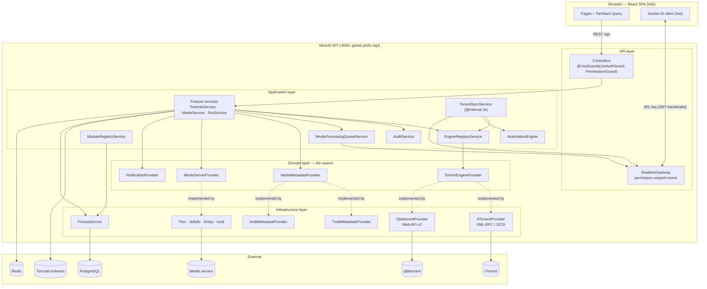
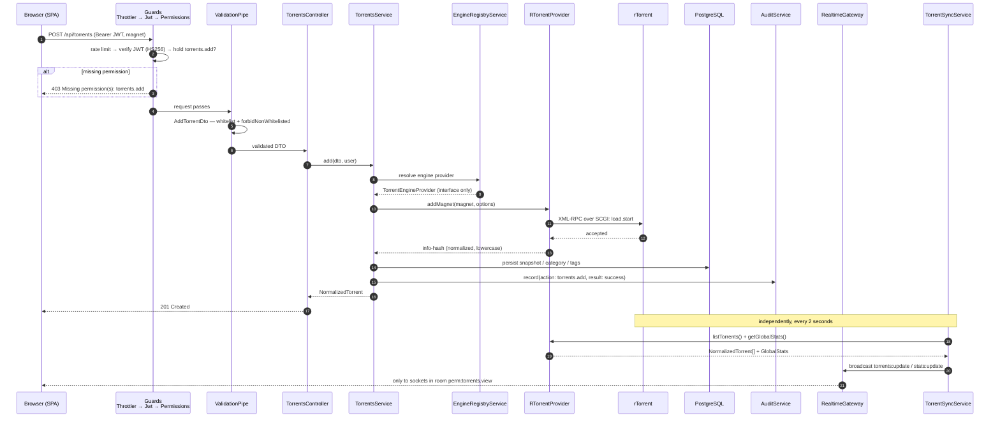

# Architecture

## Overview

UltraTorrent is a **server-side media acquisition and management platform**. The browser
never talks to a torrent engine: the React SPA talks to the UltraTorrent API, which
translates each request into the engine's native protocol and returns **normalized**,
engine-agnostic data. Live updates are pushed over a permission-scoped WebSocket.

```text
        React SPA  ── REST /api ──▶  NestJS API  ── XML-RPC/SCGI ──▶  rTorrent
             ▲         WS /ws           │         ── Web API v2  ──▶  qBittorrent
             └──────── live events ─────┘         PostgreSQL (Prisma) · Redis
```

:::info Ground truth
`docs/ARCHITECTURE.md` in the repository is the canonical architecture document, and it
carries a dated Change Log. This page is the contributor-facing view of it. If the two
ever disagree, the repo doc wins — and someone should fix this page.
:::

## Purpose

Explain the shape of the codebase well enough that you can put a change in the right
place: which layer, which module, which seam.

## When to use

Read this before your first non-trivial change, and again before you introduce a new
integration or a new cross-module interaction.

## Prerequisites

- [Learn → Architecture overview](/learn/architecture-overview) for the user-facing view.
- A checkout of the repo; the file paths below are all real.

## Concepts

### Monorepo layout

Three npm workspaces:

| Workspace | Package | What it is |
| --- | --- | --- |
| `apps/backend` | `@ultratorrent/backend` | NestJS API, Prisma, the engine adapters |
| `apps/frontend` | `@ultratorrent/frontend` | React 18 + Vite + TypeScript + Tailwind SPA |
| `packages/shared` | `@ultratorrent/shared` | Types, the permission catalogue, WS event names |

`packages/shared` is the lingua franca. Anything both sides need — a permission key, an
event name, a `NormalizedTorrent` — lives there exactly once. The build order is
**shared → backend → frontend**; the apps consume the *built* shared package, so when you
edit shared types you must rebuild (or run its watch build) for the others to see them.

The documentation site (`website/`) is deliberately **not** a workspace, so the docs can
never break the application build.

### Clean Architecture, enforced by imports

```text
apps/backend/src/
├── common/          cross-cutting: @Public, @CurrentUser, @RequirePermissions, SSRF, crypto
├── config/          typed configuration + insecure-secret detection
├── domain/          framework-free contracts — TorrentEngineProvider lives here
├── infrastructure/  concrete adapters — RTorrentProvider, QbittorrentProvider, PrismaService
└── modules/         feature modules — controllers (API) + services (application)
```

The dependency rule: **inner layers never import outer layers.** `domain` imports nothing
framework-specific. `modules` depend on `domain` interfaces. `infrastructure` *implements*
`domain` interfaces. No controller, service, or React component ever references an
rTorrent- or qBittorrent-specific type.

### Modules and the registry

Every capability is a NestJS module *plus a manifest*. `ModuleRegistryService` loads
`ALL_MANIFESTS` at boot, validates each manifest, checks that every declared dependency
exists, detects cycles with a three-colour DFS, and then computes each module's runtime
state to a fixpoint:

```ts
// apps/backend/src/modules/module-registry/module-registry.service.ts
// Fixpoint: a module can only be enabled if all its deps are enabled.
const enabled = new Map(want);
let changed = true;
while (changed) {
  changed = false;
  for (const m of this.manifests) {
    if (!enabled.get(m.id)) continue;
    if (m.dependencies.some((d) => !enabled.get(d))) {
      enabled.set(m.id, false);
      changed = true;
    }
  }
}
```

Core modules are `locked` and can never be disabled. Disabling a module with enabled
dependents is refused. See [Creating modules](/develop/creating-modules).

### Providers

The platform's extensibility mechanism. Application services depend on an **interface**;
a factory or registry builds the concrete adapter. The headline seam:

```ts
// apps/backend/src/domain/engine/torrent-engine-provider.interface.ts
export interface TorrentEngineProvider {
  readonly engineId: string;
  readonly kind: EngineKind;

  connect(): Promise<void>;
  disconnect(): Promise<void>;
  healthCheck(): Promise<EngineHealth>;

  listTorrents(): Promise<NormalizedTorrent[]>;
  getTorrent(hash: string): Promise<NormalizedTorrent | null>;
  // …add / remove / start / stop / recheck / move / priorities / trackers / limits
}
```

See [Providers](/develop/providers) for the full model, including capabilities and
`UnsupportedCapabilityError`.

### Event-driven coupling

Modules do not call each other directly where they can avoid it. Three mechanisms carry
domain events:

1. **`RealtimeGateway`** pushes state changes to permission-scoped socket rooms.
2. **The automation engine** turns domain events into user-defined condition/action rules.
3. **`MediaProcessingQueueService`** turns long-running reactions into tracked jobs whose
   lifecycle is itself emitted as events.

There is also an internal bus (`@nestjs/event-emitter`, configured with
`{ wildcard: true, delimiter: '.' }` in `app.module.ts`) that the Notification Center
subscribes to via `NOTIFICATION_BUS_CHANNEL`.

## Component diagram



## Request lifecycle

A request to the API passes through a fixed pipeline, all of it wired in
`apps/backend/src/bootstrap.ts` and `app.module.ts`:

1. **Helmet** + **cookie-parser**, `trust proxy` set to 1 (so `req.ip` is the real client
   behind nginx/Caddy — rate limiting and audit depend on it).
2. **Global prefix** `api`, CORS from `corsOrigin`.
3. **`ThrottlerGuard`** — a global guard, `ThrottlerModule.forRoot([{ ttl: 60_000, limit: 120 }])`,
   with stricter limits on login/refresh.
4. **`JwtAuthGuard`** — Passport JWT; `@Public()` routes skip it.
5. **`PermissionsGuard`** — reads `@RequirePermissions(...)` metadata and enforces it.
6. **`ValidationPipe`** — `whitelist: true`, `forbidNonWhitelisted: true`, `transform: true`.
   An unknown body property is a 400, not a silent pass.
7. **Controller → service → Prisma/provider.**
8. **`AllExceptionsFilter`** — a global filter; no stack traces leak to clients.



Two things worth internalising from that diagram:

- **The write path does not push the update.** The 2-second `TorrentSyncService` poll is
  what fans state out over WebSocket. The mutation just mutates.
- **The socket is permission-scoped.** `RealtimeGateway.roomForEvent()` maps an event name
  to a `perm:<key>` room, and a socket only joins rooms for permissions it holds. A user
  can never receive live data they could not read over REST.

## Data & caching

**PostgreSQL** via **Prisma** is the store — users/roles/permissions, torrent snapshots,
categories/tags, RSS, automation, notifications, API keys, the audit log, settings, and
the full Media Manager model set. **Redis** backs caching and background-job coordination.
There is **no external queue broker**: background work is `@nestjs/schedule` intervals plus
an in-process job queue. See [Background jobs](/develop/background-jobs) — the "in-process"
part has real consequences you need to know about.

## Frontend

React 18 + Vite + TypeScript + Tailwind, React Router, **TanStack Query** for server state,
and a Socket.IO client for live updates. The app shell has a grouped, collapsible sidebar
whose items are filtered by **permission + module state**, route-level `ProtectedRoute` /
`ModuleRoute` guards, and a top bar with breadcrumbs, live transfer rates, and connection
status. Navigation is code-defined in `navigation.ts`.

The UI is fully localized with i18next — **en-US** (default/fallback) and **es-PR**, with
enforced key parity. See [Internationalization](/develop/i18n).

## Troubleshooting

| Symptom | Likely cause |
| --- | --- |
| A DTO field is silently dropped | It isn't declared on the DTO. `forbidNonWhitelisted` should 400 instead — check the field is actually in the body. |
| 403 with a correct token | The route's `@RequirePermissions` isn't held by the role. `SUPER_ADMIN` bypasses. |
| WS connects then immediately disconnects | The handshake JWT failed verification — `handleConnection` catches and calls `client.disconnect(true)`. |
| Frontend has a stale shared type | `@ultratorrent/shared` wasn't rebuilt. |
| Nest DI error only in a clean build | `tsc` and unit tests do not exercise module wiring. Boot a clean build. |

## Tips

- **`tsc` clean ≠ it boots.** Type-checking and unit tests miss NestJS DI and
  module-wiring errors. Before you call a change done, boot a clean build.
- **Cycles.** If two modules need each other, one direction should go through the event
  bus or a lazy `ModuleRef.get(...)`. `AutomationModule` and `RssModule` do exactly this
  (a `forwardRef` for the ES-module load-order cycle, `ModuleRef` for the call).
- **`@Global()` sparingly.** `EngineModule`, `AuditModule`, and `RealtimeModule` are
  global because everything needs them. Your module probably isn't.

## FAQ

**Why is there a `LicenseProvider` if the product has no editions?**
It is a one-line seam so the "is this module available?" rule lives in a single place. The
app binds `CommunityLicenseProvider`, under which every module is available. Availability
is *never* authorization — that is always RBAC.

**Where do domain events get emitted?**
`TorrentSyncService.detectTransitions()` diffs each 2s poll against the persisted snapshot
and fires the torrent triggers. Media pipeline stages fire `media.*`. RSS fires `rss.*`
through `ModuleRef` (lazily, to keep the DI graph acyclic).

**Is the API versioned?**
The HTTP surface is under the `api` global prefix without a version segment. Swagger at
`/api/docs` (non-production only) is the live contract.

## Checklist

- [ ] My change respects the dependency rule (no `domain` → `infrastructure` import).
- [ ] No engine-specific type escapes a provider.
- [ ] Anything the UI also needs lives in `packages/shared`.
- [ ] I did not create a module dependency cycle.
- [ ] I booted a clean build, not just `tsc`.

## See also

- [Providers](/develop/providers) — the extension model in detail
- [Creating modules](/develop/creating-modules) — manifest → route → UI
- [WebSockets](/develop/websockets) — the realtime gateway
- [Background jobs](/develop/background-jobs) — schedulers and the processing queue
- [Database & Prisma](/develop/database)
- [Learn → Architecture overview](/learn/architecture-overview)
