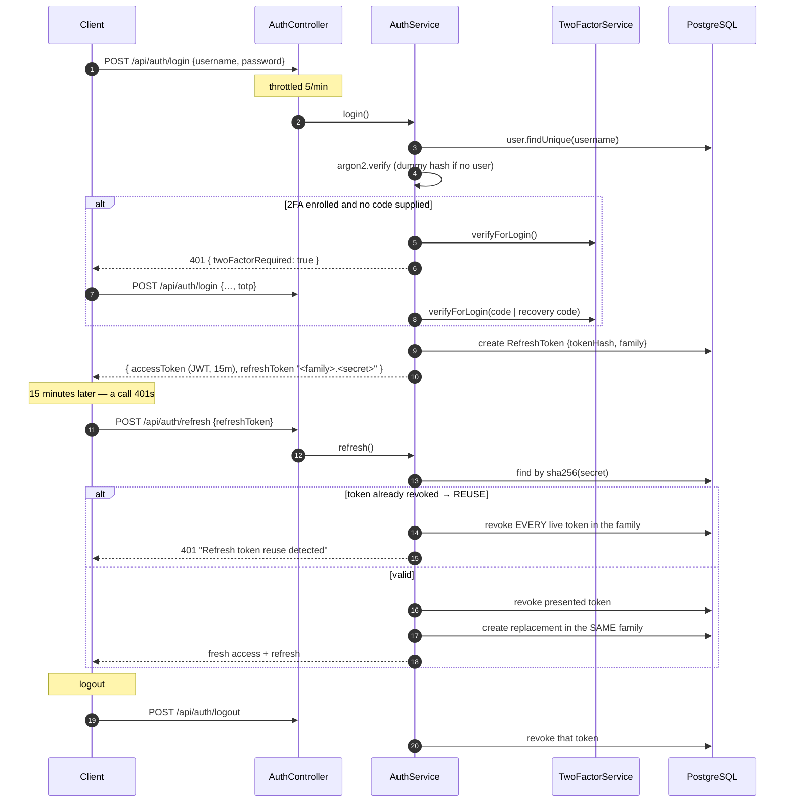

# Authentication

## Overview

UltraTorrent authenticates with **Argon2id** password hashing, **short-lived HS256 JWT
access tokens**, and **rotating, hashed refresh tokens with reuse detection**. Optional
**TOTP two-factor** is available per user. Secrets at rest (TOTP seeds, integration
credentials) are AES-256-GCM encrypted.

## Purpose

Understand exactly what the token lifecycle is, so you don't accidentally weaken it — and
so you know the one place where a permission change is *not* instant.

## Prerequisites

- [RBAC](/develop/rbac) — what the principal is used for once it exists.
- [Environment reference](/reference/environment) — the secret variables.

## Concepts

### Passwords

`argon2` (`argon2id` variant) with the library's default cost parameters. Login verifies
against a **dummy hash when the user does not exist**, so a missing username and a wrong
password take the same time and return the same error — no user enumeration:

```ts
// apps/backend/src/modules/auth/auth.service.ts
const hash =
  user?.passwordHash ??
  '$argon2id$v=19$m=65536,t=3,p=4$AAAAAAAAAAAAAAAAAAAAAA$AAAA…';
const valid = await argon2.verify(hash, password).catch(() => false);
if (!user || !valid || !user.isActive) {
  throw new UnauthorizedException('Invalid credentials');
}
```

### The access token

A signed JWT, **algorithm-pinned to HS256**, carrying the whole principal:

```ts
// apps/backend/src/modules/auth/auth.service.ts
const accessToken = await this.jwt.signAsync(
  {
    sub: authUser.id,
    username: authUser.username,
    roles: authUser.roles,             // role names
    permissions: authUser.permissions, // de-duplicated permission keys
    type: 'access',
  },
  {
    secret: this.config.get<string>('jwt.accessSecret'),
    expiresIn: this.config.get<string>('jwt.accessTtl'),   // JWT_ACCESS_TTL, default 15m
  },
);
```

`roles` and `permissions` are flattened at login from
`User → UserRole → Role → RolePermission → Permission`.

The strategy rebuilds the principal **from the claims alone** — there is no per-request
database read:

```ts
// apps/backend/src/modules/auth/strategies/jwt.strategy.ts
async validate(payload: JwtPayload): Promise<AuthenticatedUser> {
  if (payload.type !== 'access') {
    throw new UnauthorizedException('Invalid token type');
  }
  return {
    id: payload.sub,
    username: payload.username,
    roles: payload.roles ?? [],
    permissions: payload.permissions ?? [],
  };
}
```

That is fast, and it is the reason **a role change or a deactivation does not take effect
until the access token expires**. For an immediate cut-off you must also revoke the refresh
family — which is exactly what `changePassword` does.

### The refresh token — not a JWT

Refresh tokens are **48 random bytes**, base64url. The wire format is
`<family>.<secret>`, and **only a SHA-256 hash of the secret half is stored**:

```ts
// apps/backend/src/modules/auth/auth.service.ts
const refreshRaw = randomBytes(48).toString('base64url');
const tokenFamily = family ?? randomUUID();
await this.prisma.refreshToken.create({
  data: {
    userId: authUser.id,
    tokenHash: this.hashToken(refreshRaw),   // sha256 hex
    family: tokenFamily,
    userAgent: ctx.userAgent,
    ipAddress: ctx.ipAddress,
    expiresAt,
  },
});
const refreshToken = `${tokenFamily}.${refreshRaw}`;
```

SHA-256 rather than Argon2 is deliberate and correct here: the token is 384 bits of
entropy, so it is not brute-forceable — the hash exists to make a database leak useless, not
to slow a guesser down.

### Rotation and reuse detection

Every refresh **rotates**: the presented token is revoked and a new one is issued *inside
the same family*. If a token that has **already been rotated** is presented again, that is a
stolen-token signal — the entire family is burned:

```ts
// apps/backend/src/modules/auth/auth.service.ts
if (!stored || stored.family !== family) {
  throw new UnauthorizedException('Invalid refresh token');
}
if (stored.revokedAt) {
  // Reuse of a rotated token → compromise. Burn the whole family.
  await this.prisma.refreshToken.updateMany({
    where: { family, revokedAt: null },
    data: { revokedAt: new Date() },
  });
  throw new UnauthorizedException('Refresh token reuse detected');
}
```

The practical consequence: an attacker who steals a refresh token gets **one** use before
the legitimate client's next refresh trips the detector and logs everybody out of that
family. The user notices. That is the point.

Refresh also re-checks `isActive` — a deactivated account has all live tokens revoked and
the refresh rejected.

### Two-factor (TOTP)

- Library: **`otplib`**, `authenticator` with `options = { window: 1 }` (±1 × 30s skew).
- The TOTP seed is stored **encrypted** in `User.totpSecret` via `SecretCipher` —
  AES-256-GCM, output `base64(iv(12) | authTag(16) | ciphertext)`, key derived as
  `sha256(ENCRYPTION_KEY)`.
- **Recovery codes**: 10 per generation, 80 bits each, formatted `xxxxx-xxxxx-xxxxx-xxxxx`,
  stored **hashed** in `User.recoveryCodes`, and consumed on use.
- QR enrolment via `qrcode`.

The endpoints live on the **account** module, not the two-factor module (which has no
controller):

| Route | Purpose |
| --- | --- |
| `GET /api/account/2fa` | Status |
| `POST /api/account/2fa/setup` | Begin enrolment (returns the QR / secret) |
| `POST /api/account/2fa/enable` | Confirm with a code |
| `POST /api/account/2fa/disable` | Password-confirmed |
| `POST /api/account/2fa/recovery` | Regenerate codes (TOTP-confirmed) |

Login-time verification runs inside `AuthService.login`, which throws a dedicated
`TwoFactorRequiredException` carrying `twoFactorRequired: true` so the client knows to
prompt for the code rather than to show "wrong password".

:::caution `ENCRYPTION_KEY` is not rotatable in place
It derives the AES key that decrypts stored TOTP seeds. **Changing it invalidates every
enrolled 2FA secret** — users have to re-enrol.
:::

### API keys

`POST /api/api-keys` mints a key: a `ut_<12 hex>` prefix plus a 24-byte base64url secret.
The secret is **Argon2id-hashed** into `ApiKey.keyHash`, and the full key
(`<prefix>.<secret>`) is returned exactly once, at creation.

:::danger API keys cannot authenticate a request today
This is a verified gap, not an omission in these docs. There is **no API-key guard,
strategy, middleware or interceptor** anywhere in the backend: `keyHash` is written by
`apikeys.module.ts` and **never read**, `argon2.verify` is never called against it, and
there is no lookup by `prefix`. Consequently `ApiKey.lastUsedAt` and `ApiKey.expiresAt`
are never populated or enforced, and `ApiKey.scopes` is stored but never checked.

The three routes (`GET` / `POST` / `DELETE /api/api-keys`, guarded by
`@RequirePermissions(PERMISSIONS.APIKEYS_MANAGE)`) let you mint, list and revoke keys — but
a minted key will not authenticate anything. **Use a JWT.** The schema is ready for a
lookup-then-verify flow (`ApiKey.prefix` is `@unique`); wiring the guard is open work.
:::

### Rate limits

`ThrottlerGuard` is the one **global** guard (`ThrottlerModule.forRoot([{ ttl: 60_000, limit: 120 }])`).
Auth routes are stricter: **login 5/min**, **refresh 20/min**.

### Secret validation at boot

```ts
// apps/backend/src/bootstrap.ts
const secretProblems = findInsecureSecrets({
  accessSecret: config.get<string>('jwt.accessSecret') ?? '',
  encryptionKey: config.get<string>('encryptionKey') ?? '',
});
if (secretProblems.length) {
  const detail = secretProblems.map((p) => `  - ${p}`).join('\n');
  if (process.env.NODE_ENV === 'production') {
    throw new Error(
      `Refusing to start: insecure secret configuration:\n${detail}\n` +
        'Set strong, distinct JWT_ACCESS_SECRET and ENCRYPTION_KEY (>=32 random chars).',
    );
  }
  bootLogger.warn(`Insecure secrets (OK for dev, NOT production):\n${detail}`);
}
```

`findInsecureSecrets` flags: unset, a known default, shorter than 32 chars, or
`ENCRYPTION_KEY === JWT_ACCESS_SECRET`. In production it is a hard refusal to boot — a known
secret lets an attacker forge a `SUPER_ADMIN` token, which is a total auth bypass.

## Diagram — the token lifecycle



## The client side

The SPA stores tokens in localStorage under `ultratorrent.auth` and refreshes **once** on a
401, with a single-flight guard so a burst of parallel 401s produces one refresh:

```ts
// apps/frontend/src/lib/api.ts
let refreshInFlight: Promise<boolean> | null = null;

async function performRefresh(): Promise<boolean> {
  if (!tokens?.refreshToken) return false;
  if (refreshInFlight) return refreshInFlight;      // single-flight
  refreshInFlight = (async () => {
    try {
      const res = await fetch(`${API_URL}/auth/refresh`, { /* … */ });
      if (!res.ok) { setTokens(null); return false; }
      storeLoginResponse((await res.json()) as LoginResponse);
      return true;
    } catch { setTokens(null); return false; }
    finally { refreshInFlight = null; }
  })();
  return refreshInFlight;
}
```

…and inside `request()`:

```ts
if (res.status === 401 && auth && !_retry && tokens?.refreshToken) {
  const refreshed = await performRefresh();
  if (refreshed) return request<T>(path, { ...options, _retry: true });
}
```

The `_retry` flag is a recursion guard: a request is retried **exactly once**. The WebSocket
client re-authenticates off the same token store (`wsClient.reauthenticate()`).

## Troubleshooting

| Symptom | Cause | Fix |
| --- | --- | --- |
| `401 Refresh token reuse detected` and everyone is logged out | A rotated refresh token was replayed — either a genuine theft, or a client that cached and re-sent an old token. | Log in again. If it recurs, find the client that isn't storing the rotated token. |
| A user's new role doesn't work for ~15 minutes | Permissions are claims in the access token; there is no per-request DB read. | Expected. Force a re-login for immediacy. |
| `Refusing to start: insecure secret configuration` | Production boot with weak/default/identical secrets. | Generate both: `openssl rand -base64 48`, and make them **different**. |
| Everyone's 2FA broke after a redeploy | `ENCRYPTION_KEY` changed. | Restore the old key, or have users re-enrol. |
| An API key returns 401 on every call | API-key authentication is not implemented (see above). | Use a JWT. |
| Login says "Invalid credentials" for a user you just seeded | The seed does not overwrite an existing user's password (`update: {}`). | Use the original password, or delete the row and re-seed. |

## Tips

- **Never log a token.** Not the access token, not the refresh token, not the TOTP seed.
- **`JWT_REFRESH_SECRET` is dead config.** It is declared in `configuration.ts` and
  `.env.example` but never consumed — refresh tokens are random bytes, not signed JWTs.
  Setting it does nothing.
- **`expiresIn` in the login response is hardcoded to `15 * 60`** while the token itself is
  signed with the configurable `jwt.accessTtl`. If you change `JWT_ACCESS_TTL`, the
  reported `expiresIn` will be wrong even though the token's real lifetime is right. Don't
  build a client that trusts that field over the JWT's own `exp`.
- **Revocation is family-wide, by design.** That's what makes theft detectable.

## FAQ

**Why is the whole permission set inside the JWT?**
Speed — it removes a DB round-trip from every request. The cost is the up-to-15-minute
staleness window described above. It is an explicit trade.

**Can I shorten the access TTL?**
`JWT_ACCESS_TTL` (default `15m`). Shorter means a tighter revocation window and more refresh
traffic.

**Are refresh tokens bound to a device?**
They record `userAgent` and `ipAddress` at issue, but the check is family + hash, not a
device binding.

**Where's the test coverage?**
:::caution Not yet verified by tests
The only spec under `modules/auth/` is `guards/permissions.guard.spec.ts`. **Refresh-token
rotation and reuse detection have no test coverage**, and there is no `auth.service.spec.ts`
or `two-factor.service.spec.ts`. If you touch this code, adding those tests is the highest
-value contribution you can make.
:::

## Checklist

- [ ] I did not add a per-request DB lookup to `JwtStrategy` without measuring it.
- [ ] I did not log a token, a seed, or a secret.
- [ ] Any new secret at rest goes through `SecretCipher` (AES-256-GCM), not plaintext.
- [ ] Any new auth-adjacent route is throttled.
- [ ] Login/refresh behaviour changes come with tests (there are none today).

## See also

- [RBAC](/develop/rbac) — what the principal authorizes
- [Environment reference](/reference/environment) — `JWT_ACCESS_SECRET`, `ENCRYPTION_KEY`, TTLs
- [API reference](/reference/api) — the auth endpoints
- [Modules → API keys](/modules/api-keys) · [Users](/modules/users)
- [Operate → Security](/operate/security)
