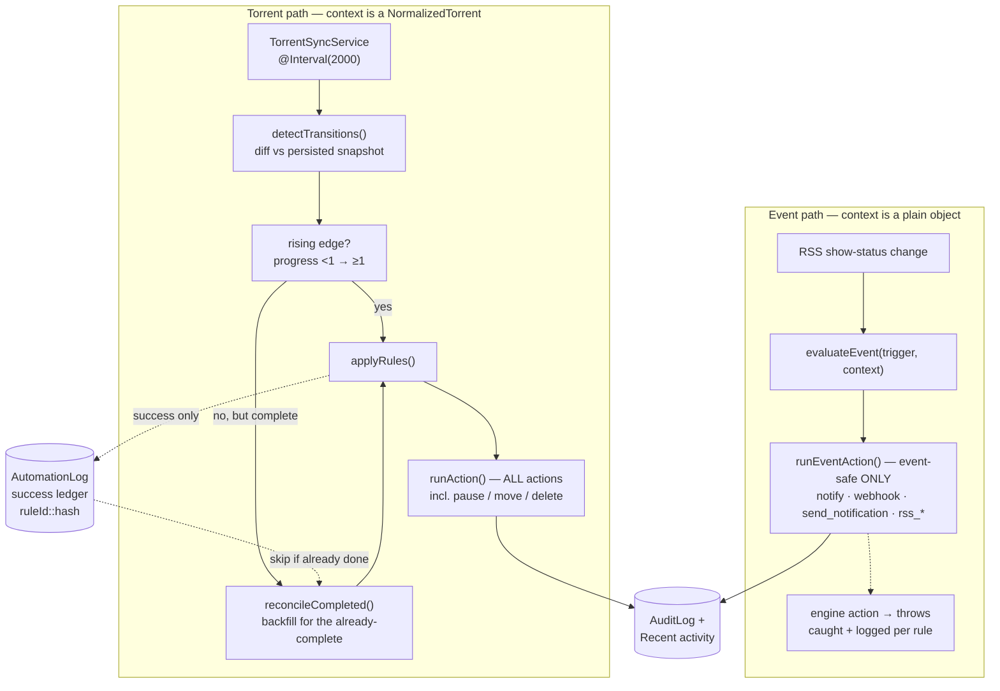
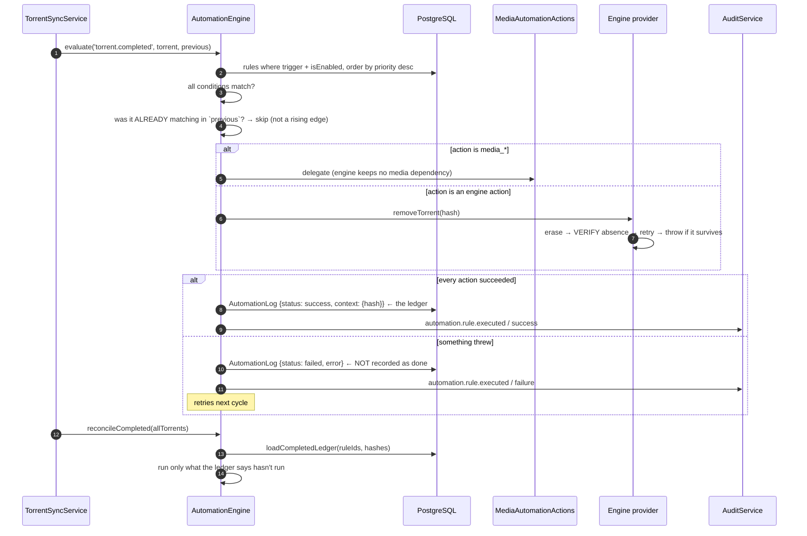

# Automation

## Overview

The automation engine turns **domain events** into **user-defined rules**: a *trigger*
fires, the rule's *conditions* are checked, and its *actions* run. Rules are stored
(`AutomationRule`), evaluated in `priority` order, and every run is logged
(`AutomationLog`) and mirrored into the audit trail.

The whole catalogue is exposed to the UI at `GET /api/automation/catalog`.

## Purpose

Let an operator express "when X happens, do Y" without writing code — and let a developer
add a new X or Y without touching the engine's core.

## When to use

- **A new trigger** when your module produces an event operators would want to react to.
- **A new action** when your module can *do* something operators would want to automate.

## Prerequisites

- [Background jobs](/develop/background-jobs) — the rising-edge/backfill and idempotency
  material below builds directly on it.
- [Creating modules](/develop/creating-modules).

## Concepts

### The catalogue

Triggers and actions are declared as plain data in
`apps/backend/src/modules/automation/automation.module.ts`. This is the single place a new
one is registered.

```ts
/**
 * Catalog of automation triggers the engine understands. Triggers are matched by
 * string id when a rule is evaluated; this catalog is the metadata the UI needs
 * to present them (and the single place new triggers are registered).
 */
export const AUTOMATION_TRIGGERS = [
  { id: 'torrent.completed', label: 'When a download completes', category: 'torrent' },
  { id: 'ratio.reached', label: 'When the share ratio is reached', category: 'torrent' },
  { id: 'media.detected', label: 'When media is detected in a download', category: 'media' },
  { id: 'media.matched', label: 'When a media item is matched', category: 'media' },
  { id: 'media.unmatched', label: 'When a media item cannot be matched', category: 'media' },
  { id: 'media.missing_artwork', label: 'When a media item is missing artwork', category: 'media' },
  { id: 'media.missing_subtitles', label: 'When a media item is missing subtitles', category: 'media' },
  { id: 'media.rename_completed', label: 'When a media rename/move completes', category: 'media' },
  { id: 'media.server_refresh_failed', label: 'When a media-server refresh fails', category: 'media' },
  { id: 'rss.rule.created_for_inactive_show', label: 'When an RSS rule is created for an inactive show', category: 'rss' },
  { id: 'rss.show_status.changed', label: "When a monitored show's airing status changes", category: 'rss' },
  { id: 'rss.show.became_active', label: 'When a monitored show becomes active again', category: 'rss' },
  { id: 'rss.show.ended', label: 'When a monitored show ends', category: 'rss' },
  { id: 'rss.show.canceled', label: 'When a monitored show is canceled', category: 'rss' },
] as const;

/** Catalog of actions the engine can execute (metadata for the UI). */
export const AUTOMATION_ACTIONS = [
  { id: 'notify', label: 'Send notification', category: 'torrent' },
  { id: 'send_notification', label: 'Send via Notification Center', category: 'notification' },
  { id: 'move', label: 'Move data', category: 'torrent' },
  { id: 'pause', label: 'Pause torrent', category: 'torrent' },
  { id: 'stop', label: 'Stop torrent', category: 'torrent' },
  { id: 'delete', label: 'Remove torrent', category: 'torrent' },
  { id: 'delete_with_data', label: 'Remove torrent + data', category: 'torrent' },
  { id: 'webhook', label: 'Call webhook', category: 'torrent' },
  { id: 'rename_for_media', label: 'Rename for media server', category: 'media' },
  { id: 'media_scan_library', label: 'Scan a media library', category: 'media' },
  { id: 'media_match', label: 'Identify a media item', category: 'media' },
  { id: 'media_fetch_metadata', label: 'Fetch media metadata', category: 'media' },
  { id: 'media_fetch_artwork', label: 'Fetch media artwork', category: 'media' },
  { id: 'media_generate_nfo', label: 'Generate NFO sidecars', category: 'media' },
  { id: 'media_rename', label: 'Rename media into the library', category: 'media' },
  { id: 'media_move', label: 'Move media into the library', category: 'media' },
  { id: 'media_notify', label: 'Send media notification', category: 'media' },
  { id: 'media_server_refresh', label: 'Refresh a media server', category: 'media' },
  { id: 'refresh_rss_show_status', label: 'Refresh RSS show status', category: 'rss' },
  { id: 'disable_rss_rule', label: 'Disable RSS rule', category: 'rss' },
  { id: 'convert_rule_to_backfill', label: 'Convert rule to backfill only', category: 'rss' },
  { id: 'notify_admin', label: 'Notify admin', category: 'rss' },
] as const;
```

### A rule

```ts
type Condition = { field: keyof NormalizedTorrent; op: string; value: unknown };
type Action = { type: string; params?: Record<string, unknown> };
```

Rules are loaded per trigger, enabled-only, highest priority first:

```ts
private loadRules(trigger: string) {
  return this.prisma.automationRule.findMany({
    where: { trigger, isEnabled: true },
    orderBy: { priority: 'desc' },
  });
}
```

**All conditions must match** (AND). An empty condition list matches everything.

### Two evaluation paths

This is the key structural fact about the engine, and the thing most likely to trip you up.

| Path | Context | Which actions may run |
| --- | --- | --- |
| **`evaluate` / `evaluateMany` / `applyRules`** | A `NormalizedTorrent` | Everything — including engine actions (pause/move/delete) |
| **`evaluateEvent(trigger, context)`** | A plain `Record<string, unknown>` event object | **Event-safe only**: notify / webhook / `send_notification` + delegated `rss_*` actions. A torrent engine action needs a real torrent and **errors out per rule.** |

```ts
/** Actions runnable without a torrent: notifications, webhooks, RSS delegates. */
private async runEventAction(action: Action, context: Record<string, unknown>): Promise<void> {
  const params = action.params ?? {};

  if (RSS_ACTION_TYPES.has(action.type)) {
    await this.rssActions.execute(action.type, params, context);
    return;
  }

  switch (action.type) {
    case 'notify':
    case 'notify_admin':
      await this.notifications.dispatch({ /* … */ });
      break;
    case 'send_notification':
      await this.sendViaCenter(params, context);
      break;
    case 'webhook':
      await fetch(String(params.url), {
        method: 'POST',
        headers: { 'Content-Type': 'application/json' },
        body: JSON.stringify({ event: context, params }),
      });
      break;
    default:
      throw new Error(`Action "${action.type}" is not valid for an event trigger`);
  }
}
```

### The rising-edge rule

For poll-driven triggers, a rule fires **only on the rising edge** — the tick where its
conditions first become satisfied:

```ts
/**
 * Run each rule whose conditions match `context`. When `previous` is supplied
 * (periodic triggers), a rule fires only on the RISING EDGE — i.e. when its
 * conditions were NOT already satisfied by the previous torrent state — so a
 * poll-driven trigger like `ratio.reached` fires once as the threshold is
 * crossed, not on every subsequent poll.
 */
private async applyRules(rules, context: NormalizedTorrent, previous?: NormalizedTorrent) {
  for (const rule of rules) {
    const conditions = (rule.conditions as unknown as Condition[]) ?? [];
    if (!conditions.every((c) => this.checkCondition(c, context))) continue;
    if (previous && conditions.every((c) => this.checkCondition(c, previous))) {
      continue; // already satisfied last cycle — not a rising edge
    }
    // …run the actions…
  }
}
```

Triggers are detected by `TorrentSyncService.detectTransitions()`, which diffs each 2-second
poll against the **persisted** snapshot. Torrents with no prior snapshot are skipped that
cycle (a baseline is written first), so nothing fires on the very first sighting.

### The backfill, and why it exists

An edge only fires for something that **crosses** it. Snapshots live in Postgres, so a
torrent that was **already at 100% when first snapshotted** is permanently past the edge.
So is one that finished while the app wasn't polling, and one that completed before the rule
was created. Their `torrent.completed` rules never ran — and a "delete on complete" rule
silently did nothing while the torrent seeded forever.

`AutomationEngine.reconcileCompleted()` is the fix — a backfill pass called each sync cycle
for completed torrents that did **not** rise on this tick:

```ts
/**
 * Backfill pass for the `torrent.completed` trigger.
 *
 * The edge-fired path (TorrentSyncService.detectTransitions) only fires the
 * trigger on the exact poll where a torrent's persisted progress crosses to
 * 100%. Torrents that were ALREADY complete when first snapshotted, that
 * completed while the app wasn't polling, or that finished before the rule
 * existed never cross that edge — so their completion rules would never run
 * and the torrent sits there seeding forever.
 *
 * This re-evaluates already-complete torrents against every enabled
 * `torrent.completed` rule. AutomationLog is used as an idempotency ledger —
 * shared with the edge-fired path, which logs the same `{ hash }` context on
 * success — so each rule runs at most once per torrent no matter how often
 * the poll loop calls this. A failed run is NOT recorded as done, so a rule
 * blocked by a transient error (engine offline) retries on the next cycle.
 */
async reconcileCompleted(torrents: NormalizedTorrent[]): Promise<void> {
  const completed = torrents.filter((t) => t.progress >= 1);
  if (completed.length === 0) return;

  const rules = await this.loadRules('torrent.completed');
  if (rules.length === 0) return;   // cheap path: no rules → one query per cycle
  // …load the ledger, run what hasn't run…
}
```

A `risingEdges` set excludes torrents that fired on this tick, so the two paths cannot
double-fire.

### The idempotency ledger

Successful `AutomationLog` rows, keyed `ruleId::hash`, are the ledger. It is **shared**
between the edge path and the backfill, so a rule runs **at most once per torrent** no matter
how often the 2-second poll calls `reconcileCompleted`.

A **failed** run is deliberately not recorded as done — so a rule blocked by a transient
error retries next cycle. And the ledger query is bounded by the currently-completed set, so
the `OR` list stays small.

:::warning A phantom success poisons the ledger
rTorrent 0.9.8 can accept a `d.erase`, return no error, and **still leave the download
loaded**. That phantom success was recorded in the ledger, marking the rule done — so
`reconcileCompleted` never retried, and the torrent seeded forever despite a working delete
rule. `RTorrentProvider.removeTorrent` now erases, **verifies absence**, retries, and
**throws** if the torrent survives — precisely so the ledger records a real failure. If you
write a provider action, make sure "success" means it actually happened.
:::

### Delegation — keeping the engine dependency-free

The engine must not depend on every module it can act on. Media and RSS actions are
therefore **delegated**:

- `media_*` actions → `MediaAutomationActions` (in the media module), so the engine keeps no
  engine-provider dependency.
- `rss_*` actions → `RssAutomationActions`.

RSS fires triggers back into the engine via **`ModuleRef` (lazy)**, so the DI graph stays
acyclic, while `AutomationModule` imports `RssModule` behind a `forwardRef` for the
ES-module load-order cycle. Copy this pattern rather than inventing a new one.

### Auditing

Every run is mirrored into the audit trail so it shows up in the trail and in the dashboard's
Recent activity:

```ts
private async recordAudit(rule, status, message, extra, objectType, objectId) {
  await this.audit.record({
    action: 'automation.rule.executed',
    result: status === 'failed' ? 'failure' : 'success',
    objectType,     // 'torrent' (objectId = hash) or 'automation_rule'
    objectId,
    metadata: {
      rule: rule.name,
      actions: this.actionTypes(rule.actions),
      ...extra,
      ...(message ? { error: message } : {}),
    },
  });
}
```

## Diagram — the two paths





## Step-by-step: add a new action

### 1. Register it in the catalogue

```ts
// apps/backend/src/modules/automation/automation.module.ts
export const AUTOMATION_ACTIONS = [
  // …
  { id: 'widget_archive', label: 'Archive the widget', category: 'widget' },
] as const;
```

The UI reads this from `GET /api/automation/catalog` — no frontend change is needed to make
the action *selectable*.

### 2. Decide where it executes

**Don't add a dependency to the engine.** If the action belongs to a module, follow the
media/RSS pattern: put the implementation in a `<Module>AutomationActions` class inside your
module, export it, and have the engine delegate to it by action-id set:

```ts
/** Widget action ids delegated to WidgetAutomationActions. */
const WIDGET_ACTION_TYPES = new Set(['widget_archive']);

// in runAction / runEventAction:
if (WIDGET_ACTION_TYPES.has(action.type)) {
  await this.widgetActions.execute(action.type, params, context);
  return;
}
```

### 3. Decide which path it is valid on

- Needs a torrent (pause, move, delete)? It only belongs on the **torrent path**. It will
  correctly throw on the event path.
- Works from a plain context object? Wire it into **`runEventAction`** too, and add it to the
  delegated set so it is permitted there.

### 4. Make it idempotent

Your action may be re-run: by the backfill, by a retry after a transient failure, or by an
operator. It must be safe.

### 5. Make "success" mean it happened

If your action calls out to an external system, **verify the outcome** before returning. A
phantom success is recorded in the ledger and never retried.

## Step-by-step: add a new trigger

1. **Add it to `AUTOMATION_TRIGGERS`** with an `id`, `label` and `category`.
2. **Fire it.** From a torrent poll → `evaluate(trigger, torrent, previous)`. From a domain
   event → `evaluateEvent(trigger, context)`. If your module would create a DI cycle by
   injecting the engine, call it through a lazy `ModuleRef` as RSS does.
3. **Ask the edge question.** If it is poll-driven, what happens to the entities that were
   *already* past the edge when the rule was created? If the answer is "nothing ever
   happens", you need a backfill pass with a shared idempotency ledger.
4. **Declare it** in the module manifest.

## Troubleshooting

| Symptom | Cause | Fix |
| --- | --- | --- |
| A "delete on complete" rule never fires | qBittorrent maps completed/seeding torrents to `SEEDING` and **never emits `COMPLETED`** — so a rule with a `state == 'completed'` condition never matches. | Give the completion rule **empty conditions**. |
| A completion rule doesn't fire for old torrents | They never crossed the rising edge. | That's what `reconcileCompleted` is for — confirm it's running. |
| A rule fires every 2 seconds | The rising-edge check isn't applying (no `previous` supplied), or the ledger isn't being consulted. | Pass `previous`; use the ledger. |
| An action errors "not valid for an event trigger" | It's an engine action on the event path. | Correct behaviour. Use an event-safe action. |
| A rule ran once, failed, and never retried | Something recorded a **phantom success** into the ledger. | The action must throw when the operation didn't actually happen. |
| A rule ran twice | The edge path and the backfill both fired. The `risingEdges` set exists to prevent this. | Check the ledger key (`ruleId::hash`). |
| Adding a trigger created a DI cycle | Your module injected `AutomationEngine` and the engine imports your module. | `forwardRef` for load order + lazy `ModuleRef.get()` for the call, as `RssModule` does. |

## Tips

- **Conditions are ANDed and there is no OR.** Two behaviours means two rules.
- **The cheap path matters.** `reconcileCompleted` returns immediately when no rules use the
  trigger — a "no rules" install costs one query per cycle, not one per torrent. Preserve
  that when you add a trigger to the poll loop.
- **`priority` is `desc`.** Higher runs first.
- **A rule's actions run in order, and a throw aborts the rest of that rule.** The run is
  logged failed, a notification fires, and the next rule still runs.

## FAQ

**Where do I see what a rule did?**
`AutomationLog` (the rule's own history) plus the audit trail — every run is mirrored as
`automation.rule.executed` and appears in the dashboard's Recent activity.

**Can automation rules be triggered by the Notification Center's events?**
They are different systems. `NOTIFICATION_EVENTS` is the internal bus the Notification
Center subscribes to for **rule-driven messaging**. `AUTOMATION_TRIGGERS` is the automation
engine's own catalogue. The `send_notification` action bridges from automation into the
Notification Center.

**Can I run an arbitrary script?**
No. There is a `webhook` action — POST to a URL you control.

**Do media actions get the torrent context?**
`MediaAutomationActions` receives the context it needs from the engine. The engine itself
keeps **no** engine-provider dependency in the media path — that separation is deliberate.

## Checklist

- [ ] Trigger/action added to the catalogue in `automation.module.ts`.
- [ ] Module-specific execution is **delegated** to a `<Module>AutomationActions`, not
      inlined into the engine.
- [ ] If it's event-path-valid, it's in `runEventAction` and the delegated action set.
- [ ] The action is **idempotent**.
- [ ] "Success" means the operation actually happened (verified, not assumed).
- [ ] A poll-driven trigger has a backfill story for entities already past the edge.
- [ ] The run is logged (`AutomationLog`) and audited.
- [ ] No new DI cycle (lazy `ModuleRef` / `forwardRef` where needed).
- [ ] Declared on the module manifest.

## See also

- [Background jobs](/develop/background-jobs) — the poll loop, idempotency, reconciliation
- [Providers](/develop/providers) — why "success" must be verified
- [Modules → Automation](/modules/automation) · [RSS](/modules/rss) · [Notification Center](/modules/notification-center)
- [Creating modules](/develop/creating-modules)
