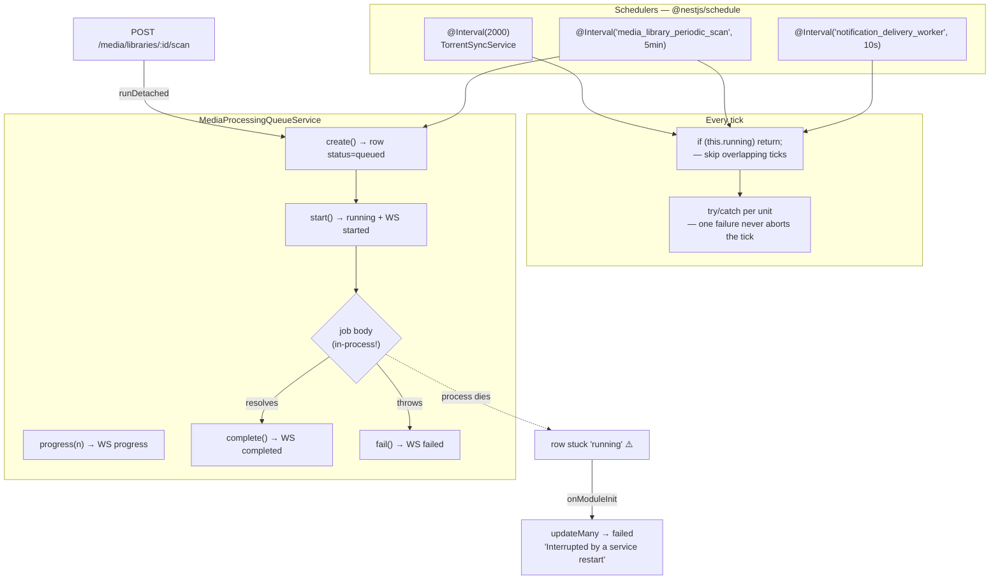
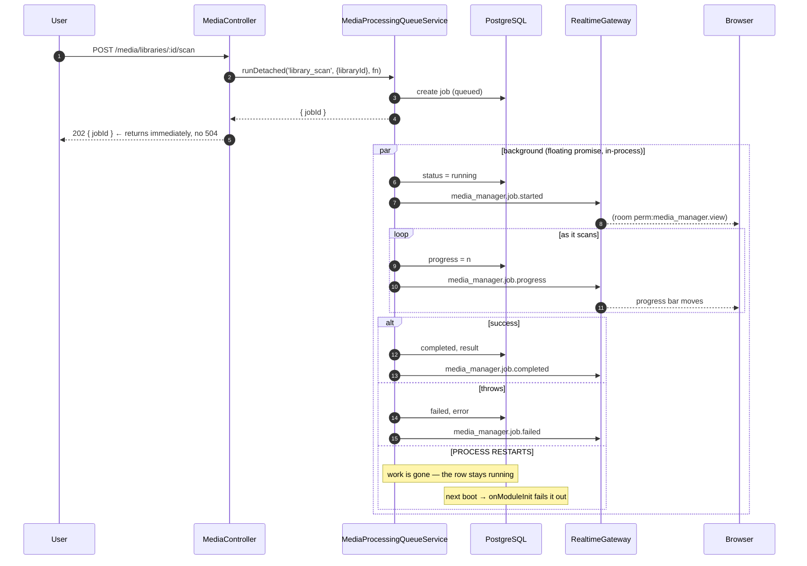

# Background jobs

## Overview

Long-running work must **never block an HTTP request**. UltraTorrent runs background work
two ways:

1. **Schedulers** — `@nestjs/schedule` `@Interval` methods that tick on a cadence.
2. **A tracked queue** — `MediaProcessingQueueService`, which persists each unit of work as
   a `MediaProcessingJob` row and streams its lifecycle over WebSocket.

There is **no external broker**. Both mechanisms run **in the API process**.

:::danger Job bodies are in-process, not durable work items
`MediaProcessingQueueService` persists a **row** describing the job, but the job **body** is
just an async function running in the Node process. It is *not* a durable work item that a
worker picks back up. **A restart kills the work and orphans the row.** That is why boot
reconciles them — see below. If you internalise one thing from this page, make it this.
:::

## Purpose

Keep the API responsive, isolate failures, and make long operations observable.

## When to use

| Work | Mechanism |
| --- | --- |
| Recurring polling / sweeps | `@Interval('<name>', ms)` |
| A long operation the user started (scan a 20k-file library) | `MediaProcessingQueueService.runDetached()` |
| A long operation whose result the caller needs | `MediaProcessingQueueService.run()` |
| A reaction to a domain event | An automation action, or an event-bus subscriber |

## Prerequisites

- [WebSockets](/develop/websockets) — job lifecycle is emitted as WS events.
- [Creating modules](/develop/creating-modules) — jobs are declared on the manifest.

## Concepts

### Schedulers

`ScheduleModule.forRoot()` is imported in `app.module.ts`. A scheduler is a method with
`@Interval('<job-name>', <ms>)`. The name matters: it is what you declare in your module
manifest's `schedulerJobs`, and it is how the job is identified in the admin UI.

The jobs that ship today:

| Job | Cadence | Service |
| --- | --- | --- |
| *(unnamed)* torrent sync | 2 s | `TorrentSyncService` |
| *(unnamed)* RSS poll | 60 s | `RssModule` |
| `notification_delivery_worker` | 10 s | `DeliveryService` |
| `media_server_session_poll` | 15 s | `MediaServerSessionService` |
| `system_health_monitor` | 60 s | `SystemModule` |
| `torrent_parking_sweep` | 5 min | `TorrentParkingService` |
| `media_acquisition_rss_sweep` | 5 min | `MediaAcquisitionModule` |
| `media_library_periodic_scan` | 5 min tick | `MediaLibraryScanSchedulerService` |
| `notification_provider_health` | 5 min | `ProviderHealthService` |
| `media_server_newsletter_dispatch` | 15 min | `MediaServerNewsletterService` |
| `media_acquisition_watchlist_sweep` | 15 min | `MediaAcquisitionModule` |
| `media_acquisition_quality_upgrade_sweep` | 30 min | `MediaAcquisitionModule` |
| `media_server_metadata_sync` | 1 h | `MediaServerSyncService` |
| `imdb_dataset_auto_update` | 1 h tick | `ImdbDatasetSchedulerService` |
| `rss_show_status_refresh` | 1 h | `RssShowStatusRefreshService` |
| `system_update_check` | configured | `SystemUpdateService` |

**Serialize your ticks.** Nest will happily start a second tick while the first is still
running. The universal pattern:

```ts
// apps/backend/src/modules/torrents/torrent-sync.service.ts
@Interval(2000)
async sync(): Promise<void> {
  if (this.syncing) return; // skip overlapping ticks
  this.syncing = true;
  try {
    for (const provider of this.registry.list()) {
      await this.syncEngine(provider);
    }
  } finally {
    this.syncing = false;
  }
}
```

**Isolate each unit.** A single failing engine, library or item must not abort the whole
tick:

```ts
private async syncEngine(provider: TorrentEngineProvider): Promise<void> {
  try {
    const [torrents, stats] = await Promise.all([
      provider.listTorrents(),
      provider.getGlobalStats(),
    ]);
    // …broadcast, detect transitions, persist snapshots…
  } catch (err) {
    this.logger.warn(`Engine ${provider.engineId} sync failed: ${(err as Error).message}`);
    this.realtime.broadcast(WS_EVENTS.ENGINE_STATUS, {
      engineId: provider.engineId, online: false, error: (err as Error).message, at,
    });
  }
}
```

This is not theoretical. A real bug shipped because a Prisma `P2025` ("Record to update not
found") from a row deleted mid-sweep escaped the per-episode error handler and **rejected
the entire sweep**, losing the other ~48 episodes in the batch. The fix was to use
`updateMany` (a no-op for a missing row) instead of `update` (which throws).

### The processing queue

```ts
// apps/backend/src/modules/media/media-processing-queue.service.ts
export type MediaJobType =
  | 'library_scan'
  | 'media_identification'
  | 'metadata_fetch'
  | 'artwork_fetch'
  | 'subtitle_scan'
  | 'rename_execute'
  | 'library_organize'
  | 'nfo_generate'
  | 'media_server_refresh';
```

Each job is a `MediaProcessingJob` row (`type`, `status`, `progress`, `libraryId`, `itemId`,
`payload`, `result`, `error`) whose lifecycle is emitted over the
`media_manager.view`-scoped WS channel: `started` → `progress` → `completed` | `failed`.

Two entry points:

**`run()`** — await the result. The failure is recorded and broadcast, then **rethrown** so
the caller can surface it.

**`runDetached()`** — return `{ jobId }` immediately and run in the background:

```ts
/**
 * Start a job WITHOUT waiting for it to finish: create + start the row, run
 * `fn` in the background, and return `{ jobId }` immediately. Callers return
 * that to the client at once so a long job (e.g. scanning a 20k-file library)
 * can't time the HTTP request out at the gateway (504); progress + completion
 * arrive over the `media_manager.job.*` WS events. Failures are recorded and
 * broadcast, never thrown — there is no caller left to catch them.
 */
async runDetached(
  type: MediaJobType,
  opts: CreateJobOptions,
  fn: (report: JobReporter) => Promise<unknown>,
): Promise<{ jobId: string }> {
  const created = await this.create(type, opts);
  void (async () => {
    await this.start(created.id);
    const report: JobReporter = (progress, message) =>
      this.progress(created.id, progress, message);
    try {
      const result = await fn(report);
      await this.complete(created.id, result);
    } catch (err) {
      await this.fail(created.id, (err as Error).message);
    }
  })();
  return { jobId: created.id };
}
```

The `void (async () => { … })()` is the whole story: **the work is a floating promise in this
process.** Nothing outside the process knows it exists.

### Why boot reconciles orphaned jobs

Because the body is in-process, a deploy or a crash leaves the row `running` **forever**. On
a live host this produced **30 orphaned rows, some 5+ hours old**, including `metadata_fetch`
and `subtitle_scan` frozen at 0%. The job list became meaningless.

The fix is a boot-time reconciliation. Any `queued`/`running` row at startup belongs to a
process that is already gone:

```ts
/**
 * Reconcile orphaned jobs at boot. Job bodies run **in-process** (see
 * {@link runDetached}) — they are not durable work items a worker picks back up.
 * So any row still `queued`/`running` belongs to a process that is already gone
 * (a deploy, restart or crash): its work died with that process and will never
 * resume, yet the row would otherwise sit "running" forever. Left unhandled they
 * pile up and make the job list meaningless — a live host had 30 of them, some
 * 5+ hours old. Fail them out so the state reflects reality.
 */
async onModuleInit(): Promise<void> {
  try {
    const { count } = await this.prisma.mediaProcessingJob.updateMany({
      where: { status: { in: ['queued', 'running'] } },
      data: {
        status: 'failed',
        finishedAt: new Date(),
        error: 'Interrupted by a service restart',
      },
    });
    if (count > 0) {
      this.logger.warn(`Reconciled ${count} orphaned job(s) left queued/running by a previous process`);
    }
  } catch (err) {
    // Never block boot on this best-effort cleanup.
    this.logger.warn(`Could not reconcile orphaned jobs: ${(err as Error).message}`);
  }
}
```

Note the second half: the reconciliation is wrapped so a failure **never blocks boot**. A
cleanup that can take the service down is worse than the mess it cleans.

:::note This is failing-out, not resuming
Reconciliation marks the work **failed**, it does not restart it. The user re-runs the scan.
A genuinely durable queue (BullMQ on the Redis that is already in the stack) is the obvious
upgrade path, and the design deliberately leaves room for it "without changing callers".
:::

### Idempotency

Anything that can run twice, will. Two patterns are used:

**1. A success ledger.** The automation engine's `torrent.completed` backfill re-evaluates
already-complete torrents on **every** 2-second sync cycle. Successful `AutomationLog` rows
are the ledger that stops a rule running twice:

```ts
// apps/backend/src/modules/automation/automation.module.ts
private async loadCompletedLedger(ruleIds: string[], hashes: string[]): Promise<Set<string>> {
  const logs = await this.prisma.automationLog.findMany({
    where: {
      status: 'success',
      ruleId: { in: ruleIds },
      OR: hashes.map((h) => ({ context: { path: ['hash'], equals: h } })),
    },
    select: { ruleId: true, context: true },
  });
  const done = new Set<string>();
  for (const l of logs) {
    const hash = (l.context as { hash?: string } | null)?.hash;
    if (hash) done.add(`${l.ruleId}::${hash}`);
  }
  return done;
}
```

A **failed** run is deliberately *not* recorded as done, so a rule blocked by a transient
error (engine offline) retries next cycle. And the ledger is bounded by the current
completed set, so the query stays small.

That subtlety has teeth: an engine that returned a phantom "success" for a delete that
didn't happen **poisoned this ledger**, marking the rule done so it never retried. The
provider now verifies removal and throws if the torrent survives — precisely so the ledger
records a real failure.

**2. Gap-filling, not re-doing.** The periodic library scan only fills what's missing —
`identify → metadata → poster artwork` for items that lack them. Existing metadata and art
are left alone, so a steady-state scan does almost no work and never re-hammers the
providers.

### Edge-firing vs. backfill

A poll-driven trigger fires on the **rising edge**: the tick where the condition first
becomes true. That is correct for live transitions and **completely wrong for anything that
was already true** when you first looked. `torrent.completed` fires only on the poll where
persisted progress crosses `<1 → ≥1` — so a torrent that was already complete on first
sighting, or that finished while the app was down, or that finished before the rule existed,
**never crosses that edge**. Its completion rules never ran, and it seeded forever.

The answer is a **backfill pass** alongside the edge, sharing the same idempotency ledger.
If you add a poll-driven trigger, ask yourself immediately: *what about the ones that were
already past the edge?*

## Diagram — the two mechanisms





## Step-by-step: add a scheduler

```ts
@Injectable()
export class WidgetSweepService {
  private readonly logger = new Logger(WidgetSweepService.name);
  private running = false;

  constructor(private readonly prisma: PrismaService) {}

  @Interval('widget_sweep', 10 * 60_000)
  async sweep(): Promise<void> {
    if (this.running) return;          // 1. never overlap
    this.running = true;
    try {
      const due = await this.prisma.widget.findMany({ where: { /* only what's DUE */ } });
      for (const w of due) {
        try {
          await this.process(w);       // 2. isolate each unit
        } catch (err) {
          this.logger.warn(`Widget ${w.id} failed: ${(err as Error).message}`);
        }
      }
    } finally {
      this.running = false;            // 3. always release
    }
  }
}
```

Then declare it: `schedulerJobs: ['widget_sweep']` on the module manifest.

Four rules, learned the hard way:

1. **Guard against overlap.** A tick that takes longer than its interval must not stack.
2. **Select only what's due.** A cheap tick that finds nothing to do should cost one query.
   `MediaLibraryScanSchedulerService` ticks every 5 minutes but only picks libraries whose
   `lastScanAt` is older than their own `scanIntervalMinutes`.
3. **Isolate every unit.** One bad row must not kill the batch.
4. **Nest's `@Interval` fires *after* the first interval**, not at boot. If you need work at
   startup, do it in `onModuleInit`.

## Step-by-step: add a queued job

1. Add the type to `MediaJobType`.
2. Call `runDetached()` (for a user-initiated long op) or `run()` (when the caller needs the
   result).
3. Report progress: `await report(40, 'Fetching artwork…')`.
4. Make the body **idempotent** — it may be re-run after an interrupted attempt is failed
   out at boot.
5. Declare the WS events on the manifest if the type is new to the UI.

## Troubleshooting

| Symptom | Cause | Fix |
| --- | --- | --- |
| Jobs stuck at `running` with 0% forever | The process restarted mid-job. | Expected. `onModuleInit` fails them out at next boot. Re-run the operation. |
| A sweep processes 2 items then silently stops | An exception escaped the per-item handler and rejected the whole tick. Prisma `update` throws `P2025` on a row deleted concurrently. | Wrap each unit in try/catch; use `updateMany` where a missing row should be a no-op. |
| A rule fires repeatedly for the same torrent | The idempotency ledger isn't keyed correctly, or the run isn't recording success. | Check `AutomationLog` — a `failed` run is deliberately not treated as done. |
| A completion rule never fires for old torrents | They were already past the rising edge. | You need a backfill pass, not a better edge. |
| The scan HTTP request 504s | You used `run()` where you needed `runDetached()`. | Return `{ jobId }` immediately; stream progress over WS. |
| Ticks pile up and hammer the DB | No overlap guard. | `if (this.running) return;` |

## Tips

- **Everything here is best-effort.** `MediaProcessingService`'s post-download handler
  never throws — it protects the sync loop it is called from. Copy that instinct.
- **A cleanup must never take the service down.** Reconciliation is wrapped in a try/catch
  that only warns.
- **Redis is already in the stack.** If you find yourself needing genuine durability
  (retries across restarts, multi-node), that is the upgrade path — not another
  floating promise.
- **Name your interval.** `@Interval(2000)` works, but an unnamed job can't be declared on a
  manifest or surfaced in the admin UI. (`TorrentSyncService` and the RSS poll are both
  unnamed today — don't copy that.)

## FAQ

**Why no BullMQ/broker if Redis is right there?**
The current workloads are bounded and best-effort, and `@nestjs/schedule` + async is
sufficient for them. `docs/ARCHITECTURE.md` states the design "leaves room to move to a
distributed queue later without changing callers."

**Can two API instances run safely?**
:::caution Not yet verified
Every scheduler ticks in-process with an in-memory overlap guard (`this.running`), which is
**per-process**. Nothing in the code takes a distributed lock. Running multiple backend
replicas would duplicate every sweep. Assume single-instance.
:::

**How do I see what a job did?**
`MediaProcessingJob` rows carry `result` and `error`. The Media Manager UI lists them, and
the lifecycle streams over `media_manager.job.*`.

**Does a queued job survive a restart?**
**No.** Read the danger callout at the top of this page again.

## Checklist

- [ ] My scheduler has an overlap guard.
- [ ] It selects only work that is **due**, so an idle tick is cheap.
- [ ] Every unit of work is individually try/caught.
- [ ] The `@Interval` is **named**, and declared in the manifest's `schedulerJobs`.
- [ ] My job body is **idempotent** — safe to re-run after an interruption.
- [ ] A long user-initiated operation uses `runDetached()` and returns a `jobId`.
- [ ] Progress is reported so the UI has something to show.
- [ ] If I added a poll-driven trigger, I thought about the ones already past the edge.

## See also

- [Automation](/develop/automation) — triggers, the ledger, and the backfill
- [WebSockets](/develop/websockets) — job lifecycle events
- [Database & Prisma](/develop/database) — and why a long index build is *not* a migration
- [Modules → Media Manager](/modules/media-manager) · [Smart Download](/modules/smart-download)
- [Operate → Performance](/operate/performance)
