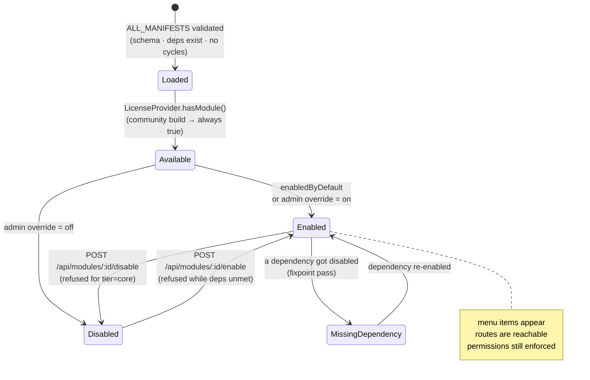
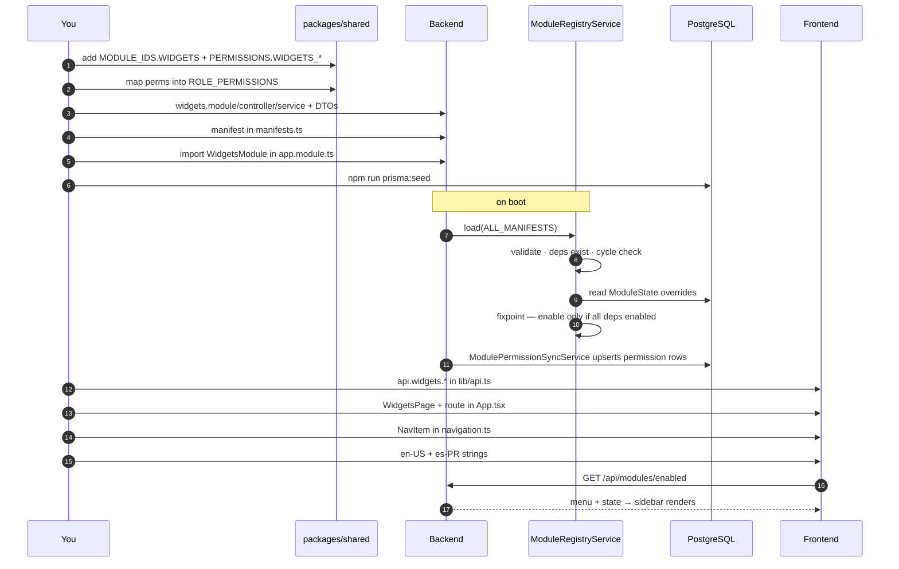

# Creating modules

## Overview

Every capability in UltraTorrent is a **module**: a NestJS module *plus* a manifest that
declares its tier, dependencies, permissions, menu entries, routes, WebSocket events, and
scheduler jobs. The registry loads all manifests at boot, validates them, resolves the
dependency graph, and computes each module's runtime state.

This page walks the full path: backend module → manifest → permission → guarded route →
frontend page → navigation → i18n.

## Purpose

Adding a feature should be **additive**. If you find yourself editing `TorrentsService` to
make your feature work, stop and reconsider — you probably want a module (or a
[provider](/develop/providers)).

## When to use

- You are adding a **capability** with its own routes, permissions and UI.
- You are grouping existing behaviour behind an enable/disable toggle.

If you are integrating an **external system**, you want a provider instead.

## Prerequisites

- [Local setup](/develop/setup) working — you will re-seed the database.
- [Architecture](/develop/architecture) — the layer rules.
- [RBAC](/develop/rbac) — you will add a permission.

## Concepts

### The manifest

```ts
// packages/shared/src/modules.ts
export interface ModuleManifest {
  id: string;
  name: string;
  description: string;
  tier: ModuleTier;             // 'core' | 'community'
  /** Whether the module is on by default. */
  enabledByDefault: boolean;
  dependencies: string[];
  permissions: string[];
  menu?: ModuleMenuItem[];
  routes?: string[];
  websocketEvents?: string[];
  schedulerJobs?: string[];
  settingsSections?: string[];
  features?: string[];
}
```

| Field | What it drives |
| --- | --- |
| `tier` | `core` modules are **locked** — they can never be disabled. `community` modules can be toggled. |
| `enabledByDefault` | Initial state before any admin override. |
| `dependencies` | The registry refuses to enable a module whose deps are not enabled, and refuses to disable one with enabled dependents. |
| `permissions` | Synced into the DB permission catalogue at boot by `ModulePermissionSyncService`. |
| `menu` | Feeds `GET /api/modules/enabled`, which the SPA uses to filter navigation. |
| `routes` / `websocketEvents` / `schedulerJobs` / `settingsSections` / `features` | Declarative documentation of the module's surface; surfaced in the [Modules reference](/reference/modules) and the admin Modules page. |

:::warning The manifest is not authorization
A module's enabled/disabled state is a **UI and routing convenience**. The server always
enforces `@RequirePermissions`. Never rely on "the module is off" to keep someone out.
:::

### Registry validation at boot

`ModuleRegistryService.load()` will throw — and the app will refuse to boot — if:

- a manifest is malformed (missing `id`/`name`, a `tier` that isn't `core`/`community`,
  non-array `dependencies`/`permissions`, non-boolean `enabledByDefault`);
- two manifests share an `id`;
- a manifest depends on an unknown module id;
- the dependency graph contains a **cycle** (three-colour DFS →
  `Circular dependency: a → b → a`).

That is deliberate: a broken module graph is a code bug, and it should fail loudly at boot,
not mysteriously at runtime.

## Module lifecycle diagram



## Step-by-step

### 1. Scaffold the backend module

```text
apps/backend/src/modules/<feature>/
├── <feature>.module.ts        # @Module wiring
├── <feature>.controller.ts    # API layer — thin, declares permissions
├── <feature>.service.ts       # application layer — the actual logic
└── dto/<feature>.dto.ts       # class-validator request DTOs
```

**Service (application layer).** The logic lives here. Depend on `PrismaService`,
`EngineRegistryService`, `AuditService` — never on a concrete provider.

```ts
@Injectable()
export class WidgetsService {
  constructor(
    private readonly prisma: PrismaService,
    private readonly audit: AuditService,
  ) {}

  async remove(id: string, userId?: string) {
    const widget = await this.prisma.widget.delete({ where: { id } });
    await this.audit.record({
      userId,
      action: 'widgets.delete',
      objectType: 'widget',
      objectId: id,
      result: 'success',
    });
    return widget;
  }
}
```

**Controller (API layer).** Bind routes to service calls, attach the guards, declare the
permissions, add the Swagger decorators. No business logic:

```ts
@ApiTags('widgets')
@ApiBearerAuth()
@Controller('widgets')
@UseGuards(JwtAuthGuard, PermissionsGuard)
export class WidgetsController {
  constructor(private readonly widgets: WidgetsService) {}

  @Get()
  @RequirePermissions(PERMISSIONS.WIDGETS_VIEW)
  list() {
    return this.widgets.list();
  }

  @Delete(':id')
  @RequirePermissions(PERMISSIONS.WIDGETS_DELETE)
  remove(@Param('id') id: string, @CurrentUser() user: AuthenticatedUser) {
    return this.widgets.remove(id, user?.id);
  }
}
```

**DTOs.** Validate every input with `class-validator`. The global `ValidationPipe` runs
`whitelist: true` + `forbidNonWhitelisted: true`, so an undeclared property is a 400.

### 2. Add the permissions

Add to `packages/shared/src/permissions.ts`, then map into the relevant `ROLE_PERMISSIONS`
entries. Full walkthrough in [RBAC](/develop/rbac).

```ts
export const PERMISSIONS = {
  // …
  WIDGETS_VIEW: 'widgets.view',
  WIDGETS_MANAGE: 'widgets.manage',
  WIDGETS_DELETE: 'widgets.delete',
} as const;
```

Rebuild `@ultratorrent/shared` so the backend and frontend see the new keys.

### 3. Write the manifest

In `apps/backend/src/modules/module-registry/manifests.ts`, add an entry to
`CORE_MANIFESTS` (always-on) or `COMMUNITY_MANIFESTS` (toggleable). Add the id to
`MODULE_IDS` in `packages/shared/src/modules.ts` first.

```ts
// apps/backend/src/modules/module-registry/manifests.ts
{
  id: MODULE_IDS.NOTIFICATION_CENTER,
  name: 'Notification Center',
  description:
    'The centralized, provider-driven messaging platform. …',
  tier: 'core',
  enabledByDefault: true,
  dependencies: [
    MODULE_IDS.AUTH,
    MODULE_IDS.RBAC,
    MODULE_IDS.MODULE_REGISTRY,
    MODULE_IDS.AUDIT,
    MODULE_IDS.SETTINGS,
  ],
  permissions: [
    P.NOTIFICATIONS_VIEW,
    P.NOTIFICATIONS_MANAGE_CHANNELS,
    // …
  ],
  menu: [
    { label: 'Notification Center', path: '/notifications', icon: 'Bell', permission: P.NOTIFICATIONS_VIEW },
  ],
  routes: ['/api/notifications'],
  websocketEvents: [
    'notification.sent',
    'notification.failed',
    // …
  ],
  schedulerJobs: ['notification_delivery_worker', 'notification_provider_health'],
  settingsSections: ['notification-center'],
  features: ['providers', 'channels', 'templates', 'delivery_queue', 'quiet_hours'],
}
```

The permission keys you list here are upserted into the DB catalogue at boot:

```ts
// apps/backend/src/modules/module-registry/module-permission-sync.service.ts
async onModuleInit(): Promise<void> {
  const keys = new Set<string>();
  for (const m of this.registry.allManifests()) {
    for (const p of m.permissions) keys.add(p);
  }
  for (const key of keys) {
    await this.prisma.permission.upsert({
      where: { key },
      update: {},
      create: { key, description: `${key} (module-declared)` },
    });
  }
  this.logger.log(`Synced ${keys.size} module permission key(s)`);
}
```

This creates the permission **row**. It does **not** grant it to any role — that is what
`ROLE_PERMISSIONS` + the seed do.

### 4. Register the Nest module

Add it to the root module's `imports` in `apps/backend/src/app.module.ts`. Mark it
`@Global()` **only** if the whole app needs its exports — `EngineModule`, `AuditModule`
and `RealtimeModule` are global; almost nothing else should be.

### 5. Re-seed

```bash
npm run prisma:seed
```

The seed is idempotent: it provisions permissions, the system roles, the bootstrap admin,
and default settings.

### 6. Add the API method (frontend)

Add your endpoints to the `api` object in `apps/frontend/src/lib/api.ts`. Everything
funnels through the private `request<T>()`, which attaches the bearer token and transparently
refreshes once on a 401.

### 7. Build the page

Add `apps/frontend/src/pages/<area>/<Name>Page.tsx`. The house pattern:

```tsx
export function WidgetsPage() {
  const { t } = useTranslation('widgets');
  const toast = useToast();
  const qc = useQueryClient();

  const widgets = useQuery({ queryKey: ['widgets'], queryFn: () => api.widgets.list() });
  const invalidate = () => void qc.invalidateQueries({ queryKey: ['widgets'] });

  const remove = useMutation({
    mutationFn: (id: string) => api.widgets.remove(id),
    onSuccess: () => { toast.success(t('deleted')); invalidate(); },
    onError: (e) => toast.error(t('deleteFailed'), e instanceof ApiError ? e.message : undefined),
  });

  if (widgets.isLoading) return <CenteredSpinner />;
  if (widgets.isError) return <ErrorState title={t('loadError')} onRetry={() => void widgets.refetch()} />;
  // …
}
```

Hierarchical array query keys, a local `invalidate()` on the key prefix, and
`CenteredSpinner` / `ErrorState` / `EmptyState` from `@/components/ui/feedback` for the
three states.

### 8. Add the route

In `apps/frontend/src/App.tsx`, nest the route under a permission guard, inside the app
shell, and wrap the element in a module guard if the feature is toggleable:

```tsx
<Route element={<ProtectedRoute permission={PERMISSIONS.MEDIA_MANAGER_VIEW} />}>
  <Route element={<AppShell />}>
    <Route path="/media" element={<ModuleRoute moduleId="media_manager"><MediaDashboardPage /></ModuleRoute>} />
  </Route>
</Route>
```

`ProtectedRoute` redirects unauthenticated users to `/login` and shows an "Access denied"
panel when the permission is missing. `ModuleRoute` renders `LockedModulePage` when the
module is disabled.

### 9. Add the navigation entry

`apps/frontend/src/components/layout/navigation.ts` holds `NAV_GROUPS` — the single source
of truth for the sidebar, the breadcrumbs, and the command palette. Add a `NavItem` with a
stable `id`, a canonical-English `label`, a lucide `icon`, a `to` that **exactly matches
the route**, and its `permission` / `module` gates.

Filtering is permission-first:

```ts
// apps/frontend/src/components/layout/navigation.ts
function selfVisible(item: NavItem, ctx: NavVisibilityCtx): boolean {
  if (item.permission && !ctx.hasPermission(item.permission)) return false;
  if (item.superAdminOnly && !ctx.isSuperAdmin) return false;
  if (item.adminOnly && !ctx.canManageModules) return false;
  // Module gate: hidden when disabled — unless the user can manage modules
  // (module state is convenience-only; route guards remain authoritative).
  if (item.module && !ctx.isEnabled(item.module) && !ctx.canManageModules) return false;
  return true;
}
```

### 10. Add the strings — in both languages

Add the label/description under `groups` / `items` / `descriptions` in **both**
`src/i18n/locales/en-US/nav.json` and `src/i18n/locales/es-PR/nav.json`, and your page's
strings to both copies of its namespace. A brand-new namespace must be registered in three
places. The parity test fails the build otherwise — see [i18n](/develop/i18n).

## Full flow



## Troubleshooting

| Symptom | Cause | Fix |
| --- | --- | --- |
| Boot fails: `Invalid manifest "x": bad tier` | `tier` isn't `core` or `community`. | Fix the manifest. |
| Boot fails: `Module "x" depends on unknown module "y"` | Typo, or you forgot to add the id to `MODULE_IDS`. | Add the id / fix the dependency. |
| Boot fails: `Circular dependency: a → b → a` | Two modules import each other. | Break it: use the event bus, or a lazy `ModuleRef.get(...)` (as `AutomationModule` ↔ `RssModule` do). |
| `Duplicate module id in manifests` | The same `id` appears twice. | Remove one. |
| `Core modules cannot be disabled` | You tried to disable a `tier: 'core'` module. | Change the tier, or don't. |
| `Enable its dependencies first: audit, settings` | You enabled a module whose deps are off. | Enable them first. |
| The nav entry never appears | The permission isn't held, or the `to` doesn't match a route. | Check the role; check `navigation.ts` against `App.tsx`. |
| The route 403s for an admin | The permission row exists but isn't granted to the role. | Add it to `ROLE_PERMISSIONS`, re-seed. |

## Tips

- **Follow an existing module.** `torrents`, `engine`, and `audit` are the cleanest
  templates. `notification-center` is the reference for a large module with providers.
- **Declare your surface honestly.** `websocketEvents`, `schedulerJobs`, `settingsSections`
  and `features` are how the [Modules reference](/reference/modules) stays truthful. An
  undeclared scheduler job is an invisible one.
- **Don't create a cycle to save a call.** If module A needs something from module B and B
  already needs A, one of the two directions is an event, not a method call.
- **`tsc` clean is not enough.** DI and module wiring only fail at boot. Boot a clean build
  before you call it done.

## FAQ

**Core or community tier?**
`core` if the product is broken without it (auth, RBAC, torrents, engine). `community` if
an operator could reasonably turn it off. Core is permanently locked on.

**Can a module be enabled per user?**
No. Module state is global. Per-user access is RBAC.

**Do I have to add a menu entry?**
No. Modules like `search`, `taxonomy` and `system` have routes but no menu item.

**How do I ship a scheduler job with my module?**
Declare it in `schedulerJobs` and implement it with `@Interval('<name>', ms)`. See
[Background jobs](/develop/background-jobs).

## Checklist

- [ ] `MODULE_IDS` entry added in `packages/shared/src/modules.ts`.
- [ ] Permissions added to `packages/shared/src/permissions.ts` **and** `ROLE_PERMISSIONS`.
- [ ] Shared package rebuilt.
- [ ] Manifest added, with honest `dependencies` / `websocketEvents` / `schedulerJobs`.
- [ ] Module imported in `app.module.ts`.
- [ ] Controller carries `@UseGuards(JwtAuthGuard, PermissionsGuard)` + `@RequirePermissions`.
- [ ] Every input has a `class-validator` DTO.
- [ ] Destructive actions call `AuditService.record(...)`.
- [ ] Seed re-run.
- [ ] Frontend: API method, page, route, nav entry, **en-US + es-PR** strings.
- [ ] Clean build boots.

## See also

- [Providers](/develop/providers) — for external integrations
- [RBAC](/develop/rbac) — adding a permission end to end
- [Modules reference](/reference/modules) — the generated manifest table
- [Modules → Torrents](/modules/torrents) and the other module pages
- [i18n](/develop/i18n)
