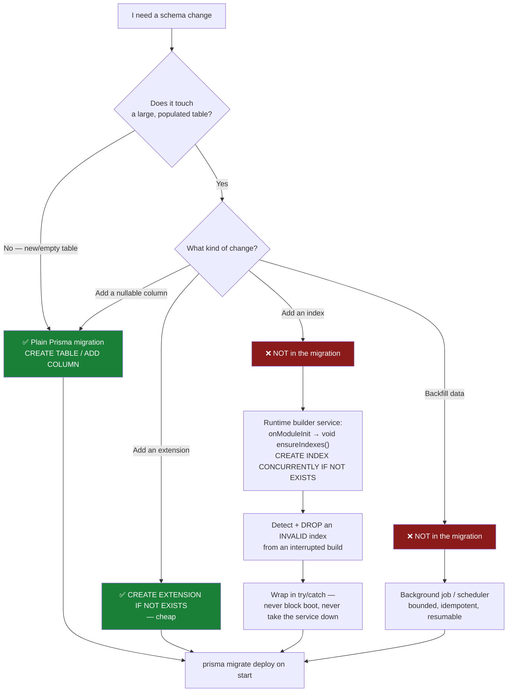

# Database & Prisma

## Overview

**PostgreSQL** via **Prisma**. The schema (`apps/backend/prisma/schema.prisma`) holds ~88
models covering identity and RBAC, torrent snapshots, RSS, automation, the full Media
Manager model set, media-server analytics, the IMDb dataset catalogue, the Notification
Center, the audit log, and settings.

## Purpose

Change the schema without breaking a deploy — and without ever bricking a running install.

## Prerequisites

- [Local setup](/develop/setup) — a working Postgres.
- [Database schema reference](/reference/database-schema) — the generated model reference.

## Concepts

### The datasource

```prisma
generator client {
  provider = "prisma-client-js"
}

datasource db {
  provider = "postgresql"
  url      = env("DATABASE_URL")
}
```

No preview features, no custom binary targets. Every model is `@@map`ped to a snake_case
table name.

### Model groups

| Domain | Models (selection) |
| --- | --- |
| Identity & access | `User`, `Role`, `Permission`, `UserRole`, `RolePermission`, `RefreshToken`, `ApiKey` |
| Engines & torrents | `TorrentEngine`, `TorrentSnapshot`, `ParkedTorrent`, `TorrentCategory`, `TorrentTag`, `TorrentTagLink` |
| RSS | `RssFeed`, `RssRule`, `TvShowStatus`, `RssAcquisition`, `RssHistory`, … |
| Automation | `AutomationRule`, `AutomationLog` |
| Media library | `MediaLibrary`, `MediaItem`, `MediaFile`, `MediaMetadata`, `MediaArtwork`, `MediaSubtitle`, `MediaProcessingJob`, `MediaDuplicateGroup`, … |
| Media-server analytics | `MediaServerIntegration`, `MediaServerSession`, `MediaServerWatchHistory`, `MediaServerNewsletter`, … |
| Media acquisition | `MediaAcquisitionWatchlistItem`, `WantedEpisode`, `WantedMovie`, `Indexer`, `MediaAcquisitionProfile`, … |
| IMDb datasets | `IMDbTitle`, `IMDbAka`, `IMDbEpisode`, `IMDbRating`, `IMDbDatasetImport`, … |
| Notification Center | `NotificationChannel`, `NotificationTemplate`, `NotificationRule`, `NotificationDelivery`, `NotificationQueue`, … |
| Platform | `Setting`, `Notification`, `AuditLog`, `SystemEvent`, `ModuleState`, `ModuleEvent` |

The complete, generated reference is at [Database schema](/reference/database-schema).

A few index/constraint choices worth knowing:

- `RefreshToken.tokenHash` is `@unique` — that's what makes single-row rotation lookup
  possible. See [Authentication](/develop/authentication).
- `IMDbAka` has `@@unique([titleId, ordering])` — IMDb's natural key, which is what turns a
  re-import into an upsert rather than a duplicate.
- `IMDbTitle` carries a composite `@@index([titleType, startYear])` and a GIN index on
  `genres`.

### Scripts

| Command | Runs |
| --- | --- |
| `npm run prisma:generate` | `prisma generate` |
| `npm run prisma:migrate` | **`prisma migrate deploy`** — applies existing migrations |
| `npm run prisma:seed` | `ts-node prisma/seed.ts` |
| `npm run prisma:migrate:dev --workspace @ultratorrent/backend` | `prisma migrate dev` — **creates** a migration |

Note the root `prisma:migrate` is `migrate deploy`, not `migrate dev`. To author a new
migration you must use the workspace script.

The backend container runs `prisma migrate deploy` on start — which is exactly why the rule
below matters so much.

## The safe-migration rule

:::danger A long index build must NEVER go in a migration
This is not a style preference. It caused a **real, two-host production outage.**

`CREATE INDEX` on the fully-imported 8.9M-row IMDb catalogue takes **minutes** and holds a
lock. Running it inside a Prisma migration blocked the deploy. When the build was killed
mid-flight, **Prisma marked the migration failed (`P3009`)** — and the backend then
**refused to boot at all**, restart-looping on *both* hosts until the migration row was
resolved by hand.

Worse, `CREATE INDEX CONCURRENTLY` **cannot run inside a transaction**, so it could never
live in a Prisma migration regardless.
:::

**The rule:**

| Migration content | Verdict |
| --- | --- |
| `CREATE TABLE` on a new (empty) table | ✅ Instant. Fine. |
| `ALTER TABLE … ADD COLUMN` (nullable, no default rewrite) | ✅ Fine. |
| `CREATE EXTENSION IF NOT EXISTS pg_trgm` | ✅ Cheap. Fine. |
| `CREATE INDEX` on a large, populated table | ❌ **Never.** Build it `CONCURRENTLY` at runtime. |
| A data backfill over millions of rows | ❌ **Never.** Do it in a background job. |

The migration that ships is deliberately minimal —
`20260711060000_imdb_trigram_indexes` contains **exactly one statement**,
`CREATE EXTENSION IF NOT EXISTS pg_trgm;`, plus a comment explaining why the GIN indexes are
*not* there.

### Building an index at runtime, correctly

`ImdbTrigramIndexService` builds the three GIN `gin_trgm_ops` indexes in the background.
Read it before you write your own — there are three non-obvious traps in it.

**Trap 1: it must not block boot.**

```ts
// apps/backend/src/modules/media/imdb/imdb-trigram-index.service.ts
onModuleInit(): void {
  // Deliberately NOT awaited: a multi-minute index build must never delay boot.
  void this.ensureIndexes();
}
```

**Trap 2: an interrupted `CONCURRENTLY` build leaves the index *INVALID* — and
`IF NOT EXISTS` will then skip the rebuild forever** while the planner ignores the index.
You must detect and drop it:

```ts
await this.prisma.$executeRawUnsafe('CREATE EXTENSION IF NOT EXISTS pg_trgm');

for (const idx of TRIGRAM_INDEXES) {
  // A CONCURRENTLY build that is interrupted leaves the index behind but
  // marked INVALID: the planner ignores it, yet `IF NOT EXISTS` sees the name
  // and would skip the rebuild forever. Drop it so we rebuild cleanly.
  if (await this.isInvalid(idx.name)) {
    this.logger.warn(`Dropping invalid index ${idx.name} (a previous build was interrupted)`);
    await this.prisma.$executeRawUnsafe(`DROP INDEX IF EXISTS "${idx.name}"`);
  }
  if (await this.isValid(idx.name)) continue; // already built — no-op

  await this.prisma.$executeRawUnsafe(
    `CREATE INDEX CONCURRENTLY IF NOT EXISTS "${idx.name}" ` +
      `ON "${idx.table}" USING gin ("${idx.column}" gin_trgm_ops)`,
  );
}
```

Validity is probed against `pg_class` / `pg_index` (`indisvalid`).

**Trap 3: it must never take the service down.** The whole body is wrapped in a try/catch
that only warns — *"a missing index only costs speed, never correctness."*

The result: a fresh install builds them instantly (empty catalogue); an existing one
back-fills with **zero downtime**.

:::warning Editing an applied migration changes its checksum
Prisma stores the sha256 of `migration.sql`. If you edit a migration that has already been
applied somewhere, that host's stored checksum must be updated before deploying, or
`migrate deploy` will refuse.
:::

### The ILIKE trap that started all this

Prisma renders `mode: 'insensitive'` as **`ILIKE`**, and **`ILIKE` cannot use a btree
index**. On the 8.9M-row IMDb catalogue that made every case-insensitive title lookup a
**full table scan** — measured at **47.8 seconds per call** on a live host. Those lookups
fire per media item, so they saturated Postgres and a library scan sat wedged indefinitely
with no error.

The fix was `pg_trgm` + GIN `gin_trgm_ops` indexes, which make LIKE/ILIKE index-backed:
**180 ms** after, a ~265× speedup, with **no application code change**.

**If you write a case-insensitive Prisma query against a large table, you have written a
sequential scan** unless a trigram index covers that column. Know which it is.

## Migration decision flow



## Step-by-step: change the schema

### 1. Edit the schema

```prisma
model Widget {
  id        String   @id @default(uuid())
  name      String
  isActive  Boolean  @default(true)
  createdAt DateTime @default(now())

  @@index([isActive])
  @@map("widgets")
}
```

`@@map` to a snake_case table name — every model does.

### 2. Create the migration

```bash
npm run prisma:migrate:dev --workspace @ultratorrent/backend
```

Prisma writes `prisma/migrations/<timestamp>_<name>/migration.sql` and applies it.

### 3. Read the generated SQL

**Every time.** This is where you catch a `CREATE INDEX` that Prisma helpfully added to a
table with 9 million rows in it. If the SQL contains anything from the ❌ column above, pull
it out and build it at runtime instead.

### 4. Regenerate the client

```bash
npm run prisma:generate
```

### 5. Seed, if you added a permission or a setting

```bash
npm run prisma:seed
```

## Seeding

`apps/backend/prisma/seed.ts` provisions, in order:

1. **Permissions** — an upsert for every key in `ALL_PERMISSIONS`.
2. **Roles + grants** — upsert each `SystemRole`, then **re-sync** its permissions
   (`rolePermission.deleteMany` + `createMany({ skipDuplicates: true })`). This is why a
   new `ROLE_PERMISSIONS` mapping lands on *existing* roles.
3. **The bootstrap super admin** — `ADMIN_USERNAME` (`admin`), `ADMIN_EMAIL`,
   `ADMIN_PASSWORD` (`changeme123!`), Argon2id-hashed.
4. **Default settings** — product name, theme, token TTLs, engine poll interval, the file
   manager's default root path.

It is **idempotent**: every write is an `upsert` with `update: {}`. Which means one thing
that surprises people:

:::note Re-seeding does not reset an existing admin's password
`update: {}` leaves the existing row alone. If you've forgotten the admin password,
re-seeding will not help — delete the user row and re-seed, or reset it through the app.
:::

Permissions declared on a **module manifest** are additionally upserted at boot by
`ModulePermissionSyncService` — but that creates the *row*, it does not *grant* it. Granting
is `ROLE_PERMISSIONS` + the seed.

## Troubleshooting

| Symptom | Cause | Fix |
| --- | --- | --- |
| `P3009` — the backend restart-loops and refuses to boot | A migration failed (very often: an interrupted long index build). Prisma will not proceed with a failed migration in the history. | Resolve the failed migration row by hand (`prisma migrate resolve`), then remove the offending statement from the migration and rebuild the index at runtime. |
| `migrate deploy` refuses: checksum mismatch | An already-applied migration file was edited. | Update the stored checksum on that host before deploying. |
| A query on a big table takes tens of seconds with no lock contention | `mode: 'insensitive'` → `ILIKE` → full table scan. | Add a `pg_trgm` GIN index — at **runtime**, `CONCURRENTLY`. |
| An index exists but the planner ignores it | It's `INVALID` — a `CONCURRENTLY` build was interrupted, and `IF NOT EXISTS` now skips the rebuild forever. | Detect (`pg_index.indisvalid`), `DROP`, rebuild. |
| `P2025 Record to update not found` inside a sweep | A row was deleted concurrently, and `update` throws. | Use `updateMany` — a no-op (`count: 0`) for a missing row. |
| A new permission 403s | The seed wasn't re-run, so the role grant doesn't exist. | `npm run prisma:seed`. |
| `P1001 Can't reach database server` | Postgres isn't up, or `DATABASE_URL` is wrong. | Check both. |

## Tips

- **Always read the generated SQL.** Prisma is not thinking about your 9-million-row table.
- **A migration should be *instant*.** If you can't say how long it takes on the biggest
  install you know of, it doesn't belong in a migration.
- **`updateMany` over `update`** wherever a missing row should be a no-op rather than an
  exception — background sweeps race with deletes constantly.
- **`BigInt` doesn't serialize.** `bootstrap.ts` patches `BigInt.prototype.toJSON` to emit a
  string, because Express can't serialize torrent snapshot sizes otherwise.
- **Redis is in the stack.** Don't reach for the DB as a lock or a queue.

## FAQ

**How many migrations are there?**
41 directories at the time of writing, from `20260630034447_init` to
`20260711112202_parked_torrents`. Naming is Prisma's default:
`<YYYYMMDDHHMMSS>_<snake_case_description>`.

**Can I drop and recreate the database in dev?**
Yes. `prisma migrate deploy` + `prisma:seed` rebuilds it. There is deliberately no
destructive reset script in the repo.

**Do I need a migration for a permission?**
No. Permissions are rows, created by the seed and the manifest sync — not schema.

**Where is the generated schema reference?**
[Database schema](/reference/database-schema) — built from `schema.prisma`, so it can't
drift.

## Checklist

- [ ] `@@map` to a snake_case table name.
- [ ] I **read the generated `migration.sql`**.
- [ ] It contains no `CREATE INDEX` on a large populated table.
- [ ] It contains no bulk data backfill.
- [ ] Any needed index on a big table is built at runtime, `CONCURRENTLY`, fire-and-forget,
      with INVALID-index detection, wrapped so it can never block boot.
- [ ] Any case-insensitive query on a large table has a trigram index behind it.
- [ ] `prisma:generate` re-run.
- [ ] Seed re-run if permissions/settings changed.

## See also

- [Database schema reference](/reference/database-schema) — the generated model reference
- [Background jobs](/develop/background-jobs) — where a backfill belongs
- [RBAC](/develop/rbac) — the seed's permission sync
- [Operate → Backup](/operate/backup) · [Performance](/operate/performance)
- [Operate → Troubleshooting](/operate/troubleshooting)
