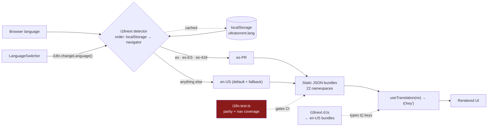

# Internationalization

## Overview

The UI is fully localized with **i18next + react-i18next**, shipping two languages:
**en-US** (default and fallback) and **es-PR** (Spanish, Puerto Rico). Translations are
**static, typed, namespaced JSON** — nothing loads over the network, and `t()` keys are
type-checked.

**Key parity between the two languages is enforced by a test.** A string in one language and
not the other fails the suite.

## Purpose

Add a string without breaking the build, and without leaving Spanish-speaking users staring
at a raw key.

## When to use

Every user-visible string. There are no hardcoded English strings in new UI code.

## Prerequisites

- [Local setup](/develop/setup).
- [Testing](/develop/testing) — the parity test runs under Vitest.

## Concepts

### Layout

```text
apps/frontend/src/i18n/
├── index.ts          init: static imports, namespaces, fallback map, detection
├── i18next.d.ts      module augmentation — en-US bundles ARE the type
├── i18n.test.ts      the parity + nav-coverage test
└── locales/
    ├── en-US/        22 namespace files
    └── es-PR/        the same 22, with the same keys
```

The 22 namespaces:

`account`, `audit`, `auth`, `automation`, `common`, `dashboard`, `engines`, `files`,
`imdb`, `indexers`, `media`, `mediaServerAnalytics`, `modules`, `nav`,
`notificationCenter`, `prowlarr`, `rss`, `settings`, `shell`, `system`, `torrents`,
`users`.

Namespaces are split **by surface**, not by page. `common` is the default namespace.

### Init

```ts
// apps/frontend/src/i18n/index.ts
fallbackLng: { es: ['es-PR'], 'es-ES': ['es-PR'], 'es-419': ['es-PR'], default: ['en-US'] },
detection: {
  order: ['localStorage', 'navigator'],
  lookupLocalStorage: 'ultratorrent.lang',
  caches: ['localStorage'],
},
```

Every Spanish browser variant (`es`, `es-ES`, `es-419`) resolves to **es-PR**. Everything
else falls back to **en-US**. The user's choice is persisted in localStorage under
`ultratorrent.lang` by the language detector's cache — the switcher itself just calls
`i18n.changeLanguage(...)`.

Also set: `defaultNS: 'common'`, `supportedLngs: ['en-US', 'es-PR']`,
`interpolation.escapeValue: false`, `react.useSuspense: false`.

### Typed keys

`i18next.d.ts` augments the i18next module with the **en-US bundles as the canonical shape**:

```ts
// apps/frontend/src/i18n/i18next.d.ts
declare module 'i18next' {
  interface CustomTypeOptions {
    defaultNS: 'common';
    resources: {
      common: typeof common;
      nav: typeof nav;
      // …all 22
    };
  }
}
```

So `t('channels.titel')` is a **compile error**, not a mystery blank string at runtime.

### Using it

```tsx
const { t } = useTranslation('notificationCenter');
// …
<h1>{t('channels.title')}</h1>
<p>{t('channels.count', { count: channels.length })}</p>
```

Dynamic values use interpolation; counts use i18next pluralization.

### Navigation is special

`NAV_GROUPS` in `navigation.ts` stays **canonical English** and is translated at render time:

```ts
tNav(t, 'items', item.label)   // → t(`items.${englishLabel}`, { ns: 'nav' })
```

So a nav entry's `label` is both the English string *and* the translation key. Add the same
label under `items` in **both** `nav.json` files.

## The parity requirement

:::danger en-US and es-PR must have identical key sets
This is enforced by `apps/frontend/src/i18n/i18n.test.ts`. A key in one language and not the
other **fails the test suite**.
:::

```ts
// apps/frontend/src/i18n/i18n.test.ts
it('has identical key sets across en-US and es-PR for every namespace (parity)', () => {
  for (const ns of NAMESPACES) {
    const en = flatKeys(i18n.getResourceBundle('en-US', ns) ?? {}).sort();
    const es = flatKeys(i18n.getResourceBundle('es-PR', ns) ?? {}).sort();
    expect({ ns, keys: es }).toEqual({ ns, keys: en });
  }
});
```

Each bundle is flattened to dotted leaf keys and the sorted sets are compared. The
`{ ns, keys }` wrapper is a small nicety: a failure **names the offending namespace** rather
than dumping two anonymous arrays.

The same file also enforces **nav coverage** — every `NAV_GROUPS` label must resolve, in both
languages:

```ts
expect(i18n.exists(`items.${label}`, { ns: 'nav', lng })).toBe(true);
```

…plus `groups.*` and `descriptions.*`.

Why this is a hard gate rather than a lint warning: a missing key doesn't crash, it renders
the raw dotted key into the UI. Without the test, `settings.advanced.retryPolicy.label`
quietly ships to every Spanish user and nobody notices for a month.

## Diagram



## Step-by-step: add a string

### To an existing namespace

1. **en-US** — `src/i18n/locales/en-US/<ns>.json`:

   ```json
   {
     "channels": {
       "created": "Channel created",
       "saveFailed": "Could not save the channel"
     }
   }
   ```

2. **es-PR** — `src/i18n/locales/es-PR/<ns>.json`, **the same key path**:

   ```json
   {
     "channels": {
       "created": "Canal creado",
       "saveFailed": "No se pudo guardar el canal"
     }
   }
   ```

3. **Use it**: `const { t } = useTranslation('notificationCenter');` → `t('channels.created')`.

4. **Run the test**: `npm run test --workspace @ultratorrent/frontend`.

### A brand-new namespace

Register it in **three** places, or it will not load:

1. `NAMESPACES` **and** `resources` in `src/i18n/index.ts`.
2. `CustomTypeOptions.resources` in `src/i18n/i18next.d.ts` (import the en-US bundle).
3. Create **both** `locales/en-US/<ns>.json` and `locales/es-PR/<ns>.json`.

### A nav entry

Add the English label under `items` in **both** `nav.json` files (plus `descriptions.*` if
you set a `descriptionKey`). The nav-coverage assertion in `i18n.test.ts` will catch you if
you don't.

## Troubleshooting

| Symptom | Cause | Fix |
| --- | --- | --- |
| The test fails with `{ ns: 'media', keys: [...] }` mismatch | A key exists in one language and not the other. | Add the missing key. The `ns` in the failure names the file. |
| A raw key renders in the UI (`settings.foo.bar`) | The key doesn't exist in the active language. In en-US that means it doesn't exist at all. | Add it. |
| TypeScript rejects a key that's clearly there | The types come from the **en-US** bundle. | Add it to en-US first, then es-PR. |
| A new namespace's strings never resolve | It's registered in only one or two of the three places. | All three: `NAMESPACES`, `resources`, `i18next.d.ts`. |
| The language switcher doesn't stick | The localStorage cache key is `ultratorrent.lang`. | Check it isn't being cleared. |
| A nav label shows in English for a Spanish user | The label isn't under `items` in `es-PR/nav.json`. | Add it — `NAV_GROUPS` labels *are* the keys. |

## Tips

- **Write both languages in the same commit.** Not "I'll do Spanish later" — the test won't
  let you, and that is on purpose.
- **Don't machine-translate a term of art.** "Seeder", "magnet", "info-hash" are the same in
  both. Translate the sentence around them.
- **Namespace by surface, not by component.** A dialog inside the RSS page belongs in `rss`,
  not a new `rssDialog` namespace.
- **Keys are structural, not sentences.** `channels.saveFailed`, not
  `couldNotSaveTheChannel`.
- **The parity test is cheap to run.** Run it before you push; it's a second.

## FAQ

**How do I add a third language?**
Add the code to `SUPPORTED_LANGUAGES` and `supportedLngs`, create
`locales/<code>/` with all 22 namespaces, and extend the fallback map. The parity test
currently compares **en-US against es-PR specifically** — you would extend it to cover the
new locale too.

**Is the backend localized?**
No. API error messages are English. Localization is a frontend concern.

**Are the docs localized?**
The Docusaurus site is configured for `en` + `es-PR` (mirroring the app), but the Spanish doc
tree is a separate translation effort from the app's strings.

**What about pluralization?**
i18next's standard `_one` / `_other` suffixes. Pass `{ count }`.

## Checklist

- [ ] The key exists in **en-US**.
- [ ] The key exists in **es-PR**, at the identical path.
- [ ] A new namespace is registered in `index.ts` (`NAMESPACES` + `resources`) **and**
      `i18next.d.ts`.
- [ ] A new nav entry's label is in **both** `nav.json` files under `items`.
- [ ] `npm run test --workspace @ultratorrent/frontend` is green (parity + nav coverage).
- [ ] No hardcoded English string left in the component.

## See also

- [Testing](/develop/testing) — the suite the parity test runs in
- [Creating modules](/develop/creating-modules) — step 10 is this page
- [Standards](/develop/standards)
