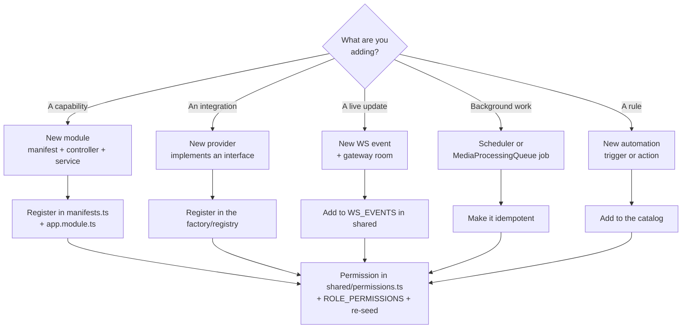

# Develop

Everything you need to change UltraTorrent: how the repository is laid out, where the
extension seams are, and the conventions the codebase enforces.

## Overview

UltraTorrent is a TypeScript monorepo: a **NestJS** API, a **React + Vite** SPA, and a
**shared** package that both consume. It is a single, open-source community product —
there is no commercial edition, no private overlay, and no feature paywall. Access is
controlled **only** by RBAC.

The design goal that shapes almost every file you will touch: **new integrations are
added as providers or modules, never by editing core business logic.** A new torrent
engine, metadata source, media server, or notification channel should require zero
changes to the services that consume it.

## Purpose

This section is for people who want to:

- Add a feature module (manifest → permissions → routes → UI page).
- Add a provider (engine, indexer, metadata, media server, notification channel).
- Understand the request lifecycle, the realtime gateway, and the background-job model.
- Contribute a fix and get it through review, changesets, and release.

## When to use

| You want to… | Go to |
| --- | --- |
| Understand how the pieces fit | [Architecture](/develop/architecture) |
| Get a dev environment running | [Local setup](/develop/setup) |
| Add a feature | [Creating modules](/develop/creating-modules) |
| Integrate an external service | [Providers](/develop/providers) |
| Add or enforce a permission | [RBAC](/develop/rbac) |
| Change the schema | [Database & Prisma](/develop/database) |
| Understand login / 2FA / API keys | [Authentication](/develop/authentication) |
| Push live updates to the UI | [WebSockets](/develop/websockets) |
| Run work off the request path | [Background jobs](/develop/background-jobs) |
| Add an automation trigger or action | [Automation](/develop/automation) |
| Write tests | [Testing](/develop/testing) |
| Add a UI string | [Internationalization](/develop/i18n) |
| Commit, changeset, release | [Standards](/develop/standards) |

## Prerequisites

- **Node.js ≥ 20** (the repo declares `engines.node >= 20`).
- **PostgreSQL** and **Redis** — the simplest way to get both is Docker
  ([Docker Compose install](/install/docker-compose)).
- Familiarity with NestJS (decorators, DI, modules) and React function components.

Start with the [Learn → Architecture overview](/learn/architecture-overview) if you have
not read it — this section assumes the concepts it introduces.

## Concepts

### Clean Architecture layers

Dependencies point inward. The domain knows nothing about HTTP, Prisma, or any specific
engine.

| Layer | Responsibility | Examples |
| --- | --- | --- |
| **API** | Controllers, DTOs/validation, guards, the WebSocket gateway | `*.controller.ts`, `RealtimeGateway` |
| **Application** | Use cases, RBAC enforcement, auditing | `TorrentsService`, `EngineRegistryService`, `TorrentSyncService`, `MediaProcessingService` |
| **Domain** | Framework-free contracts — *the seams* | `TorrentEngineProvider`, `MediaMetadataProvider`, `Normalized*` types |
| **Infrastructure** | Concrete adapters | `RTorrentProvider`, `QbittorrentProvider`, XML-RPC/SCGI client, `PrismaService` |

### The three seams

1. **Modules** — every capability is a NestJS module with a manifest in
   `apps/backend/src/modules/module-registry/manifests.ts`. The registry validates
   manifests at boot, resolves the dependency graph, and rejects cycles.
2. **Providers** — external services are reached only through interfaces
   (`TorrentEngineProvider`, `MediaMetadataProvider`, `MediaServerProvider`,
   `NotificationProvider`, …). Providers declare **capabilities**; a capability a
   provider genuinely cannot serve throws `UnsupportedCapabilityError`.
3. **Permissions** — every protected route carries `JwtAuthGuard` + `PermissionsGuard`
   + `@RequirePermissions(...)`, drawn from the single catalogue in
   `packages/shared/src/permissions.ts`.

## Repo map

```text
ultratorrent/
├── apps/
│   ├── backend/                 @ultratorrent/backend — NestJS API
│   │   ├── prisma/
│   │   │   ├── schema.prisma    the data model
│   │   │   ├── migrations/      SQL migrations (applied with `prisma migrate deploy`)
│   │   │   └── seed.ts          permissions, roles, bootstrap admin, settings
│   │   └── src/
│   │       ├── main.ts          entrypoint → bootstrap.ts
│   │       ├── bootstrap.ts     Nest app assembly: Helmet, ValidationPipe, Swagger
│   │       ├── app.module.ts    root module — imports every feature module
│   │       ├── common/          cross-cutting: decorators, SSRF guard, crypto, filters
│   │       ├── config/          typed configuration loader + secret validation
│   │       ├── domain/          framework-free contracts (the engine seam)
│   │       ├── infrastructure/  adapters: engine providers, rtorrent/qbittorrent, Prisma
│   │       └── modules/         feature modules (controllers + services)
│   └── frontend/                @ultratorrent/frontend — React + Vite SPA
│       └── src/
│           ├── i18n/locales/    en-US + es-PR namespaced JSON
│           ├── lib/             API client, helpers
│           └── pages/           route components
├── packages/
│   └── shared/                  @ultratorrent/shared — types, permissions, WS events
├── docs/                        the canonical engineering docs (ARCHITECTURE.md et al.)
└── website/                     this documentation site (Docusaurus 3)
```

### The backend modules

Every feature under `apps/backend/src/modules/` is a module. As of this writing:

`account`, `apikeys`, `audit`, `auth`, `automation`, `dashboard`, `engine`, `files`,
`indexers`, `integrations`, `media`, `media-acquisition`, `media-server-analytics`,
`module-registry`, `notification-center`, `notifications`, `realtime`,
`release-scoring`, `rss`, `search`, `settings`, `system`, `taxonomy`, `torrents`,
`two-factor`, `users`.

The authoritative, generated list — with tiers, dependencies and permissions — is the
[Modules reference](/reference/modules).

## Step-by-step: your first change

1. **Read the ground truth.** `docs/ARCHITECTURE.md` in the repository is the canonical
   architecture document. Any architectural change updates it *and* appends a dated row
   to its Change Log.
2. **Get it running.** [Local setup](/develop/setup) — install, generate the Prisma
   client, migrate, seed, `npm run dev`.
3. **Find the seam.** Is your change a new *module* (a capability) or a new *provider*
   (an integration)? Almost nothing should be a change to an existing core service.
4. **Guard it.** Add the permission to `packages/shared/src/permissions.ts`, map it into
   `ROLE_PERMISSIONS`, guard the route, re-seed.
5. **Test it.** Jest for the backend, Vitest for the frontend. Pure functions (parsers,
   mappers, guards) are the highest-value targets.
6. **Ship it.** Conventional commit + a changeset. See [Standards](/develop/standards).

## Code example — the shape of everything

A guarded route is the whole convention in miniature. From
`apps/backend/src/modules/torrents/torrents.controller.ts`:

```ts
@ApiTags('torrents')
@ApiBearerAuth()
@Controller('torrents')
@UseGuards(JwtAuthGuard, PermissionsGuard)
export class TorrentsController {
  constructor(
    private readonly torrents: TorrentsService,
    private readonly parking: TorrentParkingService,
  ) {}

  @Get('parking')
  @RequirePermissions(PERMISSIONS.TORRENTS_VIEW)
  listParked(@Query('engineId') engineId?: string) {
    return this.parking.listParked(engineId);
  }
}
```

Thin controller, permissions from the shared catalogue, all real work in the service.

## Diagram — where a change lands



## Troubleshooting

| Symptom | Cause | Fix |
| --- | --- | --- |
| Backend refuses to boot: *"Module X depends on unknown module Y"* | A manifest references a module id that isn't in `ALL_MANIFESTS`. | Fix the `dependencies` array in `manifests.ts`. |
| Backend refuses to boot: *"Circular dependency: …"* | Two manifests depend on each other. | Break the cycle — one direction should use an event or `ModuleRef` (lazy) instead. |
| Backend refuses to boot: *"Refusing to start: insecure secret configuration"* | `NODE_ENV=production` with unset/weak/identical `JWT_ACCESS_SECRET` / `ENCRYPTION_KEY`. | Set strong, distinct secrets ≥32 chars. See [Environment reference](/reference/environment). |
| Types from `@ultratorrent/shared` are stale | The backend/frontend consume the **built** shared package. | Run its watch build, or `npm run build` from the root. |
| A new permission 403s even for admins | The permission row isn't in the DB. | Re-run the seed. See [RBAC](/develop/rbac). |

## Tips

- **Shared first.** If both the API and the UI need a type, a permission, or an event
  name, it belongs in `@ultratorrent/shared`, not duplicated.
- **Normalize at the boundary.** A provider must never leak an engine-specific field
  upward. Map to the `Normalized*` shapes and stop.
- **Audit the dangerous stuff.** Any create/delete/state-change/security action records
  an `AuditService.record(...)` entry.
- **The UI hides; the server enforces.** Module enable/disable state and menu filtering
  are convenience. Authorization is always the guard.

## FAQ

**Is there a plugin system?**
Not yet for third parties. The seam exists: `bootstrap.ts` accepts `externalModules`, and
`ModuleRegistryService.registerExternal()` can inject a manifest at runtime. A published
plugin system is listed as future work in `docs/ARCHITECTURE.md`.

**Which torrent engines are implemented?**
rTorrent (XML-RPC over SCGI/HTTP) and qBittorrent (Web API v2). Transmission and Deluge
are recognised by the `EngineKind` union but the factory throws
`Engine "<kind>" is planned but not yet implemented`.

**Do I need Redis to develop?**
The stack uses Redis for caching/coordination. The Compose file brings it up alongside
Postgres, so the simplest dev path is the Compose database + cache with the app run from
source.

**Where is the API documented?**
Swagger runs at `http://localhost:4000/api/docs` in non-production. The generated
reference is at [API reference](/reference/api).

## Checklist

- [ ] I read `docs/ARCHITECTURE.md` for the area I'm touching.
- [ ] My change is a new module or provider, not a fork of a core service.
- [ ] Every new route is guarded with `@RequirePermissions` from the shared catalogue.
- [ ] Every new input is validated with a `class-validator` DTO.
- [ ] Destructive actions are audited.
- [ ] Tests cover the pure logic I added.
- [ ] New UI strings exist in **both** `en-US` and `es-PR`.
- [ ] I added a changeset.

## See also

- [Architecture](/develop/architecture) — the big picture, with diagrams
- [Learn → Concepts](/learn/concepts) — the domain vocabulary
- [Modules reference](/reference/modules) — the generated manifest table
- [Permissions reference](/reference/permissions) — the generated catalogue
- [Help → Glossary](/help/glossary)
