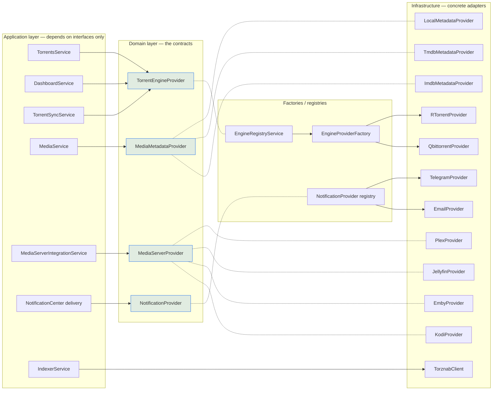
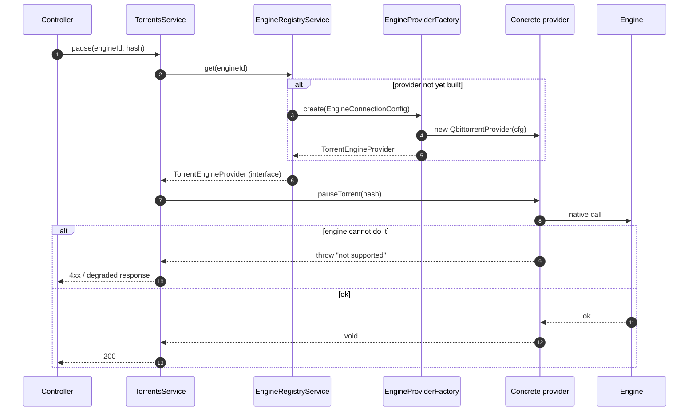

# Providers

## Overview

A **provider** is an interface in the domain layer that isolates an external service — a
torrent engine, a metadata source, a media server, a notifier, an indexer — from the
business logic that uses it. Application services depend on the interface. They never
import a vendor client.

**The rule of extension:** a new integration is a **new implementation of a provider
interface**, wired through a factory or registry. It must require **zero changes** to the
services that consume it.

## Purpose

- Keep the core stable while the integration surface grows.
- Make external services swappable and independently testable.
- Give the UI one shape to render regardless of which backend produced the data.

## When to use

Reach for a provider whenever the thing you are adding is **an external system with its
own protocol**. If it is a *capability* of UltraTorrent itself, you want a
[module](/develop/creating-modules) instead.

## Prerequisites

- [Architecture](/develop/architecture) — the Clean Architecture layers.
- A working dev environment ([Local setup](/develop/setup)).

## Concepts

### The provider interfaces

| Interface | Purpose | Implementations that ship |
| --- | --- | --- |
| `TorrentEngineProvider` | Control a BitTorrent engine | `RTorrentProvider` (XML-RPC/SCGI), `QbittorrentProvider` (Web API v2) |
| `MediaMetadataProvider` | Resolve a title → metadata | `LocalMetadataProvider`, `TmdbMetadataProvider`, `ImdbMetadataProvider` |
| `MediaServerProvider` | Probe a server, trigger a library refresh, read sessions | Plex, Jellyfin, Emby, Kodi |
| `NotificationProvider` | Deliver a message to a channel | email, SMS, Telegram, WhatsApp (+ webhook/Discord/Slack fan-out in the legacy notifications module) |
| `ArtworkProvider` | External id → downloadable artwork candidates | `TmdbArtworkProvider` |
| Indexer client (Torznab/Newznab) | Search indexers for release candidates | `TorznabClient` |
| `TvShowStatusProvider` | Resolve a show's airing status | TMDB → IMDb dataset → local, in confidence order |
| `LicenseProvider` | Decide whether a module is available | `CommunityLicenseProvider` (everything available) |

The full status table, including the planned seams (`SubtitleProvider`,
`StorageProvider`, `AuthenticationProvider`), is in `docs/ARCHITECTURE.md`.

### The capability model

Providers are not uniform. Plex can list sessions; Kodi cannot. qBittorrent can rename a
file inside a torrent; rTorrent cannot. Two distinct mechanisms express this:

**1. A declared capability set** — the provider answers "what can I do?" up front, so the
application can degrade gracefully and the UI can hide what isn't there:

```ts
// apps/backend/src/modules/media/media-server-provider.ts
/** What read capabilities a provider supports — analytics degrades gracefully. */
export interface MediaServerCapabilities {
  libraries: boolean;
  recentlyAdded: boolean;
  sessions: boolean;
  watchHistory: boolean;
  refresh: boolean;
}

export interface MediaServerProvider {
  readonly kind: MediaServerKind;
  capabilities(): MediaServerCapabilities;
  testConnection(cfg: MediaServerConfig): Promise<TestResult>;
  getServerInfo(cfg: MediaServerConfig): Promise<ServerInfo>;
  /** Throws {@link UnsupportedCapabilityError} when the provider can't list libraries. */
  getLibraries(cfg: MediaServerConfig): Promise<MediaServerLibrary[]>;
  /** Now-playing sessions. Throws {@link UnsupportedCapabilityError} where unsupported. */
  getSessions(cfg: MediaServerConfig): Promise<ProviderSession[]>;
  refreshLibrary(cfg: MediaServerConfig): Promise<void>;
}
```

**2. A typed error** — calling a capability the provider genuinely cannot serve is **not a
failure**, it is a fact about the provider. It throws a distinguishable error:

```ts
// apps/backend/src/modules/media/media-server-provider.ts
/** Thrown when a provider genuinely cannot serve a capability (not a failure). */
export class UnsupportedCapabilityError extends Error {
  constructor(
    public readonly capability: string,
    public readonly kind: string,
  ) {
    super(`${kind} does not support "${capability}".`);
    this.name = 'UnsupportedCapabilityError';
  }
}
```

Callers catch `UnsupportedCapabilityError` and skip that feature, rather than logging a
red error and alarming the operator. Contrast a *real* failure (the server is down, the
token is wrong) — that is an ordinary throw.

The Notification Center goes further and derives a `supports*()` method per capability
from a single `capabilities()` call, so a concrete provider implements almost nothing:

```ts
// apps/backend/src/modules/notification-center/notification-provider.ts
export abstract class BaseNotificationProvider implements NotificationProvider {
  abstract readonly kind: NotificationKind;
  abstract capabilities(): NotificationCapabilities;
  abstract validateRecipient(addr: NotificationAddress): boolean;
  abstract normalizeRecipient(addr: NotificationAddress): string | null;
  abstract send(config, addr, msg): Promise<SendResult>;
  abstract testConnection(config): Promise<HealthResult>;

  async connect(): Promise<void> {}
  async healthCheck(config) { return this.testConnection(config); }
  async sendBulk(config, addrs, msg) {
    return Promise.all(addrs.map((a) => this.send(config, a, msg)));
  }
  supportsRichCards() { return this.capabilities().richCards; }
  supportsMarkdown() { return this.capabilities().markdown; }
  // …one per capability
}
```

### Normalization — the golden rule

Map the vendor's representation into the shared `Normalized*` shapes
(`packages/shared/src/torrent.ts`) and **never let a vendor field escape the provider**.
Lowercase info-hashes, `progress` as `0..1`, rates in bytes/sec, ISO timestamps, mapped
`TorrentState`. That is the entire reason the UI does not care which engine is running.

## Provider architecture diagram



## Step-by-step: write a new torrent engine provider

This is the headline extension point. Because everything talks to engines **only** through
`TorrentEngineProvider`, adding Transmission or Deluge touches **two files** — and no
controllers, services, DTOs, or UI.

### 1. Implement the interface

Create `apps/backend/src/infrastructure/engine/<engine>/<engine>.provider.ts`:

```ts
import { EngineKind, NormalizedTorrent /* …all Normalized* + stats types… */ } from '@ultratorrent/shared';
import {
  EngineConnectionConfig,
  TorrentEngineProvider,
} from '../../../domain/engine/torrent-engine-provider.interface';

export class TransmissionProvider implements TorrentEngineProvider {
  readonly kind: EngineKind = 'transmission';
  readonly engineId: string;

  constructor(cfg: EngineConnectionConfig) {
    this.engineId = cfg.engineId;
    // build your transport/client from cfg (host/port/url/socketPath/baseUrl/…/timeoutMs)
  }

  async connect(): Promise<void> { /* … */ }
  async disconnect(): Promise<void> { /* … */ }
  async healthCheck(): Promise<EngineHealth> {
    // { online, latencyMs, version, error, checkedAt }
  }

  async listTorrents(): Promise<NormalizedTorrent[]> {
    // 1. call the engine's native API
    // 2. MAP each native record into a NormalizedTorrent:
    //    lowercase info-hash, progress 0..1, rates in bytes/sec,
    //    ISO timestamps, native status → TorrentState
  }

  // …implement every method on the interface…
}
```

The transport config you get is `EngineConnectionConfig`, which already carries both an
SCGI-style shape and an HTTP Web-API shape:

```ts
// apps/backend/src/domain/engine/torrent-engine-provider.interface.ts
export interface EngineConnectionConfig {
  kind: EngineKind;
  engineId: string;
  // rTorrent transport
  mode?: 'scgi-tcp' | 'scgi-unix' | 'http';
  host?: string;
  port?: number;
  socketPath?: string;
  url?: string;
  timeoutMs?: number;
  // qBittorrent Web API transport
  baseUrl?: string;
  username?: string;
  password?: string;
}
```

If your engine needs new transport details, **extend `EngineConnectionConfig` (domain) and
the `EngineConnectionDto`** — do not smuggle engine-specific fields through business logic.

### 2. Register it in the factory

```ts
// apps/backend/src/infrastructure/engine/engine-provider.factory.ts
@Injectable()
export class EngineProviderFactory {
  create(config: EngineConnectionConfig): TorrentEngineProvider {
    switch (config.kind) {
      case 'rtorrent':
        return new RTorrentProvider(config);
      case 'qbittorrent':
        return new QbittorrentProvider(config);
      case 'transmission':
      case 'deluge':
        throw new Error(
          `Engine "${config.kind}" is planned but not yet implemented`,
        );
      default:
        throw new Error(`Unknown engine kind: ${config.kind}`);
    }
  }
}
```

Replace the `throw` with your `case`. That is it. `EngineRegistryService` builds provider
instances from the stored `TorrentEngine` rows through this factory, and
`TorrentsService` / `DashboardService` / `TorrentSyncService` immediately work against the
new engine — they only ever saw the interface.

### 3. Handle secrets

If the engine authenticates with a password (as qBittorrent's Web API does), encrypt it at
rest. `apps/backend/src/modules/engine/engine-secrets.ts` provides
`encryptEngineConfig` / `decryptEngineConfig` / `hasEngineSecret`, which AES-256-GCM
encrypt the value under an `__encrypted` marker. `EngineService.create/update` encrypt on
write, the list endpoint returns a `hasPassword` flag rather than the password, and
`EngineRegistryService.reload` decrypts before building the provider.

### 4. Declare what you cannot do

If a capability genuinely does not exist in the engine, `throw` a clear error rather than
faking it — as `RTorrentProvider.renameFile` does. The application layer can then degrade
gracefully instead of silently doing the wrong thing.

### 5. Test the pure parts

Mapping functions are pure and have no I/O. That makes them the best-value unit tests in
the codebase — see the existing `qbittorrent.provider` and `rtorrent.provider` specs.

## Step-by-step: other provider kinds

### A metadata provider

Implement `MediaMetadataProvider` (`apps/backend/src/modules/media/metadata-provider.ts`):

```ts
export interface MediaMetadataProvider {
  readonly name: string;
  lookup(query: MediaLookup): Promise<MediaMetadata>;
  /** Rich enrichment used by MediaMetadataService. Null when nothing found. */
  fetchDetails(query: MediaLookup): Promise<MediaMetadataDetails | null>;
}
```

Two conventions to copy from `TmdbMetadataProvider`:

- **Fail soft.** Every network call is wrapped in a try/catch that returns `{}` or `null`.
  A metadata provider being down must never break a library scan.
- **Bound the call.** An `AbortController` with an 8-second timeout, cleared in `finally`.
- Return external IDs in the provider-agnostic map: `externalIds: { tmdb: '603', imdb: 'tt0133093' }`.

`LocalMetadataProvider` is the null-object implementation: it returns nothing, so the
renamer falls back to the parsed release name and the system works fully offline.

### A media-server provider

Implement `MediaServerProvider`. Declare `capabilities()` honestly, and throw
`UnsupportedCapabilityError('sessions', this.kind)` for what you cannot serve. Secrets
(tokens/keys/passwords) are AES-GCM encrypted at rest and redacted in API responses.

### A notification provider

Extend `BaseNotificationProvider`, implement the five abstract members, and add a factory
entry. The registry exposes `kind + capabilities + config schema` to the UI, so the channel
form renders itself from your declaration.

### An indexer

Indexers speak **Torznab/Newznab**, so in practice you configure a new indexer rather than
write code. `TorznabClient` negotiates capabilities via `t=caps` and parses the RSS/XML
response into normalized candidates:

```ts
// apps/backend/src/modules/indexers/torznab-client.ts
/** A normalized release candidate returned by an indexer search. */
export interface IndexerCandidate {
  indexerId: string;
  indexerName: string;
  title: string;
  /** magnet: (preferred) or an http(s) .torrent URL; null when neither is present. */
  downloadUrl: string | null;
  infoHash: string | null;
  sizeBytes: number | null;
  seeders: number | null;
  categories: number[];
}
```

See [Modules → Indexers](/modules/indexers).

## Sequence — a provider call end to end



## Troubleshooting

| Symptom | Cause | Fix |
| --- | --- | --- |
| `Engine "transmission" is planned but not yet implemented` | The factory has no `case` for that kind. | Implement the provider, add the `case`. |
| `Unknown engine kind: …` | The `kind` isn't in the `EngineKind` union. | Add it to `packages/shared/src/torrent.ts` and rebuild shared. |
| A provider's data renders wrong in the UI | A native field leaked upward, or the mapping is off (e.g. progress as `0..100` instead of `0..1`). | Fix the mapper. Never patch the UI to compensate. |
| A media-server feature is red-erroring in the logs | The code is throwing a generic `Error` instead of `UnsupportedCapabilityError`. | Throw the typed error; callers already handle it. |
| A magnet add "fails" but the torrent downloads fine | Confirming a magnet's load has a short window; the engine can take much longer to fetch metadata from DHT. `RTorrentProvider.confirmTorrentLoaded` treats a magnet timeout as *accepted/pending*, and only a `.torrent` file timeout as a hard failure. | Preserve that distinction in a new provider. |

## Tips

- **A provider owns its transport, its timeouts, and its retries.** Nothing above it should
  know the engine has an SCGI socket.
- **Confirm destructive operations.** `RTorrentProvider.removeTorrent` erases *and then
  verifies absence*, retrying, because the engine can accept the call and still leave the
  download loaded. A phantom "success" poisons the automation idempotency ledger.
- **Be honest about lossy mappings.** qBittorrent's per-torrent "priority" is a queue
  position, so `setTorrentPriority` maps only the extremes to top/bottom queue ops and
  `TorrentPriority` reports `NORMAL`. Document that; don't invent a fidelity you don't have.
- **SSRF.** Any provider that fetches a URL supplied by an external system must go through
  `fetchRemoteTorrent` / the `common/ssrf.ts` guard. Self-hosted indexers on private IPs
  need `SSRF_ALLOW_HOSTS`.

## FAQ

**Can I add a provider without touching the repo?**
Not today. The seam exists (`bootstrap.ts` accepts `externalModules`,
`ModuleRegistryService.registerExternal()` injects a manifest at runtime) but a published
third-party plugin system is future work.

**Where does the provider get its config?**
From a database row — `TorrentEngine`, `MediaServerIntegration`, a notification `Channel`,
an `Indexer` — with secrets decrypted at call time. Providers are stateless with respect to
config; it is passed in.

**Do providers run in the request path?**
Engine calls do (a pause is synchronous). Metadata, artwork and media-server work is
dispatched to the [processing queue](/develop/background-jobs) so a slow third party can
never time out an HTTP request.

## Checklist

- [ ] My provider implements the interface completely — no `// TODO` methods.
- [ ] Every native field is mapped to a `Normalized*` shape; none escape.
- [ ] Capabilities I cannot serve throw `UnsupportedCapabilityError` (or a clear "not
      supported" error for the engine seam), not a silent no-op.
- [ ] Timeouts are bounded; network failures fail soft where the caller expects it.
- [ ] Secrets are encrypted at rest and redacted in responses.
- [ ] The registry/factory has my entry.
- [ ] Pure mapping functions have unit tests.
- [ ] I changed **zero** consuming services.

## See also

- [Architecture](/develop/architecture)
- [Creating modules](/develop/creating-modules)
- [Modules → Engines](/modules/engines) · [Indexers](/modules/indexers) · [Notification Center](/modules/notification-center)
- [Testing](/develop/testing)
