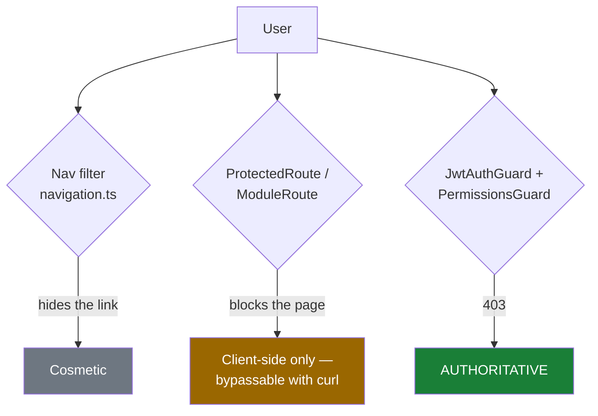

# RBAC

## Overview

Authorization in UltraTorrent is **RBAC-only**. Every feature ships in the product; an
administrator grants access with roles and permissions. There is no licensing, no edition,
no feature gating. The only access decision the server ever makes is:

> *does this principal hold the required permission?*

Permissions are **granular, dot-namespaced strings** (`domain.action`) defined once in
`packages/shared/src/permissions.ts` and consumed by both the backend guards and the
frontend capability checks.

## Purpose

Add a permission, guard a route, and understand exactly what does — and does not — count as
an access control.

## When to use

Every time you add a route. There are no unguarded mutating routes.

## Prerequisites

- [Authentication](/develop/authentication) — where the principal comes from.
- [Creating modules](/develop/creating-modules) — permissions are declared on the manifest.

## Concepts

### The catalogue

```ts
// packages/shared/src/permissions.ts
export const PERMISSIONS = {
  // Torrents
  TORRENTS_VIEW: 'torrents.view',
  TORRENTS_ADD: 'torrents.add',
  TORRENTS_DELETE: 'torrents.delete',
  TORRENTS_DELETE_DATA: 'torrents.delete_data',
  // …
} as const;

export type Permission = (typeof PERMISSIONS)[keyof typeof PERMISSIONS];
export const ALL_PERMISSIONS: Permission[] = Object.values(PERMISSIONS);
```

Because `Permission` is a union of the literal values, `@RequirePermissions('torrents.veiw')`
is a **compile error**. Never write the string by hand — always use the constant.

### The roles

```ts
export enum SystemRole {
  SUPER_ADMIN = 'SUPER_ADMIN',
  ADMINISTRATOR = 'ADMINISTRATOR',
  POWER_USER = 'POWER_USER',
  USER = 'USER',
  READ_ONLY = 'READ_ONLY',
}
```

Role sets are **explicit, not inherited** — each role enumerates what it holds, so you can
always read off precisely what it can do:

```ts
export const ROLE_PERMISSIONS: Record<SystemRole, Permission[]> = {
  [SystemRole.SUPER_ADMIN]: ALL_PERMISSIONS,
  [SystemRole.ADMINISTRATOR]: ALL_PERMISSIONS.filter(
    (p) => p !== PERMISSIONS.SYSTEM_MANAGE,
  ),
  [SystemRole.POWER_USER]: [ /* … */ ],
  [SystemRole.USER]: [ /* … */ ],
  [SystemRole.READ_ONLY]: [ /* … */ ],
};
```

`SUPER_ADMIN` is special: the guard short-circuits for it, so it implicitly holds
everything. `ADMINISTRATOR` is everything **except** `system.manage`.

The generated, always-current table lives at [Permissions reference](/reference/permissions).

### The guards

Two guards, always together:

```ts
@Controller('torrents')
@UseGuards(JwtAuthGuard, PermissionsGuard)
export class TorrentsController {
  @Get()
  @RequirePermissions(PERMISSIONS.TORRENTS_VIEW)
  list(/* … */) { /* … */ }
}
```

`JwtAuthGuard` authenticates (and honours `@Public()`). `PermissionsGuard` authorizes:

```ts
// apps/backend/src/modules/auth/guards/permissions.guard.ts
canActivate(context: ExecutionContext): boolean {
  const required = this.reflector.getAllAndOverride<Permission[]>(
    PERMISSIONS_KEY,
    [context.getHandler(), context.getClass()],
  );
  if (!required || required.length === 0) return true;

  const user = context.switchToHttp().getRequest().user as AuthenticatedUser;
  if (!user) throw new ForbiddenException('Not authenticated');

  // Super admins bypass granular checks.
  if (user.roles?.includes(SystemRole.SUPER_ADMIN)) return true;

  const held = new Set(user.permissions ?? []);
  const missing = required.filter((p) => !held.has(p));
  if (missing.length > 0) {
    throw new ForbiddenException(`Missing permission(s): ${missing.join(', ')}`);
  }
  return true;
}
```

Three things to notice:

1. **Multiple permissions are ANDed.** `@RequirePermissions(A, B)` requires *both*.
2. **A route with no `@RequirePermissions` is allowed to any authenticated user.** The guard
   returns `true` when the metadata is absent. If a route should be restricted, say so.
3. **The permission set comes from the JWT**, not from a database lookup per request. See
   the caveat below.

:::warning Permissions are cached in the access token
`JwtStrategy.validate()` builds the principal purely from the token's claims — there is **no
per-request DB read**. A role change (or a deactivated account) therefore does not take
effect until the user's **access token expires** (default TTL 15 minutes) and is refreshed.
Design around this: for an immediate revocation you must also revoke the refresh-token
family, which `AuthService.changePassword` does.
:::

### Where a permission is registered

A permission has to exist in three places before it can be granted:

| Place | What it does | Who writes it |
| --- | --- | --- |
| `PERMISSIONS` in `packages/shared/src/permissions.ts` | The typed constant guards use | You |
| `ROLE_PERMISSIONS` | Which built-in roles hold it | You |
| The `permissions` **table** | The row roles are mapped to | The **seed** (`ALL_PERMISSIONS`), *and* `ModulePermissionSyncService` at boot for anything declared on a module manifest |

`ModulePermissionSyncService` upserts the **row**; it never grants it. Granting is
`ROLE_PERMISSIONS` + the seed.

## Diagram — the authorization path

```mermaid
sequenceDiagram
    autonumber
    participant B as Browser
    participant T as ThrottlerGuard (global)
    participant J as JwtAuthGuard
    participant S as JwtStrategy
    participant P as PermissionsGuard
    participant C as Controller
    participant A as AuditService

    B->>T: DELETE /api/torrents/:hash (Bearer)
    T->>T: 120 req / 60s (5/min on login)
    T->>J: pass
    alt @Public() route
        J->>C: skip auth
    end
    J->>S: verify JWT (HS256, pinned; type must be "access")
    S-->>J: { id, username, roles[], permissions[] }  ← from CLAIMS, no DB read
    J->>P: request.user populated
    P->>P: read @RequirePermissions metadata
    alt no metadata
        P->>C: allow (authenticated is enough)
    else SUPER_ADMIN
        P->>C: bypass granular check
    else holds all required
        P->>C: allow
    else missing
        P-->>B: 403 "Missing permission(s): torrents.delete"
    end
    C->>A: record(action, objectType, objectId, result)
```

## Step-by-step: add a permission end to end

### 1. Define it

```ts
// packages/shared/src/permissions.ts
export const PERMISSIONS = {
  // …
  WIDGETS_VIEW: 'widgets.view',
  WIDGETS_MANAGE: 'widgets.manage',
} as const;
```

Naming: `domain.action`, snake_case within a segment (`torrents.delete_data`,
`settings.manage_root_path`). Sub-namespaces are fine
(`media_manager.imdb.import_dataset`).

### 2. Grant it to roles

```ts
export const ROLE_PERMISSIONS: Record<SystemRole, Permission[]> = {
  // SUPER_ADMIN / ADMINISTRATOR pick it up automatically (ALL_PERMISSIONS).
  [SystemRole.POWER_USER]: [
    // …
    PERMISSIONS.WIDGETS_VIEW,
    PERMISSIONS.WIDGETS_MANAGE,
  ],
  [SystemRole.USER]: [
    // …
    PERMISSIONS.WIDGETS_VIEW,
  ],
  [SystemRole.READ_ONLY]: [
    // …
    PERMISSIONS.WIDGETS_VIEW,
  ],
};
```

Be deliberate. `READ_ONLY` should never hold a mutating permission. `USER` should not hold
`.delete`.

### 3. Rebuild shared

```bash
npm run build --workspace @ultratorrent/shared
```

Otherwise the backend and frontend still see the old catalogue.

### 4. Declare it on the manifest

```ts
// apps/backend/src/modules/module-registry/manifests.ts
permissions: [P.WIDGETS_VIEW, P.WIDGETS_MANAGE],
```

This is what gets the row upserted at boot, and what the
[Modules reference](/reference/modules) documents.

### 5. Guard the route

```ts
@Delete(':id')
@RequirePermissions(PERMISSIONS.WIDGETS_MANAGE)
remove(@Param('id') id: string, @CurrentUser() user: AuthenticatedUser) {
  return this.widgets.remove(id, user?.id);
}
```

### 6. Re-seed

```bash
npm run prisma:seed
```

Idempotent: it upserts the permission rows, then **re-syncs** each role's grants
(`deleteMany` + `createMany`), so your new mapping actually lands on existing roles.

### 7. Gate the UI

```tsx
const { hasPermission } = useAuth();
// …
{hasPermission(PERMISSIONS.WIDGETS_MANAGE) && <Button onClick={…}>Delete</Button>}
```

Or the single-permission convenience hook:

```ts
// apps/frontend/src/auth/AuthContext.tsx
/** Convenience hook returning a single permission check. */
export function usePermission(perm: Permission | string): boolean {
  return useAuth().hasPermission(perm);
}
```

The check mirrors the server's, including the super-admin bypass:

```ts
const hasPermission = useCallback(
  (perm: Permission | string): boolean => {
    if (!user) return false;
    if (user.roles?.includes(SystemRole.SUPER_ADMIN)) return true;
    return user.permissions?.includes(perm) ?? false;
  },
  [user],
);
```

### 8. Gate the route and the nav entry

Add `permission` to the `<ProtectedRoute>` and to the `NavItem` in `navigation.ts`. Both are
convenience — the server still enforces.

### 9. Scope the realtime feed, if it has one

If your feature pushes WebSocket events, add its view permission to `SCOPED_PERMISSIONS` and
map the event prefix to a room in `RealtimeGateway.roomForEvent()`. Otherwise your events
land in the permission-free `authenticated` room and **everyone** gets them. See
[WebSockets](/develop/websockets).

## The three layers, and which one is authoritative



**Module enable/disable is not authorization.** A disabled module hides its nav entry and
its route — but its API routes still exist and are still governed by the permission guard.
Never rely on "the module is off" to keep someone out.

## Troubleshooting

| Symptom | Cause | Fix |
| --- | --- | --- |
| `403 Missing permission(s): widgets.manage` for a user who *has* the role | The role's grants are stale in the DB. | Re-run `npm run prisma:seed` — it re-syncs role→permission mappings. |
| A permission change doesn't take effect for a logged-in user | Permissions live in the access token; the principal is not re-read per request. | Wait for the access TTL (15m), or force a re-login. |
| A route is reachable by any logged-in user | It has no `@RequirePermissions`. The guard allows when the metadata is absent. | Add the decorator. |
| TypeScript rejects my permission string | `Permission` is a literal union. | Use the `PERMISSIONS.*` constant. |
| The UI shows a button that 403s | The UI check and the route guard use different permissions. | Make them match. The server is right; fix the UI. |
| A user receives WS events for a feature they can't read | The event isn't mapped to a `perm:` room. | Map it in `roomForEvent()`. |

## Tips

- **Split view from manage.** `x.view` and `x.manage` is the baseline. Add `x.delete` when
  deletion is genuinely more dangerous than editing (it usually is).
- **Audit anything you guard with a destructive permission.** `AuditService.record(...)` with
  actor, IP, user agent, and result.
- **Don't invent ad-hoc strings.** If it isn't in the catalogue, it isn't a permission.
- **`SUPER_ADMIN` bypasses everything.** That includes your new guard. Test with a lesser
  role, or you will never see your 403.

## FAQ

**Can I create custom roles?**
Yes — roles are DB rows built from the same catalogue, manageable under Administration →
Users → Roles (requires `roles.manage`). The five `SystemRole`s are the seeded baseline.

**Why is `files.manage` still there if there are granular file permissions?**
It's a legacy umbrella kept for back-compat (the media renamer still uses it). New code
should use the granular keys.

**Is there an OR (any-of) variant of `@RequirePermissions`?**
No. It is AND-only. If you need any-of semantics, check inside the service.

**How many permissions are there?**
See the generated [Permissions reference](/reference/permissions) — it is built from the
source at docs-build time, so it can never drift.

## Checklist

- [ ] Constant added to `PERMISSIONS`.
- [ ] Mapped into every appropriate `ROLE_PERMISSIONS` entry (and *not* into `READ_ONLY` if
      it mutates).
- [ ] `@ultratorrent/shared` rebuilt.
- [ ] Declared on the module manifest.
- [ ] Route guarded with `@UseGuards(JwtAuthGuard, PermissionsGuard)` + `@RequirePermissions`.
- [ ] Seed re-run.
- [ ] UI gated with `hasPermission` / `usePermission`.
- [ ] WS events (if any) mapped to a `perm:` room.
- [ ] Destructive action audited.
- [ ] Tested with a non-super-admin role.

## See also

- [Permissions reference](/reference/permissions) — the generated catalogue
- [Authentication](/develop/authentication) — where the principal comes from
- [Creating modules](/develop/creating-modules)
- [WebSockets](/develop/websockets) — permission-scoped rooms
- [Modules → Users](/modules/users) · [Audit](/modules/audit)
- [Operate → Security](/operate/security)
