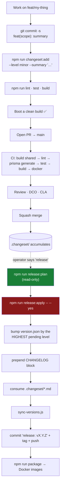

# Standards

## Overview

The conventions that get a change reviewed and merged: how the code should look, how the
commit should read, what a changeset is, and what happens when someone says *release*.

The authoritative sources in the repository are `docs/CONTRIBUTING.md`,
`docs/VERSIONING.md`, `docs/RELEASE_PROCESS.md`, and `docs/BUILD.md`. This page is the
contributor-facing distillation.

## Coding standards

From `docs/DEVELOPMENT.md`, and enforced in review:

- **Clean Architecture, enforced by imports.** The domain stays framework-free. Application
  services depend on domain interfaces, never on infrastructure. The UI and application code
  never reference an engine-specific type.
- **No business logic in controllers.** Controllers validate, authorize, and delegate. All
  real work lives in services.
- **Normalize provider data.** Providers translate native data into the `Normalized*` DTOs
  and never leak raw fields upward. An unsupported capability throws an explicit error.
- **Permissions from the catalogue.** Always `@RequirePermissions(PERMISSIONS.*)` using the
  shared constants — never an ad-hoc string.
- **Audit the dangerous stuff.** Any create / delete / state-change / security action records
  an audit entry.
- **Validate all input** with `class-validator` DTOs. Never trust a query or body value
  directly.
- **TypeScript strict mode** is on (`strict`, `noImplicitAny`,
  `noFallthroughCasesInSwitch`, …). Keep it warning-clean.
- **Shared first.** Types, permissions and event names that both API and UI need belong in
  `@ultratorrent/shared`, not duplicated.

Plus two that come from `docs/ARCHITECTURE.md` and from things that actually broke:

- **New integrations are providers or modules.** Not edits to core services.
- **Keep `ARCHITECTURE.md` current.** Any architectural change updates the relevant section
  **and** appends a dated row to its Change Log. That log is the institutional memory of this
  codebase and it is unusually good — read a few rows before you change anything subtle.

## Before you push

```bash
npm run lint      # ESLint, --max-warnings 0
npm run test      # Jest (backend) + Vitest (frontend)
npm run build     # shared → backend → frontend
```

:::caution There is no `typecheck` script
Grepping every `package.json` for `typecheck` / `type-check` / `tsc --noEmit` returns
nothing. Type checking happens **only** as a side-effect of `npm run build`. So `npm run
build` is not optional before you push.
:::

And the one that unit tests cannot do for you: **boot a clean build.** `tsc` and Jest do not
exercise NestJS DI or module wiring. A dev server running from a stale `dist/` will happily
keep serving the old code while your new module fails to resolve.

## Branches and commits

Branch off `main`: `<type>/<short-slug>` — `feat/`, `fix/`, `docs/`, `refactor/`, `test/`,
`chore/`. Rebase on `main`; don't merge `main` in.

**[Conventional Commits](https://www.conventionalcommits.org/):**

```text
<type>(<optional scope>): <short summary>

<optional body>

<optional footer>
```

| Part | Values |
| --- | --- |
| **Types** | `feat`, `fix`, `docs`, `refactor`, `test`, `chore`, `perf`, `build`, `ci` |
| **Scopes** | mirror workspaces/modules: `backend`, `frontend`, `shared`, `auth`, `torrents`, `engine`, `rtorrent`, `realtime`, `audit`, `prisma`, … |
| **Breaking** | a `BREAKING CHANGE:` footer, or `!` after the type — `feat(api)!: …` |

```bash
git commit -s -m "feat(engine): add Deluge provider"
```

**The `-s` is not optional** — every commit must carry a **DCO sign-off**. Fix an existing
branch with `git rebase --signoff main`.

A **CLA-Assistant** bot comments on your first PR. You sign once, by commenting:

> `I have read the CLA Document and I hereby sign the CLA`

## Changesets

Every change that should appear in a release ships with a **changeset**, committed alongside
the work it describes.

The flow is modelled on [Changesets](https://github.com/changesets/changesets) — the
`.changeset/*.md` convention — but driven by scripts in `ops/scripts/`, **not the Changesets
CLI**.

```bash
npm run changeset:add -- --level <patch|minor|major> --summary "<concise summary>"
# equivalently:
node ops/scripts/changeset-add.js --level <patch|minor|major> --summary "<…>"
```

This writes `.changeset/<level>-<id>.md`.

### The rubric

> **Fixed it → patch. Added to it → minor. Broke or wiped it → major.**

| Level | Meaning | Lands in CHANGELOG under |
| --- | --- | --- |
| `patch` | Nothing new, just fixed. Bug fix, perf fix, copy tweak. | **Fixed** |
| `minor` | New, backward-compatible capability. Existing data + config still work. | **Added** |
| `major` | Breaking / operator-impacting. A migration that drops or rewrites data, a config-incompatible change, an auth/permission overhaul. | **Changed** |

Day-to-day, almost everything is `minor` or `patch`. `major` is rare and deliberate.

## Versioning

`version.json` is the **single source of truth**. There is **one** canonical product version;
every workspace package (`@ultratorrent/shared`, `-backend`, `-frontend`) is a satellite kept
in lockstep — they are **not** versioned independently.

```bash
npm run version:show      # print product / community / sdk versions
npm run version:check     # CI gate: fail if any package.json or VERSION drifts
npm run version:sync      # rewrite VERSION files + every package.json from version.json
```

The running app exposes its version at `GET /api/system/version`.

## Releasing

:::warning Nothing auto-releases
A release is an explicit operator action, triggered by the operator saying **`release`**.
Merging a PR does **not** cut a release.
:::

```bash
npm run release:plan               # read-only — shows what WOULD happen, writes nothing
npm run release:apply -- --yes     # actually does it
```

`--yes` is a required accident guard: a bare `release:apply` prints its plan and stops.

`release:apply` then:

1. Bumps the root `package.json` by the **highest pending changeset level**.
2. Prepends a dated `## [X.Y.Z] - DATE` block to `CHANGELOG.md`, grouping entries by level.
3. Deletes the consumed `.changeset/*.md` files.
4. Runs `ops/scripts/sync-versions.js` to mirror the number everywhere.
5. Commits `release: vX.Y.Z`, tags `vX.Y.Z`, and pushes the branch + tag.

`--no-git` stops after the file changes. **There is no npm publish** — every package is
`private`; distribution is `git pull` + build. Docker packaging is a separate step:

```bash
npm run package        # builds the backend + frontend images, version/git stamped
```

## The release flow



## Pull requests

From `docs/CONTRIBUTING.md`:

- **Open an issue first** for anything non-trivial.
- `lint`, `test` and `build` must pass **locally** before you open the PR.
- PR against `main`.
- The description must include: **what & why**, the **linked issue** (`Closes #NNN`), how you
  **tested** it, **screenshots** for any UI change, and any **breaking changes / migration
  notes**.
- **One logical change per PR.**
- Address feedback with follow-up commits — the PR is **squashed on merge**.
- A maintainer merges once CI is green.
- New capabilities must be **modules with a manifest and RBAC-gated endpoints**. Shared
  types, permissions and event names belong in `@ultratorrent/shared`.

CI (`.github/workflows/core-ci.yml`, Node 22) runs:

```text
npm ci
npm run build --workspace @ultratorrent/shared
npm run lint --workspaces --if-present
npm run prisma:generate
npm test
npm run build
→ then a docker job builds both images
```

Note the order: **shared is built first**, and `prisma generate` runs before the tests —
because neither works without them.

## Troubleshooting

| Symptom | Cause | Fix |
| --- | --- | --- |
| The DCO check fails | A commit isn't signed off. | `git rebase --signoff main`, force-push. |
| The CLA bot blocks the PR | First-time contributor. | Comment the exact sign-off line. |
| `version:check` fails in CI | A `package.json` or `VERSION` drifted from `version.json`. | `npm run version:sync`. |
| `release:apply` did nothing | You omitted `--yes`. | That's the guard working. |
| The release picked the wrong bump | It takes the **highest pending level** across all changesets. | Check `.changeset/` before releasing. |
| CI passes but the app won't start | Nothing in CI boots the app. | Boot a clean build yourself. This is the single biggest gap in the pipeline. |

## Tips

- **One logical change per PR**, and one changeset with it. A PR with no changeset produces
  a release with no changelog entry, which is how a fix silently ships and nobody knows.
- **Write the changeset summary for the release notes**, not for yourself. It ends up in
  `CHANGELOG.md` verbatim.
- **Explain *why* in the commit body.** The `ARCHITECTURE.md` Change Log rows in this repo
  are exemplary: they say what broke, how it was diagnosed, what the fix is, and what was
  deliberately *not* done. Aim there.
- **Note what you deliberately didn't do.** "Deliberately not added: prefix matching — that's
  exactly what would let a spin-off hijack the parent show." That sentence saves the next
  person a week.

## Known documentation inconsistencies

:::caution Two conflicts in the repo docs
1. `docs/CONTRIBUTING.md` says the default branch is `main` (it is), but `docs/VERSIONING.md`
   §5 says the release step runs on `master`. A stale local `master` may exist. **`main` is
   correct.**
2. CONTRIBUTING tells contributors to hand-write a `CHANGELOG.md` entry under **Unreleased**,
   while RELEASE_PROCESS says `release:apply` **generates** the CHANGELOG from changesets.
   These two flows overlap and are not reconciled. **Author a changeset** — that is the flow
   the tooling actually implements.
:::

## FAQ

**Do I need a changeset for a docs-only change?**
If it should appear in the release notes, yes. A typo fix in a comment, no.

**What if my change is both a fix and a feature?**
Two changesets, or split the PR. The release takes the highest level anyway, but the
CHANGELOG should say both things.

**Where does the version badge in the UI come from?**
`GET /api/system/version`, which resolves the version and the git SHA from a baked-in
`build-info.json` (or build args). Git hooks refresh it on pull/checkout/commit, so even a
bare `docker compose build` carries the commit.

**Is the project accepting contributions?**
Yes — AGPL-3.0-or-later, developed in the open. Sign the CLA on your first PR.

## Checklist

- [ ] Branch is `<type>/<slug>` off `main`, rebased (not merged).
- [ ] Commits are Conventional and **signed off** (`-s`).
- [ ] A changeset exists, at the right level, with a release-notes-quality summary.
- [ ] `npm run lint` clean (`--max-warnings 0`).
- [ ] `npm run test` green — including the i18n parity test.
- [ ] `npm run build` clean (this is your only typecheck).
- [ ] **A clean build boots.**
- [ ] `docs/ARCHITECTURE.md` updated + a dated Change Log row, if the change is architectural.
- [ ] PR describes what, why, the linked issue, testing, screenshots, breaking changes.
- [ ] One logical change.

## See also

- [Testing](/develop/testing)
- [Architecture](/develop/architecture) — and `docs/ARCHITECTURE.md`, the ground truth
- [Creating modules](/develop/creating-modules)
- [i18n](/develop/i18n) — the parity gate
- [Develop → overview](/develop/)
