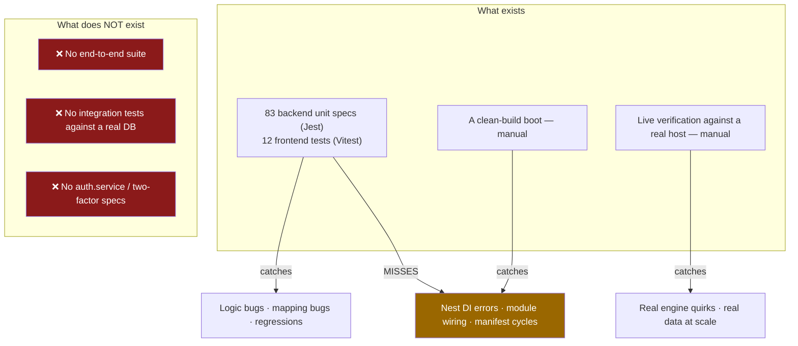

# Testing

## Overview

- **Backend** — Jest with `ts-jest`. 83 `*.spec.ts` files.
- **Frontend** — Vitest with jsdom + Testing Library. 12 test files.

Both run from the root: `npm run test` (which runs `test` in every workspace that defines
it).

## Purpose

Cover the logic that will actually break — parsers, mappers, guards, engines — without
pretending unit tests catch things they cannot.

## When to use

Every non-trivial change. And note the corollary from `docs/DEVELOPMENT.md` and hard
experience: **`tsc` clean plus green unit tests does not mean it boots.** Neither exercises
NestJS DI or module wiring. Boot a clean build too.

## Prerequisites

- [Local setup](/develop/setup).

## Concepts

### Backend — Jest

There is **no `jest.config.*`**. The config is inline in
`apps/backend/package.json`:

```json
"jest": {
  "moduleFileExtensions": ["js", "json", "ts"],
  "rootDir": "src",
  "testRegex": ".*\\.spec\\.ts$",
  "transform": { "^.+\\.(t|j)s$": "ts-jest" },
  "collectCoverageFrom": ["**/*.(t|j)s"],
  "coverageDirectory": "../coverage",
  "testEnvironment": "node",
  "moduleNameMapper": {
    "^@ultratorrent/shared$": "<rootDir>/../../../packages/shared/src/index.ts",
    "^(\\.{1,2}/.*)\\.js$": "$1"
  }
}
```

The important line is the mapper: `@ultratorrent/shared` resolves to **source**
(`packages/shared/src/index.ts`), **not** `dist`. So backend unit tests see live shared
types without a prior build — unlike the running dev server, which needs the built package.

```bash
npm run test --workspace @ultratorrent/backend          # run once
npm run test:watch --workspace @ultratorrent/backend    # watch mode
npm run test:cov --workspace @ultratorrent/backend      # coverage
```

Tests are `*.spec.ts`, colocated with the code they test.

### Stubbing Prisma

:::info There is no in-memory Prisma
No `jest-mock-extended`, no `__mocks__` directory, no shared `createMockPrisma` helper. The
house pattern is a **hand-rolled plain object of `jest.fn()`s**, cast, and passed straight to
the service constructor. Services are instantiated directly — not through
`Test.createTestingModule`.
:::

```ts
// apps/backend/src/modules/media/imdb/imdb-trigram-index.service.spec.ts
function build(state: Record<string, 'valid' | 'invalid' | 'missing'> = {}) {
  const executed: string[] = [];
  const prisma = {
    $executeRawUnsafe: jest.fn(async (sql: string) => {
      executed.push(sql);
      return 0;
    }),
    $queryRawUnsafe: jest.fn(async (_sql: string, name: string, valid: boolean) => {
      const s = state[name] ?? 'missing';
      const hit = valid ? s === 'valid' : s === 'invalid';
      return [{ n: BigInt(hit ? 1 : 0) }];
    }),
  };
  const svc = new ImdbTrigramIndexService(prisma as any);
  return { svc, prisma, executed };
}

describe('ImdbTrigramIndexService', () => {
  it('builds every missing index CONCURRENTLY (never inside a transaction)', async () => {
    const { svc, executed } = build();
    await svc.ensureIndexes();

    expect(executed[0]).toMatch(/CREATE EXTENSION IF NOT EXISTS pg_trgm/);
    for (const name of ALL) {
      const stmt = executed.find((s) => s.includes(name) && s.includes('CREATE INDEX'));
      expect(stmt).toMatch(/CREATE INDEX CONCURRENTLY IF NOT EXISTS/);
      expect(stmt).toMatch(/USING gin \(".+" gin_trgm_ops\)/);
    }
  });
});
```

For model delegates, the same idea with nested objects:

```ts
// apps/backend/src/modules/users/users-roles.spec.ts
const prisma = {
  role: { findMany: jest.fn(/* … */) },
  user: { findUnique: jest.fn(/* … */) },
  userRole: { deleteMany: jest.fn(/* … */) },
};
```

42 of the 83 backend specs stub Prisma this way. It is verbose but it is honest: the test
declares exactly which queries the code is allowed to make. Notice how the spec above asserts
on the **SQL text** — that test exists to stop someone quietly reintroducing a blocking
`CREATE INDEX`. That is what a good test in this codebase looks like: it pins the property
that mattered.

### What to test

The highest-value targets are **pure functions with no I/O**:

| Target | Why |
| --- | --- |
| The release-name parser (`parseTorrentName`) | It has broken repeatedly on real-world names — acronyms (`L.A.'s Finest`), bare years before an episode marker (`Hijack.2023.S02E03`), season packs. Every fix ships with a spec. |
| Provider mappers | Native state → `TorrentState`, file priorities, ETA sentinels. Pure, and a wrong mapping is invisible until production. |
| The XML-RPC codec (`buildMethodCall` / `parseMethodResponse`) and the bencode info-hash reader | Pure, protocol-critical. |
| `PermissionsGuard` | Authorization. Obviously. |
| The match engine | The difference between "9-1-1" and "9-1-1 Lone Star" is a spec. |
| The rename engine | It can destroy files. It has. There are 35 specs. |
| Idempotency ledgers, reconciliation, backfills | The behaviour is "runs at most once, retries on failure" — only a test pins that. |

### Frontend — Vitest

**No `vitest.config.ts`** — the config lives in the `test` block of
`apps/frontend/vite.config.ts` (which imports `defineConfig` from `vitest/config`):

```ts
test: {
  globals: true,
  environment: 'jsdom',
  setupFiles: ['./src/test/setup.ts'],
  css: false,
  include: ['src/**/*.{test,spec}.{ts,tsx}'],
}
```

```bash
npm run test --workspace @ultratorrent/frontend        # vitest run
npm run test:watch --workspace @ultratorrent/frontend  # vitest
```

`src/test/setup.ts` imports `@testing-library/jest-dom/vitest`, initializes i18n **once** (so
components render real en-US strings without a provider wrapper), and calls `cleanup()` in
`afterEach`.

Component tests use `@testing-library/react`:

```tsx
// apps/frontend/src/components/layout/CommandPalette.test.tsx — the shape
render(<CommandPalette open entries={entries} onSelect={onSelect} />);
fireEvent.change(screen.getByRole('textbox'), { target: { value: 'torr' } });
expect(screen.getByText('Torrents')).toBeInTheDocument();
```

Pure-logic tests build a fake context and assert on the function — `navigation.test.ts`
constructs a `NavVisibilityCtx` and asserts on `visibleGroups()`, which is how permission and
module filtering is covered without rendering anything.

Two frontend tests you get **for free** and must not break:

- **`i18n.test.ts`** — en-US/es-PR key parity for every namespace, plus nav-label coverage.
  See [i18n](/develop/i18n).
- **`navigation.test.ts`** — every nav entry resolves.

## The testing pyramid, as it actually stands



## Step-by-step: write a backend test

1. Colocate `my-thing.spec.ts` next to `my-thing.ts`.
2. **Extract the pure logic first.** If your function needs a `PrismaService` to compute
   something that is really just a transformation, pull the transformation out into an
   exported pure function and test *that*. Several real fixes in this repo did exactly this —
   `parseItemIdentity`, `mergeExternalIds`, `catalogueTitleKey`, `collapseActivity`,
   `isRenderedPathSafe` were all extracted precisely so they could be tested.
3. Build a stub object of `jest.fn()`s for whatever the constructor needs; `as any` it.
4. Instantiate the service directly.
5. Assert on **behaviour**, and where it matters, on the exact call made (the SQL, the Prisma
   method — `updateMany` not `update`).
6. Add a regression test **named after the bug**. The repo is full of them, and they are the
   tests that keep paying.

## Troubleshooting

| Symptom | Cause | Fix |
| --- | --- | --- |
| `Cannot find module '@ultratorrent/shared'` in a backend test | The `moduleNameMapper` path is relative to `rootDir: src`. | Don't move the spec outside `src`. |
| A test passes but the app crashes on boot | Unit tests don't exercise DI or module wiring. | Boot a clean build. Always. |
| A frontend test can't find text | i18n renders real en-US strings — assert the English string, not the key. | Check the actual locale JSON. |
| `i18n.test.ts` fails after you add a string | You added it to en-US but not es-PR (or vice versa). | Add both. |
| A Prisma stub throws "not a function" | The code calls a delegate your stub doesn't declare. | Add it — and notice that the test just told you the code makes a query you didn't expect. |
| Coverage looks great, production breaks | The gaps below. | Read them. |

## Known coverage gaps

:::caution These are real, verified gaps
- **Authentication is untested.** The only spec under `modules/auth/` is
  `guards/permissions.guard.spec.ts`. There is **no `auth.service.spec.ts`** and **no
  `two-factor.service.spec.ts`** — **refresh-token rotation and reuse detection have no test
  coverage at all**. If you are looking for a high-value first contribution, this is it.
- **There is no end-to-end suite** and **no integration test against a real database.** Every
  backend test is a unit test against a stubbed Prisma.
- **rTorrent has not been verified live** across all paths; several engine behaviours were
  found only by running against a real host.
:::

## Tips

- **Test the bug, not the fix.** Name the spec after the thing that broke. `"9-1-1 vs Lone
  Star"`, `"a vanished wanted row no longer aborts the tick"`. Six months later that name is
  the only documentation of why the code is shaped that way.
- **Pin the property that mattered.** The trigram spec asserts the SQL says `CONCURRENTLY`.
  That's not testing an implementation detail — that's testing the thing that caused an
  outage.
- **A stub that's annoying to write is telling you something.** If you need to mock fifteen
  Prisma delegates, the service is doing too much.
- **Lint before you push**: `npm run lint` (ESLint, `--max-warnings 0`).

## FAQ

**Is there a typecheck command?**
:::caution No
Grepping every `package.json` for `typecheck` / `type-check` / `tsc --noEmit` returns
nothing. Type checking happens only as a side-effect of `npm run build`. CI runs: build
shared → lint → `prisma generate` → `npm test` → `npm run build`.
:::

**How do I run one test?**
`npx jest path/to/file.spec.ts` in `apps/backend`, or `npx vitest run path/to/file.test.ts`
in `apps/frontend`.

**Do backend tests need the shared package built?**
No — Jest maps it to source. The dev **server** does need it built.

**Should I use `Test.createTestingModule`?**
Nothing in the repo does. Direct instantiation with stubs is the convention, and it's faster.

## Checklist

- [ ] Pure logic extracted and tested directly.
- [ ] Prisma stubbed with plain `jest.fn()`s; only the delegates actually used.
- [ ] A regression test named after the bug I fixed.
- [ ] Where it matters, I assert the exact call made (`updateMany`, not `update`).
- [ ] Frontend: i18n parity still green.
- [ ] `npm run lint` clean (`--max-warnings 0`).
- [ ] `npm run build` clean.
- [ ] **A clean build actually boots.**

## See also

- [Local setup](/develop/setup)
- [Standards](/develop/standards) — lint, commits, CI
- [i18n](/develop/i18n) — the parity test
- [Providers](/develop/providers) — mapper tests are the best value here
- [Background jobs](/develop/background-jobs) — idempotency is only real if a test pins it
