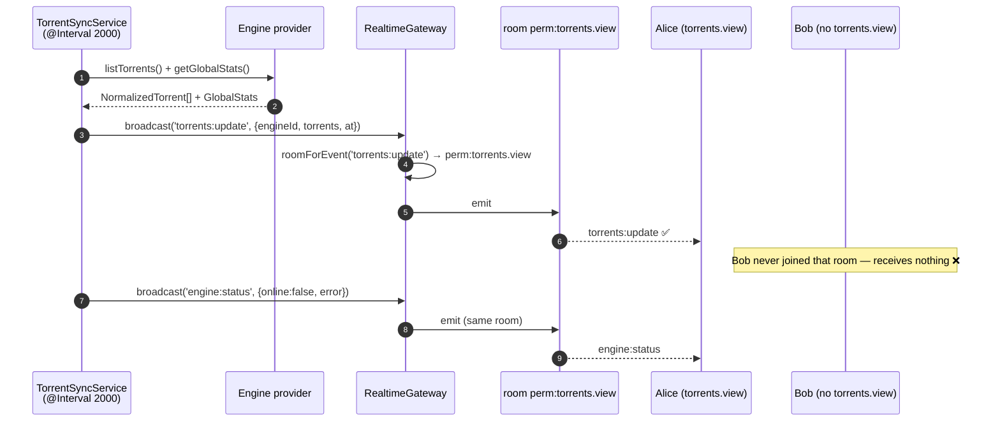
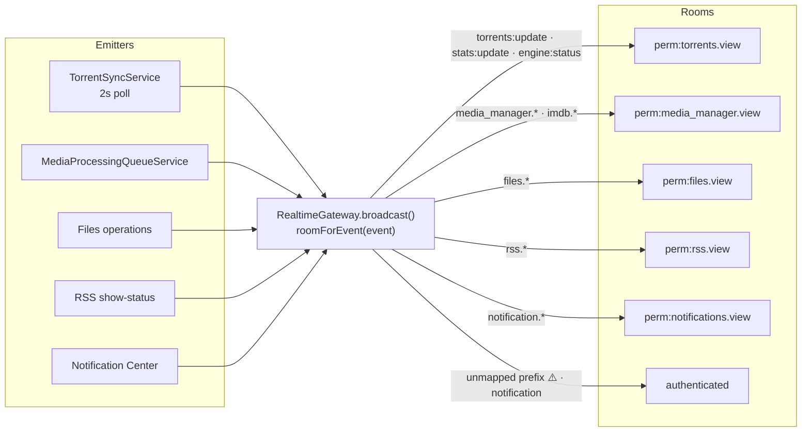

# WebSockets

## Overview

`RealtimeGateway` is a Socket.IO gateway mounted at **`/ws`**. Clients authenticate with a
JWT in the handshake, and each socket joins only the **permission-scoped rooms** it is
entitled to. Events are emitted to a room, never broadcast blindly — so a user can never
receive live data they could not read over REST.

## Purpose

Push state changes to the UI without polling: torrent lists, transfer stats, engine health,
file operations, media-job progress, IMDb imports, RSS show-status, notification delivery.

## When to use

Emit a WS event when **state changed and someone is probably looking at it**. Do not use
WebSockets for request/response — that's what the REST API is for.

## Prerequisites

- [RBAC](/develop/rbac) — the rooms *are* permissions.
- [Authentication](/develop/authentication) — the handshake token is an access JWT.

## Concepts

### The handshake

```ts
// apps/backend/src/modules/realtime/realtime.gateway.ts
@WebSocketGateway({
  cors: { origin: true, credentials: true },
  path: '/ws',
})
export class RealtimeGateway implements OnGatewayInit, OnGatewayConnection {
  async handleConnection(client: Socket): Promise<void> {
    try {
      const token =
        (client.handshake.auth?.token as string) ??
        (client.handshake.query?.token as string);
      const payload = await this.jwt.verifyAsync(token, {
        secret: this.config.get<string>('jwt.accessSecret'),
        algorithms: ['HS256'],
      });
      client.data.userId = payload.sub;
      client.join('authenticated');
      client.join(`user:${payload.sub}`);

      // Join only the feeds the user is permitted to read (SUPER_ADMIN: all).
      const held = new Set<string>(payload.permissions ?? []);
      const isSuper = (payload.roles ?? []).includes(SystemRole.SUPER_ADMIN);
      for (const perm of SCOPED_PERMISSIONS) {
        if (isSuper || held.has(perm)) client.join(`perm:${perm}`);
      }
    } catch {
      client.disconnect(true);
    }
  }
}
```

An invalid, expired or missing token means an immediate `disconnect(true)`. There is no
anonymous socket.

### The rooms

Every socket joins:

| Room | Contents |
| --- | --- |
| `authenticated` | Every authenticated socket. Permission-free events land here. |
| `user:<id>` | That user alone. Used by `toUser()`. |
| `perm:<key>` | One per **held** view permission, from `SCOPED_PERMISSIONS`. |

```ts
const SCOPED_PERMISSIONS = [
  PERMISSIONS.TORRENTS_VIEW,
  PERMISSIONS.FILES_VIEW,
  PERMISSIONS.MEDIA_MANAGER_VIEW,
  PERMISSIONS.MEDIA_ACQUISITION_VIEW,
  PERMISSIONS.MEDIA_SERVER_ANALYTICS_VIEW,
  PERMISSIONS.RSS_VIEW,
  PERMISSIONS.NOTIFICATIONS_VIEW,
];
```

### Event → room mapping

The gateway routes by **event-name prefix**. This is the whole authorization model for
realtime, and it is worth reading closely:

```ts
// apps/backend/src/modules/realtime/realtime.gateway.ts
/** Room an event is confined to, by the permission required to read it. */
private roomForEvent(event: string): string {
  if (
    event === WS_EVENTS.TORRENTS_UPDATE ||
    event === WS_EVENTS.STATS_UPDATE ||
    event === WS_EVENTS.ENGINE_STATUS
  ) {
    return `perm:${PERMISSIONS.TORRENTS_VIEW}`;
  }
  if (event.startsWith('files.')) return `perm:${PERMISSIONS.FILES_VIEW}`;
  if (event.startsWith('media_manager.') || event.startsWith('imdb.')) {
    return `perm:${PERMISSIONS.MEDIA_MANAGER_VIEW}`;
  }
  if (event.startsWith('media_acquisition.')) {
    return `perm:${PERMISSIONS.MEDIA_ACQUISITION_VIEW}`;
  }
  if (event.startsWith('media_server.')) {
    return `perm:${PERMISSIONS.MEDIA_SERVER_ANALYTICS_VIEW}`;
  }
  if (event.startsWith('rss.')) {
    return `perm:${PERMISSIONS.RSS_VIEW}`;
  }
  // Notification Center realtime (delivery/queue/provider) — `notification.*`.
  // The legacy in-app `notification` event (no dot) stays permission-free below.
  if (event.startsWith('notification.')) {
    return `perm:${PERMISSIONS.NOTIFICATIONS_VIEW}`;
  }
  // Permission-free events (e.g. in-app `notification`) go to all authenticated sockets.
  return 'authenticated';
}
```

:::danger An unmapped event prefix is a data leak
The default branch returns `'authenticated'` — **every logged-in socket**. If you invent a
`widgets.*` event and forget to map it, every user receives it regardless of whether they
hold `widgets.view`. Adding the prefix to `roomForEvent()` is not optional.
:::

Note the deliberate distinction: `notification` (no dot) is the permission-free in-app
toast; `notification.*` (dotted) is Notification Center delivery telemetry and is scoped.

### The event catalogue

Event names are declared once, in `packages/shared/src/events.ts`, and consumed by both
sides:

```ts
export const WS_EVENTS = {
  TORRENTS_UPDATE: 'torrents:update',
  TORRENT_UPDATE: 'torrent:update',
  STATS_UPDATE: 'stats:update',
  NOTIFICATION: 'notification',
  ENGINE_STATUS: 'engine:status',
  SYSTEM_HEALTH: 'system:health',
  FILES_OP_STARTED: 'files.operation.started',
  FILES_OP_PROGRESS: 'files.operation.progress',
  FILES_OP_COMPLETED: 'files.operation.completed',
  FILES_OP_FAILED: 'files.operation.failed',
  FILES_CLEANUP_COMPLETED: 'files.cleanup.completed',
  FILES_TRASH_UPDATED: 'files.trash.updated',
  // Media Manager job progress (scoped to media_manager.view).
  MEDIA_JOB_STARTED: 'media_manager.job.started',
  MEDIA_JOB_PROGRESS: 'media_manager.job.progress',
  MEDIA_JOB_COMPLETED: 'media_manager.job.completed',
  MEDIA_JOB_FAILED: 'media_manager.job.failed',
  // …IMDb dataset events, RSS show-status events, Notification Center events
} as const;
```

| Prefix | Room | Emitted by |
| --- | --- | --- |
| `torrents:update`, `stats:update`, `engine:status` | `perm:torrents.view` | `TorrentSyncService` (every 2s) |
| `files.*` | `perm:files.view` | The file manager's long operations |
| `media_manager.job.*` | `perm:media_manager.view` | `MediaProcessingQueueService` |
| `imdb.*` | `perm:media_manager.view` | The IMDb dataset validate/download/import pipeline |
| `media_acquisition.*` | `perm:media_acquisition.view` | The acquisition sweeps |
| `media_server.*` | `perm:media_server_analytics.view` | Session polling, sync, newsletters, imports |
| `rss.*` | `perm:rss.view` | Show-status lookup and refresh |
| `notification.*` | `perm:notifications.view` | Notification Center delivery |
| `notification` (no dot) | `authenticated` | In-app toasts |

Two distinct things share the word "event", and confusing them will cost you an afternoon:

- **`WS_EVENTS`** — what goes over the socket to browsers.
- **`NOTIFICATION_EVENTS`** — internal **domain events** published on the
  `@nestjs/event-emitter` bus under `NOTIFICATION_BUS_CHANNEL`, which the Notification
  Center subscribes to and evaluates rules against. *Not WebSocket events.*

### Emitting

```ts
// The gateway's three exits
broadcast(event: string, payload: unknown): void {
  this.server?.to(this.roomForEvent(event)).emit(event, payload);
}

toUser(userId: string, event: string, payload: unknown): void {
  this.server?.to(`user:${userId}`).emit(event, payload);
}
```

`RealtimeModule` is `@Global()`, so inject `RealtimeGateway` anywhere and call
`broadcast(...)`. Payload types live in `packages/shared/src/events.ts`
(`TorrentsUpdatePayload`, `MediaJobEventPayload`, `EngineStatusPayload`, …).

## Diagram — an event's journey





## The frontend

**Client:** `apps/frontend/src/lib/ws.ts` — a `WsClient` class and an exported `wsClient`
singleton.
**React layer:** `apps/frontend/src/realtime/RealtimeContext.tsx` — `RealtimeProvider`, plus
`useRealtime()` and `useTorrentStream()`.

```ts
// apps/frontend/src/lib/ws.ts
connect(): void {
  const token = getAccessToken();
  if (!token) return;
  if (this.socket?.connected) return;

  // Tear down any stale socket before reconnecting with a fresh token.
  this.socket?.removeAllListeners();
  this.socket?.disconnect();

  this.setStatus('connecting');

  this.socket = io(WS_URL, {
    path: '/ws',
    transports: ['websocket'],
    auth: { token },
    reconnection: true,
    reconnectionDelay: 1000,
    reconnectionDelayMax: 8000,
  });

  this.socket.on('connect', () => this.setStatus('connected'));
  this.socket.on('disconnect', () => this.setStatus('disconnected'));
  this.socket.on('connect_error', () => this.setStatus('disconnected'));

  // Re-bind every registered consumer handler to the freshly-created socket.
  this.attachHandlers();
}
```

The key design point: **handlers live in a durable `Map<string, Set<Handler>>`, not on the
live socket.** A subscription survives `reauthenticate()` and every reconnect. `wsClient.on()`
returns an unsubscribe closure.

Lifecycle is driven from `AuthContext`: `connect()` after login/`me()`, `disconnect()` on
logout, `reauthenticate()` when the API layer rotates tokens.

Components subscribe through a hook with automatic cleanup:

```ts
// apps/frontend/src/realtime/RealtimeContext.tsx
/** Subscribe to live torrent snapshots with automatic cleanup. */
export function useTorrentStream(listener: (torrents: NormalizedTorrent[]) => void): void {
  const { subscribeTorrents } = useRealtime();
  const ref = useRef(listener);
  ref.current = listener;
  useEffect(() => {
    return subscribeTorrents((torrents) => ref.current(torrents));
  }, [subscribeTorrents]);
}
```

Event names and payloads are typed by `WsEventMap` in `ws.ts`, keyed off `WS_EVENTS` from
the shared package.

In dev, Vite proxies `/ws` to `http://localhost:4000` with `ws: true`.

## Step-by-step: add a new realtime event

1. **Name it** in `packages/shared/src/events.ts` under `WS_EVENTS`, using an existing
   prefix if you can (`media_manager.*`, `rss.*`, …). Add its payload interface.
2. **Rebuild shared.**
3. **Map the prefix** in `RealtimeGateway.roomForEvent()` — *unless* you are reusing a
   prefix that is already mapped. If your feature needs a new view permission, add it to
   `SCOPED_PERMISSIONS` too.
4. **Declare it** on your module's manifest under `websocketEvents`. This is what the
   [Modules reference](/reference/modules) documents.
5. **Emit it**: inject `RealtimeGateway` (it's global) and call
   `this.realtime.broadcast(WS_EVENTS.MY_EVENT, payload)`.
6. **Type it** on the frontend in `WsEventMap` (`apps/frontend/src/lib/ws.ts`).
7. **Subscribe**: `wsClient.on('my.event', handler)` — or add a convenience hook alongside
   `useTorrentStream` if a page will use it a lot.

## Troubleshooting

| Symptom | Cause | Fix |
| --- | --- | --- |
| Socket connects then immediately disconnects | The handshake JWT failed to verify. `handleConnection` catches and calls `disconnect(true)`. | Log in; check the token isn't expired; check `JWT_ACCESS_SECRET` matches what signed it. |
| Nothing arrives, but the socket is connected | The user isn't in the event's room. | Check they hold the view permission; check `roomForEvent()` maps your prefix. |
| A user sees events they shouldn't | Your event prefix isn't mapped — the default is `'authenticated'`. | Map it. This is a leak, not a cosmetic bug. |
| Subscriptions die after a token refresh | You attached a handler to the raw socket instead of via `wsClient.on()`. | Use `wsClient.on()` — handlers are re-bound on reconnect. |
| Events fire but the UI doesn't update | You mutated state outside React, or the query cache wasn't invalidated. | Update state in the handler, or `queryClient.invalidateQueries`. |
| Duplicate events after reconnecting | The handler was registered more than once. | Return the unsubscribe closure from `useEffect`. |

## Tips

- **The torrent feed is a 2-second firehose.** `TorrentSyncService` emits the whole
  normalized list every tick, per engine. Don't add per-torrent chatter on top of it.
- **Never put a secret in a payload.** `ImdbEventPayload`'s doc comment says it explicitly:
  *"Never carries secrets."* Hold that line for every payload you add.
- **Prefer an existing prefix.** A new prefix means a new mapping, a new permission, and a
  new way to leak. Reuse `media_manager.*` if the event is a media-manager event.
- **`toUser()` exists.** Use it for something genuinely per-user (a personal notification)
  rather than broadcasting and filtering client-side.

## FAQ

**Is there a subscribe/unsubscribe protocol?**
No. Room membership is decided **once at connect** from the JWT's claims. There are no
client-initiated subscription messages.

**What happens to room membership when a user's permissions change?**
Nothing, until they reconnect with a fresh token — the rooms were joined from the old
token's claims. Same staleness window as [RBAC](/develop/rbac).

**Can I emit from a scheduler?**
Yes — `TorrentSyncService` and `MediaProcessingQueueService` both do.
`RealtimeModule` is `@Global()`.

**Does the gateway do request/response?**
No `@SubscribeMessage` handlers exist. It is push-only.

## Checklist

- [ ] Event name added to `WS_EVENTS` in `packages/shared/src/events.ts`.
- [ ] Payload interface added and **contains no secrets**.
- [ ] Prefix mapped in `roomForEvent()` — or an already-mapped prefix reused.
- [ ] New view permission (if any) added to `SCOPED_PERMISSIONS`.
- [ ] Declared in the module manifest's `websocketEvents`.
- [ ] Typed in the frontend `WsEventMap`.
- [ ] Subscribed via `wsClient.on()` / a hook, with cleanup.
- [ ] Verified a user *without* the permission receives nothing.

## See also

- [RBAC](/develop/rbac) — the rooms are permissions
- [Background jobs](/develop/background-jobs) — the queue streams its progress over WS
- [Architecture](/develop/architecture)
- [API reference](/reference/api)
- [Modules reference](/reference/modules) — declared `websocketEvents` per module
