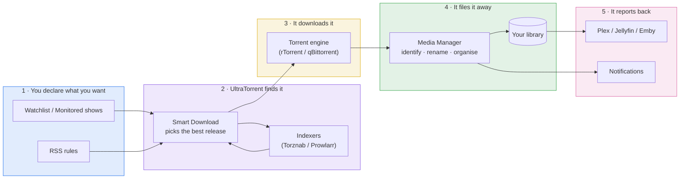

# UltraTorrent Documentation

**UltraTorrent** is a self-hosted **media acquisition and management platform**. It finds
media, downloads it, identifies it, organises it into a clean library, tells your media
server about it, and tells *you* about it — on rules you write, without you watching.

It is one application that replaces a stack of them: a download client manager, an indexer
aggregator, an RSS automation engine, a missing-episode hunter, a library organiser, and a
media-server analytics dashboard.

:::tip New here? Take the 15-minute path
[**Quick Start**](/learn/quick-start) → install with Docker Compose, log in, add an indexer,
and finish your first download. Then read [Core Concepts](/learn/concepts) so the rest of the
docs click into place.
:::

## Choose your path

| I want to… | Go here |
| --- | --- |
| **Understand what this is** and how the pieces fit | [Core Concepts](/learn/concepts) · [Architecture Overview](/learn/architecture-overview) |
| **Install it** — Docker, NAS, Proxmox, cloud | [Install](/install/docker-compose) |
| **Get my first download working** | [Quick Start](/learn/quick-start) · [My First Download](/learn/first-download) |
| **Automate a TV show** end-to-end | [Automating TV Shows](/learn/tutorials/automating-tv-shows) |
| **Configure a feature** in depth | [Modules](/modules/) |
| **Call the API** | [REST API Reference](/reference/api) |
| **Fix something that's broken** | [Troubleshooting](/operate/troubleshooting) |
| **Run it seriously** — secure, back up, tune | [Operate](/operate/) |
| **Extend or contribute** | [Develop](/develop/) |

## What it actually does

Each stage is a module you can configure, automate, or turn off entirely. See the
[Module Reference](/reference/modules) for the full catalogue and how they depend on each other.

## The documentation, at a glance

- **[Learn](/learn/quick-start)** — concepts, quick start, tutorials, and end-to-end workflows.
  Start here if you are new.
- **[Install](/install/docker-compose)** — Docker Compose is the authoritative install; every
  other platform (Synology, QNAP, Unraid, TrueNAS, Proxmox, cloud…) is a thin layer on top of it.
- **[Modules](/modules/)** — one deep page per feature: what it is, why, when, how to configure
  it, what goes wrong, and how to fix it.
- **[Reference](/reference/api)** — **generated from the source code at build time**, so it
  cannot drift: every REST endpoint, every permission, every environment variable, every
  database model.
- **[Operate](/operate/troubleshooting)** — troubleshooting, security, backup and disaster
  recovery, performance, and maintenance.
- **[Develop](/develop/)** — architecture, the provider system, writing a module, testing.

:::info The Reference section is machine-generated
[REST API](/reference/api), [Permissions](/reference/permissions),
[Modules](/reference/modules), [Environment Variables](/reference/environment) and the
[Database Schema](/reference/database-schema) are generated from the code that ships. If a page
there is wrong, the code is wrong — which makes it safe to trust.
:::

## Conventions used in these docs

Throughout, you will see:

:::tip
A recommendation, or a faster way to do something.
:::

:::warning
Something that commonly bites people. Read it before you hit it.
:::

:::danger
Data loss, or a security exposure. Do not skip.
:::

:::note Screenshot needed
A handful of pages still carry a note like this, naming the exact screen to capture. They
are all screens inside *other* products — Synology, QNAP, Portainer, TrueNAS, Unraid,
Proxmox — which we cannot screenshot for you. Contributing one is a file overwrite: keep
the filename, no prose changes needed.
:::

Screenshots of UltraTorrent itself are **redacted**: media titles, file paths and
media-server usernames are blurred, while the interface — buttons, badges, counts,
progress bars — stays sharp. That is deliberate, and it is why the screens look busy but
unreadable in places.

Every substantial page ends with a **Checklist** — verification steps and the result you should
expect — so you always know whether the thing you just did actually worked.

## Getting help

1. Search this site (top-right, or press <kbd>Ctrl</kbd>/<kbd>⌘</kbd> + <kbd>K</kbd>).
2. Check the [FAQ](/help/faq) and the [Glossary](/help/glossary).
3. Work through [Troubleshooting](/operate/troubleshooting) — it is organised by *symptom*, and
   every entry gives you the exact diagnostic commands.
4. Still stuck? [Open a GitHub issue](https://github.com/damirabal/ultratorrent-core/issues) —
   and include the diagnostics the troubleshooting page asked you to gather.
