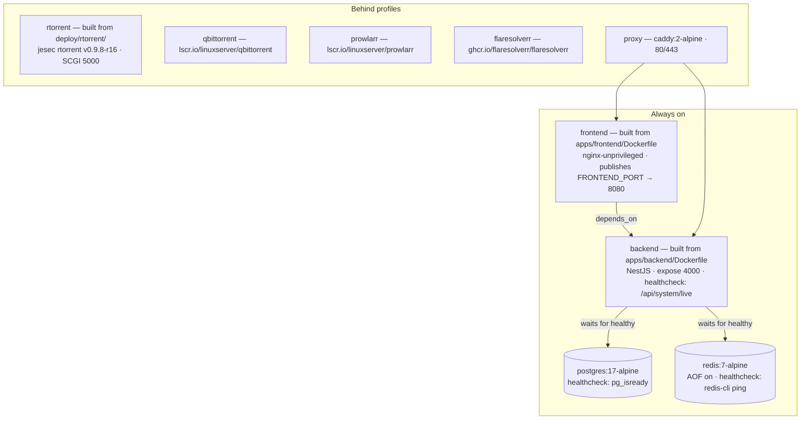

import Tabs from '@theme/Tabs';
import TabItem from '@theme/TabItem';

# Install with Docker Compose

## Overview

This is **the** UltraTorrent install guide. Every platform page in this section is a thin delta on top of it — different shell, different paths, different port clashes, same stack.

You will:

1. Get the source onto the host.
2. Generate five secrets into a `.env` file.
3. Build and start the stack (`docker compose up -d --build`).
4. Seed the database, once.
5. Log in, add a torrent engine, and verify.

:::tip Watch this tutorial
_Video coming soon._
:::

## Prerequisites

| You need | Why |
|----------|-----|
| **Docker Engine** (any recent release) | Runs the stack |
| **Docker Compose v2** — the `docker compose` *plugin*, not the legacy `docker-compose` script | The Compose file uses profiles and `condition: service_healthy` |
| **`git`** (or the ability to download and unzip a ZIP) | There are no published images — you build from source |
| **`openssl`** (or any strong random generator) | Generating secrets |
| Shell access to the host | Building and the one-time database seed |

Check what you have:

```bash
docker --version
docker compose version     # must print v2.x — if it errors, install the Compose plugin
```

## Requirements

| Resource | Minimum | Comfortable |
|----------|---------|-------------|
| **CPU** | 2 cores (x86-64 or ARM64) | 4 cores |
| **RAM** | **~2 GB free during the build** | 4 GB+ (Postgres + Redis + Node + an engine) |
| **Disk — the stack** | ~2–3 GB for images and volumes | plus headroom for `docker image prune` laziness |
| **Disk — downloads** | As much as your library needs | on a separate, large filesystem |
| **First build** | 10–15 minutes | seconds on every start after that |

The build is the memory-hungry part (it compiles the backend and the SPA). A host with 1 GB of RAM will typically OOM during the frontend build.

## Ports

Only the web UI is published by default.

| Port (host) | Service | Published by default? | Change with |
|-------------|---------|----------------------|-------------|
| **8080** | `frontend` — the web UI (nginx, listening on `8080` inside the container) | ✅ Yes | `FRONTEND_PORT` |
| 4000 | `backend` — REST API + WebSocket gateway | ❌ **No** — internal only; the frontend proxies `/api/` and `/ws/` to it | add a `ports:` mapping if you really want direct API access |
| 5432 | `postgres` | ❌ No — internal only | — |
| 6379 | `redis` | ❌ No — internal only | — |
| 5000 | `rtorrent` SCGI (profile `rtorrent`) | ❌ No — internal only | — (**never** publish it: SCGI is unauthenticated and grants full control) |
| 8081 | `qbittorrent` Web UI (profile `qbittorrent`) | ✅ Yes, when the profile is on | `QBITTORRENT_PORT` |
| 9696 | `prowlarr` (profile `prowlarr`) | ✅ Yes, when the profile is on | `PROWLARR_PORT` |
| 8191 | `flaresolverr` (profile `flaresolverr`) | ❌ No — internal only | — |
| 80 / 443 | `proxy` — bundled Caddy (profile `proxy`) | ✅ Yes, when the profile is on | edit `docker-compose.yml` |

:::info No inbound peer port is published
The bundled rTorrent listens for peers on `6890-6999` **inside** the container, and the shipped Compose file does **not** publish that range to the host. Downloads still work (outbound connections are unaffected), but you will not accept inbound peer connections. To change that, publish the range yourself in an override file and forward it on your router — see [Optional: accept inbound peers](#optional-accept-inbound-peers).
:::

## Volumes

| Volume | Used by | Holds |
|--------|---------|-------|
| `postgres_data` | `postgres` | **The database.** Back this up. |
| `redis_data` | `redis` | Redis AOF (cache + job queues) — regenerable |
| `downloads` | `backend`, `rtorrent`, `qbittorrent` | **The shared download tree**, mounted at the same path (`/downloads`) in every container so engine save-paths line up with `FILE_MANAGER_ROOTS`. rTorrent's session state lives here too, at `/downloads/.session`. |
| `prowlarr_config` | `prowlarr` | Prowlarr's database, indexer definitions, API key |
| `qbittorrent_config` | `qbittorrent` | qBittorrent settings and its own torrent state |
| `caddy_data` | `proxy` | Caddy certificates and ACME state |

All of them are Docker-managed named volumes by default. **Downloads is the one you almost certainly want to redirect** to a real folder — see [Point downloads at a real folder](#point-downloads-at-a-real-folder).

## Permissions

Three different users are in play:

| Container | Runs as | Notes |
|-----------|---------|-------|
| `backend` | `node`, **uid 1000** | Its file-manager actions (create/move/delete) happen as this user |
| `frontend` | nginx-unprivileged, uid 101 | Serves static files only — no shared volumes |
| `rtorrent` | **`PUID`:`PGID`**, default `1000:1000` | The entrypoint starts as root, then drops privileges with `gosu` |
| `qbittorrent` | **`PUID`:`PGID`**, default `1000:1000` | LinuxServer image convention |

**`PUID` / `PGID` decide who owns your downloaded files.** Defaults (`1000:1000`) match the backend, which is what you want when UltraTorrent owns the folder.

If your download folder is owned by **another application's user** — the classic case is a Plex-owned media share — do **not** `chown` it to 1000; that breaks Plex. Instead, make the engine write *as* that user:

```bash
id plex        # e.g. uid=1001(plex) gid=1001(plex)
```

```dotenv
# .env
PUID=1001
PGID=1001
```

```bash
docker compose --profile rtorrent up -d rtorrent
```

The bundled rTorrent entrypoint deliberately **only** claims `/downloads` when it is a brand-new, root-owned, unclaimed volume — a folder already owned by a real user is left untouched. Pointing it at a Plex-owned share is safe.

**Optional — let the in-app File Manager write there too.** The backend still runs as uid 1000, so its *write* actions on a Plex-owned folder are limited until you add it to that group:

```bash
sudo chmod -R g+rwX /path/to/downloads
sudo find /path/to/downloads -type d -exec chmod g+s {} +   # new files inherit the group
```

```yaml
# docker-compose.override.yml
services:
  backend:
    group_add: ["1001"]     # plex's GID
```

Skip this and downloading still works fully; only the File Manager's write actions on that folder are restricted (and you get a "cannot write to this path" warning when setting the Default Root Path — a warning, not a blocker).

## Step-by-step

### 1. Get the source

```bash
git clone https://github.com/damirabal/ultratorrent-core.git
cd ultratorrent-core
```

No `git`? Download the repository ZIP from GitHub, extract it on the host, and `cd` into it.

### 2. Generate your secrets

Copy the template:

```bash
cp .env.example .env
```

There are **no insecure defaults**. The stack refuses to start until you set `POSTGRES_PASSWORD` and `ADMIN_PASSWORD`, and the backend refuses to boot in production unless `JWT_ACCESS_SECRET`, `JWT_REFRESH_SECRET` and `ENCRYPTION_KEY` are set, at least 32 characters, not a known default — and `ENCRYPTION_KEY` **must differ** from `JWT_ACCESS_SECRET`.

Generate one secret at a time:

```bash
openssl rand -base64 48     # run once per secret — they must all differ
```

…or fill all three random keys in one go, then set the two passwords by hand:

```bash
for k in JWT_ACCESS_SECRET JWT_REFRESH_SECRET ENCRYPTION_KEY; do
  sed -i "s|^$k=.*|$k=$(openssl rand -base64 48 | tr -d '\n')|" .env
done
```

:::warning POSTGRES_PASSWORD must be alphanumeric
Compose derives `DATABASE_URL` from `POSTGRES_USER` / `POSTGRES_PASSWORD` / `POSTGRES_DB`. A URL-special character (`@`, `:`, `/`, `#`, `?`) in the password breaks that derived connection string. **Use letters and numbers only.**
:::

### 3. Fill in the `.env`

A minimal, working `.env` — everything else has a sane default:

```dotenv
# ---- Required ------------------------------------------------------------
POSTGRES_PASSWORD=alphanumericPasswordHere123     # letters + numbers ONLY
ADMIN_PASSWORD=the-password-you-will-log-in-with  # this is YOUR login password

JWT_ACCESS_SECRET=<openssl rand -base64 48>
JWT_REFRESH_SECRET=<openssl rand -base64 48>
ENCRYPTION_KEY=<openssl rand -base64 48>          # MUST differ from JWT_ACCESS_SECRET

# ---- Commonly changed ----------------------------------------------------
FRONTEND_PORT=8080            # the ONLY port published by default; change if 8080 is taken
CORS_ORIGIN=http://localhost:8080
ADMIN_USERNAME=admin          # you log in with this USERNAME, not the email
ADMIN_EMAIL=admin@ultratorrent.local
TZ=Etc/UTC                    # timezone for the bundled companion containers

# ---- Downloads / permissions --------------------------------------------
FILE_MANAGER_ROOTS=/downloads # comma-separated absolute roots the file browser may touch
# PUID=1000                   # who owns downloaded files (see Permissions above)
# PGID=1000

# ---- Optional bundled engines / companions -------------------------------
QBITTORRENT_PORT=8081         # only used with --profile qbittorrent
PROWLARR_PORT=9696            # only used with --profile prowlarr
PROWLARR_BASE_URL=http://prowlarr:9696
PROWLARR_PUBLIC_URL=http://localhost:9696
# RT_DHT=off                  # bundled rTorrent: DHT is OFF by default (it can crash this build)
# SSRF_ALLOW_HOSTS=prowlarr   # hosts whose .torrent links may resolve to a private IP
```

:::danger Never commit a real `.env`
It contains your database password, your admin password, and the keys that sign every session token and encrypt every stored 2FA secret. See [Security](/operate/security).
:::

The full, generated list of every variable UltraTorrent reads lives at **[Environment variables](/reference/environment)**.

### 4. Point downloads at a real folder {#point-downloads-at-a-real-folder}

By default, downloads land inside a Docker-managed volume you cannot easily browse. To send them to a normal folder, create `docker-compose.override.yml` **next to** `docker-compose.yml`:

```yaml
# docker-compose.override.yml
volumes:
  downloads:
    driver: local
    driver_opts:
      type: none
      o: bind
      device: /srv/downloads        # a real, EXISTING folder on the host
```

Create the folder first (`mkdir -p /srv/downloads`) — Docker will not create it for you, and the bind will fail if it does not exist.

:::caution Do not remap the UI port with an override
Compose **appends** `ports:` entries rather than replacing them, so an override adds a *second* mapping and the original one still conflicts. Change `FRONTEND_PORT` in `.env` instead.
:::

### 5. Build and start

<Tabs groupId="engine">
<TabItem value="rtorrent" label="Bundled rTorrent (default)" default>

```bash
docker compose --profile rtorrent up -d --build
```

The first build takes **several minutes** — that is normal. Let it finish.

</TabItem>
<TabItem value="qbittorrent" label="Bundled qBittorrent (large libraries)">

```bash
docker compose --profile qbittorrent up -d --build
```

Then get the first-run temporary password and set your own:

```bash
docker compose logs qbittorrent | grep -i password
```

Open `http://<host>:8081`, log in as `admin` with that temporary password, and set a real username/password under **Options → Web UI**.

</TabItem>
<TabItem value="own" label="My own engine">

```bash
docker compose up -d --build
```

No profile — no bundled engine. Register your existing rTorrent or qBittorrent later under **Infrastructure → Engines**.

</TabItem>
<TabItem value="everything" label="Everything">

```bash
docker compose --profile rtorrent --profile prowlarr --profile flaresolverr up -d --build
```

Profiles stack. Add `--profile proxy` for the bundled Caddy edge proxy.

</TabItem>
</Tabs>

### 6. Seed the database — once

Migrations apply automatically on every backend start (the container's command is `prisma migrate deploy && node dist/main.js`). **Seeding is a separate, one-time step** that inserts permissions, the five system roles, the bootstrap admin, and the default settings:

```bash
docker compose exec backend npx prisma db seed
```

The seed is idempotent — re-running it never resets your admin password or touches your data. You will run it again after upgrades, to pick up new permissions.

### 7. First login

Open **`http://<host>:8080`** (or whatever `FRONTEND_PORT` you chose).

- **Username:** `admin` — it is a *username*, **not** an email address.
- **Password:** the `ADMIN_PASSWORD` you set in `.env`.


### 8. Add the torrent engine

In the left-hand nav: **Infrastructure → Engines → Add engine**.

<Tabs groupId="engine">
<TabItem value="rtorrent" label="Bundled rTorrent" default>

| Field | Value |
|-------|-------|
| Client | rTorrent |
| Connection / mode | **SCGI over TCP** (`scgi-tcp`) |
| Host | `rtorrent` |
| Port | `5000` |
| Default engine | On |

Click **Test connection** → it should say **Connected**. Then **Add engine**.

</TabItem>
<TabItem value="qbittorrent" label="Bundled qBittorrent">

| Field | Value |
|-------|-------|
| Client | qBittorrent |
| Base URL | `http://qbittorrent:8080` |
| Username / password | The ones you set in the qBittorrent Web UI |
| Default engine | On |

If **Test connection** fails with a 401, turn off **Enable Host header validation** (or set *Server domains* to `*`) under qBittorrent's **Options → Web UI** — the backend connects by the service name `qbittorrent`, which that check rejects by default.

</TabItem>
<TabItem value="own" label="Your own rTorrent">

Enable an SCGI endpoint in your `~/.rtorrent.rc`:

```ini
# SCGI over a TCP port (mode "scgi-tcp"):
network.scgi.open_port = 127.0.0.1:5000
# …or a Unix socket (mode "scgi-unix"):
# network.scgi.open_local = /var/run/rtorrent/rpc.socket
```

| `mode` | Fields | rTorrent directive |
|--------|--------|--------------------|
| `scgi-tcp` | `host`, `port` | `network.scgi.open_port` |
| `scgi-unix` | `socketPath` | `network.scgi.open_local` |
| `http` | `url` | an HTTP→XML-RPC front end |

:::danger SCGI is unauthenticated
It grants **full control** of the client and the host user it runs as. Bind it to `127.0.0.1` or a Unix socket. Never expose it to a network or publish it from Docker.
:::

</TabItem>
</Tabs>


### 9. Point the file browser at your downloads

If you did step 4: **Settings → Default Root Path** → choose `/downloads`.

## Verification

Run these in order. Every one should look like the expected output.

**All services up and healthy:**

```bash
docker compose ps
```

```text
NAME                       STATUS                    PORTS
ultratorrent-backend-1     Up 2 minutes (healthy)    4000/tcp
ultratorrent-frontend-1    Up 2 minutes (healthy)    0.0.0.0:8080->8080/tcp
ultratorrent-postgres-1    Up 2 minutes (healthy)    5432/tcp
ultratorrent-redis-1       Up 2 minutes (healthy)    6379/tcp
ultratorrent-rtorrent-1    Up 2 minutes (healthy)    5000/tcp
```

**The API is alive** (public endpoints, no auth needed):

```bash
curl -s http://localhost:8080/api/system/live
curl -s http://localhost:8080/api/system/ready
curl -s http://localhost:8080/api/system/version
```

`/api/system/version` returns the running version — the same string you should see in **About**.

**The backend booted cleanly:**

```bash
docker compose logs backend | tail -30
```

You want migrations applied and Nest listening — **no** `insecure secret configuration`, no `P1000`, no `P1001`.

**The engine is online.** In the UI, **Infrastructure → Engines** should show it green. The **Torrents** page should load an (empty) list rather than "Could not load torrents".

**A real download.** Add a torrent (a Linux ISO is the classic test) and watch the progress bar move *without refreshing the page* — that confirms the WebSocket connection works end to end. See [Your first download](/learn/first-download).

## Optional: accept inbound peers {#optional-accept-inbound-peers}

The shipped Compose file publishes no peer port, so the bundled rTorrent makes outbound connections only. To accept inbound peers, publish its port range and forward it on your router:

```yaml
# docker-compose.override.yml
services:
  rtorrent:
    ports:
      - "6890-6999:6890-6999/tcp"
```

:::caution Community-verified
Publishing a peer-port range is a standard BitTorrent practice, but it is **not** part of the shipped Compose file and is not exercised by the project's own deployments. Verify it behaves the way you expect on your host before relying on it, and remember that forwarding a port makes your client reachable from the internet.
:::

## Optional profiles

Everything optional is behind a Compose profile and **off by default**.

| Profile | Adds | Reach it at |
|---------|------|-------------|
| `rtorrent` | The bundled rTorrent engine | internal `rtorrent:5000` (SCGI) |
| `qbittorrent` | The bundled qBittorrent engine | `http://<host>:8081`, internal `http://qbittorrent:8080` |
| `prowlarr` | A [Prowlarr](/modules/prowlarr) indexer manager companion | `http://<host>:9696`, internal `http://prowlarr:9696` |
| `flaresolverr` | A Cloudflare solver Prowlarr can use for protected indexers | internal `http://flaresolverr:8191` |
| `proxy` | A Caddy edge reverse proxy with automatic TLS | `:80` / `:443` |

```bash
docker compose --profile rtorrent --profile prowlarr up -d --build
```

:::info Self-hosted indexers and the SSRF guard
Auto-downloads (RSS rules, [Smart Download](/modules/smart-download), missing-episode acquisition) fetch the indexer's `.torrent` link over HTTP. The backend's SSRF guard **blocks any URL that resolves to a private/internal address** unless its host is listed in `SSRF_ALLOW_HOSTS`.

The stack defaults to `SSRF_ALLOW_HOSTS=prowlarr`, so the **bundled** Prowlarr works out of the box. Using a *different* self-hosted indexer (a Prowlarr or Jackett elsewhere on your LAN)? Add its host — and keep `prowlarr` if you also use the bundled one:

```dotenv
SSRF_ALLOW_HOSTS=prowlarr,indexer.lan,10.0.0.0/24
```

Without it, grabs fail with *"Torrent URL resolves to a blocked internal address"* and auto-downloads silently do nothing — **even though the Prowlarr connection test still passes**. That health check trusts private hosts; the torrent *fetch* is a separate, stricter guard.
:::

## The Compose file, service by service



**`postgres`** — `postgres:17-alpine`. Refuses to start without `POSTGRES_PASSWORD` (Compose's `:?` guard). Healthchecked with `pg_isready`; the backend waits for `service_healthy`. Data in `postgres_data`.

**`redis`** — `redis:7-alpine` with append-only persistence on. Cache and BullMQ job queues. Healthchecked with `redis-cli ping`. Data in `redis_data`.

**`backend`** — built from `apps/backend/Dockerfile` (multi-stage Node 22, runs as the unprivileged `node` user, uid 1000). Its `DATABASE_URL` is *derived* from `POSTGRES_USER`/`POSTGRES_PASSWORD`/`POSTGRES_DB`, so it can never drift from the database password — which is exactly why the password must be alphanumeric. It refuses to boot in production with weak, identical, or default secrets. Its command is `prisma migrate deploy && node dist/main.js`, so **migrations apply on every start**. `expose: 4000` — **not** published to the host.

**`frontend`** — built from `apps/frontend/Dockerfile` onto `nginx-unprivileged`, which listens on **8080** inside the container. Published as `${FRONTEND_PORT:-8080}:8080`. Its nginx config proxies `/api/` to `backend:4000` and `/ws/` to `backend:4000` **with the WebSocket upgrade headers**, so the browser only ever talks to one port. The API and WebSocket URLs are baked in at *build* time (`VITE_API_URL=/api`, `VITE_WS_URL=/`) as same-origin relative paths.

**`rtorrent`** (profile) — built from `deploy/rtorrent/` around the jesec `v0.9.8-r16` static binary. Serves SCGI on `0.0.0.0:5000` on the internal network only. Its entrypoint clears a stale `rtorrent.lock` from a previous crash, chowns `/downloads/.session`, and drops to `PUID:PGID` with `gosu`. It requests `cap_add: [SETUID, SETGID]` — those are part of Docker's *default* capability set, but some hosts (notably Synology DSM) strip them, which would make the privilege drop fail; re-adding them restores the default behaviour. Healthcheck: the SCGI port is listening.

**`qbittorrent`** (profile) — `lscr.io/linuxserver/qbittorrent`. Shares the same `downloads` volume so save-paths line up. Web UI published on `QBITTORRENT_PORT` (8081) so you can retrieve the first-run password.

**`prowlarr`** (profile) — `lscr.io/linuxserver/prowlarr`. A *companion*, not part of UltraTorrent; you link it under **Settings → Integrations → Prowlarr**. Its API key is entered in the UI and stored AES-GCM encrypted — never in `.env`.

**`flaresolverr`** (profile) — solves Cloudflare challenges for Prowlarr indexers. Gets `shm_size: 256m` because headless Chromium crashes with Docker's default 64 MB `/dev/shm`.

**`proxy`** (profile) — `caddy:2-alpine`, mounting `deploy/Caddyfile`. See [Reverse proxy](/install/reverse-proxy).

All services sit on one `internal` bridge network and address each other **by service name** — `postgres`, `redis`, `backend`, `rtorrent`, `qbittorrent`, `prowlarr`.

## Reverse proxy

Not needed on a LAN — hit `http://<host>:8080` and you are done.

Reachable from the internet, or you want a hostname and HTTPS? Put a proxy in front. **The one hard requirement: `/ws/` must be proxied with the WebSocket upgrade headers**, or the UI loads but never updates live (no progress bars, no live torrent list).

Full, working configs for Traefik, NGINX, Nginx Proxy Manager, Caddy, HAProxy and Cloudflare Tunnel: **[Reverse proxy](/install/reverse-proxy)**.

## HTTPS

The fastest path is the bundled Caddy profile — replace the `:80` site label in `deploy/Caddyfile` with your domain and it gets a Let's Encrypt certificate automatically:

```bash
docker compose --profile proxy up -d
```

Details, custom certificates, internal CAs and DNS-01 for split-horizon setups: **[TLS](/install/tls)**.

## Updates

```bash
cd ultratorrent-core
docker compose exec -T postgres pg_dump -U ultratorrent ultratorrent > backup-$(date +%F).sql
git pull
docker compose --profile rtorrent up -d --build
docker compose exec backend npx prisma db seed        # picks up NEW permissions/settings
```

Migrations are **forward-only** and apply automatically on backend start. Always back up first. The full procedure, including rollback: **[Upgrading](/install/upgrading)**.

## Backups

Back up two things:

```bash
# 1. The database — everything except the media itself
docker compose exec -T postgres pg_dump -U ultratorrent ultratorrent > ultratorrent-$(date +%F).sql

# 2. Your .env — you cannot decrypt stored 2FA secrets without ENCRYPTION_KEY
cp .env /somewhere/safe/ultratorrent.env.bak
```

`redis_data` is regenerable. `downloads` is your media — back it up on whatever schedule your media deserves. See [Backup & restore](/operate/backup).

## Troubleshooting

| Symptom | Cause | Fix |
|---------|-------|-----|
| Compose refuses to start: *"POSTGRES_PASSWORD is required"* | The `:?` guard in the Compose file fired | Set `POSTGRES_PASSWORD` (and `ADMIN_PASSWORD`) in `.env` |
| Backend exits at boot: *"insecure secret configuration"* | `JWT_ACCESS_SECRET` / `ENCRYPTION_KEY` unset, a known default, under 32 chars, or **identical to each other** | Generate strong, **distinct** values: `openssl rand -base64 48` |
| Backend crash-loops with Prisma **`P1000: Authentication failed`** | The `postgres_data` volume was first created with a *different* `POSTGRES_PASSWORD`. Postgres only applies the password on **first init** — later `.env` edits do nothing to an existing volume | If there is no real data yet: `docker compose down -v && docker compose --profile rtorrent up -d --build`. Also make sure the password is **alphanumeric** — a `@`, `:` or `/` breaks the derived `DATABASE_URL` |
| **`P1001: Can't reach database server at postgres:5432`** | You are running a *manual* install with a `DATABASE_URL` that points at the Docker service name | Point it at `localhost` — and make sure PostgreSQL is actually running |
| Web UI port already in use | Something else owns 8080 (very common on a NAS) | Set `FRONTEND_PORT=18080` in `.env` and re-run `up -d`. **Do not** try to remap it with an override — Compose *appends* `ports`, so the old mapping survives and still clashes |
| Backend crashes with `Cannot find module '...'` | A stale image missing a nested workspace dependency | `docker compose up -d --build`. If you customized the Dockerfile, make sure the runtime stage copies `apps/backend/node_modules` — npm does not always hoist |
| *"Invalid username or password"* right after install | You typed the **email**, or you never seeded | Log in with the **username** (`admin`). Run `docker compose exec backend npx prisma db seed` |
| Forgot / cannot use the admin password | The seed only sets the password when it **first creates** the admin — it never overwrites a later change | Reset it to the current `.env` value: `docker compose exec backend node -e 'const argon2=require("argon2");const{PrismaClient}=require("@prisma/client");(async()=>{const p=new PrismaClient();const u=process.env.ADMIN_USERNAME\|\|"admin";const h=await argon2.hash(process.env.ADMIN_PASSWORD,{type:argon2.argon2id});const r=await p.user.update({where:{username:u},data:{passwordHash:h,isActive:true}});console.log("reset:",r.username);await p.$disconnect()})().catch(e=>{console.error(e.message);process.exit(1)})'` |
| *"Could not load torrents"* / `/api/engines/health` → `online: false` | No engine configured, or SCGI unreachable | Add the engine (**Infrastructure → Engines**, rTorrent / `scgi-tcp` / host `rtorrent` / port `5000`) and use **Test connection**. The bundled engine only exists if you started with `--profile rtorrent` |
| Auto-downloads do nothing; grabs fail with *"resolves to a blocked internal address"* | The SSRF guard blocked a private-IP `.torrent` link | Add the indexer's host to `SSRF_ALLOW_HOSTS` and recreate the backend |
| *"The app process cannot write to this path"* on Default Root Path | The folder is not writable by uid 1000 | Plain folder → `chown -R 1000:1000 <folder>`. Owned by another app (Plex) → **do not chown**; set `PUID`/`PGID` and optionally `group_add` the backend (see [Permissions](#permissions)) |
| rTorrent crash-loops: *"Could not lock session directory"* | A stale `rtorrent.lock` from a previous crash | Current images clear it automatically — rebuild. By hand: `rm -f <downloads>/.session/rtorrent.lock` |
| rTorrent restarts periodically; logs show `priority_queue_insert(...) called on an invalid item` | The **unfixed upstream rTorrent 0.9.8 bug**. Frequency scales with active-torrent count | Nothing is lost — it auto-restarts and reloads its session. Reduce active torrents, or switch to the qBittorrent profile for a large library |
| rTorrent crashes with `DhtServer::event_write … both write queues are empty` | A DHT bug in this rTorrent build — which is why DHT is **off by default** | Set `RT_DHT=off` in `.env` and recreate. Trackers + PEX still find peers |
| UI loads but nothing updates live | The WebSocket never connected — usually `/ws/` is not proxied with `Upgrade`/`Connection` headers | Fix your reverse proxy — see [Reverse proxy](/install/reverse-proxy) |
| Build gets OOM-killed | Under ~2 GB of free RAM | Free memory, or add swap, and rebuild |

More: **[Troubleshooting](/operate/troubleshooting)**.

## Best practices

- **Generate every secret separately.** Three `openssl rand -base64 48` runs, three different values. `ENCRYPTION_KEY` must not equal `JWT_ACCESS_SECRET` — the backend checks.
- **Keep `POSTGRES_PASSWORD` alphanumeric.** The derived `DATABASE_URL` is not URL-encoded.
- **Bind-mount downloads to a real folder** on a big filesystem, not a Docker volume you cannot browse.
- **Never publish the SCGI port (5000).** It is unauthenticated remote control.
- **Never publish the backend (4000)** unless you specifically need direct API access — the frontend already proxies it.
- **Back up before every upgrade.** Migrations are forward-only.
- **Prune old images** occasionally: `docker image prune -f`.
- **Change `FRONTEND_PORT` rather than fighting a port clash** with an override file.
- **Pick the engine that matches your library size** — rTorrent for modest, qBittorrent for large.
- **Do not expose it to the internet without a reverse proxy and HTTPS.** See [Security](/operate/security).

## FAQ

**Do I have to run `--build`?**
Yes, at least once — no images are published, so the first `up` must build them. Afterwards, `docker compose up -d` reuses the built images; you only need `--build` again after pulling new code.

**Do I need to seed after every upgrade?**
Re-running the seed is *recommended* — it picks up new permissions, roles and settings introduced by the release. It is idempotent and never resets your admin password.

**Where is the API documentation?**
Swagger is served at `/api/docs` in non-production builds. The reference lives at [API](/reference/api).

**Can I expose the backend directly?**
Yes — add `ports: ["4000:4000"]` to the `backend` service. You rarely need to; the frontend proxies `/api/` for you.

**Can I run only Postgres and Redis in Docker, and the apps from source?**
Yes: `docker compose -f docker-compose.dev.yml up -d` publishes just those two. See [Linux → manual install](/install/platforms/linux#manual-install-from-source).

**Do the containers auto-update?**
No. Updating means pulling new source and rebuilding — see [Upgrading](/install/upgrading).

## Checklist

- [ ] Docker Engine + Compose v2 present (`docker compose version` prints v2.x)
- [ ] Source cloned; `cp .env.example .env` done
- [ ] `POSTGRES_PASSWORD` set — **alphanumeric only**
- [ ] `ADMIN_PASSWORD` set
- [ ] `JWT_ACCESS_SECRET`, `JWT_REFRESH_SECRET`, `ENCRYPTION_KEY` generated — three *distinct* 48-byte values
- [ ] `ENCRYPTION_KEY` ≠ `JWT_ACCESS_SECRET`
- [ ] `FRONTEND_PORT` free on this host
- [ ] Downloads bind-mounted to a real folder (optional but recommended), and that folder exists
- [ ] `PUID`/`PGID` set if the download folder belongs to another app
- [ ] `docker compose --profile <engine> up -d --build` completed
- [ ] `docker compose exec backend npx prisma db seed` run **once**
- [ ] `docker compose ps` shows everything `healthy`
- [ ] `curl http://localhost:8080/api/system/live` responds
- [ ] Logged in as `admin` (the *username*)
- [ ] Engine added and **Test connection** returns Connected
- [ ] Default Root Path set to `/downloads`
- [ ] A test torrent downloads, with the progress bar moving live
- [ ] `.env` and a `pg_dump` backed up somewhere safe

## See also

- [Choose your install method](/install/) — the decision tree
- [Platform deltas](/install/platforms/linux) — Linux, Synology, QNAP, Unraid, TrueNAS, Portainer, Proxmox, cloud
- [Reverse proxy](/install/reverse-proxy) · [TLS](/install/tls) · [Upgrading](/install/upgrading)
- [Environment variables](/reference/environment) — the generated reference
- [Engines](/modules/engines) · [Prowlarr](/modules/prowlarr) · [Torrents](/modules/torrents)
- [Quick start](/learn/quick-start) · [Your first download](/learn/first-download)
- [Backup & restore](/operate/backup) · [Security](/operate/security) · [Performance](/operate/performance)
