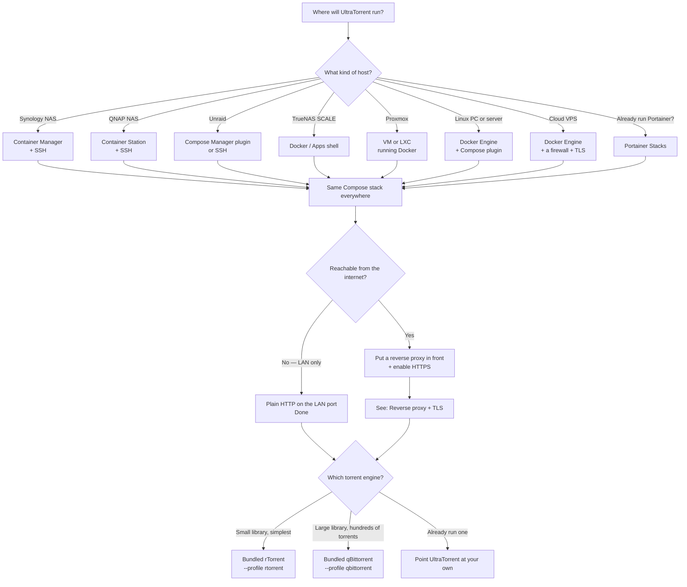
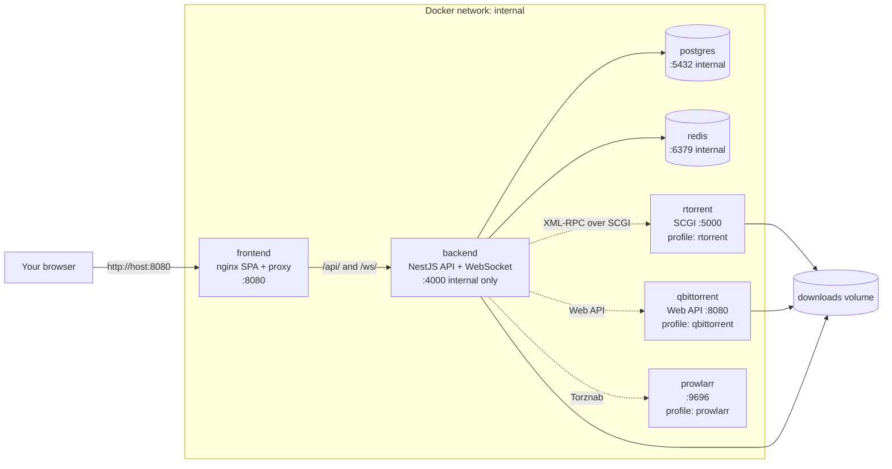

# Choose your install method

## Overview

UltraTorrent ships as a **Docker Compose stack**: PostgreSQL, Redis, the NestJS API, the React web UI, and — behind opt-in Compose profiles — a bundled torrent engine, a Prowlarr indexer manager, a Cloudflare solver, and an edge reverse proxy.

That single fact simplifies the whole install story. **Almost every "platform" in this section is just a Docker host.** Synology, QNAP, Unraid, TrueNAS SCALE, Portainer, Proxmox, a Hetzner VPS — they differ in *how you get a shell*, *where your volumes live*, and *which ports are already taken*. They do not differ in how UltraTorrent runs.

So this section is deliberately shaped like that:

- **[Docker Compose](/install/docker-compose)** is the authoritative guide. Every other page defers to it.
- **[Platform pages](/install/platforms/linux)** are thin deltas: shell access, paths, port clashes, gotchas.
- **[Reverse proxy](/install/reverse-proxy)** and **[TLS](/install/tls)** are cross-cutting and apply to all of them.

:::info There are no prebuilt images yet
The Compose stack **builds the images from source** — there is no published registry image to `docker pull`. Your host therefore needs Docker, the source tree, and roughly **2 GB of free RAM** for the first build (about 10–15 minutes; later starts are seconds). Base images are multi-arch, so x86-64 and ARM64 hosts both work.
:::

:::tip Watch this tutorial
_Video coming soon._
:::

## Decision tree

## Comparison table

| Host | How you install | Difficulty | Shell needed? | Notes |
|------|-----------------|-----------|---------------|-------|
| **[Linux PC / server](/install/platforms/linux)** | Docker Engine + Compose plugin | Easy | Yes | The reference platform. Ubuntu, Debian, Fedora, Rocky. |
| **[Synology](/install/platforms/synology)** | Container Manager + SSH | Medium | Yes (once) | **Well-grounded** — UltraTorrent is deployed on Synology. Remap the UI port; DSM can strip container capabilities. |
| **[QNAP](/install/platforms/qnap)** | Container Station + SSH | Medium | Yes | **Well-grounded.** The `docker` binary is not on `PATH` by default. QNAP's admin UI already owns port 8080. |
| **[Unraid](/install/platforms/unraid)** | Docker Compose Manager plugin, or SSH | Medium | Yes | No Community Apps template exists — the stack builds from source. |
| **[TrueNAS SCALE](/install/platforms/truenas)** | Docker / custom app | Medium | Yes | Depends heavily on your SCALE version's app engine. |
| **[Portainer](/install/platforms/portainer)** | Stacks → Git repository | Easy | No | Nice if you already run Portainer. Seeding still needs a container console. |
| **[Proxmox](/install/platforms/proxmox)** | VM (recommended) or LXC running Docker | Medium | Yes | Proxmox itself does not run Docker — you install it inside a guest. |
| **[Cloud VPS](/install/platforms/cloud)** | Docker Engine + firewall + TLS | Medium | Yes | AWS, Azure, GCP, Oracle, Hetzner, DigitalOcean, Vultr. **Never expose it without HTTPS and a firewall.** |

## What gets installed

**The only port published by default is the web UI** (`8080`, changeable via `FRONTEND_PORT`). The backend is *not* published to the host — the frontend's nginx proxies `/api/` and `/ws/` to it over the internal Docker network.

## Which engine?

UltraTorrent is multi-engine. Two engines ship bundled behind Compose profiles:

| | Bundled **rTorrent** (`--profile rtorrent`) | Bundled **qBittorrent** (`--profile qbittorrent`) |
|---|---|---|
| Setup | Zero config — add it in the UI as `scgi-tcp` / host `rtorrent` / port `5000` | Grab the first-run password from the logs, then register it |
| Footprint | Very small | Small |
| Stability at scale | **Degrades.** rTorrent 0.9.8 has an unfixed upstream `priority_queue_insert` crash that fires more often the more active torrents you run | Comfortable with thousands of torrents |
| Best for | A modest library, a first install | A large library |

:::warning Bundled rTorrent and large libraries
The bundled engine is rTorrent `0.9.8` (jesec `v0.9.8-r16`, the newest build in that lineage). It carries a long-standing **upstream** bug — `internal_error: priority_queue_insert(...) called on an invalid item`, fired during tracker-announce scheduling — with **no fix in the 0.9.8 line**. Frequency scales with the number of *active* torrents: effectively zero at a handful, roughly ten crashes a day at ~750.

Each crash exits the process; Docker's `restart: unless-stopped` relaunches it and rTorrent reloads its saved session, so **no torrents are lost** — transfers just pause briefly and re-announce. Mitigate by keeping the active-torrent count modest, or run **qBittorrent** instead for a large library. UDP trackers and DHT are already disabled in the bundled config to remove secondary crash variants.
:::

## Before you start

You will need, on the host:

- **Docker Engine** with the **Compose v2 plugin** (`docker compose`, space — not the legacy `docker-compose`).
- **~2 GB free RAM** for the build, **2+ GB disk** for the images, plus whatever your downloads need.
- The **source tree** (`git clone`, or a downloaded ZIP).
- Five secrets you generate yourself: `POSTGRES_PASSWORD`, `JWT_ACCESS_SECRET`, `JWT_REFRESH_SECRET`, `ENCRYPTION_KEY`, `ADMIN_PASSWORD`. There are **no insecure defaults** — the stack refuses to start without them.

:::note Screenshot needed
A terminal showing `docker compose --profile rtorrent up -d --build` finishing, with all services reporting `Started` / `Healthy`.
:::

## Next steps

1. **[Follow the Docker Compose guide](/install/docker-compose)** — the authoritative install.
2. Skim your **[platform page](/install/platforms/linux)** for the deltas that apply to your host.
3. Exposing it beyond your LAN? **[Reverse proxy](/install/reverse-proxy)** → **[TLS](/install/tls)**.
4. Then **[Quick start](/learn/quick-start)** and **[your first download](/learn/first-download)**.

## Checklist

- [ ] I know which host I am installing on
- [ ] Docker Engine + Compose v2 are installed on it
- [ ] I have ~2 GB free RAM and a couple of GB of disk
- [ ] I have decided rTorrent (small library) vs qBittorrent (large library)
- [ ] I know whether this box will be reachable from the internet (→ reverse proxy + TLS)
- [ ] I have somewhere safe to keep the five secrets I am about to generate

## FAQ

**Is there a one-click app / Docker Hub image?**
Not yet. Every install builds from source with `docker compose up -d --build`.

**Can I run it without Docker?**
Yes — Node 20, PostgreSQL 14+ and Redis 6+, from source. It is a development path, not a supported production one. See [Linux](/install/platforms/linux#manual-install-from-source).

**Does it need a GPU / transcoding?**
No. UltraTorrent acquires and organizes media; it does not transcode or stream.

**Can I use my existing qBittorrent / rTorrent?**
Yes — skip both profiles and register your own engine under **Infrastructure → Engines**. See [Engines](/modules/engines).

## See also

- [Docker Compose install](/install/docker-compose) — the authoritative guide
- [Upgrading](/install/upgrading) — updates, rollback, migration safety
- [Environment variables](/reference/environment) — every variable, generated from `.env.example`
- [Concepts](/learn/concepts) — what the pieces are
- [Troubleshooting](/operate/troubleshooting)
- [Security](/operate/security)
