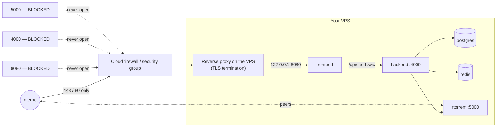

import Tabs from '@theme/Tabs';
import TabItem from '@theme/TabItem';

# Cloud & VPS

## Overview

A cloud VPS is a [Linux host](/install/platforms/linux) you rent. The install is identical. What changes is that it is **on the public internet**, which turns three optional things into mandatory ones:

1. **A firewall.** Expose 80/443 only — never 8080, never 4000, never 5000.
2. **HTTPS.** No exceptions.
3. **Backups you keep somewhere else.** A cloud instance can vanish.

And two things you must understand before you spend money:

- **Bandwidth is metered** almost everywhere, and BitTorrent is bandwidth. This is where surprise bills come from.
- **Your provider's acceptable-use policy applies to you.** Read it.

:::warning Read your provider's AUP first
Some providers prohibit BitTorrent traffic outright, some tolerate it, some will terminate your account on the first DMCA notice. This is a policy question, not a technical one, and it is entirely on you. UltraTorrent is a media acquisition platform — use it for content you have the right to.
:::

:::caution Community-verified
Cloud providers are **not** among this project's own deployment targets. The UltraTorrent parts below are grounded in the repo; the provider specifics follow each vendor's standard practice and their consoles change constantly. Verify against current provider docs.
:::

:::tip Watch this tutorial
_Video coming soon._
:::

## Prerequisites

- A cloud account and a **domain name** (you need one for HTTPS).
- SSH key-based access to the instance.
- A credit card you are watching.

## Requirements

| Resource | Minimum | Comfortable | Why |
|----------|---------|-------------|-----|
| vCPU | 2 | 2–4 | The build; steady state is light |
| **RAM** | **4 GB** | 4–8 GB | The build peaks around 2 GB *free* — a 1 GB droplet **will fail to build** |
| Boot disk | 20 GB | 40 GB | OS + images |
| **Data disk** | Attach block storage | as big as your library | Boot disks are small and expensive |
| Bandwidth | **check the cap** | unmetered or generous | This is the real cost |

Roughly, per provider:

| Provider | Sane starting instance | Bandwidth notes |
|----------|-----------------------|-----------------|
| **Hetzner** | CX22 / CPX21 (2 vCPU, 4 GB) | Generous included traffic — usually the cheapest sane option |
| **DigitalOcean** | Basic 2 vCPU / 4 GB | Transfer allowance pooled per account; overage billed |
| **Vultr** | 2 vCPU / 4 GB Regular | Similar model to DO |
| **Oracle Cloud** | Ampere A1 (ARM) — 4 OCPU / 24 GB free tier | Big free tier, **but** capacity is often unavailable, and egress beyond the free allowance bills |
| **AWS EC2** | t3.medium / t4g.medium | **Egress is expensive.** This is the classic surprise-bill platform |
| **GCP** | e2-medium | Egress billed per GB |
| **Azure** | B2s | Egress billed per GB |
| **Linode/Akamai** | 2 GB shared → **4 GB** | 2 GB is too small to build |

:::danger Egress on the hyperscalers
On AWS/GCP/Azure, **outbound** data transfer is billed per gigabyte. A seeding torrent client is a machine for generating outbound data transfer. People have run up four-figure bills this way. If you use a hyperscaler, **cap your upload rate**, set a **billing alarm**, and know your egress price before you start.
:::

ARM64 instances (Graviton, Ampere, Axion) work — the base images are multi-arch.

## Ports



| Port | Open to the internet? |
|------|----------------------|
| **22** (SSH) | Key-only, and ideally restricted to your IP |
| **80** | Yes — HTTP→HTTPS redirect and ACME |
| **443** | Yes — the UI |
| 8080 | **No.** Bind it to `127.0.0.1` and let the proxy reach it |
| 4000 (backend) | **Never.** Not published by default; keep it that way |
| 5000 (SCGI) | **Never.** Unauthenticated full remote control |
| Peer ports | Optional, and only if you understand the exposure |

## Volumes

Use **block storage** for downloads, not the boot disk:

```bash
# after attaching the volume in the provider console
lsblk                                     # find the device, e.g. /dev/sdb
sudo mkfs.ext4 /dev/sdb
sudo mkdir -p /mnt/downloads
echo '/dev/sdb /mnt/downloads ext4 defaults,nofail,discard 0 2' | sudo tee -a /etc/fstab
sudo mount -a
sudo chown -R 1000:1000 /mnt/downloads
```

```yaml
# docker-compose.override.yml
volumes:
  downloads:
    driver: local
    driver_opts:
      type: none
      o: bind
      device: /mnt/downloads
```

:::tip `nofail` matters in the cloud
Without it, an instance that boots before the volume attaches drops to an emergency shell and never comes back — and you get to debug it over a serial console.
:::

## Permissions

Standard Linux — the downloads folder must be writable by **uid 1000** (or your `PUID`/`PGID`). See [Permissions](/install/docker-compose#permissions).

The more important permission question on a VPS is **who can log in**: keys only, no password auth, no root login.

## Step-by-step

### 1. Create the instance

<Tabs groupId="cloud">
<TabItem value="hetzner" label="Hetzner" default>

- **Image:** Ubuntu 24.04
- **Type:** CX22 (2 vCPU, 4 GB) or larger
- **Volume:** attach block storage for downloads
- **Firewall:** create one allowing **22 (your IP), 80, 443** — nothing else
- **SSH key:** add yours

Hetzner's included traffic allowance is generous, which is why it is the usual answer for this workload.

</TabItem>
<TabItem value="do" label="DigitalOcean / Vultr">

- **Image:** Ubuntu 24.04
- **Size:** Basic, 2 vCPU / 4 GB (the 1 GB tier **cannot build** the images)
- **Volume:** attach a Block Storage volume
- **Firewall:** cloud firewall allowing **22 (your IP), 80, 443**
- **SSH key:** add yours

Watch your account's pooled transfer allowance.

</TabItem>
<TabItem value="aws" label="AWS EC2">

- **AMI:** Ubuntu 24.04
- **Instance:** `t3.medium` (x86) or `t4g.medium` (ARM/Graviton — cheaper)
- **Storage:** 20 GB gp3 root **+ a separate EBS volume** for downloads
- **Security group:** inbound **22 (your IP), 80, 443** only
- **Elastic IP** so the address survives a stop/start

:::danger EBS + egress = the two AWS bills that surprise people
Set a **billing alarm** before you do anything else, and cap your torrent upload rate.
:::

</TabItem>
<TabItem value="gcp" label="GCP / Azure">

**GCP:** `e2-medium`, Ubuntu 24.04, a separate persistent disk for downloads, firewall rules allowing 80/443 (and 22 from your IP).

**Azure:** `Standard_B2s`, Ubuntu 24.04, a data disk, an NSG allowing 80/443 (and 22 from your IP).

Both bill egress per GB. Set a budget alert.

</TabItem>
<TabItem value="oracle" label="Oracle Cloud">

The **Ampere A1** free tier (up to 4 OCPU / 24 GB, ARM64) is generous, and UltraTorrent's images are multi-arch, so it builds.

Two things to know:

1. **A1 capacity is frequently unavailable** in a given region — you may retry for days.
2. Oracle instances ship with **iptables rules baked into the image**, on top of the cloud-level *security list*. Opening a port in the console is **not enough**:

```bash
sudo iptables -I INPUT -p tcp --dport 443 -j ACCEPT
sudo iptables -I INPUT -p tcp --dport 80 -j ACCEPT
sudo netfilter-persistent save
```

That local-iptables surprise is the single most common "I opened the port and it still does not work" on OCI.

</TabItem>
</Tabs>

### 2. Harden the box — before you install anything

```bash
sudo apt update && sudo apt upgrade -y

# SSH: keys only
sudo sed -i 's/^#\?PasswordAuthentication.*/PasswordAuthentication no/' /etc/ssh/sshd_config
sudo sed -i 's/^#\?PermitRootLogin.*/PermitRootLogin no/' /etc/ssh/sshd_config
sudo systemctl restart ssh

# Automatic security updates
sudo apt install -y unattended-upgrades fail2ban
```

Host firewall, in addition to the cloud one:

```bash
sudo ufw default deny incoming
sudo ufw default allow outgoing
sudo ufw allow 22/tcp
sudo ufw allow 80/tcp
sudo ufw allow 443/tcp
sudo ufw enable
```

:::danger Docker punches through ufw
Docker writes its own iptables rules and **a published port bypasses ufw**. `ufw deny 8080` does **not** protect a container published on `0.0.0.0:8080`. The only reliable fix is to **not publish it publicly** — bind it to localhost (next step) and use the cloud firewall as the outer layer.
:::

### 3. Install Docker + UltraTorrent

```bash
curl -fsSL https://get.docker.com | sudo sh
sudo usermod -aG docker "$USER"     # log out and back in

git clone https://github.com/damirabal/ultratorrent-core.git
cd ultratorrent-core
cp .env.example .env
for k in JWT_ACCESS_SECRET JWT_REFRESH_SECRET ENCRYPTION_KEY; do
  sed -i "s|^$k=.*|$k=$(openssl rand -base64 48 | tr -d '\n')|" .env
done
nano .env
```

```dotenv
POSTGRES_PASSWORD=lettersAndNumbers123
ADMIN_PASSWORD=a-genuinely-strong-password       # this one faces the internet
FRONTEND_PORT=8080
CORS_ORIGIN=https://torrents.example.com         # your real public origin
```

### 4. Bind the UI to localhost

This is the step that keeps the raw HTTP port off the internet.

```yaml
# docker-compose.override.yml
services:
  frontend:
    ports: !override
      - "127.0.0.1:8080:8080"

volumes:
  downloads:
    driver: local
    driver_opts:
      type: none
      o: bind
      device: /mnt/downloads
```

:::caution Community-verified
`!override` needs a recent Compose v2. If yours rejects it, edit the `ports:` line in `docker-compose.yml` directly — a plain override **appends** ports rather than replacing them, which would leave `0.0.0.0:8080` published.
:::

Verify afterwards. This command is the whole point of this section:

```bash
sudo ss -tlnp | grep 8080
# WANT:  127.0.0.1:8080
# NOT:   0.0.0.0:8080
```

### 5. Build, start, seed

```bash
docker compose --profile rtorrent up -d --build
docker compose exec backend npx prisma db seed
```

### 6. Put a proxy in front, with HTTPS

Point your domain's A record at the instance's IP, then — the shortest correct path:

```bash
sudo apt install -y caddy
```

```caddy
# /etc/caddy/Caddyfile
torrents.example.com {
    encode gzip
    reverse_proxy 127.0.0.1:8080
}
```

```bash
sudo systemctl reload caddy
```

Caddy obtains the certificate, redirects HTTP→HTTPS, renews automatically, and proxies WebSockets transparently. Other proxies (NGINX, Traefik, HAProxy): [Reverse proxy](/install/reverse-proxy). Certificates in depth: [TLS](/install/tls).

### 7. Log in

`https://torrents.example.com` → sign in as **`admin`**.

**Immediately:** change the admin password from the profile menu, and **enable two-factor authentication**. This login is on the public internet. See [Security](/operate/security) and [Users](/modules/users).

Then add the engine: **Infrastructure → Engines → Add engine** → rTorrent · SCGI over TCP · host `rtorrent` · port `5000` → **Test connection** → **Add engine**. And **Settings → Default Root Path** → `/downloads`.

## Verification

```bash
# Nothing dangerous is listening publicly
sudo ss -tlnp | grep -E '0\.0\.0\.0:(8080|4000|5000)'
#   ^ this should print NOTHING

# The app answers over HTTPS
curl -s https://torrents.example.com/api/system/live
curl -s https://torrents.example.com/api/system/version
```

**Confirm the WebSocket upgrades through the proxy** — otherwise the UI will look fine and never update:

```bash
curl -i -N -H "Connection: Upgrade" -H "Upgrade: websocket" \
  -H "Sec-WebSocket-Version: 13" -H "Sec-WebSocket-Key: dGhlIHNhbXBsZSBub25jZQ==" \
  https://torrents.example.com/ws/
```

```text
HTTP/1.1 101 Switching Protocols
```

**From another machine**, prove the raw ports are shut:

```bash
curl -m 5 http://<public-ip>:8080     # must time out / refuse
curl -m 5 http://<public-ip>:4000     # must time out / refuse
```


:::note Screenshot needed
The UltraTorrent dashboard at `https://torrents.example.com`, padlock visible, with a torrent downloading.
:::

## Reverse proxy

Mandatory. See [Reverse proxy](/install/reverse-proxy). The WebSocket upgrade is not optional — the live UI depends on it.

## HTTPS

Mandatory. Let's Encrypt via Caddy is the shortest path; certbot + NGINX is the classic one. See [TLS](/install/tls).

## Updates

```bash
cd ultratorrent-core
docker compose exec -T postgres pg_dump -U ultratorrent ultratorrent > backup-$(date +%F).sql
# copy the dump OFF the instance:
scp backup-$(date +%F).sql you@home:/backups/

git pull
docker compose --profile rtorrent up -d --build
docker compose exec backend npx prisma db seed
```

Take a **provider snapshot** of the instance before an upgrade — it is the cloud equivalent of a Proxmox snapshot and gives you a whole-machine rollback. Full procedure: [Upgrading](/install/upgrading).

Keep the OS patched: `unattended-upgrades` is doing that already if you installed it in step 2.

## Backups

**Off-instance or it does not count.**

```bash
# Nightly: dump, then ship it somewhere else
docker compose exec -T postgres pg_dump -U ultratorrent ultratorrent \
  | gzip > /mnt/downloads/backups/ut-$(date +%F).sql.gz

# then rclone/scp/s3 it off the box
```

Also back up **`.env`** — without `ENCRYPTION_KEY`, stored 2FA secrets are unrecoverable.

Provider snapshots are convenient but they live in the same account that a compromise or a billing failure would take out. Keep one copy elsewhere. See [Backup & restore](/operate/backup).

## Troubleshooting

| Symptom | Cause | Fix |
|---------|-------|-----|
| Build is OOM-killed | The instance is too small — 1–2 GB RAM | Resize to **4 GB**, or add swap and rebuild slowly |
| Port opened in the cloud console, still unreachable | A **host** firewall is also in the way (`ufw`, or Oracle's baked-in iptables) | Open it locally too: `ufw allow 443/tcp`, or `iptables -I INPUT ... && netfilter-persistent save` |
| `ufw deny 8080` does nothing — 8080 is still reachable | **Docker bypasses ufw** by writing its own iptables rules for published ports | Do not publish it: bind to `127.0.0.1:8080`, and rely on the cloud firewall |
| Certificate issuance fails | Port 80 is blocked, or DNS has not propagated | Open 80 in **both** firewalls; check the A record actually resolves |
| Shocking bandwidth bill | Seeding, on a per-GB-egress provider | Cap upload rate, stop completed seeds, set a billing alarm, move to a flat-rate provider |
| Instance will not boot after adding a volume | An `fstab` entry without `nofail` | Add `nofail`; recover via the serial/rescue console |
| Downloads disk full, stack degrades | Boot disk used for downloads, or the volume filled | Downloads belong on block storage; monitor free space |
| UI loads over HTTPS but never updates | The WebSocket is not upgrading through the proxy | Run the `101 Switching Protocols` test above; see [Reverse proxy](/install/reverse-proxy) |
| Brute-force attempts in the logs | It is a public login page | Strong `ADMIN_PASSWORD`, **enable 2FA**, `fail2ban`, and consider proxy-level auth |
| Account suspended | Provider AUP / DMCA | A policy problem, not a technical one. Read the AUP before you deploy |

More: [Troubleshooting](/operate/troubleshooting) · [Security](/operate/security).

## Best practices

- **Never publish 8080, 4000 or 5000 to the internet.** Bind to `127.0.0.1`, front with a proxy.
- **Two firewalls**: the cloud one *and* the host one. Remember Docker punches through ufw for published ports.
- **HTTPS from day one.** A plain-HTTP login page on the public internet ships your password in cleartext.
- **Enable 2FA on the admin account** immediately.
- **SSH: keys only**, no root login, `fail2ban`.
- **Know your egress price and set a billing alarm** *before* you seed anything.
- **Cap the upload rate** on a metered provider.
- **Block storage for downloads**, with `nofail` in `fstab`.
- **Ship backups off the instance.**
- **Patch the OS automatically** (`unattended-upgrades`).
- **Read the provider's AUP.** It is the risk that ends the project, not a misconfigured port.
- Prefer **qBittorrent** if you are running a large library on a remote box you will not babysit.

## FAQ

**Which provider is cheapest for this?**
Flat-rate/generous-traffic providers (Hetzner, and similar) beat per-GB-egress hyperscalers dramatically for a bandwidth-heavy workload. That is an arithmetic fact, not a preference.

**Can I use Oracle's free tier?**
Yes — Ampere A1 is ARM64 and the images are multi-arch. Expect capacity headaches, and remember the baked-in iptables rules.

**Is a 1 GB droplet enough?**
No. The build alone wants ~2 GB free. Use 4 GB.

**Is this a seedbox?**
It can be one. Whether your provider is happy about that is a question only their AUP can answer.

**Do I need a domain?**
For HTTPS, effectively yes. Let's Encrypt will not issue for a bare IP.

**How do I stop the admin login being brute-forced?**
Strong password, 2FA, `fail2ban`, and optionally an auth layer at the proxy (Cloudflare Access, basic auth). See [Security](/operate/security).

**Can I put it behind Cloudflare?**
For the web UI, yes — a Tunnel even avoids opening any inbound port. See [Reverse proxy](/install/reverse-proxy). BitTorrent peer traffic does not go through Cloudflare.

## Checklist

- [ ] Provider AUP read and understood
- [ ] Instance ≥ **2 vCPU / 4 GB RAM**
- [ ] Block storage attached for downloads, mounted with `nofail`
- [ ] Cloud firewall: **22 (your IP), 80, 443** — nothing else
- [ ] Host firewall enabled too (and Oracle's local iptables, if applicable)
- [ ] SSH keys only; root login off; `fail2ban` installed
- [ ] `unattended-upgrades` installed
- [ ] `.env`: alphanumeric `POSTGRES_PASSWORD`, **strong** `ADMIN_PASSWORD`, three distinct secrets, `CORS_ORIGIN` = your HTTPS origin
- [ ] Frontend bound to **`127.0.0.1:8080`** — verified with `ss -tlnp`
- [ ] Reverse proxy + valid TLS certificate
- [ ] `/ws/` returns **101 Switching Protocols** through the proxy
- [ ] `curl http://<public-ip>:8080` from outside **fails** (as it should)
- [ ] Admin password changed and **2FA enabled**
- [ ] Billing alarm set; upload rate capped if egress is metered
- [ ] Backups running **and shipped off the instance**

## See also

- [Linux](/install/platforms/linux) — the same install, on your own hardware
- [Docker Compose install](/install/docker-compose) — the authoritative guide
- [Reverse proxy](/install/reverse-proxy) · [TLS](/install/tls) — both mandatory here
- [Security](/operate/security) — read this before you expose anything
- [Backup & restore](/operate/backup) · [Upgrading](/install/upgrading) · [Performance](/operate/performance)
