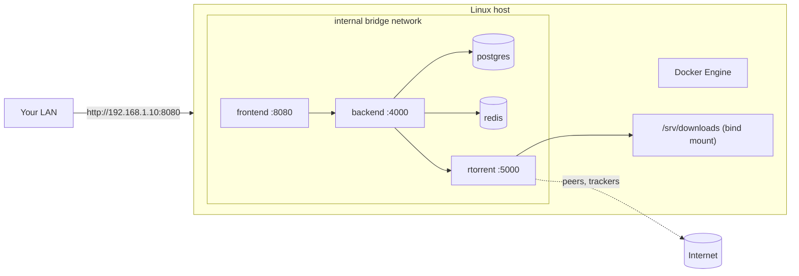

import Tabs from '@theme/Tabs';
import TabItem from '@theme/TabItem';

# Linux

## Overview

Linux is UltraTorrent's reference platform — it is developed, tested and deployed on it. The delta from the [Docker Compose guide](/install/docker-compose) is small: install Docker, then follow that guide verbatim.

A **manual, from-source** install is also documented at the bottom. It exists for development. Use Docker for anything you care about.

:::tip Watch this tutorial
_Video coming soon._
:::

## Prerequisites

- A 64-bit Linux host (x86-64 or ARM64) you can `sudo` on.
- Outbound internet access (to pull base images and dependencies).
- ~2 GB free RAM and a couple of GB of disk.

## Requirements

| | Minimum | Comfortable |
|---|---------|-------------|
| CPU | 2 cores | 4 cores |
| RAM | 2 GB free (the build is the peak) | 4 GB+ |
| Disk (stack) | 3 GB | 10 GB |
| Disk (downloads) | your library | on its own filesystem |
| Kernel | anything Docker supports | — |

## Ports

Exactly as in the [main guide](/install/docker-compose#ports): only **8080** (the web UI) is published. Check it is free before you start:

```bash
sudo ss -tlnp | grep -E ':(8080|9696|8081)\b'
```

Anything listed → pick another `FRONTEND_PORT` in `.env`.

## Volumes

Docker-managed named volumes live under `/var/lib/docker/volumes/`. You will almost certainly want to bind-mount **downloads** to a real path instead:

```bash
sudo mkdir -p /srv/downloads
sudo chown -R 1000:1000 /srv/downloads
```

```yaml
# docker-compose.override.yml
volumes:
  downloads:
    driver: local
    driver_opts:
      type: none
      o: bind
      device: /srv/downloads
```

## Permissions

- Add yourself to the `docker` group so you do not need `sudo` for every command (and log out/in for it to take effect).
- The download folder must be writable by **uid 1000** (the backend's `node` user and the engines' default `PUID`).
- Sharing the folder with another app (Plex, Jellyfin)? Set `PUID`/`PGID` to *that* user rather than chowning the folder — see [Permissions](/install/docker-compose#permissions).

## Network



## Step-by-step

### 1. Install Docker Engine + Compose

<Tabs groupId="distro">
<TabItem value="ubuntu" label="Ubuntu / Debian" default>

The official convenience script installs Engine **and** the Compose plugin:

```bash
curl -fsSL https://get.docker.com | sudo sh
sudo usermod -aG docker "$USER"     # then log out and back in
```

:::caution Do not use the distro `docker.io` / `docker-compose` packages
They are frequently old, and the legacy `docker-compose` (hyphen) script does not implement everything this stack uses. You want `docker compose` (space).
:::

</TabItem>
<TabItem value="fedora" label="Fedora">

```bash
sudo dnf -y install dnf-plugins-core
sudo dnf config-manager --add-repo https://download.docker.com/linux/fedora/docker-ce.repo
sudo dnf -y install docker-ce docker-ce-cli containerd.io docker-buildx-plugin docker-compose-plugin
sudo systemctl enable --now docker
sudo usermod -aG docker "$USER"     # then log out and back in
```

</TabItem>
<TabItem value="rocky" label="Rocky / AlmaLinux / RHEL">

```bash
sudo dnf -y install dnf-plugins-core
sudo dnf config-manager --add-repo https://download.docker.com/linux/centos/docker-ce.repo
sudo dnf -y install docker-ce docker-ce-cli containerd.io docker-buildx-plugin docker-compose-plugin
sudo systemctl enable --now docker
sudo usermod -aG docker "$USER"     # then log out and back in
```

**SELinux** is enforcing by default. If a bind-mounted downloads folder gives permission errors inside the container despite correct ownership, relabel it:

```bash
sudo chcon -Rt svirt_sandbox_file_t /srv/downloads
```

:::caution Community-verified
The SELinux relabel above is the standard remedy for bind-mount denials on RHEL-family hosts, but it is not exercised by this project's own deployments. Check `sudo ausearch -m avc -ts recent` if you hit denials.
:::

</TabItem>
<TabItem value="arch" label="Arch">

```bash
sudo pacman -S --needed docker docker-compose
sudo systemctl enable --now docker
sudo usermod -aG docker "$USER"     # then log out and back in
```

:::caution Community-verified
Arch is not part of this project's own deployments. Docker behaves normally there; the stack has no distro-specific requirements.
:::

</TabItem>
</Tabs>

Verify:

```bash
docker --version
docker compose version        # must be v2.x
docker run --rm hello-world
```

### 2. Install UltraTorrent

From here, follow the **[Docker Compose guide](/install/docker-compose)** exactly — nothing on Linux deviates from it.

```bash
git clone https://github.com/damirabal/ultratorrent-core.git
cd ultratorrent-core
cp .env.example .env

for k in JWT_ACCESS_SECRET JWT_REFRESH_SECRET ENCRYPTION_KEY; do
  sed -i "s|^$k=.*|$k=$(openssl rand -base64 48 | tr -d '\n')|" .env
done

nano .env       # set POSTGRES_PASSWORD (alphanumeric!) and ADMIN_PASSWORD

docker compose --profile rtorrent up -d --build
docker compose exec backend npx prisma db seed
```

Open `http://<host-ip>:8080` and sign in as `admin`.

### 3. Start on boot

Nothing to do — `restart: unless-stopped` on every service plus an enabled Docker daemon means the stack comes back after a reboot:

```bash
sudo systemctl enable docker
```

Confirm with an actual reboot; it is the only test that counts.

## Verification

```bash
docker compose ps
curl -s http://localhost:8080/api/system/live
curl -s http://localhost:8080/api/system/version
```

```text
NAME                       STATUS                    PORTS
ultratorrent-backend-1     Up 2 minutes (healthy)    4000/tcp
ultratorrent-frontend-1    Up 2 minutes (healthy)    0.0.0.0:8080->8080/tcp
ultratorrent-postgres-1    Up 2 minutes (healthy)    5432/tcp
ultratorrent-redis-1       Up 2 minutes (healthy)    6379/tcp
ultratorrent-rtorrent-1    Up 2 minutes (healthy)    5000/tcp
```


:::note Screenshot needed
The UltraTorrent dashboard immediately after a fresh Linux install, with the engine connected and no torrents yet.
:::

## Reverse proxy

On a LAN, skip it. Exposing the box? Terminate TLS with NGINX, Caddy or Traefik — see [Reverse proxy](/install/reverse-proxy).

If a firewall is running, allow only what you need:

<Tabs groupId="firewall">
<TabItem value="ufw" label="ufw (Ubuntu/Debian)" default>

```bash
sudo ufw allow from 192.168.1.0/24 to any port 8080 proto tcp   # LAN only
sudo ufw enable
```

</TabItem>
<TabItem value="firewalld" label="firewalld (Fedora/Rocky)">

```bash
sudo firewall-cmd --permanent --add-port=8080/tcp
sudo firewall-cmd --reload
```

</TabItem>
</Tabs>

## HTTPS

See [TLS](/install/tls). On a LAN-only Linux box, plain HTTP is a defensible choice; the moment it is reachable from the internet, it is not.

## Updates

```bash
cd ultratorrent-core
docker compose exec -T postgres pg_dump -U ultratorrent ultratorrent > backup-$(date +%F).sql
git pull
docker compose --profile rtorrent up -d --build
docker compose exec backend npx prisma db seed
```

Full procedure and rollback: [Upgrading](/install/upgrading).

## Backups

```bash
docker compose exec -T postgres pg_dump -U ultratorrent ultratorrent > /backups/ut-$(date +%F).sql
cp .env /backups/
```

A `systemd` timer or a cron line is enough. See [Backup & restore](/operate/backup).

## Manual install (from source) {#manual-install-from-source}

For development, or a host where Docker is not an option. **This is not the supported production path.**

### Prerequisites

| Requirement | Version |
|-------------|---------|
| **Node.js** | **20 LTS** (pinned by `.nvmrc`; `engines` requires ≥20) |
| **PostgreSQL** | 14+ |
| **Redis** | 6+ |
| **rTorrent** | any recent build reachable over SCGI — optional to boot, required to actually download |

:::warning Get a clean Node 20
Do **not** rely on a distro `nodejs`/`npm` package — a mismatched distro npm is a classic source of `Cannot find module 'semver'` and Prisma version errors. Use **nvm** (`nvm install 20 && nvm use 20`) or **NodeSource**. Avoid non-LTS Node.
:::

### Steps

```bash
# 1. Clone and install (npm workspaces — always install from the repo root)
git clone https://github.com/damirabal/ultratorrent-core.git
cd ultratorrent-core
npm install

# 2. Backend environment
cp .env.example apps/backend/.env
```

`.env.example` is written for **Docker**, where the database host is the `postgres` service name. For a manual install, point it at your local services:

```dotenv
DATABASE_URL=postgresql://ultratorrent:<PASSWORD>@localhost:5432/ultratorrent?schema=public
REDIS_HOST=localhost
```

Easiest way to get PostgreSQL and Redis without installing them:

```bash
docker compose -f docker-compose.dev.yml up -d     # publishes 5432 and 6379 to the host
```

```bash
# 3. Prisma: generate, migrate, seed
npm run prisma:generate
npm run prisma:migrate      # prisma migrate deploy
npm run prisma:seed         # permissions, roles, admin, settings

# 4. Run both apps in dev mode
npm run dev
#   backend  → http://localhost:4000   (Swagger at /api/docs outside production)
#   frontend → http://localhost:5173   (proxies /api and /ws to the backend)
```

:::info The dev seed has a fallback password
Without `ADMIN_PASSWORD` set, a local dev seed falls back to a well-known development password (`changeme123!`). Change it immediately. In production `ADMIN_PASSWORD` is **required** and there is no fallback.
:::

Updating a manual install:

```bash
git pull
nvm use                     # if the required Node changed
npm install
npm run prisma:generate
npm run prisma:migrate
npm run prisma:seed
npm run build
# restart however you run it (systemd / pm2 / nohup)
```

## Troubleshooting

| Symptom | Cause | Fix |
|---------|-------|-----|
| `permission denied … /var/run/docker.sock` | You are not in the `docker` group | `sudo usermod -aG docker "$USER"`, then **log out and back in** |
| `docker compose` → *command not found* | Only the legacy `docker-compose` is installed | Install the Compose **plugin** (`docker-compose-plugin`, or the get.docker.com script) |
| Port 8080 already in use | Another service owns it | `sudo ss -tlnp \| grep 8080`, then set `FRONTEND_PORT` in `.env` |
| The build is OOM-killed | Under ~2 GB free RAM | Free memory or add swap, then rebuild |
| Bind-mounted downloads unwritable despite correct `chown` | **SELinux** (Fedora/Rocky/RHEL) | `sudo chcon -Rt svirt_sandbox_file_t /srv/downloads` |
| Container cannot resolve DNS | Host DNS or a VPN interfering with Docker's bridge | Set `dns:` on the service, or fix `/etc/docker/daemon.json` |
| Stack does not come back after reboot | Docker is not enabled | `sudo systemctl enable docker` |
| (Manual) `Prisma only supports Node.js >= 16.13` | Node too old | Install Node 20 via nvm or NodeSource |
| (Manual) `Cannot find module 'semver'` from `/usr/share/nodejs/npm` | Broken distro npm | Remove the distro `nodejs`/`npm` packages; use nvm or NodeSource |
| (Manual) `P1001: Can't reach database server at postgres:5432` | `DATABASE_URL` still points at the Docker service name | Change the host to `localhost` |

More: [Troubleshooting](/operate/troubleshooting).

## Best practices

- Use the **Compose plugin**, never the legacy `docker-compose` script.
- **Bind-mount downloads** to a dedicated filesystem — a full root partition takes the whole stack down.
- Keep the box **patched**: `unattended-upgrades` (Debian/Ubuntu) or `dnf-automatic` (Fedora/Rocky).
- **Firewall it.** Only 8080 on the LAN — or only 80/443 if a proxy fronts it.
- Put `pg_dump` on a **timer**, not in your memory.
- Prefer Docker over the manual install for anything you rely on.
- If a media server shares the download folder, set `PUID`/`PGID` rather than chowning it.

## FAQ

**Which distro should I use?**
Any Docker-supported one. Ubuntu LTS and Debian stable are the least surprising.

**Does it work on ARM (Raspberry Pi, ARM server)?**
The base images are multi-arch, so ARM64 builds. Be aware the build needs ~2 GB of RAM — a 2 GB Pi is marginal, and a 1 GB one will not make it.

**Can I run it rootless?**
Rootless Docker is not something this project tests. The rTorrent entrypoint already handles being started as a non-root user, but expect to work through volume-permission issues yourself.

**Do I need `sudo` for every command?**
No — add yourself to the `docker` group.

**Can I use Podman?**
Not tested. The Compose file uses profiles, healthcheck conditions and named-volume bind options; `podman compose` support for those varies.

## Checklist

- [ ] Docker Engine installed and enabled at boot
- [ ] `docker compose version` prints **v2.x**
- [ ] Current user in the `docker` group (logged out and back in)
- [ ] Port 8080 free, or `FRONTEND_PORT` changed
- [ ] Downloads folder created, owned by `1000:1000` (or by `PUID`/`PGID`)
- [ ] `.env` filled — alphanumeric `POSTGRES_PASSWORD`, three distinct secrets
- [ ] `docker compose --profile rtorrent up -d --build` completed
- [ ] Seed run once
- [ ] Logged in, engine connected, test torrent downloading
- [ ] Firewall restricts 8080 to the LAN
- [ ] Backups scheduled
- [ ] Survives a reboot

## See also

- [Docker Compose install](/install/docker-compose) — the authoritative guide
- [Reverse proxy](/install/reverse-proxy) · [TLS](/install/tls) · [Upgrading](/install/upgrading)
- [Cloud / VPS](/install/platforms/cloud) — a Linux box on someone else's hardware
- [Proxmox](/install/platforms/proxmox) — a Linux VM on your own
- [Performance](/operate/performance) · [Security](/operate/security)
