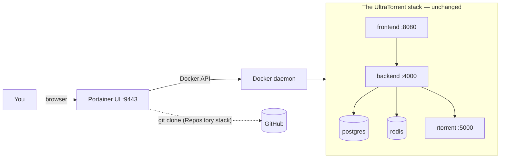

import Tabs from '@theme/Tabs';
import TabItem from '@theme/TabItem';

# Portainer

## Overview

Portainer is a web UI for Docker — it does not change how UltraTorrent runs, it just gives you a place to click. If you already run Portainer, deploying UltraTorrent as a **Stack from a Git repository** is the tidiest option: Portainer clones the repo, gets the **build context** it needs, and redeploys on demand.

The one thing Portainer cannot do for you is the **one-time database seed**. You will run that from a container console (which Portainer does provide).

:::caution Community-verified
Portainer is **not** part of this project's own deployments. The UltraTorrent specifics below are grounded in the repo; the Portainer flow follows its documented Stacks feature. Menu labels move between Portainer versions — adapt as needed.
:::

:::tip Watch this tutorial
_Video coming soon._
:::

## Prerequisites

- A running Portainer instance (CE or BE) managing a **Docker standalone** environment.
- The environment's Docker daemon can reach GitHub (to clone) and Docker Hub (to pull base images).
- ~2 GB free RAM on the Docker host for the build.

:::warning "Web editor" alone is not enough
Pasting `docker-compose.yml` into Portainer's **Web editor** gives Compose the file but **not the build context** — and UltraTorrent's backend, frontend and rTorrent images are **built from source**. The build will fail on the missing context. Use the **Repository** method.
:::

## Requirements

Portainer itself is trivial (~100 MB RAM). The requirement is on the underlying Docker host: 2 cores, ~2 GB free RAM for the build, ~3 GB of disk for the images.

## Ports

Portainer's own UI is on **9443** (HTTPS) or **9000** — no conflict with UltraTorrent's **8080**. Verify 8080 is free on the host, or set `FRONTEND_PORT` in the stack's environment variables.

## Volumes

Portainer creates the same named volumes the Compose file declares — `postgres_data`, `redis_data`, `downloads`, and any profile volumes. You can browse them under **Volumes**.

To bind downloads to a real host folder, add the override **in the stack**. With the Repository method the easiest route is Portainer's **additional compose file** field (see step 3), pointing at a `docker-compose.override.yml` you keep in your own fork — or just edit the stack after the first deploy.

## Permissions

Unchanged from the [main guide](/install/docker-compose#permissions): the backend runs as uid 1000, the engines honour `PUID`/`PGID`. Set those as **stack environment variables** in the Portainer UI rather than in a `.env` file — Portainer manages the environment for you.

## How Portainer fits



Portainer sits *beside* the stack, not in front of it. Remove Portainer tomorrow and UltraTorrent keeps running.

## Step-by-step

### 1. Create the stack

**Stacks → Add stack**

- **Name:** `ultratorrent`
- **Build method:** **Repository**

### 2. Point it at the repo

| Field | Value |
|-------|-------|
| Repository URL | `https://github.com/damirabal/ultratorrent-core` |
| Repository reference | `refs/heads/main` |
| Compose path | `docker-compose.yml` |
| Authentication | off (public repo) |


:::note Screenshot needed
Portainer **Stacks → Add stack**, **Repository** tab, with the repository URL and `docker-compose.yml` compose path filled in.
:::

### 3. Enable the engine profile

The bundled engines sit behind Compose **profiles**, and a profile-less deploy brings up no engine at all.

If your Portainer version exposes a **profiles** field, set `rtorrent` (or `qbittorrent`) there. If it does not, set the environment variable in the next step:

```dotenv
COMPOSE_PROFILES=rtorrent
```

:::caution Community-verified
`COMPOSE_PROFILES` is a standard Compose environment variable and is the usual way to select profiles when the UI has no profile field. Confirm your Portainer version passes stack environment variables through to the Compose invocation.
:::

### 4. Set the environment variables

In the stack's **Environment variables** section — click **Advanced mode** to paste them all at once:

```dotenv
POSTGRES_PASSWORD=lettersAndNumbers123
ADMIN_PASSWORD=the-password-you-log-in-with
JWT_ACCESS_SECRET=<openssl rand -base64 48>
JWT_REFRESH_SECRET=<openssl rand -base64 48>
ENCRYPTION_KEY=<openssl rand -base64 48>
FRONTEND_PORT=8080
CORS_ORIGIN=http://localhost:8080
COMPOSE_PROFILES=rtorrent
TZ=Etc/UTC
```

Generate each secret on any machine with:

```bash
openssl rand -base64 48
```

Rules that will bite you if you ignore them:

- `POSTGRES_PASSWORD` must be **alphanumeric** — the derived `DATABASE_URL` is not URL-encoded.
- `ENCRYPTION_KEY` must **differ** from `JWT_ACCESS_SECRET`, and both must be ≥32 characters. The backend refuses to boot otherwise.

:::danger Portainer stores these in plain text
Anyone with access to the Portainer stack can read your secrets. Restrict who can see the environment, and treat Portainer's own login as a high-value credential.
:::

### 5. Deploy

**Deploy the stack.** Portainer clones the repo and runs Compose, which **builds** the images — expect several minutes on the first deploy, and no output while it works.

### 6. Seed the database — once

Portainer has no "run a one-off command" button, but it has a console.

**Containers → `ultratorrent-backend-1` → Console → Connect** (command: `/bin/sh`), then:

```sh
npx prisma db seed
```


:::note Screenshot needed
Portainer **Containers → backend → Console**, connected as `/bin/sh`, showing `npx prisma db seed` completing successfully.
:::

### 7. Log in and add the engine

Open `http://<docker-host>:8080` and sign in as **`admin`** with your `ADMIN_PASSWORD`.

**Infrastructure → Engines → Add engine** → rTorrent · SCGI over TCP · host `rtorrent` · port `5000` · Default engine on → **Test connection** → **Add engine**.

Then **Settings → Default Root Path** → `/downloads`.

## Verification

In Portainer: **Stacks → ultratorrent** should show every container **running**, and the backend and frontend **healthy**.

From a shell on the Docker host (or Portainer's console):

```bash
curl -s http://localhost:8080/api/system/live
curl -s http://localhost:8080/api/system/version
```

The backend's log (**Containers → backend → Logs**) should show migrations applied and Nest listening — no `insecure secret configuration`, no `P1000`.

## Reverse proxy

Unchanged. Portainer is not a reverse proxy. Point NGINX / Traefik / Caddy / NPM at `http://<docker-host>:8080` and **enable WebSocket support** — see [Reverse proxy](/install/reverse-proxy).

If you already run Traefik, add its labels to the `frontend` service by editing the stack, or via an additional compose file.

## HTTPS

Terminate TLS at your proxy, not at Portainer. See [TLS](/install/tls).

## Updates

**Stacks → ultratorrent → Pull and redeploy**, with **Re-pull image** enabled — Portainer re-clones the repository ref and rebuilds.

**Then re-run the seed** from the backend console (`npx prisma db seed`) so new permissions and settings appear.

:::danger Back up before you redeploy
Migrations are **forward-only** and apply automatically on backend start. Take a dump first — from the postgres container's console:

```sh
pg_dump -U ultratorrent ultratorrent > /tmp/backup.sql
```

…and copy it off the host (`docker cp`). See [Upgrading](/install/upgrading).
:::

Portainer BE's **GitOps / automatic updates** can poll the repository and redeploy on a new commit. Convenient — and a good way to have an unattended forward-only migration applied while you sleep. Only enable it if you have automated backups.

## Backups

Portainer does not back anything up. From the postgres container's console:

```sh
pg_dump -U ultratorrent ultratorrent > /tmp/ultratorrent.sql
```

```bash
docker cp ultratorrent-postgres-1:/tmp/ultratorrent.sql ./ultratorrent-$(date +%F).sql
```

Also export your stack's environment variables somewhere safe — **especially `ENCRYPTION_KEY`**, without which stored 2FA secrets are unrecoverable. See [Backup & restore](/operate/backup).

## Troubleshooting

| Symptom | Cause | Fix |
|---------|-------|-----|
| Deploy fails: build context / `failed to read dockerfile` | You used the **Web editor** instead of **Repository** — Compose got the YAML but not the source tree | Recreate the stack with the **Repository** method |
| The stack comes up but **there is no rTorrent container** | Profiles were not passed — a profile-less deploy skips optional services | Set `COMPOSE_PROFILES=rtorrent` (or use the profiles field) and redeploy |
| Backend exits: *"insecure secret configuration"* | `JWT_ACCESS_SECRET` / `ENCRYPTION_KEY` missing, too short, or identical | Fix the stack's environment variables and redeploy |
| Backend crash-loops with **`P1000`** | The `postgres_data` volume was created with a different password (Postgres sets it only on first init) | If there is no real data: delete the stack **and its volumes**, then redeploy. Keep the password **alphanumeric** |
| Deploy hangs for many minutes | The first build is genuinely slow, and Portainer shows no build output | Watch the host: `docker compose logs -f` |
| *"Invalid username or password"* at first login | You never ran the seed | Backend console → `npx prisma db seed` |
| Torrents page: *"Could not load torrents"* | No engine registered, or the profile is off | Register the engine; confirm the rTorrent container exists |
| Redeploy did not pick up new code | **Re-pull / re-clone** was not enabled | Use **Pull and redeploy** with re-pull on |
| Secrets visible to other Portainer users | Portainer stores stack env vars in plain text | Restrict access; treat the Portainer login as high-value |

More: [Troubleshooting](/operate/troubleshooting).

## Best practices

- **Repository method, always.** The Web editor cannot build from source.
- **Set `COMPOSE_PROFILES`** or you get a stack with no torrent engine and a confusing "Could not load torrents".
- **Generate secrets off-box** (`openssl rand -base64 48`) and paste them in; do not invent them by hand.
- **Alphanumeric `POSTGRES_PASSWORD`.**
- **Back up before every redeploy** — migrations are forward-only and Portainer will happily apply them.
- **Be careful with GitOps auto-update** unless backups are automated.
- **Lock down Portainer itself** — it holds your database and admin passwords in plain text and can control every container on the host.
- **Do not use Portainer as a reverse proxy.** It is not one.

## FAQ

**Can I just paste the compose file into the Web editor?**
No — the images are built from source, and the editor gives Compose no build context.

**Where do I put `.env`?**
You do not. Use Portainer's stack **environment variables**; they serve the same purpose.

**How do I run the seed without SSH?**
The backend container's **Console** tab: `npx prisma db seed`.

**Does Portainer's "Update the stack" upgrade UltraTorrent?**
Only if it re-clones the repository ref and rebuilds. Use **Pull and redeploy** with re-pull enabled — and re-seed afterwards.

**Can I use Portainer's Kubernetes environments?**
No. UltraTorrent ships a Compose stack; there are no Kubernetes manifests.

**Portainer Agent on a remote host?**
Fine — the stack deploys to the remote Docker daemon exactly the same way.

## Checklist

- [ ] Stack created with the **Repository** method (not Web editor)
- [ ] Compose path `docker-compose.yml`
- [ ] `COMPOSE_PROFILES=rtorrent` (or the profiles field) set
- [ ] Environment variables set: alphanumeric `POSTGRES_PASSWORD`, `ADMIN_PASSWORD`, three **distinct** secrets
- [ ] `ENCRYPTION_KEY` ≠ `JWT_ACCESS_SECRET`, both ≥32 chars
- [ ] `FRONTEND_PORT` free on the Docker host
- [ ] Stack deployed; every container running and healthy
- [ ] Seed run once from the backend console
- [ ] Logged in as `admin`; engine added and connected
- [ ] Default Root Path set to `/downloads`
- [ ] A `pg_dump` taken and copied off the host
- [ ] Portainer access restricted (it holds your secrets in plain text)

## See also

- [Docker Compose install](/install/docker-compose) — the authoritative guide, including what every variable means
- [Environment variables](/reference/environment)
- [Reverse proxy](/install/reverse-proxy) · [TLS](/install/tls) · [Upgrading](/install/upgrading)
- [Troubleshooting](/operate/troubleshooting) · [Security](/operate/security)
