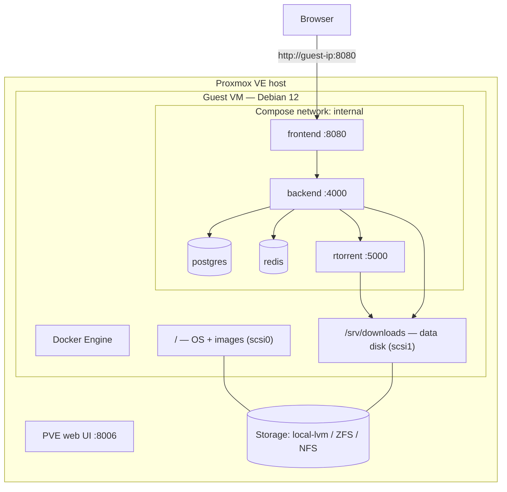

import Tabs from '@theme/Tabs';
import TabItem from '@theme/TabItem';

# Proxmox VE

## Overview

**Proxmox itself does not run UltraTorrent.** Proxmox is a hypervisor; you create a guest, install Docker inside it, and then follow the [Docker Compose guide](/install/docker-compose) as if it were any [Linux box](/install/platforms/linux).

The only real decision is **VM or LXC**:

| | **VM (QEMU/KVM)** — recommended | **LXC container** |
|---|---|---|
| Docker support | Normal, unmodified, boring | Requires nesting; historically fiddly |
| Isolation | Full | Shared kernel |
| Overhead | ~1 GB RAM for the guest OS | Minimal |
| Snapshots / backups | Excellent (`vzdump`) | Excellent |
| Risk of surprises | Low | Moderate |

**Take the VM.** The RAM you save with LXC is not worth the class of bug you buy.

:::caution Community-verified
Proxmox is **not** one of this project's own deployment targets. The UltraTorrent parts below are grounded in the repo; the Proxmox parts follow standard PVE practice. Verify against your PVE version.
:::

:::tip Watch this tutorial
_Video coming soon._
:::

## Prerequisites

- Proxmox VE 7 or 8, with an ISO or template store.
- A Debian 12 / Ubuntu 22.04+ ISO (or the cloud image), or a Debian LXC template.
- Enough free RAM to give the guest at least 4 GB.

## Requirements

Size the **guest**, not the host:

| Resource | Minimum | Comfortable |
|----------|---------|-------------|
| vCPU | 2 | 4 |
| RAM | **4 GB** (2 GB of it free for the build) | 6–8 GB |
| Disk (OS + images) | 20 GB | 32 GB |
| Disk (downloads) | a second, large virtual disk — or a passthrough/NFS mount | — |

:::warning Do not put downloads on the OS disk
A filling root disk takes the whole stack down and can corrupt the database. Give downloads their own virtual disk, or mount storage from elsewhere.
:::

## Ports

Nothing Proxmox-specific. The guest publishes **8080**; the Proxmox web UI is on **8006** — no conflict. Reach it at `http://<guest-ip>:8080`.

## Volumes



Inside the guest, bind the downloads volume to the data disk:

```yaml
# docker-compose.override.yml
volumes:
  downloads:
    driver: local
    driver_opts:
      type: none
      o: bind
      device: /srv/downloads
```

## Permissions

Ordinary Linux rules apply inside the guest — the download folder must be writable by **uid 1000** (or by whatever `PUID`/`PGID` you set). See [Permissions](/install/docker-compose#permissions).

If downloads live on an **NFS share** from a NAS, remember NFS maps UIDs numerically: uid 1000 in the guest must be able to write on the NAS. Match the UIDs, or export with the right `anonuid`/`anongid`.

## Step-by-step

<Tabs groupId="pve-guest">
<TabItem value="vm" label="VM (recommended)" default>

### 1. Create the VM

**Create VM**, with:

| Tab | Setting |
|-----|---------|
| OS | Debian 12 (or Ubuntu 22.04+) ISO |
| System | Machine `q35`, BIOS `OVMF (UEFI)` or SeaBIOS — either is fine; **QEMU Guest Agent: on** |
| Disks | `scsi0` **32 GB** (OS + Docker images), controller **VirtIO SCSI single**, **Discard** on for thin storage |
| CPU | **4 cores**, type `host` (best performance) |
| Memory | **4096 MB** minimum. Turn **ballooning off** if you want the build to have predictable RAM |
| Network | `virtio`, on your LAN bridge |

Add a **second disk** for downloads — `scsi1`, as large as your library needs.

### 2. Install Debian, then Docker

Install the OS as usual, then inside the guest:

```bash
curl -fsSL https://get.docker.com | sudo sh
sudo usermod -aG docker "$USER"     # log out and back in
sudo apt install -y qemu-guest-agent && sudo systemctl enable --now qemu-guest-agent
```

### 3. Mount the data disk

```bash
sudo mkfs.ext4 /dev/sdb
sudo mkdir -p /srv/downloads
echo '/dev/sdb /srv/downloads ext4 defaults 0 2' | sudo tee -a /etc/fstab
sudo mount -a
sudo chown -R 1000:1000 /srv/downloads
```

(Confirm the device name with `lsblk` first — `/dev/sdb` is an assumption, not a promise.)

### 4. Install UltraTorrent

Follow **[Linux](/install/platforms/linux)** / **[Docker Compose](/install/docker-compose)** exactly. Nothing here is Proxmox-specific any more:

```bash
git clone https://github.com/damirabal/ultratorrent-core.git
cd ultratorrent-core
cp .env.example .env
for k in JWT_ACCESS_SECRET JWT_REFRESH_SECRET ENCRYPTION_KEY; do
  sed -i "s|^$k=.*|$k=$(openssl rand -base64 48 | tr -d '\n')|" .env
done
nano .env                    # POSTGRES_PASSWORD (alphanumeric), ADMIN_PASSWORD
nano docker-compose.override.yml   # bind downloads to /srv/downloads

docker compose --profile rtorrent up -d --build
docker compose exec backend npx prisma db seed
```

</TabItem>
<TabItem value="lxc" label="LXC (advanced)">

Docker inside LXC works, but it is a configuration you have to earn.

### 1. Create a privileged container

**Create CT**, Debian 12 template, and — critically — **uncheck "Unprivileged container"**.

| Setting | Value |
|---------|-------|
| Cores | 4 |
| Memory | 4096 MB |
| Swap | 2048 MB |
| Root disk | 32 GB |
| Features | **Nesting: ✅**, **keyctl: ✅**, **FUSE: ✅** |

### 2. Enable the features on the CT config

If the UI does not expose them, edit `/etc/pve/lxc/<CTID>.conf` on the **host**:

```ini
features: nesting=1,keyctl=1,fuse=1
```

Then restart the container.

### 3. Install Docker inside the CT

```bash
curl -fsSL https://get.docker.com | sh
```

### 4. Give it storage

Bind-mount a host directory into the CT (on the **Proxmox host**):

```bash
pct set <CTID> -mp0 /tank/downloads,mp=/srv/downloads
```

### 5. Install UltraTorrent

Exactly as in the VM tab.

:::danger Unprivileged LXC + Docker + volume permissions
Unprivileged containers shift UIDs (guest uid 1000 → host uid 101000+), which turns every bind-mount permission question into a puzzle, and Docker-in-unprivileged-LXC has a long history of storage-driver problems. If you insist on LXC, use a **privileged** one. If any of this sounds unappealing: **use the VM**.
:::

:::caution Community-verified
Docker-in-LXC is a well-known Proxmox community pattern, not an officially blessed one, and it is **not** tested by this project. Treat it as advanced.
:::

</TabItem>
</Tabs>

### Finally

Open `http://<guest-ip>:8080`, sign in as **`admin`**, and add the engine: **Infrastructure → Engines → Add engine** → rTorrent · SCGI over TCP · host `rtorrent` · port `5000` → **Test connection** → **Add engine**. Then **Settings → Default Root Path** → `/downloads`.

## Verification

Inside the guest:

```bash
docker compose ps
curl -s http://localhost:8080/api/system/live
df -h /srv/downloads          # the data disk, not the root disk
```

```text
NAME                       STATUS                    PORTS
ultratorrent-backend-1     Up 2 minutes (healthy)    4000/tcp
ultratorrent-frontend-1    Up 2 minutes (healthy)    0.0.0.0:8080->8080/tcp
ultratorrent-postgres-1    Up 2 minutes (healthy)    5432/tcp
ultratorrent-redis-1       Up 2 minutes (healthy)    6379/tcp
ultratorrent-rtorrent-1    Up 2 minutes (healthy)    5000/tcp
```

From the Proxmox UI, the guest should show a healthy QEMU Guest Agent (VM) and stable memory use.


:::note Screenshot needed
Proxmox VE **guest → Summary**, showing the UltraTorrent VM running with its CPU/RAM/disk graphs.
:::

## Reverse proxy

Two clean patterns:

1. **Proxy inside the same guest** — NGINX or Caddy alongside Docker. Simple.
2. **A dedicated proxy guest** (a small Caddy/Traefik/NPM VM or LXC) fronting several homelab services, pointing at `http://<ut-guest-ip>:8080`. This is the usual homelab shape.

Either way, WebSocket upgrade headers are mandatory: [Reverse proxy](/install/reverse-proxy).

## HTTPS

Standard Let's Encrypt at the proxy. For a LAN-only homelab, **DNS-01** gets you a real certificate with no inbound ports — see [TLS](/install/tls).

## Updates

Inside the guest, the normal flow:

```bash
cd ultratorrent-core
docker compose exec -T postgres pg_dump -U ultratorrent ultratorrent > backup-$(date +%F).sql
git pull
docker compose --profile rtorrent up -d --build
docker compose exec backend npx prisma db seed
```

**Proxmox gives you a second safety net: snapshot the guest first.** Right-click the guest → **Snapshot → Take Snapshot**. If the upgrade goes badly, roll the *whole guest* back — which sidesteps the forward-only-migration problem entirely.

That is a genuinely nicer rollback story than bare metal. It still does not excuse skipping the `pg_dump`. See [Upgrading](/install/upgrading).

## Backups

Proxmox's **`vzdump`** backs up the entire guest — OS, Docker volumes, database and all — on a schedule, to a backup store.

**Datacenter → Backup → Add**, targeting your guest, nightly.

:::warning A vzdump of a running guest is crash-consistent
Snapshot-mode backups do not quiesce PostgreSQL. They *usually* restore fine (Postgres is crash-safe), but a `pg_dump` is a clean, logical backup you can restore selectively. **Do both.**
:::

```bash
docker compose exec -T postgres pg_dump -U ultratorrent ultratorrent > /srv/backups/ut-$(date +%F).sql
```

See [Backup & restore](/operate/backup).

## Troubleshooting

| Symptom | Cause | Fix |
|---------|-------|-----|
| Docker will not start in an LXC | Nesting/keyctl not enabled, or the container is unprivileged | Set `features: nesting=1,keyctl=1,fuse=1` and use a **privileged** CT — or move to a VM |
| Bind-mount permissions are nonsense in an LXC | Unprivileged UID shifting (guest 1000 → host 101000) | Use a privileged CT, or a VM |
| Build is OOM-killed | The guest has too little RAM, or ballooning reclaimed it | 4 GB, ballooning off during the build |
| The guest's root disk fills up | Downloads (or old Docker images) on the OS disk | Put downloads on a second disk; `docker image prune -f` |
| Poor disk performance | IDE/SATA controller instead of VirtIO | Use **VirtIO SCSI single**, and enable Discard on thin storage |
| Downloads on NFS are unwritable | UID mismatch between guest and NAS | Match uid 1000, or export with the right `anonuid`/`anongid` |
| VM clock drifts, TLS/tracker errors | No guest agent / NTP | Install `qemu-guest-agent`; enable time sync |
| Guest does not come back after a host reboot | Start-at-boot not set | Enable **Start at boot** on the guest |
| rTorrent restarts periodically | The known upstream rTorrent 0.9.8 crash | Nothing is lost. Reduce active torrents, or use the qBittorrent profile |

More: [Troubleshooting](/operate/troubleshooting).

## Best practices

- **Use a VM.** LXC saves ~1 GB of RAM and costs you a category of bug.
- **Snapshot the guest before every UltraTorrent upgrade** — the best rollback available on any platform.
- **Still take the `pg_dump`.** Crash-consistent is not the same as clean.
- **Downloads on their own disk**, never the OS disk.
- **VirtIO everywhere** — SCSI single controller, virtio net.
- **`vzdump` on a schedule**, to storage that is not the host you are backing up.
- **Enable Start at boot** on the guest.
- **CPU type `host`** unless you need live migration across dissimilar hardware.
- Give the guest **4 GB**; the build is the peak, not steady state.

## FAQ

**Can I run Docker on the Proxmox host directly?**
You can. Do not. The hypervisor should host guests, not applications — you will fight `apt` and the PVE kernel forever, and a bad Docker network config can take out your management interface.

**VM or LXC, really?**
VM. See the table at the top.

**How much RAM does the guest need?**
4 GB comfortably. The build wants ~2 GB free; steady-state is much lighter.

**Can I pass through a whole disk for downloads?**
Yes — `qm set <VMID> -scsi1 /dev/disk/by-id/...`. Common for a big spinning disk.

**Can I use a NAS share for downloads?**
Yes, over NFS or SMB mounted inside the guest. Mind the UID mapping.

**Does a Proxmox snapshot replace database backups?**
No. It is crash-consistent, whole-guest, and coarse. Keep `pg_dump`.

## Checklist

- [ ] Guest created (**VM** preferred) with 4 vCPU / 4 GB RAM / 32 GB OS disk
- [ ] Separate data disk (or NFS mount) for downloads, mounted and owned correctly
- [ ] Docker Engine + Compose v2 installed **inside the guest**
- [ ] `qemu-guest-agent` running (VM)
- [ ] LXC only: privileged, with `nesting=1,keyctl=1,fuse=1`
- [ ] UltraTorrent installed per the [Compose guide](/install/docker-compose)
- [ ] Downloads bound to the data disk, not the OS disk
- [ ] Seeded; logged in; engine connected
- [ ] **Start at boot** enabled on the guest
- [ ] `vzdump` scheduled
- [ ] `pg_dump` scheduled *as well*
- [ ] A snapshot taken before the first upgrade

## See also

- [Linux](/install/platforms/linux) — what you actually do inside the guest
- [Docker Compose install](/install/docker-compose) — the authoritative guide
- [TrueNAS SCALE](/install/platforms/truenas) — the other "run it in a VM" answer
- [Reverse proxy](/install/reverse-proxy) · [TLS](/install/tls) · [Upgrading](/install/upgrading)
- [Backup & restore](/operate/backup) · [Performance](/operate/performance)
