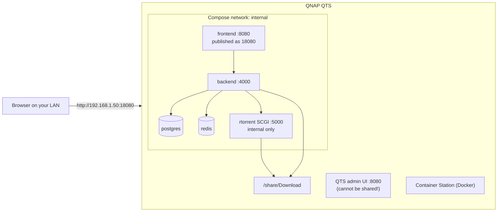

import Tabs from '@theme/Tabs';
import TabItem from '@theme/TabItem';

# QNAP NAS

## Overview

QNAP is a **well-grounded** target: UltraTorrent is deployed on it and the quirks below are real ones the project has hit.

A QNAP is a Docker host with three sharp edges:

1. **QNAP's own admin web UI already owns port 8080.** You *must* remap UltraTorrent's.
2. **The `docker` binary is not on your `PATH` by default** after SSH'ing in. This is the single most confusing QNAP gotcha.
3. Older Container Station versions ship the legacy **`docker-compose`** (hyphen) instead of `docker compose` (space).

Everything else is the [Docker Compose guide](/install/docker-compose), verbatim.

:::tip Watch this tutorial
_Video coming soon._
:::

## Prerequisites

- A QNAP NAS that supports Container Station (most models from the last several years).
- An **administrator** account.
- **Container Station** installed — App Center → search → Install. *This is what provides Docker.*
- The NAS's IP address, e.g. `192.168.1.50`.
- About 2 GB of free RAM and 10–15 minutes.

## Requirements

| | Minimum | Comfortable |
|---|---------|-------------|
| CPU | x86-64 or ARM64, 2 cores | 4 cores |
| RAM | **2 GB free during the build** | 4 GB+ |
| Disk | ~3 GB for images + your downloads | — |

:::warning ARM QNAP models
ARM-based QNAPs build fine (the base images are multi-arch) but slowly, and the low-RAM models will struggle with the build. If the build gets killed, that is memory, not architecture.
:::

## Ports

| Port | Owner | Notes |
|------|-------|-------|
| **8080** | **QNAP's own admin web UI** | Hard conflict. Remap UltraTorrent |
| 18080 | Your UltraTorrent UI | Suggested free port |
| 9696 | Prowlarr, if you enable that profile | Change with `PROWLARR_PORT` if taken |

```dotenv
# .env
FRONTEND_PORT=18080
```

Then open `http://<NAS-IP>:18080`.

:::caution Do not remap ports with an override file
Compose **appends** `ports:` entries, so an override adds a second mapping while the original 8080 one survives and still clashes with QTS. Change `FRONTEND_PORT` in `.env`.
:::

## Volumes

QNAP shares live under `/share/`. Container Station creates a `Container` share:

| Path | Use |
|------|-----|
| `/share/Container` | Where the source tree goes |
| `/share/Download` | The stock QNAP downloads share — a good target for your media |

```yaml
# docker-compose.override.yml
volumes:
  downloads:
    driver: local
    driver_opts:
      type: none
      o: bind
      device: /share/Download
```

:::info Your share path may differ
Some QNAP models expose shares as `/share/CACHEDEV1_DATA/<Share>` with `/share/<Share>` as a symlink. If a bind mount misbehaves, use the full `CACHEDEV` path. Check with `ls -l /share/`.
:::

## Permissions

Downloaded files are owned by **uid 1000** by default — the app's internal user. Everything inside UltraTorrent works with that.

To also manage those files from your QNAP login over SMB, set the share's permissions to allow your NAS user. If the folder belongs to **another app**, set `PUID`/`PGID` to that app's user instead of chowning it — see [Permissions](/install/docker-compose#permissions).

## Network



## Step-by-step

### 1. Install Container Station

**App Center** → search **Container Station** → **Install**. This is what gives the NAS Docker.


:::note Screenshot needed
QNAP App Center showing **Container Station** with its Install / Open button.
:::

### 2. Enable SSH

**Control Panel → Telnet / SSH** → tick **Allow SSH connection** → **Apply**.

:::caution Turn SSH back off afterwards
You need it for the build and the one-time seed. Disable it again once UltraTorrent is running.
:::

### 3. Connect

<Tabs groupId="os">
<TabItem value="win" label="Windows" default>

```powershell
ssh admin@192.168.1.50
```

</TabItem>
<TabItem value="mac" label="macOS / Linux">

```bash
ssh admin@192.168.1.50
```

</TabItem>
</Tabs>

The password stays invisible as you type — that is normal. First connection asks *"are you sure you want to continue"* → type `yes`.

### 4. Find `docker` — the QNAP gotcha {#docker-not-on-path}

Try it:

```bash
docker --version
```

If that says **`command not found`** — which is the normal state on QNAP — Container Station's Docker binaries are installed but not on your login `PATH`. Locate and add them:

```bash
# Find where Container Station put them (the path contains the app's install dir):
ls -d /share/*/.qpkg/container-station/usr/bin 2>/dev/null

# Add it to PATH for this session:
export PATH="$(ls -d /share/*/.qpkg/container-station/usr/bin | head -1):$PATH"

docker --version          # should now print a version
docker compose version    # v2.x, if your Container Station is recent enough
```

:::caution This path is version-dependent
The exact location of the Container Station binaries has moved between QTS releases. The `ls -d` glob above finds it on current versions; on older ones look under `/share/CACHEDEV1_DATA/.qpkg/container-station/`. If neither hits, `find / -name docker -type f 2>/dev/null | head` will.
:::

To make it stick across logins, append the `export PATH=...` line to `~/.profile`.

### 5. `docker compose` vs `docker-compose`

Newer Container Station ships **Compose v2** (`docker compose`, a space). Older ones ship only the legacy **`docker-compose`** (a hyphen).

```bash
docker compose version      # try this first
docker-compose version      # fall back to this
```

**Use whichever one works** for every command below. They accept the same flags here.

### 6. Get the source

```bash
cd /share/Container
git clone https://github.com/damirabal/ultratorrent-core.git
cd ultratorrent-core
```

**No `git`?** On your own computer, open the project's GitHub page → **Code → Download ZIP** → unzip → copy the `ultratorrent-core` folder into the `Container` share using **File Station** or over SMB. Then `cd /share/Container/ultratorrent-core`.

### 7. Configure `.env`

```bash
cp .env.example .env

# Auto-fill the three long random keys (paste this whole block as-is):
for k in JWT_ACCESS_SECRET JWT_REFRESH_SECRET ENCRYPTION_KEY; do
  sed -i "s|^$k=.*|$k=$(openssl rand -base64 48 | tr -d '\n')|" .env
done

nano .env
```

Set:

```dotenv
POSTGRES_PASSWORD=lettersAndNumbers123    # letters + numbers ONLY, no symbols
ADMIN_PASSWORD=the-password-you-log-in-with
FRONTEND_PORT=18080                       # 8080 belongs to QTS
```

Save and exit `nano`: **Ctrl+O**, **Enter**, **Ctrl+X**.

### 8. Send downloads to a share

```bash
nano docker-compose.override.yml
```

```yaml
volumes:
  downloads:
    driver: local
    driver_opts:
      type: none
      o: bind
      device: /share/Download        # must already exist
```

### 9. Build and start

```bash
docker compose --profile rtorrent up -d --build
# older Container Station:
# docker-compose --profile rtorrent up -d --build
```

**The first build takes several minutes.** Let it finish.

### 10. Seed the database — once

```bash
docker compose exec backend npx prisma db seed
```

### 11. Log in and add the engine

Open `http://<NAS-IP>:18080`.

- Username: **`admin`** (a username, *not* an email)
- Password: your `ADMIN_PASSWORD`

**Infrastructure → Engines → Add engine**:

| Field | Value |
|-------|-------|
| Client | rTorrent |
| Connection | SCGI over TCP |
| Host | `rtorrent` |
| Port | `5000` |
| Default engine | On |

**Test connection** → *Connected* → **Add engine**.

Then **Settings → Default Root Path** → `/downloads`.

## The GUI route

You can paste the contents of `docker-compose.yml` into **Container Station → Applications → Create**.

:::caution The SSH route is more reliable for the first install
The GUI struggles with the one-time `--build` and cannot easily run the seed. Use SSH for the install, then Container Station for day-to-day start/stop/logs.
:::


:::note Screenshot needed
Container Station → **Applications**, showing the `ultratorrent-core` application with its containers running.
:::

## Verification

```bash
docker compose ps
curl -s http://localhost:18080/api/system/live
curl -s http://localhost:18080/api/system/version
```

```text
NAME                       STATUS                    PORTS
ultratorrent-backend-1     Up 3 minutes (healthy)    4000/tcp
ultratorrent-frontend-1    Up 3 minutes (healthy)    0.0.0.0:18080->8080/tcp
ultratorrent-postgres-1    Up 3 minutes (healthy)    5432/tcp
ultratorrent-redis-1       Up 3 minutes (healthy)    6379/tcp
ultratorrent-rtorrent-1    Up 3 minutes (healthy)    5000/tcp
```

A completed download should appear in `/share/Download` and be visible in File Station.

## Reverse proxy

QNAP does not ship a general-purpose reverse proxy that is pleasant to use for this. Two workable options:

1. **The bundled Caddy profile** — `docker compose --profile proxy up -d`, with your domain in `deploy/Caddyfile`. Requires ports 80/443 to be free on the NAS, which on QTS they often are **not**.
2. **A reverse proxy elsewhere on your LAN** (a Linux box, a router, Nginx Proxy Manager) pointing at `http://<NAS-IP>:18080`.

Either way, the WebSocket upgrade headers are mandatory. See [Reverse proxy](/install/reverse-proxy).

:::caution Community-verified
QTS's own "Web Server" / virtual-host features are not a supported way to front UltraTorrent, and this project does not test them. Use one of the two options above.
:::

## HTTPS

Simplest: put the TLS terminator on a different machine, or use the bundled Caddy profile if 80/443 are actually free. See [TLS](/install/tls).

## Updates

Over SSH (remember the `PATH` export if you did not persist it):

```bash
cd /share/Container/ultratorrent-core
docker compose exec -T postgres pg_dump -U ultratorrent ultratorrent > backup-$(date +%F).sql
git pull
docker compose --profile rtorrent up -d --build
docker compose exec backend npx prisma db seed
```

Deployed via Container Station? Update the source folder first, then use the app's **Rebuild** action, and run the seed over SSH.

Full procedure and rollback: [Upgrading](/install/upgrading).

## Backups

- **Database:** `pg_dump` into a share that **Hybrid Backup Sync** already covers.
- **`.env`:** copy it there too.
- **Downloads:** on `/share/Download`, so your existing QNAP backup jobs already see them.

See [Backup & restore](/operate/backup).

## Troubleshooting

| Symptom | Cause | Fix |
|---------|-------|-----|
| **`docker: command not found`** after SSH | Container Station's binaries are **not on `PATH`** — the classic QNAP gotcha | `export PATH="$(ls -d /share/*/.qpkg/container-station/usr/bin \| head -1):$PATH"` — see [above](#docker-not-on-path) |
| `docker compose` → *command not found*, but `docker` works | Older Container Station ships only the legacy binary | Use `docker-compose` (hyphen) |
| The UI will not load / port conflict | **QTS's own admin UI owns 8080** | Set `FRONTEND_PORT=18080` in `.env` and re-run `up -d`. Do **not** use an override — Compose appends ports |
| Bind mount fails: *"no such file or directory"* | The share path is wrong | Try the full path: `/share/CACHEDEV1_DATA/Download`. Check with `ls -l /share/` |
| Build is killed part-way | The NAS ran out of RAM | The build needs ~2 GB free. Stop other apps, add RAM, or build elsewhere |
| Cannot reach the UI from another device | QNAP firewall / access protection | **Control Panel → Security** — allow the port on your LAN |
| Downloads are root-owned | The privilege drop fell back to root | Check `docker compose logs rtorrent \| head`. Ensure `cap_add: ["SETUID","SETGID"]` is present on the `rtorrent` service |
| rTorrent restarts periodically | The known upstream rTorrent 0.9.8 crash — worse with more active torrents | Nothing is lost (it reloads its session). Reduce active torrents, or use the qBittorrent profile |
| Container Station "Applications" import fails on `--build` | The GUI is not good at building from source | Do the first build over SSH |

More: [Troubleshooting](/operate/troubleshooting).

## Best practices

- **Persist the `PATH` fix** in `~/.profile` — you will need `docker` again at upgrade time.
- **Always use `FRONTEND_PORT=18080`** (or another free port). 8080 is not negotiable on QTS.
- **Put downloads on `/share/Download`** so File Station, SMB and Hybrid Backup Sync all see them.
- **Turn SSH back off** once installed.
- **Let Hybrid Backup Sync cover the `pg_dump` output** rather than inventing a second backup system.
- Do the **first build over SSH**, then manage day-to-day from Container Station.
- Prefer **qBittorrent** if you plan to run hundreds of torrents.

## FAQ

**Why can't I just use port 8080?**
QTS's own admin web UI is on it. There is no way around that but to move UltraTorrent.

**Do I have to use SSH?**
For the first install, effectively yes — `--build` and the seed step both want a shell.

**Will it conflict with QNAP's Download Station?**
Not on ports, but do not point two BitTorrent clients at the same folder. Give UltraTorrent its own.

**`docker` disappears every time I log in — is something wrong?**
No. Container Station's binaries just are not on the default `PATH`. Add the `export PATH=...` line to `~/.profile`.

**Does it work on ARM QNAPs?**
Yes — the base images are multi-arch. The build is slower and needs the same ~2 GB of RAM.

## Checklist

- [ ] Container Station installed
- [ ] SSH temporarily enabled
- [ ] `docker --version` works (PATH export applied, and persisted in `~/.profile`)
- [ ] Established whether it is `docker compose` or `docker-compose` on this NAS
- [ ] Source in `/share/Container/ultratorrent-core`
- [ ] `.env`: alphanumeric `POSTGRES_PASSWORD`, `ADMIN_PASSWORD`, three distinct secrets, **`FRONTEND_PORT=18080`**
- [ ] `/share/Download` bound via `docker-compose.override.yml`
- [ ] Build finished; seed run once
- [ ] Logged in at `http://<NAS-IP>:18080` as `admin`
- [ ] Engine added (`rtorrent` : `5000`), Test connection green
- [ ] Default Root Path set to `/downloads`
- [ ] Downloads visible in File Station
- [ ] SSH turned back off
- [ ] Hybrid Backup Sync covers the `pg_dump` output and `.env`

## See also

- [Docker Compose install](/install/docker-compose) — the authoritative guide
- [Synology](/install/platforms/synology) — the other well-grounded NAS
- [Reverse proxy](/install/reverse-proxy) · [TLS](/install/tls) · [Upgrading](/install/upgrading)
- [Engines](/modules/engines) · [Troubleshooting](/operate/troubleshooting)
