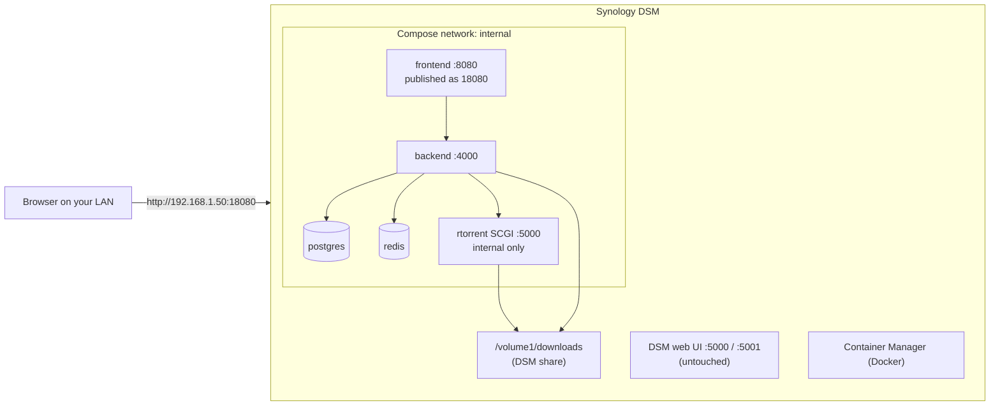

import Tabs from '@theme/Tabs';
import TabItem from '@theme/TabItem';

# Synology NAS

## Overview

Synology is a **well-grounded** target: UltraTorrent is deployed on DSM, and the quirks below are real ones the project has hit and fixed.

A Synology is just a Docker host with an unusual shell and a strong opinion about ports. The deltas are:

1. **SSH is off by default**, and you need `sudo -i` after connecting.
2. **Port 8080 can clash** with other DSM apps — remap it.
3. **DSM strips `SETUID`/`SETGID`** from containers, which would break the bundled rTorrent's privilege drop. The Compose file already re-adds them.
4. Your shares live under **`/volume1/…`**.

Everything else is the [Docker Compose guide](/install/docker-compose), verbatim.

:::tip Watch this tutorial
_Video coming soon._
:::

## Prerequisites

- A Synology NAS that supports Docker (most models from the last several years).
- An **administrator** account on DSM.
- **Container Manager** installed (older DSM calls it "Docker") — Package Center → search → Install.
- The NAS's IP address, e.g. `192.168.1.50`.
- About 2 GB of free RAM and 10–15 minutes.

## Requirements

| | Minimum | Comfortable |
|---|---------|-------------|
| CPU | x86-64 or ARM64, 2 cores | 4 cores |
| RAM | **2 GB free during the build** | 4 GB+ |
| Disk | ~3 GB for images + your downloads | — |

:::warning Low-RAM models
Entry-level Synology units ship with 1–2 GB of RAM, and DSM itself eats a chunk of it. The image build is the memory peak — if it gets OOM-killed, add a RAM stick (many models are upgradable) or build the images on another machine.
:::

## Ports

| Port | Owner | Notes |
|------|-------|-------|
| 5000 / 5001 | **DSM itself** | Untouched — UltraTorrent never publishes these |
| 8080 | Often taken by another DSM package | **Remap it**: set `FRONTEND_PORT=18080` |
| 18080 | Your UltraTorrent UI | Suggested free port |

```dotenv
# .env
FRONTEND_PORT=18080
```

Then open `http://<NAS-IP>:18080`.

:::caution Do not remap ports with an override file
Compose **appends** `ports:` entries, so an override adds a second mapping while the original still clashes. Change `FRONTEND_PORT` in `.env`.
:::

## Volumes

DSM shares live under `/volume1/`. Two paths matter:

| Path | Use |
|------|-----|
| `/volume1/docker` | Where the source tree goes (Container Manager creates this share) |
| `/volume1/downloads` | Where you want the actual downloads (create the share in File Station first) |

Bind the downloads volume to a real share:

```yaml
# docker-compose.override.yml
volumes:
  downloads:
    driver: local
    driver_opts:
      type: none
      o: bind
      device: /volume1/downloads
```

## Permissions

Downloaded files are owned by the app's internal user, **uid 1000**, by default. That is fine — everything *inside* UltraTorrent works.

If you also want to manage those files from your DSM login over SMB, set the share's permissions to allow your DSM user. If the folder belongs to **another app** (Plex, for example), do not chown it — set `PUID`/`PGID` to that app's user so the engine writes as them. See [Permissions](/install/docker-compose#permissions).

:::info The DSM capability gotcha — already handled
The bundled rTorrent entrypoint starts as root, chowns the downloads volume, then drops to `PUID:PGID` with `gosu`. **DSM strips `SETUID` and `SETGID`** from a container's default capability set, which makes that drop fail with *"operation not permitted"* — and the entrypoint would fall back to running as **root**, leaving root-owned downloads.

`docker-compose.yml` already declares `cap_add: ["SETUID", "SETGID"]` on the rTorrent service, restoring Docker's default and letting the privilege drop work. You do not need to do anything — but if you see `cannot switch to 1000:1000 (CAP_SETUID/CAP_SETGID unavailable) — running as root` in the rTorrent logs, that is what happened, and it means those `cap_add` lines were lost from your Compose file.
:::

## Network



Note that rTorrent's SCGI port is *also* 5000 — but it lives **inside the Docker network** and is never published, so it cannot collide with DSM's own port 5000.

## Step-by-step

### 1. Install Container Manager

**Package Center** → search **Container Manager** → **Install**. (On older DSM it is called **Docker**.)


:::note Screenshot needed
Synology Package Center with **Container Manager** shown, and its **Install**/**Open** button.
:::

### 2. Enable SSH

**Control Panel → Terminal & SNMP → Enable SSH service → Apply.**

:::caution Turn SSH back off afterwards
You need it for the build and the one-time seed. Once UltraTorrent is running, disabling SSH again is good hygiene.
:::

### 3. Connect and become root

<Tabs groupId="os">
<TabItem value="win" label="Windows" default>

Open **Windows Terminal** or **PowerShell** (both built in):

```powershell
ssh admin@192.168.1.50
```

</TabItem>
<TabItem value="mac" label="macOS / Linux">

```bash
ssh admin@192.168.1.50
```

</TabItem>
</Tabs>

Type your DSM admin password — it stays invisible as you type, which is normal. First connection asks *"are you sure you want to continue"* → type `yes`.

Then, **on Synology specifically**, become root:

```bash
sudo -i
```

Enter the password again. Your prompt now ends in `#`. **Everything below assumes you did this** — DSM's Docker socket is root-only.

### 4. Get the source

```bash
cd /volume1/docker
git clone https://github.com/damirabal/ultratorrent-core.git
cd ultratorrent-core
```

**No `git` on your DSM?** On your own computer, open the project's GitHub page → **Code → Download ZIP** → unzip → copy the `ultratorrent-core` folder into the `docker` share with **File Station** or over SMB. Then `cd /volume1/docker/ultratorrent-core`.

### 5. Configure `.env`

```bash
cp .env.example .env

# Auto-fill the three long random keys (paste this whole block as-is):
for k in JWT_ACCESS_SECRET JWT_REFRESH_SECRET ENCRYPTION_KEY; do
  sed -i "s|^$k=.*|$k=$(openssl rand -base64 48 | tr -d '\n')|" .env
done

nano .env
```

Set these three lines:

```dotenv
POSTGRES_PASSWORD=lettersAndNumbers123    # letters + numbers ONLY, no symbols
ADMIN_PASSWORD=the-password-you-log-in-with
FRONTEND_PORT=18080
```

Save and exit `nano`: **Ctrl+O**, **Enter**, then **Ctrl+X**.

`POSTGRES_PASSWORD` is the database's private password (you will rarely see it again). `ADMIN_PASSWORD` is what **you** type to log in — pick a good one and remember it.

### 6. Send downloads to a DSM share

Create the share in **File Station** first (e.g. a `downloads` shared folder → `/volume1/downloads`). Then:

```bash
nano docker-compose.override.yml
```

```yaml
volumes:
  downloads:
    driver: local
    driver_opts:
      type: none
      o: bind
      device: /volume1/downloads
```

Save and exit. **The folder must already exist** or the bind fails.

### 7. Build and start

```bash
docker compose --profile rtorrent up -d --build
```

**The first build takes several minutes.** Let it finish.

### 8. Seed the database — once

```bash
docker compose exec backend npx prisma db seed
```

### 9. Log in and add the engine

Open `http://<NAS-IP>:18080`.

- Username: **`admin`** (a username, *not* an email)
- Password: your `ADMIN_PASSWORD`

Then **Infrastructure → Engines → Add engine**:

| Field | Value |
|-------|-------|
| Client | rTorrent |
| Connection | SCGI over TCP |
| Host | `rtorrent` |
| Port | `5000` |
| Default engine | On |

**Test connection** → *Connected* → **Add engine**. The **Torrents** page will now load.

Finally, **Settings → Default Root Path** → `/downloads`.

## The GUI route (Container Manager Project)

Prefer clicking to typing? **Container Manager → Project → Create** → point it at the `ultratorrent-core` folder; it reads `docker-compose.yml` for you.

You still need the one-time seed. Either over SSH, or: open the **backend** container in Container Manager, go to its **Terminal** tab, and run `npx prisma db seed` there.


:::note Screenshot needed
Container Manager → **Project → Create**, with the path set to `/volume1/docker/ultratorrent-core` and the detected `docker-compose.yml`.
:::

:::caution The SSH route is more reliable for the first install
The one-time `--build` and the seed step are both easier over SSH. Use the GUI afterwards for day-to-day start/stop/logs.
:::

## Verification

```bash
docker compose ps
curl -s http://localhost:18080/api/system/live
curl -s http://localhost:18080/api/system/version
```

```text
NAME                       STATUS                    PORTS
ultratorrent-backend-1     Up 3 minutes (healthy)    4000/tcp
ultratorrent-frontend-1    Up 3 minutes (healthy)    0.0.0.0:18080->8080/tcp
ultratorrent-postgres-1    Up 3 minutes (healthy)    5432/tcp
ultratorrent-redis-1       Up 3 minutes (healthy)    6379/tcp
ultratorrent-rtorrent-1    Up 3 minutes (healthy)    5000/tcp
```

Confirm the privilege drop worked (this is the DSM-specific check):

```bash
docker compose logs rtorrent | head -20
```

You should **not** see `cannot switch to 1000:1000 … running as root`. And a completed download should land in `/volume1/downloads` owned by `1000:1000` — not `root`:

```bash
ls -ln /volume1/downloads
```

## Reverse proxy

DSM ships **Application Portal → Reverse Proxy**, which can front UltraTorrent with a hostname and a DSM-managed certificate.

**Create a rule:**

| Field | Value |
|-------|-------|
| Source protocol / hostname / port | HTTPS · `torrents.example.com` · 443 |
| Destination protocol / hostname / port | HTTP · `localhost` · `18080` |

**Then — the part everyone forgets:** open the rule's **Custom Header** tab and click **Create → WebSocket**. DSM inserts the `Upgrade` and `Connection` headers for you.

:::danger Without the WebSocket header preset, the UI never updates
It loads, it logs in, and then progress bars sit still forever. See [Reverse proxy](/install/reverse-proxy).
:::


:::note Screenshot needed
DSM **Control Panel → Login Portal → Advanced → Reverse Proxy**, the rule's **Custom Header** tab, showing the **Create → WebSocket** preset applied.
:::

:::caution Community-verified
The DSM reverse-proxy flow above is standard across recent DSM versions, but the menu path moved between DSM 6 and DSM 7 (Application Portal → Login Portal). Adjust to your version.
:::

## HTTPS

DSM can obtain a Let's Encrypt certificate for you (**Control Panel → Security → Certificate**) and attach it to the reverse-proxy rule. That is the path of least resistance on a Synology.

Alternatives (Caddy, Traefik, DNS-01 for a LAN-only NAS): [TLS](/install/tls).

## Updates

Over SSH (as root):

```bash
cd /volume1/docker/ultratorrent-core
docker compose exec -T postgres pg_dump -U ultratorrent ultratorrent > backup-$(date +%F).sql
git pull
docker compose --profile rtorrent up -d --build
docker compose exec backend npx prisma db seed
```

Deployed via the GUI? Update the source folder first, then **Project → Build** in Container Manager, and run the seed from the backend container's **Terminal** tab.

Full procedure and rollback: [Upgrading](/install/upgrading).

## Backups

- **Database:** `docker compose exec -T postgres pg_dump …` into a share that **Hyper Backup** already covers.
- **`.env`:** copy it somewhere Hyper Backup covers too.
- **Downloads:** they are on `/volume1/downloads`, so your existing DSM backup jobs already see them.

See [Backup & restore](/operate/backup).

## Troubleshooting

| Symptom | Cause | Fix |
|---------|-------|-----|
| `permission denied` running `docker` | You forgot `sudo -i` | Run `sudo -i` after connecting — DSM's Docker socket is root-only |
| Web UI port conflict / page will not load | Another DSM package owns 8080 | Set `FRONTEND_PORT=18080` in `.env` and re-run `up -d`. Do **not** use an override — Compose appends ports |
| Downloads are owned by **root** | The `SETUID`/`SETGID` capabilities were stripped and the privilege drop fell back to root | Confirm `cap_add: ["SETUID","SETGID"]` is still on the `rtorrent` service in `docker-compose.yml`, then recreate it. Check with `docker compose logs rtorrent \| head` |
| Build is killed part-way | DSM ran out of RAM | The build needs ~2 GB free. Stop other packages, add RAM, or build elsewhere |
| `docker compose` → command not found | Older Container Manager ships the legacy binary | Try `docker-compose` (hyphen) |
| Bind mount fails: *"no such file or directory"* | `/volume1/downloads` does not exist | Create the shared folder in File Station first |
| Cannot reach the UI from another device | DSM firewall | **Control Panel → Security → Firewall** — allow the port on your LAN |
| rTorrent restarts periodically | The known upstream rTorrent 0.9.8 crash — worse with more active torrents | Nothing is lost (it reloads its session). Reduce active torrents, or use the qBittorrent profile |
| Everything works, but the live UI is frozen behind DSM's reverse proxy | The WebSocket custom header is missing | Add the **WebSocket** preset to the rule's Custom Header tab |

More: [Troubleshooting](/operate/troubleshooting).

## Best practices

- **Turn SSH back off** once you are done installing.
- **Remap the UI port** (`18080`) rather than fighting DSM for 8080.
- **Put downloads on a real share** (`/volume1/downloads`) so File Station, SMB and Hyper Backup all see them.
- **Do not run UltraTorrent on the same volume as DSM's system partition** if you can avoid it.
- **Let Hyper Backup cover the `pg_dump` output** — do not invent a second backup system.
- **Keep `cap_add: ["SETUID","SETGID"]`** on the rTorrent service. It exists specifically because of DSM.
- **Use DSM's reverse proxy + certificate** if you want HTTPS — and remember the WebSocket header.
- Prefer **qBittorrent** if you plan to run hundreds of torrents on a NAS.

## FAQ

**Do I have to use SSH?**
For the first install, effectively yes — the `--build` and the seed step are far easier there. Day-to-day management can be entirely GUI.

**Will this conflict with Synology Download Station?**
Not on ports (UltraTorrent's are separate), but two BitTorrent clients writing the same folder is a bad idea. Give UltraTorrent its own downloads share.

**Does it clash with DSM on port 5000?**
No. rTorrent's SCGI 5000 is *inside* the Docker network and never published to the host.

**Can I use my existing Download Station / Transmission?**
Not as an engine — UltraTorrent speaks rTorrent (SCGI/XML-RPC) and qBittorrent (Web API). See [Engines](/modules/engines).

**Which Synology models work?**
Any that can install Container Manager and give you ~2 GB of free RAM for the build. ARM64 models build too, just slower.

## Checklist

- [ ] Container Manager installed
- [ ] SSH temporarily enabled
- [ ] Connected **and ran `sudo -i`**
- [ ] Source in `/volume1/docker/ultratorrent-core`
- [ ] `.env`: alphanumeric `POSTGRES_PASSWORD`, `ADMIN_PASSWORD`, three distinct secrets, `FRONTEND_PORT=18080`
- [ ] `/volume1/downloads` share created and bound via `docker-compose.override.yml`
- [ ] `docker compose --profile rtorrent up -d --build` finished
- [ ] Seed run once
- [ ] `docker compose logs rtorrent` shows **no** "running as root" fallback
- [ ] Logged in at `http://<NAS-IP>:18080` as `admin`
- [ ] Engine added (`rtorrent` : `5000`), Test connection green
- [ ] Default Root Path set to `/downloads`
- [ ] Downloads landing in `/volume1/downloads` with the expected owner
- [ ] SSH turned back off
- [ ] Hyper Backup covers the `pg_dump` output and `.env`

## See also

- [Docker Compose install](/install/docker-compose) — the authoritative guide
- [QNAP](/install/platforms/qnap) — the other well-grounded NAS
- [Reverse proxy](/install/reverse-proxy) · [TLS](/install/tls) · [Upgrading](/install/upgrading)
- [Engines](/modules/engines) · [Troubleshooting](/operate/troubleshooting)
