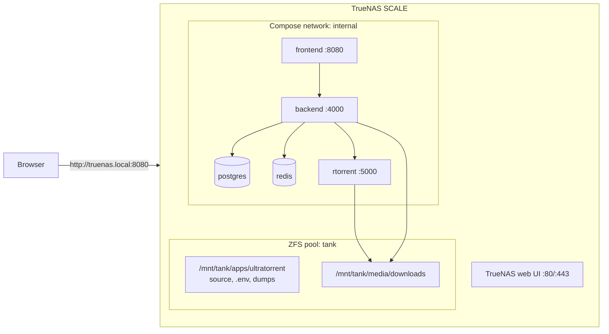

import Tabs from '@theme/Tabs';
import TabItem from '@theme/TabItem';

# TrueNAS SCALE

## Overview

TrueNAS SCALE is a Linux NAS, so UltraTorrent runs on it exactly as [the Compose guide](/install/docker-compose) describes. The complication is **which app engine your SCALE version uses**:

| SCALE era | App engine | What that means for UltraTorrent |
|-----------|-----------|---------------------------------|
| Older (Bluefin / Cobia / Dragonfish) | **Kubernetes (k3s)** | The "Custom App" form is a *Kubernetes* form, not Docker Compose. A `docker-compose.yml` will not import |
| Newer (Electric Eel and later) | **Docker** | Compose is the native model, and this stack fits naturally |

Either way, the reliable path is **SSH + `docker compose`** against the source tree on a dataset.

:::caution Community-verified
TrueNAS SCALE is **not** one of this project's own deployment targets, and its app engine has changed materially between releases. The UltraTorrent parts below are grounded in the repo; the TrueNAS parts follow SCALE conventions. Check your SCALE version's documentation for the current app model, and please report corrections.
:::

:::tip Watch this tutorial
_Video coming soon._
:::

## Prerequisites

- TrueNAS SCALE with a **pool** configured and an **apps pool** chosen.
- SSH enabled (**System Settings → Services → SSH**), or the built-in **Shell**.
- ~2 GB free RAM for the build.

## Requirements

| | Minimum | Comfortable |
|---|---------|-------------|
| CPU | 2 cores | 4 cores |
| RAM | 2 GB free above ZFS's ARC appetite | 8 GB+ (ZFS is hungry) |
| Disk | ~3 GB for images | plus your media dataset |

:::warning ZFS ARC will eat your RAM
The image build needs ~2 GB *free*. On a busy SCALE box, ARC may have taken it. If the build gets OOM-killed, that is why.
:::

## Ports

TrueNAS's own web UI is on **80/443**. Port **8080** is usually free — but other apps grab it often, so check:

```bash
ss -tlnp | grep :8080
```

Taken? `FRONTEND_PORT=18080` in `.env`.

Do **not** enable UltraTorrent's bundled `proxy` profile — it wants 80/443, which the TrueNAS UI holds.

## Volumes

Create **datasets**, not plain folders — that is the whole point of ZFS (snapshots, quotas, replication):

| Dataset | Mounted at (example) | Use |
|---------|---------------------|-----|
| `tank/apps/ultratorrent` | `/mnt/tank/apps/ultratorrent` | Source tree, `.env`, database dumps |
| `tank/media/downloads` | `/mnt/tank/media/downloads` | The downloads share |

```yaml
# docker-compose.override.yml
volumes:
  downloads:
    driver: local
    driver_opts:
      type: none
      o: bind
      device: /mnt/tank/media/downloads
```

:::tip Snapshot the app dataset
A ZFS snapshot of `tank/apps/ultratorrent` before an upgrade is a second safety net alongside your `pg_dump`. It does **not** replace the dump — a live Postgres data directory snapshot is crash-consistent at best.
:::

## Permissions

TrueNAS defaults to **ACLs**, which can quietly override the POSIX ownership Docker expects.

Simplest reliable setup:

1. In **Datasets → Permissions**, give the downloads dataset a **POSIX** ACL type (or an ACL that grants full control to the UID you will use).
2. Set the owner to the UID the engine will write as.

```dotenv
# .env — pick a UID/GID that matches your media stack
PUID=1000
PGID=1000
```

```bash
sudo chown -R 1000:1000 /mnt/tank/media/downloads
```

If Plex/Jellyfin already own that dataset, **do not chown it** — set `PUID`/`PGID` to *their* user instead. See [Permissions](/install/docker-compose#permissions).

:::caution ACLs are the usual culprit
When a container reports "permission denied" on a dataset whose `ls -ln` looks correct, the cause is almost always a restrictive ACL, not the UID. Check with `getfacl /mnt/tank/media/downloads`.
:::

## Network



## Step-by-step

### 1. Create the datasets

**Datasets → Add Dataset** → `apps/ultratorrent` and `media/downloads` (names to taste).


:::note Screenshot needed
TrueNAS SCALE **Datasets → Add Dataset**, creating `tank/media/downloads`, with the ACL/permissions panel visible.
:::

### 2. Get a shell

**System Settings → Shell**, or SSH in:

```bash
ssh root@truenas.local
```

### 3. Confirm Docker is available

```bash
docker --version
docker compose version
```

<Tabs groupId="scale">
<TabItem value="docker" label="Docker-era SCALE (Electric Eel+)" default>

Both commands work. Continue.

</TabItem>
<TabItem value="k8s" label="Kubernetes-era SCALE (Dragonfish and older)">

`docker` may not be present at all — apps run on k3s. Options, in order of sanity:

1. **Upgrade SCALE** to a Docker-based release. By far the cleanest.
2. **Run UltraTorrent in a VM** on TrueNAS (SCALE has a hypervisor) and treat it as a plain [Linux host](/install/platforms/linux). Very reliable, costs some RAM.
3. Translate the Compose stack into Kubernetes manifests yourself. **Not supported, not documented, and not recommended** — the stack builds images from source, which a Custom App form cannot do.

:::danger A "Custom App" YAML is not a docker-compose.yml
On Kubernetes-era SCALE, pasting `docker-compose.yml` into the Custom App form does not work. They are different schemas. Use a VM, or upgrade.
:::

</TabItem>
</Tabs>

### 4. Install

```bash
cd /mnt/tank/apps/ultratorrent
git clone https://github.com/damirabal/ultratorrent-core.git
cd ultratorrent-core

cp .env.example .env
for k in JWT_ACCESS_SECRET JWT_REFRESH_SECRET ENCRYPTION_KEY; do
  sed -i "s|^$k=.*|$k=$(openssl rand -base64 48 | tr -d '\n')|" .env
done
nano .env
```

```dotenv
POSTGRES_PASSWORD=lettersAndNumbers123
ADMIN_PASSWORD=the-password-you-log-in-with
FRONTEND_PORT=8080
PUID=1000
PGID=1000
```

Bind downloads to the dataset:

```bash
nano docker-compose.override.yml
```

```yaml
volumes:
  downloads:
    driver: local
    driver_opts:
      type: none
      o: bind
      device: /mnt/tank/media/downloads
```

### 5. Build, start, seed

```bash
docker compose --profile rtorrent up -d --build
docker compose exec backend npx prisma db seed
```

### 6. Log in and add the engine

`http://<truenas-ip>:8080`, sign in as **`admin`**.

**Infrastructure → Engines → Add engine** → rTorrent · SCGI over TCP · host `rtorrent` · port `5000` → **Test connection** → **Add engine**.

**Settings → Default Root Path** → `/downloads`.

## Verification

```bash
docker compose ps
curl -s http://localhost:8080/api/system/live
ls -ln /mnt/tank/media/downloads
```

```text
NAME                       STATUS                    PORTS
ultratorrent-backend-1     Up 2 minutes (healthy)    4000/tcp
ultratorrent-frontend-1    Up 2 minutes (healthy)    0.0.0.0:8080->8080/tcp
ultratorrent-postgres-1    Up 2 minutes (healthy)    5432/tcp
ultratorrent-redis-1       Up 2 minutes (healthy)    6379/tcp
ultratorrent-rtorrent-1    Up 2 minutes (healthy)    5000/tcp
```

A finished download in `/mnt/tank/media/downloads`, owned by your `PUID:PGID`, is the real proof.

## Reverse proxy

TrueNAS holds 80/443, so run your proxy **elsewhere** — another host, or a container on a different port — pointing at `http://<truenas-ip>:8080`. WebSocket upgrade headers are mandatory: [Reverse proxy](/install/reverse-proxy).

## HTTPS

Handled by whatever proxy you put in front. See [TLS](/install/tls).

## Updates

```bash
cd /mnt/tank/apps/ultratorrent/ultratorrent-core
docker compose exec -T postgres pg_dump -U ultratorrent ultratorrent > backup-$(date +%F).sql
git pull
docker compose --profile rtorrent up -d --build
docker compose exec backend npx prisma db seed
```

Take a ZFS snapshot of the app dataset first — it is free and instant. Full procedure: [Upgrading](/install/upgrading).

:::warning A SCALE major upgrade can change the app engine
Upgrading TrueNAS itself (not UltraTorrent) may migrate you between k3s and Docker. Read the SCALE release notes before a major version jump — it can strand a running stack.
:::

## Backups

```bash
docker compose exec -T postgres pg_dump -U ultratorrent ultratorrent \
  > /mnt/tank/apps/ultratorrent/backup-$(date +%F).sql
cp .env /mnt/tank/apps/ultratorrent/env.bak
```

Then let TrueNAS do what it is good at: **periodic snapshot tasks** on `tank/apps/ultratorrent`, and **replication** to another box. See [Backup & restore](/operate/backup).

## Troubleshooting

| Symptom | Cause | Fix |
|---------|-------|-----|
| `docker: command not found` | Kubernetes-era SCALE — there is no Docker | Upgrade SCALE, or run UltraTorrent in a VM |
| Pasting `docker-compose.yml` into "Custom App" fails | That form takes a *Kubernetes* schema | Use `docker compose` in a shell, or a VM |
| *"permission denied"* on the downloads dataset despite correct `chown` | A restrictive **ACL** | `getfacl /mnt/tank/media/downloads`; give the UID full control, or switch the dataset to POSIX ACLs |
| Build is OOM-killed | ZFS ARC is holding the RAM | Free memory (or cap ARC) and rebuild |
| Port 8080 in use | Another app took it | `FRONTEND_PORT=18080` |
| Bundled `proxy` profile fails to bind | TrueNAS owns 80/443 | Do not enable it; run the proxy elsewhere |
| Stack gone after a TrueNAS upgrade | The app engine changed under you | Read the SCALE release notes; re-deploy from the source tree (your dataset and `.env` survive) |
| rTorrent restarts periodically | The known upstream rTorrent 0.9.8 crash | Nothing is lost. Reduce active torrents, or use the qBittorrent profile |

More: [Troubleshooting](/operate/troubleshooting).

## Best practices

- **Datasets, not folders.** Snapshots and replication are the reason you bought TrueNAS.
- **Check the ACL, not just the UID**, when a permission error makes no sense.
- **Snapshot before every upgrade** — and still take the `pg_dump`. A snapshot of a live database is crash-consistent, not clean.
- **Do not run the bundled `proxy` profile** — TrueNAS owns 80/443.
- **Read the SCALE release notes before a major TrueNAS upgrade**; the app engine has changed before.
- **A VM is a legitimate answer** on Kubernetes-era SCALE. Boring, reliable, and it turns this into a plain [Linux install](/install/platforms/linux).
- Keep the downloads dataset on the **same pool** as the app if you want atomic snapshots of both.

## FAQ

**Is there an official TrueNAS app / catalog entry?**
No. UltraTorrent is a Compose stack built from source.

**Kubernetes-era SCALE — really no way?**
Not a supported one. The stack builds images from source, which the Custom App form cannot do. Run a VM, or upgrade SCALE.

**Should I run it in a VM anyway?**
It is a very defensible choice: full isolation, a normal Linux box, and immunity to TrueNAS app-engine churn. It costs RAM.

**Will ZFS snapshots back up my database properly?**
Not reliably — a snapshot of a running Postgres is crash-consistent. Use `pg_dump`, then snapshot the dump.

**Does it work on TrueNAS CORE (FreeBSD)?**
No. CORE has no Docker. Use SCALE, or a Linux VM/jail-adjacent setup of your own devising.

## Checklist

- [ ] SCALE version's app engine identified (Docker vs Kubernetes)
- [ ] `docker compose version` works in the shell
- [ ] Datasets created for the app and for downloads
- [ ] Dataset ACL/permissions allow the `PUID`/`PGID` you chose
- [ ] `.env`: alphanumeric `POSTGRES_PASSWORD`, `ADMIN_PASSWORD`, three distinct secrets
- [ ] Downloads bound to `/mnt/<pool>/media/downloads`
- [ ] Built, started, seeded
- [ ] Engine added and connected
- [ ] Downloads land with the expected owner
- [ ] Periodic snapshot task on the app dataset
- [ ] `pg_dump` written into a snapshotted dataset

## See also

- [Docker Compose install](/install/docker-compose) — the authoritative guide
- [Linux](/install/platforms/linux) — what to follow if you run it in a VM
- [Proxmox](/install/platforms/proxmox) — the other hypervisor-shaped option
- [Reverse proxy](/install/reverse-proxy) · [TLS](/install/tls) · [Upgrading](/install/upgrading)
- [Backup & restore](/operate/backup) · [Troubleshooting](/operate/troubleshooting)
