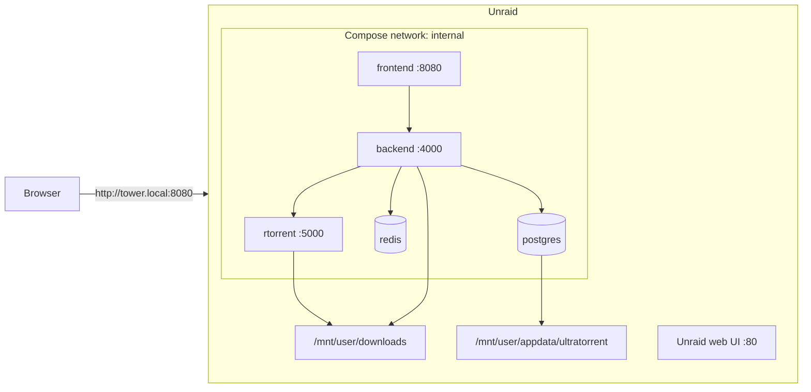

import Tabs from '@theme/Tabs';
import TabItem from '@theme/TabItem';

# Unraid

## Overview

Unraid is a Docker host with a very good web UI and one important constraint for us: **UltraTorrent is a multi-container Compose stack, not a single container**, and it **builds from source** — so it does not fit Unraid's classic "Add Container" / Community Apps template model.

The way to run it is **Docker Compose**, via the **Compose Manager** plugin (or plain SSH).

:::caution Community-verified
Unraid is **not** one of this project's own deployment targets. Everything below is the standard Unraid Compose workflow applied to UltraTorrent's documented stack — the UltraTorrent parts are grounded in the repo, the Unraid parts follow Unraid's conventions. Verify against your Unraid version, and please report corrections.
:::

:::tip Watch this tutorial
_Video coming soon._
:::

## Prerequisites

- Unraid 6.10+ with the array started.
- **Docker Compose Manager** plugin (Community Applications → Apps → search "Compose") — or just SSH, which Unraid enables by default.
- ~2 GB free RAM for the build.

## Requirements

| | Minimum | Comfortable |
|---|---------|-------------|
| CPU | 2 cores | 4 cores |
| RAM | 2 GB free during the build | 4 GB+ |
| Disk | ~3 GB on the cache/appdata pool | plus your media array |

## Ports

Unraid's own web UI defaults to **80** (and 443). It does **not** use 8080 — so `FRONTEND_PORT=8080` is usually fine. Check anyway, because other containers commonly grab it:

```bash
ss -tlnp | grep :8080
```

If it is taken: `FRONTEND_PORT=18080` in `.env`.

The bundled Caddy `proxy` profile wants **80 and 443**, which Unraid's own UI holds. Do not enable that profile unless you have moved Unraid's UI ports (**Settings → Management Access**).

## Volumes

Unraid convention:

| Path | Use |
|------|-----|
| `/boot/config/plugins/compose.manager/projects/ultratorrent/` | Where Compose Manager keeps a project (if you use the plugin) |
| `/mnt/user/appdata/ultratorrent/` | Persistent app state — put the source tree and `.env` here |
| `/mnt/user/downloads/` | Your media share |

Bind downloads to the share:

```yaml
# docker-compose.override.yml
volumes:
  downloads:
    driver: local
    driver_opts:
      type: none
      o: bind
      device: /mnt/user/downloads
```

:::warning Use `/mnt/user/...`, not `/mnt/cache/...` or `/mnt/disk1/...`
Mixing them for the same data is the classic Unraid way to corrupt a share. Pick the user share and stay on it.
:::

## Permissions

Unraid's convention is **`nobody:users` = uid 99, gid 100**, not the 1000:1000 UltraTorrent defaults. Two choices:

**Option A — adopt Unraid's convention** (recommended if other Unraid containers share the folder):

```dotenv
# .env
PUID=99
PGID=100
```

The engine then writes downloads as `nobody:users`, matching every other Unraid container.

**Option B — keep 1000:1000** and `chown` the download share:

```bash
chown -R 1000:1000 /mnt/user/downloads
```

Do **not** do this if Plex/Jellyfin/Sonarr also write there.

:::info The backend still runs as uid 1000
Only the *engine* honours `PUID`/`PGID`. The backend container is fixed at uid 1000, so the in-app File Manager's **write** actions on a `nobody:users` folder need the group added:

```yaml
# docker-compose.override.yml
services:
  backend:
    group_add: ["100"]      # the `users` group
```

Downloading works either way; this only affects File Manager writes. See [Permissions](/install/docker-compose#permissions).
:::

## Network



## Step-by-step

<Tabs groupId="unraid-method">
<TabItem value="plugin" label="Compose Manager plugin" default>

### 1. Install the plugin

**Apps** (Community Applications) → search **Compose Manager** → Install.

### 2. Get the source onto the array

Compose Manager pastes a `docker-compose.yml`, but UltraTorrent **builds from source** — so the build context (the whole repo) has to be on disk. Do this over SSH:

```bash
mkdir -p /mnt/user/appdata/ultratorrent
cd /mnt/user/appdata/ultratorrent
git clone https://github.com/damirabal/ultratorrent-core.git
cd ultratorrent-core
```

### 3. Add the project

**Docker tab → Compose → Add New Stack → `ultratorrent`**, then set its **directory** to `/mnt/user/appdata/ultratorrent/ultratorrent-core` so it picks up the real `docker-compose.yml` and `.env`.

### 4. Configure and build

`.env` and the first `--build` are still shell work — continue in the SSH tab below, then use the plugin's **Compose Up** / **Compose Down** buttons day to day.


:::note Screenshot needed
Unraid **Docker** tab, Compose Manager section, showing the `ultratorrent` stack with Compose Up / Down / Update buttons.
:::

</TabItem>
<TabItem value="ssh" label="SSH (simplest)">

### 1. SSH in

```bash
ssh root@tower.local
```

### 2. Get the source

```bash
mkdir -p /mnt/user/appdata/ultratorrent
cd /mnt/user/appdata/ultratorrent
git clone https://github.com/damirabal/ultratorrent-core.git
cd ultratorrent-core
```

### 3. Configure

```bash
cp .env.example .env
for k in JWT_ACCESS_SECRET JWT_REFRESH_SECRET ENCRYPTION_KEY; do
  sed -i "s|^$k=.*|$k=$(openssl rand -base64 48 | tr -d '\n')|" .env
done
nano .env
```

```dotenv
POSTGRES_PASSWORD=lettersAndNumbers123
ADMIN_PASSWORD=the-password-you-log-in-with
FRONTEND_PORT=8080          # or 18080 if something else has it
PUID=99                     # Unraid's `nobody`
PGID=100                    # Unraid's `users`
```

### 4. Bind downloads

```bash
nano docker-compose.override.yml
```

```yaml
volumes:
  downloads:
    driver: local
    driver_opts:
      type: none
      o: bind
      device: /mnt/user/downloads
services:
  backend:
    group_add: ["100"]      # so the File Manager can write there too
```

### 5. Build, start, seed

```bash
docker compose --profile rtorrent up -d --build
docker compose exec backend npx prisma db seed
```

</TabItem>
</Tabs>

### Finally: log in and add the engine

Open `http://<unraid-ip>:8080`, sign in as **`admin`** with your `ADMIN_PASSWORD`.

**Infrastructure → Engines → Add engine** → rTorrent · SCGI over TCP · host `rtorrent` · port `5000` · Default engine on → **Test connection** → **Add engine**.

Then **Settings → Default Root Path** → `/downloads`.

## Verification

```bash
docker compose ps
curl -s http://localhost:8080/api/system/live
```

```text
NAME                       STATUS                    PORTS
ultratorrent-backend-1     Up 2 minutes (healthy)    4000/tcp
ultratorrent-frontend-1    Up 2 minutes (healthy)    0.0.0.0:8080->8080/tcp
ultratorrent-postgres-1    Up 2 minutes (healthy)    5432/tcp
ultratorrent-redis-1       Up 2 minutes (healthy)    6379/tcp
ultratorrent-rtorrent-1    Up 2 minutes (healthy)    5000/tcp
```

Then check the ownership of a finished download:

```bash
ls -ln /mnt/user/downloads
```

With `PUID=99`/`PGID=100`, files should be `99 100` — matching every other Unraid container.

## Reverse proxy

Unraid users typically already run **Nginx Proxy Manager** or **SWAG**. Point it at `http://<unraid-ip>:8080` and **turn on WebSocket support** — see [Reverse proxy](/install/reverse-proxy). Without it the UI loads but never updates.

Do **not** enable UltraTorrent's bundled `proxy` profile on Unraid unless you have first moved the Unraid web UI off 80/443.

## HTTPS

Whatever proxy you already use (NPM, SWAG) already does certificates. See [TLS](/install/tls).

## Updates

```bash
cd /mnt/user/appdata/ultratorrent/ultratorrent-core
docker compose exec -T postgres pg_dump -U ultratorrent ultratorrent > backup-$(date +%F).sql
git pull
docker compose --profile rtorrent up -d --build
docker compose exec backend npx prisma db seed
```

Compose Manager's **Update** button pulls images — but UltraTorrent's images are **built locally**, so it will not fetch new code. You must `git pull` and rebuild. See [Upgrading](/install/upgrading).

## Backups

Unraid's **Appdata Backup** plugin covers `/mnt/user/appdata` — put your `pg_dump` output and a copy of `.env` there and it is handled:

```bash
docker compose exec -T postgres pg_dump -U ultratorrent ultratorrent \
  > /mnt/user/appdata/ultratorrent/backup-$(date +%F).sql
cp .env /mnt/user/appdata/ultratorrent/env.bak
```

See [Backup & restore](/operate/backup).

## Troubleshooting

| Symptom | Cause | Fix |
|---------|-------|-----|
| No Community Apps template for UltraTorrent | There isn't one — this is a multi-container stack built from source | Use Compose Manager or SSH |
| Compose Manager's *Update* does nothing useful | It pulls images; UltraTorrent's are built locally | `git pull` then `up -d --build` |
| Downloads owned by `1000:1000`, other apps cannot read them | The default `PUID`/`PGID` | Set `PUID=99`, `PGID=100` and recreate the engine container |
| File Manager cannot write to `/downloads` | The backend is uid 1000, the folder is `nobody:users` | `group_add: ["100"]` on the `backend` service |
| Bind mount fails | Path typo, or the share does not exist | Create the share first; always use `/mnt/user/...` |
| Data appears in two places / share weirdness | You mixed `/mnt/user`, `/mnt/cache` and `/mnt/diskN` for the same data | Use `/mnt/user/...` exclusively |
| Port 8080 in use | Another container took it | `FRONTEND_PORT=18080` |
| Bundled `proxy` profile will not start | Unraid's own UI holds 80/443 | Do not use that profile; use NPM/SWAG instead |
| Stack does not restart after a reboot | Compose Manager auto-start not enabled | Enable auto-start on the stack (the `restart: unless-stopped` policy handles the rest) |
| Build OOM-killed | Under ~2 GB free RAM | Stop other containers and retry |

More: [Troubleshooting](/operate/troubleshooting).

## Best practices

- **`PUID=99` / `PGID=100`** so downloads match Unraid's convention and your media apps can read them.
- **Source tree and `.env` under `/mnt/user/appdata/`** so the Appdata Backup plugin covers them.
- **Downloads on a `/mnt/user/` share**, never a raw disk or cache path.
- **Do not use the bundled `proxy` profile** — you already have NPM/SWAG, and Unraid owns 80/443.
- **Remember Compose Manager's Update button does not update UltraTorrent.** `git pull` + `--build`.
- Prefer **qBittorrent** if you plan to run a large library.

## FAQ

**Why isn't there a Community Apps template?**
Because UltraTorrent is a five-plus-container Compose stack that builds from source — CA templates are for single, prebuilt containers.

**Can I use Unraid's "Add Container" UI instead?**
Not practically. You would be hand-wiring Postgres, Redis, the backend, the frontend and the engine, plus a build step. Use Compose.

**Do I have to use the plugin?**
No — plain SSH works, and Unraid ships Docker Compose.

**Will it survive a reboot?**
Yes, provided Docker starts and the stack is set to auto-start; every service carries `restart: unless-stopped`.

**Should downloads go on the cache pool or the array?**
Active downloads on the cache pool are much faster; move completed media to the array with the Mover. That is an Unraid question, not an UltraTorrent one.

## Checklist

- [ ] Compose Manager installed (or SSH ready)
- [ ] Source cloned under `/mnt/user/appdata/ultratorrent/`
- [ ] `.env`: alphanumeric `POSTGRES_PASSWORD`, `ADMIN_PASSWORD`, three distinct secrets
- [ ] `PUID=99`, `PGID=100`
- [ ] `FRONTEND_PORT` free
- [ ] Downloads bound to a `/mnt/user/` share
- [ ] `group_add: ["100"]` on the backend if you want File Manager writes
- [ ] Built, started, seeded
- [ ] Engine added and connected
- [ ] Downloads land with `99:100` ownership
- [ ] NPM/SWAG in front, with **WebSocket support on**
- [ ] Appdata Backup covers the `pg_dump` output and `.env`

## See also

- [Docker Compose install](/install/docker-compose) — the authoritative guide
- [Permissions](/install/docker-compose#permissions) — PUID/PGID in detail
- [Reverse proxy](/install/reverse-proxy) · [TLS](/install/tls) · [Upgrading](/install/upgrading)
- [Troubleshooting](/operate/troubleshooting) · [Backup & restore](/operate/backup)
