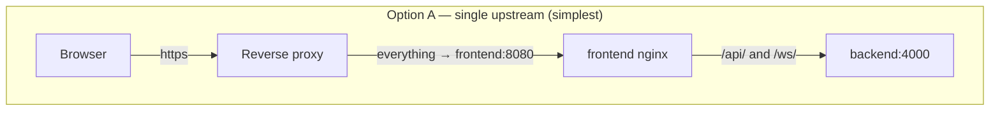
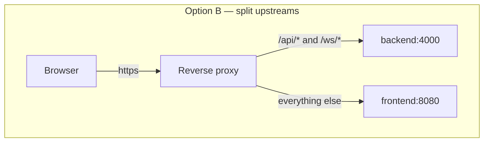

import Tabs from '@theme/Tabs';
import TabItem from '@theme/TabItem';

# Reverse proxy

## Overview

On a LAN you do not need a reverse proxy — open `http://<host>:8080` and you are done.

You want one when you need a **hostname instead of a port**, **HTTPS**, or **one entrypoint in front of several self-hosted apps**.

:::danger WebSockets are not optional
UltraTorrent's UI is **live**: torrent progress, engine health, RSS runs, import progress, notifications — all pushed over a WebSocket at **`/ws/`**. A proxy that does not forward the `Upgrade` and `Connection` headers produces a UI that *looks* fine, loads, lets you log in — and then never updates. Progress bars sit at 0%. This is by far the most common reverse-proxy mistake, and every config below handles it.
:::

:::tip Watch this tutorial
_Video coming soon._
:::

## Prerequisites

- A working [Docker Compose install](/install/docker-compose).
- A DNS name pointing at the host (for a public setup).
- Ports 80/443 free on the host, or a proxy that already owns them.

## Requirements

A reverse proxy is cheap: **~64 MB RAM** and negligible CPU for any of the options below. The only real requirement is that it can proxy WebSockets.

## Ports

| Port | Who listens | Notes |
|------|-------------|-------|
| 80 / 443 | Your reverse proxy | The only ports that should face the internet |
| 8080 (host) | `frontend` container | Bind it to `127.0.0.1` once a proxy fronts it — see [Best practices](#best-practices) |
| 8080 (container) | nginx inside the `frontend` image | **The container listens on 8080, not 80** — see the note below |
| 4000 (container) | `backend` | Internal only; never published |

:::info The frontend container listens on 8080, not 80
The image is built on `nginx-unprivileged`, which runs as uid 101 and therefore cannot bind a privileged port. Inside the Docker network the frontend is **`http://frontend:8080`**.

This bites hand-written proxy configs: pointing an upstream at `frontend:80` yields a **502 Bad Gateway**, because nothing is listening there. Use `frontend:8080`.

The `deploy/Caddyfile` shipped with the repo (the `proxy` profile) routes to `frontend:8080` correctly. If you are running a checkout from before that fix and the bundled proxy 502s, that is why — update it, or pull.
:::

## Volumes

Only your proxy's own state (certificates, ACME account). UltraTorrent's volumes are untouched by a proxy.

## Permissions

None specific — but if your proxy binds 80/443, it needs the capability to do so (root, `CAP_NET_BIND_SERVICE`, or a container that already has it).

## Two ways to route





**Option A is what you want.** The frontend's own nginx already proxies `/api/` and `/ws/` to the backend, complete with the WebSocket upgrade headers — so a single upstream gets you a fully working app, and there is exactly one place that can be misconfigured.

**Option B** (what the bundled Caddyfile does) shaves one hop off API calls. Use it only if you have a reason to; you must then get the `/ws/` upgrade headers right yourself.

Every config below uses **Option A** unless noted.

## Step-by-step

### 1. Tell UltraTorrent its public origin

In `.env`:

```dotenv
CORS_ORIGIN=https://torrents.example.com
```

Then recreate the backend:

```bash
docker compose up -d backend
```

The SPA calls the API on a *relative* path (`/api`), so it is same-origin and CORS is mostly moot — but the value is used for allowed browser origins and should reflect reality. It accepts a comma-separated list.

### 2. Bind the UI port to localhost

If the proxy runs **on the same host**, stop exposing 8080 to your whole LAN:

```yaml
# docker-compose.override.yml
services:
  frontend:
    ports: !override
      - "127.0.0.1:8080:8080"
```

:::caution Community-verified
`!override` requires a recent Compose v2. If your version rejects it, edit the `ports:` entry in `docker-compose.yml` directly — remember that a plain override file **appends** ports rather than replacing them.
:::

If the proxy runs **in the same Compose project**, drop the host mapping entirely and let the proxy reach `frontend:8080` over the `internal` network.

### 3. Configure the proxy

<Tabs groupId="proxy">
<TabItem value="traefik" label="Traefik" default>

Labels on the `frontend` service, assuming a Traefik with an `websecure` entrypoint and a `letsencrypt` resolver already running on a shared network:

```yaml
# docker-compose.override.yml
services:
  frontend:
    labels:
      - "traefik.enable=true"
      - "traefik.docker.network=traefik_proxy"
      - "traefik.http.routers.ultratorrent.rule=Host(`torrents.example.com`)"
      - "traefik.http.routers.ultratorrent.entrypoints=websecure"
      - "traefik.http.routers.ultratorrent.tls.certresolver=letsencrypt"
      # The container listens on 8080 (nginx-unprivileged), NOT 80.
      - "traefik.http.services.ultratorrent.loadbalancer.server.port=8080"
    networks: [internal, traefik_proxy]

networks:
  traefik_proxy:
    external: true
```

**WebSockets:** Traefik proxies them transparently — no extra middleware, no header juggling. It just works, provided you did **not** strip `Upgrade`/`Connection` with a custom `headers` middleware.

Static-config reminder (`traefik.yml`), if you do not already have it:

```yaml
entryPoints:
  web:
    address: ":80"
    http:
      redirections:
        entryPoint: { to: websecure, scheme: https }
  websecure:
    address: ":443"

certificatesResolvers:
  letsencrypt:
    acme:
      email: you@example.com
      storage: /letsencrypt/acme.json
      httpChallenge:
        entryPoint: web
```

</TabItem>
<TabItem value="nginx" label="NGINX">

A standalone NGINX on the host, in front of the published `127.0.0.1:8080`:

```nginx
# /etc/nginx/sites-available/ultratorrent.conf
map $http_upgrade $connection_upgrade {
    default upgrade;
    ''      close;
}

upstream ultratorrent {
    server 127.0.0.1:8080;
    keepalive 32;
}

server {
    listen 80;
    server_name torrents.example.com;
    return 301 https://$host$request_uri;
}

server {
    listen 443 ssl http2;
    server_name torrents.example.com;

    ssl_certificate     /etc/letsencrypt/live/torrents.example.com/fullchain.pem;
    ssl_certificate_key /etc/letsencrypt/live/torrents.example.com/privkey.pem;

    # Torrent files can be large-ish; uploads of .torrent files must not 413.
    client_max_body_size 64m;

    location / {
        proxy_pass http://ultratorrent;
        proxy_http_version 1.1;

        # --- REQUIRED for the live UI -------------------------------------
        proxy_set_header Upgrade    $http_upgrade;
        proxy_set_header Connection $connection_upgrade;
        # ------------------------------------------------------------------

        proxy_set_header Host              $host;
        proxy_set_header X-Real-IP         $remote_addr;
        proxy_set_header X-Forwarded-For   $proxy_add_x_forwarded_for;
        proxy_set_header X-Forwarded-Proto $scheme;

        # Long-lived WebSocket: do not time it out after 60s.
        proxy_read_timeout  86400s;
        proxy_send_timeout  86400s;
        proxy_buffering     off;
    }
}
```

```bash
sudo ln -s /etc/nginx/sites-available/ultratorrent.conf /etc/nginx/sites-enabled/
sudo nginx -t && sudo systemctl reload nginx
```

The `map` block **must be at `http` level** (outside `server`). Putting `proxy_set_header Connection "upgrade"` unconditionally also works but breaks plain HTTP keep-alive; the `map` is the correct form.

</TabItem>
<TabItem value="npm" label="Nginx Proxy Manager">

In the NPM web UI:

**Hosts → Proxy Hosts → Add Proxy Host → Details**

| Field | Value |
|-------|-------|
| Domain Names | `torrents.example.com` |
| Scheme | `http` |
| Forward Hostname / IP | the Docker host's IP, or `frontend` if NPM shares the Compose network |
| Forward Port | `8080` |
| Cache Assets | off |
| **Block Common Exploits** | on |
| **Websockets Support** | ✅ **ON — this is the whole ballgame** |

**SSL tab:** request a new Let's Encrypt certificate, enable **Force SSL** and **HTTP/2**.

**Advanced tab** — paste this so the WebSocket does not get killed by the default 60-second read timeout:

```nginx
proxy_read_timeout 86400s;
proxy_send_timeout 86400s;
proxy_buffering off;
client_max_body_size 64m;
```


:::note Screenshot needed
The NPM **Add Proxy Host → Details** tab, with Forward Port `8080` and the **Websockets Support** toggle switched on and highlighted.
:::

:::caution Community-verified
Nginx Proxy Manager is not part of this project's own deployments. The settings above are the standard ones for a WebSocket app; verify against your NPM version.
:::

</TabItem>
<TabItem value="caddy" label="Caddy">

Caddy proxies WebSockets transparently and gets a Let's Encrypt certificate on its own. This is the least error-prone option.

**Standalone Caddy** (`Caddyfile`):

```caddy
torrents.example.com {
    encode gzip
    reverse_proxy 127.0.0.1:8080
}
```

That is the entire config. HTTPS, HTTP→HTTPS redirect, certificate renewal and WebSocket upgrade are all automatic.

**The bundled `proxy` profile.** The repo ships `deploy/Caddyfile` and a `caddy:2-alpine` service behind `--profile proxy`. Replace the `:80` site label with your domain to get automatic HTTPS — and fix the upstream port while you are in there:

```caddy
# deploy/Caddyfile
torrents.example.com {
	encode gzip

	# WebSocket + API straight to the backend
	@api path /api/* /ws/*
	handle @api {
		reverse_proxy backend:4000
	}

	# Everything else to the SPA. NOTE: the frontend image is nginx-unprivileged
	# and listens on 8080 — not 80.
	handle {
		reverse_proxy frontend:8080
	}
}
```

```bash
docker compose --profile proxy up -d
```

:::warning Shipped Caddyfile port
The file in the repo currently reads `reverse_proxy frontend:80`, while the frontend container listens on **8080**. If the bundled proxy 502s, correct that line as shown above.
:::

Caddy needs 80 and 443 free on the host, and your domain's DNS must already resolve to it for the ACME HTTP challenge.

</TabItem>
<TabItem value="haproxy" label="HAProxy">

```haproxy
# /etc/haproxy/haproxy.cfg
global
    log stdout format raw local0
    maxconn 4096

defaults
    mode    http
    log     global
    option  httplog
    option  forwardfor
    timeout connect 5s
    timeout client  1h      # long, so the WebSocket survives
    timeout server  1h
    timeout tunnel  24h     # <-- the WebSocket tunnel timeout: REQUIRED

frontend https_in
    bind :80
    bind :443 ssl crt /etc/haproxy/certs/torrents.example.com.pem alpn h2,http/1.1
    http-request redirect scheme https unless { ssl_fc }

    http-request set-header X-Forwarded-Proto https if { ssl_fc }
    http-request set-header X-Forwarded-Port  %[dst_port]

    acl host_ut hdr(host) -i torrents.example.com
    use_backend ultratorrent if host_ut

backend ultratorrent
    # HAProxy passes Upgrade/Connection through in HTTP mode; `timeout tunnel`
    # above is what keeps the upgraded connection alive.
    option httpchk GET /api/system/live
    http-check expect status 200
    server ut1 127.0.0.1:8080 check
```

The certificate must be a **combined PEM** (fullchain + private key concatenated). See [TLS](/install/tls).

The killer setting here is **`timeout tunnel`**. Without it, the WebSocket dies at `timeout client` and the UI silently stops updating.

</TabItem>
<TabItem value="cloudflare" label="Cloudflare Tunnel">

A tunnel gives you a public HTTPS hostname with **no open inbound ports at all** — ideal behind CGNAT or a locked-down router.

Add `cloudflared` to the stack:

```yaml
# docker-compose.override.yml
services:
  cloudflared:
    image: cloudflare/cloudflared:latest
    restart: unless-stopped
    command: tunnel --no-autoupdate run
    environment:
      TUNNEL_TOKEN: ${CLOUDFLARE_TUNNEL_TOKEN}
    networks: [internal]
    depends_on: [frontend]
```

```dotenv
# .env
CLOUDFLARE_TUNNEL_TOKEN=eyJhIjoi...        # from the Zero Trust dashboard
```

In the **Cloudflare Zero Trust dashboard** → *Networks → Tunnels* → your tunnel → *Public Hostname*:

| Field | Value |
|-------|-------|
| Subdomain | `torrents` |
| Domain | `example.com` |
| Service type | `HTTP` |
| URL | **`frontend:8080`** — the service name on the shared Compose network |

Cloudflare proxies WebSockets by default. If the live UI does not update, check that **WebSockets** is enabled under *Network* in the Cloudflare dashboard for that zone.

Once the tunnel works, remove the host `ports:` mapping from `frontend` entirely — nothing needs to be reachable from your LAN.

:::caution Community-verified
Cloudflare Tunnel is not part of this project's own deployments. The mapping above is the standard `cloudflared` pattern; the exact dashboard wording changes over time.
:::

:::warning Cloudflare and large downloads
The tunnel is for the **web UI**, not for BitTorrent traffic — peers connect directly to your engine, not through Cloudflare. Also mind Cloudflare's terms regarding proxied non-HTML content.
:::

</TabItem>
</Tabs>

## Verification

**1. The page loads over HTTPS** at your hostname, with a valid padlock.

**2. The API answers through the proxy:**

```bash
curl -s https://torrents.example.com/api/system/live
```

**3. The WebSocket upgrades.** This is the test that actually matters:

```bash
curl -i -N \
  -H "Connection: Upgrade" \
  -H "Upgrade: websocket" \
  -H "Sec-WebSocket-Version: 13" \
  -H "Sec-WebSocket-Key: dGhlIHNhbXBsZSBub25jZQ==" \
  https://torrents.example.com/ws/
```

Expected — the server agrees to upgrade:

```text
HTTP/1.1 101 Switching Protocols
Upgrade: websocket
Connection: Upgrade
```

Anything else — `200`, `400`, `404`, `502` — means your proxy is **eating the upgrade**. Go back and fix the `Upgrade` / `Connection` headers.

**4. The real test.** Open the UI, start a download, and watch the progress bar move **without refreshing**. If you have to hit F5 to see progress, the WebSocket is not connected.


:::note Screenshot needed
Browser DevTools → Network → WS tab, showing the `/ws/` request with status **101 Switching Protocols** and frames flowing.
:::

## HTTPS

Every config above assumes TLS terminates **at the proxy**. Certificates, Let's Encrypt, custom CAs and DNS-01: **[TLS](/install/tls)**.

## Updates

A reverse proxy is orthogonal to UltraTorrent updates — rebuilds do not touch it. The one thing to re-check after an upgrade: if you edited `deploy/Caddyfile` in the repo, a `git pull` may conflict with your change. Keep proxy config **outside** the repo (or in `docker-compose.override.yml`, which is not tracked) so upgrades stay clean.

## Backups

Back up your proxy's certificate store — `caddy_data`, Traefik's `acme.json`, `/etc/letsencrypt`, or NPM's `data/` + `letsencrypt/` folders. Losing it is survivable (certificates re-issue) but you will hit Let's Encrypt rate limits if you do it repeatedly.

## Troubleshooting

| Symptom | Cause | Fix |
|---------|-------|-----|
| **502 Bad Gateway** from the bundled Caddy proxy | `deploy/Caddyfile` routes to `frontend:80`, but the nginx-unprivileged image listens on **8080** | Change it to `reverse_proxy frontend:8080` |
| **502 / connection refused** generally | Proxy cannot reach the upstream — wrong port, wrong hostname, or not on the same Docker network | Upstream is `frontend:8080` (same network) or `127.0.0.1:8080` (same host). Attach the proxy to the `internal` network if you use service names |
| UI loads, logs in, **but nothing ever updates** | The `/ws/` upgrade is being dropped | Run the `101 Switching Protocols` curl test above. Add `Upgrade`/`Connection` headers (NGINX), enable **Websockets Support** (NPM), or set `timeout tunnel` (HAProxy) |
| Live updates work for ~60 seconds, then stop | The proxy's read timeout is killing the idle WebSocket | `proxy_read_timeout 86400s` (NGINX/NPM), `timeout tunnel 24h` (HAProxy) |
| Login works but a refresh logs you out | Cookies/headers mangled, or `X-Forwarded-Proto` missing so the app thinks it is on HTTP | Forward `Host` and `X-Forwarded-Proto` |
| Static assets 404 under a **subpath** (e.g. `/ultratorrent/`) | The SPA is built for the **root** path — its asset URLs are absolute | Serve UltraTorrent on **its own hostname or subdomain**, not a subpath |
| Uploading a `.torrent` file → **413 Request Entity Too Large** | Proxy body-size limit | `client_max_body_size 64m` (NGINX/NPM) |
| Certificate issuance fails | DNS not pointing at the proxy yet, or 80/443 not reachable for the HTTP-01 challenge | See [TLS](/install/tls) |
| Everything works on the LAN, nothing from outside | Firewall or router | Only 80/443 should be forwarded — and never 4000 or 5000 |

## Best practices

- **Terminate TLS at the proxy**, and let the proxy be the only thing on 80/443.
- **Use Option A (single upstream, `frontend:8080`)** unless you have a specific reason not to. Fewer places to get the WebSocket wrong.
- **Bind the container's host port to `127.0.0.1`** once a proxy fronts it, so the raw HTTP port is not reachable from your LAN.
- **Never proxy the backend (4000) or SCGI (5000) to the internet.** The API is reachable through `/api/` already; SCGI is unauthenticated remote control.
- **Set long read/tunnel timeouts** — a WebSocket is a long-lived idle connection by design.
- **Keep proxy config out of the repo** so `git pull` never conflicts with it.
- **Give it its own hostname**, not a subpath.
- **Add authentication in front of it if it is public** — a Cloudflare Access policy, or your proxy's basic-auth — as defence in depth on top of UltraTorrent's own login. See [Security](/operate/security).

## FAQ

**Do I need a reverse proxy on my LAN?**
No. `http://<host>:8080` works fine.

**Can I run UltraTorrent under `example.com/torrents`?**
Not supported — the SPA is built for the root path. Use a subdomain.

**Which proxy is the least trouble?**
Caddy or Traefik: both handle WebSocket upgrades transparently and issue certificates themselves.

**Do I still need the bundled `proxy` profile if I run my own proxy?**
No. Do not start it — it would fight for ports 80/443.

**Does the WebSocket need its own hostname or port?**
No. It is served at `/ws/` on the same origin as the UI.

**Why does the connection test to Prowlarr pass while grabs fail?**
That is not a proxy issue — it is the SSRF guard. See [Docker Compose → optional profiles](/install/docker-compose#optional-profiles).

## Checklist

- [ ] Proxy reaches the upstream — `frontend:8080` (same network) or `127.0.0.1:8080` (same host)
- [ ] `/ws/` returns **101 Switching Protocols** through the proxy
- [ ] Read / tunnel timeouts raised well above 60 seconds
- [ ] `client_max_body_size` (or equivalent) at least 64 MB
- [ ] `CORS_ORIGIN` in `.env` matches the public URL; backend recreated
- [ ] HTTPS works, HTTP redirects to it
- [ ] Host port 8080 bound to `127.0.0.1` (or removed entirely)
- [ ] Backend (4000) and SCGI (5000) are **not** exposed
- [ ] A download's progress bar moves live, with no page refresh
- [ ] Proxy config lives outside the git repo

## See also

- [TLS & certificates](/install/tls)
- [Docker Compose install](/install/docker-compose)
- [Cloud / VPS install](/install/platforms/cloud) — where a proxy is mandatory
- [Security](/operate/security) · [Troubleshooting](/operate/troubleshooting)
- [Environment variables](/reference/environment) — `CORS_ORIGIN`
