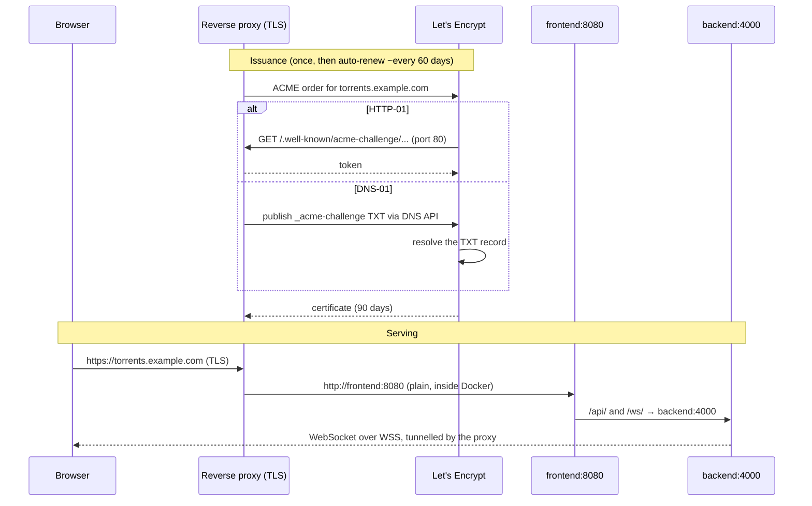

import Tabs from '@theme/Tabs';
import TabItem from '@theme/TabItem';

# TLS & HTTPS

## Overview

UltraTorrent's containers speak **plain HTTP** and are designed to sit behind something that terminates TLS. That is deliberate: certificate handling belongs in one place, and every serious deployment already has a reverse proxy.

So "enabling HTTPS" means: **put a proxy in front and give it a certificate.** This page covers the certificate half; [Reverse proxy](/install/reverse-proxy) covers the routing half.

You have three realistic options:

| | Use when | Effort |
|---|---|---|
| **Let's Encrypt — HTTP-01** | The box is reachable from the internet on port 80 | Lowest |
| **Let's Encrypt — DNS-01** | LAN-only, behind CGNAT, or you want a **wildcard** | Medium — needs a DNS provider API token |
| **Custom / internal CA cert** | Corporate PKI, or a homelab with its own CA | Medium — you must distribute the CA to clients |

:::tip Watch this tutorial
_Video coming soon._
:::

## Prerequisites

- A working [Docker Compose install](/install/docker-compose) and a [reverse proxy](/install/reverse-proxy).
- A **domain name you control**. A LAN-only IP address cannot get a public certificate — you need a hostname, even for an internal-only service (DNS-01 issues certificates for hostnames that never resolve publicly).
- For HTTP-01: **port 80 reachable from the internet**, and DNS already pointing at the host.

## Requirements

Negligible — TLS termination costs a few MB of RAM. What it costs is *attention*: an expired certificate is an outage.

## Ports

| Port | Needed for |
|------|-----------|
| **80** | HTTP-01 ACME challenge **and** the HTTP→HTTPS redirect. Keep it open even after you have a certificate — renewal uses it |
| **443** | HTTPS |
| — | DNS-01 needs **no** inbound port at all |

## Volumes

Whatever your proxy stores certificates in. Back it up:

| Proxy | Certificate store |
|-------|-------------------|
| Caddy (bundled `proxy` profile) | the `caddy_data` volume |
| Traefik | `acme.json` |
| NGINX + certbot | `/etc/letsencrypt` |
| Nginx Proxy Manager | its `data/` and `letsencrypt/` folders |
| HAProxy | your combined-PEM directory |

## Permissions

Private keys must be readable **only** by the process that uses them:

```bash
sudo chmod 600 /etc/haproxy/certs/torrents.example.com.pem
sudo chown root:root /etc/haproxy/certs/torrents.example.com.pem
```

Never commit a key to git; never put one in `.env`.

## How it fits together



Note the last line: because TLS terminates at the proxy, the browser's WebSocket is automatically **`wss://`** — you do not configure that anywhere. It only works if your proxy forwards the upgrade; see [Reverse proxy](/install/reverse-proxy).

## Step-by-step

<Tabs groupId="tls">
<TabItem value="caddy" label="Caddy (easiest)" default>

Caddy obtains, installs and renews a Let's Encrypt certificate with **zero configuration** beyond naming your domain.

Edit `deploy/Caddyfile` (or your own Caddyfile) so the site label is your domain rather than `:80`:

```caddy
torrents.example.com {
	encode gzip

	@api path /api/* /ws/*
	handle @api {
		reverse_proxy backend:4000
	}

	handle {
		# nginx-unprivileged listens on 8080 — not 80.
		reverse_proxy frontend:8080
	}
}
```

```bash
docker compose --profile proxy up -d
docker compose logs -f proxy        # watch the certificate get issued
```

Requirements: DNS for `torrents.example.com` already points at this host, and ports **80 and 443 are reachable**. Caddy handles the HTTP→HTTPS redirect and renewal itself.

**Wildcard / DNS-01 with Caddy** needs a DNS-provider plugin, which means a custom Caddy image:

```dockerfile
FROM caddy:2-builder AS builder
RUN xcaddy build --with github.com/caddy-dns/cloudflare
FROM caddy:2-alpine
COPY --from=builder /usr/bin/caddy /usr/bin/caddy
```

```caddy
*.example.com {
	tls {
		dns cloudflare {env.CLOUDFLARE_API_TOKEN}
	}
	reverse_proxy frontend:8080
}
```

</TabItem>
<TabItem value="certbot" label="Let's Encrypt + NGINX (certbot)">

**HTTP-01** — the standard path when the host is publicly reachable.

<Tabs groupId="os">
<TabItem value="deb" label="Ubuntu / Debian" default>

```bash
sudo apt update && sudo apt install -y certbot python3-certbot-nginx
```

</TabItem>
<TabItem value="rhel" label="Fedora / Rocky">

```bash
sudo dnf install -y certbot python3-certbot-nginx
```

</TabItem>
</Tabs>

With your [NGINX proxy config](/install/reverse-proxy) already in place and listening on port 80:

```bash
sudo certbot --nginx -d torrents.example.com
```

certbot edits the vhost, installs the certificate, and sets up the redirect. Renewal is installed as a systemd timer:

```bash
systemctl list-timers | grep certbot
sudo certbot renew --dry-run          # prove renewal works BEFORE you need it
```

**DNS-01 / wildcard** — no inbound port needed:

```bash
sudo apt install -y python3-certbot-dns-cloudflare
sudo install -m 600 /dev/null /etc/letsencrypt/cloudflare.ini
echo 'dns_cloudflare_api_token = <your-scoped-token>' | sudo tee /etc/letsencrypt/cloudflare.ini

sudo certbot certonly \
  --dns-cloudflare \
  --dns-cloudflare-credentials /etc/letsencrypt/cloudflare.ini \
  -d 'example.com' -d '*.example.com'
```

Then point NGINX at `/etc/letsencrypt/live/example.com/fullchain.pem` and `privkey.pem`, and reload after each renewal:

```bash
# /etc/letsencrypt/renewal-hooks/deploy/reload-nginx.sh
#!/bin/sh
systemctl reload nginx
```

```bash
sudo chmod +x /etc/letsencrypt/renewal-hooks/deploy/reload-nginx.sh
```

</TabItem>
<TabItem value="traefik" label="Traefik">

Static config (`traefik.yml`):

```yaml
certificatesResolvers:
  letsencrypt:
    acme:
      email: you@example.com
      storage: /letsencrypt/acme.json
      httpChallenge:
        entryPoint: web

  # Wildcard / no open ports:
  letsencrypt-dns:
    acme:
      email: you@example.com
      storage: /letsencrypt/acme-dns.json
      dnsChallenge:
        provider: cloudflare
        resolvers: ["1.1.1.1:53"]
```

```yaml
# the Traefik service
environment:
  CF_DNS_API_TOKEN: ${CLOUDFLARE_API_TOKEN}
volumes:
  - ./letsencrypt:/letsencrypt
```

Then on the `frontend` service:

```yaml
labels:
  - "traefik.http.routers.ultratorrent.tls.certresolver=letsencrypt"
  # wildcard variant:
  # - "traefik.http.routers.ultratorrent.tls.certresolver=letsencrypt-dns"
  # - "traefik.http.routers.ultratorrent.tls.domains[0].main=example.com"
  # - "traefik.http.routers.ultratorrent.tls.domains[0].sans=*.example.com"
```

`acme.json` must be mode **0600** or Traefik refuses to use it.

</TabItem>
<TabItem value="custom" label="Custom / corporate certificate">

You have a certificate from a commercial CA or your company's internal PKI. You will typically get:

- `certificate.crt` — your leaf certificate
- `intermediate.crt` (or a bundle) — the chain
- `private.key` — the key

**Build the chain properly.** Browsers need leaf **then** intermediates, in that order:

```bash
cat certificate.crt intermediate.crt > fullchain.pem
```

<Tabs groupId="proxy">
<TabItem value="nginx" label="NGINX" default>

```nginx
ssl_certificate     /etc/ssl/ultratorrent/fullchain.pem;
ssl_certificate_key /etc/ssl/ultratorrent/private.key;

ssl_protocols       TLSv1.2 TLSv1.3;
ssl_prefer_server_ciphers off;
ssl_session_cache   shared:SSL:10m;
```

</TabItem>
<TabItem value="haproxy" label="HAProxy">

HAProxy wants **one** file: fullchain **and** key concatenated.

```bash
cat fullchain.pem private.key > /etc/haproxy/certs/torrents.example.com.pem
sudo chmod 600 /etc/haproxy/certs/torrents.example.com.pem
```

```haproxy
bind :443 ssl crt /etc/haproxy/certs/torrents.example.com.pem alpn h2,http/1.1
```

</TabItem>
<TabItem value="caddy" label="Caddy">

```caddy
torrents.example.com {
	tls /etc/ssl/ultratorrent/fullchain.pem /etc/ssl/ultratorrent/private.key
	reverse_proxy frontend:8080
}
```

Mount both files into the proxy container read-only.

</TabItem>
</Tabs>

**Internal CA / homelab.** `mkcert` produces certificates trusted by machines you install its root CA on:

```bash
mkcert -install
mkcert torrents.home.lan
```

Every device that will open the UI — including phones — must trust that root CA, or you get a browser warning. For a homelab with more than two or three devices, **DNS-01 with a real domain is less work** than distributing a CA.

</TabItem>
</Tabs>

## Verification

**The chain is complete and the dates are right:**

```bash
openssl s_client -connect torrents.example.com:443 -servername torrents.example.com < /dev/null 2>/dev/null \
  | openssl x509 -noout -subject -issuer -dates
```

```text
subject=CN = torrents.example.com
issuer=C = US, O = Let's Encrypt, CN = R11
notBefore=Jul 12 09:14:02 2026 GMT
notAfter=Oct 10 09:14:01 2026 GMT
```

**No chain gaps** (the classic "works in Chrome, fails on Android" bug):

```bash
openssl s_client -connect torrents.example.com:443 -servername torrents.example.com < /dev/null 2>&1 | grep -i "verify"
```

```text
Verify return code: 0 (ok)
```

**HTTP redirects to HTTPS:**

```bash
curl -sI http://torrents.example.com | head -1
# HTTP/1.1 301 Moved Permanently
```

**The app works over TLS**, WebSocket included:

```bash
curl -s https://torrents.example.com/api/system/live
```

Then open the UI and confirm a download's progress bar updates live — that proves `wss://` is tunnelling correctly through your TLS terminator.


:::tip Where did the padlock go?
Chrome 117 and later replaced the padlock icon with a **site information** icon (the two
sliders). Click it: a working certificate reads **"Connection is secure"**, and
*Connection is secure → Certificate is valid* shows the issuer. A misconfigured chain
says "Not secure" here even when the page still loads.
:::

## Reverse proxy

TLS and routing are two halves of one job. Configure the routing (and the mandatory WebSocket upgrade) in **[Reverse proxy](/install/reverse-proxy)**.

## Updates

Certificates are independent of UltraTorrent upgrades — rebuilding the stack does not touch them, as long as your proxy's certificate store is a volume or a host path outside the repo.

**After any certificate renewal, the proxy must reload.** Caddy and Traefik do it themselves. NGINX and HAProxy need a deploy hook (see the certbot tab above).

## Backups

Back up the certificate store (`caddy_data`, `acme.json`, `/etc/letsencrypt`, your PEM directory) alongside your `.env` and database dump. Losing it is recoverable — but Let's Encrypt rate-limits duplicate certificates (5 per identical name set per week), so repeatedly losing it will lock you out of re-issuance for days.

## Troubleshooting

| Symptom | Cause | Fix |
|---------|-------|-----|
| ACME fails: *"Timeout during connect"* on HTTP-01 | Port 80 is not reachable from the internet | Open 80 on the firewall **and** the router. Cloud hosts: check the security group. Or switch to DNS-01, which needs no inbound port |
| ACME fails: *"Invalid response … 404"* | Something else is answering on port 80, or the proxy is not serving `/.well-known/acme-challenge/` | Make the proxy the only thing on port 80 |
| *"too many certificates already issued"* | Let's Encrypt rate limit — usually from a loop of failed retries | Wait it out (a week), and test against `--staging` / the ACME staging directory next time |
| Certificate valid in Chrome, **untrusted on Android/iOS** | Missing intermediate — you served the leaf only | Serve the **fullchain**: `cat certificate.crt intermediate.crt > fullchain.pem` |
| `ERR_SSL_PROTOCOL_ERROR` | You are hitting an HTTP-only port over HTTPS (e.g. `https://host:8080`) | The container speaks plain HTTP. Go through the proxy's 443 |
| Padlock is valid, but **the UI never updates** | TLS is fine; the **WebSocket** upgrade is being dropped | See [Reverse proxy → verification](/install/reverse-proxy#verification) |
| Mixed-content warnings in the console | Something is requesting `http://` from an `https://` page | The SPA uses relative URLs by default. Check `CORS_ORIGIN` and any custom `VITE_API_URL` build arg |
| Traefik ignores `acme.json` | Wrong file permissions | `chmod 600 acme.json` |
| Certificate expired | Renewal ran but the proxy never reloaded | Add a deploy hook that reloads the proxy; verify with `certbot renew --dry-run` |
| Browser warning on a `mkcert` certificate | The device does not trust your root CA | Install the root CA on that device — or move to DNS-01 with a real domain |

## Best practices

- **Automate renewal, then prove it works** — `certbot renew --dry-run` — long before day 89.
- **Prefer Caddy or Traefik** if you have no strong opinion: they issue and renew certificates with no cron job to forget.
- **Use DNS-01 for LAN-only installs.** A public certificate for a private hostname, no inbound ports, no browser warnings, no CA to distribute.
- **Always serve the full chain**, never the bare leaf.
- **Keep port 80 open** for redirects and HTTP-01 renewals, even once HTTPS works.
- **TLS 1.2 minimum**, TLS 1.3 preferred.
- **Back up the certificate store** with everything else.
- **Never terminate TLS inside the app containers** — they are built to sit behind a proxy.
- **Public deployment? TLS is table stakes, not the whole story.** Also read [Security](/operate/security).

## FAQ

**Can I get a certificate for a bare IP address?**
Not from Let's Encrypt. Use a hostname (DNS-01 works even if it only resolves on your LAN).

**Do I need to change anything in UltraTorrent for HTTPS?**
Only `CORS_ORIGIN` in `.env`, to your public `https://` origin. The SPA uses relative URLs, so `wss://` follows automatically.

**Can I terminate TLS on the frontend container directly?**
No — it is a plain-HTTP nginx by design. Use a proxy.

**Self-signed for a quick test?**
Fine for a lab, but every device will warn, and some tooling will refuse. `mkcert` is a better version of the same idea.

**Does the bundled Caddy profile renew automatically?**
Yes, as long as it keeps running and `caddy_data` persists.

## Checklist

- [ ] A hostname exists and (for HTTP-01) resolves to the host
- [ ] The reverse proxy is working over plain HTTP first
- [ ] Ports 80 and 443 reachable (HTTP-01) — or a DNS API token in place (DNS-01)
- [ ] Certificate issued, **fullchain** served
- [ ] `openssl s_client` reports `Verify return code: 0 (ok)`
- [ ] HTTP redirects to HTTPS
- [ ] Renewal automated **and** dry-run tested
- [ ] Proxy reloads on renewal (deploy hook, for NGINX/HAProxy)
- [ ] `CORS_ORIGIN` updated to the `https://` origin; backend recreated
- [ ] The live UI still updates over `wss://`
- [ ] Certificate store included in backups
- [ ] Private key is `0600`, owned by the proxy's user, and not in git

## See also

- [Reverse proxy](/install/reverse-proxy) — the routing half, and the WebSocket requirement
- [Cloud / VPS install](/install/platforms/cloud) — where HTTPS is mandatory
- [Docker Compose install](/install/docker-compose)
- [Security](/operate/security) · [Troubleshooting](/operate/troubleshooting)
