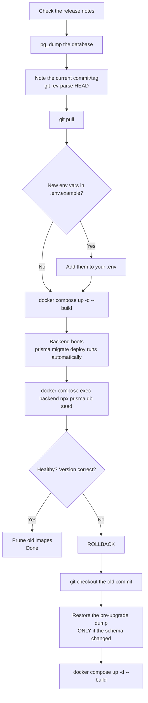
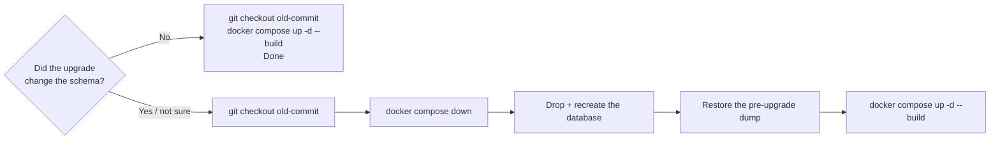

import Tabs from '@theme/Tabs';
import TabItem from '@theme/TabItem';

# Upgrading & rollback

## Overview

UltraTorrent is updated by **pulling the latest source and rebuilding the images**. There is no published registry image to `docker pull`, and nothing auto-updates itself.

Two facts govern everything on this page:

1. **Database migrations apply automatically.** The backend container's command is `prisma migrate deploy && node dist/main.js`, so a new release migrates the schema the moment its container starts.
2. **Migrations are forward-only.** There is no `migrate down`. Once a new schema is applied, the *only* way back to the old code is to **restore the database backup you took first**.

Which is why every procedure below starts with a `pg_dump`.

:::danger Back up before every upgrade
It is one command and it is the entire difference between "roll back in two minutes" and "reinstall from scratch".
:::

:::tip Watch this tutorial
_Video coming soon._
:::

## Prerequisites

- Shell access to the Docker host.
- Somewhere to put a database dump that is **not** the host you are upgrading.
- A few minutes of downtime — the rebuild recreates containers.

## Requirements

Same as the install: **~2 GB of free RAM** for the rebuild, plus a couple of GB of disk for the new image layers (old ones linger until you prune).

## Ports · Volumes · Permissions

An upgrade changes none of them. Your `.env`, your `docker-compose.override.yml`, your `postgres_data` and your `downloads` all survive — `git pull` does not touch untracked files, and `up -d --build` recreates containers, not volumes.

The one thing that *can* change across releases: **new environment variables**. Diff the template after pulling:

```bash
git diff HEAD@{1} -- .env.example
```

## The upgrade flow



## Step-by-step

### 1. Read the release notes

Check the project's `CHANGELOG.md` for the versions between yours and the target. Look for anything about **required environment variables**, **breaking changes**, or **manual migration steps**.

Your current version:

```bash
curl -s http://localhost:8080/api/system/version
```

…or **Settings → About** in the UI.

### 2. Back up

```bash
cd ultratorrent-core

# The database — everything except the media itself
docker compose exec -T postgres pg_dump -U ultratorrent ultratorrent > backup-$(date +%F).sql

# Your .env — without ENCRYPTION_KEY you cannot decrypt stored 2FA secrets
cp .env ~/ultratorrent-env-$(date +%F).bak

# The exact commit you are on right now — your rollback target
git rev-parse HEAD > ~/ultratorrent-rollback-$(date +%F).txt
```

Verify the dump is not empty and is not an error message:

```bash
ls -lh backup-$(date +%F).sql
head -5 backup-$(date +%F).sql        # should start with PostgreSQL dump headers
```

Then **copy it off the host**. A backup on the machine you are about to break is not a backup. See [Backup & restore](/operate/backup).

### 3. Pull the new code

```bash
git pull
```

Your `.env` and `docker-compose.override.yml` are untracked, so they survive untouched.

:::caution If you edited a tracked file
Editing `docker-compose.yml` or `deploy/Caddyfile` in place makes `git pull` conflict. Keep your customizations in **`docker-compose.override.yml`** instead — that is exactly what it is for.
:::

No `git`? Download the new ZIP, extract it **over** the folder, and keep your `.env` and override file.

### 4. Check for new environment variables

```bash
git diff HEAD@{1} -- .env.example
```

Anything new and required goes into your `.env` **before** you start.

### 5. Rebuild and restart

<Tabs groupId="engine">
<TabItem value="rtorrent" label="With bundled rTorrent" default>

```bash
docker compose --profile rtorrent up -d --build
```

</TabItem>
<TabItem value="qbittorrent" label="With bundled qBittorrent">

```bash
docker compose --profile qbittorrent up -d --build
```

</TabItem>
<TabItem value="own" label="Own engine (no profile)">

```bash
docker compose up -d --build
```

</TabItem>
</Tabs>

:::warning Pass the same profiles you installed with
`docker compose up -d` **without** `--profile rtorrent` will leave the rTorrent container *stopped*. Always repeat the profiles you originally used.
:::

The backend runs `prisma migrate deploy` as it boots, so schema changes apply on their own. Watch it:

```bash
docker compose logs -f backend
```

### 6. Re-seed

```bash
docker compose exec backend npx prisma db seed
```

This picks up **new permissions, roles and default settings** introduced by the release. It is idempotent: it never resets your admin password and never touches your data. Skip it and new features may be invisible because nobody holds their permission.

### 7. Verify

```bash
docker compose ps                                   # all healthy
curl -s http://localhost:8080/api/system/version    # the NEW version
docker compose logs backend | tail -30              # no migration errors
```

Then, in the UI: log in, open **Torrents** (the engine should still be connected and your torrents present), and confirm a transfer's progress updates live.

### 8. Clean up

```bash
docker image prune -f
```

Rebuilds leave dangling image layers behind. Do this occasionally, not obsessively — pruning too aggressively costs you the layer cache on the next build.

## Verification

```bash
docker compose ps
```

```text
NAME                       STATUS                   PORTS
ultratorrent-backend-1     Up 40 seconds (healthy)  4000/tcp
ultratorrent-frontend-1    Up 40 seconds (healthy)  0.0.0.0:8080->8080/tcp
ultratorrent-postgres-1    Up 45 seconds (healthy)  5432/tcp
ultratorrent-redis-1       Up 45 seconds (healthy)  6379/tcp
ultratorrent-rtorrent-1    Up 40 seconds (healthy)  5000/tcp
```

```bash
curl -s http://localhost:8080/api/system/version
```

The version string should be the release you just installed. It is also shown in **Settings → About**, along with the git commit if the image was stamped with build args.


## Rollback

Rollback is easy *if* you have the dump. It is not possible if you do not.



**Did the schema change?** Compare the migration folder between the two commits:

```bash
git diff --stat <old-commit> HEAD -- apps/backend/prisma/migrations
```

Empty output → no schema change → the simple path is enough.

### Simple rollback (no schema change)

```bash
git checkout <old-commit-or-tag>
docker compose --profile rtorrent up -d --build
```

### Full rollback (schema changed)

The new migration is already applied; the old code will not understand the new schema. You must restore.

```bash
# 1. Go back to the old code
git checkout <old-commit-or-tag>

# 2. Stop everything (keep the volumes!)
docker compose down

# 3. Bring ONLY postgres up, and reset the database
docker compose up -d postgres
docker compose exec -T postgres psql -U ultratorrent -d postgres \
  -c "DROP DATABASE ultratorrent;" -c "CREATE DATABASE ultratorrent;"

# 4. Restore your pre-upgrade dump
docker compose exec -T postgres psql -U ultratorrent -d ultratorrent < backup-2026-07-12.sql

# 5. Bring the old stack back up
docker compose --profile rtorrent up -d --build
```

:::danger `docker compose down -v` destroys your database
`-v` removes the volumes — including `postgres_data` **and** `downloads`. Never use it as part of a rollback. The only legitimate use is a deliberate wipe-and-start-over on an install with no real data.
:::

Your **downloads are untouched** by any of this. The `downloads` volume is never migrated, dropped or rewritten.

## Migration safety

| Fact | Consequence |
|------|-------------|
| Migrations run **on backend start**, automatically | You cannot "upgrade the code but not the database" |
| Migrations are **forward-only** — there is no down-migration | Rolling back across a schema change **requires** the pre-upgrade dump |
| `prisma migrate deploy` is **idempotent** | A restarted container does not re-run applied migrations |
| A failed migration **stops the backend** | The container will crash-loop rather than run against a half-migrated schema — that is intentional |
| The seed is **idempotent** | Safe (and recommended) to re-run after every upgrade |
| Skipping versions is fine | Prisma applies every pending migration in order |

If the backend crash-loops with a migration error after an upgrade, **do not** try to fix the schema by hand. Restore the dump, go back to the old commit, and open an issue with the log.

## Updating a NAS GUI deployment

If you deployed through Container Manager / Container Station rather than SSH:

1. Update the source folder on the NAS (SSH `git pull`, or re-copy the extracted ZIP over it, keeping `.env`).
2. Use the GUI's rebuild action — **Project → Build** (Synology) or **Rebuild** (QNAP).
3. Run the one-time seed. Either over SSH, or from the **backend** container's built-in **Terminal** tab: `npx prisma db seed`.

See [Synology](/install/platforms/synology) and [QNAP](/install/platforms/qnap).

## Backups

The upgrade backup above is a *point-in-time safety net*, not a backup strategy. For a real one — scheduling, retention, restore drills — see **[Backup & restore](/operate/backup)**.

The minimum viable set:

- `pg_dump` of the database
- Your `.env` (especially `ENCRYPTION_KEY` — without it, stored 2FA secrets are unrecoverable)
- Your `docker-compose.override.yml`

## Troubleshooting

| Symptom | Cause | Fix |
|---------|-------|-----|
| Backend crash-loops after an upgrade with a **migration error** | A migration failed part-way, or the schema was hand-edited | Restore the pre-upgrade dump, `git checkout` the old commit, rebuild. Do **not** patch the schema manually |
| Backend exits: *"insecure secret configuration"* after an upgrade | A newly required secret is missing, or the release tightened validation | Diff `.env.example`, fill in the missing/weak values, `docker compose up -d backend` |
| The bundled engine container is **gone** after an upgrade | You ran `up -d` without repeating `--profile rtorrent` | Re-run with the profile |
| A new feature is invisible / "permission denied" for the admin | The new release added permissions and you did not re-seed | `docker compose exec backend npx prisma db seed` |
| `git pull` refuses: *"local changes would be overwritten"* | You edited a tracked file (usually `docker-compose.yml`) | Move the change into `docker-compose.override.yml`, then `git checkout -- <file>` and pull |
| `/api/system/version` still reports the old version | The image was not rebuilt — you ran `up -d` without `--build` | `docker compose up -d --build` |
| Disk fills up after several upgrades | Dangling image layers accumulate | `docker image prune -f` |
| Torrents vanished after the upgrade | Almost never the upgrade. Check the engine is running and still registered | The rTorrent session lives in `/downloads/.session` and survives rebuilds. Check **Infrastructure → Engines** |
| The rebuild is OOM-killed | Under ~2 GB free RAM | Free memory or add swap, then rebuild |

More: **[Troubleshooting](/operate/troubleshooting)**.

## Best practices

- **`pg_dump` first. Every time. No exceptions.** Forward-only migrations mean the dump is your only rollback.
- **Copy the dump off the host.**
- **Record the commit you are on** (`git rev-parse HEAD`) before pulling — that is your rollback target.
- **Read the changelog** between your version and the target, especially for new required env vars.
- **Keep all customizations in `docker-compose.override.yml`** and `.env`, never in tracked files, so `git pull` is always clean.
- **Always repeat your `--profile` flags.**
- **Always re-seed** after an upgrade.
- **Upgrade when you can watch it**, not right before you need the box to work.
- **Test a restore occasionally.** An untested backup is a rumour.
- **Do not skip past a release with a manual migration step** — read the notes for every version you cross.

## FAQ

**Do I lose my torrents when I upgrade?**
No. Torrent state lives in the engine (rTorrent's session directory is inside the `downloads` volume) and in the database — neither is touched by a rebuild.

**Do I lose my downloads?**
No. The `downloads` volume is never modified by an upgrade. Only `docker compose down -v` would destroy it.

**Do I have to re-seed?**
It is strongly recommended — new permissions and settings only appear if you do. It is idempotent and safe.

**Can I skip several versions?**
Yes. Prisma applies every pending migration in order. Read the changelog for all of them.

**Can I downgrade without a backup?**
Not across a schema change. The new schema is already applied and the old code cannot read it.

**Does UltraTorrent check for updates itself?**
The API exposes an update-status endpoint (`GET /api/system/update`, permission-gated) that reports whether a newer release exists and how to apply it for your deployment. It does **not** apply anything automatically.

**How do I upgrade a manual (non-Docker) install?**
`git pull`, `npm install`, `npm run prisma:generate`, `npm run prisma:migrate`, `npm run prisma:seed`, `npm run build`, restart. Back up the database first, for the same forward-only reason. See [Linux](/install/platforms/linux#manual-install-from-source).

## Checklist

- [ ] Changelog read for every version being crossed
- [ ] `pg_dump` taken **and copied off the host**
- [ ] `.env` backed up
- [ ] Current commit recorded (`git rev-parse HEAD`)
- [ ] `git pull` clean (no conflicts on tracked files)
- [ ] `.env.example` diffed for new variables
- [ ] Rebuilt **with the same `--profile` flags** as the original install
- [ ] Backend logs show migrations applied, no errors
- [ ] Seed re-run
- [ ] `docker compose ps` — everything healthy
- [ ] `/api/system/version` reports the new version
- [ ] Engine still connected; torrents still listed; live updates still working
- [ ] `docker image prune -f`
- [ ] Backup retained until you are confident in the new version

## See also

- [Docker Compose install](/install/docker-compose) — the stack you are upgrading
- [Backup & restore](/operate/backup) — the real backup strategy
- [Environment variables](/reference/environment) — check for new ones after a pull
- [Troubleshooting](/operate/troubleshooting)
- [Synology](/install/platforms/synology) · [QNAP](/install/platforms/qnap) — GUI-deployed rebuilds
