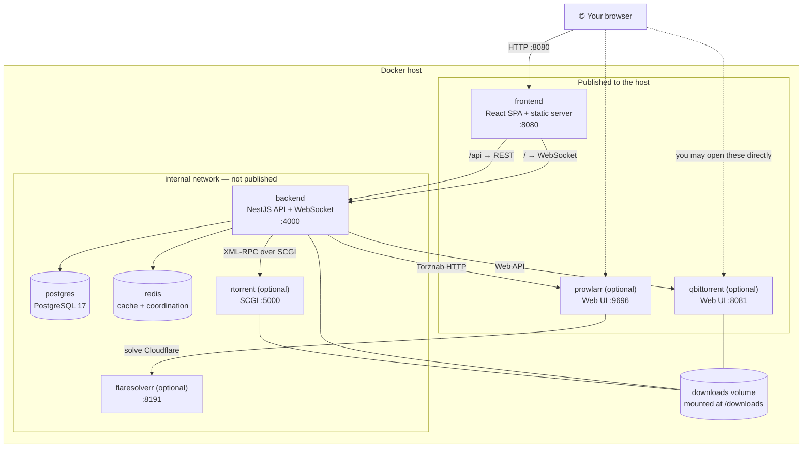
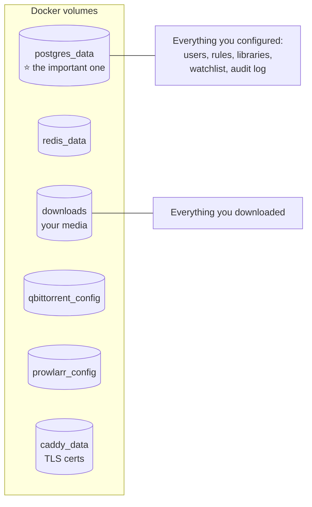
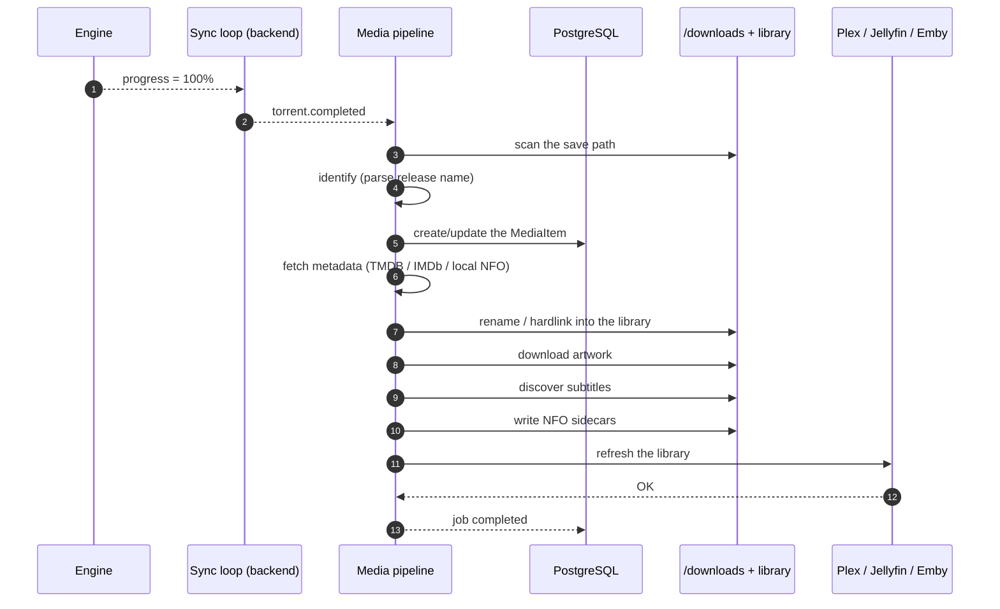
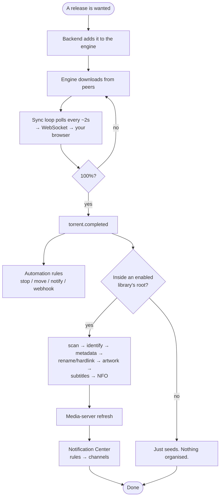

# Architecture Overview

What actually runs on your machine, what talks to what, and what happens between
"paste a magnet" and "Plex shows the movie".

:::info This is the *user's* architecture tour
It explains the moving parts you can see, restart, and back up. If you want the
engineering internals — Clean Architecture layers, provider seams, module
manifests, the event bus — read [Developer architecture](/develop/architecture).
:::

## Overview

UltraTorrent is a small constellation of containers. Only two of them are
UltraTorrent itself; the rest are well-known infrastructure and optional
companions.



## Purpose

Understanding this diagram lets you answer, on your own:

- *Why can't the backend reach my engine at `localhost`?*
- *What do I actually need to back up?*
- *Which container do I look at when something breaks?*
- *What is safe to expose, and what must never be?*

## When to use this page

Read it after [Quick Start](/learn/quick-start), before you put UltraTorrent
anywhere near a real network, and again whenever you are debugging something that
crosses a container boundary.

## Prerequisites

- A running stack (see [Quick Start](/learn/quick-start)).
- The vocabulary from [Core Concepts](/learn/concepts) — engine, indexer, tracker,
  library.
- A rough idea of what a Docker container and a Docker volume are.

---

## Concepts

### The two halves of UltraTorrent

| | **frontend** | **backend** |
| --- | --- | --- |
| What it is | A React 18 + Vite single-page app, served as static files. | A NestJS API server. |
| What it does | Renders the UI. Nothing else. | Everything else. |
| Talks to | Only the backend. | Postgres, Redis, the engine, indexers, media servers, notification providers. |
| Published to the host | Yes — `:8080` by default. | **No.** The frontend reaches it over the internal network. |

:::warning The browser never talks to your torrent engine
This is a deliberate architectural rule and it is worth understanding. The SPA
talks **only** to the UltraTorrent API. The API translates every request into the
engine's native protocol (XML-RPC over SCGI for rTorrent, the Web API for
qBittorrent) and hands back **normalized**, engine-agnostic data. That is why you
can swap engines without any UI or rule changing, and why your engine never has to
be exposed to a browser.
:::

### Every container, and what it is for

| Container | Required? | Purpose | If it dies… |
| --- | --- | --- | --- |
| **postgres** | ✅ Always | The system of record: users, roles, permissions, torrent snapshots, RSS feeds/rules, automation, notifications, API keys, the audit log, settings, and the whole Media Manager model set. | The backend cannot start. **This is what you back up.** |
| **redis** | ✅ Always | Caching and background-job coordination. | Things get slower; state is not lost. |
| **backend** | ✅ Always | The API, the WebSocket gateway, the engine sync loop, RSS polling, scheduled jobs, the media pipeline, notification delivery. Runs `prisma migrate deploy` on boot. | Nothing works. Check its logs first. |
| **frontend** | ✅ Always | Serves the SPA on `:8080`. | The UI is unreachable; the API still works. |
| **rtorrent** | Optional (`--profile rtorrent`) | Bundled BitTorrent engine, SCGI on `:5000`. | Transfers stop; UltraTorrent keeps running. |
| **qbittorrent** | Optional (`--profile qbittorrent`) | Bundled BitTorrent engine, Web API on `:8080` internally, published on `:8081`. **Preferred for large libraries.** | Transfers stop; UltraTorrent keeps running. |
| **prowlarr** | Optional (`--profile prowlarr`) | An indexer *manager*. Not part of UltraTorrent — UltraTorrent only links to it and searches its Torznab endpoints. | Indexer search fails; everything else works. |
| **flaresolverr** | Optional (`--profile flaresolverr`) | Solves Cloudflare anti-bot challenges for Prowlarr indexers that need it. Internal only. | Cloudflare-protected indexers fail. |
| **proxy** | Optional (`--profile proxy`) | A Caddy edge reverse proxy for TLS termination on `:80`/`:443`. | Direct-port access still works. |

:::danger Only *one* engine is a good idea at a time, at first
You can register several engines and mark one **Default**. But while you are
learning, run one. Two engines writing into the same `/downloads` tree is a fine
way to confuse yourself.
:::

### Ports, at a glance

| Port | Who | Published to host? | Change with |
| --- | --- | --- | --- |
| `8080` | frontend (the web UI) | ✅ Yes | `FRONTEND_PORT` |
| `4000` | backend API | ❌ No (internal only) | Add a `ports:` mapping if you need it |
| `5432` | postgres | ❌ No | — |
| `6379` | redis | ❌ No | — |
| `5000` | rtorrent SCGI | ❌ No | — |
| `8081` | qBittorrent Web UI | ✅ Yes | `QBITTORRENT_PORT` |
| `9696` | Prowlarr Web UI | ✅ Yes | `PROWLARR_PORT` |
| `8191` | FlareSolverr | ❌ No | — |
| `80` / `443` | Caddy proxy | ✅ Yes (`--profile proxy`) | — |

:::info Inside the network, use container names
`qbittorrent:8080`, `rtorrent:5000`, `prowlarr:9696`, `postgres:5432`. From
*inside* the backend container, `localhost` means the backend itself — never the
engine. This is the #1 cause of "engine test failed".
:::

### Where your data lives



**Back up `postgres_data` and your `.env`.** Those two, together, are your
install. Losing `downloads` costs you bandwidth; losing `postgres_data` costs you
every rule, library, user and decision you ever configured.

:::danger Back up `ENCRYPTION_KEY` with the database
`ENCRYPTION_KEY` decrypts what is stored encrypted in that database — 2FA secrets,
indexer API keys, media-server tokens, notification credentials. A database
restored without its matching key has a lot of unreadable secrets in it. Keep them
together. See [Backup &amp; restore](/operate/backup).
:::

---

## Step-by-step: how a download actually flows

Follow one file all the way through. Each step names the component that owns it.

### Step 1 — Something decides a release is wanted

Three doors lead into the same hallway:

| Door | Who opens it | Component |
| --- | --- | --- |
| You paste a magnet | You | The **Torrents** page → REST `POST /api/torrents` |
| An RSS rule matches | The `rss_poll` job (every 60s) | The **RSS** module |
| A gap gets filled | The missing-episode sweep or **Search now** | **Indexers** + **Smart Download** |

**Expected result:** the backend holds a magnet or a `.torrent` URL, and knows the
save path, category and tags to use.

### Step 2 — The backend hands it to the engine

The backend calls the engine through the **engine seam** — one interface every
engine implements. rTorrent gets XML-RPC over SCGI; qBittorrent gets its Web API.

For a `.torrent` **URL**, the backend fetches it server-side through an **SSRF
guard** that rejects private/internal addresses unless the host is listed in
`SSRF_ALLOW_HOSTS`.

**Expected result:** the engine has the torrent and starts talking to the tracker.

### Step 3 — The engine transfers the data

The engine announces to the tracker, gets a peer list, and exchanges pieces. It
writes into `/downloads` — the volume the backend also mounts.

**Expected result:** bytes on disk, progress climbing.

### Step 4 — The sync loop notices, and your browser updates itself

A background sync service polls every engine roughly every **2 seconds**,
normalizes what it finds, and fans it out over the **WebSocket gateway** to
permission-scoped rooms.

**Expected result:** the Torrents page updates live, with no refresh. You are not
polling from the browser — the server is pushing.

### Step 5 — Completion fires an event

When the sync loop sees progress cross **100%**, it emits `torrent.completed`.

Two independent things listen:

- The **automation engine** — your condition/action rules.
- The **media pipeline** — but **only** if an enabled library's root path
  *contains* this torrent's save path. Arbitrary downloads are never auto-organised.

:::info Completion is edge-triggered *and* backfilled
`torrent.completed` fires when progress crosses to 100% on a live tick. A
`reconcileCompleted` backfill then re-evaluates torrents that are *already*
complete but never crossed that edge — first seen complete, finished while the app
was down, or a rule created after completion. A success ledger keeps it
idempotent, so each rule runs **once per torrent**.
:::

### Step 6 — The media pipeline turns a download into a library entry



Each stage is isolated — a failure in one **never aborts the rest** — and each
fires a `media.*` event your automation rules can react to.

**Expected result:** a correctly named file in your library, enriched with
metadata and artwork, visible in your media server.

### Step 7 — Notifications go out

Modules publish events onto an internal bus. The **Notification Center**'s rules
decide **if**, **when**, **how** and **to whom** — nothing is hardcoded. Delivery
runs on a worker with quiet-hours, rate-limiting, retries and escalation, over
Email, Telegram, SMS or WhatsApp.

**Expected result:** the message you configured, in the channel you chose.

### The whole thing, on one diagram



---

## Examples

### Trace a problem to a container in one command

```bash
docker compose logs --tail 100 backend      # rules, decisions, the API, the pipeline
docker compose logs --tail 100 qbittorrent  # transfers, tracker errors
docker compose logs --tail 100 prowlarr     # indexer search failures
docker compose logs --tail 100 postgres     # migrations, connection errors
```

Nine times out of ten, `backend` is the right first look.

### Confirm the backend can actually see the engine

```bash
docker compose exec backend sh -c "getent hosts qbittorrent || getent hosts rtorrent"
```

If that prints nothing, they are not on the same Docker network and no engine
configuration will ever work.

### Confirm they share a filesystem (so hardlinks can work)

```bash
docker compose exec backend    stat -c '%d %m' /downloads
docker compose exec qbittorrent stat -c '%d %m' /downloads
```

Same mount point, same device → hardlinks will work.

---

## Troubleshooting

| Symptom | The component to look at | Why |
| --- | --- | --- |
| Web UI blank / unreachable | `frontend` | Port conflict, or the container is not running. |
| UI loads but every request errors | `backend` | The API is down or refused to boot. |
| Backend refuses to boot | `.env` | Missing/weak/identical `JWT_ACCESS_SECRET` and `ENCRYPTION_KEY`. |
| Backend cannot start, DB errors | `postgres` | Volume corruption, or a wrong `POSTGRES_PASSWORD`. |
| Engine test fails | `backend` → engine networking | You used `localhost`, or the profile is not running. |
| Torrents show but never update | `backend` | The WebSocket did not connect — check the connection indicator in the top bar. |
| Indexer search returns nothing | `prowlarr` | The indexer is down, or blocked by Cloudflare → add FlareSolverr. |
| Auto-grabs silently do nothing | `backend` (SSRF guard) | Private-IP indexer not in `SSRF_ALLOW_HOSTS`. |
| Files organised but Plex shows nothing | the media-server integration | Wrong base URL/token, or Plex cannot see the same path. |

More at [Troubleshooting](/operate/troubleshooting) and [Performance](/operate/performance).

:::note Screenshot needed
The **System** health surface on the **Settings** page (`/settings`), showing
service/health status — the fastest in-app way to see which component is unhappy.
:::


:::note Screenshot needed
The **Modules** page (`/modules`) showing each module's tier (core/community),
state (enabled / disabled / missing dependency) and dependencies.
:::


---

## Tips

:::tip Health probes are public on purpose
`/api/system/live` and `/api/system/ready` need no authentication so that Docker,
Kubernetes and your uptime monitor can check them. They expose no data.
:::

:::tip Everything long-running is a background job
Scanning, metadata, artwork, subtitles, renaming, NFO generation, media-server
refresh, notification delivery — none of it blocks an HTTP request. Each unit is
persisted as a job with queued/running/completed/failed status and streams its
progress over WebSocket. If a page seems to "hang", it usually is not: look for
the job.
:::

:::warning Do not publish the backend port unless you mean it
The backend is deliberately not published to the host. If you expose `:4000`
directly, you have exposed the API — put it behind the reverse proxy instead. See
[Reverse proxy](/install/reverse-proxy) and [Security](/operate/security).
:::

:::tip Watch this tutorial
_Video coming soon._
:::

---

## FAQ

**Can I use my own PostgreSQL / Redis?**
Yes. Point `DATABASE_URL` (manual installs) and `REDIS_HOST` / `REDIS_PORT` at
them and drop those services from Compose. See [Environment](/reference/environment).

**Can I run the engine on a different machine?**
Yes, if the backend can reach it over the network **and** the paths it reports are
visible to the backend at the same paths. The second half is the hard part — that
is why the bundled stack shares one volume.

**Do I need Redis?**
Yes, in the supported deployment. It backs caching and background-job coordination.

**Does UltraTorrent need an internet connection to run?**
The application itself, no. Metadata (TMDB), artwork, indexer search and
notification delivery obviously do. The docs site itself is built with a local,
offline search index precisely because self-hosted users may be air-gapped.

**Is there an external message broker / queue?**
No. Background work runs in-process, persisted as jobs, with Redis for
coordination — no external broker is required.

**Where do I change the port the UI runs on?**
`FRONTEND_PORT` in `.env`, then `docker compose up -d`.

---

## Checklist

- [ ] You can name every container in your `docker compose ps` output and say what it does.
- [ ] You know which port the UI is on and which ports are internal-only.
- [ ] You know that the browser never talks to the engine.
- [ ] You can explain why `localhost` fails inside the backend container.
- [ ] You know that `postgres_data` + `.env` (with `ENCRYPTION_KEY`) is what you must back up.
- [ ] You can trace a magnet all the way to a media-server refresh.
- [ ] `docker compose exec backend stat -c '%d %m' /downloads` matches the engine's.

### Expected results

| Check | Expected |
| --- | --- |
| `curl http://localhost:8080/api/system/ready` | Success. |
| `docker compose exec backend getent hosts qbittorrent` | An internal IP. |
| Top bar in the UI | A connected WebSocket indicator and live rates. |

### Next steps

1. [My First Download](/learn/first-download) — exercise this architecture, slowly.
2. [Workflows](/learn/workflows) — the seven canonical flows as diagrams.
3. [Backup &amp; restore](/operate/backup) — now that you know what matters.
4. [Developer architecture](/develop/architecture) — the internals, if you want them.

---

## See also

- [Docker Compose install](/install/docker-compose) — the full service reference.
- [Reverse proxy](/install/reverse-proxy) · [TLS](/install/tls) · [Upgrading](/install/upgrading)
- [Environment variables](/reference/environment) · [Database schema](/reference/database-schema)
- [Modules](/reference/modules) · [Permissions](/reference/permissions)
- [System](/modules/system) · [Files](/modules/files)
- [Performance](/operate/performance) · [Security](/operate/security)
