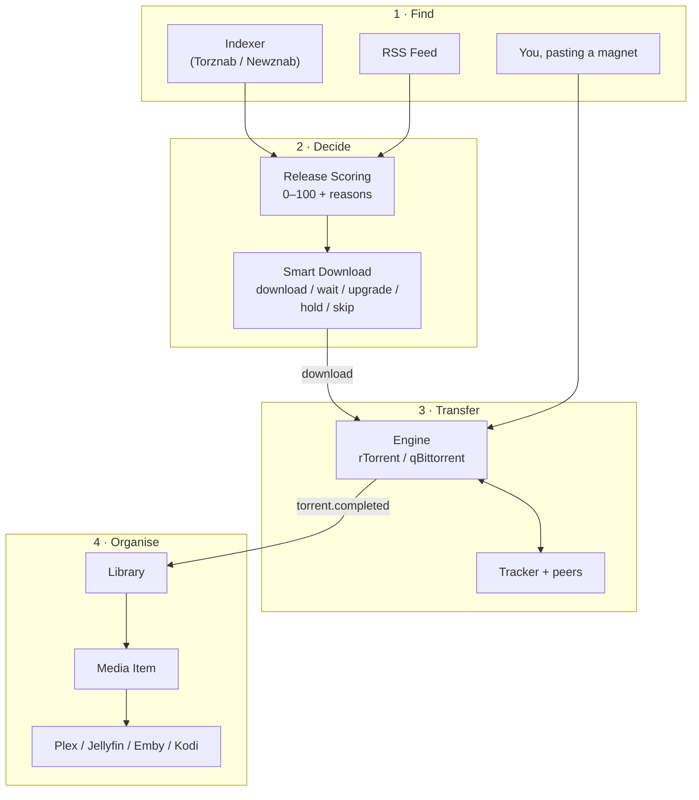
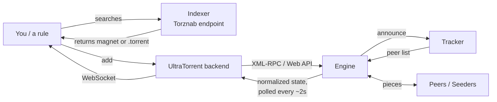
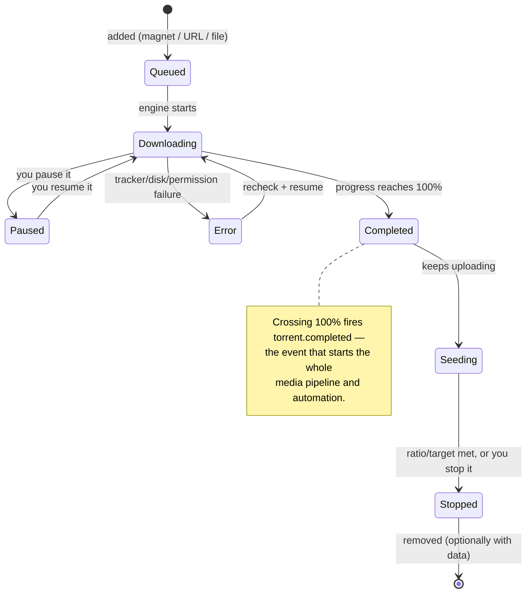
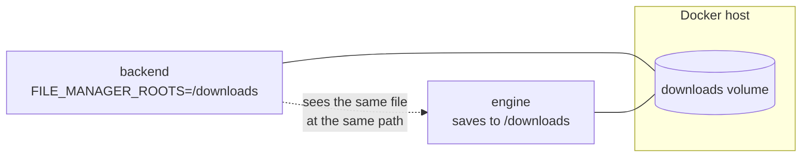
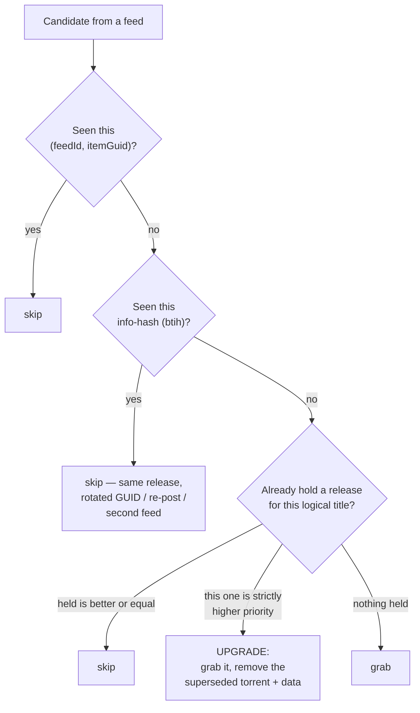
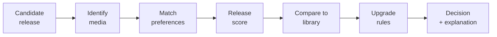
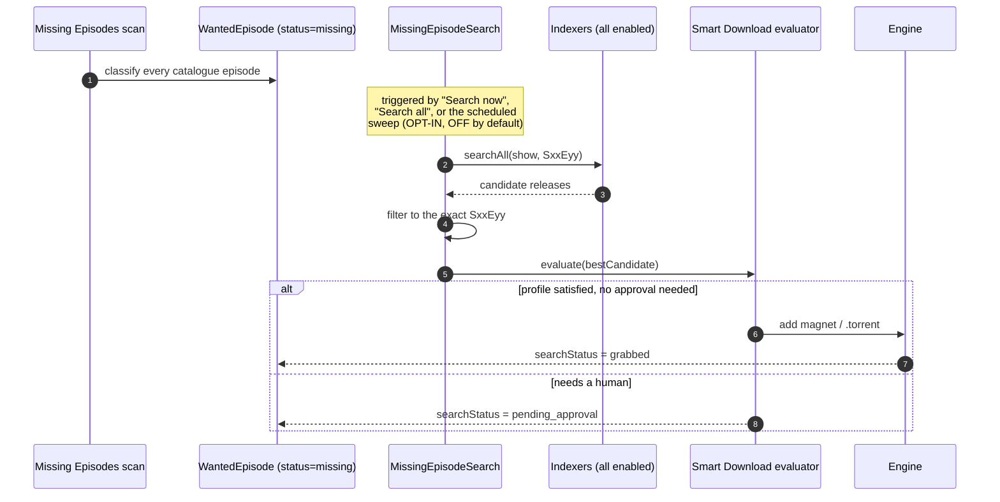
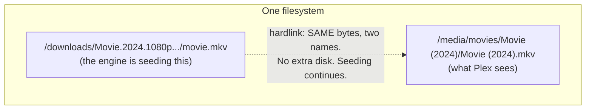
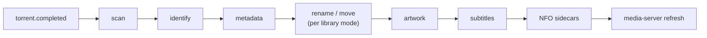

# Core Concepts

Everything in UltraTorrent is built from about a dozen ideas. Learn them once and
the entire product stops being surprising.

## Overview

UltraTorrent separates **four jobs** that ordinary torrent clients smear together:

1. **Finding** a release (indexers, RSS feeds).
2. **Deciding** whether to take it (Release Scoring, Smart Download).
3. **Transferring** it (the engine).
4. **Organising** it afterwards (Media Manager, libraries, rename engine).

Keeping those separate is *why* automation is possible. A rule can decide without
downloading. A library can organise without caring where a file came from. An
engine can be swapped without changing a single rule.



## Purpose

This page is the definitive vocabulary. Every other page assumes it. If a term
elsewhere in the docs is unfamiliar, it is defined here or in the
[Glossary](/help/glossary).

## When to use this page

Read it **once, in order**, before your second download. Come back to it whenever
a rule does something you did not expect — nine times out of ten the surprise is a
concept boundary you had not noticed.

## Prerequisites

None. This page assumes you have never used BitTorrent, Sonarr, Radarr, or a
media server. If you have, skim the headings and stop at anything that sounds
like it means something different here.

---

## The three things people constantly confuse

### Engine vs Indexer vs Tracker

These three are *completely different things*, and mixing them up is the single
most common source of confusion.

| | **Engine** | **Indexer** | **Tracker** |
| --- | --- | --- | --- |
| **What it is** | The BitTorrent client software that actually transfers bytes. | A **searchable catalogue** of torrents. | A server that tells peers about each other for **one specific torrent**. |
| **Who runs it** | You (rTorrent, qBittorrent — bundled or your own). | A site or your own Prowlarr/Jackett. | Whoever published the torrent. |
| **You configure it in** | **Downloads → Engines** (`/engines`) | **Downloads → Indexers** (`/indexers`) | Nowhere — it is baked into the torrent/magnet. |
| **Protocol UltraTorrent speaks to it** | XML-RPC over SCGI (rTorrent) or the Web API (qBittorrent). | Torznab / Newznab over HTTP. | None. **UltraTorrent never talks to trackers.** The engine does. |
| **Without it you can…** | …do nothing. It is mandatory. | …still add torrents by hand. It is optional. | …not download that torrent at all (unless DHT/PEX finds peers). |

:::info The one-sentence version
**The indexer tells you a release exists. The engine downloads it. The tracker
introduces the engine to other peers.**
:::



Notice that the browser **never** talks to the engine. The React SPA talks only to
the UltraTorrent API, which translates to each engine's native protocol and hands
back **normalized**, engine-agnostic data. That is what makes engines swappable.

---

## The torrent, end to end

### Torrent

A **torrent** is one transfer. It is identified by an **info hash** (`btih`) — a
fingerprint of the content. Two magnets from two different sites with the same
info hash are the *same torrent*, and UltraTorrent uses that fact to refuse to
grab the same release twice.

You can add one three ways (**Downloads → Torrents → Add torrent**):

- **Magnet** — a `magnet:?xt=urn:btih:…` link. No file needed.
- **URL** — a link to a `.torrent` file, fetched server-side (through an SSRF guard).
- **File** — a `.torrent` file you upload or drag in.

### Torrent lifecycle



The states you see in the sidebar sub-menu (**Downloading / Seeding / Completed /
Paused / Errors**) are filtered views of the same table, driven by the URL
(`/torrents?state=…`).

### Seeding, ratio and share

When a torrent finishes downloading it does not stop — it starts **seeding**:
uploading the data you now have to other peers.

- **Ratio** = bytes uploaded ÷ bytes downloaded. A ratio of `1.0` means you have
  given back exactly as much as you took.
- Many private trackers **require** a minimum ratio or seed time. Stopping too
  early can get you banned from them.
- `ratio.reached` is an **automation trigger**: "when this torrent hits ratio X,
  stop it / move it / notify me" is a rule you can build in
  **Automation → Automation Rules**.

:::warning Deleting a torrent can delete the file you just organised
This is the single most important reason UltraTorrent defaults to **hardlink**
mode (see [below](#hardlink-vs-copy-vs-symlink-vs-move)). If you *move* a
completed file into a library, the engine can no longer seed it. Hardlinking
lets the same bytes exist in both places, so you can seed **and** have a clean
library.
:::

---

## Paths, and why they must line up

Everything in UltraTorrent that touches disk is confined to **hard roots** —
the comma-separated absolute paths in `FILE_MANAGER_ROOTS` (default `/downloads`).

- The File Manager cannot browse outside them.
- A media library cannot be created outside them.
- The rename engine cannot write outside them.
- Path traversal, absolute-escape, symlink-escape and system directories are all
  rejected after canonicalisation (`realpath`).

**The engine must see the same paths the backend sees.** In the bundled Compose
stack both the backend and the engine mount the same `downloads` volume at
`/downloads`, so a torrent whose save path is `/downloads/tv` is a path the
backend can also read. If you point UltraTorrent at an *external* engine, you must
arrange the same thing yourself — otherwise the engine will report save paths that
UltraTorrent cannot open, and post-download organisation silently does nothing.



---

## Acquisition: how content decides to arrive

### Release

A **release** is one published encoding of a title — `Some.Show.S02E05.1080p.WEB-DL.DDP5.1.H.264-GROUP`.
UltraTorrent parses that name into structured facts: title, year, season, episode,
resolution, source, HDR, audio, codec, group.

The parsed **release identity** is what deduplication works on:
`movie:<title>:<year>` or `ep:<title>:<season>:<episode>`.

### Release Scoring

A core module that turns a parsed release into a **score from 0 to 100** plus an
explicit **accept/reject decision with reasons and warnings**. It is consumed by
RSS and by Smart Download — nothing re-implements quality preferences. You can
inspect and tune it on the **Release Scoring** page (`/release-scoring`).

### RSS feed and RSS rule

An **RSS feed** (`/rss`) is just a URL that is polled on an interval (the
`rss_poll` job runs every 60 seconds and fetches feeds whose interval has
elapsed).

An **RSS rule** lives *under* a feed and describes what to grab from it:

| Field | Meaning |
| --- | --- |
| Name | Yours. |
| Media type | `tv` / `anime` / `movie` / … — this is what activates show-status awareness. |
| Include regex | A candidate must match this. |
| Exclude regex | A candidate must **not** match this. |
| Save path | Where matched grabs are saved. |
| Auto-download | Whether matches are grabbed automatically, or only recorded. |
| Match candidates | An **ordered preference list** built in the Smart Match Builder. |

The **Smart Match Builder** (on the rule detail page, `/rss/rules/:ruleId`) is
where you express *"I want 2160p Dolby Vision, but I'll take 1080p WEB-DL, and I
will never take a CAM"* as a ranked list rather than a regex nightmare.

#### Deduplication happens on three levels

This is worth internalising, because it is why a well-built rule does not flood
you with duplicates:



So a rule with a preference list holds **one release per movie/episode**: the
best available so far, upgraded when something strictly better appears.

#### TV show airing-status awareness

Creating a rule for a show that **ended** or was **canceled** wastes polling
forever. UltraTorrent resolves a show's **airing status** server-side (TMDB →
IMDb dataset → local library, in confidence order) and normalizes it to one of:
`continuing` · `returning` · `planned` · `on_hiatus` · `ended` · `canceled` ·
`unknown` — which becomes a recommendation: **recommended** · **caution** ·
**not recommended** · **unknown**.

Saving a TV rule for an ended/canceled show is **blocked** unless you explicitly
confirm (`allowInactiveShowMonitoring`), and that override is audited. A
background job re-checks cached statuses on a per-status cadence (active 24h,
hiatus 7d, ended/canceled 30d, unknown 3d) and tells you when a show's status
changes — but it **never disables your rule** for you.

### Indexer

A **Torznab** or **Newznab** search endpoint. Configured in **Downloads →
Indexers**. Key fields: base URL, an API key (AES-256-GCM encrypted at rest,
redacted as `••••••••` on every read), enabled, priority (lower is tried first),
categories, and an optional minimum-seeders floor.

`searchAll` fans out across every enabled indexer in priority order, isolates
per-indexer failures, filters by min-seeders, and **deduplicates candidates
across indexers by info-hash**.

:::info RSS feeds are not indexers
They are different subsystems. RSS *pushes* new items at you on a poll; an indexer
is *searched* on demand. Only Torznab/Newznab endpoints are searchable.
:::

---

## Wanting things you do not have yet

### Watchlist and monitored content

The **watchlist** (**RSS &amp; Acquisition → Acquisition Intelligence →
Watchlist**, at `/media-acquisition`) is the list of things you *want*. An item
can be a `movie`, a `series`, a `season`, or an `episode`.

A series is **monitored** once it is on the watchlist **with an IMDb ID** (e.g.
`tt0903747`). Without an IMDb ID it shows as *not monitorable* — there is nothing
to diff against.

:::tip Do not hand-type IMDb IDs
The **Missing Episodes** page has an **Add from library** picker: a searchable
multi-select of the TV series already in your libraries, with their IMDb IDs
resolved for you. Select the shows and add them all at once.
:::

### Wanted episode / wanted movie

A **wanted episode** is a computed row — not something you create. UltraTorrent
enumerates every episode a series *should* have (from the local IMDb episode
catalogue) and diffs it against your library, classifying each one:

| Status | Meaning |
| --- | --- |
| `owned` | Your library has this season/episode. |
| `missing` | It aired, and you do not have it. **This is the acquirable gap.** |
| `unaired` | Its air year is in the future or unknown — it cannot be acquired yet. |
| `ignored` | You opted it out. Survives rescans. |

Season 0 (specials) is excluded from the missing maths. Rescans are idempotent:
they rebuild everything **except** your `ignored` overrides.

:::warning "Missing" is only as good as your identification
Ownership is decided from `MediaItem.season` / `episode`, which come from
**filename identification**, not from a raw scan. A library full of badly named or
unidentified files will over-report *missing*. Re-identify the library for
accurate results.
:::

**Wanted movies** work the same way for monitored `movie` watchlist items with an
IMDb ID, classified `owned` / `missing` / `unaired` / `ignored`.

### Smart Download

**Smart Download** is the acquisition **decision engine**. Instead of grabbing the
first thing that matches, it evaluates every candidate and picks the best
*acceptable* one — deciding **what** to acquire, **when**, **which release**, and
**whether to upgrade something you already have**.

Every candidate runs one explainable pipeline:



Every stage is recorded as a trace step. The **Decision Simulator**
(`/media-acquisition/simulator`) replays the whole pipeline for any release name
**with no side effects** — nothing persisted, nothing downloaded — and renders it
as a clickable pipeline so you can see exactly *why* a release would be chosen or
rejected.

The pipeline always ends in exactly one decision:

| Decision | Meaning |
| --- | --- |
| `download` | Wanted, missing, above thresholds → acquire. |
| `upgrade_existing` | Owned, but this release is meaningfully better → acquire it **and remove the old one**. |
| `wait` | Acceptable, but below the profile's wait cutoff → deliberately hold out for something better. |
| `hold_for_approval` | Would download, but a trigger (low score, duplicate risk, huge file, forced approval) needs a human. |
| `manual_review` | Ambiguous match across library and watchlist. |
| `skip` | Excluded term, rejected by scoring, already owned in equal-or-better quality, below minimum, or simply not wanted. |
| `replace_existing` | Reserved. The decision type exists but is not emitted yet. |

Each decision carries a **reason**, a **confidence (0–100)**, `requiresApproval`,
and the full trace.

### Acquisition profile

A profile bundles the policy Smart Download applies:

- `minimumScore` — below this → `skip`.
- `approvalScore` — below this → `hold_for_approval`.
- `duplicateRules.allowUpgrades` — are upgrades permitted at all?
- `automationRules.approvalRequired` — force approval for **everything**.
- `qualityRules.waitForBetter` + `waitUntilScore` — the **wait policy**.

### What counts as an upgrade

Upgrades are **multi-dimensional**, not resolution-only:

| Dimension | Best → worst |
| --- | --- |
| Resolution | 2160p → 1080p → 720p → 480p |
| Source | Remux → BluRay → WEB-DL → WEBRip → HDTV |
| HDR | Dolby Vision → HDR10+ → HDR10 → HLG → SDR |
| Audio | Atmos / DTS:X → TrueHD / DTS-HD → DD+ → DTS/DD → AAC |
| Channels | 7.1 → 5.1 → 2.0 |

Codec (HEVC/AV1 vs AVC) is a **scoring tiebreak only** — it never triggers an
upgrade on its own, because an x264→x265 re-encode at the same quality is not
worth re-downloading.

### Missing-episode auto-acquire

Detection (*this episode is missing*) and downloading (*score it, grab it*) are
bridged by indexer search:



`searchStatus` walks `idle → searching → grabbed | pending_approval | no_results | failed`,
and it is **preserved across rescans** so a grabbed episode is never re-searched.
It clears automatically once the episode is owned.

:::caution Auto-search is off by default, and episode-only
The scheduled sweep (`autoSearchMissing`) is **opt-in and disabled by default**.
Manual **Search now** / **Search all** work whenever the module is enabled.
Movies carry the same grab-state columns, but automatic search is **episode-only**
for now.
:::

---

## Organising: what happens after the download

### Library

A **library** (**Media Management → Libraries**, `/media/libraries`) points the
Media Manager at a folder inside the hard roots and declares:

| Setting | Values |
| --- | --- |
| **Kind** | `tv` · `anime` · `movie` · `music` · `audiobook` · `general` |
| **Preset** | `plex` · `jellyfin` · `emby` · `kodi` · `custom` |
| **Template** | The token-based naming template (the preset fills this in). |
| **Mode** | `preview` · `rename_in_place` · `rename_move` · `copy` · `hardlink` (default) · `symlink` |
| **Scan interval** | Minutes between automatic scans. **Blank or zero = manual scans only.** |

:::info The library's `kind` wins over the filename
A show whose folder carries a year but no episode marker — `9-1-1 (2018)` — is
**not** mis-detected as a movie, because the library's declared `kind` is
authoritative for the movie/tv/anime axis. Only `general` (mixed) libraries fall
back to guessing from the filename.
:::

### Media item

A **media item** is one title in a library — a movie, or a whole series. Scanning
discovers files; **identification** parses the release name into
type/title/year/season/episode with a **confidence score** and a `matchStatus`:

- `unmatched` — could not be identified. Review these on **Media Management →
  Unmatched Media** (`/media/unmatched`).
- `matched` — identified automatically.
- `manual` — you corrected it by hand.

For an episodic file laid out as `Show/Season NN/episode`, the **series title is
taken from the show folder**, not the filename (which often carries only the
episode title). That is what stops a series fragmenting into one "show" per
episode.

### Hardlink vs copy vs symlink vs move

This is the decision people get wrong, so here it is plainly.



| Mode | Extra disk used | Seeding survives | Notes |
| --- | --- | --- | --- |
| `hardlink` **(default)** | **None** — one copy of the bytes, two directory entries. | ✅ Yes | The right answer almost always. Requires **the same filesystem** for both paths. |
| `copy` | **2×** the file size. | ✅ Yes | Use when source and destination are on different filesystems. |
| `symlink` | None. | ✅ Yes | A pointer, not a second name. Some media servers and some containers do not follow symlinks across mounts. |
| `rename_move` | None. | ❌ **No** — the engine loses the file. | Use only when you do not care about seeding. |
| `rename_in_place` | None. | ⚠️ Depends | Renames where the file already is. |
| `preview` | None. | n/a | Dry-run only. Builds the plan, touches nothing. **Start here.** |

:::danger Hardlinks cannot cross filesystems
A hardlink is two names for the same inode, so both paths must be on the **same**
filesystem/volume. If `/downloads` and `/media` are separate Docker volumes or
separate mounts, hardlinking fails and you must use `copy`. Plan your mounts
accordingly: one big share with `downloads/` and `media/` subfolders is the
easiest layout that works.
:::

### The post-download pipeline

When a torrent crosses 100%, the engine sync loop emits `torrent.completed`. That
event starts an **opt-in, best-effort** pipeline — it fires **only** for enabled
libraries whose root path *contains* the torrent's save path, so arbitrary
downloads are never auto-organised:



Each stage is isolated: a failure in one never aborts the rest, and the handler
never throws (which protects the sync loop). Each stage also fires a `media.*`
event you can hang your own automation off.

### Media server

Plex, Jellyfin, Emby and Kodi are supported behind one `MediaServerProvider`
abstraction. UltraTorrent **pushes a library refresh** to them after organising,
so new media shows up without you clicking anything. Credentials are AES-GCM
encrypted at rest and redacted in API responses.

The **Media Server Analytics** module goes further, turning connected servers into
live activity, watch history, recently-added, reports and newsletters.

---

## Cross-cutting concepts

### Module

Every capability is a **module** with a manifest (id, tier, dependencies,
permissions, routes, menu, scheduler jobs). Tiers:

- `core` — always available, **cannot be disabled** (auth, RBAC, engine, torrents,
  RSS, files, settings, audit, notification center, media server analytics…).
- `community` — bundled, on by default, **toggleable** by an admin (Media Manager,
  Release Scoring, Media Acquisition Intelligence…).

There is **no licensing, no edition, and no paywall**. Every module ships in the
one open-source repository. Manage them on **Administration → Modules**
(`/modules`).

### Permission (RBAC)

Access is decided **only** by role-based access control. Permissions are
dot-namespaced (`torrents.add`, `rss.manage`, `media_manager.rename`,
`media_acquisition.evaluate`, `indexers.test`…). The UI hides what you cannot use;
the **server always enforces**. Disabling a module is a UI convenience — it is
*never* an authorization decision.

### Automation rule

A condition/action rule triggered by an event. Torrent triggers
(`torrent.completed`, `ratio.reached`), media triggers (`media.matched`,
`media.missing_subtitles`, `media.rename_completed`…) and RSS show-status triggers
(`rss.show.ended`, `rss.show_status.changed`…) drive actions like stop, delete,
move, notify, webhook, `rename_for_media`, `media_server_refresh`, or
`disable_rss_rule`.

### Notification

The **Notification Center** is rule-driven end to end: modules publish events, and
*your* rules decide **if**, **when**, **how** and **to whom** a message is
delivered. Nothing is hardcoded. Channels ship for **Email (SMTP)**, **Telegram**,
**SMS (Twilio)** and **WhatsApp (Twilio)**.

---

## Examples

### Reading a release name the way UltraTorrent does

```text
The.Expanse.S04E03.2160p.AMZN.WEB-DL.DDP5.1.HDR.HEVC-GROUP
│           │      │     │    │      │       │    │
│           │      │     │    │      │       │    └─ codec       → tiebreak only
│           │      │     │    │      │       └────── HDR         → upgrade dimension
│           │      │     │    │      └────────────── audio       → upgrade dimension
│           │      │     │    └───────────────────── source      → upgrade dimension
│           │      │     └────────────────────────── (indexer)
│           │      └──────────────────────────────── resolution  → upgrade dimension
│           └─────────────────────────────────────── season/episode
└─────────────────────────────────────────────────── title

release identity → ep:the expanse:4:3
```

### The same title, three ways it can arrive

| Path | Trigger | Decides via |
| --- | --- | --- |
| You paste a magnet | Manual | Nothing — it just downloads. |
| An RSS rule matches it | `rss_poll`, every 60s | Match preferences + Release Scoring + 3-level dedup. |
| Smart Download fills a gap | Missing-episode scan + indexer search | The full decision pipeline + your acquisition profile. |

---

## Troubleshooting the concepts

| "I expected…" | "…but actually" |
| --- | --- |
| "The Search box will search indexers." | **Search** and Ctrl+K search the *application's navigation*. Indexer search is consumed by the acquisition pipeline and the API, not exposed as a browse-and-click page. Use Prowlarr's UI to browse by hand. |
| "My rule grabbed the same episode twice." | It almost certainly did not — check the info-hash. Two *different* releases of the same episode are deduped by **release identity**, but only when the title parses. Unparseable titles fall back to per-release behavior. |
| "Missing Episodes says I'm missing everything." | Your library items are unidentified, so ownership cannot be proven. Re-identify the library. |
| "Nothing got renamed after my download finished." | The library's root path must **contain** the torrent's save path, and the library must be **enabled**. Arbitrary downloads are never auto-organised. |
| "Hardlink failed." | `/downloads` and your library are on different filesystems. Use `copy`, or restructure your mounts. |
| "My RSS rule for an ended show wouldn't save." | That is deliberate. Confirm the override (it is audited), or build a backfill rule with auto-download off instead. |

---

## Tips

:::tip Start every library in `preview` mode
Build the rename plan, look at it, *then* switch to `hardlink`. `preview` touches
nothing, so it costs you nothing to check.
:::

:::tip Use the Decision Simulator as a teaching tool
Paste any release name into `/media-acquisition/simulator` and read the trace.
It is the fastest way to understand what your profile actually does — and it has
zero side effects.
:::

:::info Everything mutating is audited
Destructive and security-relevant actions record the actor, IP, user agent and
result. See **Administration → Audit Log** (`/audit`).
:::

:::tip Watch this tutorial
_Video coming soon._
:::

---

## FAQ

**Is an RSS feed an indexer?**
No. Different subsystem, different protocol, different trigger. RSS is polled and
pushes items at your rules; an indexer is searched on demand over Torznab/Newznab.

**Do I need a tracker account?**
Not for public torrents. Private trackers require you to be a member, and usually
enforce a minimum ratio or seed time — which is exactly why `ratio.reached`
automation exists.

**What is an info hash for, practically?**
It is the identity of a torrent. UltraTorrent parses it out of a magnet
(`btih`) and uses it to guarantee the same release is never grabbed twice, even
under a rotated GUID, a re-post, or a second feed.

**If Smart Download says `wait`, is something broken?**
No — that is it working. The release was acceptable but below your profile's
`waitUntilScore`, so the engine is deliberately holding out for something better.
See it on the Waiting queue.

**Can I mix engines?**
Yes. Register several; one is the default. The API and UI always return
normalized, engine-agnostic data.

**What is the difference between Media Manager and Smart Download?**
Smart Download decides **what to acquire**. Media Manager decides **what to do
with it once it lands**. They meet at the `torrent.completed` event.

---

## Checklist

You have the mental model when you can answer these **without scrolling up**:

- [ ] Which of engine / indexer / tracker does UltraTorrent actually speak to directly?
- [ ] What fires when a torrent crosses 100%, and what does that event start?
- [ ] Name the three levels of RSS deduplication.
- [ ] What makes a series "monitored"?
- [ ] What are the six Smart Download decisions, and which one is *reserved*?
- [ ] Why is `hardlink` the default library mode, and when can it not be used?
- [ ] What does `unaired` mean, and why can't it be acquired?
- [ ] Why does a library's `kind` beat the filename?

### Expected results

If you can answer all eight, the rest of the documentation will read as
*configuration*, not as *new ideas*.

### Next steps

1. [Architecture Overview](/learn/architecture-overview) — where each of these concepts physically runs.
2. [My First Download](/learn/first-download) — the concepts, exercised end to end.
3. [Workflows](/learn/workflows) — the seven canonical flows, as diagrams.

---

## See also

- [Glossary](/help/glossary) — one-line definitions of every term on this page.
- [Torrents](/modules/torrents) · [Engines](/modules/engines) · [Indexers](/modules/indexers)
- [RSS](/modules/rss) · [Smart Download](/modules/smart-download) · [Missing Episodes](/modules/missing-episodes)
- [Media Manager](/modules/media-manager) · [Media Server Analytics](/modules/media-server-analytics)
- [Automation](/modules/automation) · [Notification Center](/modules/notification-center)
- [Permissions](/reference/permissions) — the full RBAC catalogue.
- [Modules](/reference/modules) — every module manifest.
