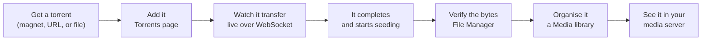
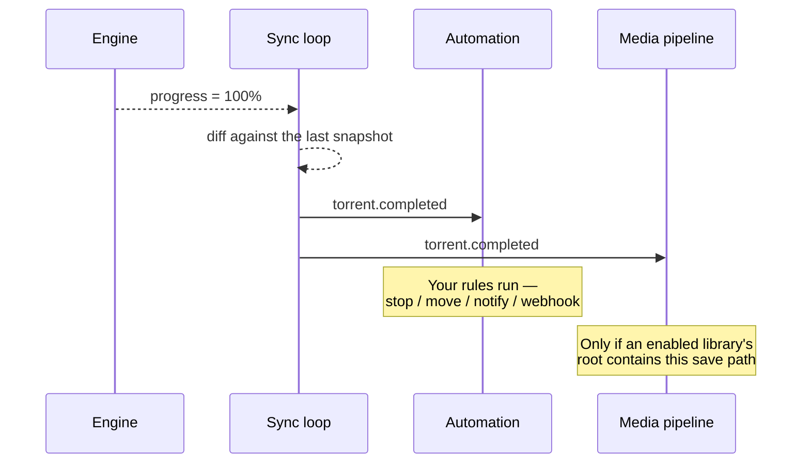

# My First Download

[Quick Start](/learn/quick-start) got a torrent to 100%. This page does the same
thing **slowly**, explaining every field, every screen, and every thing that can
go wrong — and then keeps going, all the way to a renamed file sitting in a
library that Plex can see.

If you already have a working stack, this is the page to actually *learn* on.

## Overview



## Purpose

By the end you will have done, deliberately and with understanding, every step of
the acquisition loop **once by hand**. Everything automated later in the docs is
just this loop with the manual steps removed.

## When to use this page

| Use this page when… | Use another when… |
| --- | --- |
| It is your first ever download. | You want the 15-minute version → [Quick Start](/learn/quick-start). |
| A download is failing and you want to isolate which step. | You want the automated version → [Automating TV shows](/learn/tutorials/automating-tv-shows). |
| You want to understand each field in the Add dialog. | You want the whole-system picture → [Architecture Overview](/learn/architecture-overview). |

## Prerequisites

You must already have:

- [ ] A running stack — [Quick Start Steps 1–4](/learn/quick-start).
- [ ] An engine registered and marked **Default** on **Downloads → Engines** — [Quick Start Step 5](/learn/quick-start#step-5--register-your-torrent-engine).
- [ ] Permission to add torrents (`torrents.add`). The bootstrap admin has it.
- [ ] Something legal to download.

:::danger Pick something you are allowed to download
Official Linux distribution ISOs (Ubuntu, Debian, Fedora, Arch) publish torrents
on their download pages. They are fast, well-seeded, and unambiguously legal.
Learn on those. What you point UltraTorrent at afterwards is entirely on you.
:::

## Concepts you will use

Four, all defined in [Core Concepts](/learn/concepts):

- **Engine** — the thing that actually downloads. You registered one already.
- **Save path** — where on disk the engine writes. Must be inside the hard roots.
- **Info hash** — the torrent's identity. UltraTorrent uses it to refuse duplicates.
- **Seeding** — what a torrent does after it finishes: uploading to other peers.

---

## Step-by-step

### Step 1 — Get a torrent

You need one of three things:

| You have | Which tab you will use |
| --- | --- |
| A `magnet:?xt=urn:btih:…` link | **Magnet** |
| A link to a `.torrent` file (`https://…/x.torrent`) | **URL** |
| A `.torrent` file already downloaded to your computer | **File** |

For a first run, copy a magnet link from an official Linux distribution's
download page.

**Expected result:** a magnet link on your clipboard, starting with `magnet:?`.

:::info How to tell a magnet from a torrent URL
A **magnet** starts with `magnet:?xt=urn:btih:` and contains the info hash
directly — there is no file to fetch. A **torrent URL** is an ordinary `https://`
link that returns a small binary `.torrent` file. UltraTorrent fetches that
server-side (never from your browser), through an SSRF guard.
:::

---

### Step 2 — Open the Torrents page

In the sidebar: **Downloads → Torrents**. The URL is `/torrents`.

Take a moment to read this screen, because you will live here:

| Thing on screen | What it means |
| --- | --- |
| The table | One row per torrent, live-updated over WebSocket. |
| The sidebar sub-menu | **Downloading · Seeding · Completed · Paused · Errors** — filtered views of the same table, driven by `?state=…` in the URL, so they are bookmarkable. |
| The top bar rates | Live aggregate up/down across all engines. If these are moving, your sync loop is healthy. |
| The **Add torrent** button | Only visible if you hold `torrents.add`. |

**Expected result:** the Torrents page renders. If you have never downloaded
anything it shows an empty state with an **Add torrent** call-to-action.

:::note Screenshot needed
The **Torrents** page (`/torrents`) in its **empty state**, with the sidebar
expanded to show the Downloading / Seeding / Completed / Paused / Errors
sub-menu, and the Add torrent button visible.
:::


---

### Step 3 — Open the Add torrent dialog

Click **Add torrent**.

The dialog has three tabs across the top — **Magnet**, **URL**, **File** — and a
shared set of options below them.

:::note Screenshot needed
The **Add torrent** dialog on `/torrents`, with the **Magnet** tab selected,
showing the magnet input and the Save path / Category / Tags fields beneath it.
:::


**Expected result:** the dialog is open on the **Magnet** tab.

---

### Step 4 — Fill in the source

Pick the tab that matches what you have.

#### Magnet tab

Paste the magnet link. It must start with `magnet:?xt=urn:btih:`.

#### URL tab

Paste the `https://…/something.torrent` link. The **backend** fetches this, not
your browser.

:::danger URLs that resolve to private addresses are blocked
The backend refuses to fetch a torrent URL that resolves to a private or internal
IP — that is an SSRF guard, and it is protecting you. If your indexer is
self-hosted on a private IP, you must allow it explicitly:

```ini title=".env"
SSRF_ALLOW_HOSTS=prowlarr,indexer.lan,10.0.0.0/24
```

Keep `prowlarr` in the list if you use the bundled Prowlarr. Without this, grabs
fail with *"Torrent URL resolves to a blocked internal address."*
:::

#### File tab

Click the drop zone to open a file picker, or **drag a `.torrent` file onto it**.

**Expected result:** the selected tab shows your magnet / URL / filename, and the
**Add** button becomes enabled. (It stays disabled while the active tab is empty —
that is intentional.)

---

### Step 5 — Understand the options before you set them

Below the tabs are four options. All are optional. All are worth understanding.

| Option | What it does | What happens if you leave it blank |
| --- | --- | --- |
| **Save path** | The directory the engine writes into. Must be inside the hard roots (`FILE_MANAGER_ROOTS`, default `/downloads`). | The engine's own default is used — `/downloads` in the bundled stack. |
| **Category** | A label used for filtering and for automation conditions. | No category. |
| **Tags** | Comma-separated free-form labels. | No tags. |
| **Start paused** | Add the torrent but do not begin transferring. | It starts immediately. |

:::tip Set the save path deliberately, from the very first download
Save paths are what connect a download to a **library**. The media pipeline only
organises a completed torrent when an **enabled library's root path contains the
torrent's save path**. If you dump everything in `/downloads` and later create a
library at `/downloads/movies`, none of your existing downloads will be picked up.

A layout that works from day one:

```text
/downloads
├── movies/     ← a Movies library points here
├── tv/         ← a TV library points here
└── other/      ← everything you do not want organised
```
:::

If you type a save path that does not exist, UltraTorrent validates it against the
hard roots and **offers to create it** for you. Accept.

**Expected result:** your options are set, and the **Add** button is enabled.

---

### Step 6 — Add it

Click **Add**.

**Expected result — three things, in this order, within a couple of seconds:**

1. A success toast appears.
2. The dialog closes.
3. **A new row appears in the table without you refreshing anything.**

That third one matters. It means the backend accepted the torrent, handed it to
the engine, the sync loop saw it on its next ~2-second poll, and pushed it to your
browser over WebSocket. If the row appears, your entire pipeline is working.

:::warning If you get "already exists"
You are trying to add a torrent whose **info hash** is already known. That is
deduplication doing its job — the same release under a different magnet, a
re-post, or a second feed is still the same torrent. Look for it in the existing
list.
:::

---

### Step 7 — Watch it transfer

Stay on the Torrents page. In the first few seconds you should see, in order:

| Column | What to expect | If it does not happen |
| --- | --- | --- |
| **State** | `Queued` → `Downloading` | Engine unreachable, or Start paused was on. |
| **Peers / Seeds** | Climbs above 0 | Dead torrent, tracker down, or no peers. |
| **Down rate** | A non-zero number | No peers yet — give it 30 seconds. |
| **Progress** | Climbs from 0% | See above. |
| **ETA** | Appears once a rate is established | — |

The top bar's aggregate rate should move at the same time.

:::note Screenshot needed
The **Torrents** page (`/torrents`) with one torrent actively **Downloading** —
progress bar mid-way, non-zero down rate, peer/seed counts, and ETA — plus the
live rates in the top bar.
:::


:::tip Nothing is happening. Is it broken?
Probably not — most likely there are no peers yet. Before you debug anything:
- Wait a full 60 seconds.
- Confirm the torrent is not **Paused**.
- Try a *different*, well-known torrent (a current Ubuntu ISO). If that one moves,
  the first torrent was simply dead.
- On the **bundled rTorrent**, DHT is **off by default** (`RT_DHT=off`) because
  that build can crash on a DHT `internal_error`. Trackers and PEX still find
  peers, but a magnet with no working tracker and no PEX peers will sit at 0%
  forever. Set `RT_DHT=on` to enable it, or use the qBittorrent profile.
:::

---

### Step 8 — Inspect the torrent while it runs

Click the torrent row. A **drawer** slides in with four tabs:

| Tab | What it gives you |
| --- | --- |
| **Overview** | Size, progress, rates, ratio, save path, category, tags. |
| **Files** | Every file, with individual **priorities**. Set a file to *skip* and the engine will not download it — useful for a season pack when you only want two episodes. |
| **Peers** | Who you are connected to. Zero peers explains a stuck torrent instantly. |
| **Trackers** | The announce URLs and their last response. A tracker error here explains the other kind of stuck torrent. |

The actions bar gives you **resume**, **pause**, **stop** and **recheck**.

:::info What "recheck" actually does
It re-hashes the data on disk and compares it to the torrent's piece hashes. Use it
when a torrent errored, when you moved files under it, or when progress looks
impossible. It is safe — it never deletes anything.
:::

:::note Screenshot needed
The torrent **drawer** on `/torrents` (opened by clicking a torrent row), showing
the Overview / Files / Peers / Trackers tabs, with the **Files** tab open and
per-file priorities visible.
:::


---

### Step 9 — It completes

At 100% the torrent moves to **Seeding**.

Under the hood, three things happen the moment progress crosses 100%:



**Expected result:** state = **Seeding**, progress = 100%, and the **ratio** starts
climbing as you upload to other peers.

:::note Screenshot needed
The **Torrents** page (`/torrents`) filtered to **Seeding** (`?state=seeding`),
showing the completed torrent at 100% with a climbing ratio and a non-zero up rate.
:::


:::warning Do not immediately delete the torrent
Two reasons:
1. **Seeding is how BitTorrent works.** Many private trackers require a minimum
   ratio or seed time, and stopping instantly can get you banned.
2. **Deleting a torrent can offer to delete its data** — including the file you are
   about to organise. If you use `rename_move` mode, the file is gone from the
   engine anyway; if you use `hardlink` (the default), the bytes survive in both
   places and you can seed forever.
:::

---

### Step 10 — Verify the bytes actually exist

Do not trust the progress bar. Go and look.

**Files → File Manager** (`/files`).

Navigate to your save path (`/downloads`, or the subfolder you chose). You should
see the downloaded folder and its files, with real sizes.

The File Manager is confined to the hard roots (`FILE_MANAGER_ROOTS`). It can
browse, preview, download, rename, move, copy, make directories, and delete to a
**trash** — and it is physically incapable of escaping those roots. Traversal,
symlink-escape and absolute-escape are all rejected.

**Expected result:** your file, at its full size, at the path you expect.

:::note Screenshot needed
The **File Manager** page (`/files`) browsing `/downloads`, showing the completed
download's folder and file sizes.
:::


---

### Step 11 — Organise it into a library

Right now you have a file with an ugly scene name. Let us make it a library entry.

1. Go to **Media Management → Libraries** (`/media/libraries`).
2. Click **Add library**.
3. Fill it in:

   | Field | For this walkthrough | Notes |
   | --- | --- | --- |
   | **Name** | `Movies` | Yours. |
   | **Path** | `/downloads/movies` | Must be inside the hard roots. The path picker will offer to create it. |
   | **Kind** | `movie` | **Authoritative** over filename guessing. |
   | **Preset** | `plex` | Fills the naming template for you. |
   | **Mode** | `preview` | **Start here.** Dry-run only — it touches nothing. |
   | **Template** | *(leave blank)* | The preset supplies it. |
   | **Scan interval** | *(leave blank)* | Blank = manual scans only. Set it later. |

4. Save, then click **Scan**.

**Expected result:** the scan discovers your file, creates a **media item**, and
identifies it — parsing the release name into type/title/year with a confidence
score. Look at **Media Management → Media Items** (`/media/items`).

:::note Screenshot needed
The **Libraries** page (`/media/libraries`) with the Add/Edit library dialog open,
showing the Name / Path / Kind / Preset / Mode / Template / Scan interval fields.
:::


---

### Step 12 — Preview the rename, *then* commit

Go to **Media Management → Rename Engine** (`/media/rename-preview`).

This builds the full rename plan — every source path, every destination path —
and **changes nothing**. Read it. Every path segment is sanitized.

If it looks right:

1. Go back to **Media Management → Libraries**.
2. Edit the library and change **Mode** from `preview` to **`hardlink`**.
3. Re-run the operation.

:::danger Choose your mode with your eyes open

| Mode | Disk cost | Can you still seed? |
| --- | --- | --- |
| `hardlink` **(default)** | **None** | ✅ Yes — same bytes, two names |
| `copy` | 2× the file | ✅ Yes |
| `symlink` | None | ✅ Yes, but some servers do not follow symlinks |
| `rename_move` | None | ❌ **No — the engine loses the file** |

`hardlink` requires the download path and the library path to be on **the same
filesystem**. In the bundled stack they are (one `downloads` volume). If you
mounted `/media` from a *different* volume, hardlinking will fail and you must use
`copy`.
:::

**Expected result:** the file now exists at a clean library path
(`/downloads/movies/Some Movie (2024)/Some Movie (2024).mkv`) **and** the engine
is still seeding the original — because a hardlink is two names for the same bytes.

:::note Screenshot needed
The **Rename Engine** page (`/media/rename-preview`) showing the dry-run plan with
source → destination paths, before applying.
:::


---

### Step 13 — Let your media server see it

If you have Plex, Jellyfin, Emby or Kodi:

1. Go to **Media Management → Media Settings** (`/media/settings`), which hosts
   Metadata Providers, Artwork, Subtitles, NFO tooling and **Media Server
   Integrations**.
2. Add your server: kind, base URL, and token. The secret is **AES-GCM encrypted at
   rest** and redacted in every API response.
3. Test the connection.

From now on, the post-download pipeline pushes a **library refresh** to that server
automatically, so new media appears without you touching it.

**Expected result:** your first download appears in Plex/Jellyfin/Emby, correctly
named, with a poster.

:::note Screenshot needed
The **Media Settings** page (`/media/settings`) with the Media Server Integrations
section, showing a configured Plex/Jellyfin connection and its Test result.
:::


:::tip Watch this tutorial
_Video coming soon._
:::

---

## Examples

### The same download, entirely from the API

Everything above is REST. Get a token, then:

```bash
# 1. Add by magnet
curl -X POST http://localhost:8080/api/torrents \
  -H "Authorization: Bearer $TOKEN" \
  -H 'Content-Type: application/json' \
  -d '{
        "magnet": "magnet:?xt=urn:btih:...",
        "savePath": "/downloads/movies",
        "category": "movies",
        "tags": ["first-download"]
      }'

# 2. Watch it
curl -s http://localhost:8080/api/torrents \
  -H "Authorization: Bearer $TOKEN"
```

See the [API reference](/reference/api) for the full surface.

### A folder layout that will not fight you later

```text
/downloads
├── movies/           ← Movies library (kind: movie, preset: plex, mode: hardlink)
├── tv/               ← TV library     (kind: tv,    preset: plex, mode: hardlink)
├── anime/            ← Anime library  (kind: anime)
└── unsorted/         ← no library — nothing here is ever auto-organised
```

Set the torrent's **save path** to the right subfolder *when you add it*, and the
post-download pipeline picks it up automatically.

---

## Troubleshooting

| Symptom | Cause | Fix |
| --- | --- | --- |
| **Add** button stays disabled | The active tab is empty. | Fill the tab you are actually on — the dialog validates per-tab. |
| "Torrent already exists" | Same info hash already added. | It is already in your list. This is deduplication working. |
| Row never appears after adding | The engine rejected it, or the WebSocket is down. | Check the connection indicator in the top bar; check `docker compose logs backend`. |
| Stuck at 0%, 0 peers | Dead torrent / dead tracker / no DHT. | Try a known-good Linux ISO. On bundled rTorrent, DHT is off by default — set `RT_DHT=on` or switch to qBittorrent. |
| "Torrent URL resolves to a blocked internal address" | SSRF guard blocked a private-IP indexer. | Add the host to `SSRF_ALLOW_HOSTS` (keep `prowlarr`). |
| Save path rejected | Outside `FILE_MANAGER_ROOTS`. | Use a path inside `/downloads` (or whatever your roots are). |
| Downloaded, but nothing was organised | No **enabled** library whose root **contains** the save path. | Create the library, or move the download, then rescan. |
| Media item shows as **unmatched** | The release name did not parse confidently. | Fix it on **Unmatched Media** (`/media/unmatched`) — or rename the source file more conventionally. |
| A TV show fragmented into one item per episode | Files not laid out as `Show/Season NN/episode`. | The series title is taken from the **show folder** for episodic layouts. Restructure, then rescan. |
| Hardlink failed | Download and library are on different filesystems. | Use `copy`, or put both on one volume. |
| Files owned by `root` | The engine ran as root. | Set `PUID`/`PGID` in `.env` to the owning user (`id someuser`), recreate the engine container. |
| Plex does not show it | Wrong base URL/token, or Plex cannot see that path. | Re-test the integration; confirm Plex's own library path points at the same directory. |

---

## Tips

:::tip Use categories from the start
A category is free to set and becomes an automation condition later —
*"when a torrent in category `movies` completes, notify me"*. Retrofitting them is
tedious.
:::

:::tip Per-file priorities save a lot of disk
Adding a season pack for two episodes? Open the torrent, go to **Files**, and set
everything else to *skip*. The engine will not download what you skipped.
:::

:::info Nothing here blocks the API
Scanning, identifying, renaming, artwork and the media-server refresh all run as
**background jobs** with live progress over WebSocket. If a screen looks like it is
doing nothing, look for the job — it is probably running.
:::

:::warning Your first destructive action should be a preview
`preview` mode exists precisely so your first rename cannot hurt you. Use it.
:::

---

## FAQ

**Where did my file actually go?**
Whatever **Save path** you set — or the engine's default (`/downloads`) if you left
it blank. Confirm in the **File Manager** (`/files`).

**Can I move a torrent after it started?**
Yes, but not from the torrent drawer today — there is a `POST /api/torrents/:hash/move`
endpoint (see the [API reference](/reference/api)), and `move` is also available as an
**automation action**. Either way, relocate the data *through UltraTorrent* so the
engine is told about it. Never move files behind the engine's back — it will error
and you will have to recheck.

**Should I stop seeding once it is done?**
That is your call and your tracker's rules. Build a rule in **Automation** on the
`ratio.reached` trigger to stop or remove it automatically once you have given
back enough.

**Why did nothing get renamed?**
The post-download pipeline is **opt-in by path**: it fires only for **enabled**
libraries whose root **contains** the torrent's save path. Arbitrary downloads are
deliberately never touched.

**What is an NFO file and do I want one?**
A Kodi-style XML sidecar describing the media. Media servers read them. UltraTorrent
generates them (movie/tvshow/season/episode) as the last enrichment stage, inside the
hard roots only. Harmless if your server ignores them.

**Do I have to do all this by hand every time?**
No — that is the entire point of the rest of the docs. See
[Workflows](/learn/workflows) and the [Tutorials](/learn/tutorials/).

---

## Checklist

### Verification

- [ ] The **Add torrent** dialog opened and the correct tab accepted my source.
- [ ] A row appeared in the table **without a page refresh**.
- [ ] Progress climbed and the down rate was non-zero.
- [ ] The torrent reached **100%** and switched to **Seeding**.
- [ ] The **ratio** started climbing.
- [ ] I found the real bytes in the **File Manager** at the expected path.
- [ ] A **library** scan discovered the file and created a **media item**.
- [ ] The item's `matchStatus` is `matched` (not `unmatched`).
- [ ] The **rename preview** showed a sensible destination path.
- [ ] After switching to `hardlink`, the file exists at the clean path **and** the torrent is still seeding.
- [ ] *(Optional)* My media server shows it.

### Expected results

| Screen | Expected |
| --- | --- |
| `/torrents` | 1 torrent, 100%, `Seeding`, ratio > 0 |
| `/files` | The real file, full size, in the save path |
| `/media/items` | 1 media item, `matched`, with a title and year |
| `/media/rename-preview` | A source → destination plan you agree with |
| Plex / Jellyfin | The title, with a poster |

### Next steps

1. **Stop doing this by hand** → [Workflows](/learn/workflows)
2. **Build a real library** → [Building a movie library](/learn/tutorials/building-a-movie-library)
3. **Never miss an episode again** → [Automating TV shows](/learn/tutorials/automating-tv-shows)
4. **Get told when things happen** → [Notifications and automation](/learn/tutorials/notifications-and-automation)

---

## See also

- [Torrents](/modules/torrents) — the full transfer-management module.
- [Files](/modules/files) — the path-safe file manager.
- [Media Manager](/modules/media-manager) — libraries, identification, rename engine.
- [Engines](/modules/engines) — engine configuration and the engine seam.
- [Automation](/modules/automation) — triggers and actions.
- [Troubleshooting](/operate/troubleshooting) · [FAQ](/help/faq) · [Glossary](/help/glossary)
