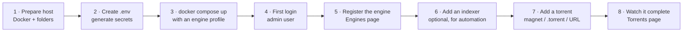

# Quick Start

Zero to a first working download in roughly **15 minutes**.

## Overview

UltraTorrent is a **self-hosted media acquisition and management platform**. It is
not just a torrent client: it wraps a real BitTorrent engine (rTorrent or
qBittorrent), adds indexer search, RSS automation, missing-episode detection,
media identification and renaming, media-server integration, notifications, and
role-based access control — all behind one web UI and one REST API.

This page gets the whole stack running and walks you to a torrent that reaches
100%. It does **not** try to configure everything. Deeper setup lives in
[Core Concepts](/learn/concepts) and the [Tutorials](/learn/tutorials/).



## Purpose

By the end of this page you will have:

- The full stack running under Docker Compose (PostgreSQL, Redis, backend, frontend).
- A BitTorrent engine registered and reporting as connected.
- An administrator account you can log into.
- At least one torrent downloading, and then completed.

## When to use this page

| Use Quick Start when… | Use something else when… |
| --- | --- |
| You are evaluating UltraTorrent for the first time. | You need a production install behind TLS → [Reverse proxy](/install/reverse-proxy) and [TLS](/install/tls). |
| You want the shortest path to a working download. | You want every Compose service and volume explained → [Docker Compose install](/install/docker-compose). |
| You are on a Linux host, a NAS, or a VM with Docker. | You are upgrading an existing install → [Upgrading](/install/upgrading). |

## Prerequisites

Before you start, confirm all of the following.

| Requirement | Why | How to check |
| --- | --- | --- |
| **Docker Engine** with the **Compose v2** plugin | The whole stack ships as containers. | `docker --version` and `docker compose version` |
| **~2 GB RAM free** | PostgreSQL + Redis + backend + engine. | `free -h` |
| **Disk space** for downloads | Torrents land in a Docker volume by default. | `df -h` |
| **A free host port** | The web UI publishes on `8080` by default. | `ss -ltn` (look for `:8080`) |
| **`openssl`** | Used to generate the required secrets. | `openssl version` |
| **A legal torrent to test with** | You need *something* to download. | See [Step 7](#step-7--add-your-first-torrent) |

:::info No Docker yet?
Install Docker Engine and the Compose plugin from the official Docker
documentation for your distribution first. Docker Desktop on macOS and Windows
also ships Compose v2. UltraTorrent also runs from source on Node.js 20+, but
Docker is the supported, first-class path.
:::

:::danger Only download content you have the right to download
UltraTorrent is a general-purpose acquisition tool. What you point it at is
entirely your responsibility. Use Linux distribution images, Creative Commons
media, or your own content while you are learning.
:::

## Concepts you need for the next 15 minutes

You only need four ideas to finish this page. Every term is defined properly in
[Core Concepts](/learn/concepts).

- **Engine** — the BitTorrent client that actually moves bytes (rTorrent or
  qBittorrent). UltraTorrent drives it; it never talks to peers itself.
- **Indexer** — a searchable catalogue of torrents (a Torznab/Newznab endpoint,
  typically served by Prowlarr or Jackett). Optional for a first manual download,
  required for automated acquisition.
- **Torrent** — one transfer, with a lifecycle (queued → downloading → seeding).
- **Library** — a folder UltraTorrent scans, identifies, renames and organises.
  Not needed today; covered in [Building a movie library](/learn/tutorials/building-a-movie-library).

---

## Step-by-step

### Step 1 — Get the code and pick a folder

```bash
git clone https://github.com/damirabal/ultratorrent-core.git
cd ultratorrent-core
```

**Expected result:** a folder containing `docker-compose.yml`, `.env.example`,
`apps/`, and `docs/`.

```bash
ls docker-compose.yml .env.example
```

Both files must exist. If they do not, you are in the wrong directory.

---

### Step 2 — Create your `.env` and generate secrets

Compose is deliberately **fail-closed**: it will not start without a database
password and an admin password, and the backend refuses to boot in production if
the JWT and encryption secrets are unset, weak, or identical.

```bash
cp .env.example .env
```

Now generate three distinct secrets:

```bash
openssl rand -base64 48   # → JWT_ACCESS_SECRET
openssl rand -base64 48   # → JWT_REFRESH_SECRET
openssl rand -base64 48   # → ENCRYPTION_KEY
```

Edit `.env` and fill in **five** values:

```ini title=".env (the five values you must set)"
# Alphanumeric only — this value is interpolated into a DATABASE_URL,
# so URL-special characters would need percent-encoding.
POSTGRES_PASSWORD=ChangeMeToSomethingLongAndAlphanumeric

# Each at least 32 characters. JWT_ACCESS_SECRET and ENCRYPTION_KEY MUST differ.
JWT_ACCESS_SECRET=<paste openssl output #1>
JWT_REFRESH_SECRET=<paste openssl output #2>
ENCRYPTION_KEY=<paste openssl output #3>

# The bootstrap super-admin created on first seed.
ADMIN_PASSWORD=YourStrongAdminPassword
```

:::warning The three secrets are not interchangeable
`ENCRYPTION_KEY` encrypts secrets at rest — 2FA/TOTP secrets, indexer API keys,
media-server tokens, notification provider credentials. **Changing it later
invalidates everything already encrypted with it.** Generate it once, store it in
a password manager, and back it up with your database.
:::

:::tip Port already in use?
`8080` is a busy port on NAS devices. Set `FRONTEND_PORT=8090` (or any free port)
in `.env` now — it is much easier than changing it later.
:::

**Expected result:** `.env` exists, is not committed to git, and every one of the
five values above is non-empty.

```bash
grep -E '^(POSTGRES_PASSWORD|JWT_ACCESS_SECRET|JWT_REFRESH_SECRET|ENCRYPTION_KEY|ADMIN_PASSWORD)=' .env
```

Every line printed must have something after the `=`.

---

### Step 3 — Choose a torrent engine and start the stack

UltraTorrent does not contain a BitTorrent engine. It **drives** one. Two are
bundled as optional Compose profiles:

| Profile | Engine | Choose it when… |
| --- | --- | --- |
| `rtorrent` | rTorrent 0.9.8 (SCGI over TCP) | You want the smallest footprint and a modest number of torrents. |
| `qbittorrent` | qBittorrent (Web API) | You expect a **large** library. rTorrent 0.9.8 can crash under high torrent counts. |

Start the stack **with** an engine profile. For qBittorrent (recommended):

```bash
docker compose --profile qbittorrent up -d --build
```

Or, for the bundled rTorrent:

```bash
docker compose --profile rtorrent up -d --build
```

The first build takes several minutes. The backend runs `prisma migrate deploy`
and seeds permissions, system roles, the admin user and default settings on
first boot.

**Expected result:** all containers healthy.

```bash
docker compose ps
```

You should see `postgres`, `redis`, `backend`, `frontend` (and your engine)
running. Then confirm the API is alive:

```bash
docker compose logs backend --tail 30
```

Look for a successful Nest bootstrap with no `refuses to boot` error. If the
backend exits immediately, jump to [Troubleshooting](#troubleshooting).


---

### Step 4 — Log in for the first time

Open the web UI:

```
http://localhost:8080
```

(Replace `localhost` with your server's IP or hostname if it is remote, and `8080`
with your `FRONTEND_PORT` if you changed it.)

Sign in with:

- **Username:** the value of `ADMIN_USERNAME` (default `admin`)
- **Password:** the value of `ADMIN_PASSWORD` you set in Step 2

**Expected result:** you land on the **Dashboard**, with a left sidebar grouped
into Overview, Downloads, RSS &amp; Acquisition, Media Management, Media Server
Analytics, Automation, Files, Administration and Account.


:::tip Press Ctrl+K (or Cmd+K)
The command palette searches every page you have permission to see. It is the
fastest way to navigate and it never shows you a page you cannot open.
:::

---

### Step 5 — Register your torrent engine

The container is running, but UltraTorrent does not know about it yet. You must
register it once.

1. In the sidebar go to **Downloads → Engines** (`/engines`).
2. Click **Add engine**.
3. Fill it in for the engine you started in Step 3:

   **If you chose qBittorrent:**

   | Field | Value |
   | --- | --- |
   | Kind | `qBittorrent` |
   | Base URL | `http://qbittorrent:8080` |
   | Username | `admin` |
   | Password | the qBittorrent Web UI password |

   qBittorrent generates a **temporary password on first run**. Get it with:

   ```bash
   docker compose logs qbittorrent | grep -i "temporary password"
   ```

   Open `http://localhost:8081`, log in with `admin` + that temporary password,
   and set a permanent password in **Options → Web UI**. Use that permanent
   password in UltraTorrent.

   **If you chose rTorrent:**

   | Field | Value |
   | --- | --- |
   | Kind | `rTorrent` |
   | Mode | `SCGI (TCP)` |
   | Host | `rtorrent` |
   | Port | `5000` |

4. Click **Test** and confirm the connection succeeds.
5. Save, then click the **Set default** action on the new engine.

**Expected result:** the engine appears in the list with a **Default** badge and
a connected status. The top bar begins showing live transfer rates (0 B/s for
now), which means the sync loop is polling the engine successfully.


:::warning Use the container name, not `localhost`
Inside the Docker network the backend reaches the engine at `qbittorrent:8080`
or `rtorrent:5000`. `localhost` from inside the backend container means *the
backend container itself* and will always fail.
:::

---

### Step 6 — Add an indexer (optional today, essential later)

An **indexer** is a Torznab/Newznab search endpoint. UltraTorrent uses indexers
to *search* for releases when automation needs them — for example when Smart
Download tries to fill a missing episode.

:::info There is no manual "search the web" page — by design
UltraTorrent's **Search** entry (and Ctrl+K) searches the **application's own
navigation**, not indexers. Indexer search is consumed by the acquisition
pipeline (Missing Episodes' *Search now*, the scheduled auto-acquire sweep) and
by the REST API. To browse indexers by hand, use the Prowlarr UI. You can skip
this whole step and still complete Step 7.
:::

The easiest source of indexers is the bundled **Prowlarr** companion container:

```bash
docker compose --profile qbittorrent --profile prowlarr up -d
```

Then:

1. Open Prowlarr at `http://localhost:9696`, add one or more indexers there, and
   copy an indexer's **Torznab feed URL** and Prowlarr's **API key**.
2. In UltraTorrent, go to **Downloads → Indexers** (`/indexers`).
3. Click **Add indexer** and fill in:

   | Field | Meaning | Example |
   | --- | --- | --- |
   | Name | Display name | `Prowlarr — MyIndexer` |
   | Implementation | `torznab` or `newznab` | `torznab` |
   | Base URL | The API base | `http://prowlarr:9696/1/api` |
   | API key | Stored AES-256-GCM encrypted; never returned by the API | *(paste)* |
   | Categories | Newznab categories to query | `5000, 5030, 5040` (TV) |
   | Min seeders | Optional floor; candidates below it are dropped | `5` |
   | Priority | Lower is tried first | `1` |

4. Click the **Test** button (the flask icon). It runs a `t=caps` capability
   negotiation.

**Expected result:** the indexer shows an **OK** status badge and a
`lastTestedAt` timestamp. The API key field now shows a mask (`••••••••`) — that
is correct; the key is never sent back to the browser.

:::danger Private-IP indexers need `SSRF_ALLOW_HOSTS`
The backend blocks torrent URLs that resolve to private/internal addresses
(an SSRF guard). A self-hosted indexer *is* a private address. `SSRF_ALLOW_HOSTS`
defaults to `prowlarr` so the bundled Prowlarr works out of the box. If you add
your own private indexer, list it **and keep `prowlarr`**:

```ini
SSRF_ALLOW_HOSTS=prowlarr,indexer.lan,10.0.0.0/24
```

Without this, automated grabs fail with *"Torrent URL resolves to a blocked
internal address"* — often silently.
:::


---

### Step 7 — Add your first torrent

Now the payoff.

1. Go to **Downloads → Torrents** (`/torrents`).
2. Click **Add torrent**.
3. The dialog offers three tabs — **Magnet**, **URL**, and **File**:

   | Tab | Give it | Use when |
   | --- | --- | --- |
   | Magnet | `magnet:?xt=urn:btih:…` | You copied a magnet link. |
   | URL | An `https://…/x.torrent` link | The indexer/site gives you a `.torrent` URL. |
   | File | A `.torrent` file (click or drag-and-drop) | You downloaded the `.torrent` already. |

4. Optionally set **Save path**, **Category** and **Tags**. Leave the save path
   blank to use the engine's default (`/downloads` in the bundled stack).
5. Click **Add**.

For a safe, legal first test, use any Linux distribution's official torrent —
for example the Ubuntu, Debian, or Fedora ISO torrents published on their
download pages.

**Expected result:** a toast confirms the torrent was added, and a new row
appears in the Torrents table within a couple of seconds — pushed to your browser
over WebSocket, with no page refresh.


---

### Step 8 — Watch it complete

Stay on **Downloads → Torrents**. The engine is polled roughly every 2 seconds
and the normalized results are pushed to your browser live.

Watch for:

- **Progress** climbing past 0%.
- A non-zero **Down** rate in the row and in the top bar.
- **Peers/seeds** greater than zero.
- The state moving to **Seeding** at 100%.

The sidebar's Torrents sub-menu lets you filter to **Downloading**, **Seeding**,
**Completed**, **Paused** and **Errors** — those are URL-driven views
(`/torrents?state=…`), so they are bookmarkable.

**Expected result:** the torrent reaches 100% and switches to **Seeding**. Your
first download is done.


:::tip Watch this tutorial
_Video coming soon._
:::

---

## Examples

### Bring up the full recommended stack in one command

```bash
docker compose \
  --profile qbittorrent \
  --profile prowlarr \
  --profile flaresolverr \
  up -d --build
```

That gives you: PostgreSQL, Redis, the UltraTorrent backend, the UltraTorrent
frontend, a qBittorrent engine, a Prowlarr indexer manager, and FlareSolverr
(which solves Cloudflare anti-bot challenges for indexers that need it).

### Verify the API is healthy without logging in

```bash
curl -fsS http://localhost:8080/api/system/live   && echo "live OK"
curl -fsS http://localhost:8080/api/system/ready  && echo "ready OK"
```

Both probes are public and are what container orchestrators should health-check.

### Tail just the backend while you debug

```bash
docker compose logs -f backend
```

---

## Troubleshooting

| Symptom | Likely cause | Fix |
| --- | --- | --- |
| `POSTGRES_PASSWORD is required` on `up` | `.env` missing or the value is blank. | Set `POSTGRES_PASSWORD` (alphanumeric) in `.env`. |
| `ADMIN_PASSWORD is required` on `up` | Same, for the bootstrap admin. | Set `ADMIN_PASSWORD` in `.env`. |
| Backend exits immediately in production | `JWT_ACCESS_SECRET` / `ENCRYPTION_KEY` unset, under 32 chars, a known default, or identical to each other. | Regenerate both with `openssl rand -base64 48`; they must **differ**. |
| Web UI does not load on `:8080` | Port already in use (very common on NAS). | Set `FRONTEND_PORT` in `.env`, then `docker compose up -d`. |
| Login rejects the admin password | The seed only runs on first boot, so a later `.env` change does not rewrite the password. | Reset the password from a shell, or start over from an empty database volume. |
| Engine test fails with a connection error | You used `localhost` instead of the container name. | Use `http://qbittorrent:8080` or host `rtorrent`, port `5000`. |
| Engine test fails with `401`/`403` (qBittorrent) | Still using the first-run temporary password. | Set a permanent Web UI password in qBittorrent, then update the engine. |
| Torrent added but stays at 0% forever | No peers, a dead tracker, or DHT off. | Try a known-good Linux ISO torrent. On the bundled rTorrent, DHT is **off by default** (`RT_DHT=off`) because that build can crash on a DHT `internal_error`; trackers and PEX still find peers. |
| Auto-download does nothing, "blocked internal address" in logs | The SSRF guard rejected a private-IP indexer link. | Add the indexer host to `SSRF_ALLOW_HOSTS` (keep `prowlarr`). |
| Downloaded files owned by `root` | The engine ran as root. | Set `PUID`/`PGID` in `.env` to the user that owns your downloads folder (`id someuser`). |

Deeper diagnosis lives in [Troubleshooting](/operate/troubleshooting).

---

## Tips

:::tip Set `PUID` / `PGID` before you download anything real
If your media folder is owned by, say, the `plex` user, run `id plex` and put
those numbers in `.env` as `PUID`/`PGID`. Downloads will be written as that user
without you having to chown anything afterwards. Fixing ownership later is far
more annoying.
:::

:::tip Turn on 2FA immediately
**Account → Profile** hosts Two-Factor Authentication (TOTP), change-password and
active sessions. Do it before you expose this to a network.
:::

:::warning Do not expose port 8080 to the internet as-is
There is no TLS on the plain Compose stack. Put it behind a reverse proxy with a
certificate — see [Reverse proxy](/install/reverse-proxy) and [TLS](/install/tls),
and read [Security](/operate/security) before you open anything up.
:::

:::info Everything is also an API
The SPA is just one client of the REST API. Every action on this page has an HTTP
equivalent — see the [API reference](/reference/api).
:::

---

## FAQ

**Do I need Prowlarr?**
No. You can add torrents by magnet, URL or file forever without any indexer. You
need an indexer only when you want UltraTorrent to *search* for releases on your
behalf (Smart Download, missing-episode auto-acquire).

**Can I use my existing rTorrent or qBittorrent?**
Yes. Skip the bundled profiles and point the engine at your existing instance in
**Downloads → Engines**. It must be reachable from the backend container, and the
paths it reports must be visible to UltraTorrent (see
[Core Concepts → Paths](/learn/concepts#paths-and-why-they-must-line-up)).

**Where do downloaded files actually go?**
Into the `downloads` Docker volume, mounted at `/downloads` in both the backend
and the engine. `FILE_MANAGER_ROOTS` (default `/downloads`) is the hard boundary
the file manager and Media Manager may never escape.

**Can I run more than one engine?**
Yes. Register several in **Downloads → Engines**; one is marked **Default**. The
UI and API always speak normalized, engine-agnostic data.

**Is any feature paywalled?**
No. UltraTorrent is a single open-source community product (AGPL-3.0-or-later).
Every module ships in this one repository; access is controlled **only** by RBAC
permissions — see [Permissions](/reference/permissions).

**Does UltraTorrent scrape IMDb?**
No. The IMDb provider works from **user-provided IMDb datasets** and/or a
**licensed IMDb API**, configured in **Media → Settings → IMDb**. It never scrapes
IMDb web pages.

---

## Checklist

Work down this list. Every box should be tickable before you move on.

- [ ] `docker compose ps` shows `postgres`, `redis`, `backend`, `frontend` and an engine, all running.
- [ ] `curl http://localhost:8080/api/system/ready` returns success.
- [ ] You can log in at `http://localhost:8080` with your `ADMIN_USERNAME` / `ADMIN_PASSWORD`.
- [ ] The **Dashboard** renders with the full sidebar.
- [ ] **Downloads → Engines** shows one engine with a **Default** badge and a passing **Test**.
- [ ] *(Optional)* **Downloads → Indexers** shows one indexer with an **OK** status badge.
- [ ] **Downloads → Torrents** shows a torrent you added.
- [ ] That torrent reached **100%** and is now **Seeding**.
- [ ] You enabled 2FA on **Account → Profile**.

### Expected results at a glance

| Where | What you should see |
| --- | --- |
| Terminal | All containers `running`; backend log shows migrations applied, no boot refusal. |
| `/dashboard` | Live transfer rates in the top bar; connection status shows connected. |
| `/engines` | One engine, `Default` badge, test OK. |
| `/torrents` | A row at 100%, state `Seeding`, ratio climbing. |

### Next steps

1. **Understand what you just built** → [Core Concepts](/learn/concepts)
2. **See how the pieces fit together** → [Architecture Overview](/learn/architecture-overview)
3. **Do it again, slowly and with every detail** → [My First Download](/learn/first-download)
4. **Automate a TV show** → [Automating TV shows](/learn/tutorials/automating-tv-shows)
5. **Organise what you downloaded** → [Building a movie library](/learn/tutorials/building-a-movie-library)

---

## See also

- [Docker Compose install](/install/docker-compose) — every service, volume and profile explained.
- [Environment variables](/reference/environment) — the complete `.env` reference.
- [Engines](/modules/engines) — the engine seam and supported engines.
- [Indexers](/modules/indexers) — Torznab/Newznab indexer configuration.
- [Prowlarr](/modules/prowlarr) — the optional indexer-manager companion.
- [Torrents](/modules/torrents) — the full transfer-management module.
- [Security](/operate/security) — before you expose this anywhere.
- [Glossary](/help/glossary) — every term, defined.
