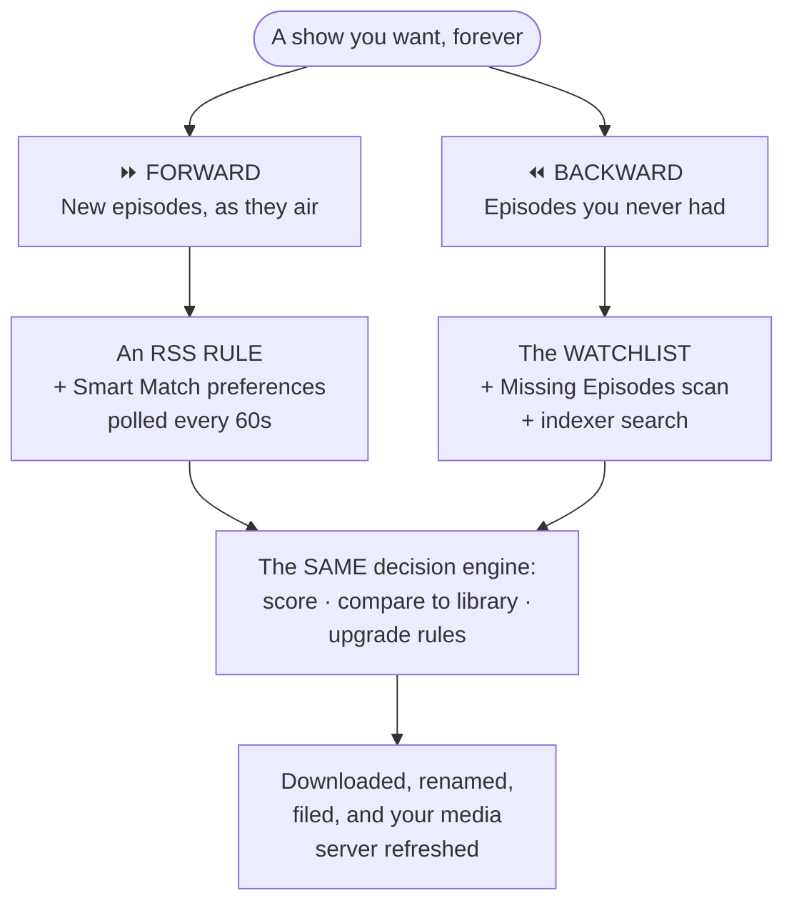
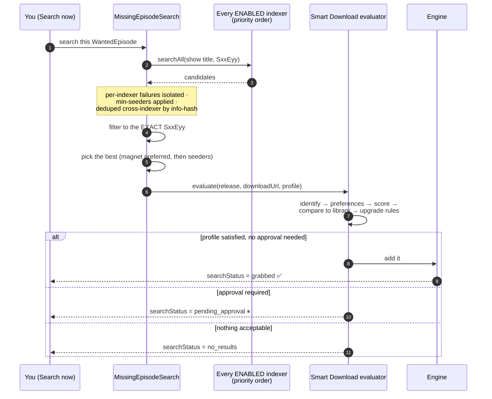

# Automating TV Shows

**Level:** 🔵 Intermediate · **Time:** ~60 minutes

The goal: a show you never think about again. New episodes arrive on their own.
Old gaps fill themselves in. You find out only because a notification told you.

## Overview

There are **two directions** and you want both.



Forward acquisition (RSS) catches tonight's episode minutes after it is posted.
Backward acquisition (watchlist + Missing Episodes) fills in the 43 episodes you
never had. Neither one does the other's job.

## Purpose

By the end you will have:

- A series **monitored** on the watchlist, with an accurate missing-episode count.
- Missing episodes **searched for and grabbed** — manually first, then automatically.
- An **RSS rule** catching new episodes as they appear.
- Certainty about what will happen when the show eventually **ends**.

## When to use this tutorial

| Use it when… | Use something else when… |
| --- | --- |
| You want a show fully automated. | You want movies → [Building a movie library](/learn/tutorials/building-a-movie-library). |
| You want to see which episodes you are missing. | You want to tune *quality* preferences → [Smart RSS rules](/learn/tutorials/smart-rss-rules). |
| You want gaps filled without you searching. | You have no indexers yet → [Multiple indexers](/learn/tutorials/multiple-indexers). |

## Prerequisites

- [ ] A working **TV library** (`kind: tv`) whose items are **identified** — see [Building a movie library](/learn/tutorials/building-a-movie-library), which applies identically to TV.
- [ ] At least one **indexer** that passes its **Test** (`/indexers`).
- [ ] The `media_acquisition_intelligence` module enabled.
- [ ] Permissions: `media_acquisition.view`, `media_acquisition.manage_watchlist`, `media_acquisition.evaluate`; `rss.view`, `rss.manage`.
- [ ] **An IMDb episode catalogue** — see the warning below. This is the one that stops people.

:::danger Missing Episodes needs the IMDb *episode* catalogue
The "what episodes should exist" set comes from your local IMDb episode mirror.
That mirror is only populated when the IMDb import runs with **Import TV series &amp;
episodes** enabled. **A movies-only import has no episodes to diff against** — the
page will simply show nothing missing, forever, and you will think it is broken.

Configure this on **Media Management → IMDb Settings** (`/media/settings/imdb`)
before you go further.
:::

## Concepts

| Term | Meaning |
| --- | --- |
| **Watchlist item** | A thing you want: `movie` / `series` / `season` / `episode`. |
| **Monitored** | On the watchlist **with an IMDb ID**. Without one, a series is *not monitorable*. |
| **Wanted episode** | A computed row per catalogue episode: `owned` / `missing` / `unaired` / `ignored`. |
| **`searchStatus`** | `idle → searching → grabbed \| pending_approval \| no_results \| failed`. |
| **Acquisition profile** | The policy: minimum score, approval score, upgrades allowed, wait policy. |
| **Show status** | `continuing` / `returning` / `planned` / `on_hiatus` / `ended` / `canceled` / `unknown`. |

---

## Step-by-step

### Step 1 — Make sure the show is actually in your library, and identified

Go to **Media Management → Media Items** (`/media/items`).

Find your show. Confirm:

- It exists as a **series** (not as 40 separate items, one per episode).
- Its `matchStatus` is `matched` or `manual`, **not** `unmatched`.

:::warning "Missing" is only as good as your identification
Ownership is decided from `MediaItem.season` / `episode`, which come from
**filename identification** — not from a raw scan. A library of badly named or
unidentified files will over-report *missing*, and you will end up re-downloading
things you already have.

**Re-identify the library before you trust any missing-episode count.**
:::

:::info Why a show sometimes fragments into one item per episode
For an episodic layout (`Show/Season NN/episode`), the **series title is taken from
the show folder**, not the filename — because the filename often carries only the
*episode* title. If your files are loose or the folder structure is unusual, that
consolidation cannot happen. Restructure to `Show/Season 01/…` and rescan.
:::

**Expected result:** one media item for the series, `matched`, with seasons and
episodes underneath it.

---

### Step 2 — Monitor the series (the easy way)

Go to **RSS &amp; Acquisition → Acquisition Intelligence → Missing Episodes**
(`/media-acquisition/missing-episodes`).

Click **Add from library**.

This opens a searchable multi-select of the TV series **already in your libraries**,
with their IMDb IDs **resolved automatically** (from each show's `seriesImdbId`, or
from an episode's `imdb` external ID).

- Series already on the watchlist appear **pre-checked and locked**.
- Shows with **no resolvable IMDb ID** are flagged — they are still addable, but you
  should **re-identify** the library to make them scannable.

Select your show. Add.

:::tip Do not hand-type IMDb IDs
You *can* — the watchlist add/edit dialog has an **IMDb ID** field (`tt0903747`
style). But the picker resolves them for you, in bulk, and does not typo.
:::

**Expected result:** the series appears on the Missing Episodes page as a monitored
series.


---

### Step 3 — Scan for missing episodes

Click **Scan** on the series (or **Scan all**).

The scan:

1. Enumerates **every** episode of the series from the IMDb episode catalogue.
2. Works out which ones the **library owns** — primarily via the structured
   `seriesImdbId` link, falling back to a case-insensitive title match if the library
   has not been re-identified.
3. Classifies each catalogue episode:

| Status | Meaning |
| --- | --- |
| `owned` | You have it. |
| `missing` | It **aired** and you do not have it. **This is the acquirable gap.** |
| `unaired` | Its air year is in the future or unknown — it cannot be acquired yet. |
| `ignored` | You opted it out. **Survives rescans.** |

Season 0 (specials) is excluded from the missing maths.

**Expected result:** per-series counts (owned / total / missing / unaired / ignored)
and a season → episode grid you can expand.

:::info Rescans are idempotent
Rescanning rebuilds everything **except** your `ignored` overrides and the
grab-state (`searchStatus`, `grabbedAt`) on episodes already searched. You cannot
lose those by rescanning.
:::

:::caution The mirror lags IMDb
Your catalogue is only as fresh as your last IMDb import, and the optimized import
drops episodes with no air date. The page shows the mirror's date. A very recent
episode may not appear as *missing* until you refresh the mirror.
:::


---

### Step 4 — Prune the list before you automate it

Expand the series. Go through the grid and **Ignore** anything you do not want:

- Specials you do not care about.
- A season you deliberately do not own.
- Episodes that will never have a release.

Ignored episodes drop out of the missing count and **survive rescans** — so this is
a one-time investment, not a chore.

:::warning Prune BEFORE you turn on auto-search
If you enable the sweep against a list full of episodes you never wanted, it will
dutifully go and get them. Ten minutes of pruning here saves a lot of disk.
:::

**Expected result:** the *missing* count now equals the number of episodes you
actually want.

---

### Step 5 — Fill one gap by hand, first

Do **not** turn automation on yet. Prove the chain works on one episode.

Pick a missing episode and click **Search now**.

Here is what happens:



Watch the episode's `searchStatus` badge change: `searching` → `grabbed` /
`awaiting approval` / `no release` / `failed`.

**Expected result:** one of:

| Badge | Meaning | What to do |
| --- | --- | --- |
| **grabbed** | It is downloading. | 🎉 Go to `/torrents` and confirm. |
| **awaiting approval** | The decision engine wants a human. | Approve it in the acquisition **Approvals** tab. |
| **no release** | Nothing acceptable found. | See Troubleshooting. |
| **failed** | The search itself errored. | Check `docker compose logs backend`. |

:::info Why the same episode is not searched twice
`searchStatus` is **preserved across rescans**, exactly like your `ignored`
overrides. A grabbed or pending episode is never re-searched. The state drops
automatically once the episode becomes `owned`.
:::

There is also **Search all** per series, if you want to fire the whole backlog by
hand.

---

### Step 6 — Now turn on automatic search

Only once Step 5 worked.

The scheduled sweep is **opt-in and OFF by default**. Enable it in the media
acquisition settings:

| Setting | Default | What it does |
| --- | --- | --- |
| `autoSearchMissing` | **`false`** | Enables the scheduled sweep. **This is the master switch.** |
| `searchIntervalMinutes` | `60` | Per-episode re-search backoff. |
| `missingSearchProfileId` | `null` | Which acquisition profile to grab with (falls back to the watchlist item's). |
| `maxSearchesPerSweep` | `50` | Caps how many episodes are searched per tick. |

Duplicate-grab safety is **layered**, so you are not one setting away from disaster:

- `searchStatus` excludes already-grabbed/pending rows.
- A `lastSearchedAt` backoff enforces the cadence.
- A re-entrancy guard stops overlapping sweeps.
- `searchAll` dedups candidates cross-indexer by info-hash.
- The evaluator's own **owned** check returns `skip` if the library already has it.

**Expected result:** over the next few sweeps, missing episodes turn `grabbed` on
their own.

:::caution Auto-search is episode-only
`WantedMovie` rows carry the same grab-state columns, but automatic search is
**episode-only** today. Missing *movies* are detected and listed, but you must
acquire them yourself (or via an RSS rule).
:::

---

### Step 7 — Catch *future* episodes with an RSS rule

Missing Episodes looks backwards. For tonight's episode you want RSS.

1. Go to **RSS &amp; Acquisition → RSS Feeds** (`/rss`).
2. **Add feed** — a URL and a refresh interval. The `rss_poll` job runs every 60
   seconds and fetches feeds whose interval has elapsed.
3. **Add rule** under that feed:

   | Field | Value |
   | --- | --- |
   | Name | `The Expanse` |
   | **Media type** | **`tv`** ← this is what activates show-status awareness |
   | Include regex | something that matches the show |
   | Exclude regex | e.g. exclude `CAM`, `HDTS`, languages you do not want |
   | Save path | `/downloads/tv` ← **must be inside your TV library's root** |
   | Auto-download | on |

4. Save.

**Expected result:** the rule is created, and because you set **Media type = tv**,
a live **show status panel** appears.

---

### Step 8 — Understand the show-status panel

When the media type is `tv` or `anime`, UltraTorrent resolves the show's **airing
status** — server-side, never trusting anything the browser sends — using providers
tried in confidence order:

| Provider | Source | Confidence |
| --- | --- | --- |
| TMDB | `/search/tv` + `/tv/{id}` | 0.95 — status, next/last episode, poster |
| IMDb dataset | your local `IMDbTitle` mirror | 0.6 — ended/continuing, no next-episode granularity |
| Local library | your own `MediaItem`s | 0.3 — best-effort fallback |

The answer is normalized to a status and a recommendation:

| Status | Recommendation |
| --- | --- |
| `continuing` · `returning` · `planned` | ✅ **recommended** |
| `on_hiatus` | ⚠️ **caution** |
| `ended` · `canceled` | ⛔ **not recommended** |
| `unknown` | ❓ **unknown** — saved with a `status_unconfirmed` warning |

:::warning Saving a rule for an ended show is blocked — deliberately
Monitoring a canceled show forever just wastes polling. If you try to save a TV rule
for an `ended` or `canceled` show, the save is **rejected (400)** and a confirmation
modal appears. Confirming sets `allowInactiveShowMonitoring` — and **that override is
audited**.

If what you actually want is to *backfill* an old show rather than monitor it
forward, the right move is a rule with **auto-download OFF**, plus the watchlist +
Missing Episodes flow from Steps 2–6.
:::

**Expected result:** a status badge, a recommendation banner, the provider and its
confidence, next/last-episode dates, and a poster — before you save.


---

### Step 9 — Build the quality preferences

Open the rule's detail page (`/rss/rules/:ruleId`). This is where the **Smart Match
Builder** and **Match Preferences** live.

Do not try to express quality with regex. Build a **ranked preference list**
instead — "2160p Dolby Vision first, 1080p WEB-DL second, never a CAM" — and the
engine will hold **one release per episode**, upgrade to a strictly better one if it
appears, and skip anything equal or worse.

That is covered properly in [Smart RSS rules](/learn/tutorials/smart-rss-rules). For
now, a simple list is fine.

**Expected result:** the rule's Match Preferences list is ordered the way you want.

---

### Step 10 — What happens when the show ends

A background job (`rss_show_status_refresh`) re-resolves cached show statuses on a
**per-status cadence**:

| Status | Re-checked every |
| --- | --- |
| active | 24 hours |
| `on_hiatus` | 7 days |
| `ended` / `canceled` | 30 days |
| `unknown` | 3 days |

When a show's status **changes**, it updates every rule that snapshotted that show,
emits `rss.show_status.changed` plus the specific transition
(`rss.show.ended` / `.canceled` / `.became_active`), and audits it.

:::info It never disables your rule
Surfacing the change is the platform's job. Deciding what to do about it is yours.
If you *want* it automated, build an automation rule on the `rss.show.ended`
trigger with an action like `convert_rule_to_backfill` (which turns off
auto-download but keeps the rule) or `disable_rss_rule`. See
[Notifications and automation](/learn/tutorials/notifications-and-automation).
:::

**Expected result:** you find out when a show ends, and you decide what happens
next.

:::tip Watch this tutorial
_Video coming soon._
:::

---

## Examples

### The full setup for one show

| Piece | Where | Setting |
| --- | --- | --- |
| Library | `/media/libraries` | `/downloads/tv`, kind `tv`, preset `plex`, mode `hardlink`, scan `360` |
| Watchlist | `/media-acquisition` → Watchlist | Series, with IMDb ID (via **Add from library**) |
| Backfill | `/media-acquisition/missing-episodes` | Scan → prune with Ignore → Search all |
| Auto-backfill | acquisition settings | `autoSearchMissing: true`, `maxSearchesPerSweep: 50` |
| Forward | `/rss` → rule | Media type `tv`, save path `/downloads/tv`, auto-download on |
| Quality | `/rss/rules/:id` | A ranked Match Preferences list |
| When it ends | `/automation` | Trigger `rss.show.ended` → action `convert_rule_to_backfill` + `notify_admin` |

### An automation rule for the day it ends

```text
TRIGGER    rss.show.ended
CONDITIONS (none — apply to every show)
ACTIONS    convert_rule_to_backfill   ← keep the rule, stop forward grabbing
           notify_admin               ← tell me
```

---

## Troubleshooting

| Symptom | Cause | Fix |
| --- | --- | --- |
| Missing Episodes shows nothing at all | The IMDb import ran **movies-only**. | Re-import with **Import TV series &amp; episodes** enabled (`/media/settings/imdb`). |
| Series shows as *not monitorable* | No IMDb ID on the watchlist item. | Use **Add from library**, or set the IMDb ID by hand. If it cannot resolve, re-identify the library. |
| It says I am missing episodes I definitely have | Library items are unidentified, so ownership cannot be proven. | Re-identify the library. Clear `/media/unmatched`. |
| Everything shows as `unaired` | The catalogue has no air year for those episodes. | The mirror lags IMDb — refresh the import. |
| **Search now** → `no release` | (a) The show's scene title does not parse to your watchlist title (an alias). (b) No indexer carries it. (c) `minSeeders` filtered everything out. | Check the indexer directly; lower `minSeeders`; confirm the title matches how releases actually name the show. |
| **Search now** → `failed` | The indexer errored. | Test the indexer (`/indexers`); check `docker compose logs backend`. |
| Everything lands in `pending_approval` | Your profile forces approval, or the score is below `approvalScore`. | Adjust the acquisition profile, or approve them. |
| Grabbed, but the file never appears | The grab's save path is outside your TV library root, so the media pipeline never ran. | Fix the rule's save path / the profile's path. |
| RSS rule will not save | The show is `ended`/`canceled`. | Confirm the override (audited), **or** build a backfill rule with auto-download off. |
| The rule grabs then deletes what it grabbed | An **upgrade**: a strictly higher-priority release appeared. | Working as designed. Adjust your preference list if you disagree. |
| Auto-search never runs | `autoSearchMissing` is `false` — the default. | Turn it on. |
| Torrent URL blocked | SSRF guard vs. a private-IP indexer. | Add the host to `SSRF_ALLOW_HOSTS` (keep `prowlarr`). |

---

## Tips

:::tip Backfill by hand once, then automate
Running **Search all** manually on one series teaches you more about your indexers,
your profile and your preference list in ten minutes than a week of the sweep
running quietly in the background.
:::

:::tip Use the Decision Simulator on a release that got skipped
Paste the release name into `/media-acquisition/simulator` and read the trace. It
tells you exactly which stage rejected it — with **zero side effects**.
:::

:::warning Set `maxSearchesPerSweep` sensibly
The default of `50` is per tick. If you just added six seasons of five shows, that
is a lot of indexer traffic. Some indexers rate-limit; some ban. Start small.
:::

:::info Smart Download does not re-implement quality
It **consumes** the RSS module's Smart Match preference lists and the Release
Scoring engine as the source of truth. Tune quality in one place and both paths
obey it.
:::

---

## FAQ

**Do I need both an RSS rule and the watchlist?**
For a currently-airing show, yes — they cover opposite directions in time. For a
finished show you only want the watchlist + Missing Episodes.

**What if a show is known by a different name on my indexer?**
A candidate only matches when its scene title **parses to the show name**. A show
under a substantially different alias may find nothing — the release is skipped
rather than mis-grabbed, which is the safe failure. Handle that show with an RSS
rule whose include regex matches the alias.

**Can it grab season packs?**
Indexer search for missing episodes filters candidates to the **exact `SxxEyy`**. An
RSS rule can match whatever its regex and preference list allow.

**Will it re-download an episode I already have in worse quality?**
Only if your profile permits **upgrades** (`duplicateRules.allowUpgrades`) *and* the
new release wins on a real upgrade dimension — resolution, source, HDR, audio,
channels. A codec change alone (x264 → x265) **never** triggers an upgrade.

**What is `wait` and why is nothing downloading?**
Your profile's wait policy (`waitForBetter` + `waitUntilScore`) is deliberately
holding out for something better. See the **Waiting** queue on the Smart Download
dashboard.

**Are Smart Download decisions notified?**
Not yet — per-user notifications on decision events and Smart Download automation
triggers are **not yet implemented**. Use the queues, and the
`media.missing_episode_filled` notification event that a successful grab does emit.

---

## Checklist

### Verification

- [ ] The IMDb import ran **with TV series &amp; episodes enabled**.
- [ ] The show exists as **one** media item in a `tv` library, `matched`.
- [ ] It is on the **watchlist with an IMDb ID** (via **Add from library**).
- [ ] A **scan** produced sensible owned / missing / unaired counts.
- [ ] I **pruned** the list with Ignore.
- [ ] One episode was filled by **Search now** and reached `grabbed`.
- [ ] That torrent appeared on `/torrents` and completed.
- [ ] It was **renamed into the TV library** automatically.
- [ ] `autoSearchMissing` is on, with a sane `maxSearchesPerSweep`.
- [ ] An **RSS rule** exists with **Media type = tv** and a save path inside the TV library root.
- [ ] The show-status panel showed **recommended**.
- [ ] I know what will happen when the show ends.

### Expected results

| Screen | Expected |
| --- | --- |
| `/media-acquisition/missing-episodes` | Accurate counts; `grabbed` badges appearing over time |
| `/torrents` | Episodes arriving without you |
| `/media/items` | The series growing, all `matched` |
| `/rss/rules/:id` | A ranked preference list, and a green show-status badge |

### Next steps

1. [Smart RSS rules](/learn/tutorials/smart-rss-rules) — make the *quality* decisions properly.
2. [Multiple indexers](/learn/tutorials/multiple-indexers) — more sources = more gaps filled.
3. [Notifications and automation](/learn/tutorials/notifications-and-automation) — get told, and react to `rss.show.ended`.

---

## See also

- [Missing Episodes](/modules/missing-episodes) · [Smart Download](/modules/smart-download)
- [RSS](/modules/rss) · [Indexers](/modules/indexers) · [Media Manager](/modules/media-manager)
- [Workflows](/learn/workflows) — Workflows 2 and 4 are this tutorial, as diagrams.
- [Core Concepts](/learn/concepts) — watchlist, wanted episode, upgrade dimensions.
- [Automation](/modules/automation) · [Troubleshooting](/operate/troubleshooting)
