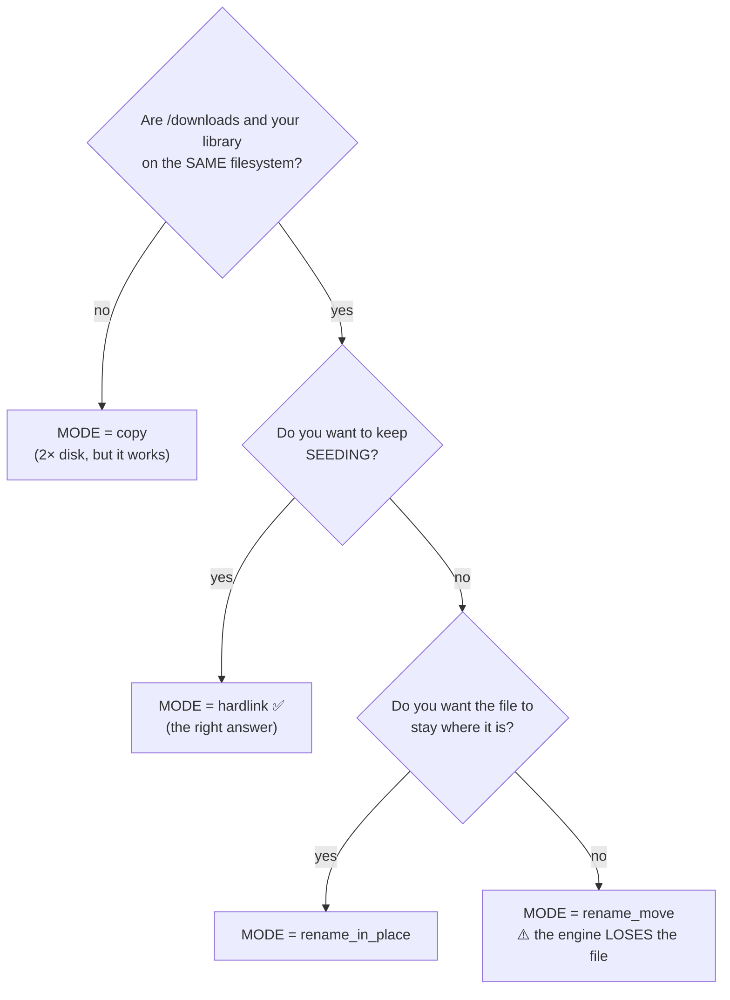

# Building a Movie Library

**Level:** 🔵 Intermediate · **Time:** ~45 minutes

You have downloads. They are named things like
`Some.Movie.2024.2160p.UHD.BluRay.REMUX.DV.HDR.TrueHD.7.1.Atmos-GROUP`. Your media
server hates that. This tutorial turns that folder into a library.

## Overview

```mermaid
flowchart LR
  A["A folder of<br/>scene-named files"] --> B["Create a LIBRARY<br/>kind · preset · mode"]
  B --> C["SCAN<br/>discover files"]
  C --> D["IDENTIFY<br/>parse title / year"]
  D --> E["METADATA<br/>TMDB / IMDb / NFO"]
  E --> F["PREVIEW the rename<br/>(touches nothing)"]
  F --> G["Switch to HARDLINK<br/>and apply"]
  G --> H["ARTWORK · SUBTITLES · NFO"]
  H --> I["A clean library<br/>your server understands"]
```



## Purpose

To build a movie library that:

- Names every file the way Plex/Jellyfin/Emby expects.
- Keeps seeding, because it hardlinks instead of moving.
- Enriches itself with metadata, posters and NFO sidecars.
- Tells you which items it could **not** identify, instead of silently guessing.
- Organises **future** downloads automatically, with no further work from you.

## When to use this tutorial

| Use it when… | Use something else when… |
| --- | --- |
| You have downloads and want them organised. | You want TV series → [Automating TV shows](/learn/tutorials/automating-tv-shows). |
| Your media server shows garbage titles. | You want to *acquire* movies, not organise them → [Smart RSS rules](/learn/tutorials/smart-rss-rules). |
| You want future downloads organised automatically. | You just want one download to work → [My First Download](/learn/first-download). |

## Prerequisites

- [ ] A running stack ([Quick Start](/learn/quick-start)).
- [ ] At least one **completed download** to practise on.
- [ ] The `media_manager` module **enabled** (it is, by default — check **Administration → Modules**).
- [ ] Permissions: `media_manager.manage_libraries`, `media_manager.scan`, `media_manager.rename`, `media_manager.move_files`.
- [ ] **10 minutes of thinking about your folder layout** before you touch anything. This matters more than any setting.

:::danger Decide your filesystem layout first
Two things depend on it and both are painful to change later:

1. **Hardlinks cannot cross filesystems.** Your downloads and your library must be
   on the **same** volume/mount, or hardlinking will fail and you will be forced to
   `copy` (2× the disk).
2. **The post-download pipeline is opt-in by path.** It organises a completed
   torrent **only** when an *enabled library's root path contains that torrent's
   save path*.

A layout that satisfies both, from day one:

```text
/downloads                 ← FILE_MANAGER_ROOTS (one volume)
├── movies/                ← the Movies library points HERE
├── tv/                    ← the TV library points here
└── unsorted/              ← no library — never auto-organised
```
:::

## Concepts

| Term | Meaning |
| --- | --- |
| **Library** | A folder + its `kind`, naming `preset`, `template`, rename `mode` and scan interval. |
| **Kind** | `movie` / `tv` / `anime` / `music` / `audiobook` / `general`. **Authoritative** over the filename. |
| **Media item** | One title in a library, with a `matchStatus` of `unmatched` / `matched` / `manual`. |
| **Identification** | Parsing the release name into type/title/year/season/episode with a confidence score. |
| **Rename mode** | `preview` · `rename_in_place` · `rename_move` · `copy` · `hardlink` (default) · `symlink`. |
| **NFO** | A Kodi-style XML sidecar that media servers read. |

---

## Step-by-step

### Step 1 — Choose your naming preset

Go to **Media Management → Libraries** (`/media/libraries`).

Before creating anything, decide the **preset**, because it fills the naming
template for you:

| Preset | Choose it if your media server is… |
| --- | --- |
| `plex` | Plex |
| `jellyfin` | Jellyfin |
| `emby` | Emby |
| `kodi` | Kodi |
| `custom` | Something else, or you want full control of the template |

**Expected result:** you know which preset you want. If you are unsure, pick the
one matching the server you actually run.

---

### Step 2 — Create the library, in `preview` mode

Click **Add library** and fill it in:

| Field | Value | Why |
| --- | --- | --- |
| **Name** | `Movies` | Yours. |
| **Path** | `/downloads/movies` | Must be inside `FILE_MANAGER_ROOTS`. The picker will offer to create it. |
| **Kind** | `movie` | This is authoritative — it stops a folder like `9-1-1 (2018)` being mis-read. |
| **Preset** | `plex` (or yours) | Supplies the template. |
| **Mode** | **`preview`** | **Start here. It touches nothing.** |
| **Template** | *(blank)* | The preset fills it in. Override later if you want. |
| **Scan interval** | *(blank for now)* | Blank or `0` = manual scans only. |
| **Enabled** | on | A disabled library is never scanned or auto-organised. |

Save.

**Expected result:** the library appears in the list with three badges — its
**kind**, its **preset**, and its **mode**. The path is shown in monospace beneath
the name.


:::warning A library cannot live outside the hard roots
`FILE_MANAGER_ROOTS` (default `/downloads`) is a hard boundary enforced after
canonicalisation. Traversal, symlink-escape and absolute-escape are all rejected.
If you need a library elsewhere, add that path to `FILE_MANAGER_ROOTS` and restart
the backend — do not try to trick it.
:::

---

### Step 3 — Scan it

Click **Scan** on the library.

Scanning walks the folder tree, discovers media files, and creates one **media
item** per title. It runs as a **background job** — it does not block the UI, and
its progress streams over WebSocket.

**Expected result:** go to **Media Management → Media Items** (`/media/items`).
You should see one item per movie found.


---

### Step 4 — Check what it could *not* identify

This is the step everyone skips and then complains about.

Go to **Media Management → Unmatched Media** (`/media/unmatched`).

Identification parses the release name into type/title/year with a **confidence
score**, and sets a `matchStatus`:

| `matchStatus` | Meaning | What to do |
| --- | --- | --- |
| `matched` | Identified automatically. | Nothing. |
| `manual` | You corrected it by hand. | Nothing. |
| `unmatched` | The name did not parse confidently. | **Fix it here.** |

Match each unmatched item by hand. Once matched, everything downstream —
metadata, artwork, renaming, duplicate detection, missing-episode ownership —
starts working for it.

**Expected result:** the unmatched list is empty, or contains only genuinely
unidentifiable junk.

:::danger Unmatched items poison everything downstream
An unidentified item has no title, no year and no external IDs. It cannot be
renamed correctly, it will not be counted as *owned* by Missing Episodes (so you
will be told you are missing things you actually have), and it will not
deduplicate. **Clear the unmatched list before you trust any other number.**
:::


---

### Step 5 — Turn on metadata

Go to **Media Management → Media Settings** (`/media/settings`). This page hosts
Metadata Providers, Artwork preferences, Subtitle preferences, NFO tooling and
Media Server Integrations.

Metadata comes from providers, tried in order:

| Provider | Source | Needs |
| --- | --- | --- |
| **local** | NFO sidecars already next to your files | Nothing. Always available. |
| **tmdb** | The Movie Database | A TMDB API key. |
| **imdb** | **User-provided IMDb datasets** and/or a **licensed IMDb API** | Configured on **Media → Settings → IMDb** (`/media/settings/imdb`). |

Set a TMDB key if you have one — it is the highest-confidence source, and it is
also what powers TV show airing-status awareness later.

:::info UltraTorrent does not scrape IMDb
The IMDb provider works from **user-provided datasets** and/or a **licensed IMDb
API**. It never scrapes IMDb web pages. Dataset import is confined to the hard
roots and the API key is AES-GCM encrypted at rest. See `/media/settings/imdb`.
:::

**Expected result:** your media items gain overviews, genres, cast and external IDs
(tmdb/tvdb/imdb/omdb/anilist).


---

### Step 6 — Preview the rename. Read it. Actually read it.

Go to **Media Management → Rename Engine** (`/media/rename-preview`).

This builds the complete rename plan — every source path, every destination path —
and **changes absolutely nothing**. Every path segment is sanitized.

Read every line. Ask yourself:

- Is the **title** right?
- Is the **year** right?
- Is the destination inside the library, where you expect?
- Are there any obviously wrong parses? (Go back to Step 4.)

**Expected result:** a plan you would be happy to execute.


:::tip The template is token-based
The preset gives you a sensible default, but you can write your own with tokens
(title, year, resolution, source, edition, and so on). The rename page has a token
help panel. Every segment is sanitized, so you cannot template your way outside the
hard roots.
:::

---

### Step 7 — Choose your mode with your eyes open

Now the important decision.



| Mode | Extra disk | Seeding survives | Verdict |
| --- | --- | --- | --- |
| `preview` | — | — | Where you start. |
| **`hardlink`** *(default)* | **None** | ✅ | **What you want.** Same bytes, two names. |
| `copy` | 2× | ✅ | When the two paths are on different filesystems. |
| `symlink` | None | ✅ | A pointer. Some servers/containers do not follow symlinks across mounts. |
| `rename_in_place` | None | ⚠️ | Renames where it already is. |
| `rename_move` | None | ❌ | The engine loses the file. Only if you do not seed. |

Edit the library, change **Mode** to `hardlink`, save, and apply the rename.

**Expected result:** the file now exists at a clean path
(`/downloads/movies/Some Movie (2024)/Some Movie (2024).mkv`) **and** the torrent is
still seeding — because a hardlink is two directory entries pointing at the same
bytes.

Verify both facts:

```bash
# One inode, two names, one copy of the data.
docker compose exec backend \
  find /downloads -samefile "/downloads/movies/Some Movie (2024)/Some Movie (2024).mkv"
```

You should see **two** paths listed. That is the whole trick.

:::danger "Invalid cross-device link"
That error means `/downloads` and your library are on different filesystems.
Hardlinks are two names for one inode, and an inode belongs to exactly one
filesystem. Either restructure your mounts onto one volume (best), or set the mode
to `copy` and accept the double disk usage.
:::

---

### Step 8 — Artwork, subtitles and NFO

Once items are matched, the enrichment stages can run:

| Stage | What it does | Where to see it |
| --- | --- | --- |
| **Artwork** | Downloads typed artwork (poster, fanart, logo, clearart, banner, thumbnail) via the artwork provider, into the hard roots, through the same magic-byte + size validation as uploads. | The media item detail page. |
| **Subtitles** | Sidecar discovery with language/forced/SDH flags, plus missing-language detection. | The media item detail page. |
| **NFO** | Writes Kodi-style movie/tvshow/season/episode sidecars — inside the hard roots only. | Next to the media file. |

:::info Custom uploads win
If you upload your own poster, it keeps **selection precedence** over auto-imported
art. UltraTorrent will not overwrite your choice.
:::

:::caution Remote subtitle download is not shipped yet
Sidecar **discovery** ships today (it finds the `.srt` files you already have and
tells you which languages are missing). Downloading subtitles from a remote provider
such as OpenSubtitles is **planned**, not present.
:::

---

### Step 9 — Clean up duplicates

Go to **Media Management → Duplicates** (`/media/duplicates`).

Duplicate groups are formed by reason:

- Same title + year
- Same show + season + episode
- Same external ID
- Same file hash
- Similar filename

Review each group and keep the one you want.

**Expected result:** one copy of each movie, at the quality you chose.


---

### Step 10 — Make it automatic, forever

Two switches, and you never do any of this by hand again.

**A. Future downloads organise themselves.**
Already done — as long as the torrent's **save path is inside the library's root**.
So when you add a movie torrent, set its save path to `/downloads/movies`. The
`torrent.completed` event runs the whole pipeline: scan → identify → metadata →
rename/hardlink → artwork → subtitles → NFO → media-server refresh.

**B. Files you drop in by hand get enriched too.**
Edit the library and set a **scan interval** (e.g. `360` minutes). A cheap 5-minute
tick picks up any library whose scan is **due** and enriches it.

:::warning The periodic scan behaves differently on purpose
It carries **no torrent context**, so it fires **no `media.*` automation triggers**,
and it **never renames or moves files** — it enriches *in place*. Renaming stays the
download organiser's job. It fills only the gaps (identity, metadata, poster) that
are actually missing, so steady-state scans do almost no work.

A blank or zero scan interval means **manual scans only** — that library is never
auto-scanned.
:::

**Expected result:** you stop visiting these pages, which is the goal.

---

### Step 11 — Check library health

Go to **Media Management → Media Dashboard** (`/media`).

It surfaces:

- Unmatched items
- Missing artwork
- Missing subtitles
- Duplicates

Aim for zeroes. That is a healthy library.


:::tip Watch this tutorial
_Video coming soon._
:::

---

## Examples

### A three-library layout that scales

| Library | Path | Kind | Preset | Mode | Scan interval |
| --- | --- | --- | --- | --- | --- |
| Movies | `/downloads/movies` | `movie` | `plex` | `hardlink` | `720` |
| TV | `/downloads/tv` | `tv` | `plex` | `hardlink` | `360` |
| Anime | `/downloads/anime` | `anime` | `plex` | `hardlink` | `360` |

Nothing points at `/downloads/unsorted`, so nothing there is ever touched.

### Verifying a hardlink actually happened

```bash
docker compose exec backend stat -c '%h %i %n' \
  "/downloads/movies/Some Movie (2024)/Some Movie (2024).mkv"
```

A link count (`%h`) of **2** or more means the hardlink worked. A count of `1`
means you copied or moved.

---

## Troubleshooting

| Symptom | Cause | Fix |
| --- | --- | --- |
| Scan finds nothing | Wrong path, empty folder, or the library is disabled. | Check the path in the **File Manager** (`/files`) and that **Enabled** is on. |
| Everything is `unmatched` | Release names are unconventional or the files are loose. | Match manually on `/media/unmatched`; improve source naming going forward. |
| A movie was detected as a TV show | You used a `general` library. | Set the library's **kind** to `movie` — kind is authoritative; only `general` guesses from the filename. |
| Rename produced a weird path | The parsed title or year is wrong. | Fix the item's identification first, then re-preview. |
| "Invalid cross-device link" | Downloads and library are on different filesystems. | Use `copy`, or unify the mounts. |
| Renamed, but the torrent errored | You used `rename_move` and the engine lost the file. | Switch to `hardlink`. **Recheck** the torrent, or re-add it. |
| Downloads are never auto-organised | The save path is not inside an **enabled** library's root. | Set the torrent's save path correctly, or move the library root. |
| Files created as `root` | The engine ran as root. | Set `PUID`/`PGID` in `.env` to the owning user (`id someuser`) and recreate the engine container. |
| No artwork appears | No metadata provider configured, or the item is unmatched. | Set a TMDB key in `/media/settings`; clear the unmatched list. |
| Plex still shows the old name | Plex has not rescanned. | Configure a media-server integration so refreshes are pushed automatically → [Integrating Plex/Jellyfin](/learn/tutorials/integrating-plex-jellyfin). |

---

## Tips

:::tip Always start a new library in `preview`
It costs you nothing and it has saved everyone who has ever used it at least once.
:::

:::tip Fix identification before you fix anything else
Metadata, artwork, renaming, duplicates and missing-episode ownership all read from
the parsed identity. Get that right and the rest falls out for free.
:::

:::tip Set the save path when you add the torrent
It is the single field that decides whether the whole media pipeline runs. Setting
it takes two seconds; retrofitting it means moving files.
:::

:::info Everything long-running is a job
Scans, metadata, artwork, subtitle scans, rename previews, rename execution, NFO
generation and media-server refresh all run as tracked background jobs with live
progress. Nothing blocks the API.
:::

---

## FAQ

**Do I need TMDB?**
No, but you want it. Without an online provider you get only what local NFO
sidecars already carry. TMDB is also the highest-confidence source for TV airing
status.

**Can I have several libraries pointing at the same folder?**
Don't. One folder, one library, one `kind`. Overlapping roots make "which library
owns this download?" ambiguous.

**What happens if I change the template later?**
Nothing, until you run a rename. Preview it first — a template change can rewrite
your whole library's paths.

**Can I organise files I did not download through UltraTorrent?**
Yes. Drop them in the library folder and either scan manually or set a scan
interval. Remember: the periodic scan **enriches but never renames**.

**Does deleting a media item delete the file?**
Deletion is permission-gated (`media_manager.delete`) and audited. Be deliberate —
and remember that a hardlinked file still exists under its download path.

**Why is my item `manual` instead of `matched`?**
Because you matched it by hand. That is a good thing: manual matches are respected
and not overwritten.

---

## Checklist

### Verification

- [ ] A library exists, **enabled**, with the right **kind** and **preset**.
- [ ] Its path is inside `FILE_MANAGER_ROOTS`.
- [ ] A scan discovered your files and created media items.
- [ ] **`/media/unmatched` is empty.**
- [ ] A metadata provider is configured and items have overviews/IDs.
- [ ] The rename **preview** showed a plan you agreed with.
- [ ] Mode is `hardlink` (or `copy`, if you are cross-filesystem).
- [ ] `find -samefile` shows **two** paths for a renamed file.
- [ ] The original torrent is **still seeding**.
- [ ] `/media/duplicates` is clean.
- [ ] The **Media Dashboard** shows zero (or explained) health issues.

### Expected results

| Screen | Expected |
| --- | --- |
| `/media/libraries` | 1+ libraries, each with kind/preset/mode badges |
| `/media/items` | One item per movie, all `matched` or `manual` |
| `/media/unmatched` | Empty |
| `/media` | Health widgets at or near zero |
| `/torrents` | Still seeding, unharmed |

### Next steps

1. [Automating TV shows](/learn/tutorials/automating-tv-shows) — the same, but for series, plus missing-episode detection.
2. [Integrating Plex / Jellyfin](/learn/tutorials/integrating-plex-jellyfin) — auto-refresh your server after every import.
3. [Smart RSS rules](/learn/tutorials/smart-rss-rules) — fill the library automatically.

---

## See also

- [Media Manager](/modules/media-manager) — the full module reference.
- [Files](/modules/files) — the path-safe file manager and hard roots.
- [Automation](/modules/automation) — the `media.*` triggers each pipeline stage fires.
- [Workflows](/learn/workflows) — Workflow 5 is this pipeline, as a diagram.
- [Core Concepts](/learn/concepts) — hardlink vs copy, libraries, media items.
- [Troubleshooting](/operate/troubleshooting) · [Glossary](/help/glossary)
