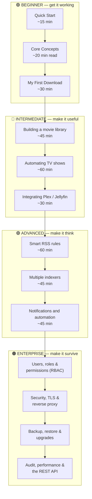
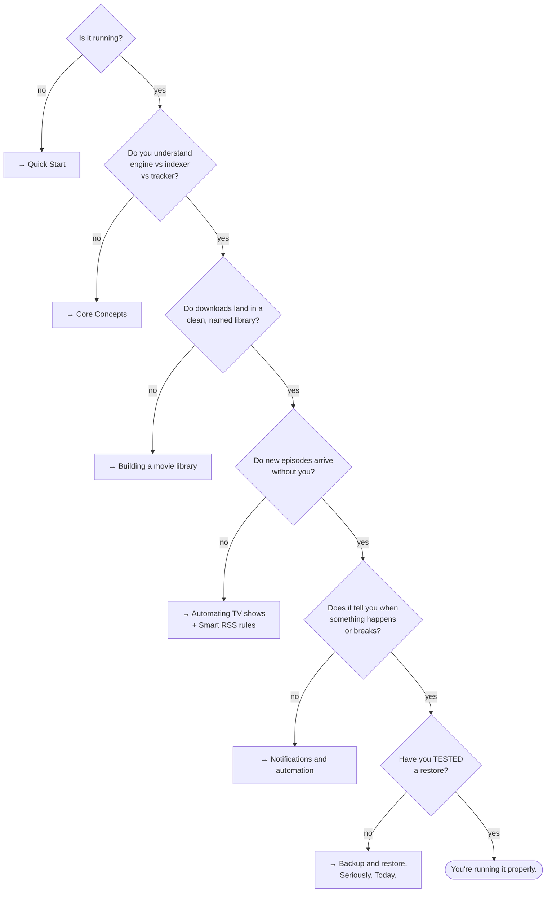

# Tutorials

A path, not a pile. Each tutorial has a prerequisite, a time estimate, and a
concrete thing you will be able to do afterwards.

## Overview

## Purpose

To take you from *"I have never used a torrent client"* to *"I run a multi-user,
audited, automated media platform behind TLS, and I have tested my restore."*

## When to use this page

As your table of contents. Work top to bottom the first time. After that, jump.

## Prerequisites

For the whole path: a Linux/NAS/VM host with Docker, and about four hours spread
over a few sittings. For each individual tutorial: whatever it says.

---

## 🟢 Beginner — get it working

**Goal:** a running install, a completed download, and the vocabulary to read
everything else.

| # | Tutorial | Time | Prerequisite | Afterwards you can… |
| --- | --- | --- | --- | --- |
| 1 | [Quick Start](/learn/quick-start) | ~15 min | Docker installed | Bring up the stack, log in, register an engine, complete a download. |
| 2 | [Core Concepts](/learn/concepts) | ~20 min (read) | None | Explain engine vs indexer vs tracker, the torrent lifecycle, and hardlink vs copy — without hedging. |
| 3 | [My First Download](/learn/first-download) | ~30 min | A running stack + an engine | Add a torrent three different ways, inspect it, verify the bytes, and organise it into a library. |
| 4 | [Architecture Overview](/learn/architecture-overview) | ~15 min (read) | A running stack | Name every container, know what to back up, and trace any download end to end. |

:::tip Do not skip Core Concepts
It is the only page that defines the words. Everything else assumes them. Twenty
minutes here saves hours of confusion later.
:::

---

## 🔵 Intermediate — make it useful

**Goal:** stop touching files by hand. Downloads land, get named properly, and show
up in your media server on their own.

| # | Tutorial | Time | Prerequisite | Afterwards you can… |
| --- | --- | --- | --- | --- |
| 5 | [Building a movie library](/learn/tutorials/building-a-movie-library) | ~45 min | A completed download | Create libraries, understand rename modes, preview safely, and hardlink without breaking seeding. |
| 6 | [Automating TV shows](/learn/tutorials/automating-tv-shows) | ~60 min | A working library | Monitor a series, detect missing episodes, and let UltraTorrent search for and grab them. |
| 7 | [Integrating Plex / Jellyfin / Emby](/learn/tutorials/integrating-plex-jellyfin) | ~30 min | A working library + a media server | Auto-refresh your server after every import, and turn on watch analytics. |

---

## 🟣 Advanced — make it think

**Goal:** stop making decisions. Express your taste once, as policy, and let the
engine apply it consistently.

| # | Tutorial | Time | Prerequisite | Afterwards you can… |
| --- | --- | --- | --- | --- |
| 8 | [Smart RSS rules](/learn/tutorials/smart-rss-rules) | ~60 min | Tutorials 5–6 | Build ranked preference lists, understand three-level dedup, and let rules *upgrade* what you already hold. |
| 9 | [Multiple indexers](/learn/tutorials/multiple-indexers) | ~45 min | An indexer + Prowlarr | Fan searches across many indexers with priority, min-seeders and cross-indexer dedup — and survive Cloudflare. |
| 10 | [Notifications and automation](/learn/tutorials/notifications-and-automation) | ~45 min | Any working flow | Build condition/action rules and rule-driven notifications over Email, Telegram, SMS and WhatsApp. |

:::warning Advanced tutorials can delete data
An RSS *upgrade* removes the superseded torrent **and its data** — deliberately.
An automation rule can delete or move files. Read the whole tutorial before you
enable anything, and keep a backup.
:::

---

## 🟠 Enterprise — make it survive

**Goal:** more than one human, on a real network, with an audit trail and a tested
restore. "Enterprise" here means an **engineering quality bar**, not a product you
buy — every feature is in the one open-source repository, gated only by RBAC.

| # | Topic | Where | Afterwards you can… |
| --- | --- | --- | --- |
| 11 | Users, roles &amp; permissions | [Users](/modules/users) · [Permissions](/reference/permissions) | Give people exactly the access they need, and no more. |
| 12 | Security hardening | [Security](/operate/security) · [Reverse proxy](/install/reverse-proxy) · [TLS](/install/tls) | Run it on a real network without regretting it. |
| 13 | Backup, restore &amp; upgrade | [Backup](/operate/backup) · [Upgrading](/install/upgrading) | Lose the host and not lose the platform. |
| 14 | Audit &amp; performance | [Audit](/modules/audit) · [Performance](/operate/performance) | Answer "who did that?" and "why is it slow?". |
| 15 | Configuration profiles | [Configuration profiles](/operate/configuration-profiles) | Run consistent, reproducible configurations. |
| 16 | Automate against the API | [REST API](/reference/api) | Script anything the UI can do — the SPA is just one client. |

:::info There is no edition to buy
UltraTorrent is a single open-source community product (AGPL-3.0-or-later). Every
module ships here. The only access decision the server ever makes is *"does this
user hold the required permission?"*
:::

---

## The whole path, as a decision tree

:::note Screenshot needed
The **Dashboard** (`/dashboard`) of a mature install — active transfers, recent
acquisitions and library health all populated — as the "this is where you are
going" hero image.
:::

:::tip Watch this tutorial
_Video coming soon._
:::

---

## Examples

### "I have three hours this weekend"

1. [Quick Start](/learn/quick-start) — 15 min
2. [Core Concepts](/learn/concepts) — 20 min
3. [Building a movie library](/learn/tutorials/building-a-movie-library) — 45 min
4. [Automating TV shows](/learn/tutorials/automating-tv-shows) — 60 min
5. [Integrating Plex / Jellyfin](/learn/tutorials/integrating-plex-jellyfin) — 30 min

You will finish with a fully automatic TV pipeline into your media server.

### "I only care about not losing things"

1. [Architecture Overview](/learn/architecture-overview) — what actually holds your data
2. [Backup &amp; restore](/operate/backup) — and then *test the restore*
3. [Security](/operate/security)

---

## Troubleshooting

| Problem | Do this |
| --- | --- |
| A tutorial assumes a term you do not know | It is in [Core Concepts](/learn/concepts) or the [Glossary](/help/glossary). |
| A step's screen does not look like the docs | Check you have the permission for it — the UI hides what you cannot use. See [Permissions](/reference/permissions). |
| A page is missing from your sidebar entirely | Its module is disabled. **Administration → Modules** (`/modules`). |
| Something broke halfway through | [Troubleshooting](/operate/troubleshooting) is organised by symptom. |

---

## Tips

:::tip Do each tutorial on real content you actually want
The tutorials work far better when the show you are automating is a show you
actually watch. You will notice mistakes immediately.
:::

:::tip Enable one thing at a time
Especially in Advanced. If you turn on auto-search, upgrades, automation rules and
notifications in one sitting and something misfires, you will not know which one
did it.
:::

---

## FAQ

**Do I have to do these in order?**
No, but the prerequisites are real. Skipping [Core Concepts](/learn/concepts) is
the one that reliably backfires.

**How long is the whole path?**
Roughly four hours of hands-on work for Beginner → Advanced, plus however long you
spend deciding your quality preferences (which is the fun part).

**Is any of this different if I run on a NAS?**
Only the ports and the `PUID`/`PGID`. `8080` and `9696` are commonly taken on NAS
devices — set `FRONTEND_PORT` and `PROWLARR_PORT`. See [Docker Compose](/install/docker-compose).

**Where is the API documentation?**
[REST API](/reference/api). Every capability is an endpoint — the SPA is just one
client of it.

---

## Checklist

You have completed the path when:

- [ ] The stack is running and you can log in.
- [ ] An engine is registered, default, and connected.
- [ ] At least one indexer passes its **Test**.
- [ ] Downloads land inside a library root and get renamed automatically.
- [ ] Your media server refreshes itself after an import.
- [ ] A monitored series shows an accurate missing-episode count.
- [ ] An RSS rule with a ranked preference list is grabbing (and upgrading).
- [ ] A notification rule reaches you on a channel you actually read.
- [ ] Non-admin users exist, with roles that give them only what they need.
- [ ] The UI is behind TLS.
- [ ] You have taken a backup **and restored it somewhere disposable**.

### Expected result

An install that acquires, organises, publishes and reports on your media without
you touching it — and that you could rebuild from a backup tonight.

### Next steps

Start at the top: [Quick Start](/learn/quick-start).

---

## See also

- [Quick Start](/learn/quick-start) · [Core Concepts](/learn/concepts) · [My First Download](/learn/first-download)
- [Architecture Overview](/learn/architecture-overview) · [Workflows](/learn/workflows)
- [FAQ](/help/faq) · [Glossary](/help/glossary)
