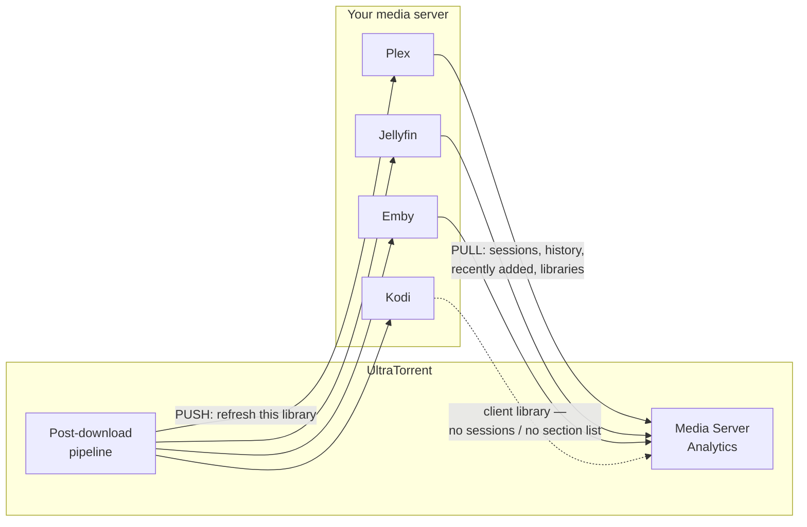
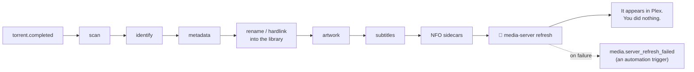

# Integrating Plex, Jellyfin &amp; Emby

**Level:** 🔵 Intermediate · **Time:** ~30 minutes

Two separate things live behind the words "media server integration", and it is
worth knowing which one you are setting up:

| | **Media-server refresh** | **Media Server Analytics** |
| --- | --- | --- |
| **What** | UltraTorrent tells your server "rescan, there is new media". | UltraTorrent reads your server: who is watching what, history, recently added, reports, newsletters. |
| **Where** | **Media Management → Media Settings** (`/media/settings`) | **Media Server Analytics → Server Connections** (`/media-server-analytics/connections`) |
| **Why** | New downloads appear in Plex without you clicking Scan. | You get Tautulli-style insight into your server. |

Both are built on the **same** provider layer and the same encrypted-connection
model. Set up the first; the second is a bonus you should not skip.

## Overview



## Purpose

By the end:

- New media appears in your server **automatically**, correctly named, with a poster.
- You can see **who is watching what, right now**.
- You have **watch history**, **reports** and (optionally) **newsletters**.

## When to use this tutorial

| Use it when… | Use something else when… |
| --- | --- |
| Your server does not see new downloads. | Your downloads are not being renamed at all → [Building a movie library](/learn/tutorials/building-a-movie-library). |
| You want watch analytics. | You want to *acquire* media → [Smart RSS rules](/learn/tutorials/smart-rss-rules). |

## Prerequisites

- [ ] A **working library** whose items are renamed and identified — see [Building a movie library](/learn/tutorials/building-a-movie-library). Do that first; there is no point refreshing a server at a folder full of scene names.
- [ ] A running Plex / Jellyfin / Emby / Kodi that can **see the same files**.
- [ ] Its base URL and an auth token.
- [ ] Permissions: `media_manager.manage_integrations`; for analytics, `media_server_analytics.view` and `media_server_analytics.manage_connections`.

:::danger Both sides must see the same files, at paths each understands
UltraTorrent writes to (say) `/downloads/movies` **inside its container**. Your Plex
container must have the **same media** mounted, and Plex's library must point at
**Plex's** path for it.

They do not have to be the same string — but they must be the same files. If Plex's
library points somewhere else entirely, a refresh will do exactly nothing and you
will blame the integration.
:::

## Concepts

| Term | Meaning |
| --- | --- |
| **Media server provider** | The abstraction behind Plex/Jellyfin/Emby/Kodi. Business logic never touches a vendor client. |
| **Capability set** | What a given server can actually serve: `libraries`, `recentlyAdded`, `sessions`, `watchHistory`, `refresh`. |
| **Refresh** | UltraTorrent pushing "rescan this library" to the server. |
| **Connection** | A stored server: name, type, base URL, encrypted token, enabled/default flags, health, version, platform, capabilities. |

### What each server can do

| Server | Auth | Capabilities |
| --- | --- | --- |
| **Plex** | `X-Plex-Token` | Full capability set |
| **Jellyfin** | `X-Emby-Token` | Full capability set |
| **Emby** | `X-Emby-Token` | Full capability set |
| **Kodi** | JSON-RPC (optional basic auth) | A **client** library — **no** section list, **no** sessions. Declares those capabilities `false`. |

:::info Capabilities degrade gracefully, not noisily
A capability a provider genuinely cannot serve returns a clean, typed
"not supported" result rather than a generic failure. Kodi will not pretend to have
sessions. Analytics simply shows less for that server.
:::

---

## Step-by-step

### Step 1 — Get your server's base URL and token

| Server | Base URL | Token |
| --- | --- | --- |
| **Plex** | `http://plex:32400` (container) or `http://192.168.1.x:32400` | An `X-Plex-Token`. |
| **Jellyfin** | `http://jellyfin:8096` | An API key from Jellyfin's Dashboard → API Keys. |
| **Emby** | `http://emby:8096` | An API key from Emby's dashboard. |
| **Kodi** | `http://kodi:8080/jsonrpc` | Optional basic auth. |

:::warning `localhost` will not work
From inside the UltraTorrent backend container, `localhost` is the backend. Use the
container name (if they share a Docker network) or the host's LAN IP.
:::

**Expected result:** a base URL and a token you can paste.

---

### Step 2 — Add the connection for post-download refreshes

Go to **Media Management → Media Settings** (`/media/settings`). This page hosts
Metadata Providers, Artwork, Subtitle preferences, NFO tooling and **Media Server
Integrations**.

Add your server: **kind**, **base URL**, **token**.

**Test** the connection.

:::info Your token is encrypted at rest
Integration secrets — media-server tokens, keys and passwords — are **AES-GCM
encrypted at rest** and **redacted in API responses**. They are never logged and
never returned to the browser.
:::

**Expected result:** a successful test, and the connection saved.

:::note Screenshot needed
The **Media Settings** page (`/media/settings`), Media Server Integrations section,
showing a configured Plex or Jellyfin connection and a successful Test result.
:::


---

### Step 3 — Make sure your server's library points at the right place

Open **your media server** (not UltraTorrent) and check that the library points at
the same media UltraTorrent is writing.

If UltraTorrent's Movies library is `/downloads/movies` and its container shares a
volume with Plex mounted at `/media/movies`, then Plex's Movies library must point at
`/media/movies`.

**Expected result:** browsing the server's library shows the files UltraTorrent
renamed.

---

### Step 4 — Trigger it, and watch the refresh happen

Download something into a library root (or re-run a scan + rename).

The post-download pipeline ends with a **media-server refresh**:



**Expected result:** the new item appears in your server within a minute or two,
correctly named, with a poster.

:::tip A refresh failure is a trigger, not a dead end
`media.server_refresh_failed` is an automation trigger. Build a rule on it that
notifies you — otherwise a silently broken integration can go unnoticed for weeks.
See [Notifications and automation](/learn/tutorials/notifications-and-automation).
:::

---

### Step 5 — Turn on Media Server Analytics

Now the second half.

Go to **Media Server Analytics → Server Connections**
(`/media-server-analytics/connections`) and add your server here too.

- **Unlimited** connections, including **multiple of the same type** — e.g. "Plex
  Home" **and** "Plex Remote".
- Each stores name, type, base URL, encrypted token, enabled + default flags, health
  status, server version, platform, capabilities and notes.
- Click **Test** — it probes the server and **persists** its health, version, platform
  and capabilities.

**Expected result:** the connection shows healthy, with a detected version and a
capability set.

:::note Screenshot needed
The **Server Connections** page (`/media-server-analytics/connections`) with one or
more media servers, showing health status, detected version/platform, and the
capability badges.
:::


---

### Step 6 — Explore what analytics gives you

| Page | Route | Shows |
| --- | --- | --- |
| **Analytics Dashboard** | `/media-server-analytics` | Server counts, health, connection summaries. |
| **Live Activity** | `/media-server-analytics/live` | Current now-playing sessions. Polled every 30 seconds; you can also reconcile on demand. |
| **Watch History** | `/media-server-analytics/watch-history` | Completed playback. |
| **Recently Added** | `/media-server-analytics/recently-added` | What has landed lately. |
| **Analytics Reports** | `/media-server-analytics/reports` | Usage reporting. |
| **Newsletters** | `/media-server-analytics/newsletters` | "Here's what's new" digests. |
| **Import Analytics** | `/media-server-analytics/import` | Historical analytics import. |

:::caution Tautulli import is a later phase
Tautulli is **not** a media server — it is a historical analytics/newsletter
**import source**, behind a separate import-provider abstraction. The import itself
**lands in a later phase**; do not plan a migration around it yet.
:::

**Expected result:** Live Activity shows a session when you press play on your
server.

:::note Screenshot needed
The **Live Activity** page (`/media-server-analytics/live`) showing a current
now-playing session with poster art and stream details.
:::


---

### Step 7 — Build a notification on what your server does

Now that events flow, wire them up. The Notification Center can route media-server
events like:

- `media_server.user_started_watching` / `user_finished_watching` / `user_paused` / `user_resumed` / `user_stopped`
- `media_server.media_added` / `media_upgraded`
- `media_server.server_online` / `server_offline`
- `media_server.transcode_detected` / `high_bandwidth`
- `media_server.newsletter_sent` / `newsletter_failed`

Go to **Automation → Notification Rules** (`/notifications/rules`) and build one.
A good first rule: **`media_server.server_offline` → notify me**.

**Expected result:** you find out your server is down from a message, not from a
family member.

:::tip Watch this tutorial
_Video coming soon._
:::

---

## Examples

### Two Plex servers, one UltraTorrent

| Connection | Type | Base URL | Default |
| --- | --- | --- | --- |
| Plex Home | `plex` | `http://plex:32400` | ✅ |
| Plex Remote | `plex` | `https://plex.example.com` | |

Multiple connections of the same type are explicitly supported.

### The two integrations, side by side

| | Media Settings (`/media/settings`) | Analytics (`/media-server-analytics/connections`) |
| --- | --- | --- |
| Direction | **Push** — refresh after import | **Pull** — read sessions and history |
| Needed for | New media appearing automatically | Live activity, history, reports, newsletters |
| Set up first? | ✅ Yes | Afterwards |

### A good first notification rule

```text
TRIGGER    media_server.server_offline
ACTIONS    notify → Telegram → me
```

---

## Troubleshooting

| Symptom | Cause | Fix |
| --- | --- | --- |
| Test fails: connection refused | Wrong host. `localhost` from inside the backend container is the backend. | Use the container name or the LAN IP. |
| Test fails: unauthorized | Bad or expired token. | Regenerate it in the server's own UI. |
| Refresh "succeeds" but nothing appears | Your server's library points at different files. | Make the server's library path resolve to the same media. |
| Items appear with wrong titles | The files are badly named — this is not a server problem. | Fix identification and renaming → [Building a movie library](/learn/tutorials/building-a-movie-library). |
| Posters missing in Plex | No artwork fetched, or Plex is using its own agent. | Configure a metadata/artwork provider in `/media/settings`; check Plex's agent settings. |
| Kodi shows no sessions | **Correct.** Kodi is a client library — it declares `sessions` and section-list as unsupported. | Nothing to fix. Use Plex/Jellyfin/Emby for session analytics. |
| Live Activity is empty | Nothing is playing, or the server does not support sessions. | Press play. Check the connection's capability badges. |
| Refresh silently stopped working | Token rotated, or the server moved. | Re-test the connection. Build a rule on `media.server_refresh_failed` so you find out next time. |
| Secrets look like `••••••` | **Correct.** They are encrypted at rest and redacted on read. | Leave the field blank on edit to keep the stored value. |

---

## Tips

:::tip Fix your naming before you blame your server
90% of "Plex shows the wrong thing" is a naming problem, not an integration problem.
The library's **preset** (`plex`/`jellyfin`/`emby`/`kodi`) exists precisely to name
files the way your server expects.
:::

:::tip NFO sidecars help servers that read them
UltraTorrent generates Kodi-style movie/tvshow/season/episode NFO sidecars as the
last enrichment stage, inside the hard roots only. Servers that read them get better
metadata for free. Servers that ignore them are unharmed.
:::

:::warning Do not point two writers at one library
If Plex's own agent is renaming/moving files while UltraTorrent's rename engine is
also managing them, you will get a fight. Let UltraTorrent own the filesystem; let
the server read it.
:::

:::info Analytics is capability-aware
Ask a server for something it cannot do and you get a clean "unsupported" answer,
not an error. That is why Kodi appears with fewer panels rather than a broken one.
:::

---

## FAQ

**Do I need Plex at all?**
No. UltraTorrent's library is a filesystem; any server can read it. The integration
just saves you clicking Scan.

**Can I connect more than one server?**
Yes — unlimited connections, including several of the same type.

**Does UltraTorrent replace Tautulli?**
Media Server Analytics covers live activity, watch history, recently-added, reports
and newsletters. Tautulli **import** (bringing your historical data across) is
behind a separate import-provider abstraction and **lands in a later phase**.

**Is my Plex token safe?**
It is AES-256-GCM encrypted at rest, redacted in every API response, and never
logged.

**Why does Kodi show fewer features?**
Because it is a client library, not a server. It genuinely has no session list or
library sections, and it declares those capabilities as `false` rather than
pretending.

**Will UltraTorrent delete things from my server?**
No. The integration pushes **refreshes**. Deletion of media files is a Media Manager
action, permission-gated (`media_manager.delete`) and audited.

---

## Checklist

### Verification

- [ ] My library is renamed and identified **before** I touched the integration.
- [ ] My media server can **see the same files**.
- [ ] A connection exists in **Media Settings** (`/media/settings`) and its **Test** passes.
- [ ] A download into the library root caused the server to refresh **on its own**.
- [ ] The new item appears in the server, correctly named, with a poster.
- [ ] A connection exists in **Server Connections** (`/media-server-analytics/connections`), healthy, with a detected version and capabilities.
- [ ] **Live Activity** shows a session when I press play.
- [ ] **Watch History** is populating.
- [ ] I have a notification rule on `media_server.server_offline`.
- [ ] I have a notification (or automation) rule on `media.server_refresh_failed`.

### Expected results

| Screen | Expected |
| --- | --- |
| `/media/settings` | A media-server integration, Test OK |
| Your media server | New items appearing without manual scans |
| `/media-server-analytics/connections` | Healthy, with version + capabilities |
| `/media-server-analytics/live` | A session when something is playing |
| `/notifications/history` | Delivered messages |

### Next steps

1. [Notifications and automation](/learn/tutorials/notifications-and-automation) — react to everything you just wired up.
2. [Automating TV shows](/learn/tutorials/automating-tv-shows) — fill the library that now refreshes itself.
3. [Media Server Analytics](/modules/media-server-analytics) — the full module reference.

---

## See also

- [Media Server Analytics](/modules/media-server-analytics) · [Media Manager](/modules/media-manager)
- [Notification Center](/modules/notification-center) · [Automation](/modules/automation)
- [Workflows](/learn/workflows) — Workflows 5 and 6.
- [Security](/operate/security) — how integration secrets are protected.
- [Troubleshooting](/operate/troubleshooting) · [Glossary](/help/glossary)
