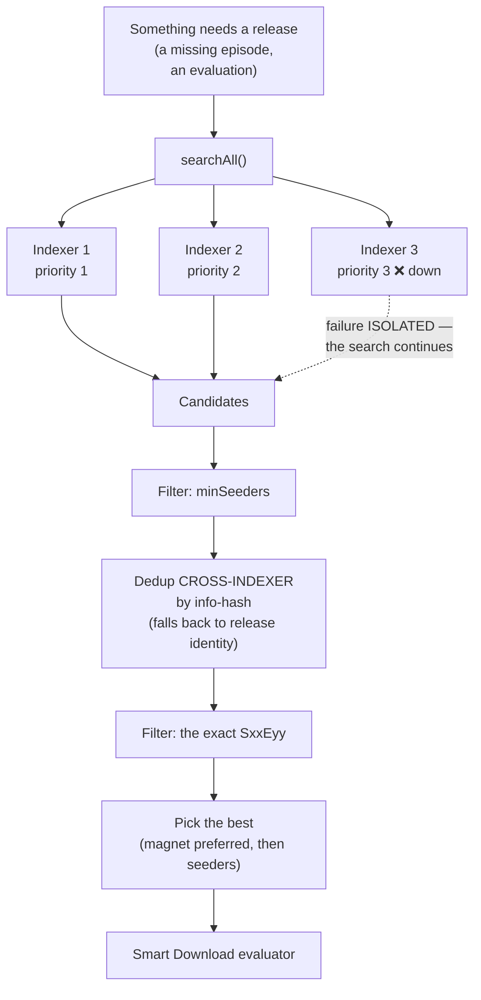
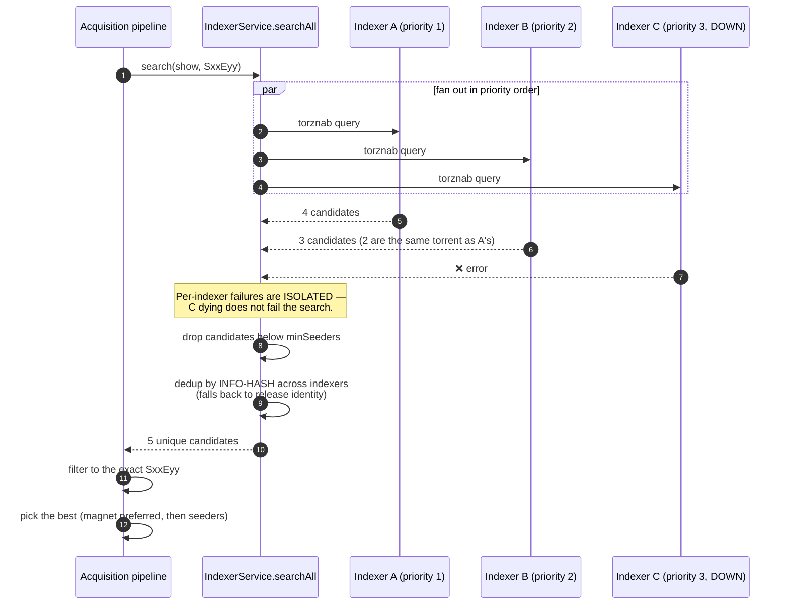
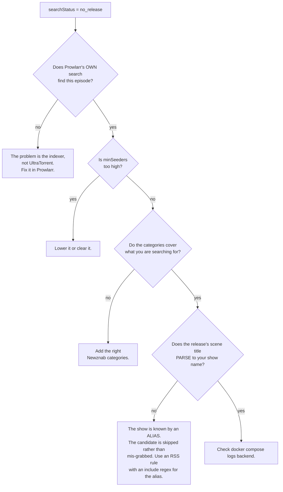

# Working with Multiple Indexers

**Level:** 🟣 Advanced · **Time:** ~45 minutes

One indexer is a single point of failure. Several indexers, ranked and deduplicated,
mean a missing episode gets found even when your favourite tracker is down.

## Overview



## Purpose

To build an indexer setup that is:

- **Resilient** — one dead indexer does not break a search.
- **Ranked** — your best source is tried first and wins ties.
- **Clean** — the same release from three indexers is one candidate, not three.
- **Reachable** — not silently blocked by the SSRF guard or by Cloudflare.

## When to use this tutorial

| Use it when… | Use something else when… |
| --- | --- |
| Missing-episode searches find nothing. | You want to *detect* the gaps → [Automating TV shows](/learn/tutorials/automating-tv-shows). |
| You want more than one source. | You want to tune *quality* → [Smart RSS rules](/learn/tutorials/smart-rss-rules). |
| An indexer is blocked by Cloudflare. | You have no install yet → [Quick Start](/learn/quick-start). |

## Prerequisites

- [ ] A running stack ([Quick Start](/learn/quick-start)).
- [ ] Permissions: `indexers.view`, `indexers.manage`, `indexers.test`.
- [ ] At least one Torznab/Newznab endpoint you are entitled to use.
- [ ] Ideally, the bundled **Prowlarr** companion.

:::info What an indexer is, and is not
An **indexer** is a **Torznab or Newznab search endpoint**. It is *searched* on
demand.

**RSS feeds are not indexers.** They are a different subsystem — polled, pushing
items at your rules. Only Torznab/Newznab endpoints are searchable here.
:::

:::warning There is no "browse indexers" page in UltraTorrent — by design
UltraTorrent's **Search** entry (and `Ctrl+K`) searches the *application's
navigation*, not indexers. Indexer search is **consumed by the acquisition
pipeline** — Missing Episodes' *Search now* / *Search all*, the scheduled
auto-acquire sweep — and is available over the REST API
(`GET /api/indexers/:id/search`, permission `indexers.test`).

To browse and click through results by hand, use **Prowlarr's own UI**. Configuring
indexers here is about giving *automation* something to search.
:::

## Concepts

| Field | Meaning |
| --- | --- |
| `name` | Display name. |
| `implementation` | `torznab` or `newznab`. |
| `baseUrl` | The API base. `/api` is appended if absent. |
| `apiKey` | **AES-256-GCM encrypted at rest.** Never returned by the API — reads show `••••••••`. |
| `enabled` | Whether the search fan-out includes it. |
| `priority` | **Lower is tried first**, and it is the dedup tie-breaker. |
| `categories` | Newznab categories to query. Default `5000,5030,5040` (TV). |
| `minSeeders` | Optional floor. A candidate below it is dropped. |
| `capabilities` | Cached `t=caps` negotiation (tv/movie search, categories, limits). |
| `status` / `lastTestedAt` | The result of the last **Test**. |

---

## Step-by-step

### Step 1 — Bring up Prowlarr (strongly recommended)

Prowlarr is an **indexer manager**. It is a *separate, optional companion container*
— not part of UltraTorrent. UltraTorrent only links to it and searches the Torznab
endpoints it exposes.

```bash
docker compose --profile prowlarr up -d
```

Open it at `http://localhost:9696` (change with `PROWLARR_PORT` if that is taken).
Add your indexers **there**. Prowlarr does the per-site plumbing; UltraTorrent
searches the result.

**Expected result:** Prowlarr is running, with at least one working indexer that
returns results in Prowlarr's own search.

:::tip Prove it in Prowlarr first
If Prowlarr cannot find a release, UltraTorrent will not either. Always debug at the
Prowlarr layer first — it eliminates half the possible causes for free.
:::

---

### Step 2 — Configure the SSRF allow-list *before* you wonder why grabs fail

This step is out of order on purpose. It is the single most common silent failure.

The backend fetches `.torrent` links **server-side**, through an **SSRF guard** that
blocks any URL resolving to a private or internal address. A self-hosted indexer —
Prowlarr, Jackett, anything on your LAN — **is** a private address.

`SSRF_ALLOW_HOSTS` defaults to `prowlarr` so the bundled Prowlarr just works. If you
add your own:

```ini title=".env"
# Comma-separated hostnames, IPs, or IPv4 CIDRs.
# KEEP `prowlarr` if you use the bundled one.
SSRF_ALLOW_HOSTS=prowlarr,indexer.lan,10.0.0.0/24
```

Then `docker compose up -d` to apply it.

:::danger Without this, auto-downloads silently do nothing
Grabs fail with *"Torrent URL resolves to a blocked internal address"* — and because
the failure is inside a background sweep, you may never see it in the UI. You will
just observe that nothing ever downloads.

Set this **before** you turn on auto-acquire, not after two days of confusion.
:::

Leave `SSRF_ALLOW_HOSTS` empty for full SSRF protection **only** if none of your
indexers live on a private IP.

**Expected result:** the value is set, and the backend has been restarted with it.

---

### Step 3 — Add your first indexer to UltraTorrent

**Downloads → Indexers** (`/indexers`) → **Add indexer**.

| Field | Value |
| --- | --- |
| Name | `Prowlarr — YourIndexer` |
| Implementation | `torznab` |
| Base URL | The Torznab feed URL Prowlarr gives you, e.g. `http://prowlarr:9696/1/api` |
| API key | Prowlarr's API key |
| Categories | `5000, 5030, 5040` (TV). Add movie categories if you want movies. |
| Min seeders | e.g. `5` (or blank) |
| Priority | `1` |
| Enabled | on |

**Expected result:** it saves. On reopening the edit dialog, the API key shows a
mask (`••••••••`) — that is correct, and **leaving it blank on edit keeps the stored
key**.

:::info Use the internal hostname, not `localhost`
From inside the backend container, `http://prowlarr:9696` is Prowlarr.
`http://localhost:9696` is the backend itself. This trips up everyone once.
:::


---

### Step 4 — Test it

Click the **Test** button (the flask icon) on the indexer row.

Test performs a `t=caps` **capability negotiation** — it asks the indexer what it can
do (tv-search, movie-search, which categories, what limits). The result is **cached**
on the indexer.

**Expected result:** a green **OK** status badge and a `lastTestedAt` timestamp.

:::info If the indexer does not advertise `tv-search`
The Torznab client **falls back** to a plain query: `t=search&q="Show SxxEyy"`. It
still works, just less precisely. That is why `t=caps` is negotiated and cached
rather than assumed.
:::


---

### Step 5 — Add more, and set priorities deliberately

Repeat Step 3 for each source. Then think about **priority**:

| Priority | Put here |
| --- | --- |
| `1` | Your most reliable, best-quality source. |
| `2` | A good general-purpose source. |
| `3`+ | Long-tail sources you only want as a fallback. |

Priority does two jobs:

1. **Order** — indexers are tried in priority order.
2. **Tie-breaking** — when the same release comes back from several indexers, the
   lower-priority-number indexer's copy wins.

**Expected result:** an ordered list of indexers, each passing its Test.

---

### Step 6 — Understand exactly what `searchAll` does



Key behaviours worth committing to memory:

- **Failures are isolated.** A dead indexer does not fail the search.
- **Both magnet and plain `.torrent` links are accepted.** Magnet is preferred.
- **A missing seeder count is treated as *unknown*, never as zero** — so it does not
  block an otherwise-valid grab.
- **Dedup is cross-indexer, by info-hash**, falling back to release identity.

---

### Step 7 — Tune `minSeeders` and categories

**`minSeeders`** is a floor, applied per indexer. A candidate below it is dropped.

| Value | Effect |
| --- | --- |
| blank | Nothing is dropped for seeder count. |
| `1`–`3` | Excludes genuinely dead torrents. A safe default. |
| `20`+ | Aggressive. Will drop legitimate older releases. **This is the most common reason a search "finds nothing".** |

**Categories** are Newznab category IDs. The default `5000,5030,5040` is TV. If you
want an indexer to serve movie searches too, add the movie categories it advertises
(check the capabilities the **Test** cached).

:::warning A high `minSeeders` will quietly starve your backfill
Old episodes of old shows have few seeders. If your floor is 20, they will never be
found — and the missing-episode page will report `no release` forever, with no
obvious reason. Start at `1` or blank while you are backfilling.
:::

---

### Step 8 — Beat Cloudflare with FlareSolverr

Some indexers sit behind Cloudflare's anti-bot challenge and will simply fail.

```bash
docker compose --profile prowlarr --profile flaresolverr up -d
```

Then, **inside Prowlarr** (not UltraTorrent):

1. Add an **indexer proxy** of type **FlareSolverr** at `http://flaresolverr:8191`.
2. **Tag** the Cloudflare-protected indexers with it.

FlareSolverr is internal-only (no host port) and runs headless Chromium — which is
why the Compose service gives it `shm_size: 256m`, since Docker's default 64 MB
`/dev/shm` makes Chromium crash.

**Expected result:** the previously-failing indexer now returns results in Prowlarr,
and therefore in UltraTorrent.


---

### Step 9 — Prove the whole chain, end to end

Do not wait for a sweep. Force it:

1. Go to **Missing Episodes** (`/media-acquisition/missing-episodes`).
2. Pick a `missing` episode.
3. Click **Search now**.

Watch the `searchStatus` badge: `searching` → `grabbed` / `awaiting approval` /
`no release` / `failed`.

**Expected result:** `grabbed`, and a new torrent on `/torrents`.

If you get `no release`, work backwards:



:::tip Watch this tutorial
_Video coming soon._
:::

---

## Examples

### A three-indexer setup

| Name | Priority | Categories | Min seeders | Why |
| --- | --- | --- | --- | --- |
| Primary (private) | `1` | TV + movies | blank | Best quality, best retention, tried first, wins ties. |
| Secondary (private) | `2` | TV + movies | `1` | Good coverage of what the primary misses. |
| Public fallback | `3` | TV | `3` | Long tail. Higher floor because public torrents rot. |

### Test an indexer from the API

```bash
curl -X POST "http://localhost:8080/api/indexers/$ID/test" \
  -H "Authorization: Bearer $TOKEN"

curl -s "http://localhost:8080/api/indexers/$ID/search?q=Some+Show&season=2&ep=5" \
  -H "Authorization: Bearer $TOKEN"
```

Both require `indexers.test`. See the [API reference](/reference/api).

---

## Troubleshooting

| Symptom | Cause | Fix |
| --- | --- | --- |
| **Test** fails immediately | Wrong base URL, wrong API key, or the indexer is down. | Confirm the URL works in Prowlarr. Use the **internal** hostname (`http://prowlarr:9696`), never `localhost`. |
| Test says "blocked by Cloudflare" | The indexer needs a challenge solver. | Add FlareSolverr and tag the indexer with it **in Prowlarr**. |
| Search returns nothing, ever | `minSeeders` too high, wrong categories, or the indexer genuinely has nothing. | Clear `minSeeders`, check the cached capabilities, and search in Prowlarr directly. |
| Grabs fail: "resolves to a blocked internal address" | The SSRF guard. | Add the host to `SSRF_ALLOW_HOSTS` — **and keep `prowlarr`**. |
| The same release is grabbed twice | Should not happen — dedup is by info-hash cross-indexer. | If it does, the release identity did not parse. Check the release name. |
| Everything is slow | Too many indexers, or one is timing out. | Failures are isolated, but a slow indexer still costs latency. Disable it. |
| API key disappeared from the edit form | It did not — it is masked. | Leaving it blank on edit **keeps** the stored key. Only type in it to change it. |
| I can find it in Prowlarr but not via Search now | The candidate did not survive the exact-`SxxEyy` filter, or the scene title does not parse to the show name. | See the flowchart in Step 9. |

---

## Tips

:::tip One dead indexer is fine. That is the point.
`searchAll` isolates per-indexer failures. Add the long-tail source — the worst it
can do is be slow.
:::

:::warning Some indexers rate-limit or ban aggressive searching
`maxSearchesPerSweep` (default `50`) and `searchIntervalMinutes` (default `60`) exist
to protect you. Do not raise them because a backfill feels slow.
:::

:::info Your keys are safe
Indexer API keys are AES-256-GCM encrypted at rest (via `SecretCipher`), redacted on
every read, injected into the `apikey=` query parameter server-side — and the request
URL, which carries the key, is **never logged**.
:::

:::tip Prowlarr is optional
You can point UltraTorrent at a Jackett Torznab URL, or at any Torznab/Newznab
endpoint directly. Prowlarr is just the most convenient manager.
:::

---

## FAQ

**Do I need Prowlarr?**
No. Any Torznab/Newznab endpoint works — Jackett, or an indexer's native Torznab
API. Prowlarr is a convenience layer that manages many indexers behind one interface.

**Is Prowlarr part of UltraTorrent?**
No. It is a **separate optional companion container**. UltraTorrent links to it (and
can show an "Open Prowlarr" shortcut in the nav when the integration is enabled and
you hold `integrations.prowlarr.open`), and searches its endpoints. UltraTorrent
boots fine without it.

**Why is there no search page in UltraTorrent?**
Because indexer search here exists to serve **automation**, not manual browsing.
Missing Episodes searches, the auto-acquire sweep, and the REST API all use it. For
manual browse-and-click, use Prowlarr's UI.

**Can indexers search for movies?**
The indexer subsystem can query whatever categories you configure. But **automatic**
missing-media search is **episode-only** today — `WantedMovie` rows carry the same
grab-state columns, but there is no automatic movie search yet.

**What if two indexers return the same torrent?**
It is deduplicated by info-hash, and priority breaks the tie.

**Will it prefer a magnet or a `.torrent`?**
Magnet, when both are available. Both are accepted.

---

## Checklist

### Verification

- [ ] Prowlarr (or your indexer source) returns results **in its own UI**.
- [ ] `SSRF_ALLOW_HOSTS` includes every private-IP indexer host — **and still includes `prowlarr`**.
- [ ] Each indexer is added in `/indexers` with the **internal** hostname.
- [ ] Every indexer passes **Test** with an OK badge and a `lastTestedAt`.
- [ ] Priorities are set deliberately (lowest number = best source).
- [ ] `minSeeders` is low or blank while backfilling.
- [ ] Categories cover what you actually search for.
- [ ] FlareSolverr is running **and tagged in Prowlarr** if any indexer needs it.
- [ ] A **Search now** on a missing episode reached `grabbed`.
- [ ] That grab appeared on `/torrents` and downloaded.

### Expected results

| Screen | Expected |
| --- | --- |
| `/indexers` | 2+ indexers, all OK, in a deliberate priority order |
| Prowlarr UI | Its own search returns results |
| `/media-acquisition/missing-episodes` | **Search now** → `grabbed` |
| `/torrents` | The grabbed episode, downloading |

### Next steps

1. [Automating TV shows](/learn/tutorials/automating-tv-shows) — turn on the sweep now that search works.
2. [Smart RSS rules](/learn/tutorials/smart-rss-rules) — decide *which* of those candidates you actually want.
3. [Notifications and automation](/learn/tutorials/notifications-and-automation) — get told when an indexer goes down.

---

## See also

- [Indexers](/modules/indexers) — the full module reference.
- [Prowlarr](/modules/prowlarr) — the companion integration.
- [Smart Download](/modules/smart-download) — what consumes these search results.
- [Missing Episodes](/modules/missing-episodes) — what triggers the searches.
- [Environment variables](/reference/environment) — `SSRF_ALLOW_HOSTS`, `PROWLARR_*`, `FLARESOLVERR_*`.
- [Security](/operate/security) — why the SSRF guard exists.
- [Troubleshooting](/operate/troubleshooting) · [Glossary](/help/glossary)
