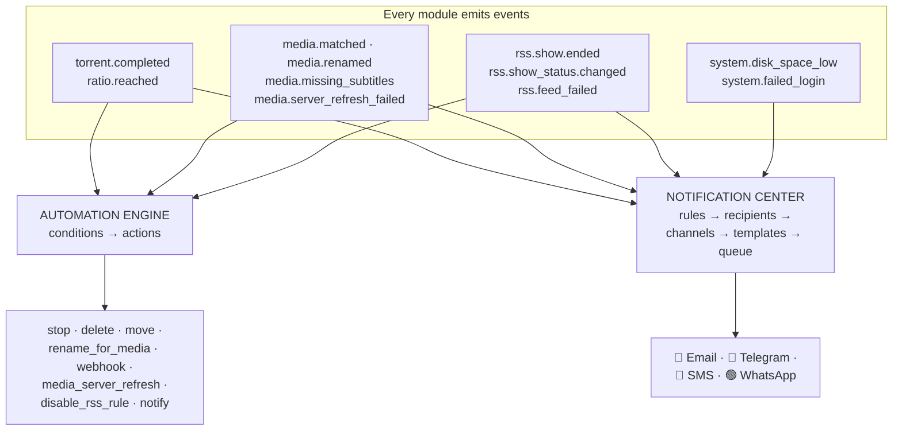
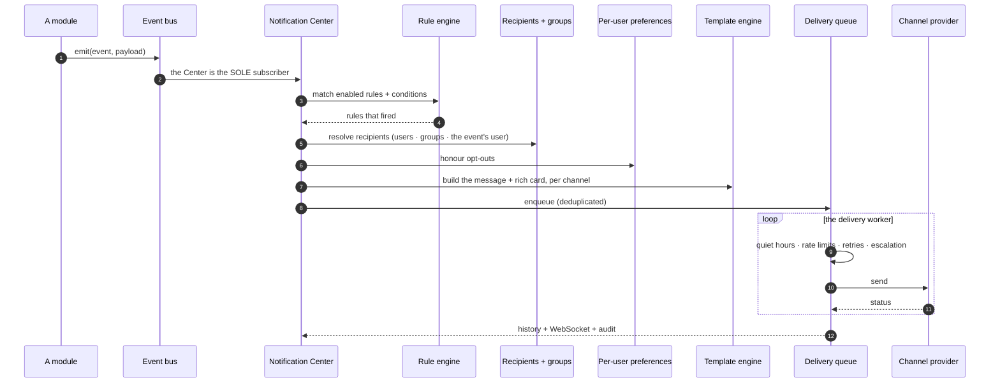

# Notifications &amp; Automation

**Level:** 🟣 Advanced · **Time:** ~45 minutes

Two systems, often confused, that work on the same events:

| | **Automation** | **Notification Center** |
| --- | --- | --- |
| **Answers** | *"When X happens, **do** Y."* | *"When X happens, **tell** whom, how, and when?"* |
| **Actions** | Stop, delete, move, rename, refresh a server, disable an RSS rule, call a webhook… | Deliver a message over Email / Telegram / SMS / WhatsApp. |
| **Where** | **Automation → Automation Rules** (`/automation`) | **Automation → Notification Center** (`/notifications`) |

Automation *acts*. The Notification Center *tells*. Both are rule-driven; nothing in
either is hardcoded.

## Overview



## Purpose

To build:

- A notification that reaches you on a channel you actually read.
- An automation rule that does the boring thing for you.
- Confidence about **why** something did or did not fire.

## When to use this tutorial

| Use it when… | Use something else when… |
| --- | --- |
| You want to be told when downloads finish or break. | You want to *choose* what to download → [Smart RSS rules](/learn/tutorials/smart-rss-rules). |
| You want ratio-based seeding cleanup. | You want to organise files → [Building a movie library](/learn/tutorials/building-a-movie-library). |
| You want to react when a show ends. | — |

## Prerequisites

- [ ] A working install with at least one flow producing events ([Quick Start](/learn/quick-start)).
- [ ] The `notification_center` module enabled.
- [ ] Permissions: `notifications.*` and `automation.*` (see [Permissions](/reference/permissions)).
- [ ] For a channel: SMTP credentials, or a Telegram bot token, or a Twilio account.

## Concepts

| Term | Meaning |
| --- | --- |
| **Event** | Something that happened. Modules publish an envelope onto an internal event bus. |
| **Automation rule** | Trigger + conditions + actions. It **does** something. |
| **Notification rule** | Event + conditions → recipients → channels. It **tells** someone. |
| **Channel** | A configured provider instance: an SMTP server, a Telegram bot, a Twilio number. |
| **Recipient** | Who gets it. Users, groups, or "the user this event is about". |
| **Template** | How the message is rendered, per channel. |
| **Quiet hours** | When *not* to deliver. Enforced by the delivery worker. |

---

## Part 1 — Notifications

### Step 1 — Configure a channel

**Automation → Notification Channels** (`/notifications/channels`) → add one.

| Channel | Backend | What it renders |
| --- | --- | --- |
| **Email** | SMTP (nodemailer) | A responsive HTML card — poster, badges, buttons — plus plain text. |
| **Telegram** | Bot API | Photo + Markdown caption + inline-keyboard buttons. |
| **SMS** | Twilio Messaging API | Concise plain text. |
| **WhatsApp** | Twilio WhatsApp | Rich text + poster media. |

Start with **Telegram** if you want the fastest possible win: create a bot with
BotFather, paste the token, and you are done in two minutes.

Test the channel.

:::info Secrets are encrypted
Config fields marked as secrets (SMTP password, bot token, Twilio auth token) are
**automatically encrypted at rest** and redacted on read. Leaving a secret field
blank on edit keeps the stored value.
:::

**Expected result:** the channel tests successfully.

:::note Screenshot needed
The **Notification Channels** page (`/notifications/channels`) with an Email or
Telegram channel configured and a successful test result.
:::


---

### Step 2 — Add a recipient

**Automation → Notification Recipients** (`/notifications/recipients`).

A recipient is an address on a channel — an email address, a Telegram chat ID, a
phone number. The provider validates and normalizes it for you.

**Expected result:** at least one recipient, on the channel you configured.

---

### Step 3 — Build your first notification rule

**Automation → Notification Rules** (`/notifications/rules`) → add a rule.

A rule is: **event** → **conditions** → **channels** → **recipients**.

Start with the most useful one:

```text
EVENT       download.torrent_completed
CONDITIONS  (none)
CHANNELS    Telegram
RECIPIENTS  me
```

**Expected result:** the next completed download messages you.

:::note Screenshot needed
The **Notification Rules** page (`/notifications/rules`) with a rule open, showing
the event selector, the conditions builder, the channel picker and the recipients.
:::


---

### Step 4 — Know what you can build rules on

The event vocabulary, by area:

| Area | Events |
| --- | --- |
| **Downloads** | `download.torrent_added` · `torrent_started` · `torrent_completed` · `torrent_failed` · `stalled` · `ratio_reached` · `category_changed` |
| **RSS** | `rss.feed_failed` · `rule_matched` · `candidate_approved` · `candidate_rejected` · `inactive_series_warning` · `new_episode_available` |
| **Media** | `media.metadata_match_failed` · `missing_artwork` · `missing_subtitles` · `renamed` · `processing_completed` · `processing_failed` · `duplicate` · `missing_episode_filled` · `library_scan_completed` |
| **Media servers** | `media_server.user_started_watching` · `user_finished_watching` · `user_paused` · `user_resumed` · `user_stopped` · `media_added` · `media_upgraded` · `server_online` · `server_offline` · `transcode_detected` · `high_bandwidth` · `newsletter_sent` · `newsletter_failed` |
| **System** | `system.disk_space_low` · `cpu_high` · `memory_high` · `provider_offline` · `backup_failed` · `database_error` · `update_available` · `security_alert` · `failed_login` · `new_login` · `api_key_created` · `settings_changed` |

:::tip The five rules everyone should have
1. `download.torrent_failed` → tell me.
2. `rss.feed_failed` → tell me. **A silently dead feed is invisible otherwise.**
3. `system.disk_space_low` → tell me. Loudly.
4. `system.failed_login` → tell me. Every time.
5. `media.server_refresh_failed` → tell me, or your library quietly stops updating.

Notice these are all **failures**. Success is boring; failure is what you need to
know about.
:::

---

### Step 5 — Understand the delivery pipeline



Every one of those stages is a place a notification can legitimately *not* arrive —
which is why **Delivery History** exists.

---

### Step 6 — Verify with Delivery History

**Automation → Delivery History** (`/notifications/history`).

Before you conclude "the rule did not fire", check here. It will tell you whether the
message was queued, sent, retried, escalated or failed — and why.

**Expected result:** a delivered row for the notification you triggered.

:::note Screenshot needed
The **Delivery History** page (`/notifications/history`) showing delivered, retried
and failed notifications with their statuses and timestamps.
:::


---

## Part 2 — Automation

### Step 7 — Learn the trigger/action vocabulary

**Automation → Automation Rules** (`/automation`).

A rule is **trigger** → **conditions** → **actions**.

**Torrent triggers**

| Trigger | Fires when |
| --- | --- |
| `torrent.completed` | Progress crosses 100%. |
| `ratio.reached` | The torrent hits a ratio target. |

**Torrent actions:** stop · delete · move · notify · webhook · `rename_for_media`.

**Media Manager triggers**

`media.detected` · `media.matched` · `media.unmatched` · `media.missing_artwork` ·
`media.missing_subtitles` · `media.rename_completed` · `media.server_refresh_failed`

**Media Manager actions**

`media_scan_library` · `media_match` · `media_fetch_metadata` · `media_fetch_artwork` ·
`media_generate_nfo` · `media_rename` · `media_move` · `media_notify` ·
`media_server_refresh`

**RSS show-status triggers**

`rss.rule.created_for_inactive_show` · `rss.show_status.changed` ·
`rss.show.became_active` · `rss.show.ended` · `rss.show.canceled`

**RSS show-status actions**

`refresh_rss_show_status` · `disable_rss_rule` · `convert_rule_to_backfill` (turns off
auto-download — keeps the rule, stops forward grabbing) · `notify_admin`

:::warning Event-context rules only permit event-safe actions
RSS show-status triggers run through a separate **event-context** path: conditions are
matched against a plain event object, and **only event-safe actions** are permitted
(notify / webhook + the delegated `rss_*` actions). A torrent engine action on an RSS
trigger will **error out per rule**. That is a guardrail, not a bug.
:::

:::info The full catalogue is an API call away
`GET /api/automation/catalog` returns every trigger and action the engine knows
about. See the [API reference](/reference/api).
:::

---

### Step 8 — Build a ratio-based cleanup rule

The classic:

```text
TRIGGER     ratio.reached
CONDITIONS  ratio >= 2.0
            category == "movies"
ACTIONS     stop
            notify
```

**Expected result:** torrents in that category stop seeding once they have given back
twice what they took, and you are told.

:::danger Actions can delete data
`delete` and `move` are real. Test a rule with `notify` **only** first, confirm it
fires on exactly the torrents you expect, and only then swap in the destructive
action.
:::

---

### Step 9 — Build a "the show ended" rule

The one that stops your rules quietly wasting polling forever:

```text
TRIGGER     rss.show.ended
CONDITIONS  (none)
ACTIONS     convert_rule_to_backfill
            notify_admin
```

`convert_rule_to_backfill` turns off `autoDownload` — keeping the rule (so it still
records matches) but stopping forward auto-grabbing.

:::info The platform will never disable your rule on its own
The background status-refresh job re-resolves show statuses on a per-status cadence
(active 24h · hiatus 7d · ended/canceled 30d · unknown 3d), updates every rule that
snapshotted the show, emits the event, and audits it — but **it never disables a
rule**. Surfacing the change is its job; deciding what happens is yours. This rule is
how you delegate that decision.
:::

**Expected result:** when a show you monitor ends, the rule stops grabbing forward and
you are told.

:::note Screenshot needed
The **Automation Rules** page (`/automation`) with a rule open, showing the trigger
selector, the conditions builder, and the action list.
:::


---

### Step 10 — Understand idempotency (so you do not panic)

`torrent.completed` is detected by the sync loop **diffing each ~2-second poll against
the persisted snapshot**. It edge-fires when progress crosses 100%.

But what about torrents that were *already* complete and never crossed that edge —
first seen complete, finished while the app was down, or a rule created *after*
completion?

A **`reconcileCompleted` backfill** re-evaluates them. And a **success ledger**
(`AutomationLog`) keeps the whole thing idempotent, so **each rule runs exactly once
per torrent**.

:::tip This is why a new rule can fire on old torrents
Create a rule today and it may act on a torrent that completed last week. That is
the backfill, working as intended. If you do not want that, scope the rule with a
condition.
:::

:::tip Watch this tutorial
_Video coming soon._
:::

---

## Examples

### A complete, practical rule set

| # | Type | Trigger / event | Conditions | Action |
| --- | --- | --- | --- | --- |
| 1 | Notification | `download.torrent_completed` | — | Telegram → me |
| 2 | Notification | `download.torrent_failed` | — | Telegram → me |
| 3 | Notification | `rss.feed_failed` | — | Email → me |
| 4 | Notification | `system.disk_space_low` | — | SMS → me (this one is urgent) |
| 5 | Notification | `system.failed_login` | — | Email → admins |
| 6 | Notification | `media.server_refresh_failed` | — | Telegram → me |
| 7 | Automation | `ratio.reached` | `ratio >= 2.0` | stop |
| 8 | Automation | `torrent.completed` | `category == "movies"` | `rename_for_media` |
| 9 | Automation | `media.missing_subtitles` | — | notify |
| 10 | Automation | `rss.show.ended` | — | `convert_rule_to_backfill` + `notify_admin` |

### Fetch the catalogue and see everything available

```bash
curl -s http://localhost:8080/api/automation/catalog \
  -H "Authorization: Bearer $TOKEN" | jq .
```

---

## Troubleshooting

| Symptom | Cause | Fix |
| --- | --- | --- |
| Notification never arrives | Rule disabled · condition unmet · no recipient resolved · user opted out · quiet hours · channel failed. | **Check Delivery History first** (`/notifications/history`). It tells you which. |
| Channel test fails | Bad SMTP credentials / bot token / Twilio credentials. | Re-enter them. Remember: blank on edit **keeps** the stored secret. |
| Rule fires far too often | No conditions. | Scope it — category, tag, size, score. |
| An automation rule fired on an *old* torrent | The `reconcileCompleted` backfill. | Working as designed. Add a condition to scope it. |
| An automation rule fired twice | It should not — the success ledger makes it once-per-torrent. | If you can reproduce it, that is a bug worth reporting. |
| An RSS-trigger rule errors | You used a torrent engine action on an event-context trigger. | Event-context rules only permit event-safe actions (notify/webhook + `rss_*`). |
| Webhook action does nothing | The target is unreachable or is being SSRF-blocked. | Check the URL and `SSRF_ALLOW_HOSTS`. |
| Notifications arrive at 3 a.m. | No quiet hours configured. | Configure them — the delivery worker enforces them. |
| A rule deleted something I wanted | You armed a destructive action without testing. | Restore from backup. Then re-read the danger box in Step 8. |

---

## Tips

:::tip Notify first, act later
Build **every** destructive rule as a `notify` rule first. Watch what it *would* have
hit for a week. Only then swap in `delete` or `move`.
:::

:::tip Alert on failures, not successes
A notification for every completed download is exciting for two days and then it is
noise you will mute — and then you will miss the one that mattered. Alert on
**failures**. Let successes be silent.
:::

:::info Nothing is hardcoded
Every notification in UltraTorrent is an **editable rule**. If the platform is telling
you something you do not want to hear, that is a rule you can change — not a behaviour
you have to live with.
:::

:::info Adding a new channel is a code change, not a config change
Discord, Slack, Teams, Signal, Matrix, ntfy, Gotify, Pushover, push notifications and
generic webhooks are all **structurally supported** by the provider registry — each is
one class plus one registry entry, with no business-logic change. But only **Email,
Telegram, SMS (Twilio) and WhatsApp (Twilio)** ship today.
:::

---

## FAQ

**What is the difference between an automation rule and a notification rule?**
Automation **does** something (stop, delete, move, rename, refresh, disable a rule).
Notifications **tell** someone. Automation also has a `notify` action for simple
cases; the Notification Center is what you want for real routing, templating,
recipients and quiet hours.

**Can a user opt out of notifications?**
Yes — per-user preferences are honoured in the delivery pipeline.

**Does a webhook count as a notification?**
There is a `webhook` **automation action**. The Notification Center's shipped
**channels** are Email, Telegram, SMS and WhatsApp.

**Can I notify a group?**
Yes — recipients resolve users, **groups**, and "the user this event is about".

**Why did my rule fire on a torrent from last week?**
The `reconcileCompleted` backfill re-evaluates torrents that were already complete but
never crossed the 100% edge on a live tick. The success ledger still guarantees
once-per-torrent.

**Are Smart Download decisions notified?**
Not yet. Smart Download's **automation triggers** and **per-user decision
notifications** are explicitly **not yet implemented**. A successful missing-episode
grab *does* emit `media.missing_episode_filled`, which you **can** build a rule on.

---

## Checklist

### Verification

- [ ] A channel is configured and its **test passes**.
- [ ] A recipient exists on that channel.
- [ ] A notification rule on `download.torrent_completed` reached me.
- [ ] **Delivery History** shows a `sent` row for it.
- [ ] I have failure rules: `torrent_failed`, `rss.feed_failed`, `disk_space_low`, `failed_login`, `server_refresh_failed`.
- [ ] An automation rule on `ratio.reached` fires with `notify` only.
- [ ] I understand that `delete` and `move` are **real** before I arm them.
- [ ] A rule exists on `rss.show.ended` → `convert_rule_to_backfill`.
- [ ] I understand why a new rule can act on an old torrent (the backfill) and why it cannot double-fire (the ledger).
- [ ] Quiet hours are configured so I am not woken at 3 a.m.

### Expected results

| Screen | Expected |
| --- | --- |
| `/notifications/channels` | 1+ channels, test OK |
| `/notifications/rules` | Failure-focused rules |
| `/notifications/history` | `sent` rows |
| `/automation` | Rules with scoped conditions |
| `/audit` | Every mutating action, with actor and IP |

### Next steps

1. [Integrating Plex / Jellyfin](/learn/tutorials/integrating-plex-jellyfin) — more events to react to.
2. [Security](/operate/security) — now that you are alerting on `failed_login`.
3. [Backup &amp; restore](/operate/backup) — the rule you cannot automate your way out of not having.
4. [REST API](/reference/api) — script anything the UI can do.

---

## See also

- [Notification Center](/modules/notification-center) · [Automation](/modules/automation)
- [Audit](/modules/audit) · [System](/modules/system) · [Users](/modules/users)
- [Workflows](/learn/workflows) — Workflow 6 is the delivery pipeline, as a diagram.
- [Permissions](/reference/permissions) · [API](/reference/api)
- [Troubleshooting](/operate/troubleshooting) · [Glossary](/help/glossary)
