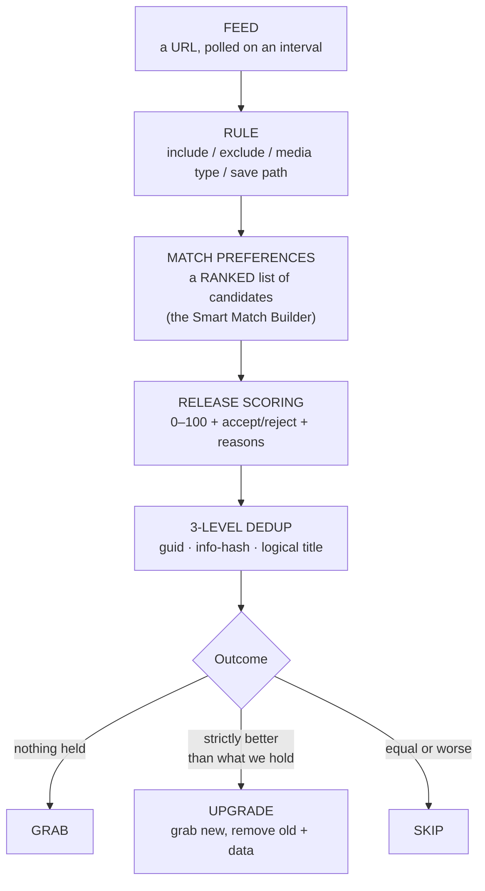
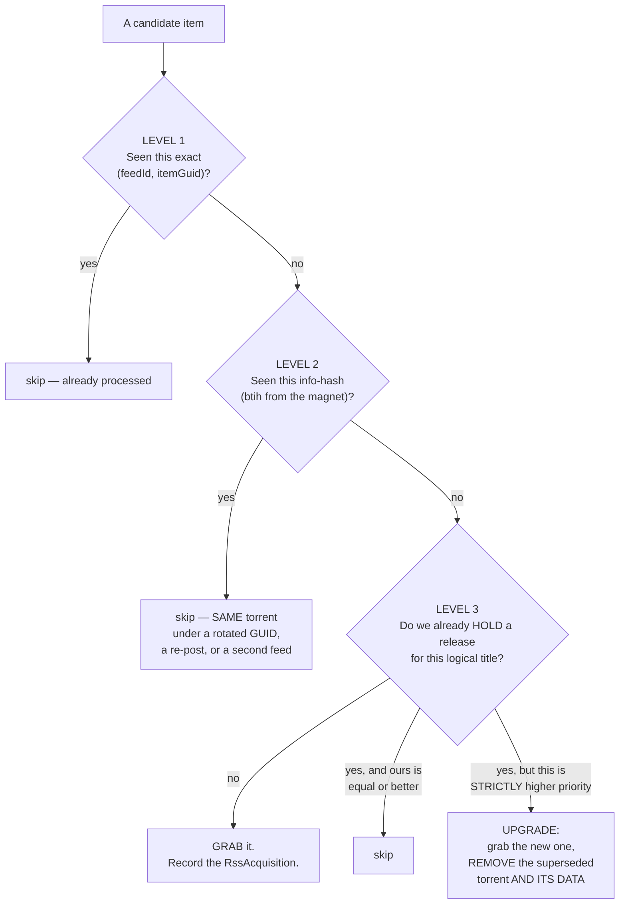

# Smart RSS Rules

**Level:** 🟣 Advanced · **Time:** ~60 minutes

Most people write RSS rules as a wall of regex, get flooded with duplicates, and
give up. UltraTorrent's rules are built differently: you express **preference**,
not pattern-matching, and the engine handles the rest.

## Overview



The mental shift: **regex decides what is eligible. Preferences decide what you
get.**

## Purpose

To build a rule that:

- Grabs exactly **one** release per movie or episode.
- Picks the **best available** one, not the first one.
- **Upgrades itself** when something genuinely better shows up.
- Never grabs the same thing twice, even across feeds, re-posts and rotated GUIDs.
- Can be tested before it ever downloads anything.

## When to use this tutorial

| Use it when… | Use something else when… |
| --- | --- |
| You want quality preferences applied consistently. | You want to *find* gaps in a series → [Automating TV shows](/learn/tutorials/automating-tv-shows). |
| Your rules are grabbing duplicates. | You want to search on demand → [Multiple indexers](/learn/tutorials/multiple-indexers). |
| You want automatic quality upgrades. | You are still getting a first download working → [Quick Start](/learn/quick-start). |

## Prerequisites

- [ ] A working install with an engine ([Quick Start](/learn/quick-start)).
- [ ] A library whose root will contain your rule's save path — otherwise nothing gets organised.
- [ ] Permissions: `rss.view`, `rss.manage`.
- [ ] An RSS feed URL you actually want to watch.
- [ ] Read [Core Concepts → Acquisition](/learn/concepts#acquisition-how-content-decides-to-arrive) first. This tutorial builds directly on it.

## Concepts

| Term | Meaning |
| --- | --- |
| **Feed** | A polled URL. The `rss_poll` job runs every **60 s** and fetches feeds whose refresh interval has elapsed. |
| **Rule** | Lives under a feed. Include/exclude regex, media type, category, save path, auto-download. |
| **Match candidate** | One entry in the rule's **ranked** preference list. |
| **Release identity** | `movie:<title>:<year>` or `ep:<title>:<season>:<episode>` — the key level-3 dedup works on. |
| **Info hash (`btih`)** | The torrent's identity, parsed out of the magnet. Level-2 dedup. |
| **`RssAcquisition`** | The record of "this rule currently holds *this* release for *that* logical title". |

---

## Step-by-step

### Step 1 — Add the feed

**RSS &amp; Acquisition → RSS Feeds** (`/rss`) → **Add feed**.

| Field | Value |
| --- | --- |
| Name | Yours |
| URL | The feed URL |
| Refresh interval | How often to poll it |
| Enabled | on |

**Expected result:** the feed appears and, after the next `rss_poll` tick (within 60
seconds of its interval elapsing), begins showing items.

:::info The 60-second tick is not your refresh interval
`rss_poll` runs every 60 seconds and fetches **only** the feeds whose own refresh
interval has elapsed. Setting a feed to 15 minutes does not make it poll every 60
seconds — it makes it poll every 15 minutes, checked every 60 seconds.
:::

:::note Screenshot needed
The **RSS Feeds** page (`/rss`) showing configured feeds with their refresh
intervals, enabled state, and rules underneath them.
:::


---

### Step 2 — Create the rule with auto-download **OFF**

This is the safety move that everyone should make and almost nobody does.

**Add rule** under the feed:

| Field | Value | Notes |
| --- | --- | --- |
| Name | e.g. `Dune Part Two` | Yours. |
| **Media type** | `movie` / `tv` / `anime` / … | For `tv`/`anime` this activates show-status awareness. |
| **Include regex** | What a candidate **must** match | Keep it broad. |
| **Exclude regex** | What a candidate must **not** match | Keep it narrow. |
| **Save path** | `/downloads/movies` | **Must be inside a library's root**, or nothing gets organised. |
| **Auto-download** | **OFF** ← for now | The rule records matches without grabbing them. |

Save, and let it run for a poll cycle or two.

**Expected result:** the rule's match history shows what it *would have* grabbed —
with nothing downloaded.

:::tip Auto-download OFF is also the "backfill rule" pattern
A rule with auto-download off keeps matching and recording forever without grabbing.
That is exactly what the `convert_rule_to_backfill` automation action does when a
show ends — it turns off `autoDownload` and keeps the rule.
:::

---

### Step 3 — Get the regex right (and keep it dumb)

The most common mistake is trying to encode **quality** in the regex. Do not. That
is what the preference list is for.

| Regex | Should express | Should **not** express |
| --- | --- | --- |
| **Include** | *Which title is this about?* | Which resolution / source / group you prefer. |
| **Exclude** | *What is categorically unacceptable?* (CAM, TS, a language you cannot read) | Anything you would merely rather avoid. |

A good include regex is broad enough to catch every release of the thing, and
nothing else. A good exclude regex is a short list of things you would never take
under any circumstances.

**Expected result:** the rule matches every release of your target, at every
quality, and nothing unrelated.

:::warning An over-tight exclude will silently starve the rule
If you exclude everything except one exact release string, the rule will find that
string or nothing at all — and you will never get an upgrade, because there is
nothing better it is allowed to see. Let the preference list do the choosing.
:::

---

### Step 4 — Build the preference list

Open the rule detail page (`/rss/rules/:ruleId`). This is where the **Smart Match
Builder** and **Match Preferences** live, along with a testing panel and match
history.

Build an **ordered** list of match candidates — best first:

```text
 1.  2160p · Remux · Dolby Vision · Atmos      ← ideal
 2.  2160p · WEB-DL · HDR10 · DD+ 5.1
 3.  1080p · BluRay · SDR · DTS-HD
 4.  1080p · WEB-DL · SDR · DD+ 5.1            ← perfectly fine
 5.  720p  · WEB-DL                            ← acceptable in a pinch
 —   (anything not on the list is not acceptable)
```

The list is **ranked**, and that ranking is what powers both the initial grab and
every future upgrade.

**Expected result:** the Match Preferences list is ordered exactly the way you would
choose by hand.

:::note Screenshot needed
The **RSS rule detail** page (`/rss/rules/:ruleId`) showing the **Smart Match
Builder** and the ranked **Match Preferences** list, with the candidate editor open.
:::


---

### Step 5 — Understand what the rule will now do

This is the heart of the tutorial. Three levels of deduplication run on **every**
candidate, in both live polling and backfill:



**Level 3 is the one that changes how you think.** A rule with a preference list
holds exactly **one release per logical title** — `movie:<title>:<year>` or
`ep:<title>:<season>:<episode>`. It grabs the best available so far, upgrades when
something strictly higher-priority appears, and skips everything equal or worse.

:::danger An upgrade DELETES the superseded torrent and its data
This is intentional and it is the whole point: you asked for the best release, so
holding two is pointless. But be aware:
- The old torrent is **removed from the engine**.
- Its **data is deleted**.
- If you hardlinked it into a library, the library copy survives (that is what
  hardlinks are for) — but the seeding copy is gone.

If you never want this, do not rank a better release above the one you hold, or
disable upgrades in the acquisition profile (`duplicateRules.allowUpgrades`).
:::

:::info If the title cannot be parsed, level 3 does not apply
Release identity is parsed from the name. An unparseable title falls back to plain
per-release behavior — so a rule matching weirdly named releases may hold more than
one. That is a graceful degradation, not a bug.
:::

---

### Step 6 — Test the rule before you arm it

The rule detail page has a **testing panel**. Use it against real feed items and
check that:

- The right releases match.
- The right ones are **ranked** highest.
- The junk is excluded.

Then go further: paste a candidate release name into the **Decision Simulator**
(`/media-acquisition/simulator`). It runs the entire acquisition pipeline —
identify → preferences → score → library comparison → upgrade rules — and renders
each stage as a clickable trace, **with no side effects at all**. Nothing is
persisted, no action is taken, nothing is downloaded.

**Expected result:** you can predict, with confidence, what the rule will do to any
given release.

:::note Screenshot needed
The **Decision Simulator** page (`/media-acquisition/simulator`) showing the
stage-by-stage trace for a pasted release name, ending in a decision with a reason
and confidence.
:::


---

### Step 7 — Turn auto-download on

Edit the rule and enable **Auto-download**.

**Expected result:** on the next poll, matching releases are grabbed — one per
logical title, best available — and appear on `/torrents`.

Watch `/rss` and the rule's match history for the first cycle. You should see grabs,
skips and (eventually) upgrades, each with a reason.

---

### Step 8 — Tune the score thresholds

Release Scoring gives every parsed release a **0–100 score** plus an accept/reject
decision with reasons and warnings. Your **acquisition profile** turns that score
into behaviour:

| Profile field | Effect |
| --- | --- |
| `minimumScore` | Below this → **`skip`**. |
| `approvalScore` | Below this → **`hold_for_approval`** (a human decides). |
| `qualityRules.waitForBetter` + `waitUntilScore` | The **wait policy**: a release that is ≥ minimum but < `waitUntilScore` becomes **`wait`** — deliberately held out on. |
| `duplicateRules.allowUpgrades` | Whether upgrades are permitted at all. |
| `automationRules.approvalRequired` | Force approval for **everything**. |

You can inspect and tune the scoring itself on **Release Scoring**
(`/release-scoring`).

:::tip `wait` is a feature, not a stall
If nothing is downloading and the Waiting queue is full, the engine is doing exactly
what you told it: the available releases are acceptable but not good enough, so it
is holding out for something better. Lower `waitUntilScore` if you would rather have
it now.
:::

**Expected result:** the Smart Download dashboard's queues (Approved · Pending
approval · **Waiting** · Pending upgrades · Rejected) reflect decisions you agree
with.

:::note Screenshot needed
The **Smart Download** dashboard (`/media-acquisition/dashboard`) showing the widget
grid — Approved, Pending approval, Waiting, Pending upgrades, Rejected, Missing
episodes, Missing movies, Watchlist — plus recent decisions.
:::


---

### Step 9 — Understand what counts as an upgrade

Upgrades are **multi-dimensional**, not resolution-only:

| Dimension | Best → worst |
| --- | --- |
| **Resolution** | 2160p → 1080p → 720p → 480p |
| **Source** | Remux → BluRay → WEB-DL → WEBRip → HDTV |
| **HDR** | Dolby Vision → HDR10+ → HDR10 → HLG → SDR |
| **Audio** | Atmos / DTS:X → TrueHD / DTS-HD → DD+ → DTS/DD → AAC |
| **Channels** | 7.1 → 5.1 → 2.0 |

When a candidate wins, the **winning dimensions surface in the decision reason** —
e.g. *"owned, lower quality (resolution 2160p > 1080p, HDR Dolby Vision > SDR)"*.

:::info Codec alone never triggers an upgrade
HEVC/AV1 vs AVC is a **scoring tiebreak only**. An x264 → x265 re-encode at the same
quality is not worth re-downloading, so it will never, on its own, cause an upgrade.
This is deliberate, and it is the single most common source of "why won't it upgrade
to the x265?" — the answer is: because that is not an upgrade.
:::

:::tip Watch this tutorial
_Video coming soon._
:::

---

## Examples

### A movie rule that behaves itself

| Setting | Value |
| --- | --- |
| Media type | `movie` |
| Include | broad — matches the title |
| Exclude | `CAM\|HDTS\|TELESYNC\|HDCAM` |
| Save path | `/downloads/movies` (inside the Movies library root) |
| Auto-download | on (after testing with it off) |
| Preferences | 2160p Remux DV → 2160p WEB-DL HDR10 → 1080p BluRay → 1080p WEB-DL |
| Profile | `allowUpgrades: true`, sensible `minimumScore` |

Result: it grabs the best it can find now, and quietly upgrades to the Remux when
one appears — removing the old torrent and its data.

### A rule that deliberately does **not** upgrade

Same as above, but set `duplicateRules.allowUpgrades: false` in the profile. It
grabs once, and never touches it again.

### A backfill-only rule

Auto-download **off**. It records every match forever and grabs nothing. Pair it
with the watchlist + [Missing Episodes](/learn/tutorials/automating-tv-shows) flow
for controlled acquisition.

---

## Troubleshooting

| Symptom | Cause | Fix |
| --- | --- | --- |
| Rule matches nothing | Include regex too tight, or the feed has no matching items. | Test in the rule's testing panel. Broaden the include. |
| Rule matches everything | Include regex too loose. | Tighten it — but keep quality out of it. |
| Duplicates keep arriving | The releases have **unparseable titles**, so level-3 dedup falls back to per-release. | Check that the release names parse to a release identity. |
| It grabbed then instantly deleted | An **upgrade** — a strictly higher-priority release appeared. | Working as designed. Reorder your preference list if you disagree. |
| It will not upgrade to the x265 | Codec is a tiebreak only, never an upgrade dimension. | This is intentional. |
| Nothing downloads; the Waiting queue is full | Your `waitUntilScore` is higher than anything available. | Lower it, or wait. |
| Everything lands in Pending approval | `approvalRequired`, or the score is below `approvalScore`. | Adjust the profile, or approve. |
| Grabs succeed but nothing is organised | The rule's **save path** is not inside an enabled library's root. | Fix the save path. |
| "Torrent URL resolves to a blocked internal address" | SSRF guard vs. a private-IP indexer. | Add the host to `SSRF_ALLOW_HOSTS` (keep `prowlarr`). |
| A TV rule refuses to save | The show is `ended` / `canceled`. | Confirm the override (it is audited), or use a backfill rule. |
| The feed stopped updating | The feed URL is dead or rate-limiting. | Watch for the `rss.feed_failed` notification event; check the feed history. |

---

## Tips

:::tip Always start with auto-download OFF
One poll cycle of "what *would* it have grabbed?" is worth an hour of cleanup.
:::

:::tip Keep the regex dumb and the preferences smart
Regex answers *"is this the right title?"*. Preferences answer *"is this the right
release?"*. Mixing them produces rules nobody can debug six months later.
:::

:::tip The Decision Simulator has zero side effects — abuse it
Nothing is persisted, no action runs, nothing downloads. Paste in every weird
release name you can find and read the trace.
:::

:::warning Upgrades delete data
Read the danger box in [Step 5](#step-5--understand-what-the-rule-will-now-do)
before you enable `allowUpgrades` on anything you care about.
:::

:::info One brain, two paths
Smart Download **consumes** the RSS module's Smart Match preference lists and the
Release Scoring engine as the source of truth. It orchestrates; it does not
duplicate. Tune quality once, and both RSS and missing-episode acquisition obey it.
:::

---

## FAQ

**Can one rule cover a whole TV show?**
Yes. Set media type `tv`, an include regex matching the show, and a preference list.
Level-3 dedup keys on `ep:<title>:<season>:<episode>`, so it holds one release *per
episode*.

**What happens if two feeds carry the same release?**
Level-2 dedup catches it by info-hash. It is grabbed once.

**Does a rotated GUID trick it?**
No — that is precisely what level 2 exists for.

**Why did it skip a release that looks better to me?**
Read the reason. It will name the stage: an exclude term, a score below minimum,
already owned at equal-or-better quality, or below the preference list entirely.
The Decision Simulator will show you the whole trace.

**Do RSS rules search indexers?**
No. **RSS feeds are not indexers.** RSS is polled and pushes items at your rules;
indexers are *searched* on demand, over Torznab/Newznab, by the acquisition
pipeline. Different subsystems.

**Can I get notified when a feed breaks?**
Yes — `rss.feed_failed` is a notification event. See
[Notifications and automation](/learn/tutorials/notifications-and-automation).

---

## Checklist

### Verification

- [ ] A feed exists and is polling.
- [ ] A rule exists with a **broad include** and a **narrow exclude**.
- [ ] Its **save path is inside a library's root**.
- [ ] I ran it with **auto-download OFF** for at least one cycle and reviewed the matches.
- [ ] A **ranked** Match Preferences list is built in the Smart Match Builder.
- [ ] I tested candidate names in the **Decision Simulator** and understood every trace.
- [ ] Auto-download is now **on**.
- [ ] The rule holds exactly **one** release per logical title.
- [ ] I know that an **upgrade deletes the superseded torrent and its data**.
- [ ] I know that a **codec change alone never upgrades**.
- [ ] The Smart Download queues (Waiting / Approvals / Upgrades / Rejected) look right.

### Expected results

| Screen | Expected |
| --- | --- |
| `/rss` | Feeds polling; rules matching |
| `/rss/rules/:id` | A ranked preference list + a sensible match history |
| `/media-acquisition/simulator` | A full trace for any release you paste |
| `/media-acquisition/dashboard` | Queues that reflect decisions you agree with |
| `/torrents` | One release per title, upgraded when something better lands |

### Next steps

1. [Multiple indexers](/learn/tutorials/multiple-indexers) — give the engine more to choose from.
2. [Notifications and automation](/learn/tutorials/notifications-and-automation) — react to `rss.feed_failed`, `rss.show.ended`, and grabs.
3. [Automating TV shows](/learn/tutorials/automating-tv-shows) — pair forward RSS with backward gap-filling.

---

## See also

- [RSS](/modules/rss) · [Smart Download](/modules/smart-download) · [Indexers](/modules/indexers)
- [Automation](/modules/automation) · [Media Manager](/modules/media-manager)
- [Workflows](/learn/workflows) — Workflow 3 is this rule, as a sequence diagram.
- [Core Concepts](/learn/concepts) — release identity, dedup levels, upgrade dimensions.
- [Troubleshooting](/operate/troubleshooting) · [Glossary](/help/glossary)
