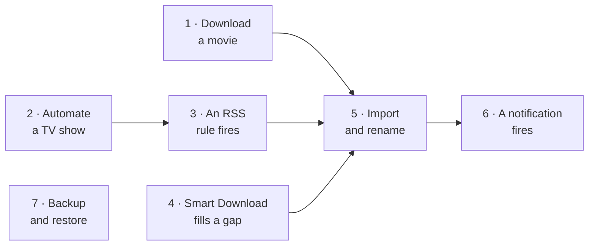
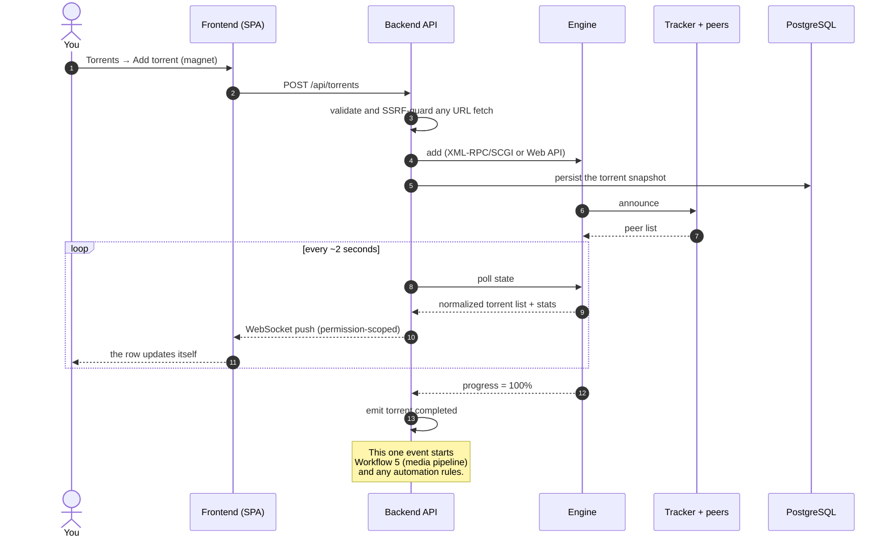
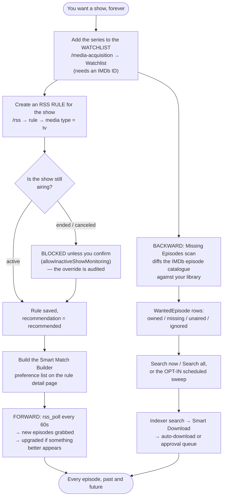
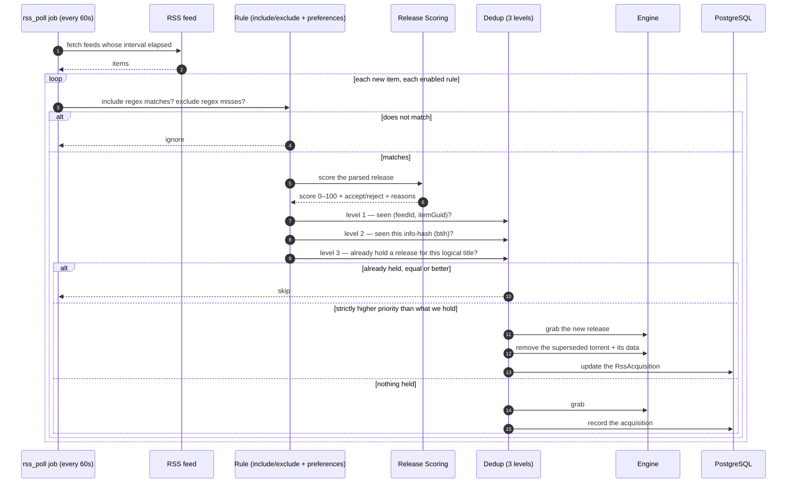
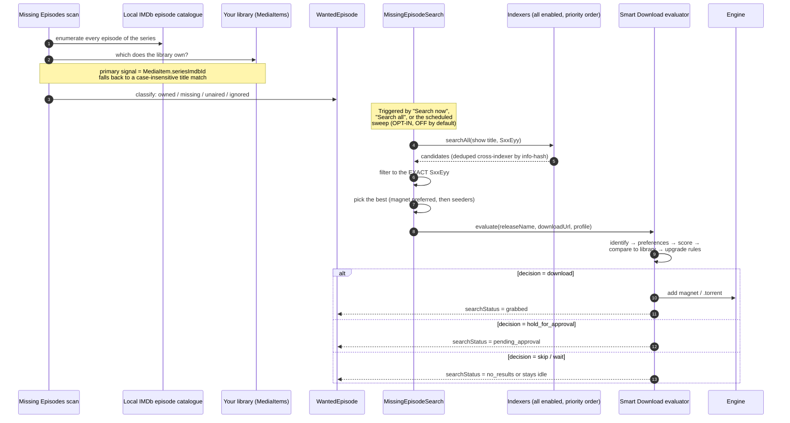
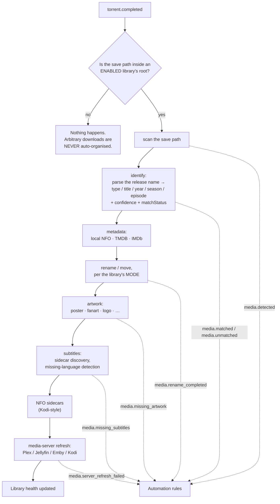
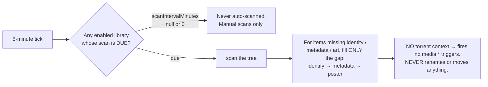
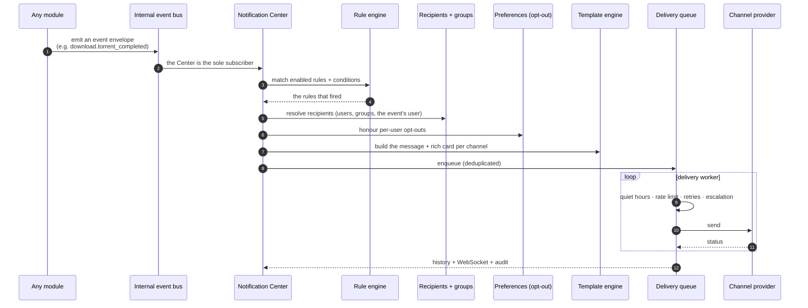
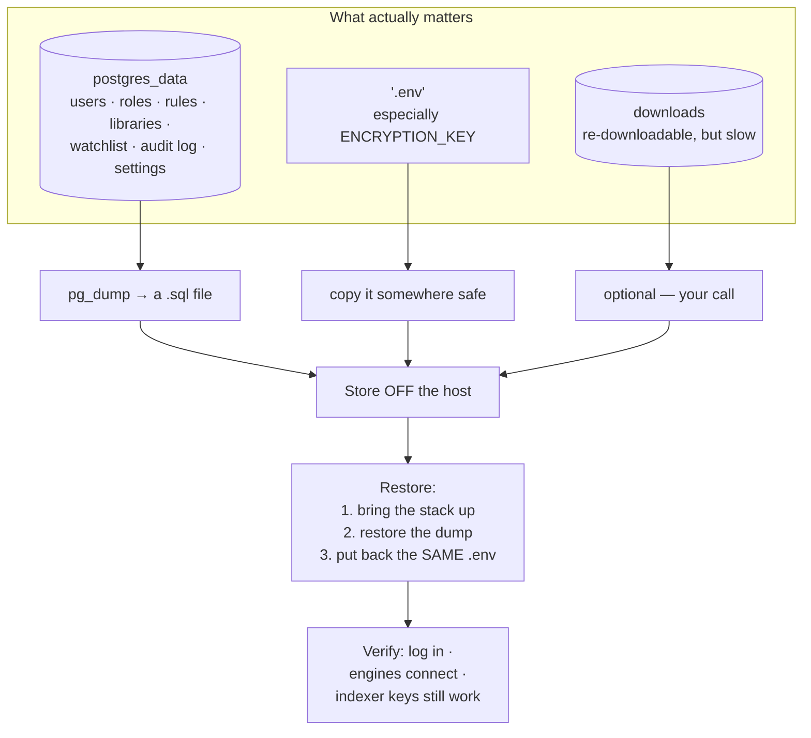

# Workflows

Seven flows. Each one is what *actually* happens, drawn end to end, with the
component that owns each step named.

Read the diagram first, then the notes underneath it. Between them they explain
almost every "why did it do that?" you will ever have.

## Overview



## Purpose

To give you a mental index. When something misbehaves, find the flow it belongs
to, walk the diagram, and the broken step will usually be obvious.

## When to use this page

- After [Core Concepts](/learn/concepts), to see the concepts in motion.
- While debugging, to isolate which step failed.
- Before building automation, to see what already happens for free.

## Prerequisites

- A working install ([Quick Start](/learn/quick-start)).
- The vocabulary from [Core Concepts](/learn/concepts).

---

## Workflow 1 — Downloading a movie

The simplest flow, and the foundation of every other one.



**Notes**

- The browser **never** touches the engine. Everything is normalized server-side.
- Adding by **URL** is fetched by the backend through an SSRF guard — a private-IP
  indexer must be listed in `SSRF_ALLOW_HOSTS`.
- `torrent.completed` is **edge-triggered** (progress crosses 100% on a live tick)
  **and backfilled** (`reconcileCompleted` re-evaluates torrents already complete
  that never crossed that edge — finished while the app was down, or a rule created
  afterwards). A success ledger keeps it idempotent, so each rule runs **once per
  torrent**.

:::note Screenshot needed
The **Torrents** page (`/torrents`) mid-download, showing a live progress bar and
the aggregate rates in the top bar.
:::


---

## Workflow 2 — Automating a TV show

You never want to think about a show again. Two mechanisms can do that, and they
are complementary:

| Mechanism | Fires when | Good at |
| --- | --- | --- |
| **RSS rule** | A new item shows up in a feed (polled every 60s) | *Forward* acquisition — tonight's episode, minutes after it is posted. |
| **Smart Download + Missing Episodes** | A scan finds a gap between the IMDb catalogue and your library | *Backward* acquisition — the 43 episodes you never had. |

Use both. Together they cover the whole timeline.



**Notes**

- A series is **monitored** once it is on the watchlist **with an IMDb ID**. Use the
  **Add from library** picker on the Missing Episodes page rather than typing IDs.
- Missing-episode auto-search (`autoSearchMissing`) is **opt-in and off by default**.
  Manual **Search now** / **Search all** always work.
- If the show later **ends**, the background status-refresh job tells you — and
  emits `rss.show.ended` — but it **never disables your rule**. That is your call.

Full walkthrough: [Automating TV shows](/learn/tutorials/automating-tv-shows).

:::note Screenshot needed
The **RSS** page (`/rss`) rule dialog with the Media type selector set to `tv` and
the live **ShowStatusPanel** visible (status badge, recommendation banner, provider
and confidence, next/last-episode dates, poster).
:::


---

## Workflow 3 — An RSS rule fires

This is the flow people most often misread, because of the three-level
deduplication.



**Notes**

- **Level 3 is the one that surprises people.** A rule with a preference list holds
  exactly **one release per logical title** (`movie:<title>:<year>` or
  `ep:<title>:<season>:<episode>`). It grabs the best available, *upgrades* when
  something strictly better appears (removing the old torrent **and its data**),
  and skips anything equal or worse.
- If a release title cannot be parsed into a release identity, level 3 falls back
  to plain per-release behavior.
- All three levels are enforced in **both** live polling and backfill.
- **Auto-download off** turns the rule into a recorder: matches are logged, nothing
  is grabbed. That is also what the `convert_rule_to_backfill` automation action
  does.

Full walkthrough: [Smart RSS rules](/learn/tutorials/smart-rss-rules).

:::note Screenshot needed
The **RSS rule detail** page (`/rss/rules/:ruleId`) showing the **Smart Match
Builder** with a ranked preference list of match candidates.
:::


---

## Workflow 4 — Smart Download acquires a missing episode

Detection and downloading are two separate halves. Indexer search is the bridge.



**Notes**

- `searchStatus` walks `idle → searching → grabbed | pending_approval | no_results | failed`
  and is **preserved across rescans** (like your `ignored` overrides), so a grabbed
  episode is never re-searched. It clears once the episode is owned.
- Duplicate-grab safety is layered: `searchStatus` excludes grabbed/pending rows ·
  a `lastSearchedAt` backoff · a re-entrancy guard on the sweep · cross-indexer
  dedup by info-hash · and the evaluator's own **owned** check.
- A candidate only matches when its scene title **parses to the show name**. A show
  known by a different alias may be skipped rather than mis-grabbed.

:::caution Limits worth knowing
Automatic search is **episode-only** today — `WantedMovie` rows carry the same
grab-state columns, but there is no automatic movie search yet. Smart Download's
**automation triggers** and **per-user decision notifications** are also not wired
yet, and `replace_existing` exists as a decision type but is not emitted.
:::

:::note Screenshot needed
The **Missing Episodes** page (`/media-acquisition/missing-episodes`) showing a
series expanded into its season/episode grid, with per-episode **Search now**
buttons and `searchStatus` badges.
:::


:::note Screenshot needed
The **Decision Simulator** page (`/media-acquisition/simulator`) rendering the
decision pipeline for a pasted release name, with each trace step clickable.
:::


---

## Workflow 5 — Media import and rename

What turns "a download" into "a library".



**Notes**

- **Each stage is isolated.** A failure in one never aborts the rest, and the
  handler never throws (which protects the engine sync loop).
- The library's **`kind`** (`tv`/`anime`/`movie`) is **authoritative** over the
  filename for the movie/tv/anime axis. A folder like `9-1-1 (2018)` in a `tv`
  library is not mis-read as a movie. Only `general` libraries guess from filenames.
- For episodic layouts (`Show/Season NN/episode`), the **series title comes from the
  show folder**, not the filename — which is what stops a show fragmenting into one
  item per episode.
- Every dotted arrow is a real **automation trigger** you can hang your own rules on.

### There is also a periodic scan — and it behaves differently



That is deliberate: a routine scan **enriches in place**. Renaming stays the
download organiser's job. Only gaps are filled, so steady-state scans do almost no
work and never re-hammer the metadata providers.

:::note Screenshot needed
The **Media Dashboard** (`/media`) showing library health — unmatched items,
missing artwork, missing subtitles, duplicates.
:::


---

## Workflow 6 — A notification fires

Nothing about notifications is hardcoded. **Every** notification is a rule you own.



**Available channels**

| Channel | Backend | Rendering |
| --- | --- | --- |
| **Email** | SMTP | Responsive HTML card (poster, badges, buttons) + plain text |
| **Telegram** | Bot API | Photo + Markdown caption + inline-keyboard buttons |
| **SMS** | Twilio | Concise plain text |
| **WhatsApp** | Twilio | Rich text + poster media |

**Events you can build rules on** include downloads (`download.torrent_completed`,
`download.torrent_failed`, `download.stalled`, `download.ratio_reached`), RSS
(`rss.feed_failed`, `rss.rule_matched`, `rss.new_episode_available`), media
(`media.renamed`, `media.missing_subtitles`, `media.missing_episode_filled`,
`media.library_scan_completed`), media servers
(`media_server.user_started_watching`, `media_server.server_offline`), and system
(`system.disk_space_low`, `system.failed_login`, `system.new_login`,
`system.update_available`).

**The pages you will use**

| Page | Route | For |
| --- | --- | --- |
| Notification Center | `/notifications` | The dashboard. |
| Channels | `/notifications/channels` | Configure Email/Telegram/SMS/WhatsApp. Secrets encrypted at rest. |
| Rules | `/notifications/rules` | Event → conditions → channels → recipients. |
| Recipients | `/notifications/recipients` | Who gets what. |
| Delivery History | `/notifications/history` | Proof it went out (or why it did not). |

Full walkthrough: [Notifications and automation](/learn/tutorials/notifications-and-automation).

:::note Screenshot needed
The **Notification Rules** page (`/notifications/rules`) with a rule open, showing
the event selector, conditions, channels and recipients.
:::


---

## Workflow 7 — Backup and restore

The least exciting workflow and the only one whose absence will ruin your week.



### Back up

```bash
# The database — this is the one that matters.
docker compose exec -T postgres \
  pg_dump -U ultratorrent ultratorrent > backup-$(date +%F).sql

# The secrets. Without ENCRYPTION_KEY the dump's encrypted columns are unreadable.
cp .env env-backup-$(date +%F)
```

:::danger `ENCRYPTION_KEY` and the database are one unit
`ENCRYPTION_KEY` is what decrypts the encrypted columns in that dump — 2FA/TOTP
secrets, indexer API keys, media-server tokens, notification credentials.
**A database restored without its matching key has a lot of unreadable secrets in
it.** Back them up together, restore them together, and store them somewhere that
is not the host you are backing up.
:::

### Restore

1. Bring up a stack with the **same `.env`** (same `ENCRYPTION_KEY`, same
   `POSTGRES_PASSWORD`).
2. Restore the dump into the fresh database.
3. Start the backend. It runs `prisma migrate deploy` on boot.
4. Verify, in this order: **log in** → **engines connect** → **an indexer Test still
   passes** (that proves the encrypted keys decrypted correctly).

:::warning Migrations are forward-only
If an upgrade goes wrong, you restore the **pre-upgrade** backup — you do not roll
a migration back. Take the backup *before* you upgrade, every time. See
[Upgrading](/install/upgrading).
:::

Full procedure, including scheduling and retention: [Backup &amp; restore](/operate/backup).

:::tip Watch this tutorial
_Video coming soon._
:::

---

## Examples

### Which workflow owns my problem?

| Symptom | Workflow | Start looking at |
| --- | --- | --- |
| Torrent stuck at 0% | 1 | Engine, tracker, peers |
| New episodes never grabbed | 2, 3 | Rule regex, feed interval, show status |
| The same episode grabbed twice | 3 | Release identity parsing (level-3 dedup) |
| An old episode never fills in | 4 | Watchlist IMDb ID, indexer results, `autoSearchMissing` |
| Files downloaded but never renamed | 5 | Library root vs. save path; library enabled? |
| I never hear about anything | 6 | Notification rules, channels, recipients |
| I lost everything | 7 | You did take a backup, right? |

---

## Troubleshooting

| Symptom | Likely workflow step | Fix |
| --- | --- | --- |
| Rule matches but never grabs | Workflow 3, dedup level 3 | You already hold an equal-or-better release for that logical title. Check the rule's acquisitions. |
| Rule grabs then immediately removes | Workflow 3 | That is an **upgrade** — a strictly higher-priority release appeared and superseded the old one. Working as designed. |
| Missing episode search finds nothing | Workflow 4 | The show's scene title does not parse to your watchlist title (an alias), or no indexer carries it. |
| Everything is `pending_approval` | Workflow 4 | Your acquisition profile has `approvalRequired`, or the score is below `approvalScore`. |
| Media stays `unmatched` | Workflow 5 | Poor release name. Fix on `/media/unmatched`, or improve the source naming. |
| Notification rule never fires | Workflow 6 | Wrong event name, an unmet condition, no recipient resolved, or the user opted out. Check **Delivery History**. |
| Restored DB, but indexers all fail | Workflow 7 | Wrong `ENCRYPTION_KEY`. The encrypted keys cannot be decrypted. |

---

## Tips

:::tip Read the trace, do not guess
Every Smart Download decision persists its **full trace**. The **Decision
Simulator** (`/media-acquisition/simulator`) replays the whole pipeline for any
release name with **zero side effects**. It will tell you exactly why something was
chosen or rejected in less time than it takes to form a theory.
:::

:::tip Delivery History is the notification equivalent
`/notifications/history` shows whether a message was queued, sent, retried or
failed — and why. Check it before assuming a rule did not fire.
:::

:::info Everything mutating is audited
Actor, IP, user agent and result, on **Administration → Audit Log** (`/audit`).
Including the show-status override on an ended series.
:::

---

## FAQ

**Do RSS rules and Smart Download fight each other?**
No — they share the same brains. Smart Download **consumes** the RSS module's
Smart Match preference lists and the Release Scoring engine as the source of truth.
It orchestrates; it does not re-implement quality preferences.

**Why did an RSS upgrade delete my torrent?**
Because it superseded it. Level-3 dedup holds one release per logical title: when a
strictly higher-priority release appears, it grabs the new one and removes the
old torrent **and its data**. If you do not want that, do not rank the better
release above the one you have.

**Can I run the media pipeline on files I did not download?**
Yes — that is what the **periodic library scan** is for. It enriches externally
dropped folders in place. But note it **never renames or moves**, and fires no
`media.*` triggers.

**What is the smallest useful backup?**
`pg_dump` + your `.env`. Everything else is re-downloadable.

---

## Checklist

- [ ] I can name the event that starts the media pipeline (`torrent.completed`).
- [ ] I can name the three levels of RSS deduplication.
- [ ] I know that missing-episode auto-search is **opt-in and off by default**.
- [ ] I know that the periodic library scan **never renames**.
- [ ] I know that notifications are **entirely rule-driven** — nothing is hardcoded.
- [ ] I have taken a `pg_dump` **and** backed up `.env` with `ENCRYPTION_KEY`.
- [ ] I have restored that backup at least once, somewhere disposable, and verified an indexer **Test** still passes.

### Expected results

| Verification | Expected |
| --- | --- |
| Add a torrent inside a library root, wait | It is renamed and appears in the media server. |
| Paste a release name into the Decision Simulator | A full, clickable trace with a decision and a reason. |
| Trigger a notification rule | A row in **Delivery History** with a `sent` status. |
| Restore your backup on a clean stack | You can log in, and an indexer **Test** passes. |

### Next steps

Pick the flow you want to own and go deep:

1. [Building a movie library](/learn/tutorials/building-a-movie-library) → Workflow 5
2. [Automating TV shows](/learn/tutorials/automating-tv-shows) → Workflows 2 + 4
3. [Smart RSS rules](/learn/tutorials/smart-rss-rules) → Workflow 3
4. [Notifications and automation](/learn/tutorials/notifications-and-automation) → Workflow 6

---

## See also

- [Torrents](/modules/torrents) · [RSS](/modules/rss) · [Smart Download](/modules/smart-download)
- [Missing Episodes](/modules/missing-episodes) · [Indexers](/modules/indexers)
- [Media Manager](/modules/media-manager) · [Automation](/modules/automation)
- [Notification Center](/modules/notification-center) · [Audit](/modules/audit)
- [Backup &amp; restore](/operate/backup) · [Upgrading](/install/upgrading)
- [Troubleshooting](/operate/troubleshooting) · [Glossary](/help/glossary)
