# API Keys

## Overview

**API keys** are UltraTorrent's mechanism for long-lived programmatic access — the thing you would give a script instead of your password.

The module (id `api_keys`, core, permission `apikeys.manage`) can **issue** a key, **list** your keys, and **revoke** one. The cryptography is sound: keys are generated with real entropy, only an Argon2id hash is stored, and the secret is shown exactly once.

:::danger An API key is not yet accepted as a credential
This is the most important thing on this page, and you need to know it before you build anything.

**There is no header, no guard, and no auth strategy that accepts an API key on a request.** Keys can be created, listed, and revoked — but **no route will authenticate you with one**. Every route in the product authenticates via a **JWT bearer token**, obtained from `POST /api/auth/login`.

Issuing a key today gives you a well-formed, well-stored credential that **nothing checks**. If you are automating against UltraTorrent right now, use the JWT flow — see [Authentication](/develop/authentication) and the [API reference](/reference/api).
:::

The rest of this page documents what the module genuinely does, and is explicit about what it does not, so you can plan accordingly.

## Why / when to use it

Today, the honest answer is: **for forward compatibility, and not much else.**

The intended future use — a script, a cron job, a home-automation integration authenticating without a human — is what the module is being built toward. The issue/revoke half exists and is correct. The *accept-on-request* half does not.

**For automation today, use JWT authentication.** Log in with a dedicated, least-privilege user account, hold the access token, and refresh it. See the walkthrough below.

## Prerequisites

- The `apikeys.manage` permission. Note that **Power User does not have it** — only Administrator and Super Admin do by default.
- **A REST client.** There is **no frontend UI for API keys anywhere in the application.** Keys can only be created via the REST API.

## Concepts

**Prefix** — the public, non-secret half of the key: `ut_` followed by 12 hex characters (e.g. `ut_a1b2c3d4e5f6`). It is unique, it identifies the key, and it is safe to log or display.

**Secret** — 24 random bytes, base64url-encoded (192 bits of entropy). **Only its Argon2id hash is stored.**

**The key** — what you actually hold: `<prefix>.<secret>`. It is returned **once**, from the create call, and never again. `GET /api/api-keys` returns the id, name, prefix, scopes, `lastUsedAt`, `revokedAt`, and `createdAt` — never the secret, and never the hash.

**Revocation** — **soft**. `DELETE` sets `revokedAt`. Rows are never hard-deleted (except when the owning user is). You can only revoke **your own** keys.

## How it works

```mermaid
flowchart TD
    subgraph Today["What works today"]
      C[POST /api/api-keys<br/>name + scopes]
      C --> G[prefix = ut_ + 12 hex<br/>secret = 24 random bytes<br/>base64url · 192 bits]
      G --> H[Store ONLY argon2id&#40;secret&#41;]
      G --> R["Return &lt;prefix&gt;.&lt;secret&gt; ONCE"]
      H --> DB[(api_keys)]
      C --> EV[Emit system.api_key_created<br/>keyName · prefix · userId · scopes<br/>NEVER the secret]
      DB --> L[GET /api/api-keys<br/>id · name · prefix · scopes ·<br/>lastUsedAt · revokedAt · createdAt]
      DB --> RV[DELETE /api/api-keys/:id<br/>soft: sets revokedAt]
    end

    subgraph NotYet["What does NOT exist"]
      USE[A request carrying an API key]
      USE -.-> NOG[No header is read.<br/>No guard verifies keyHash.<br/>No auth strategy accepts it.]
      NOG -.-> REJ[401 Unauthorized]
    end

    subgraph Works["Use this instead"]
      LOGIN[POST /api/auth/login] --> JWT[accessToken · 15m]
      JWT --> BEARER[Authorization: Bearer &lt;accessToken&gt;]
      BEARER --> OK[Authenticated]
      REF[POST /api/auth/refresh] -.on expiry.-> JWT
    end

    style NotYet fill:#3a2020,stroke:#b04040,color:#eee
    style REJ fill:#3a2020,stroke:#b04040,color:#eee
```



## Configuration

### Endpoints

| Method | Path | Permission |
|--------|------|-----------|
| GET | `/api/api-keys` | `apikeys.manage` |
| POST | `/api/api-keys` | `apikeys.manage` |
| DELETE | `/api/api-keys/:id` | `apikeys.manage` |

### Fields

| Field | Behaviour |
|-------|-----------|
| `name` | Free text. What the key is for. |
| `scopes[]` | An array of strings, defaulting to `[]`. **Stored and echoed back, but never validated against the permission catalog and never enforced anywhere.** |
| `expiresAt` | **Not implemented.** The database column exists, but it is never set, never exposed in the create DTO, and never checked. |
| `lastUsedAt` | The column exists and is returned, but **nothing ever writes it** — because nothing ever authenticates with a key. |
| `revokedAt` | Set by `DELETE`. Soft revocation. |

:::caution Three fields are cosmetic today
`scopes`, `expiresAt`, and `lastUsedAt` all exist in the data model and are returned by the API, but **none of them do anything**. Scopes are not enforced, expiry is not checked, and last-used is never written.

They are documented here so you are not misled by seeing them in a response.
:::

## Step-by-step walkthrough

### Issuing a key (which works)

There is no UI, so use the API. Authenticate with a JWT first.

```bash
# 1. Log in to get a JWT
TOKEN=$(curl -s -X POST https://ultratorrent.example.com/api/auth/login \
  -H 'Content-Type: application/json' \
  -d '{"username":"admin","password":"..."}' | jq -r .accessToken)

# 2. Create the key (needs apikeys.manage)
curl -s -X POST https://ultratorrent.example.com/api/api-keys \
  -H "Authorization: Bearer $TOKEN" \
  -H 'Content-Type: application/json' \
  -d '{"name":"backup-script"}'
```

The response contains `{ prefix, key, name }`. **`key` is shown once.** Store it now, in a secret manager. There is no way to retrieve it later.

```bash
# 3. List your keys (the secret is never returned)
curl -s https://ultratorrent.example.com/api/api-keys \
  -H "Authorization: Bearer $TOKEN"

# 4. Revoke one
curl -s -X DELETE https://ultratorrent.example.com/api/api-keys/<id> \
  -H "Authorization: Bearer $TOKEN"
```

### Authenticating a script today (what you should actually do)

Since a key will not authenticate you, use the **JWT flow** with a dedicated user:

1. **Create a user for the script**, with the **lowest role that works** — see [Users & Roles](/modules/users). Do not use your admin account.
2. `POST /api/auth/login` → you get an `accessToken` (**15 minutes**) and a `refreshToken` (**30 days**).
3. Send `Authorization: Bearer <accessToken>` on every request.
4. When the access token expires, `POST /api/auth/refresh`. Tokens **rotate**, so store the new refresh token each time.

:::warning Refresh tokens rotate and detect reuse
If your script stores a refresh token and then replays an **old** one, the system treats it as theft and **revokes the entire token family** — logging out that script entirely. Always persist the newest refresh token from every refresh response.
:::

Rate limits apply: `/api/auth/login` is **5/min**, `/api/auth/refresh` is **20/min**, and everything is under a global **120 requests / 60 s**.

## Screenshots

:::note Screenshot needed
There is currently **no frontend UI for API keys** — keys can only be managed via the REST API. When a UI ships, capture it at **Settings → API Keys**.
:::


:::tip Watch this tutorial
_Video coming soon._
:::

## Real-world examples

### A nightly backup script

You want a cron job to hit `/api/system/health` and alert if a disk is low.

**Do not** issue an API key for this — it will not authenticate. Instead: create a user with the **Read-Only** role, log in from the script, hold the access token, refresh it when it expires, and call the endpoint with a bearer token. Store the newest refresh token after every refresh.

### Preparing for API-key auth before it lands

If you want to be ready: issue the key now (`POST /api/api-keys`), name it after the consumer, and store the secret in your secret manager. When key authentication ships, the credential is already provisioned and already audited (`system.api_key_created` is emitted on creation, carrying the key name, prefix, user, and scopes — **never the secret**). Until then, wire the script with JWT.

## Troubleshooting

| Symptom | Cause | Fix |
|---------|-------|-----|
| A request with an API key returns `401` | **API keys are not accepted as a credential.** No header is read, no guard verifies the stored hash, and no auth strategy exists for them. | Use the JWT bearer flow. See [Authentication](/develop/authentication). |
| I cannot find API keys in the UI | **There is no API-key UI.** | Use the REST API. |
| I lost the key secret | It is stored only as an **Argon2id hash**. It cannot be recovered — not by you, not by an administrator, not from the database. | Revoke the key and issue a new one. |
| Power User cannot create a key | `apikeys.manage` is not in the Power User role. | Assign Administrator, or have an admin issue it. |
| My key's `expiresAt` never takes effect | **Expiry is not implemented.** The column exists but is never set and never checked. | Rotate keys manually. Revoke old ones. |
| Scopes do not restrict anything | **Scopes are not enforced.** They are stored and echoed, nothing more. | Do not rely on them. Use a least-privilege *user* for automation instead. |
| `lastUsedAt` is always null | Nothing writes it — because nothing authenticates with a key. | Expected. |

## Best practices

- **For automation today, use a dedicated least-privilege user + the JWT flow.** Not the seeded admin, and not an API key.
- **Store the key secret in a secret manager the moment it is returned.** There is exactly one chance.
- **Name keys after their consumer.** `backup-script`, not `key1`. When you come to revoke, you want to know what you are breaking.
- **Revoke keys you are not using.** Revocation is soft and free.
- **Do not depend on `scopes` or `expiresAt`.** They are not enforced.
- **Persist the newest refresh token** on every refresh, or reuse detection will log your script out.

## Common mistakes

- **Building an integration around an API key** and discovering, at deployment, that every request returns `401`. Read the danger box at the top of this page.
- **Assuming scopes limit a key.** They do not.
- **Assuming `expiresAt` will expire a key.** It will not.
- **Looking for the UI.** There is not one.
- **Replaying an old refresh token** in a script, and having the whole token family revoked.
- **Automating as the seeded `admin` user**, which destroys audit attribution and gives the script far more power than it needs.

## FAQ

**Can I authenticate a request with an API key?**
**No — not today.** No route accepts one. Every route authenticates via a JWT bearer token. This is a known and documented gap.

**Then what is the module for?**
Issuing, listing, and revoking keys — the storage half of the feature, built correctly, ahead of the authentication half.

**How is the key stored?**
Only an **Argon2id hash** of the secret. The prefix (`ut_` + 12 hex) is stored in the clear, because it is public and identifies the key.

**Is the secret ever logged or emitted?**
No. Creation emits `system.api_key_created` onto the notification bus with the key **name, prefix, user id, and scopes** — deliberately **never** the secret.

**Can I revoke someone else's key?**
No. Revocation is scoped to your own `userId`.

**Do scopes do anything?**
No. They are stored and returned but never validated against the permission catalog and never enforced.

**What should I use instead?**
A **dedicated user account with the lowest role that works**, and the JWT login/refresh flow. That gives you real RBAC enforcement, real audit attribution, and revocation (by deactivating the user, which instantly kills every session).

## Checklist

- [ ] Issue a key via `POST /api/api-keys`. Expected: `{ prefix, key, name }`, with `key` shown **once**.
- [ ] List your keys. Expected: the prefix is present; the secret and the hash are **not**.
- [ ] Try to authenticate a request with the key. Expected: **`401`** — confirming, for yourself, that key auth is not wired.
- [ ] Log in via `POST /api/auth/login` and call the same endpoint with the bearer token. Expected: it works.
- [ ] Revoke the key. Expected: `revokedAt` is set; the row is not deleted.
- [ ] Confirm `system.api_key_created` fired. Expected: it carries the name, prefix, user, and scopes — and **not** the secret.

## See also

- [Authentication](/develop/authentication) — the JWT flow you should actually use.
- [Users & Roles](/modules/users) — creating a least-privilege user for a script.
- [API reference](/reference/api) — every endpoint.
- [Permissions reference](/reference/permissions)
- [Security](/operate/security)
